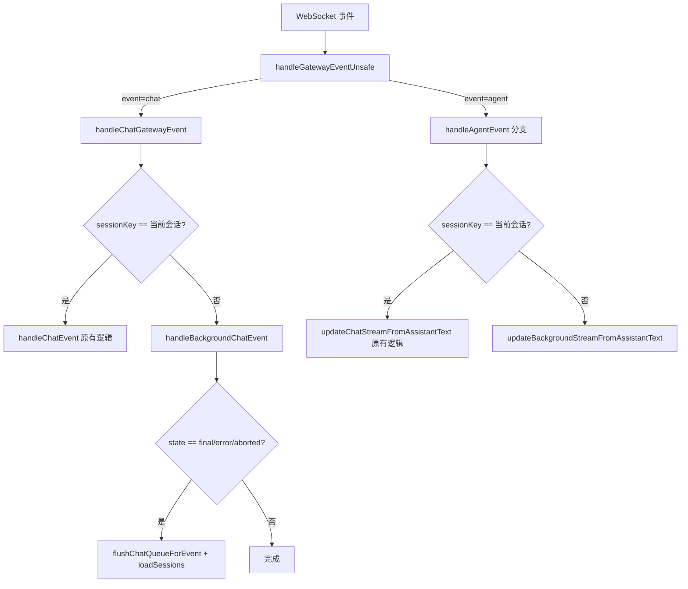
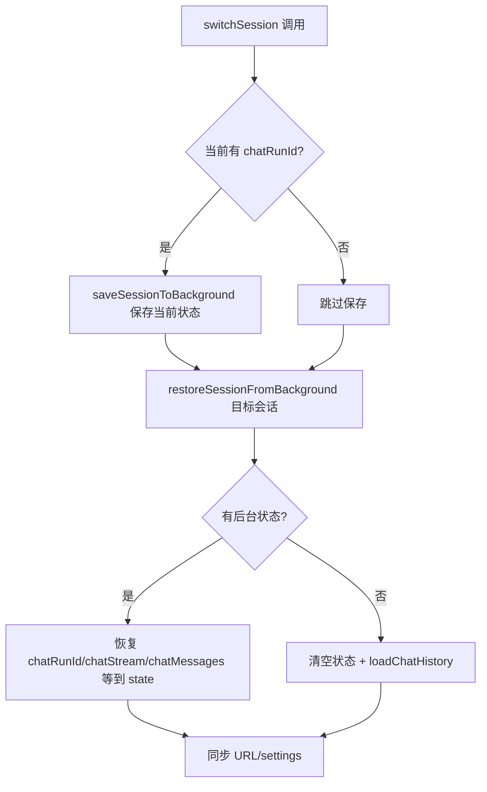

## 用户需求

实现 Web UI 的多会话并发执行功能：切换对话或新建对话时，原来正在执行的会话不中断，多个会话可以同时接收后台数据流且彼此不干扰。

## 产品概述

当前 Web UI 的聊天状态（流式内容、消息列表、运行 ID 等）是全局单例的，切换会话时会清空所有状态，且事件路由会丢弃非当前会话的事件。需要将聊天状态改造为 per-session 隔离，使得多个会话可以同时在后台接收数据流、保持完整的流式内容，切换回来时无缝恢复。

## 核心功能

1. **会话状态保存与恢复**：切换会话时，将当前会话的完整聊天状态（流式内容、消息、运行 ID 等）保存到后台 Map，切换目标若有后台状态则恢复
2. **事件路由分发**：WebSocket 事件不再丢弃非当前会话的 chat/agent 事件，而是路由到对应的后台会话状态处理
3. **后台会话可视指示**：侧边栏会话列表中，有活跃后台运行的会话显示运行中指示器
4. **统一会话切换入口**：将分散在 4 处的会话切换逻辑统一到 `switchSession()` 函数，确保保存/恢复逻辑一致

## 技术栈

- 前端框架：LitElement (TypeScript, ESM)
- 状态管理：LitElement `@state()` 装饰器触发响应式更新
- 已有基础设施：`background-sessions.ts` 模块（279 行，已有完整测试覆盖），提供 `saveSessionToBackground`、`restoreSessionFromBackground`、`handleBackgroundChatEvent`、`updateBackgroundStreamFromAssistantText` 等函数

## 实现方案

**策略**：复用已编写但尚未集成的 `background-sessions.ts` 模块，在事件路由层和会话切换层接入其 API，将聊天状态从"全局单例清空式"改为"保存-恢复-后台处理式"。

**工作原理**：

1. 事件路由层（`app-gateway.ts`）接收到 chat/agent 事件时，先判断 `sessionKey`；若匹配当前会话则走原有逻辑，否则路由到 `handleBackgroundChatEvent()` / `updateBackgroundStreamFromAssistantText()` 处理
2. 会话切换时（`switchSession`），先用 `saveSessionToBackground()` 保存当前活跃会话状态，再用 `restoreSessionFromBackground()` 尝试恢复目标会话的后台状态
3. 侧边栏渲染时调用 `hasActiveBackgroundRun()` 显示运行指示器

**关键技术决策**：

- **复用 background-sessions 模块而非 Map 化所有 @state() 属性**：将所有 `@state()` 改为 Map 下标访问是巨大的重构（涉及所有消费 chatStream/chatMessages 的渲染代码）。background-sessions 模块通过 module-level Map 保存/恢复快照，只修改切换和事件路由两个边界点，侵入性最小
- **后台会话 delta 事件在 Map 中累积而非触发 UI 渲染**：只有当前 sessionKey 对应的状态挂在 `@state()` 上，后台会话的 delta 更新只修改 module-level Map 中的普通对象，不触发 LitElement 重渲染，零性能开销
- **终态事件（final/error/aborted）后自动清除后台条目**：`handleBackgroundChatEvent` 已实现此逻辑，run 完成后从 Map 删除，切换回时通过 `loadChatHistory` 拿到完整的持久化消息
- **最多 5 个后台会话**：已有 LRU 淘汰机制，防止内存无限增长

## 实现注意事项

### 性能

- 后台会话的 delta 事件处理仅修改 plain object，**不触发** LitElement 响应式更新，无额外渲染开销
- 侧边栏的运行指示器通过 `hasActiveBackgroundRun()` 查询 Map（O(1)），不引入额外的状态轮询
- 现有的 throttle 缓冲机制（`throttleStates` Map）已按 sessionKey 隔离，无需改动

### 回归防护

- 统一 4 处会话切换入口（`switchSession`、`select onChange`、`resetChatStateForSessionSwitch`、`onSessionKeyChange`）到同一个 `switchSession()` 函数，消除逻辑分歧
- `handleChatEvent` 中 `payload.sessionKey !== state.sessionKey` 的过滤不删除，改为在上游 `handleChatGatewayEvent` 先拦截非当前会话事件路由到后台处理，当前会话事件仍走原有路径
- WebSocket 重连时（`onHello`）调用 `clearAllBackgroundSessions()` 清除所有后台状态，避免与服务端状态不一致

### 向后兼容

- 不改变 `background-sessions.ts` 的公开接口（已有测试覆盖）
- 不改变后端 API 协议
- 不改变 `@state()` 属性的类型定义

## 架构设计

### 事件流改造



### 会话切换流程改造



## 目录结构

```
ui/src/ui/
├── background-sessions.ts        # [不改动] 后台会话状态管理模块（已编写完成，已有测试覆盖）
├── background-sessions.test.ts   # [不改动] 对应测试文件
├── app-gateway.ts                # [MODIFY] 事件路由层。在 handleChatGatewayEvent 中为非当前会话的 chat 事件路由到 handleBackgroundChatEvent；在 agent 事件处理中为非当前会话路由到 updateBackgroundStreamFromAssistantText；在 onHello 重连回调中调用 clearAllBackgroundSessions
├── app-chat.ts                   # [MODIFY] 会话切换层。在 switchSession 中加入 saveSessionToBackground（保存旧会话）和 restoreSessionFromBackground（恢复目标会话）逻辑；恢复成功时跳过 loadChatHistory，直接使用恢复的状态
├── app-render.helpers.ts         # [MODIFY] 统一会话切换入口。将 select onChange 和 resetChatStateForSessionSwitch 改为调用 switchSession；在 renderNavSessionItem 中利用 hasActiveBackgroundRun 显示后台运行指示器
├── app-render.ts                 # [MODIFY] 统一 onSessionKeyChange 为调用 switchSession；在 onNewSession 中保存当前活跃会话到后台再创建新会话
└── controllers/chat.ts           # [不改动] handleChatEvent 中的 sessionKey 过滤保持不变，因为上游路由层已拦截非当前会话的事件
```

## 关键数据结构

```typescript
// background-sessions.ts 已有类型（不改动，仅供参考）
export type BackgroundSessionState = {
  sessionKey: string;
  chatRunId: string;
  chatStream: string | null;
  chatStreamSegments: string[] | null;
  chatStreamStartedAt: number | null;
  chatMessages: unknown[];
  chatToolMessages: unknown[];
  chatQueue: ChatQueueItem[];
  chatSending: boolean;
  chatMessage: string;
  chatAttachments: ChatAttachment[];
  lastError: string | null;
  backgroundAt: number;
};
```

## Agent Extensions

### SubAgent

- **code-explorer**
- Purpose: 在实现过程中搜索和验证多个文件中的会话切换入口点和事件路由路径，确保所有分散的切换逻辑被完整统一
- Expected outcome: 确认所有需要修改的会话切换入口和事件路由点，避免遗漏
