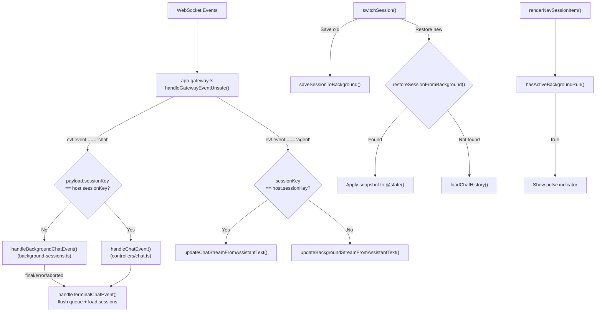

## Product Overview

集成已编写完毕的 `background-sessions.ts` 模块到主应用中，实现多个会话同时接收后台数据流且彼此不干扰。用户切换会话时，旧会话的流式状态被保存，后台事件持续追踪；切回时完整恢复流式状态，侧边栏显示后台运行指示器。

## Core Features

1. **事件路由分发**：非当前会话的 chat 事件和 agent 事件路由到后台会话模块处理，而非丢弃
2. **切换保存/恢复**：切走时自动保存活跃会话状态到后台存储，切回时恢复完整的流式内容（chatStream/chatMessages/chatRunId 等）
3. **统一切换入口**：消除 4 处碎片化的会话切换代码，统一使用 `switchSession()`
4. **后台运行指示器**：侧边栏会话列表中，有后台活跃运行的会话显示视觉指示器
5. **连接生命周期**：重连时清除所有后台会话状态

## Tech Stack

- 框架：LitElement（Web Components）+ TypeScript
- 状态管理：`@state()` 响应式属性
- 已有模块：`background-sessions.ts`（279 行，已有完整测试覆盖）

## Implementation Approach

**策略**：将已编写完毕且通过测试的 `background-sessions.ts` 模块通过胶水代码集成到三个层面——事件路由层（`app-gateway.ts`）、会话切换层（`app-chat.ts`）、UI 渲染层（`app-render.helpers.ts` / `app-render.ts`）。

**工作原理**：

1. 在 `app-gateway.ts` 的事件入口处，对非当前会话的 chat/agent 事件分流到 `handleBackgroundChatEvent` / `updateBackgroundStreamFromAssistantText`
2. 在 `switchSession()` 中增加保存旧会话和恢复目标会话的逻辑
3. 统一所有碎片化切换入口到 `switchSession()`
4. 利用 `hasActiveBackgroundRun()` 在侧边栏显示指示器

**关键技术决策**：

- 不修改 `controllers/chat.ts` 的 `handleChatEvent`：在上游 `app-gateway.ts` 拦截分流，保持 `handleChatEvent` 职责单一
- 不修改 `background-sessions.ts` 的公开接口：模块已有测试覆盖，保持稳定
- 后台 delta 只更新 Map 中的普通对象（不触发 LitElement 重渲染），切回时一次性赋值到 `@state()` 属性触发渲染

## Implementation Notes

### 事件路由（`app-gateway.ts`）

- `handleChatGatewayEvent()`（第 248-260 行）：在调用 `handleChatEvent()` 前，检查 `payload.sessionKey !== host.sessionKey`，如果是后台会话则调用 `handleBackgroundChatEvent()`。对后台会话的终态事件（final/error/aborted），仍需调用 `handleTerminalChatEvent()` 以触发 `flushChatQueueForEvent` 和 `loadSessions` 刷新
- agent 事件处理（第 271-291 行）：当前第 286 行 `if (!sessionKey || sessionKey === app.sessionKey)` 的 else 分支，调用 `updateBackgroundStreamFromAssistantText(sessionKey, text)`
- `onHello` 回调（第 153-178 行）：在重置流式状态后调用 `clearAllBackgroundSessions()`

### 会话切换（`app-chat.ts`）

- `switchSession()`（第 287-389 行）：
- 在第 314 行清空状态前，先调用 `saveSessionToBackground()` 保存旧会话（需构造包含 `chatMessages`/`chatToolMessages` 的状态对象）
- 设置新 `sessionKey` 后，调用 `restoreSessionFromBackground(trimmedKey)` 尝试恢复
- 恢复成功时：将 `chatRunId`/`chatStream`/`chatStreamSegments`/`chatStreamStartedAt`/`chatMessages`/`chatToolMessages`/`chatQueue`/`chatSending`/`chatMessage`/`chatAttachments`/`lastError` 全部从快照恢复，**跳过** `loadChatHistory()`（因为消息已在快照中）
- 恢复失败时：走原有的清空 + `loadChatHistory()` 逻辑

### 统一切换入口

- `app-render.helpers.ts` 第 41-54 行 `resetChatStateForSessionSwitch()`：改为调用 `switchSession()`
- `app-render.helpers.ts` 第 174-195 行 select `@change`：改为调用 `switchSession()`
- `app-render.ts` 第 448-466 行 `onSessionKeyChange`：改为调用 `switchSession()`

### 后台运行指示器

- `app-render.helpers.ts` 的 `renderNavSessionItem`（第 640-774 行）：调用 `hasActiveBackgroundRun(session.key)`，在图标区域增加一个脉冲动画点表示后台运行中

### Blast Radius Control

- `background-sessions.ts` 不做任何修改
- `controllers/chat.ts` 的 `handleChatEvent` 不做任何修改
- 所有改动集中在集成胶水层（gateway/chat/render），不影响核心聊天逻辑
- 后台 Map 最多 5 个条目（已有容量限制），不存在内存泄漏风险

## Architecture Design



## Directory Structure

```
ui/src/ui/
├── background-sessions.ts          # [UNCHANGED] 已有模块，不修改
├── background-sessions.test.ts     # [UNCHANGED] 已有测试，不修改
├── app-gateway.ts                  # [MODIFY] 事件路由分发：chat 事件和 agent 事件对非当前会话路由到 background-sessions；onHello 中调用 clearAllBackgroundSessions()
├── app-chat.ts                     # [MODIFY] switchSession() 中增加 saveSessionToBackground() 保存旧会话 + restoreSessionFromBackground() 恢复目标会话
├── app-render.helpers.ts           # [MODIFY] 1) resetChatStateForSessionSwitch 和 select onChange 统一调用 switchSession()  2) renderNavSessionItem 增加后台运行指示器
├── app-render.ts                   # [MODIFY] onSessionKeyChange 回调统一调用 switchSession()
└── controllers/
    └── chat.ts                     # [UNCHANGED] handleChatEvent() 不修改，上游已拦截
```

## Agent Extensions

### SubAgent

- **code-explorer**
- Purpose: 验证所有切换入口是否已统一到 switchSession()，确认无遗漏的碎片化切换代码
- Expected outcome: 确认所有会话切换路径都经过 save/restore 逻辑，无状态泄漏
