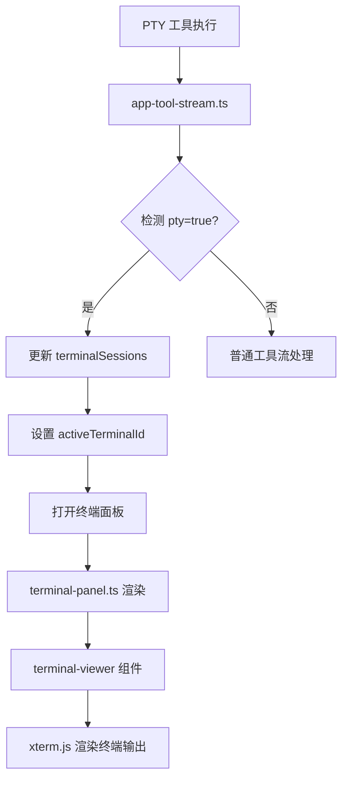

## 用户需求

修改当前的终端显示逻辑，将终端窗口固定在页面的特定位置，不再随机出现。保持终端窗口静止，但实现内部内容的自动刷新和动态更新，确保输出信息实时呈现。

## 产品概述

在聊天界面增加一个固定位置的终端面板区域，当 PTY 工具执行时自动显示终端输出，支持多终端并发执行和标签切换。终端面板位于右侧侧边栏区域，与现有的工具输出侧边栏共享空间，通过标签页切换不同终端会话。

## 核心功能

1. **固定终端面板**：在聊天区域右侧提供固定位置的终端显示区域，取代当前随消息流出现的内联终端预览
2. **实时内容更新**：利用现有 `app-tool-stream.ts` 的 `update` 阶段机制，将 PTY 工具的部分结果实时推送到终端面板
3. **多终端标签切换**：支持同时追踪多个正在执行的 PTY 终端会话，提供标签页界面切换查看
4. **自动展开/折叠**：当 PTY 工具开始执行时自动打开终端面板，执行完成后可手动关闭或保持查看
5. **终端内容预览**：聊天记录中的终端工具卡片简化为状态指示，点击后在固定面板中查看完整内容

## 技术栈

- 前端框架：Lit（LitElement），与现有项目一致
- 终端渲染：xterm.js（复用现有 `terminal-viewer` 组件）
- 状态管理：Lit 响应式属性 `@state()`
- 样式：原生 CSS，复用现有设计变量

## 实现方案

### 整体策略

扩展现有的右侧侧边栏机制，将其改造为支持「工具输出」和「终端面板」两种模式的多功能侧边栏。利用 `app-tool-stream.ts` 中已有的实时流更新机制，在检测到 PTY 工具执行时自动填充终端面板内容。

### 关键技术决策

1. **复用侧边栏布局**：不新增独立面板，而是扩展 `chat-sidebar` 支持终端模式，避免布局重构
2. **多终端状态管理**：使用 `Map<toolCallId, TerminalSession>` 存储多个终端会话，配合 `activeTerminalId` 追踪当前显示的终端
3. **增量更新**：`terminal-viewer` 组件已支持 `updated()` 生命周期响应 `content` 变化，无需额外修改
4. **PTY 检测**：复用 `isPtyFromArgs()` 检测逻辑，在 `handleAgentEvent` 中识别 PTY 工具流

### 性能考虑

- 复用现有 80ms 节流机制（`TOOL_STREAM_THROTTLE_MS`），避免高频更新导致的性能问题
- 终端滚动缓冲区限制 5000 行（已在 `terminal-viewer` 中配置）
- 最多保留 10 个终端会话，超出时移除最早的会话

## 实现细节

### 数据流

```
PTY 工具执行 → handleAgentEvent 检测 pty=true
            → 更新 terminalSessions Map
            → 自动设置 activeTerminalId
            → 打开终端面板（terminalPanelOpen=true）
            → terminal-viewer 响应 content 变化重新渲染
```

### 状态字段扩展（app.ts / app-view-state.ts）

- `terminalPanelOpen: boolean` - 终端面板是否打开
- `terminalSessions: Map<string, TerminalSession>` - 多终端会话存储
- `activeTerminalId: string | null` - 当前显示的终端 ID
- `terminalSessionOrder: string[]` - 终端会话顺序（用于标签页排列）

### PTY 工具流处理（app-tool-stream.ts）

在 `handleAgentEvent` 中增加 PTY 检测逻辑：当 `args.pty === true` 时，将该工具的输出同步到 `terminalSessions`。

## 架构设计



## 目录结构

```
ui/src/ui/
├── app.ts                           # [MODIFY] 新增终端面板状态字段
├── app-view-state.ts                # [MODIFY] 扩展 AppViewState 类型定义
├── app-tool-stream.ts               # [MODIFY] 增加 PTY 工具流检测和终端会话更新逻辑
├── views/
│   ├── chat.ts                      # [MODIFY] 集成终端面板到聊天布局
│   └── terminal-panel.ts            # [NEW] 终端面板组件，包含标签切换和终端显示
├── chat/
│   └── tool-cards.ts                # [MODIFY] 简化 PTY 工具卡片，点击打开终端面板而非侧边栏
└── styles/
    └── chat/
        └── terminal-panel.css       # [NEW] 终端面板样式
```

### 文件详细说明

**app.ts [MODIFY]**

- 新增 `terminalPanelOpen`、`terminalSessions`、`activeTerminalId`、`terminalSessionOrder` 状态字段
- 新增 `handleOpenTerminalPanel()`、`handleCloseTerminalPanel()`、`handleSwitchTerminal()` 方法
- 在 `resetToolStream()` 中增加终端会话清理逻辑

**app-view-state.ts [MODIFY]**

- 定义 `TerminalSession` 类型：`{ toolCallId, name, content, status, startedAt, updatedAt }`
- 扩展 `AppViewState` 接口，添加终端面板相关字段和方法

**app-tool-stream.ts [MODIFY]**

- 扩展 `ToolStreamHost` 类型，添加终端会话相关字段
- 在 `handleAgentEvent` 中检测 `args.pty === true`，同步更新 `terminalSessions`
- 新增 `syncTerminalSession()` 辅助函数，处理终端会话的创建和更新

**views/terminal-panel.ts [NEW]**

- 终端面板视图组件，渲染标签栏和终端内容
- 接收 `sessions`、`activeId`、`onSwitch`、`onClose` 等属性
- 使用 `terminal-viewer` 组件渲染当前活跃终端的内容

**views/chat.ts [MODIFY]**

- 在 `chat-split-container` 中增加终端面板渲染逻辑
- 当 `terminalPanelOpen` 为 true 时显示终端面板区域
- 调整侧边栏布局，支持工具输出和终端面板共存

**chat/tool-cards.ts [MODIFY]**

- PTY 工具卡片改为打开终端面板而非侧边栏
- 简化卡片预览，只显示状态指示（运行中/已完成）

**styles/chat/terminal-panel.css [NEW]**

- 终端面板容器样式
- 标签栏样式（标签项、活跃状态、关闭按钮）
- 终端内容区域样式
- 响应式布局（移动端适配）

## 关键代码结构

```typescript
// app-view-state.ts - 终端会话类型定义
export type TerminalSession = {
  toolCallId: string;
  name: string;
  content: string;
  status: "running" | "completed";
  startedAt: number;
  updatedAt: number;
};
```

```typescript
// views/terminal-panel.ts - 终端面板接口
export type TerminalPanelProps = {
  sessions: TerminalSession[];
  activeId: string | null;
  onSwitch: (id: string) => void;
  onClose: () => void;
};
```
