# AI代理系统

<cite>
**本文引用的文件**
- [README.md](file://README.md)
- [agent-scope.ts](file://src/agents/agent-scope.ts)
- [system-prompt.ts](file://src/agents/system-prompt.ts)
- [model-selection.ts](file://src/agents/model-selection.ts)
- [sessions-send-helpers.ts](file://src/agents/tools/sessions-send-helpers.ts)
- [sessions-resolution.ts](file://src/agents/tools/sessions-resolution.ts)
- [thinking.ts（自动回复）](file://src/auto-reply/thinking.ts)
- [directive-handling.impl.ts](file://src/auto-reply/reply/directive-handling.impl.ts)
- [cross-session-memory-sync.md](file://docs/design/cross-session-memory-sync.md)
- [memory-core 插件配置](file://extensions/memory-core/openclaw.plugin.json)
- [session-utils.ts](file://src/gateway/session-utils.ts)
- [sessions-patch.ts](file://src/gateway/sessions-patch.ts)
- [subagent-lifecycle-events.ts](file://src/agents/subagent-lifecycle-events.ts)
- [sandbox/runtime-status.ts](file://src/agents/sandbox/runtime-status.ts)
- [tool-policy.test.ts](file://src/agents/tool-policy.test.ts)
- [bash-tools.exec.path.test.ts](file://src/agents/bash-tools.exec.path.test.ts)
- [types.ts（协议类型定义）](file://src/gateway/protocol/schema/types.ts)
- [agents-models-skills.ts（协议类型定义）](file://src/gateway/protocol/schema/agents-models-skills.ts)
</cite>

## 目录

1. [简介](#简介)
2. [项目结构](#项目结构)
3. [核心组件](#核心组件)
4. [架构总览](#架构总览)
5. [详细组件分析](#详细组件分析)
6. [依赖关系分析](#依赖关系分析)
7. [性能考虑](#性能考虑)
8. [故障排查指南](#故障排查指南)
9. [结论](#结论)
10. [附录](#附录)

## 简介

本技术文档面向OpenClaw AI代理系统，聚焦于代理架构设计、智能对话机制、工具调用系统与代理生命周期管理。文档从系统架构、组件职责、数据流与处理逻辑入手，结合实际源码路径，帮助开发者理解代理的工作原理、思考模式、推理能力与工具使用策略；同时覆盖配置管理、会话状态维护、记忆机制等核心功能，并提供开发与定制指导、性能优化建议与调试方法。

## 项目结构

OpenClaw是一个多语言混合的工程，核心运行时以TypeScript实现，包含网关控制平面、通道适配层、工具与技能平台、会话与状态管理、安全沙箱与权限策略等模块。项目采用分层组织：src下按子系统划分目录，dist产出可运行包，docs提供设计与参考文档，extensions与skills提供插件与技能生态。

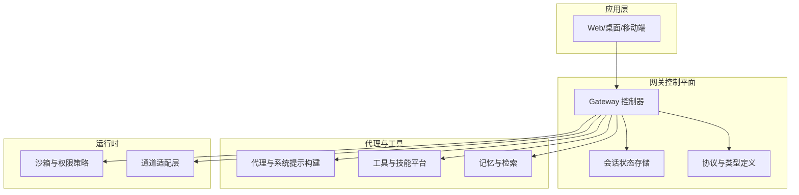

图示来源

- [README.md](file://README.md#L185-L238)

章节来源

- [README.md](file://README.md#L185-L238)

## 核心组件

- 代理作用域与工作区解析：负责代理ID解析、默认代理选择、工作区与代理目录解析、模型回退策略等。
- 系统提示构建：根据工具可用性、技能、记忆、时间、运行时信息等动态生成系统提示，支持主代理与子代理模式。
- 会话与消息工具：提供跨会话消息、会话解析与显示键格式化、跳过令牌等交互机制。
- 思考与推理级别：统一的思考/推理级别规范化与指令解析，支持/状态查询与校验。
- 会话状态与补丁：会话存储目标解析、合并策略、补丁应用与模型选择集成。
- 记忆与跨会话同步：基于事件的内存变更订阅与同步，确保跨会话一致性。
- 沙箱与工具策略：运行时沙箱状态判定、工具策略允许/拒绝规则、主机/沙箱执行路径约束。
- 协议与类型：网关协议中工具目录、技能、模型等类型定义，保障客户端与服务端契约一致。

章节来源

- [agent-scope.ts](file://src/agents/agent-scope.ts#L117-L282)
- [system-prompt.ts](file://src/agents/system-prompt.ts#L189-L705)
- [sessions-send-helpers.ts](file://src/agents/tools/sessions-send-helpers.ts#L91-L156)
- [sessions-resolution.ts](file://src/agents/tools/sessions-resolution.ts#L162-L213)
- [thinking.ts（自动回复）](file://src/auto-reply/thinking.ts#L1-L36)
- [directive-handling.impl.ts](file://src/auto-reply/reply/directive-handling.impl.ts#L135-L171)
- [session-utils.ts](file://src/gateway/session-utils.ts#L490-L596)
- [sessions-patch.ts](file://src/gateway/sessions-patch.ts#L65-L87)
- [cross-session-memory-sync.md](file://docs/design/cross-session-memory-sync.md#L24-L324)
- [sandbox/runtime-status.ts](file://src/agents/sandbox/runtime-status.ts#L45-L97)
- [tool-policy.test.ts](file://src/agents/tool-policy.test.ts#L117-L149)
- [bash-tools.exec.path.test.ts](file://src/agents/bash-tools.exec.path.test.ts#L192-L222)
- [types.ts（协议类型定义）](file://src/gateway/protocol/schema/types.ts#L219-L238)
- [agents-models-skills.ts（协议类型定义）](file://src/gateway/protocol/schema/agents-models-skills.ts#L226-L284)

## 架构总览

OpenClaw采用“网关控制平面 + 多通道 + 代理运行时”的分层架构。网关负责会话、路由、工具与技能目录、状态持久化与远程控制；代理运行时在Pi环境中执行，依据系统提示与工具策略进行推理与行动；通道适配层连接多种即时通讯渠道；沙箱与权限策略贯穿工具调用与执行路径。

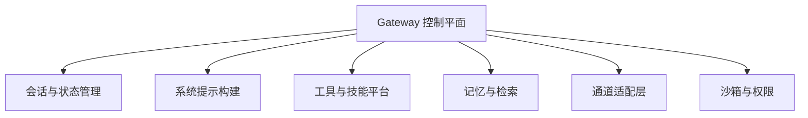

图示来源

- [README.md](file://README.md#L185-L238)

## 详细组件分析

### 代理作用域与工作区解析

- 功能要点
  - 列举与去重代理ID，解析默认代理。
  - 解析会话键中的代理ID，支持显式参数与会话键解析。
  - 解析代理配置（名称、工作区、代理目录、模型、技能、心跳、身份、子代理、沙箱、工具等）。
  - 解析模型主模型与回退策略，支持全局与代理级覆盖。
  - 解析代理工作区与代理目录，支持默认工作区与状态目录下的隔离工作区。
- 关键流程
  - 代理ID归一化与去重，避免重复。
  - 会话键解析优先级：显式参数 > 会话键解析 > 默认代理。
  - 模型回退策略：若会话无覆盖，则使用代理级或全局默认。
- 复杂度与性能
  - 解析过程线性于代理列表长度与会话键解析成本，整体为O(n)。
  - 路径解析包含环境变量与状态目录拼接，注意I/O开销。

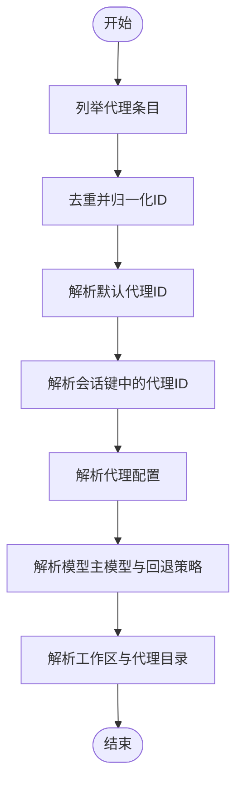

图示来源

- [agent-scope.ts](file://src/agents/agent-scope.ts#L45-L282)

章节来源

- [agent-scope.ts](file://src/agents/agent-scope.ts#L45-L282)

### 系统提示构建（Agent System Prompt）

- 功能要点
  - 动态生成系统提示，支持“完整/最小/无”三种模式（主代理/full、子代理/minimal、无/none）。
  - 工具可用性过滤与排序，区分核心工具与外部工具摘要。
  - 技能章节、记忆召回、文档链接、时间与语音提示、消息与回复标签、静默回复、心跳、运行时信息等。
  - 支持沙箱信息注入，区分宿主与容器工作区路径。
- 设计原则
  - 最小必要信息：子代理模式下仅保留必要部分，减少认知负担。
  - 安全优先：明确安全约束与工具边界，避免越权操作。
  - 可解释性：通过“静默回复”“心跳”“运行时行”等机制提升可观测性与可控性。
- 复杂度与性能
  - 字符串拼接与条件分支，整体线性于工具数量与段落数量。

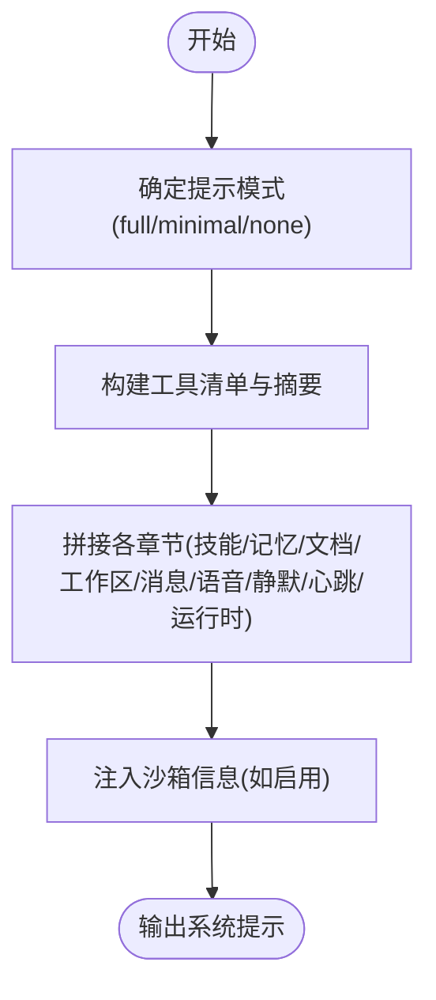

图示来源

- [system-prompt.ts](file://src/agents/system-prompt.ts#L189-L705)

章节来源

- [system-prompt.ts](file://src/agents/system-prompt.ts#L189-L705)

### 会话与消息工具（Agent-to-Agent）

- 功能要点
  - 会话间消息发送与回声步骤（Ping-Pong），支持跳过令牌。
  - 会话公告步骤，支持跳过令牌，决定是否向目标频道发布。
  - 会话键解析：支持通过sessionId解析真实会话键，遵循可见性与沙箱限制。
  - 显示键格式化：将内部键转换为对用户友好的展示形式。
- 使用场景
  - 子代理协作：请求方发起消息，目标代理可选择回应或保持沉默。
  - 跨会话广播：在公告步骤后将结果发布到目标频道。
- 错误处理
  - 会话不存在时返回明确错误信息，沙箱限制时返回禁止状态。

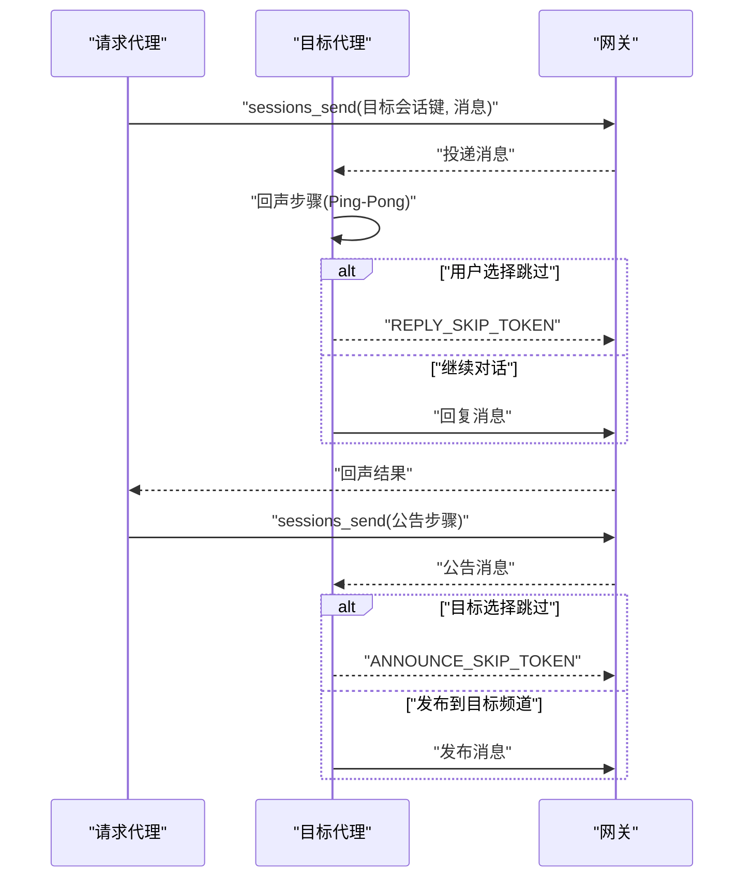

图示来源

- [sessions-send-helpers.ts](file://src/agents/tools/sessions-send-helpers.ts#L91-L156)
- [sessions-resolution.ts](file://src/agents/tools/sessions-resolution.ts#L162-L213)

章节来源

- [sessions-send-helpers.ts](file://src/agents/tools/sessions-send-helpers.ts#L91-L156)
- [sessions-resolution.ts](file://src/agents/tools/sessions-resolution.ts#L162-L213)

### 思考与推理级别（/think /reasoning 指令）

- 功能要点
  - 统一思考级别别名与规范化（如mid→medium、xhigh系列别名、on→low）。
  - 指令解析：/think、/verbose、/reasoning等，支持显示当前级别与有效值提示。
  - 与系统提示联动：推理级别影响系统提示中的“推理格式”与隐藏策略。
- 处理流程
  - 解析用户指令，校验级别有效性。
  - 若未提供参数，返回当前级别与可用选项。
  - 若无效，返回错误提示与可用选项。

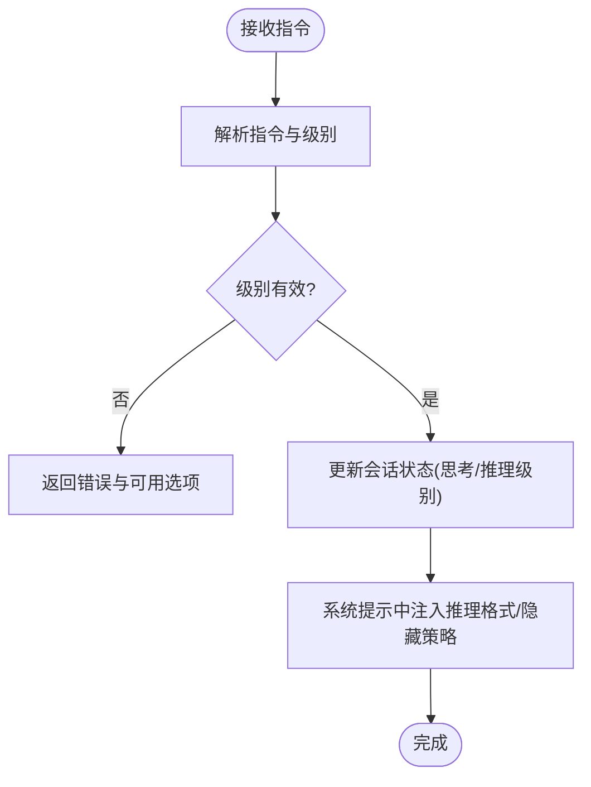

图示来源

- [thinking.ts（自动回复）](file://src/auto-reply/thinking.ts#L1-L36)
- [directive-handling.impl.ts](file://src/auto-reply/reply/directive-handling.impl.ts#L135-L171)

章节来源

- [thinking.ts（自动回复）](file://src/auto-reply/thinking.ts#L1-L36)
- [directive-handling.impl.ts](file://src/auto-reply/reply/directive-handling.impl.ts#L135-L171)

### 会话状态与补丁（Sessions Patch）

- 功能要点
  - 补丁应用：合并现有会话条目与新补丁，更新时间戳与spawnedBy字段。
  - 模型选择集成：根据代理默认模型与子代理配置，解析会话模型选择。
  - 会话存储目标解析：支持模板化存储路径与代理ID归一化。
- 关键点
  - 合并策略：以updatedAt较新的条目为准，合并spawnedBy来源。
  - 主键规范：统一会话键格式，兼容main别名与代理ID前缀。

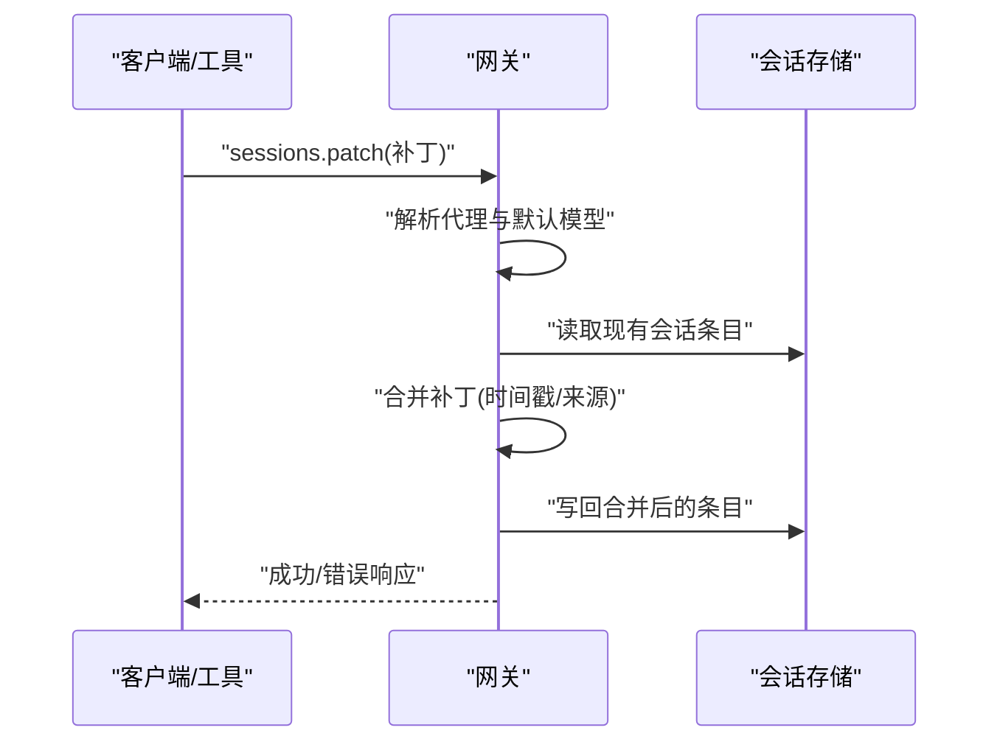

图示来源

- [sessions-patch.ts](file://src/gateway/sessions-patch.ts#L65-L87)
- [session-utils.ts](file://src/gateway/session-utils.ts#L490-L596)

章节来源

- [sessions-patch.ts](file://src/gateway/sessions-patch.ts#L65-L87)
- [session-utils.ts](file://src/gateway/session-utils.ts#L490-L596)

### 记忆与跨会话同步

- 核心问题
  - 记忆写入依赖模型主动执行，且MEMORY.md仅在会话创建时加载一次。
  - 会话A写入后，已打开的会话B不会感知变化，需新建或重启会话。
  - Session Memory Hook仅在/new触发，切换会话或关闭窗口不会保存。
  - memory_search未被一致使用，导致“跨会话没有记忆”的感知问题。
- 解决方案
  - Session端订阅机制：监听记忆变更事件，维护pending队列，异步更新。
  - 事件驱动：排除自身产生的变更，保证一致性与避免循环。
- 影响范围
  - 提升跨会话一致性体验，降低用户心智负担。

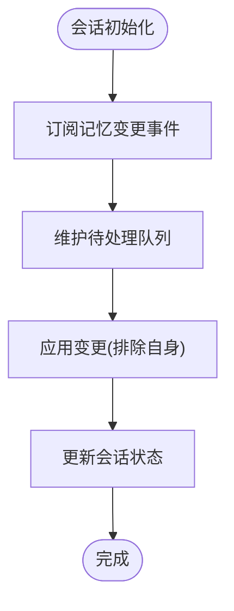

图示来源

- [cross-session-memory-sync.md](file://docs/design/cross-session-memory-sync.md#L24-L324)

章节来源

- [cross-session-memory-sync.md](file://docs/design/cross-session-memory-sync.md#L24-L324)

### 沙箱与工具策略

- 运行时状态
  - 判定会话是否沙箱化，解析工具策略，提供阻断消息格式化。
- 工具策略
  - 支持通配符与deny优先规则，空allow视为allow-all（受deny限制）。
- 执行路径
  - 当沙箱不可用时，默认走沙箱执行；显式要求host=sandbox但无沙箱运行时则失败。
- 测试验证
  - 覆盖allow/deny、通配符、空allow、失败场景等。

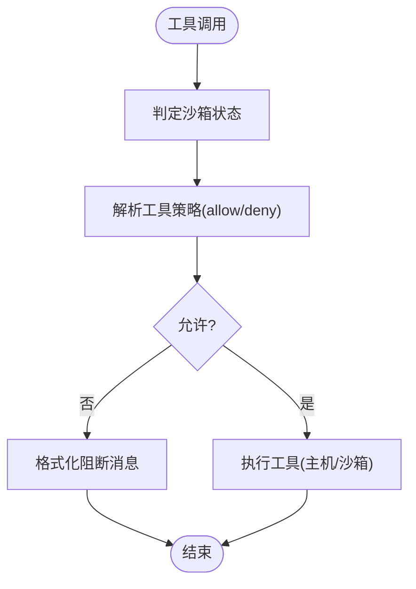

图示来源

- [sandbox/runtime-status.ts](file://src/agents/sandbox/runtime-status.ts#L45-L97)
- [tool-policy.test.ts](file://src/agents/tool-policy.test.ts#L117-L149)
- [bash-tools.exec.path.test.ts](file://src/agents/bash-tools.exec.path.test.ts#L192-L222)

章节来源

- [sandbox/runtime-status.ts](file://src/agents/sandbox/runtime-status.ts#L45-L97)
- [tool-policy.test.ts](file://src/agents/tool-policy.test.ts#L117-L149)
- [bash-tools.exec.path.test.ts](file://src/agents/bash-tools.exec.path.test.ts#L192-L222)

### 子代理生命周期与事件

- 生命周期事件
  - 结束原因映射到结局类型（正常/错误/超时/被杀/重置/删除）。
  - 重置会话映射为重置结局，便于清理与恢复。
- 应用场景
  - 子代理任务完成后自动汇报，或异常时清理资源。

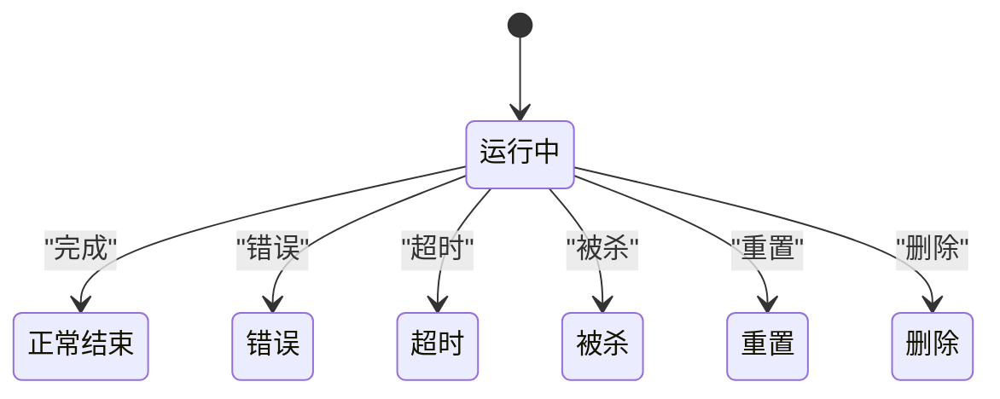

图示来源

- [subagent-lifecycle-events.ts](file://src/agents/subagent-lifecycle-events.ts#L32-L47)

章节来源

- [subagent-lifecycle-events.ts](file://src/agents/subagent-lifecycle-events.ts#L32-L47)

### 协议与类型（工具/技能/模型）

- 类型定义
  - 工具目录：工具分组、概要、可选性、默认配置文件档等。
  - 技能：bin分类、安装/更新/文件读写接口。
  - 模型：模型列表、选择参数、结果结构。
- 价值
  - 保障客户端与服务端契约一致，便于扩展与版本演进。

章节来源

- [types.ts（协议类型定义）](file://src/gateway/protocol/schema/types.ts#L219-L238)
- [agents-models-skills.ts（协议类型定义）](file://src/gateway/protocol/schema/agents-models-skills.ts#L226-L284)

## 依赖关系分析

- 组件耦合
  - 代理作用域与系统提示构建强相关：前者决定工作区与模型，后者据此生成提示。
  - 会话工具与网关协议紧密耦合：消息发送、会话解析均依赖网关方法。
  - 沙箱策略与工具执行路径耦合：策略决定执行主机与阻断消息。
- 外部依赖
  - 渠道适配层（Telegram/WhatsApp/Slack/Discord等）通过网关暴露的通道接口接入。
  - 记忆模块通过事件与存储抽象解耦，支持不同后端（如LanceDB）。
- 循环依赖
  - 未发现直接循环依赖；模块间通过网关与协议层进行间接通信。

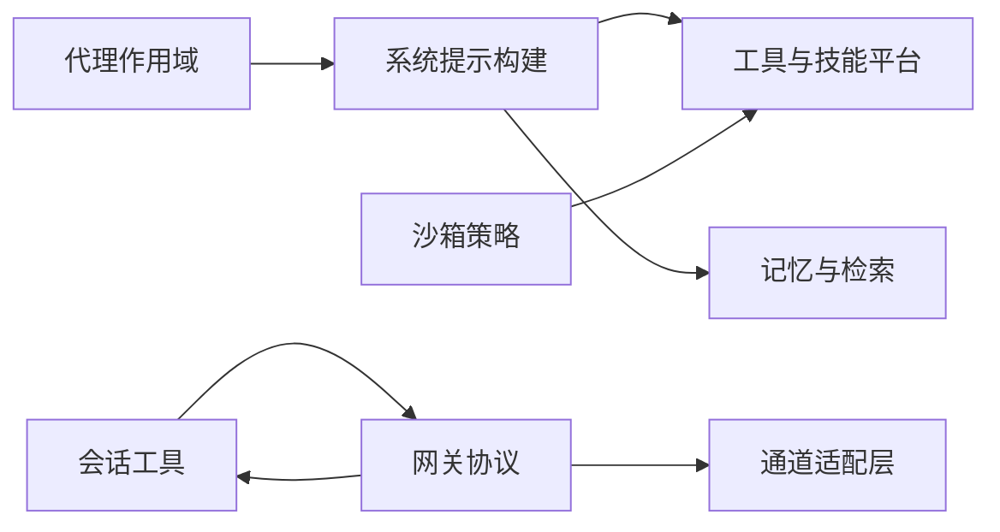

图示来源

- [agent-scope.ts](file://src/agents/agent-scope.ts#L117-L282)
- [system-prompt.ts](file://src/agents/system-prompt.ts#L189-L705)
- [sessions-resolution.ts](file://src/agents/tools/sessions-resolution.ts#L162-L213)
- [sandbox/runtime-status.ts](file://src/agents/sandbox/runtime-status.ts#L45-L97)

章节来源

- [agent-scope.ts](file://src/agents/agent-scope.ts#L117-L282)
- [system-prompt.ts](file://src/agents/system-prompt.ts#L189-L705)
- [sessions-resolution.ts](file://src/agents/tools/sessions-resolution.ts#L162-L213)
- [sandbox/runtime-status.ts](file://src/agents/sandbox/runtime-status.ts#L45-L97)

## 性能考虑

- 系统提示构建
  - 工具清单与摘要拼接为线性复杂度，建议控制工具数量与描述长度。
  - 沙箱信息注入增加少量字符串处理，通常可忽略。
- 会话存储与补丁
  - 合并策略按updatedAt比较，避免频繁写入；建议批量补丁或去抖动。
  - 模型解析与回退策略仅在需要时触发，避免不必要的计算。
- 沙箱执行
  - 沙箱不可用时默认走沙箱执行，失败时回退策略应尽量减少重试次数。
  - 通配符匹配与策略解析为轻量操作，建议缓存常用策略结果。
- 记忆同步
  - 事件驱动的增量更新优于全量扫描，注意队列长度与处理频率。

## 故障排查指南

- 会话键解析失败
  - 确认使用完整的会话键（来自sessions_list），避免仅传sessionId。
  - 沙箱限制时会返回“不可见”错误，检查spawnedBy与include参数。
- 工具调用被阻断
  - 查看沙箱策略与工具策略，确认deny优先规则。
  - 显式要求host=sandbox但无沙箱运行时会失败，检查沙箱配置。
- 记忆未跨会话同步
  - 确认会话订阅了记忆变更事件，且排除了自身产生的变更。
  - 检查会话是否新建或重启以加载最新MEMORY.md。
- 指令无效
  - 使用/状态查看当前级别与可用选项；检查别名与大小写。
- 子代理未结束或资源未释放
  - 关注生命周期事件映射，重置会话会映射为重置结局，便于清理。

章节来源

- [sessions-resolution.ts](file://src/agents/tools/sessions-resolution.ts#L162-L213)
- [sandbox/runtime-status.ts](file://src/agents/sandbox/runtime-status.ts#L45-L97)
- [tool-policy.test.ts](file://src/agents/tool-policy.test.ts#L117-L149)
- [bash-tools.exec.path.test.ts](file://src/agents/bash-tools.exec.path.test.ts#L192-L222)
- [cross-session-memory-sync.md](file://docs/design/cross-session-memory-sync.md#L24-L324)
- [subagent-lifecycle-events.ts](file://src/agents/subagent-lifecycle-events.ts#L32-L47)

## 结论

OpenClaw通过清晰的分层架构与严格的协议契约，实现了可扩展、可观测、可治理的AI代理系统。代理作用域与系统提示构建确保了上下文的一致性与安全性；会话工具与补丁机制提供了灵活的跨会话协作与状态管理；沙箱与工具策略保障了执行安全；记忆同步与生命周期管理提升了用户体验与可靠性。开发者可在上述基础上扩展技能、工具与行为策略，实现更强大的个性化代理能力。

## 附录

- 开发与定制建议
  - 技能系统：通过技能注册表与工作区技能目录扩展能力，遵循技能生命周期与权限约束。
  - 工具扩展：新增工具需在系统提示中声明，并在沙箱策略中明确允许/拒绝规则。
  - 行为定制：通过系统提示模式（full/minimal/none）、推理级别与静默回复等机制微调代理行为。
- 配置管理
  - 代理工作区与模型回退策略可通过代理配置与全局默认配置组合实现。
  - 记忆模块可通过插件配置启用与后端选择，结合事件同步机制提升一致性。
- 安全与合规
  - 沙箱模式默认对非主会话启用，工具执行严格受限；涉及主机访问需明确授权与审计。
  - 记忆与日志遵循最小化原则，避免泄露敏感信息。

章节来源

- [agent-scope.ts](file://src/agents/agent-scope.ts#L255-L282)
- [system-prompt.ts](file://src/agents/system-prompt.ts#L189-L705)
- [memory-core 插件配置](file://extensions/memory-core/openclaw.plugin.json#L1-L9)
