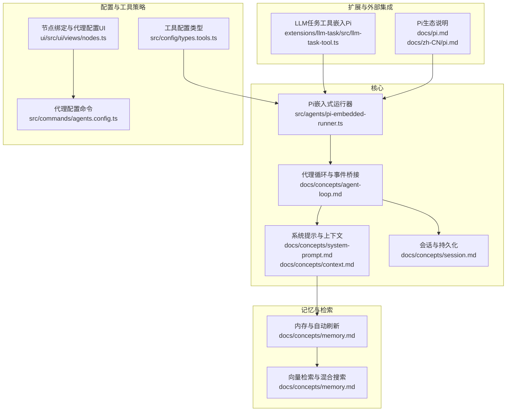
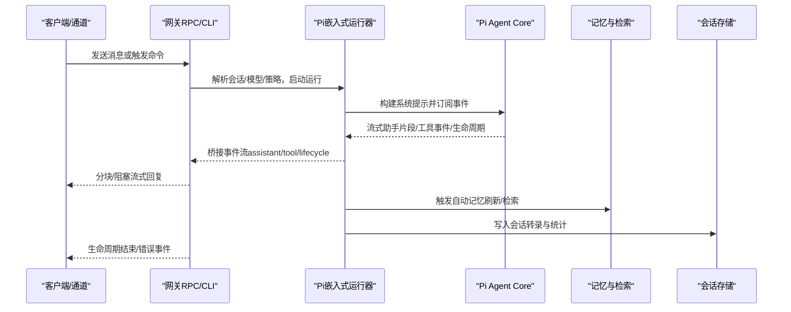
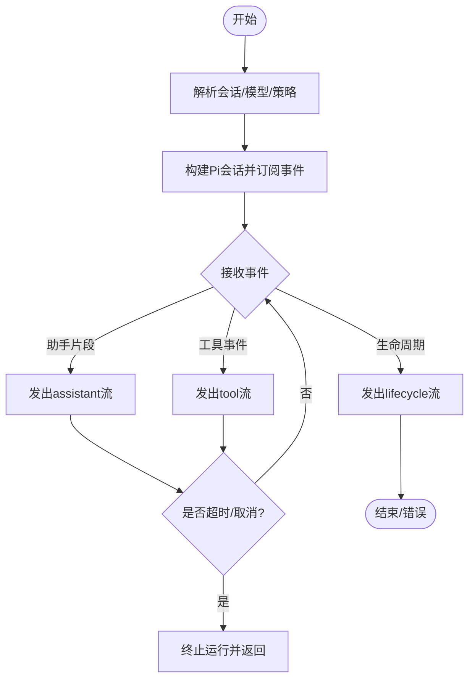
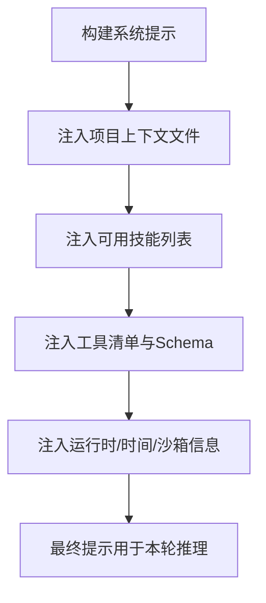
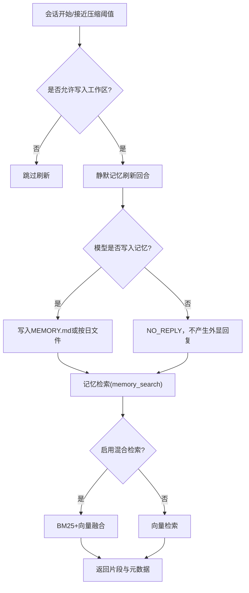
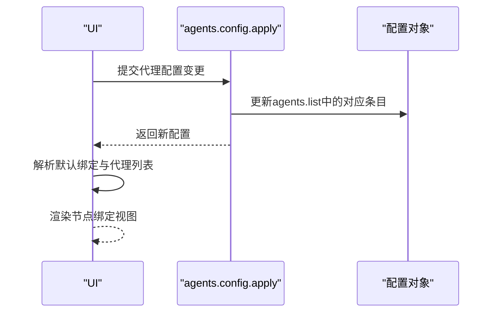
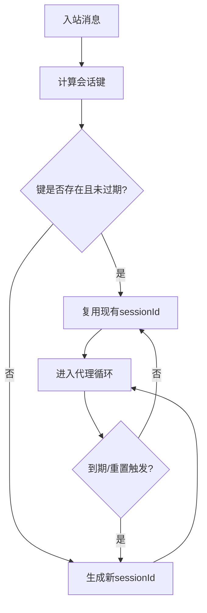
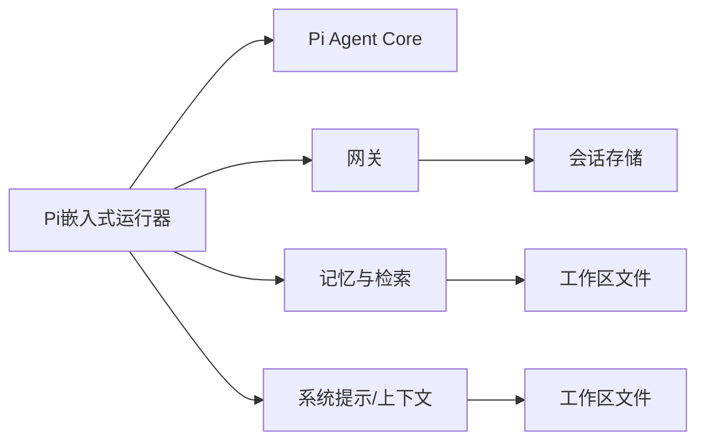
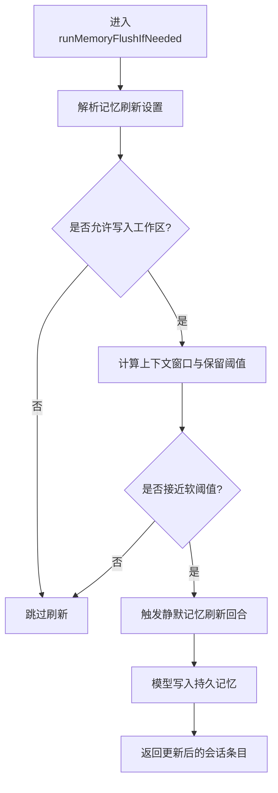
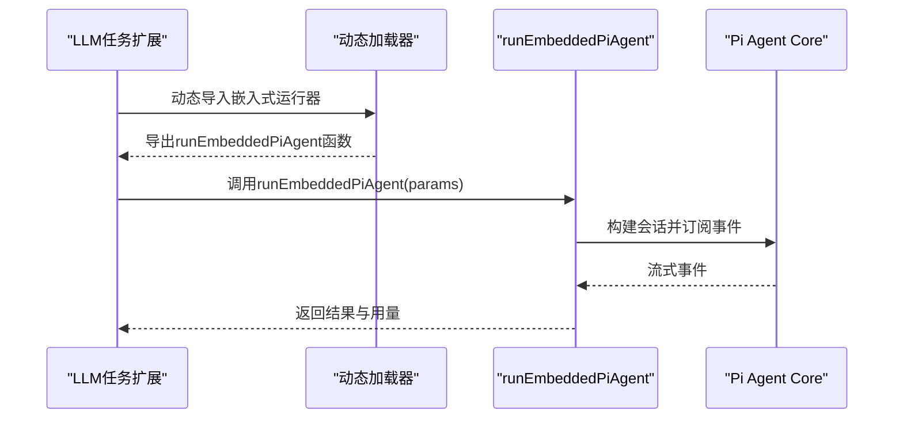

# AI代理系统

<cite>
**本文引用的文件**
- [AGENTS.md](file://AGENTS.md)
- [docs/concepts/agent.md](file://docs/concepts/agent.md)
- [docs/concepts/agent-loop.md](file://docs/concepts/agent-loop.md)
- [docs/concepts/context.md](file://docs/concepts/context.md)
- [docs/concepts/memory.md](file://docs/concepts/memory.md)
- [docs/concepts/session.md](file://docs/concepts/session.md)
- [docs/concepts/system-prompt.md](file://docs/concepts/system-prompt.md)
- [docs/zh-CN/pi.md](file://docs/zh-CN/pi.md)
- [docs/pi.md](file://docs/pi.md)
- [src/agents/pi-embedded-runner.ts](file://src/agents/pi-embedded-runner.ts)
- [extensions/llm-task/src/llm-task-tool.ts](file://extensions/llm-task/src/llm-task-tool.ts)
- [src/auto-reply/reply/agent-runner-memory.ts](file://src/auto-reply/reply/agent-runner-memory.ts)
- [src/config/types.tools.ts](file://src/config/types.tools.ts)
- [src/commands/agents.config.ts](file://src/commands/agents.config.ts)
- [ui/src/ui/views/nodes.ts](file://ui/src/ui/views/nodes.ts)
- [src/agents/tools/sessions-helpers.ts](file://src/agents/tools/sessions-helpers.ts)
</cite>

## 目录

1. [简介](#简介)
2. [项目结构](#项目结构)
3. [核心组件](#核心组件)
4. [架构总览](#架构总览)
5. [组件详解](#组件详解)
6. [依赖关系分析](#依赖关系分析)
7. [性能考量](#性能考量)
8. [故障排除指南](#故障排除指南)
9. [结论](#结论)
10. [附录](#附录)

## 简介

本技术文档面向OpenClaw AI代理系统，聚焦于Pi Agent Core（pi-agent-core）的集成与使用，系统化阐述代理的配置与管理、工具执行机制、记忆与上下文管理、工作流程与事件流、上下文窗口管理与记忆检索机制，并给出性能优化策略、故障排除方法与扩展性建议。文档同时解释代理系统与网关、通道、插件等组件的集成关系，覆盖安全与最佳实践。

## 项目结构

OpenClaw采用模块化组织方式，核心代理逻辑位于src/agents，围绕Pi嵌入式运行器构建；文档位于docs/，涵盖概念、参考与操作指南；扩展通过extensions/\*提供；UI位于ui/；命令行与网关位于src/cli与src/gateway。



**图表来源**

- [src/agents/pi-embedded-runner.ts](file://src/agents/pi-embedded-runner.ts#L1-L28)
- [docs/concepts/agent-loop.md](file://docs/concepts/agent-loop.md#L1-L147)
- [docs/concepts/system-prompt.md](file://docs/concepts/system-prompt.md#L1-L129)
- [docs/concepts/context.md](file://docs/concepts/context.md#L1-L162)
- [docs/concepts/session.md](file://docs/concepts/session.md#L1-L205)
- [docs/concepts/memory.md](file://docs/concepts/memory.md#L1-L568)
- [src/config/types.tools.ts](file://src/config/types.tools.ts#L198-L222)
- [ui/src/ui/views/nodes.ts](file://ui/src/ui/views/nodes.ts#L1083-L1138)
- [src/commands/agents.config.ts](file://src/commands/agents.config.ts#L132-L183)
- [extensions/llm-task/src/llm-task-tool.ts](file://extensions/llm-task/src/llm-task-tool.ts#L1-L33)
- [docs/pi.md](file://docs/pi.md#L31-L36)
- [docs/zh-CN/pi.md](file://docs/zh-CN/pi.md#L531-L539)

**章节来源**

- [AGENTS.md](file://AGENTS.md#L1-L180)
- [docs/concepts/agent.md](file://docs/concepts/agent.md#L1-L124)
- [docs/concepts/agent-loop.md](file://docs/concepts/agent-loop.md#L1-L147)
- [docs/concepts/context.md](file://docs/concepts/context.md#L1-L162)
- [docs/concepts/session.md](file://docs/concepts/session.md#L1-L205)
- [docs/concepts/memory.md](file://docs/concepts/memory.md#L1-L568)
- [docs/concepts/system-prompt.md](file://docs/concepts/system-prompt.md#L1-L129)
- [docs/pi.md](file://docs/pi.md#L31-L36)
- [docs/zh-CN/pi.md](file://docs/zh-CN/pi.md#L531-L539)

## 核心组件

- Pi嵌入式运行器与事件桥接：封装Pi Agent Core的运行、队列、超时、生命周期事件与流式输出桥接，作为OpenClaw代理循环的内核。
- 代理循环与生命周期：定义从入口到结束的完整流程，包括会话准备、系统提示构建、模型推理、工具执行、流式回复与持久化。
- 上下文与系统提示：明确系统提示结构、注入的项目上下文文件、时间与运行元数据、技能列表与工具清单。
- 记忆与检索：基于工作区Markdown文件的自动刷新与预压缩提示、向量索引与混合检索（BM25+向量）、会话日志索引等。
- 工具策略与配置：全局与按提供方的工具策略、沙箱工具白/黑名单、执行工具默认行为、代理工具配置类型。
- 配置与UI：节点绑定解析、代理配置命令、UI中工具策略与配置表单渲染。

**章节来源**

- [src/agents/pi-embedded-runner.ts](file://src/agents/pi-embedded-runner.ts#L1-L28)
- [docs/concepts/agent-loop.md](file://docs/concepts/agent-loop.md#L1-L147)
- [docs/concepts/system-prompt.md](file://docs/concepts/system-prompt.md#L1-L129)
- [docs/concepts/context.md](file://docs/concepts/context.md#L1-L162)
- [docs/concepts/memory.md](file://docs/concepts/memory.md#L1-L568)
- [src/config/types.tools.ts](file://src/config/types.tools.ts#L198-L222)
- [ui/src/ui/views/nodes.ts](file://ui/src/ui/views/nodes.ts#L1083-L1138)
- [src/commands/agents.config.ts](file://src/commands/agents.config.ts#L132-L183)

## 架构总览

OpenClaw以Pi嵌入式运行器为核心，结合内部钩子与插件钩子，在网关侧完成消息路由、会话键映射、队列与并发控制、工具策略与沙箱策略、以及最终的流式输出与持久化。系统提示由OpenClaw构建，上下文文件注入，工具与技能按需加载，记忆通过自动刷新与检索工具参与。



**图表来源**

- [docs/concepts/agent-loop.md](file://docs/concepts/agent-loop.md#L18-L60)
- [src/agents/pi-embedded-runner.ts](file://src/agents/pi-embedded-runner.ts#L1-L28)
- [docs/concepts/memory.md](file://docs/concepts/memory.md#L39-L77)

## 组件详解

### Pi嵌入式运行器与代理循环

- 运行器职责：序列化运行、解析模型与认证配置、构建Pi会话、订阅事件、超时控制、返回结果与用量元数据。
- 事件桥接：将Pi事件映射为OpenClaw的assistant/tool/lifecycle流，供网关与UI消费。
- 并发与队列：按会话键与可选全局队列串行化，避免竞态与历史不一致。
- 超时与中断：运行器内设置超时并支持AbortSignal取消。



**图表来源**

- [docs/concepts/agent-loop.md](file://docs/concepts/agent-loop.md#L18-L60)
- [src/agents/pi-embedded-runner.ts](file://src/agents/pi-embedded-runner.ts#L1-L28)

**章节来源**

- [docs/concepts/agent-loop.md](file://docs/concepts/agent-loop.md#L1-L147)
- [src/agents/pi-embedded-runner.ts](file://src/agents/pi-embedded-runner.ts#L1-L28)

### 系统提示与上下文管理

- 结构组成：工具清单、安全提醒、技能列表、自更新指令、工作区、文档、注入的项目上下文文件、沙箱信息、当前日期时间、回复标签、心跳、运行时信息、推理可见性。
- 注入规则：默认注入固定文件集，大文件截断；子代理仅注入必要文件；可通过钩子agent:bootstrap修改。
- 上下文估算：提供/context list与/detail命令查看贡献项与大小；支持紧凑化与修剪减少占用。



**图表来源**

- [docs/concepts/system-prompt.md](file://docs/concepts/system-prompt.md#L15-L47)
- [docs/concepts/context.md](file://docs/concepts/context.md#L90-L131)

**章节来源**

- [docs/concepts/system-prompt.md](file://docs/concepts/system-prompt.md#L1-L129)
- [docs/concepts/context.md](file://docs/concepts/context.md#L1-L162)

### 记忆与检索机制

- 存储布局：工作区Markdown文件（MEMORY.md与按日拆分的memory/\*.md），默认启用自动预压缩前的记忆刷新。
- 自动刷新：接近压缩阈值时触发静默代理回合，提醒模型写入持久记忆，避免上下文被压缩丢失。
- 向量检索：可选本地或远程嵌入，支持sqlite-vec加速；可启用BM25关键词匹配，混合融合评分；支持QMD后端实验性功能。
- 会话索引：可选将会话JSONL转录纳入检索，异步增量同步，受delta阈值控制。



**图表来源**

- [docs/concepts/memory.md](file://docs/concepts/memory.md#L39-L77)
- [docs/concepts/memory.md](file://docs/concepts/memory.md#L348-L362)
- [src/auto-reply/reply/agent-runner-memory.ts](file://src/auto-reply/reply/agent-runner-memory.ts#L27-L80)

**章节来源**

- [docs/concepts/memory.md](file://docs/concepts/memory.md#L1-L568)
- [src/auto-reply/reply/agent-runner-memory.ts](file://src/auto-reply/reply/agent-runner-memory.ts#L27-L80)

### 工具执行与策略

- 工具策略类型：支持基础工具档案、允许/禁止列表、按提供方覆盖、提升执行开关与来源白名单、exec默认配置、沙箱工具白/黑名单。
- 策略解析：全局默认与代理覆盖叠加；当代理设置了allow列表时，不再应用档案；byProvider可针对具体提供方或“provider/model”细化。
- 执行工具：exec工具默认行为由代理配置决定；沙箱模式下可限制工具访问范围。

```mermaid
classDiagram
class AgentToolsConfig {
+profile? : ToolProfileId
+allow? : string[]
+alsoAllow? : string[]
+deny? : string[]
+byProvider? : Record<string, ToolPolicyConfig>
+elevated? : ElevatedConfig
+exec? : ExecToolConfig
+sandbox? : SandboxToolsPolicy
}
class ToolPolicyConfig {
+allow? : string[]
+deny? : string[]
}
class ElevatedConfig {
+enabled? : boolean
+allowFrom? : AgentElevatedAllowFromConfig
}
class ExecToolConfig {
+...
}
class SandboxToolsPolicy {
+tools? : { allow? : string[]; deny? : string[] }
}
AgentToolsConfig --> ToolPolicyConfig : "byProvider"
AgentToolsConfig --> ElevatedConfig : "elevated"
AgentToolsConfig --> ExecToolConfig : "exec"
AgentToolsConfig --> SandboxToolsPolicy : "sandbox"
```

**图表来源**

- [src/config/types.tools.ts](file://src/config/types.tools.ts#L198-L222)

**章节来源**

- [src/config/types.tools.ts](file://src/config/types.tools.ts#L198-L222)

### 代理配置与管理

- 代理配置命令：支持为代理设置名称、工作区、代理目录、模型等；若代理不存在则追加至列表。
- UI绑定解析：从配置中解析默认绑定与代理列表，支持每个代理的exec.node绑定；若未配置则回退到默认主代理。
- 节点绑定：UI根据agents.list与tools.exec.node生成代理绑定视图，便于在不同节点上运行不同代理。



**图表来源**

- [src/commands/agents.config.ts](file://src/commands/agents.config.ts#L132-L183)
- [ui/src/ui/views/nodes.ts](file://ui/src/ui/views/nodes.ts#L1083-L1138)

**章节来源**

- [src/commands/agents.config.ts](file://src/commands/agents.config.ts#L132-L183)
- [ui/src/ui/views/nodes.ts](file://ui/src/ui/views/nodes.ts#L1083-L1138)

### 会话管理与键空间

- 键空间规则：直聊默认主键，支持按用户/通道/账号隔离；群组/频道/主题独立键；其他来源如定时任务、Webhook、节点运行等有专用键前缀。
- 生命周期：会话复用直至过期，过期评估在下一条入站消息到达时进行；支持每日重置与空闲重置，可按类型与渠道覆盖。
- 存储位置：会话存储文件与JSONL转录分别存放，网关为主；UI应查询网关而非本地文件。



**图表来源**

- [docs/concepts/session.md](file://docs/concepts/session.md#L85-L113)

**章节来源**

- [docs/concepts/session.md](file://docs/concepts/session.md#L1-L205)

### 代理到代理通信与策略

- 允许模式：支持通配符与正则匹配；同代理请求总是允许；启用后要求请求方与目标方均匹配允许列表。
- 会话ID识别：提供会话ID格式校验辅助函数，便于在代理间路由时进行合法性判断。

**章节来源**

- [src/agents/tools/sessions-helpers.ts](file://src/agents/tools/sessions-helpers.ts#L78-L118)

### 与Pi生态的集成关系

- Pi生态包角色：pi-ai（模型抽象与流式）、pi-agent-core（代理循环与工具执行）、pi-coding-agent（高级SDK与会话管理）、pi-tui（终端UI）。
- OpenClaw集成：复用Pi Agent Core能力，但会话管理、发现与工具接入由OpenClaw自管；不使用Pi的agent目录或Pi工作区设置。

**章节来源**

- [docs/pi.md](file://docs/pi.md#L31-L36)
- [docs/zh-CN/pi.md](file://docs/zh-CN/pi.md#L531-L539)

## 依赖关系分析

- 运行器依赖Pi Agent Core事件与流式输出，向上游网关暴露统一事件流。
- 系统提示与上下文依赖工作区文件与技能/工具清单，受工具策略与沙箱配置影响。
- 记忆检索依赖向量索引与文件监控，受内存插件与配置驱动。
- 会话存储与键空间由网关集中管理，UI与命令行通过网关接口访问。



**图表来源**

- [src/agents/pi-embedded-runner.ts](file://src/agents/pi-embedded-runner.ts#L1-L28)
- [docs/concepts/agent-loop.md](file://docs/concepts/agent-loop.md#L18-L60)
- [docs/concepts/memory.md](file://docs/concepts/memory.md#L348-L362)
- [docs/concepts/context.md](file://docs/concepts/context.md#L90-L131)

**章节来源**

- [src/agents/pi-embedded-runner.ts](file://src/agents/pi-embedded-runner.ts#L1-L28)
- [docs/concepts/agent-loop.md](file://docs/concepts/agent-loop.md#L1-L147)
- [docs/concepts/memory.md](file://docs/concepts/memory.md#L1-L568)
- [docs/concepts/context.md](file://docs/concepts/context.md#L1-L162)

## 性能考量

- 上下文窗口控制
  - 使用/context命令与/compact命令主动管理上下文；合理设置bootstrap最大字符数与工具Schema大小。
  - 控制会话历史长度与压缩阈值，避免频繁压缩导致重复提示。
- 记忆检索优化
  - 合理配置向量与BM25权重、候选倍数与最大结果数；开启sqlite-vec加速；批处理嵌入（OpenAI/Gemini）降低总体成本。
  - 对大体量知识库启用额外路径索引，但注意文件扫描与索引更新开销。
- 工具策略与沙箱
  - 通过allow/deny与byProvider精确收窄工具面，减少系统提示与Schema体积；沙箱只开放必要工具，降低I/O与权限检查成本。
- 并发与队列
  - 利用会话级串行化避免竞态；在高并发场景下适当调整全局队列策略，平衡吞吐与一致性。
- 流式输出
  - 合理设置块流式边界与合并策略，减少小片段发送带来的网络与渲染压力。

[本节为通用指导，无需列出具体文件来源]

## 故障排除指南

- 代理无响应或长时间卡住
  - 检查agent.wait超时与agents.defaults.timeoutSeconds配置；确认运行器未因超时而中止。
  - 查看lifecycle与tool事件流是否正常，定位卡点在模型推理还是工具执行阶段。
- 记忆未生效或检索不到
  - 确认工作区写权限与自动刷新条件；检查memorySearch.enabled与provider配置；验证索引是否已建立或处于重建中。
  - 若使用QMD后端，确认二进制存在、XDG目录正确、首次查询可能较慢。
- 工具执行失败或越权
  - 核对工具策略（allow/deny/byProvider）与elevated开关；检查沙箱工具白/黑名单；确认执行审批与来源白名单。
- 会话错乱或隐私泄露
  - 多用户DM场景启用secure DM模式（dmScope），并使用identityLinks合并同一人的跨通道会话。
  - 使用/send规则限制特定会话类型的发送，或在UI中手动覆盖。
- 日志与诊断
  - 通过/status与/context命令快速定位问题；使用/usage查看token使用；必要时打开详细上下文报告与会话JSONL进行深入分析。

**章节来源**

- [docs/concepts/agent-loop.md](file://docs/concepts/agent-loop.md#L136-L147)
- [docs/concepts/memory.md](file://docs/concepts/memory.md#L232-L239)
- [docs/concepts/session.md](file://docs/concepts/session.md#L20-L54)

## 结论

OpenClaw通过Pi嵌入式运行器实现了可控、可观测、可扩展的代理运行时。其在系统提示构建、上下文窗口管理、工具策略与沙箱、记忆检索与会话生命周期等方面提供了完善的机制与配置面。配合网关的队列与并发控制、UI与CLI的诊断工具，能够满足从个人助理到多通道自动化场景的多样化需求。建议在生产环境中严格配置工具策略与沙箱、合理设置上下文与记忆参数，并持续监控token使用与检索性能。

[本节为总结性内容，无需列出具体文件来源]

## 附录

### 关键流程：自动记忆刷新决策



**图表来源**

- [src/auto-reply/reply/agent-runner-memory.ts](file://src/auto-reply/reply/agent-runner-memory.ts#L27-L80)

### 关键流程：LLM任务工具调用（嵌入Pi）



**图表来源**

- [extensions/llm-task/src/llm-task-tool.ts](file://extensions/llm-task/src/llm-task-tool.ts#L14-L33)
