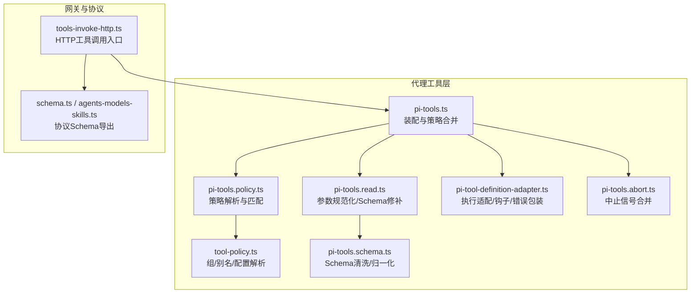
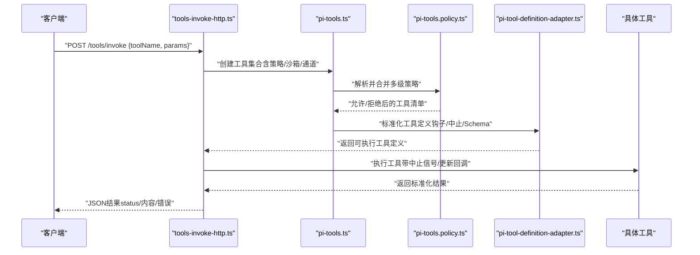
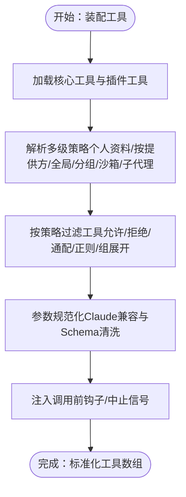
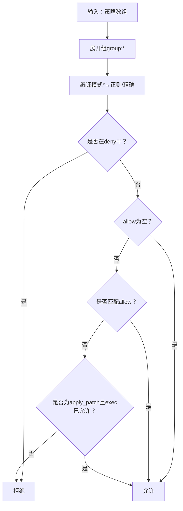
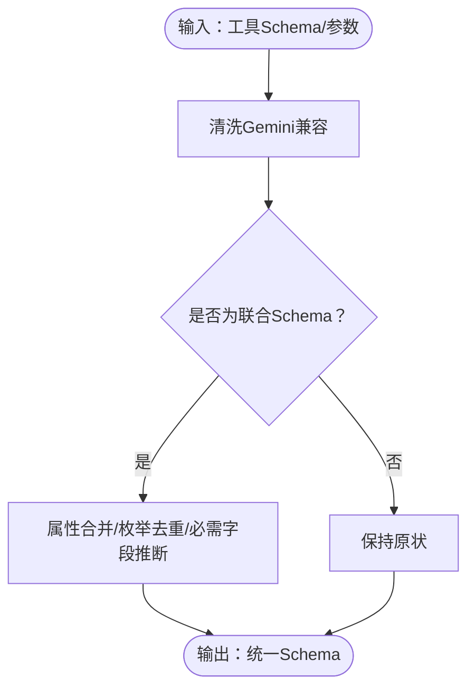
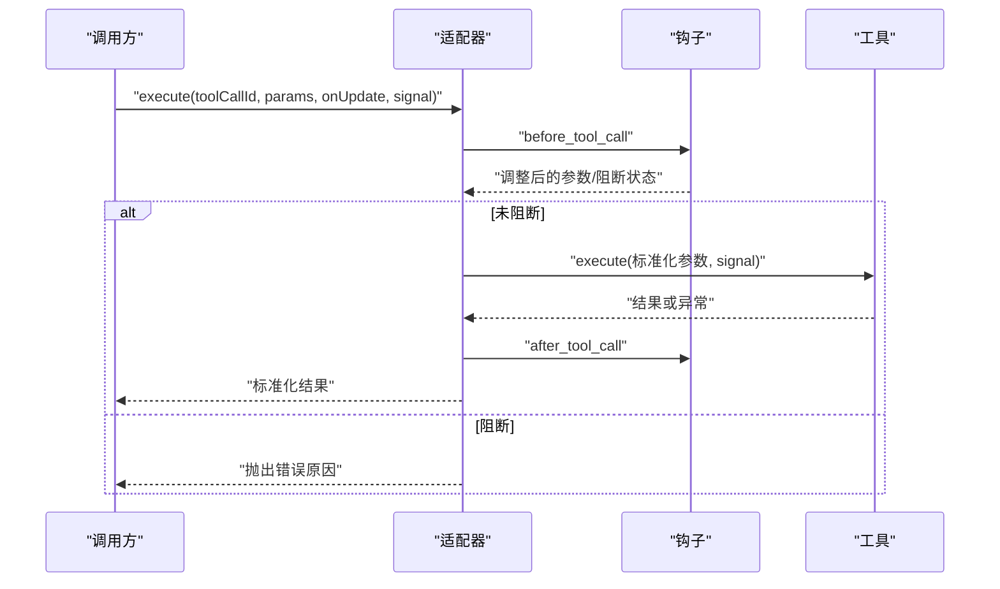
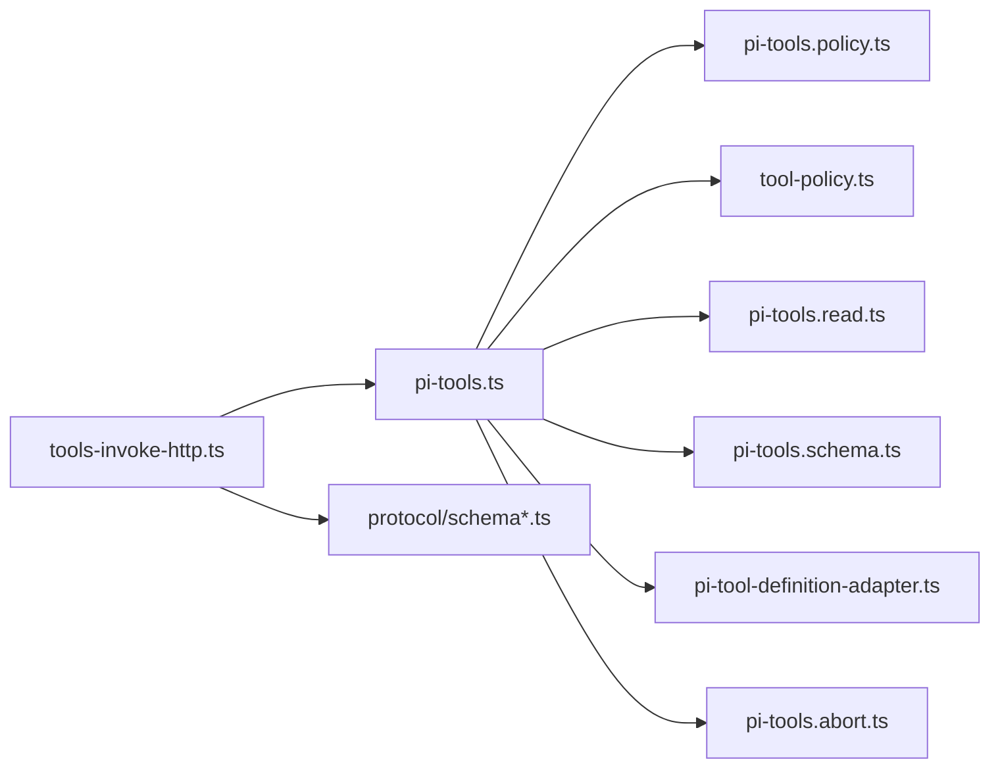

# 代理工具

<cite>
**本文引用的文件**
- [src/agents/pi-tools.ts](file://src/agents/pi-tools.ts)
- [src/agents/pi-tools.policy.ts](file://src/agents/pi-tools.policy.ts)
- [src/agents/pi-tools.types.ts](file://src/agents/pi-tools.types.ts)
- [src/agents/pi-tool-definition-adapter.ts](file://src/agents/pi-tool-definition-adapter.ts)
- [src/agents/pi-tools.read.ts](file://src/agents/pi-tools.read.ts)
- [src/agents/pi-tools.schema.ts](file://src/agents/pi-tools.schema.ts)
- [src/agents/tool-policy.ts](file://src/agents/tool-policy.ts)
- [src/agents/pi-tools.abort.ts](file://src/agents/pi-tools.abort.ts)
- [src/gateway/tools-invoke-http.ts](file://src/gateway/tools-invoke-http.ts)
- [src/gateway/protocol/schema.ts](file://src/gateway/protocol/schema.ts)
- [src/gateway/protocol/schema/agents-models-skills.ts](file://src/gateway/protocol/schema/agents-models-skills.ts)
- [docs/tools/index.md](file://docs/tools/index.md)
- [docs/tools/skills.md](file://docs/tools/skills.md)
- [docs/tools/creating-skills.md](file://docs/tools/creating-skills.md)
</cite>

## 目录

1. [简介](#简介)
2. [项目结构](#项目结构)
3. [核心组件](#核心组件)
4. [架构总览](#架构总览)
5. [详细组件分析](#详细组件分析)
6. [依赖关系分析](#依赖关系分析)
7. [性能考量](#性能考量)
8. [故障排查指南](#故障排查指南)
9. [结论](#结论)
10. [附录](#附录)

## 简介

本文件面向OpenClaw代理工具系统（Pi工具）的技术文档，聚焦于工具的定义、配置与执行机制，覆盖工具策略、模式匹配与代理配置；记录工具调用流程、参数处理与结果格式化；给出工具开发规范、Schema定义与类型安全保障；提供工具集成示例、错误处理与调试方法；解释工具与代理核心的交互协议及性能优化策略，并涵盖工具测试、文档生成与版本管理的最佳实践。

## 项目结构

OpenClaw将“工具”作为代理能力的核心面，围绕Pi工具体系构建了从策略解析、工具装配、参数规范化、Schema清洗到执行适配的完整链路。关键模块分布如下：

- 工具装配与策略：pi-tools.ts、pi-tools.policy.ts、tool-policy.ts
- 参数与Schema处理：pi-tools.read.ts、pi-tools.schema.ts
- 执行适配与钩子：pi-tool-definition-adapter.ts、pi-tools.abort.ts
- 调用入口与协议：gateway/tools-invoke-http.ts、gateway/protocol/schema.ts
- 文档与规范：docs/tools/\*.md

图表来源

- [src/agents/pi-tools.ts](file://src/agents/pi-tools.ts#L1-L457)
- [src/agents/pi-tools.policy.ts](file://src/agents/pi-tools.policy.ts#L1-L340)
- [src/agents/tool-policy.ts](file://src/agents/tool-policy.ts#L1-L292)
- [src/agents/pi-tools.read.ts](file://src/agents/pi-tools.read.ts#L1-L303)
- [src/agents/pi-tools.schema.ts](file://src/agents/pi-tools.schema.ts#L1-L180)
- [src/agents/pi-tool-definition-adapter.ts](file://src/agents/pi-tool-definition-adapter.ts#L1-L217)
- [src/agents/pi-tools.abort.ts](file://src/agents/pi-tools.abort.ts#L1-L67)
- [src/gateway/tools-invoke-http.ts](file://src/gateway/tools-invoke-http.ts#L198-L307)
- [src/gateway/protocol/schema.ts](file://src/gateway/protocol/schema.ts#L1-L16)
- [src/gateway/protocol/schema/agents-models-skills.ts](file://src/gateway/protocol/schema/agents-models-skills.ts#L1-L45)

章节来源

- [src/agents/pi-tools.ts](file://src/agents/pi-tools.ts#L1-L457)
- [src/agents/pi-tools.policy.ts](file://src/agents/pi-tools.policy.ts#L1-L340)
- [src/agents/tool-policy.ts](file://src/agents/tool-policy.ts#L1-L292)
- [src/agents/pi-tools.read.ts](file://src/agents/pi-tools.read.ts#L1-L303)
- [src/agents/pi-tools.schema.ts](file://src/agents/pi-tools.schema.ts#L1-L180)
- [src/agents/pi-tool-definition-adapter.ts](file://src/agents/pi-tool-definition-adapter.ts#L1-L217)
- [src/agents/pi-tools.abort.ts](file://src/agents/pi-tools.abort.ts#L1-L67)
- [src/gateway/tools-invoke-http.ts](file://src/gateway/tools-invoke-http.ts#L198-L307)
- [src/gateway/protocol/schema.ts](file://src/gateway/protocol/schema.ts#L1-L16)
- [src/gateway/protocol/schema/agents-models-skills.ts](file://src/gateway/protocol/schema/agents-models-skills.ts#L1-L45)

## 核心组件

- 工具装配器（pi-tools.ts）
  - 聚合核心工具与插件工具，注入沙箱、消息通道、会话上下文等运行时参数
  - 解析并合并多级策略（全局/按提供方/按代理/分组/沙箱/子代理），进行允许/拒绝过滤
  - 对工具Schema进行归一化，注入“调用前钩子”和“中止信号”，输出标准化工具列表
- 策略解析器（pi-tools.policy.ts、tool-policy.ts）
  - 支持通配符、正则、组展开、别名映射与“仅插件”白名单剥离
  - 提供“按提供方”“按代理”“按分组”“按沙箱”“子代理”等多维策略叠加
- 参数与Schema处理（pi-tools.read.ts、pi-tools.schema.ts）
  - 将模型特定参数风格（如file_path/old_string）转换为内部统一风格
  - 清洗/合并Schema以兼容不同模型后端（如Gemini、OpenAI）
- 执行适配器（pi-tool-definition-adapter.ts）
  - 统一工具执行签名，捕获异常并返回标准化结果
  - 注入“调用前/后”钩子，支持客户端托管工具的“待定”返回
- 中止信号（pi-tools.abort.ts）
  - 合并外部传入与工具内信号，确保跨域/跨iframe场景的可靠中止
- 调用入口（tools-invoke-http.ts）
  - 构建工具清单、应用策略过滤、定位目标工具并返回结果
- 协议Schema（gateway/protocol/schema\*.ts）
  - 导出代理/会话/设备/日志等协议Schema，支撑工具调用与结果格式化

章节来源

- [src/agents/pi-tools.ts](file://src/agents/pi-tools.ts#L115-L456)
- [src/agents/pi-tools.policy.ts](file://src/agents/pi-tools.policy.ts#L115-L340)
- [src/agents/tool-policy.ts](file://src/agents/tool-policy.ts#L135-L292)
- [src/agents/pi-tools.read.ts](file://src/agents/pi-tools.read.ts#L127-L303)
- [src/agents/pi-tools.schema.ts](file://src/agents/pi-tools.schema.ts#L65-L180)
- [src/agents/pi-tool-definition-adapter.ts](file://src/agents/pi-tool-definition-adapter.ts#L82-L173)
- [src/agents/pi-tools.abort.ts](file://src/agents/pi-tools.abort.ts#L45-L67)
- [src/gateway/tools-invoke-http.ts](file://src/gateway/tools-invoke-http.ts#L214-L307)
- [src/gateway/protocol/schema.ts](file://src/gateway/protocol/schema.ts#L1-L16)
- [src/gateway/protocol/schema/agents-models-skills.ts](file://src/gateway/protocol/schema/agents-models-skills.ts#L1-L45)

## 架构总览

下图展示从HTTP入口到工具执行的关键调用链与数据流：

图表来源

- [src/gateway/tools-invoke-http.ts](file://src/gateway/tools-invoke-http.ts#L214-L307)
- [src/agents/pi-tools.ts](file://src/agents/pi-tools.ts#L180-L456)
- [src/agents/pi-tools.policy.ts](file://src/agents/pi-tools.policy.ts#L230-L340)
- [src/agents/pi-tool-definition-adapter.ts](file://src/agents/pi-tool-definition-adapter.ts#L82-L173)

## 详细组件分析

### 工具装配与策略合并（pi-tools.ts）

- 职责
  - 基于配置与会话上下文装配核心工具与插件工具
  - 解析并合并“个人资料/按提供方/全局/分组/沙箱/子代理”策略
  - 应用“所有者专用工具”限制、沙箱路径约束、参数规范化与Schema清洗
  - 注入“调用前钩子”与“中止信号”，输出最终工具数组
- 关键点
  - 允许/拒绝策略的优先级与组合逻辑
  - “apply_patch”对“exec”的特殊放行规则
  - 沙箱根目录下的只读/读写差异处理
  - 多源策略的“未知条目”告警与“仅插件”白名单剥离
- 复杂度
  - 策略解析与展开：O(N + M)，N为工具数，M为策略条目数
  - Schema归一化：对每个工具Schema进行属性合并与枚举去重，整体近似O(K)，K为属性总数

图表来源

- [src/agents/pi-tools.ts](file://src/agents/pi-tools.ts#L180-L456)
- [src/agents/pi-tools.policy.ts](file://src/agents/pi-tools.policy.ts#L230-L340)
- [src/agents/pi-tools.read.ts](file://src/agents/pi-tools.read.ts#L127-L303)
- [src/agents/pi-tools.schema.ts](file://src/agents/pi-tools.schema.ts#L65-L180)

章节来源

- [src/agents/pi-tools.ts](file://src/agents/pi-tools.ts#L115-L456)
- [src/agents/pi-tools.policy.ts](file://src/agents/pi-tools.policy.ts#L115-L340)
- [src/agents/tool-policy.ts](file://src/agents/tool-policy.ts#L135-L292)

### 策略解析与匹配（pi-tools.policy.ts、tool-policy.ts）

- 职责
  - 将“个人资料/按提供方/全局/分组/沙箱/子代理”策略合并为最终可用策略
  - 支持通配符“_”、正则匹配、组展开（group:_）、别名映射（bash→exec、apply-patch→apply_patch）
  - 处理“alsoAllow”与“未知条目”告警，剥离仅插件的白名单以避免误禁核心工具
- 匹配算法
  - 编译模式：将“\*”转为正则，精确名与正则分别匹配
  - deny优先于allow，未显式allow时默认允许
  - 特殊规则：当“exec”被允许时，“apply_patch”自动放行
- 复杂度
  - 模式编译：O(P)，P为模式数
  - 工具匹配：O(T·P)，T为工具数

图表来源

- [src/agents/pi-tools.policy.ts](file://src/agents/pi-tools.policy.ts#L16-L121)
- [src/agents/tool-policy.ts](file://src/agents/tool-policy.ts#L135-L292)

章节来源

- [src/agents/pi-tools.policy.ts](file://src/agents/pi-tools.policy.ts#L115-L340)
- [src/agents/tool-policy.ts](file://src/agents/tool-policy.ts#L135-L292)

### 参数规范化与Schema清洗（pi-tools.read.ts、pi-tools.schema.ts）

- 参数规范化
  - 将Claude Code风格参数（file_path/old_string/new_string）映射为内部统一风格（path/oldText/newText）
  - 校验必填参数组，防止模型训练参数风格导致的循环调用
- Schema清洗与归一化
  - 针对Gemini清理不兼容字段
  - 将顶层联合Schema（anyOf/oneOf）归并为单一对象Schema，保留枚举值与必需字段
  - 强制顶层type: "object"以满足OpenAI要求
- 复杂度
  - 规范化：O(M)，M为参数键数
  - 归并：对每个变体遍历属性，整体近似O(V·A)，V为变体数，A为属性数

图表来源

- [src/agents/pi-tools.read.ts](file://src/agents/pi-tools.read.ts#L127-L303)
- [src/agents/pi-tools.schema.ts](file://src/agents/pi-tools.schema.ts#L65-L180)

章节来源

- [src/agents/pi-tools.read.ts](file://src/agents/pi-tools.read.ts#L127-L303)
- [src/agents/pi-tools.schema.ts](file://src/agents/pi-tools.schema.ts#L65-L180)

### 执行适配与错误处理（pi-tool-definition-adapter.ts）

- 职责
  - 统一工具执行签名，兼容旧版参数顺序
  - 在执行前后注入钩子，记录调用上下文
  - 捕获异常并返回标准化结果（status/error/tool/message）
  - 支持客户端托管工具的“待定”返回
- 错误处理
  - 过滤堆栈中的无关帧，仅记录必要信息
  - 对AbortError与用户中止信号进行透传
- 复杂度
  - 适配与钩子：O(1)额外开销

图表来源

- [src/agents/pi-tool-definition-adapter.ts](file://src/agents/pi-tool-definition-adapter.ts#L82-L173)

章节来源

- [src/agents/pi-tool-definition-adapter.ts](file://src/agents/pi-tool-definition-adapter.ts#L82-L173)

### 中止信号合并（pi-tools.abort.ts）

- 职责
  - 合并多个AbortSignal，支持跨域/跨iframe场景
  - 若任一信号已中止，直接抛出AbortError
- 复杂度
  - 合并：O(1)，检查中止：O(1)

章节来源

- [src/agents/pi-tools.abort.ts](file://src/agents/pi-tools.abort.ts#L18-L67)

### 调用入口与协议（tools-invoke-http.ts、protocol/schema\*.ts）

- 调用入口
  - 收集并合并多源策略，构建工具清单，定位目标工具并返回结果
- 协议Schema
  - 导出代理/会话/设备/日志等协议Schema，确保工具调用与结果格式一致

章节来源

- [src/gateway/tools-invoke-http.ts](file://src/gateway/tools-invoke-http.ts#L214-L307)
- [src/gateway/protocol/schema.ts](file://src/gateway/protocol/schema.ts#L1-L16)
- [src/gateway/protocol/schema/agents-models-skills.ts](file://src/gateway/protocol/schema/agents-models-skills.ts#L1-L45)

## 依赖关系分析

- 组件耦合
  - pi-tools.ts依赖策略解析、工具组/别名、参数/Schema处理、适配器与中止信号
  - 策略解析依赖工具组定义与消息通道/分组解析
  - 适配器依赖钩子运行器与通用工具结果封装
- 外部依赖
  - 类型安全通过@sinclair/typebox与TypeScript严格模式保障
  - 模型后端兼容性通过Schema清洗与参数规范化实现

图表来源

- [src/agents/pi-tools.ts](file://src/agents/pi-tools.ts#L1-L457)
- [src/agents/pi-tools.policy.ts](file://src/agents/pi-tools.policy.ts#L1-L340)
- [src/agents/tool-policy.ts](file://src/agents/tool-policy.ts#L1-L292)
- [src/agents/pi-tools.read.ts](file://src/agents/pi-tools.read.ts#L1-L303)
- [src/agents/pi-tools.schema.ts](file://src/agents/pi-tools.schema.ts#L1-L180)
- [src/agents/pi-tool-definition-adapter.ts](file://src/agents/pi-tool-definition-adapter.ts#L1-L217)
- [src/agents/pi-tools.abort.ts](file://src/agents/pi-tools.abort.ts#L1-L67)
- [src/gateway/tools-invoke-http.ts](file://src/gateway/tools-invoke-http.ts#L198-L307)
- [src/gateway/protocol/schema.ts](file://src/gateway/protocol/schema.ts#L1-L16)

章节来源

- [src/agents/pi-tools.ts](file://src/agents/pi-tools.ts#L1-L457)
- [src/agents/pi-tools.policy.ts](file://src/agents/pi-tools.policy.ts#L1-L340)
- [src/agents/tool-policy.ts](file://src/agents/tool-policy.ts#L1-L292)
- [src/agents/pi-tools.read.ts](file://src/agents/pi-tools.read.ts#L1-L303)
- [src/agents/pi-tools.schema.ts](file://src/agents/pi-tools.schema.ts#L1-L180)
- [src/agents/pi-tool-definition-adapter.ts](file://src/agents/pi-tool-definition-adapter.ts#L1-L217)
- [src/agents/pi-tools.abort.ts](file://src/agents/pi-tools.abort.ts#L1-L67)
- [src/gateway/tools-invoke-http.ts](file://src/gateway/tools-invoke-http.ts#L198-L307)
- [src/gateway/protocol/schema.ts](file://src/gateway/protocol/schema.ts#L1-L16)

## 性能考量

- 策略解析
  - 使用“组展开+别名映射”减少重复配置，降低匹配复杂度
  - 对“未知条目”进行一次性告警，避免每次调用重复扫描
- 参数与Schema
  - 仅在装配阶段进行一次参数规范化与Schema清洗，后续复用
  - 联合Schema归并避免重复计算，枚举值去重提升传输效率
- 执行适配
  - 钩子与中止信号为O(1)开销，尽量避免在钩子中进行重IO
- 网关调用
  - 工具清单构建与策略过滤在HTTP入口处集中完成，减少模型侧负担

[本节为通用指导，无需列出章节来源]

## 故障排查指南

- 工具不可见
  - 检查策略：tools.allow/tools.deny、个人资料、按提供方策略、分组策略、沙箱策略与子代理策略
  - 关注“未知条目”告警，确认是否仅启用插件但未开启插件工具
- 执行失败
  - 查看标准化错误结果（status:error/tool/error），区分模型参数问题与运行时异常
  - 注意AbortError与用户中止信号的区别
- 参数不生效
  - 确认参数风格是否符合Claude兼容映射（file_path/old_string/new_string）
  - 检查必填参数组校验是否通过
- Schema被拒
  - 确认顶层type: "object"与Gemini兼容字段已被清洗
  - 避免顶级anyOf/oneOf同时存在type，使用归一化后的Schema

章节来源

- [src/agents/pi-tools.policy.ts](file://src/agents/pi-tools.policy.ts#L334-L340)
- [src/agents/pi-tool-definition-adapter.ts](file://src/agents/pi-tool-definition-adapter.ts#L126-L173)
- [src/agents/pi-tools.read.ts](file://src/agents/pi-tools.read.ts#L202-L252)
- [src/agents/pi-tools.schema.ts](file://src/agents/pi-tools.schema.ts#L80-L102)

## 结论

OpenClaw的Pi工具体系通过“装配-策略-参数-Schema-适配-执行”的清晰分层，实现了类型安全、可扩展与高兼容性的工具面。多维策略与钩子机制确保了安全性与可观测性；参数与Schema的规范化提升了跨模型一致性；HTTP入口与协议Schema保障了工具调用的标准化与可追溯。建议在实际部署中结合文档与策略示例，按需启用工具与插件，并通过告警与日志持续优化工具清单与参数配置。

[本节为总结性内容，无需列出章节来源]

## 附录

### 工具开发规范

- 定义工具
  - 使用统一的AgentTool接口，提供name/label/description/parameters/execute
  - 在装配阶段由pi-tools.ts统一注入钩子与中止信号
- 参数与Schema
  - 遵循Claude兼容风格，必要时通过pi-tools.read.ts进行规范化
  - Schema应避免顶级联合类型，必要时由pi-tools.schema.ts进行归一化
- 安全与权限
  - 对“所有者专用工具”进行访问控制
  - 沙箱环境下严格限制路径与写操作
- 测试与验证
  - 使用pi-tools.policy.test.ts与pi-tool-definition-adapter.test.ts的模式与错误包装示例
  - 通过tools-invoke-http.ts的调用流程进行端到端验证

章节来源

- [src/agents/pi-tools.types.ts](file://src/agents/pi-tools.types.ts#L1-L5)
- [src/agents/pi-tools.read.ts](file://src/agents/pi-tools.read.ts#L127-L303)
- [src/agents/pi-tools.schema.ts](file://src/agents/pi-tools.schema.ts#L65-L180)
- [src/agents/tool-policy.ts](file://src/agents/tool-policy.ts#L91-L110)
- [src/agents/pi-tools.policy.test.ts](file://src/agents/pi-tools.policy.test.ts#L1-L36)
- [src/agents/pi-tool-definition-adapter.test.ts](file://src/agents/pi-tool-definition-adapter.test.ts#L1-L48)
- [src/gateway/tools-invoke-http.ts](file://src/gateway/tools-invoke-http.ts#L214-L307)

### Schema定义与类型安全

- 使用TypeBox定义协议Schema，确保字段与约束一致
- 在工具Schema清洗阶段，移除不兼容字段并强制顶层类型
- 通过TypeBox校验工具参数，减少运行期错误

章节来源

- [src/gateway/protocol/schema.ts](file://src/gateway/protocol/schema.ts#L1-L16)
- [src/gateway/protocol/schema/agents-models-skills.ts](file://src/gateway/protocol/schema/agents-models-skills.ts#L1-L45)
- [src/agents/pi-tools.schema.ts](file://src/agents/pi-tools.schema.ts#L65-L180)

### 工具集成示例与最佳实践

- 工具集成
  - 在插件中注册工具并通过pi-tools.ts的插件组机制自动展开
  - 使用tools-invoke-http.ts的策略合并与过滤，确保最小权限原则
- 错误处理与调试
  - 通过标准化错误结果定位问题；关注“未知条目”告警与“仅插件”白名单剥离提示
  - 使用before_tool_call/after_tool_call钩子记录调用上下文
- 文档与版本管理
  - 参考docs/tools/index.md与docs/tools/skills.md维护工具与技能文档
  - 使用TypeBox与Schema清洗保障跨版本兼容性

章节来源

- [docs/tools/index.md](file://docs/tools/index.md#L1-L513)
- [docs/tools/skills.md](file://docs/tools/skills.md#L1-L301)
- [docs/tools/creating-skills.md](file://docs/tools/creating-skills.md#L1-L55)
- [src/agents/pi-tool-definition-adapter.ts](file://src/agents/pi-tool-definition-adapter.ts#L94-L173)
