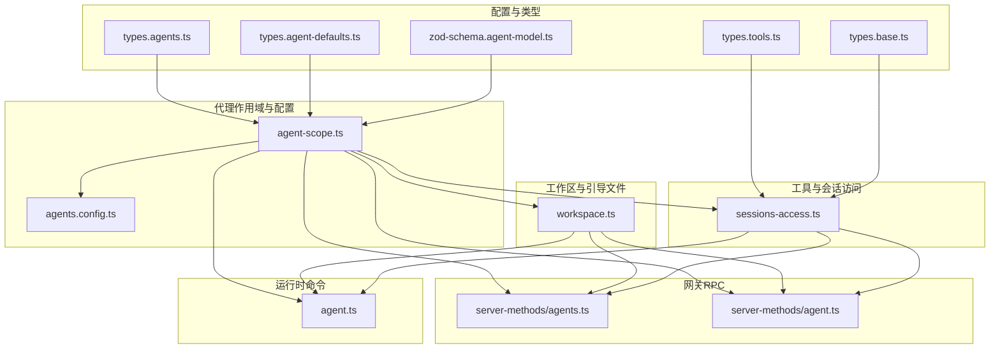
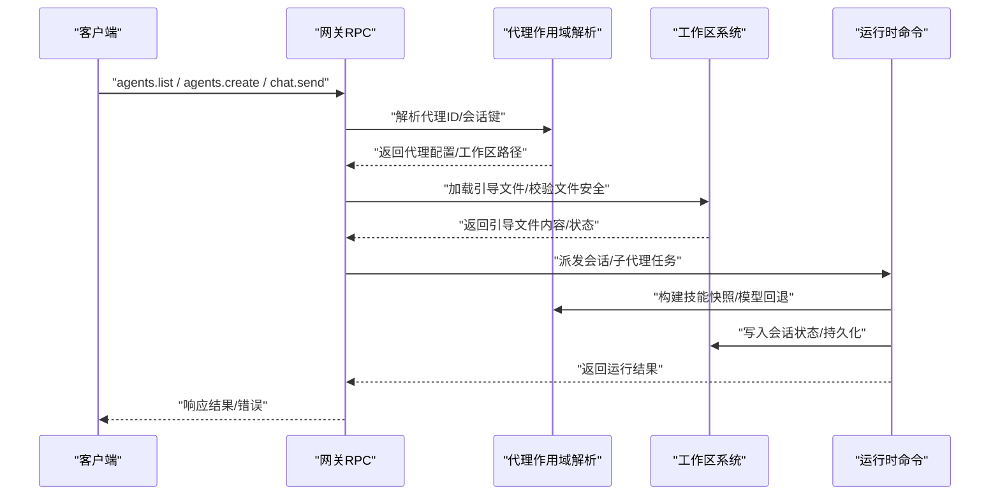
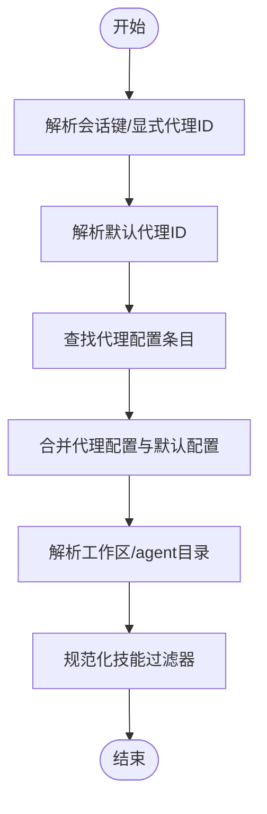
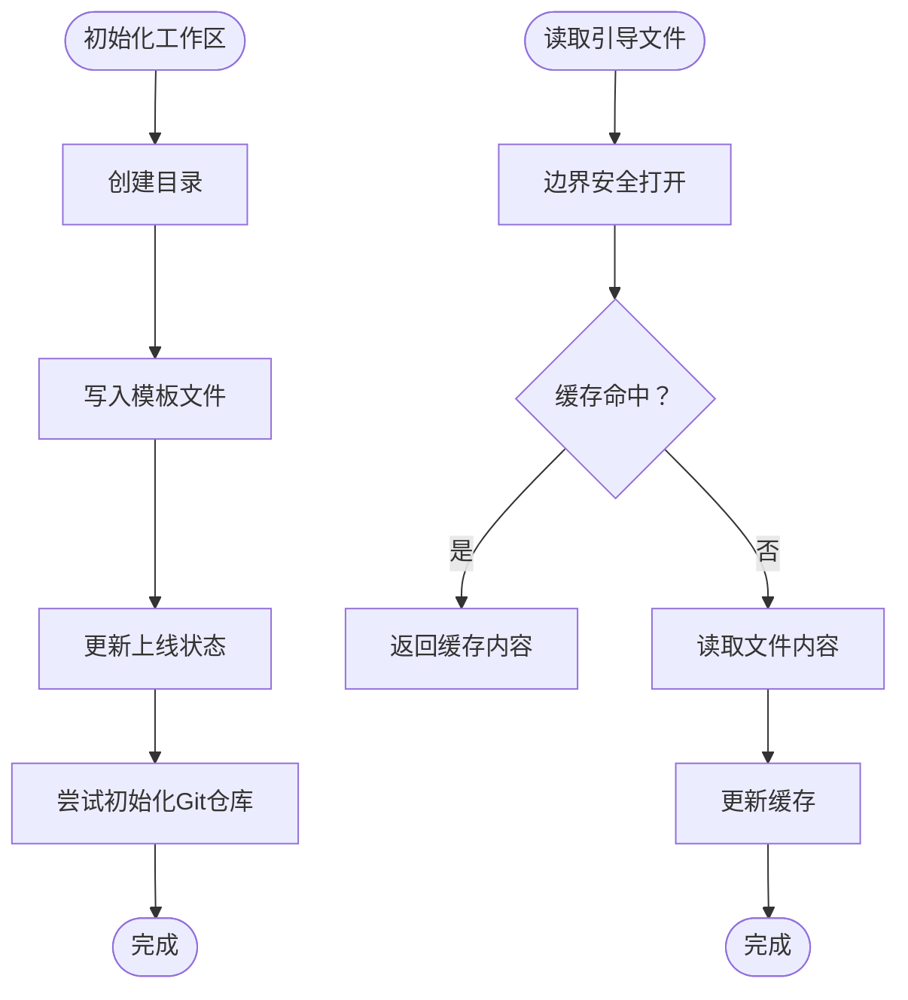
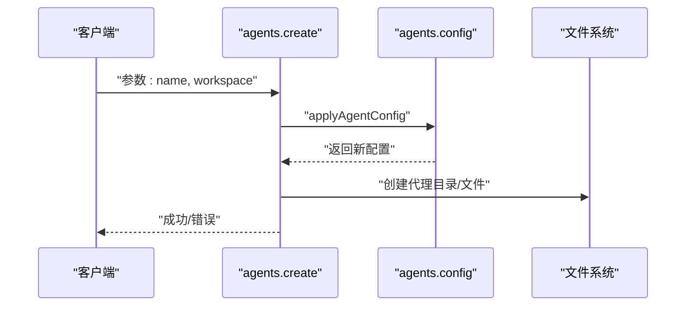
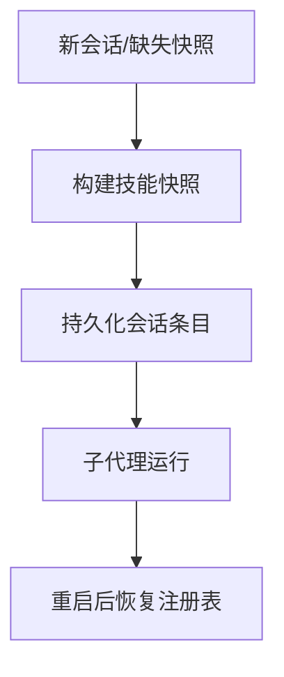
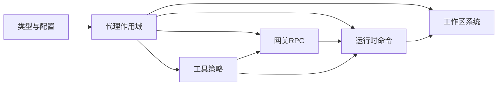

# 代理架构设计

<cite>
**本文引用的文件**
- [agent-scope.ts](file://src/agents/agent-scope.ts)
- [workspace.ts](file://src/agents/workspace.ts)
- [agents.config.ts](file://src/commands/agents.config.ts)
- [types.agents.ts](file://src/config/types.agents.ts)
- [types.agent-defaults.ts](file://src/config/types.agent-defaults.ts)
- [types.tools.ts](file://src/config/types.tools.ts)
- [types.base.ts](file://src/config/types.base.ts)
- [zod-schema.agent-model.ts](file://src/config/zod-schema.agent-model.ts)
- [sessions-access.ts](file://src/agents/tools/sessions-access.ts)
- [agent.ts](file://src/commands/agent.ts)
- [server-methods/agents.ts](file://src/gateway/server-methods/agents.ts)
- [server-methods/agent.ts](file://src/gateway/server-methods/agent.ts)
- [workspace.bootstrap-cache.test.ts](file://src/agents/workspace.bootstrap-cache.test.ts)
- [bootstrap-files.test.ts](file://src/agents/bootstrap-files.test.ts)
- [subagent-registry.persistence.test.ts](file://src/agents/subagent-registry.persistence.test.ts)
- [THREAT-MODEL-ATLAS.md](file://docs/security/THREAT-MODEL-ATLAS.md)
- [SECURITY.md](file://SECURITY.md)
- [local-roots.ts](file://src/media/local-roots.ts)
- [config.plugin-validation.test.ts](file://src/config/config.plugin-validation.test.ts)
</cite>

## 目录

1. [引言](#引言)
2. [项目结构](#项目结构)
3. [核心组件](#核心组件)
4. [架构总览](#架构总览)
5. [详细组件分析](#详细组件分析)
6. [依赖关系分析](#依赖关系分析)
7. [性能考量](#性能考量)
8. [故障排查指南](#故障排查指南)
9. [结论](#结论)
10. [附录](#附录)

## 引言

本技术文档面向OpenClaw代理系统的架构与实现，聚焦于代理的作用域管理、路径解析、引导文件系统与默认配置策略，以及生命周期管理、状态持久化与内存管理机制。同时覆盖代理配置模式、约束验证与安全边界设计，并提供扩展指南与自定义代理类型的开发方法，帮助开发者从代码层面理解OpenClaw代理系统的底层设计。

## 项目结构

OpenClaw代理架构由“配置模型”“作用域解析”“工作区与引导文件系统”“工具与会话访问控制”“网关RPC处理”等模块协同组成。下图展示与代理相关的关键文件与职责映射：

图表来源

- [types.agents.ts](file://src/config/types.agents.ts#L7-L39)
- [types.agent-defaults.ts](file://src/config/types.agent-defaults.ts#L119-L268)
- [types.tools.ts](file://src/config/types.tools.ts#L273-L301)
- [types.base.ts](file://src/config/types.base.ts#L227-L227)
- [zod-schema.agent-model.ts](file://src/config/zod-schema.agent-model.ts#L1-L11)
- [agent-scope.ts](file://src/agents/agent-scope.ts#L1-L282)
- [agents.config.ts](file://src/commands/agents.config.ts#L1-L211)
- [workspace.ts](file://src/agents/workspace.ts#L1-L656)
- [sessions-access.ts](file://src/agents/tools/sessions-access.ts#L90-L134)
- [server-methods/agents.ts](file://src/gateway/server-methods/agents.ts#L208-L269)
- [server-methods/agent.ts](file://src/gateway/server-methods/agent.ts#L260-L275)
- [agent.ts](file://src/commands/agent.ts#L485-L522)

章节来源

- [agent-scope.ts](file://src/agents/agent-scope.ts#L1-L282)
- [workspace.ts](file://src/agents/workspace.ts#L1-L656)
- [agents.config.ts](file://src/commands/agents.config.ts#L1-L211)
- [types.agents.ts](file://src/config/types.agents.ts#L7-L39)
- [types.agent-defaults.ts](file://src/config/types.agent-defaults.ts#L119-L268)
- [types.tools.ts](file://src/config/types.tools.ts#L273-L301)
- [types.base.ts](file://src/config/types.base.ts#L227-L227)
- [zod-schema.agent-model.ts](file://src/config/zod-schema.agent-model.ts#L1-L11)
- [sessions-access.ts](file://src/agents/tools/sessions-access.ts#L90-L134)
- [server-methods/agents.ts](file://src/gateway/server-methods/agents.ts#L208-L269)
- [server-methods/agent.ts](file://src/gateway/server-methods/agent.ts#L260-L275)
- [agent.ts](file://src/commands/agent.ts#L485-L522)

## 核心组件

- 代理作用域与配置解析：负责代理ID解析、默认代理选择、代理配置合并与模型回退策略、工作区与agent目录解析。
- 工作区与引导文件系统：负责工作区初始化、引导文件注入、缓存与安全读取、最小化子代理引导集。
- 配置与类型系统：定义代理配置、默认值、工具策略、心跳策略、沙箱策略等类型与校验。
- 工具与会话访问控制：实现跨代理会话访问策略、允许列表匹配与动作前缀。
- 网关RPC处理：提供代理列表、创建、文件列举等RPC接口，执行参数校验与安全检查。
- 运行时命令：在会话启动时构建技能快照、持久化会话状态、管理子代理注册表。

章节来源

- [agent-scope.ts](file://src/agents/agent-scope.ts#L45-L144)
- [workspace.ts](file://src/agents/workspace.ts#L321-L459)
- [agents.config.ts](file://src/commands/agents.config.ts#L83-L124)
- [types.agents.ts](file://src/config/types.agents.ts#L7-L39)
- [types.agent-defaults.ts](file://src/config/types.agent-defaults.ts#L119-L268)
- [types.tools.ts](file://src/config/types.tools.ts#L273-L301)
- [sessions-access.ts](file://src/agents/tools/sessions-access.ts#L90-L134)
- [server-methods/agents.ts](file://src/gateway/server-methods/agents.ts#L347-L378)
- [agent.ts](file://src/commands/agent.ts#L485-L522)

## 架构总览

OpenClaw代理架构采用“配置驱动 + 作用域解析 + 安全边界”的设计范式。配置模型定义代理与默认行为，作用域解析模块将配置映射到具体运行时环境（工作区、模型、工具策略），工作区模块提供引导文件与状态持久化能力，网关RPC提供对外接口，运行时命令负责会话生命周期与状态管理。

图表来源

- [server-methods/agents.ts](file://src/gateway/server-methods/agents.ts#L347-L378)
- [agent-scope.ts](file://src/agents/agent-scope.ts#L117-L144)
- [workspace.ts](file://src/agents/workspace.ts#L498-L555)
- [agent.ts](file://src/commands/agent.ts#L485-L522)

## 详细组件分析

### 代理作用域与配置解析

- 代理ID解析与默认代理选择：支持从会话键解析代理ID，若未显式指定则使用默认代理；当存在多个默认代理时记录警告并按顺序选择。
- 代理配置合并：优先使用代理级配置，其次使用全局默认配置；模型主模型与回退列表可分别在代理级或全局级设置。
- 工作区与agent目录解析：支持用户配置的工作区与agent目录，否则回退到状态目录下的默认位置；对路径进行空字节清理以避免系统错误。
- 技能过滤：对代理技能白名单进行规范化处理，确保后续工具调用与会话访问控制一致。

图表来源

- [agent-scope.ts](file://src/agents/agent-scope.ts#L85-L144)

章节来源

- [agent-scope.ts](file://src/agents/agent-scope.ts#L45-L144)

### 工作区与引导文件系统

- 默认工作区与模板：提供默认工作区路径解析与模板加载；首次创建时写入标准引导文件（如AGENTS、SOUL、TOOLS、IDENTITY、USER、HEARTBEAT、BOOTSTRAP）。
- 安全读取与缓存：通过边界文件打开与inode/dev/大小/修改时间组合的身份标识实现缓存，避免重复读取与竞态；限制单文件最大字节数。
- 引导文件注入与去重：支持额外引导文件的glob匹配与诊断；对MEMORY系列文件进行去重处理；子代理与定时任务场景仅注入最小集合。
- 上线状态追踪：维护工作区上线状态文件，记录引导种子与完成时间，兼容旧版迁移路径。

图表来源

- [workspace.ts](file://src/agents/workspace.ts#L321-L459)
- [workspace.ts](file://src/agents/workspace.ts#L498-L555)
- [workspace.ts](file://src/agents/workspace.ts#L575-L655)

章节来源

- [workspace.ts](file://src/agents/workspace.ts#L12-L656)
- [workspace.bootstrap-cache.test.ts](file://src/agents/workspace.bootstrap-cache.test.ts#L125-L168)
- [bootstrap-files.test.ts](file://src/agents/bootstrap-files.test.ts#L27-L68)

### 配置与类型系统

- 代理配置类型：包含id、name、workspace、agentDir、model、skills、memorySearch、humanDelay、heartbeat、identity、groupChat、subagents、sandbox、params、tools等字段。
- 默认配置类型：涵盖模型、图像模型、模型目录、工作区、repoRoot、跳过引导、引导注入上限、时区与时间格式、信封时间戳、上下文令牌上限、CLI后端、上下文修剪、压缩、嵌入式Pi策略、记忆检索、思考/详细/加权级别、块流式传输、人类延迟、超时、媒体与图片尺寸、打字指示、心跳、并发、子代理默认值、沙箱等。
- 工具配置类型：支持基础工具档案、允许/拒绝列表、按提供者策略、提升执行门禁、执行工具默认值、文件系统路径守卫、循环检测、沙箱工具白名单等。
- 心跳策略：支持周期性心跳、活动时段窗口、目标交付、直接消息策略、账户与通道覆盖、提示与ACK长度、抑制工具错误告警、推理输出等。
- 模型Schema：支持字符串或{primary,fallbacks}对象形式的模型配置。

章节来源

- [types.agents.ts](file://src/config/types.agents.ts#L7-L39)
- [types.agent-defaults.ts](file://src/config/types.agent-defaults.ts#L119-L268)
- [types.tools.ts](file://src/config/types.tools.ts#L273-L301)
- [types.base.ts](file://src/config/types.base.ts#L227-L227)
- [zod-schema.agent-model.ts](file://src/config/zod-schema.agent-model.ts#L1-L11)

### 工具与会话访问控制

- 跨代理会话访问策略：支持启用开关、允许模式（通配符）、同名代理自动放行、双向匹配校验。
- 动作前缀：区分历史查询、发送消息、列出会话三类操作的前缀描述。
- 与配置的集成：策略来源于全局tools配置中的agentToAgent段落，结合代理ID进行匹配。

章节来源

- [sessions-access.ts](file://src/agents/tools/sessions-access.ts#L90-L134)

### 网关RPC与生命周期管理

- agents.list：加载配置并返回代理清单，包含名称、身份信息、工作区、agent目录、模型、绑定数量与是否默认代理。
- agents.create：参数校验、应用配置变更、创建代理文件与目录；对路径存在性与trash回收进行最佳努力处理。
- 代理文件列举：安全统计文件元数据，排除符号链接、硬链接、非普通文件与不一致文件，支持隐藏引导文件。
- 代理参数校验：对agentId进行规范化与存在性检查，未知ID返回无效请求错误。

图表来源

- [server-methods/agents.ts](file://src/gateway/server-methods/agents.ts#L347-L378)
- [agents.config.ts](file://src/commands/agents.config.ts#L126-L164)

章节来源

- [server-methods/agents.ts](file://src/gateway/server-methods/agents.ts#L208-L269)
- [server-methods/agents.ts](file://src/gateway/server-methods/agents.ts#L347-L378)
- [server-methods/agent.ts](file://src/gateway/server-methods/agent.ts#L260-L275)
- [agents.config.ts](file://src/commands/agents.config.ts#L83-L124)

### 运行时命令与状态持久化

- 技能快照：在新会话或缺失时构建工作区技能快照，版本化管理，必要时持久化到会话存储。
- 子代理注册表：在重启后恢复持久化的子代理运行记录，确保生命周期连续性。
- 媒体本地根：根据代理工作区动态扩展媒体本地根目录，保证媒体访问一致性。

图表来源

- [agent.ts](file://src/commands/agent.ts#L485-L522)
- [subagent-registry.persistence.test.ts](file://src/agents/subagent-registry.persistence.test.ts#L164-L180)
- [local-roots.ts](file://src/media/local-roots.ts#L38-L55)

章节来源

- [agent.ts](file://src/commands/agent.ts#L485-L522)
- [subagent-registry.persistence.test.ts](file://src/agents/subagent-registry.persistence.test.ts#L103-L180)
- [local-roots.ts](file://src/media/local-roots.ts#L38-L55)

## 依赖关系分析

- 类型与配置：代理配置类型与默认配置类型共同决定运行时行为；工具类型与基础类型为策略与权限提供约束。
- 作用域与工作区：作用域解析依赖配置与路径解析，工作区系统依赖作用域解析的结果进行文件注入与缓存。
- 网关与命令：网关RPC依赖作用域解析与工作区系统；命令层在运行时依赖作用域解析与工作区系统进行状态持久化。
- 安全边界：威胁模型与安全文档明确了信任边界与代理假设，指导工具策略与沙箱策略的设计。

图表来源

- [types.agents.ts](file://src/config/types.agents.ts#L7-L39)
- [types.agent-defaults.ts](file://src/config/types.agent-defaults.ts#L119-L268)
- [types.tools.ts](file://src/config/types.tools.ts#L273-L301)
- [types.base.ts](file://src/config/types.base.ts#L227-L227)
- [agent-scope.ts](file://src/agents/agent-scope.ts#L1-L282)
- [workspace.ts](file://src/agents/workspace.ts#L1-L656)
- [server-methods/agents.ts](file://src/gateway/server-methods/agents.ts#L208-L269)
- [agent.ts](file://src/commands/agent.ts#L485-L522)

章节来源

- [THREAT-MODEL-ATLAS.md](file://docs/security/THREAT-MODEL-ATLAS.md#L56-L123)
- [SECURITY.md](file://SECURITY.md#L145-L168)

## 性能考量

- 缓存与I/O优化：工作区文件读取通过边界安全打开与基于文件身份的缓存减少重复I/O与竞态风险。
- 最小化引导集：子代理与定时任务场景仅注入必要的引导文件，降低上下文注入成本。
- 并发与限流：全局并发与子代理并发限制通过默认配置控制，避免资源争用。
- 内存与上下文修剪：上下文修剪与压缩策略在默认配置中提供软/硬阈值与保留策略，平衡性能与效果。

## 故障排查指南

- 参数校验失败：agents.list/agents.create等RPC接口会对参数进行严格校验，错误信息包含具体路径与问题描述，需对照配置类型修正。
- 代理ID不存在：在agent参数校验阶段会检查代理ID是否存在于已配置列表，未知ID将返回无效请求错误。
- 文件安全与缓存：工作区文件读取失败可能由边界违规、路径问题或缓存失效导致，建议检查文件权限与路径解析。
- 心跳策略校验：心跳directPolicy枚举值必须符合规范，非法值会被配置校验拦截。
- 媒体根目录：若媒体访问异常，检查代理工作区是否被正确加入媒体本地根目录。

章节来源

- [server-methods/agents.ts](file://src/gateway/server-methods/agents.ts#L347-L378)
- [server-methods/agent.ts](file://src/gateway/server-methods/agent.ts#L260-L275)
- [config.plugin-validation.test.ts](file://src/config/config.plugin-validation.test.ts#L239-L266)
- [local-roots.ts](file://src/media/local-roots.ts#L38-L55)

## 结论

OpenClaw代理架构通过清晰的配置模型、严格的边界与缓存策略、完善的引导文件系统与会话生命周期管理，实现了可扩展、可审计、可持久化的代理运行环境。开发者可在上述基础上扩展新的代理类型、定制工具策略与沙箱规则，并遵循安全边界与约束验证，确保系统在多租户与复杂外部交互场景下的安全性与稳定性。

## 附录

### 代理配置模式与约束验证

- 心跳策略：支持周期、活动时段、目标交付、直接消息策略、账户与通道覆盖、提示与ACK长度、抑制工具错误告警、推理输出等。
- 模型回退：支持代理级与全局级主模型与回退列表，回退列表为空数组表示禁用全局回退。
- 工具策略：支持基础档案、允许/拒绝列表、按提供者覆盖、提升执行门禁、执行工具默认值、文件系统路径守卫、循环检测、沙箱工具白名单。

章节来源

- [types.agent-defaults.ts](file://src/config/types.agent-defaults.ts#L207-L244)
- [types.agent-defaults.ts](file://src/config/types.agent-defaults.ts#L119-L268)
- [types.tools.ts](file://src/config/types.tools.ts#L273-L301)
- [zod-schema.agent-model.ts](file://src/config/zod-schema.agent-model.ts#L1-L11)

### 安全边界设计

- 信任边界：明确渠道接入、会话隔离、工具执行、外部内容、供应链五个信任边界，强调宿主/配置信任、认证、工具策略、沙箱与执行审批的重要性。
- 代理与模型假设：模型/代理不是可信主体，需通过宿主/配置信任、认证、工具策略、沙箱与执行审批来建立安全边界。
- 工作区内存信任边界：工作区内的MEMORY文件被视为受信任的本地操作状态，跨边界编辑即视为越界。

章节来源

- [THREAT-MODEL-ATLAS.md](file://docs/security/THREAT-MODEL-ATLAS.md#L56-L123)
- [SECURITY.md](file://SECURITY.md#L145-L168)
