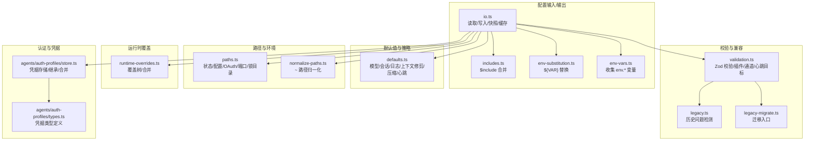
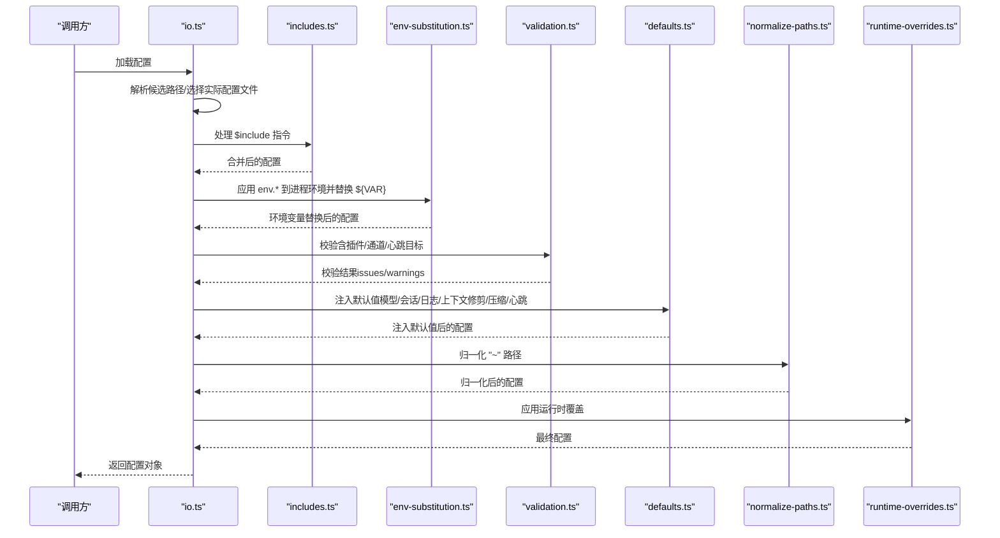
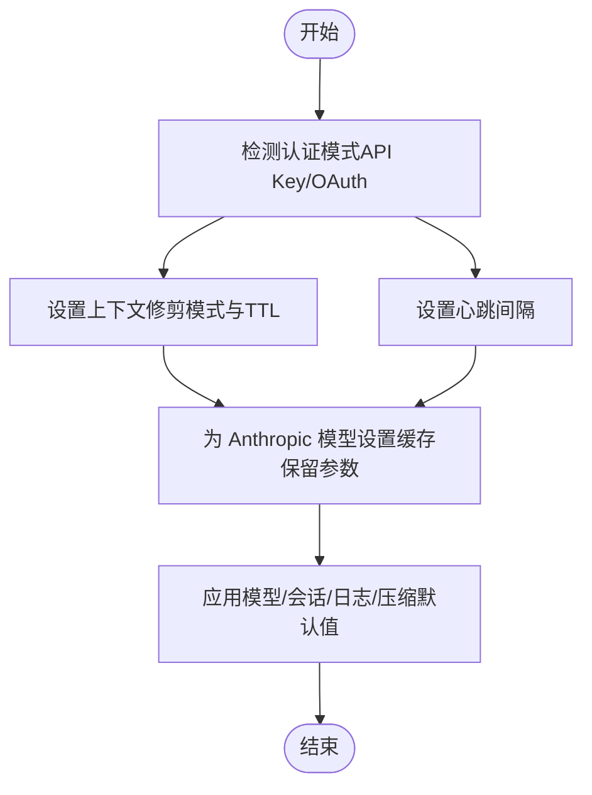
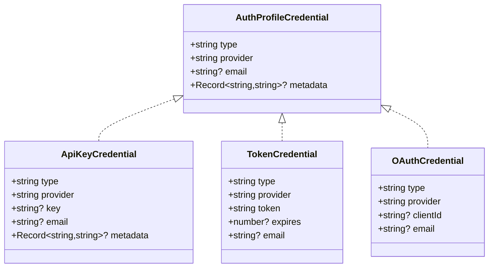
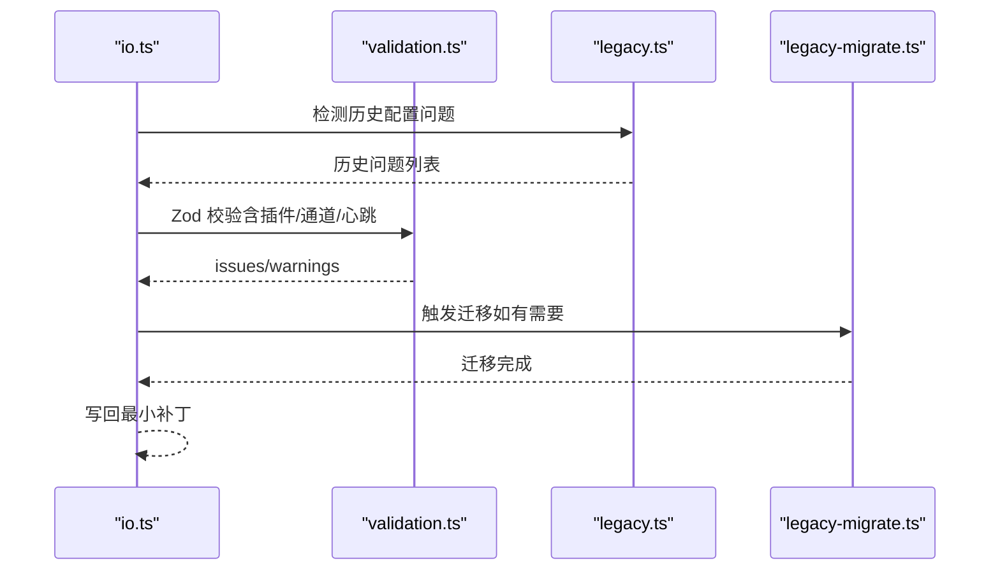
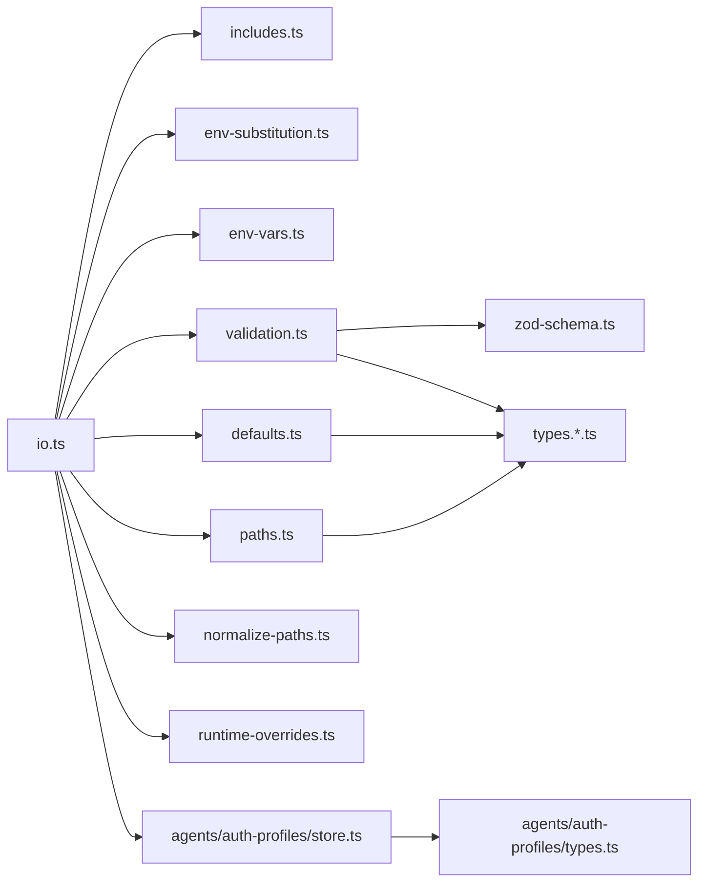

# 代理配置

<cite>
**本文引用的文件**
- [src/config/config.ts](file://src/config/config.ts)
- [src/config/defaults.ts](file://src/config/defaults.ts)
- [src/config/validation.ts](file://src/config/validation.ts)
- [src/config/io.ts](file://src/config/io.ts)
- [src/config/paths.ts](file://src/config/paths.ts)
- [src/config/normalize-paths.ts](file://src/config/normalize-paths.ts)
- [src/config/runtime-overrides.ts](file://src/config/runtime-overrides.ts)
- [src/config/types.agents.ts](file://src/config/types.agents.ts)
- [src/config/env-vars.ts](file://src/config/env-vars.ts)
- [src/config/merge-config.ts](file://src/config/merge-config.ts)
- [src/config/agent-dirs.ts](file://src/config/agent-dirs.ts)
- [src/config/redact-snapshot.ts](file://src/config/redact-snapshot.ts)
- [src/config/legacy.ts](file://src/config/legacy.ts)
- [src/config/legacy-migrate.ts](file://src/config/legacy-migrate.ts)
- [src/config/legacy.migrations.ts](file://src/config/legacy.migrations.ts)
- [src/config/legacy.migrations.part-1.ts](file://src/config/legacy.migrations.part-1.ts)
- [src/config/legacy.migrations.part-2.ts](file://src/config/legacy.migrations.part-2.ts)
- [src/config/legacy.migrations.part-3.ts](file://src/config/legacy.migrations.part-3.ts)
- [src/config/legacy.rules.ts](file://src/config/legacy.rules.ts)
- [src/config/legacy.shared.ts](file://src/config/legacy.shared.ts)
- [src/config/version.ts](file://src/config/version.ts)
- [src/config/zod-schema.ts](file://src/config/zod-schema.ts)
- [src/config/zod-schema.agent-defaults.ts](file://src/config/zod-schema.agent-defaults.ts)
- [src/config/zod-schema.agents.ts](file://src/config/zod-schema.agents.ts)
- [src/config/zod-schema.core.ts](file://src/config/zod-schema.core.ts)
- [src/config/zod-schema.providers.ts](file://src/config/zod-schema.providers.ts)
- [src/config/zod-schema.session.ts](file://src/config/zod-schema.session.ts)
- [src/config/types.ts](file://src/config/types.ts)
- [src/config/types.base.ts](file://src/config/types.base.ts)
- [src/config/types.auth.ts](file://src/config/types.auth.ts)
- [src/config/types.models.ts](file://src/config/types.models.ts)
- [src/config/types.plugins.ts](file://src/config/types.plugins.ts)
- [src/config/types.sandbox.ts](file://src/config/types.sandbox.ts)
- [src/config/types.tools.ts](file://src/config/types.tools.ts)
- [src/config/types.messages.ts](file://src/config/types.messages.ts)
- [src/config/types.channels.ts](file://src/config/types.channels.ts)
- [src/config/types.cron.ts](file://src/config/types.cron.ts)
- [src/config/types.hooks.ts](file://src/config/types.hooks.ts)
- [src/config/types.node-host.ts](file://src/config/types.node-host.ts)
- [src/config/types.openclaw.ts](file://src/config/types.openclaw.ts)
- [src/config/types.irc.ts](file://src/config/types.irc.ts)
- [src/config/types.imessage.ts](file://src/config/types.imessage.ts)
- [src/config/types.telegram.ts](file://src/config/types.telegram.ts)
- [src/config/types.slack.ts](file://src/config/types.slack.ts)
- [src/config/types.discord.ts](file://src/config/types.discord.ts)
- [src/config/types.googlechat.ts](file://src/config/types.googlechat.ts)
- [src/config/types.signal.ts](file://src/config/types.signal.ts)
- [src/config/types.whatsapp.ts](file://src/config/types.whatsapp.ts)
- [src/config/types.tts.ts](file://src/config/types.tts.ts)
- [src/config/types.memory.ts](file://src/config/types.memory.ts)
- [src/config/types.queue.ts](file://src/config/types.queue.ts)
- [src/config/types.sandbox.ts](file://src/config/types.sandbox.ts)
- [src/config/types.tools.ts](file://src/config/types.tools.ts)
- [src/config/types.messages.ts](file://src/config/types.messages.ts)
- [src/config/types.models.ts](file://src/config/types.models.ts)
- [src/config/types.plugins.ts](file://src/config/types.plugins.ts)
- [src/config/types.auth.ts](file://src/config/types.auth.ts)
- [src/config/types.base.ts](file://src/config/types.base.ts)
- [src/config/types.openclaw.ts](file://src/config/types.openclaw.ts)
- [src/config/types.node-host.ts](file://src/config/types.node-host.ts)
- [src/config/types.hooks.ts](file://src/config/types.hooks.ts)
- [src/config/types.cron.ts](file://src/config/types.cron.ts)
- [src/config/types.channels.ts](file://src/config/types.channels.ts)
- [src/config/types.irc.ts](file://src/config/types.irc.ts)
- [src/config/types.imessage.ts](file://src/config/types.imessage.ts)
- [src/config/types.telegram.ts](file://src/config/types.telegram.ts)
- [src/config/types.slack.ts](file://src/config/types.slack.ts)
- [src/config/types.discord.ts](file://src/config/types.discord.ts)
- [src/config/types.googlechat.ts](file://src/config/types.googlechat.ts)
- [src/config/types.signal.ts](file://src/config/types.signal.ts)
- [src/config/types.whatsapp.ts](file://src/config/types.whatsapp.ts)
- [src/config/types.tts.ts](file://src/config/types.tts.ts)
- [src/config/types.memory.ts](file://src/config/types.memory.ts)
- [src/config/types.queue.ts](file://src/config/types.queue.ts)
- [src/config/types.sandbox.ts](file://src/config/types.sandbox.ts)
- [src/config/types.tools.ts](file://src/config/types.tools.ts)
- [src/config/types.messages.ts](file://src/config/types.messages.ts)
- [src/config/types.models.ts](file://src/config/types.models.ts)
- [src/config/types.plugins.ts](file://src/config/types.plugins.ts)
- [src/config/types.auth.ts](file://src/config/types.auth.ts)
- [src/config/types.base.ts](file://src/config/types.base.ts)
- [src/config/types.openclaw.ts](file://src/config/types.openclaw.ts)
- [src/config/types.node-host.ts](file://src/config/types.node-host.ts)
- [src/config/types.hooks.ts](file://src/config/types.hooks.ts)
- [src/config/types.cron.ts](file://src/config/types.cron.ts)
- [src/config/types.channels.ts](file://src/config/types.channels.ts)
- [src/config/types.irc.ts](file://src/config/types.irc.ts)
- [src/config/types.imessage.ts](file://src/config/types.imessage.ts)
- [src/config/types.telegram.ts](file://src/config/types.telegram.ts)
- [src/config/types.slack.ts](file://src/config/types.slack.ts)
- [src/config/types.discord.ts](file://src/config/types.discord.ts)
- [src/config/types.googlechat.ts](file://src/config/types.googlechat.ts)
- [src/config/types.signal.ts](file://src/config/types.signal.ts)
- [src/config/types.whatsapp.ts](file://src/config/types.whatsapp.ts)
- [src/config/types.tts.ts](file://src/config/types.tts.ts)
- [src/config/types.memory.ts](file://src/config/types.memory.ts)
- [src/config/types.queue.ts](file://src/config/types.queue.ts)
- [src/config/types.sandbox.ts](file://src/config/types.sandbox.ts)
- [src/config/types.tools.ts](file://src/config/types.tools.ts)
- [src/config/types.messages.ts](file://src/config/types.messages.ts)
- [src/config/types.models.ts](file://src/config/types.models.ts)
- [src/config/types.plugins.ts](file://src/config/types.plugins.ts)
- [src/config/types.auth.ts](file://src/config/types.auth.ts)
- [src/config/types.base.ts](file://src/config/types.base.ts)
- [src/config/types.openclaw.ts](file://src/config/types.openclaw.ts)
- [src/config/types.node-host.ts](file://src/config/types.node-host.ts)
- [src/config/types.hooks.ts](file://src/config/types.hooks.ts)
- [src/config/types.cron.ts](file://src/config/types.cron.ts)
- [src/config/types.channels.ts](file://src/config/types.channels.ts)
- [src/config/types.irc.ts](file://src/config/types.irc.ts)
- [src/config/types.imessage.ts](file://src/config/types.imessage.ts)
- [src/config/types.telegram.ts](file://src/config/types.telegram.ts)
- [src/config/types.slack.ts](file://src/config/types.slack.ts)
- [src/config/types.discord.ts](file://src/config/types.discord.ts)
- [src/config/types.googlechat.ts](file://src/config/types.googlechat.ts)
- [src/config/types.signal.ts](file://src/config/types.signal.ts)
- [src/config/types.whatsapp.ts](file://src/config/types.whatsapp.ts)
- [src/config/types.tts.ts](file://src/config/types.tts.ts)
- [src/config/types.memory.ts](file://src/config/types.memory.ts)
- [src/config/types.queue.ts](file://src/config/types.queue.ts)
- [src/config/types.sandbox.ts](file://src/config/types.sandbox.ts)
- [src/config/types.tools.ts](file://src/config/types.tools.ts)
- [src/config/types.messages.ts](file://src/config/types.messages.ts)
- [src/config/types.models.ts](file://src/config/types.models.ts)
- [src/config/types.plugins.ts](file://src/config/types.plugins.ts)
- [src/config/types.auth.ts](file://src/config/types.auth.ts)
- [src/config/types.base.ts](file://src/config/types.base.ts)
- [src/config/types.openclaw.ts](file://src/config/types.openclaw.ts)
- [src/config/types.node-host.ts](file://src/config/types.node-host.ts)
- [src/config/types.hooks.ts](file://src/config/types.hooks.ts)
- [src/config/types.cron.ts](file://src/config/types.cron.ts)
- [src/config/types.channels.ts](file://src/config/types.channels.ts)
- [src/config/types.irc.ts](file://src/config/types.irc.ts)
- [src/config/types.imessage.ts](file://src/config/types.imessage.ts)
- [src/config/types.telegram.ts](file://src/config/types.telegram.ts)
- [src/config/types.slack.ts](file://src/config/types.slack.ts)
- [src/config/types.discord.ts](file://src/config/types.discord.ts)
- [src/config/types.googlechat.ts](file://src/config/types.googlechat.ts)
- [src/config/types.signal.ts](file://src/config/types.signal.ts)
- [src/config/types.whatsapp.ts](file://src/config/types.whatsapp.ts)
- [src/config/types.tts.ts](file://src/config/types.tts.ts)
- [src/config/types.memory.ts](file://src/config/types.memory.ts)
- [src/config/types.queue.ts](file://src/config/types.queue.ts)
- [src/config/types.sandbox.ts](file://src/config/types.sandbox.ts)
- [src/config/types.tools.ts](file://src/config/types.tools.ts)
- [src/config/types.messages.ts](file://src/config/types.messages.ts)
- [src/config/types.models.ts](file://src/config/types.models.ts)
- [src/config/types.plugins.ts](file://src/config/types.plugins.ts)
- [src/config/types.auth.ts](file://src/config/types.auth.ts)
- [src/config/types.base.ts](file://src/config/types.base.ts)
- [src/config/types.openclaw.ts](file://src/config/types.openclaw.ts)
- [src/config/types.node-host.ts](file://src/config/types.node-host.ts)
- [src/config/types.hooks.ts](file://src/config/types.hooks.ts)
- [src/config/types.cron.ts](file://src/config/types.cron.ts)
- [src/config/types.channels.ts](file://src/config/types.channels.ts)
- [src/config/types.irc.ts](file://src/config/types.irc.ts)
- [src/config/types.imessage.ts](file://src/config/types.imessage.ts)
- [src/config/types.telegram.ts](file://src/config/types.telegram.ts)
- [src/config/types.slack.ts](file://src/config/types.slack.ts)
- [src/config/types.discord.ts](file://src/config/types.discord.ts)
- [src/config/types.googlechat.ts](file://src/config/types.googlechat.ts)
- [src/config/types.signal.ts](file://src/config/types.signal.ts)
- [src/config/types.whatsapp.ts](file://src/config/types.whatsapp.ts)
- [src/config/types.tts.ts](file://src/config/types.tts.ts)
- [src/config/types.memory.ts](file://src/config/types.memory.ts)
- [src/config/types.queue.ts](file://src/config/types.queue.ts)
- [src/config/types.sandbox.ts](file://src/config/types.sandbox.ts)
- [src/config/types.tools.ts](file://src/config/types.tools.ts)
- [src/config/types.messages.ts](file://src/config/types.messages.ts)
- [src/config/types.models.ts](file://src/config/types.models.ts)
- [src/config/types.plugins.ts](file://src/config/types.plugins.ts)
- [src/config/types.auth.ts](file://src/config/types.auth.ts)
- [src/config/types.base.ts](file://src/config/types.base.ts)
- [src/config/types.openclaw.ts](file://src/config/types.openclaw.ts)
- [src/config/types.node-host.ts](file://src/config/types.node-host.ts)
- [src/config/types.hooks.ts](file://src/config/types.hooks.ts)
- [src/config/types.cron.ts](file://src/config/types.cron.ts)
- [src/config/types.channels.ts](file://src/config/types.channels.ts)
- [src/config/types......](file://src/config/types......)
- [docs/gateway/configuration-reference.md](file://docs/gateway/configuration-reference.md)
- [docs/reference/templates/AGENTS.md](file://docs/reference/templates/AGENTS.md)
- [src/agents/auth-profiles/types.ts](file://src/agents/auth-profiles/types.ts)
- [src/agents/auth-profiles/store.ts](file://src/agents/auth-profiles/store.ts)
- [src/gateway/hooks.ts](file://src/gateway/hooks.ts)
- [src/gateway/gateway-models.profiles.live.test.ts](file://src/gateway/gateway-models.profiles.live.test.ts)
</cite>

## 目录

1. [简介](#简介)
2. [项目结构](#项目结构)
3. [核心组件](#核心组件)
4. [架构总览](#架构总览)
5. [详细组件分析](#详细组件分析)
6. [依赖分析](#依赖分析)
7. [性能考虑](#性能考虑)
8. [故障排查指南](#故障排查指南)
9. [结论](#结论)
10. [附录](#附录)

## 简介

本文件面向 OpenClaw 代理配置系统，提供从配置文件结构、默认值管理、认证配置到路径解析、工作空间与环境变量处理的完整技术说明。内容覆盖配置验证、热重载与版本兼容、配置模板与最佳实践、多代理配置与继承优先级、以及配置安全与审计能力。目标是帮助开发者与运维人员以一致、可维护的方式构建与演进代理配置。

## 项目结构

OpenClaw 的配置系统围绕“配置读取/写入”“默认值应用”“校验与迁移”“路径与环境变量”“运行时覆盖”等模块组织，形成清晰的分层与职责边界：

- 配置输入与输出：负责 JSON5 解析、包含文件合并、环境变量替换、快照读取、写回与备份轮转。
- 默认值与策略：在加载阶段自动注入模型、会话、日志、上下文修剪、压缩等默认行为。
- 校验与兼容：基于 Zod 模式进行强类型校验，并对历史配置进行兼容检测与迁移。
- 路径与环境：统一解析状态目录、配置文件路径、OAuth 存储位置、端口与锁目录等。
- 运行时覆盖：支持通过命令行或外部机制对配置进行临时覆盖，便于调试与动态调整。
- 认证与凭据：集中管理多提供商凭据、轮转顺序、使用统计与持久化存储。

图表来源

- [src/config/io.ts](file://src/config/io.ts#L263-L625)
- [src/config/defaults.ts](file://src/config/defaults.ts#L1-L471)
- [src/config/validation.ts](file://src/config/validation.ts#L1-L405)
- [src/config/paths.ts](file://src/config/paths.ts#L1-L275)
- [src/config/normalize-paths.ts](file://src/config/normalize-paths.ts#L1-L70)
- [src/config/runtime-overrides.ts](file://src/config/runtime-overrides.ts#L1-L69)
- [src/config/env-vars.ts](file://src/config/env-vars.ts#L1-L32)
- [src/agents/auth-profiles/store.ts](file://src/agents/auth-profiles/store.ts#L1-L379)
- [src/agents/auth-profiles/types.ts](file://src/agents/auth-profiles/types.ts#L1-L75)

章节来源

- [src/config/io.ts](file://src/config/io.ts#L263-L625)
- [src/config/defaults.ts](file://src/config/defaults.ts#L1-L471)
- [src/config/validation.ts](file://src/config/validation.ts#L1-L405)
- [src/config/paths.ts](file://src/config/paths.ts#L1-L275)
- [src/config/normalize-paths.ts](file://src/config/normalize-paths.ts#L1-L70)
- [src/config/runtime-overrides.ts](file://src/config/runtime-overrides.ts#L1-L69)
- [src/config/env-vars.ts](file://src/config/env-vars.ts#L1-L32)
- [src/agents/auth-profiles/store.ts](file://src/agents/auth-profiles/store.ts#L1-L379)
- [src/agents/auth-profiles/types.ts](file://src/agents/auth-profiles/types.ts#L1-L75)

## 核心组件

- 配置读取与写入（io.ts）
  - 支持 JSON5 解析、$include 合并、环境变量替换、快照读取、写回与备份轮转。
  - 提供配置缓存与失效控制，避免频繁磁盘访问。
  - 在写回时应用最小补丁策略，仅写入用户显式设置的值。
- 默认值与策略（defaults.ts）
  - 自动为模型、会话、日志、上下文修剪、压缩、心跳等注入合理默认值。
  - 基于认证模式（API Key/OAuth）推断上下文修剪与心跳策略。
- 校验与兼容（validation.ts、legacy.\*）
  - 使用 Zod Schema 强类型校验；扩展校验插件、通道、心跳目标等。
  - 检测历史配置问题并提供迁移入口。
- 路径与环境（paths.ts、normalize-paths.ts）
  - 统一解析状态目录、配置文件路径、OAuth 目录、端口与锁目录。
  - 归一化配置中的“~”路径，确保跨平台一致性。
- 运行时覆盖（runtime-overrides.ts）
  - 通过路径表达式对配置进行临时覆盖，便于调试与动态调整。
- 认证与凭据（agents/auth-profiles/store.ts、types.ts）
  - 集中管理多提供商凭据、轮转顺序、使用统计与持久化存储。
  - 支持主代理与子代理之间的凭据继承与合并。

章节来源

- [src/config/io.ts](file://src/config/io.ts#L263-L625)
- [src/config/defaults.ts](file://src/config/defaults.ts#L1-L471)
- [src/config/validation.ts](file://src/config/validation.ts#L1-L405)
- [src/config/paths.ts](file://src/config/paths.ts#L1-L275)
- [src/config/normalize-paths.ts](file://src/config/normalize-paths.ts#L1-L70)
- [src/config/runtime-overrides.ts](file://src/config/runtime-overrides.ts#L1-L69)
- [src/agents/auth-profiles/store.ts](file://src/agents/auth-profiles/store.ts#L1-L379)
- [src/agents/auth-profiles/types.ts](file://src/agents/auth-profiles/types.ts#L1-L75)

## 架构总览

下图展示配置系统在启动时的关键流程：从候选配置路径解析、读取与包含合并、环境变量替换、校验与默认值注入、路径归一化、运行时覆盖，再到最终可用配置。

图表来源

- [src/config/io.ts](file://src/config/io.ts#L272-L382)
- [src/config/validation.ts](file://src/config/validation.ts#L135-L146)
- [src/config/defaults.ts](file://src/config/defaults.ts#L128-L170)
- [src/config/normalize-paths.ts](file://src/config/normalize-paths.ts#L63-L69)
- [src/config/runtime-overrides.ts](file://src/config/runtime-overrides.ts#L63-L69)

章节来源

- [src/config/io.ts](file://src/config/io.ts#L272-L382)
- [src/config/validation.ts](file://src/config/validation.ts#L135-L146)
- [src/config/defaults.ts](file://src/config/defaults.ts#L128-L170)
- [src/config/normalize-paths.ts](file://src/config/normalize-paths.ts#L63-L69)
- [src/config/runtime-overrides.ts](file://src/config/runtime-overrides.ts#L63-L69)

## 详细组件分析

### 配置文件结构与字段参考

- 顶层结构概览
  - agents：代理相关配置，包含默认值与代理列表。
  - channels：各消息渠道配置（Telegram、Discord、Slack、WhatsApp、Google Chat、Signal、iMessage 等）。
  - commands：聊天命令开关与权限。
  - messages：消息处理策略（如群聊提及、历史限制等）。
  - models：模型提供者与模型清单、成本与上下文窗口等。
  - plugins：插件启用/禁用/允许/拒绝与槽位分配。
  - env：环境变量注入与 Shell 环境回退。
  - gateway：网关端口、鉴权等。
  - logging：日志与敏感信息脱敏策略。
  - meta：元数据（版本戳、时间戳）。
- 字段参考与示例
  - 代理默认工作空间与仓库根：见配置参考文档对应章节。
  - 代理模型与别名：见配置参考文档对应章节。
  - 心跳与压缩策略：见配置参考文档对应章节。
  - 渠道策略（DM/群组策略、自定义命令、媒体限制等）：见配置参考文档对应章节。
  - 插件与通道校验：见验证模块与配置参考文档。

章节来源

- [docs/gateway/configuration-reference.md](file://docs/gateway/configuration-reference.md#L550-L800)
- [src/config/types.agents.ts](file://src/config/types.agents.ts#L21-L85)
- [src/config/types.channels.ts](file://src/config/types.channels.ts)
- [src/config/types.models.ts](file://src/config/types.models.ts)
- [src/config/types.plugins.ts](file://src/config/types.plugins.ts)
- [src/config/types.messages.ts](file://src/config/types.messages.ts)
- [src/config/types.auth.ts](file://src/config/types.auth.ts)

### 默认值管理与策略注入

- 模型默认值
  - 自动为模型的成本、输入类型、上下文窗口、最大输出令牌等注入默认值。
  - 将内置别名映射到具体模型标识，并在代理默认模型中补充别名。
- 会话默认值
  - 强制会话主键为固定值，忽略用户配置；提供警告提示。
- 日志默认值
  - 默认开启工具侧敏感信息脱敏策略。
- 上下文修剪与心跳
  - 基于认证模式（API Key/OAuth）推断修剪模式与心跳周期。
  - 对 Anthropic 模型自动设置缓存保留策略。
- 压缩策略
  - 默认采用“安全防护”模式，必要时触发内存刷新以持久化记忆。

图表来源

- [src/config/defaults.ts](file://src/config/defaults.ts#L352-L441)
- [src/config/defaults.ts](file://src/config/defaults.ts#L128-L170)
- [src/config/defaults.ts](file://src/config/defaults.ts#L335-L350)
- [src/config/defaults.ts](file://src/config/defaults.ts#L443-L466)

章节来源

- [src/config/defaults.ts](file://src/config/defaults.ts#L128-L170)
- [src/config/defaults.ts](file://src/config/defaults.ts#L335-L350)
- [src/config/defaults.ts](file://src/config/defaults.ts#L352-L441)
- [src/config/defaults.ts](file://src/config/defaults.ts#L443-L466)

### 认证配置与凭据管理

- 凭据类型
  - API Key、静态 Token、OAuth（含客户端 ID、过期时间、企业/项目/账号标识等）。
- 存储与继承
  - 主代理与子代理分别维护独立凭据存储；子代理可继承主代理凭据。
  - 支持将外部 CLI 工具同步到凭据存储，并在加载时合并。
- 轮转与统计
  - 支持按提供商指定首选轮转顺序，记录使用统计与失败计数，实现冷却与禁用策略。
- 安全与审计
  - 写回配置时对敏感字段进行脱敏快照记录，便于审计与回溯。

图表来源

- [src/agents/auth-profiles/types.ts](file://src/agents/auth-profiles/types.ts#L4-L33)

章节来源

- [src/agents/auth-profiles/types.ts](file://src/agents/auth-profiles/types.ts#L1-L75)
- [src/agents/auth-profiles/store.ts](file://src/agents/auth-profiles/store.ts#L195-L379)
- [src/config/redact-snapshot.ts](file://src/config/redact-snapshot.ts)

### 路径解析与工作空间设置

- 状态目录与配置文件路径
  - 支持通过环境变量覆盖状态目录与配置路径；自动探测历史目录并兼容。
  - 默认配置文件位于状态目录下的 openclaw.json。
- OAuth 存储目录
  - 可通过环境变量覆盖 OAuth 文件路径，默认位于状态目录 credentials/oauth.json。
- 端口与锁目录
  - 网关端口默认值与环境变量覆盖；锁目录用于进程间互斥。
- 路径归一化
  - 对配置中包含“~”的路径进行归一化，确保跨平台一致性。

章节来源

- [src/config/paths.ts](file://src/config/paths.ts#L59-L85)
- [src/config/paths.ts](file://src/config/paths.ts#L114-L182)
- [src/config/paths.ts](file://src/config/paths.ts#L238-L254)
- [src/config/normalize-paths.ts](file://src/config/normalize-paths.ts#L63-L69)

### 环境变量处理与 Shell 回退

- 环境变量注入
  - 支持在配置中声明 env.vars 与 env.shellEnv.\*，并在加载前注入到进程环境。
- Shell 环境回退
  - 当配置未提供或延迟提供时，可启用 Shell 环境回退，自动拉取常见 API 密钥与令牌。
- 变量替换
  - 在包含合并与校验之前，先将配置中的 ${VAR} 替换为进程环境变量值。

章节来源

- [src/config/env-vars.ts](file://src/config/env-vars.ts#L3-L31)
- [src/config/io.ts](file://src/config/io.ts#L276-L284)
- [src/config/io.ts](file://src/config/io.ts#L296-L302)
- [src/config/io.ts](file://src/config/io.ts#L358-L367)

### 配置验证、热重载与版本兼容

- 配置验证
  - 使用 Zod Schema 进行强类型校验；扩展校验插件、通道、心跳目标等。
  - 校验插件清单、通道 ID、心跳目标合法性；对未知插件与配置错误给出明确诊断。
- 热重载与缓存
  - 支持配置缓存与失效控制，避免频繁磁盘访问；可通过环境变量控制缓存时长。
  - 写回时采用最小补丁策略，仅写入用户显式设置的值，保持配置简洁。
- 版本兼容
  - 记录配置最后触达版本与时间戳；若发现来自未来版本的配置，发出警告。
  - 提供历史配置问题检测与迁移入口，确保平滑升级。

图表来源

- [src/config/io.ts](file://src/config/io.ts#L316-L330)
- [src/config/validation.ts](file://src/config/validation.ts#L176-L190)
- [src/config/legacy.ts](file://src/config/legacy.ts)
- [src/config/legacy-migrate.ts](file://src/config/legacy-migrate.ts)

章节来源

- [src/config/validation.ts](file://src/config/validation.ts#L135-L146)
- [src/config/io.ts](file://src/config/io.ts#L630-L684)
- [src/config/io.ts](file://src/config/io.ts#L551-L617)
- [src/config/version.ts](file://src/config/version.ts)

### 多代理配置、继承关系与优先级

- 代理列表与默认值
  - agents.defaults 提供全局默认；agents.list 中每个代理可覆盖默认值。
- 绑定与路由
  - 通过 bindings[].match 与 accountId 实现不同账户到不同代理的路由。
- 凭据继承
  - 子代理可继承主代理的凭据存储；合并后以子代理覆盖为主。
- 优先级规则
  - 代理级覆盖 > 全局默认 > 内置默认；通道与插件配置遵循相同优先级原则。

章节来源

- [src/config/types.agents.ts](file://src/config/types.agents.ts#L68-L85)
- [src/gateway/hooks.ts](file://src/gateway/hooks.ts#L95-L147)
- [src/agents/auth-profiles/store.ts](file://src/agents/auth-profiles/store.ts#L255-L366)

### 配置模板、最佳实践与常见模式

- 工作区模板
  - AGENTS.md 模板提供了工作区约定、内存管理、安全与工具使用建议。
- 配置最佳实践
  - 明确区分“全局默认”“代理覆盖”“运行时覆盖”，避免层级混乱。
  - 使用别名与模型目录提升可读性与可维护性。
  - 合理设置心跳与上下文修剪，平衡成本与效果。
  - 严格控制敏感信息，启用日志脱敏与写回脱敏快照。
- 常见模式
  - 多账户：在 channels.<provider>.accounts 下配置多个账户，并通过绑定路由到不同代理。
  - 自定义命令：在 channels.<provider>.customCommands 或 commands.native/config 等处启用。
  - 插件槽位：通过 plugins.slots._ 与 plugins.entries._ 控制插件启用与资源隔离。

章节来源

- [docs/reference/templates/AGENTS.md](file://docs/reference/templates/AGENTS.md#L1-L220)
- [docs/gateway/configuration-reference.md](file://docs/gateway/configuration-reference.md#L420-L447)

## 依赖分析

配置系统内部模块之间存在清晰的依赖关系：io.ts 作为入口协调其他模块；validation.ts 依赖 schema 与类型定义；defaults.ts 依赖类型与工具函数；paths.ts 与 normalize-paths.ts 提供基础设施；runtime-overrides.ts 与 env-vars.ts 提供动态调整能力；auth-profiles/store.ts 与 types.ts 提供认证能力。

图表来源

- [src/config/io.ts](file://src/config/io.ts#L263-L625)
- [src/config/validation.ts](file://src/config/validation.ts#L1-L405)
- [src/config/defaults.ts](file://src/config/defaults.ts#L1-L471)
- [src/config/paths.ts](file://src/config/paths.ts#L1-L275)
- [src/config/normalize-paths.ts](file://src/config/normalize-paths.ts#L1-L70)
- [src/config/runtime-overrides.ts](file://src/config/runtime-overrides.ts#L1-L69)
- [src/agents/auth-profiles/store.ts](file://src/agents/auth-profiles/store.ts#L1-L379)
- [src/agents/auth-profiles/types.ts](file://src/agents/auth-profiles/types.ts#L1-L75)

章节来源

- [src/config/io.ts](file://src/config/io.ts#L263-L625)
- [src/config/validation.ts](file://src/config/validation.ts#L1-L405)
- [src/config/defaults.ts](file://src/config/defaults.ts#L1-L471)
- [src/config/paths.ts](file://src/config/paths.ts#L1-L275)
- [src/config/normalize-paths.ts](file://src/config/normalize-paths.ts#L1-L70)
- [src/config/runtime-overrides.ts](file://src/config/runtime-overrides.ts#L1-L69)
- [src/agents/auth-profiles/store.ts](file://src/agents/auth-profiles/store.ts#L1-L379)
- [src/agents/auth-profiles/types.ts](file://src/agents/auth-profiles/types.ts#L1-L75)

## 性能考虑

- 配置缓存
  - 通过环境变量控制缓存时长，减少频繁磁盘访问；默认短缓存以兼顾实时性。
- 写回优化
  - 采用最小补丁策略，仅写入用户显式设置的值，降低写放大与冲突概率。
- 路径归一化
  - 在加载阶段一次性完成路径归一化，避免后续重复计算。
- 校验与迁移
  - 将校验与迁移放在加载阶段执行，避免运行时开销；对历史配置问题尽早发现与修复。

## 故障排查指南

- 常见问题定位
  - JSON5 解析失败：检查配置语法与注释/尾随逗号是否符合 JSON5 规范。
  - 包含文件解析失败：确认 $include 路径正确且文件存在。
  - 环境变量替换失败：检查 ${VAR} 是否在进程环境中定义。
  - 校验失败：根据 issues/warnings 输出逐项修正；关注插件、通道、心跳目标等。
  - 代理目录重复：确保 agents.list 中每个代理的 agentDir 不重复。
- 安全与审计
  - 使用脱敏快照记录敏感信息变更，便于审计与回溯。
  - 对来自未来版本的配置发出警告，避免不兼容行为。
- 认证问题
  - 检查凭据存储是否正确继承与合并；确认轮转顺序与使用统计未导致冷却或禁用。

章节来源

- [src/config/io.ts](file://src/config/io.ts#L414-L548)
- [src/config/validation.ts](file://src/config/validation.ts#L135-L146)
- [src/config/agent-dirs.ts](file://src/config/agent-dirs.ts)
- [src/config/redact-snapshot.ts](file://src/config/redact-snapshot.ts)
- [src/agents/auth-profiles/store.ts](file://src/agents/auth-profiles/store.ts#L255-L366)

## 结论

OpenClaw 代理配置系统通过“可读的 JSON5 配置 + 强类型校验 + 默认值注入 + 路径与环境管理 + 运行时覆盖 + 凭据集中管理”的组合，实现了高可维护性与可扩展性的配置体系。配合模板与最佳实践，团队可以快速搭建稳定、安全、可审计的多代理配置方案，并在演进过程中保持向后兼容与平滑迁移。

## 附录

- 配置参考与字段说明：参见配置参考文档相应章节。
- 类型定义与模式：参见 zod-schema._ 与 types._ 文件。
- 配置模板：参见 AGENTS.md 模板文档。

章节来源

- [docs/gateway/configuration-reference.md](file://docs/gateway/configuration-reference.md#L1-L800)
- [src/config/zod-schema.ts](file://src/config/zod-schema.ts)
- [src/config/types.ts](file://src/config/types.ts)
- [docs/reference/templates/AGENTS.md](file://docs/reference/templates/AGENTS.md#L1-L220)
