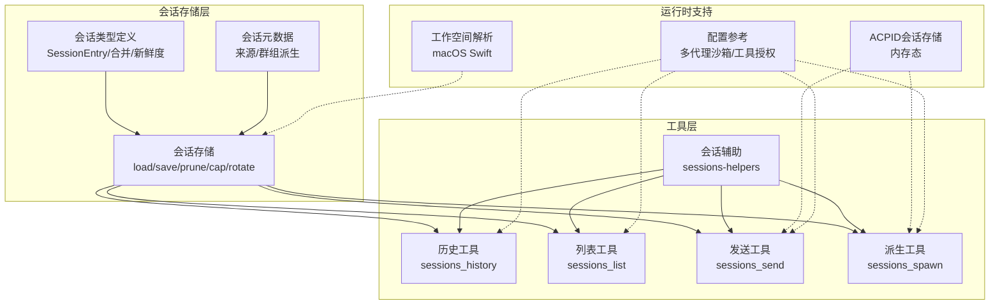
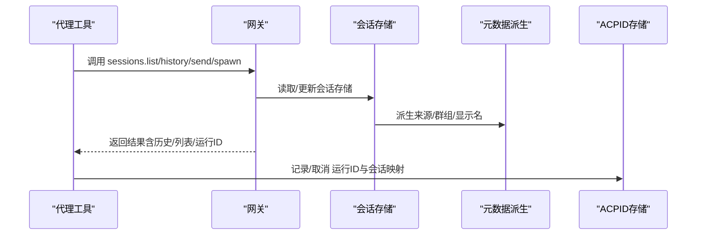
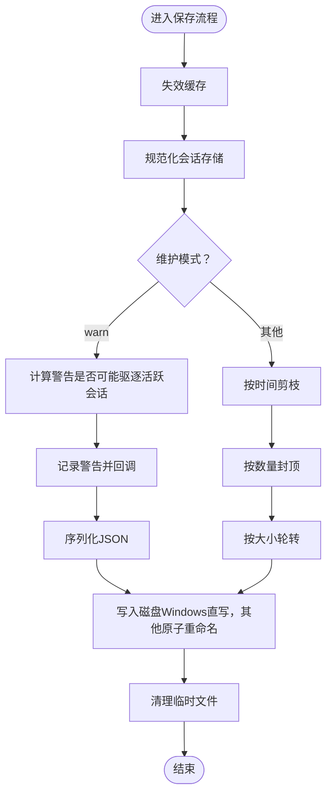
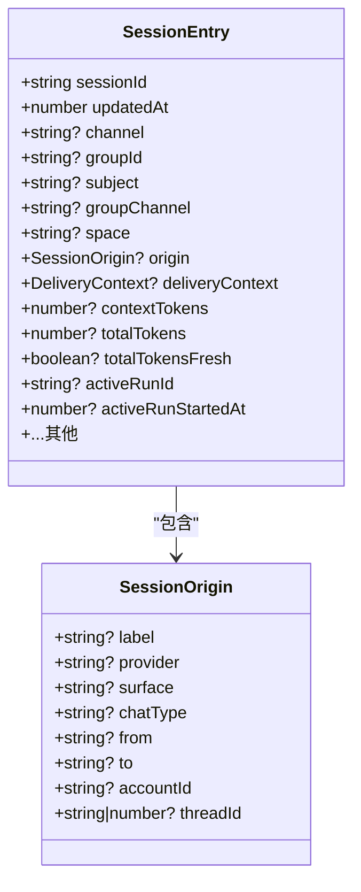
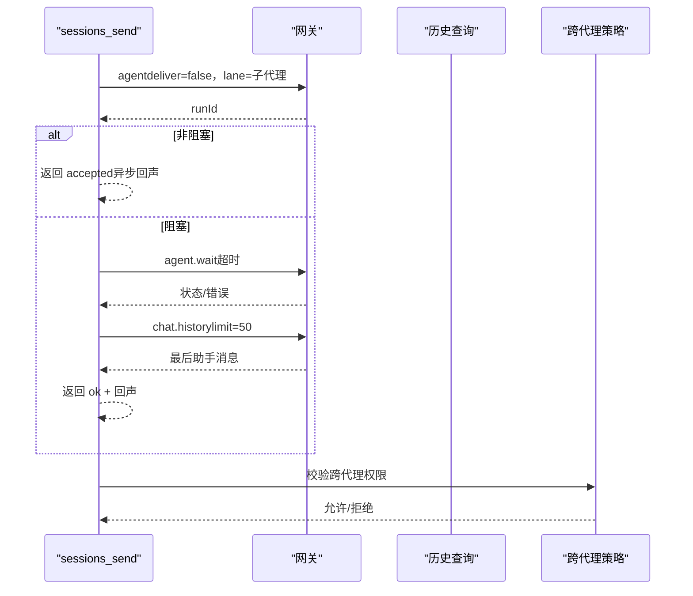
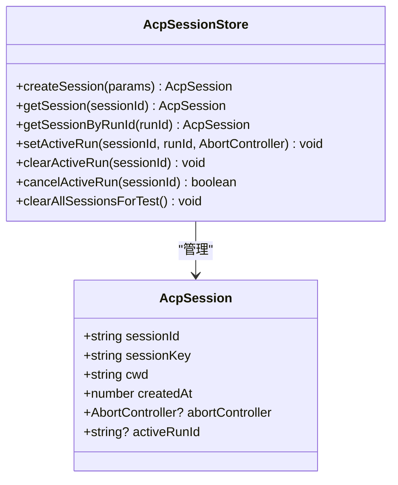
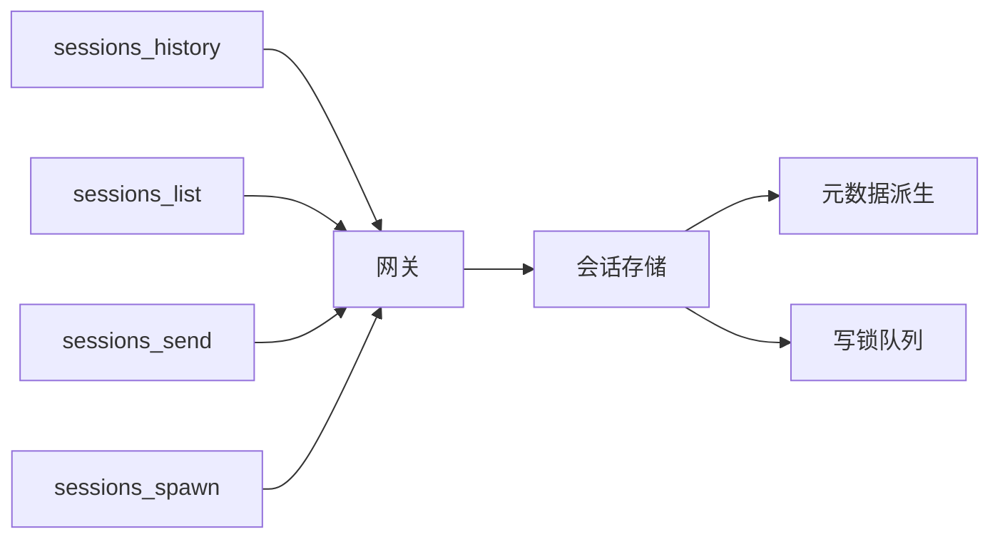

# 会话上下文

<cite>
**本文引用的文件**
- [src/config/sessions/store.ts](file://src/config/sessions/store.ts)
- [src/config/sessions/types.ts](file://src/config/sessions/types.ts)
- [src/config/sessions/metadata.ts](file://src/config/sessions/metadata.ts)
- [src/agents/tools/sessions-history-tool.ts](file://src/agents/tools/sessions-history-tool.ts)
- [src/agents/tools/sessions-list-tool.ts](file://src/agents/tools/sessions-list-tool.ts)
- [src/agents/tools/sessions-send-tool.ts](file://src/agents/tools/sessions-send-tool.ts)
- [src/agents/tools/sessions-spawn-tool.ts](file://src/agents/tools/sessions-spawn-tool.ts)
- [src/agents/tools/sessions-helpers.ts](file://src/agents/tools/sessions-helpers.ts)
- [src/acp/session.ts](file://src/acp/session.ts)
- [apps/macos/Sources/OpenClaw/AgentWorkspace.swift](file://apps/macos/Sources/OpenClaw/AgentWorkspace.swift)
- [docs/gateway/configuration-reference.md](file://docs/gateway/configuration-reference.md)
</cite>

## 目录

1. [简介](#简介)
2. [项目结构](#项目结构)
3. [核心组件](#核心组件)
4. [架构总览](#架构总览)
5. [组件详解](#组件详解)
6. [依赖关系分析](#依赖关系分析)
7. [性能考量](#性能考量)
8. [故障排查指南](#故障排查指南)
9. [结论](#结论)
10. [附录](#附录)

## 简介

本文件面向OpenClaw会话上下文管理系统，系统性阐述会话状态管理、转录策略、工作空间配置、上下文窗口限制、消息历史管理与工具结果保护机制，并覆盖会话生命周期、状态持久化与并发控制策略。同时提供最佳实践、性能优化建议与故障恢复方法，解释上下文系统与记忆、工具与渠道的集成关系，并给出会话监控、调试与诊断要点。

## 项目结构

围绕会话上下文的关键代码分布在以下模块：

- 会话存储与维护：会话文件缓存、维护（裁剪、清理、轮转）、并发写锁队列
- 会话类型与元数据：会话条目字段、合并策略、来源与群组派生
- 会话工具集：历史查询、列表、发送、派生子会话
- ACP会话存储：内存态ACPID与运行关联
- 工作空间与沙箱：工作区解析、空/模板检测
- 配置参考：多代理沙箱与工具授权

图表来源

- [src/config/sessions/store.ts](file://src/config/sessions/store.ts#L147-L213)
- [src/config/sessions/types.ts](file://src/config/sessions/types.ts#L25-L121)
- [src/config/sessions/metadata.ts](file://src/config/sessions/metadata.ts#L101-L172)
- [src/agents/tools/sessions-history-tool.ts](file://src/agents/tools/sessions-history-tool.ts#L174-L284)
- [src/agents/tools/sessions-list-tool.ts](file://src/agents/tools/sessions-list-tool.ts#L31-L226)
- [src/agents/tools/sessions-send-tool.ts](file://src/agents/tools/sessions-send-tool.ts#L37-L396)
- [src/agents/tools/sessions-spawn-tool.ts](file://src/agents/tools/sessions-spawn-tool.ts#L68-L307)
- [src/agents/tools/sessions-helpers.ts](file://src/agents/tools/sessions-helpers.ts#L48-L289)
- [src/acp/session.ts](file://src/acp/session.ts#L14-L94)
- [apps/macos/Sources/OpenClaw/AgentWorkspace.swift](file://apps/macos/Sources/OpenClaw/AgentWorkspace.swift#L35-L66)
- [docs/gateway/configuration-reference.md](file://docs/gateway/configuration-reference.md#L1048-L1124)

章节来源

- [src/config/sessions/store.ts](file://src/config/sessions/store.ts#L147-L213)
- [src/config/sessions/types.ts](file://src/config/sessions/types.ts#L25-L121)
- [src/config/sessions/metadata.ts](file://src/config/sessions/metadata.ts#L101-L172)
- [src/agents/tools/sessions-history-tool.ts](file://src/agents/tools/sessions-history-tool.ts#L174-L284)
- [src/agents/tools/sessions-list-tool.ts](file://src/agents/tools/sessions-list-tool.ts#L31-L226)
- [src/agents/tools/sessions-send-tool.ts](file://src/agents/tools/sessions-send-tool.ts#L37-L396)
- [src/agents/tools/sessions-spawn-tool.ts](file://src/agents/tools/sessions-spawn-tool.ts#L68-L307)
- [src/agents/tools/sessions-helpers.ts](file://src/agents/tools/sessions-helpers.ts#L48-L289)
- [src/acp/session.ts](file://src/acp/session.ts#L14-L94)
- [apps/macos/Sources/OpenClaw/AgentWorkspace.swift](file://apps/macos/Sources/OpenClaw/AgentWorkspace.swift#L35-L66)
- [docs/gateway/configuration-reference.md](file://docs/gateway/configuration-reference.md#L1048-L1124)

## 核心组件

- 会话存储与维护
  - 缓存与TTL：基于Map的会话存储缓存，支持TTL失效与mtime校验，避免重复读取
  - 维护策略：按时间阈值裁剪陈旧条目、按数量上限封顶、按大小轮转文件
  - 并发控制：基于会话文件路径的队列锁，串行化写入，避免竞态
- 会话类型与元数据
  - SessionEntry：统一承载会话关键字段（更新时间、通道、群组、来源、令牌用量等）
  - 合并策略：合并现有与补丁，确保sessionId与updatedAt一致性
  - 元数据派生：从消息上下文推导来源与群组信息，生成显示名
- 会话工具
  - 历史查询：安全裁剪、字节上限、内容截断、工具消息剥离
  - 列表查询：过滤种类、活跃分钟、消息预览、跨代理访问控制
  - 发送消息：跨代理路由、幂等键、超时等待、回声回复
  - 派生子会话：隔离运行、系统提示注入、超时与清理策略
- ACP会话存储
  - 内存态ACPID映射、运行ID绑定、中止控制器与取消
- 工作空间与沙箱
  - 工作区URL解析、空/模板检测、平台特定实现
- 配置参考
  - 多代理沙箱模式、工具授权白名单/黑名单、仅消息模式

章节来源

- [src/config/sessions/store.ts](file://src/config/sessions/store.ts#L28-L61)
- [src/config/sessions/store.ts](file://src/config/sessions/store.ts#L281-L294)
- [src/config/sessions/store.ts](file://src/config/sessions/store.ts#L301-L397)
- [src/config/sessions/store.ts](file://src/config/sessions/store.ts#L413-L465)
- [src/config/sessions/store.ts](file://src/config/sessions/store.ts#L626-L753)
- [src/config/sessions/types.ts](file://src/config/sessions/types.ts#L25-L121)
- [src/config/sessions/metadata.ts](file://src/config/sessions/metadata.ts#L153-L172)
- [src/agents/tools/sessions-history-tool.ts](file://src/agents/tools/sessions-history-tool.ts#L174-L284)
- [src/agents/tools/sessions-list-tool.ts](file://src/agents/tools/sessions-list-tool.ts#L31-L226)
- [src/agents/tools/sessions-send-tool.ts](file://src/agents/tools/sessions-send-tool.ts#L37-L396)
- [src/agents/tools/sessions-spawn-tool.ts](file://src/agents/tools/sessions-spawn-tool.ts#L68-L307)
- [src/acp/session.ts](file://src/acp/session.ts#L14-L94)
- [apps/macos/Sources/OpenClaw/AgentWorkspace.swift](file://apps/macos/Sources/OpenClaw/AgentWorkspace.swift#L35-L66)
- [docs/gateway/configuration-reference.md](file://docs/gateway/configuration-reference.md#L1048-L1124)

## 架构总览

下图展示会话上下文在系统中的交互关系：工具通过网关调用会话服务，会话存储负责持久化与维护；元数据从消息上下文派生；ACPID用于运行时跟踪；工作空间与沙箱策略影响可见性与能力。

图表来源

- [src/agents/tools/sessions-list-tool.ts](file://src/agents/tools/sessions-list-tool.ts#L81-L90)
- [src/agents/tools/sessions-history-tool.ts](file://src/agents/tools/sessions-history-tool.ts#L256-L259)
- [src/agents/tools/sessions-send-tool.ts](file://src/agents/tools/sessions-send-tool.ts#L290-L322)
- [src/agents/tools/sessions-spawn-tool.ts](file://src/agents/tools/sessions-spawn-tool.ts#L248-L274)
- [src/config/sessions/store.ts](file://src/config/sessions/store.ts#L147-L213)
- [src/config/sessions/metadata.ts](file://src/config/sessions/metadata.ts#L153-L172)
- [src/acp/session.ts](file://src/acp/session.ts#L39-L72)

## 组件详解

### 会话存储与维护

- 缓存与TTL
  - 使用Map缓存会话记录，带loadedAt与mtimeMs，支持TTL与文件变更校验
  - 支持禁用缓存或跳过缓存加载
- 维护策略
  - 剪枝：按updatedAt与阈值比较删除过期条目
  - 封顶：按最近更新时间排序，超过上限的最旧条目优先移除
  - 轮转：超过大小阈值时重命名当前文件为备份，并清理旧备份
- 并发控制
  - 基于会话文件路径的队列锁，串行执行写操作，避免竞态
  - 超时与过期检测，失败时清理定时器与任务

图表来源

- [src/config/sessions/store.ts](file://src/config/sessions/store.ts#L476-L578)
- [src/config/sessions/store.ts](file://src/config/sessions/store.ts#L580-L602)
- [src/config/sessions/store.ts](file://src/config/sessions/store.ts#L626-L753)

章节来源

- [src/config/sessions/store.ts](file://src/config/sessions/store.ts#L28-L61)
- [src/config/sessions/store.ts](file://src/config/sessions/store.ts#L281-L294)
- [src/config/sessions/store.ts](file://src/config/sessions/store.ts#L301-L397)
- [src/config/sessions/store.ts](file://src/config/sessions/store.ts#L413-L465)
- [src/config/sessions/store.ts](file://src/config/sessions/store.ts#L476-L578)
- [src/config/sessions/store.ts](file://src/config/sessions/store.ts#L580-L602)
- [src/config/sessions/store.ts](file://src/config/sessions/store.ts#L626-L753)

### 会话类型与元数据

- SessionEntry
  - 包含更新时间、通道、群组、来源、令牌用量、活跃运行ID等
  - 合并策略保证sessionId与updatedAt一致
- 元数据派生
  - 来源：从消息上下文提取标签、提供商、表面、聊天类型、账号、线程等
  - 群组：根据群组解析结果设置频道、主题、空间与显示名

图表来源

- [src/config/sessions/types.ts](file://src/config/sessions/types.ts#L25-L109)
- [src/config/sessions/types.ts](file://src/config/sessions/types.ts#L142-L147)
- [src/config/sessions/metadata.ts](file://src/config/sessions/metadata.ts#L45-L87)
- [src/config/sessions/metadata.ts](file://src/config/sessions/metadata.ts#L96-L151)

章节来源

- [src/config/sessions/types.ts](file://src/config/sessions/types.ts#L25-L121)
- [src/config/sessions/metadata.ts](file://src/config/sessions/metadata.ts#L45-L151)

### 会话工具：历史、列表、发送、派生

- sessions_history
  - 安全裁剪：剥离details/usage/cost，截断文本与数组块，移除大字段
  - 字节上限：按JSON字节上限封顶，必要时硬性截断为占位
  - 可见性：沙箱限制仅允许已派生会话；跨代理访问受策略控制
- sessions_list
  - 过滤：种类、活跃分钟、消息预览数量
  - 可见性：沙箱限制与跨代理访问控制
- sessions_send
  - 解析目标：支持sessionKey或label；跨代理需策略许可
  - 超时与回声：可选等待并返回最后一条助手消息
- sessions_spawn
  - 隔离运行：子代理会话、系统提示注入、超时与清理策略
  - 权限：仅主会话可派生，目标代理需在允许列表内

图表来源

- [src/agents/tools/sessions-send-tool.ts](file://src/agents/tools/sessions-send-tool.ts#L250-L393)
- [src/agents/tools/sessions-helpers.ts](file://src/agents/tools/sessions-helpers.ts#L78-L112)

章节来源

- [src/agents/tools/sessions-history-tool.ts](file://src/agents/tools/sessions-history-tool.ts#L174-L284)
- [src/agents/tools/sessions-list-tool.ts](file://src/agents/tools/sessions-list-tool.ts#L31-L226)
- [src/agents/tools/sessions-send-tool.ts](file://src/agents/tools/sessions-send-tool.ts#L37-L396)
- [src/agents/tools/sessions-spawn-tool.ts](file://src/agents/tools/sessions-spawn-tool.ts#L68-L307)
- [src/agents/tools/sessions-helpers.ts](file://src/agents/tools/sessions-helpers.ts#L48-L289)

### ACP会话存储

- 内存态Map存储会话，支持按sessionId与runId查找
- 绑定activeRunId与AbortController，支持取消与清理

图表来源

- [src/acp/session.ts](file://src/acp/session.ts#L4-L12)
- [src/acp/session.ts](file://src/acp/session.ts#L14-L94)

章节来源

- [src/acp/session.ts](file://src/acp/session.ts#L14-L94)

### 工作空间与沙箱

- macOS工作空间解析：路径展开、目录存在性检查、空/模板检测
- 配置参考：多代理沙箱模式与工具授权，支持“仅消息”场景

章节来源

- [apps/macos/Sources/OpenClaw/AgentWorkspace.swift](file://apps/macos/Sources/OpenClaw/AgentWorkspace.swift#L35-L66)
- [docs/gateway/configuration-reference.md](file://docs/gateway/configuration-reference.md#L1048-L1124)

## 依赖关系分析

- 工具到存储：历史/列表/发送/派生工具均通过网关调用会话服务，最终落地到会话存储
- 存储到元数据：会话存储在写入前进行元数据规范化（来源/群组），保证一致性
- 并发到锁：所有写操作经由会话存储锁队列串行化，避免竞态
- 可见性到策略：沙箱与跨代理策略贯穿工具解析与执行阶段

图表来源

- [src/agents/tools/sessions-history-tool.ts](file://src/agents/tools/sessions-history-tool.ts#L256-L259)
- [src/agents/tools/sessions-list-tool.ts](file://src/agents/tools/sessions-list-tool.ts#L81-L90)
- [src/agents/tools/sessions-send-tool.ts](file://src/agents/tools/sessions-send-tool.ts#L290-L322)
- [src/agents/tools/sessions-spawn-tool.ts](file://src/agents/tools/sessions-spawn-tool.ts#L248-L274)
- [src/config/sessions/store.ts](file://src/config/sessions/store.ts#L626-L753)
- [src/config/sessions/metadata.ts](file://src/config/sessions/metadata.ts#L153-L172)

章节来源

- [src/agents/tools/sessions-history-tool.ts](file://src/agents/tools/sessions-history-tool.ts#L256-L259)
- [src/agents/tools/sessions-list-tool.ts](file://src/agents/tools/sessions-list-tool.ts#L81-L90)
- [src/agents/tools/sessions-send-tool.ts](file://src/agents/tools/sessions-send-tool.ts#L290-L322)
- [src/agents/tools/sessions-spawn-tool.ts](file://src/agents/tools/sessions-spawn-tool.ts#L248-L274)
- [src/config/sessions/store.ts](file://src/config/sessions/store.ts#L626-L753)
- [src/config/sessions/metadata.ts](file://src/config/sessions/metadata.ts#L153-L172)

## 性能考量

- 缓存命中与TTL：合理设置OPENCLAW_SESSION_CACHE_TTL_MS，平衡读取延迟与一致性
- 写入批量化：批量更新时尽量复用同一锁内多次修改，减少落盘次数
- 历史裁剪：对工具结果与大字段进行裁剪，控制JSON体积，避免超限
- 文件轮转：定期轮转会话文件，避免单文件过大导致IO压力
- 并发排队：写锁队列避免高并发下的竞争，但应关注超时与堆积

## 故障排查指南

- 会话存储写入失败
  - 检查ENOENT场景（测试环境目录被删除）与回退直写逻辑
  - 关注权限设置与平台差异（Windows直写）
- 超时与堆积
  - 调整withSessionStoreLock超时参数，观察队列长度
  - 分析是否存在长时间持有锁的任务
- 历史截断与丢失
  - 检查SESSIONS_HISTORY_MAX_BYTES与内容截断策略
  - 确认工具消息剥离与硬性截断逻辑
- 跨代理不可见
  - 校验tools.agentToAgent.enabled与allow规则
  - 沙箱模式下restrictToSpawned导致的可见性限制

章节来源

- [src/config/sessions/store.ts](file://src/config/sessions/store.ts#L524-L577)
- [src/config/sessions/store.ts](file://src/config/sessions/store.ts#L712-L753)
- [src/agents/tools/sessions-history-tool.ts](file://src/agents/tools/sessions-history-tool.ts#L124-L147)
- [src/agents/tools/sessions-helpers.ts](file://src/agents/tools/sessions-helpers.ts#L78-L112)

## 结论

OpenClaw会话上下文系统以“安全、可控、可观测”为核心设计原则：通过会话存储的缓存/TTL/维护/并发锁保障稳定性；通过历史工具的安全裁剪与字节上限保护；通过沙箱与跨代理策略实现细粒度可见性控制；通过元数据派生与类型定义统一上下文模型。结合最佳实践与故障排查方法，可在复杂场景下保持会话系统的高性能与高可用。

## 附录

- 会话生命周期
  - 创建：派生子会话或从消息上下文派生
  - 更新：写入会话存储，触发元数据规范化与维护
  - 查询：历史/列表/发送/派生工具通过网关访问
  - 清理：维护策略自动剪枝、封顶与轮转
- 状态持久化
  - JSON文件存储，原子写入与权限控制
  - 缓存与mtime校验，避免重复读取
- 并发控制
  - 基于路径的队列锁，串行化写入
  - 超时与过期检测，失败清理
- 最佳实践
  - 合理设置维护阈值与TTL
  - 严格控制历史输出大小与敏感字段
  - 明确沙箱与跨代理策略，最小授权
- 监控与诊断
  - 观察维护日志（剪枝/封顶/轮转）
  - 监控写锁队列长度与超时
  - 使用sessions_list与sessions_history验证可见性与完整性
