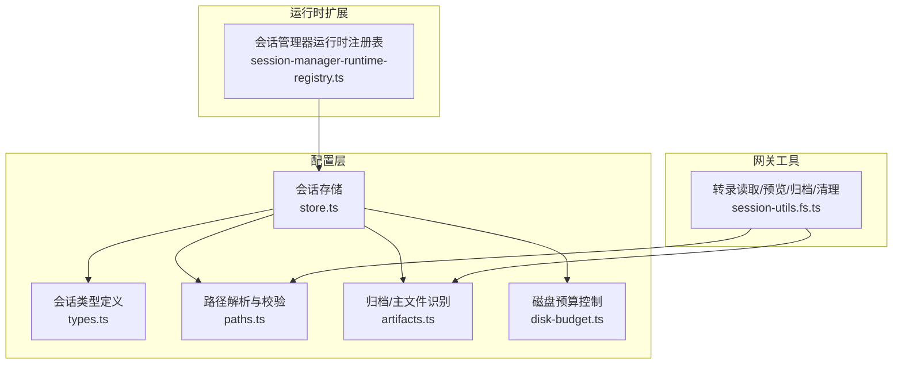
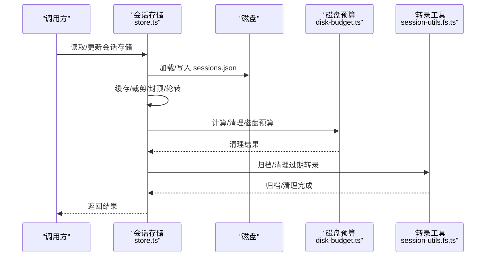
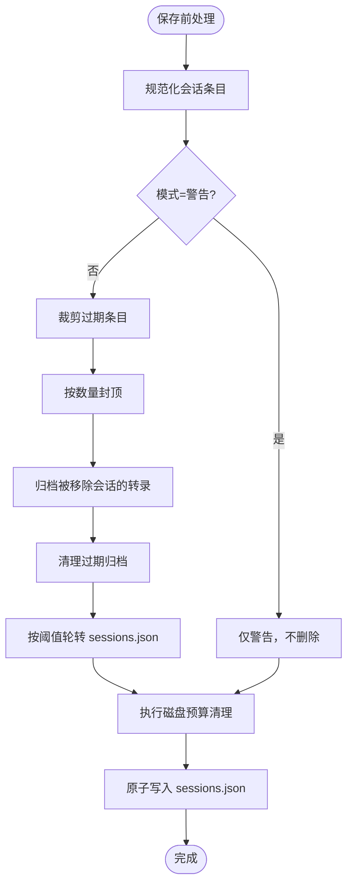
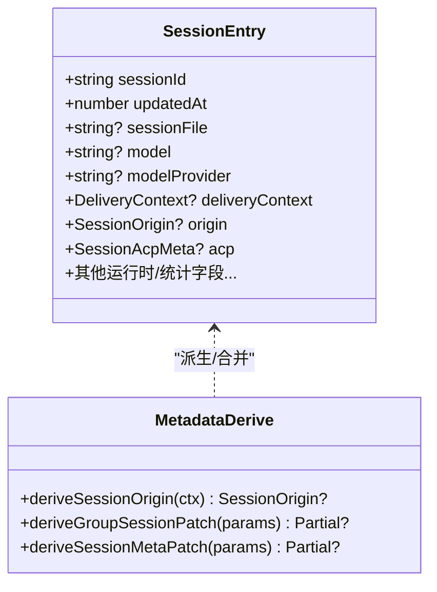
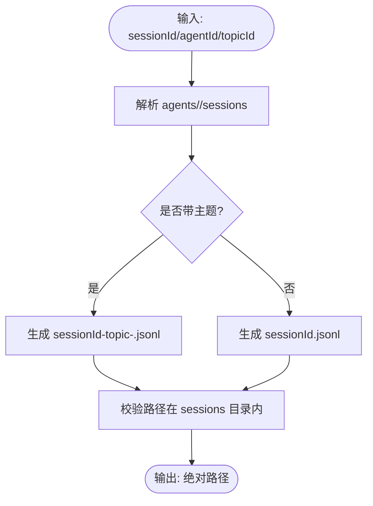
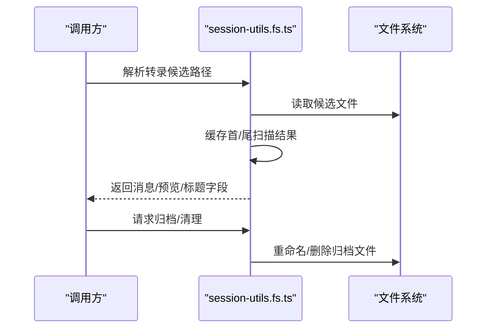
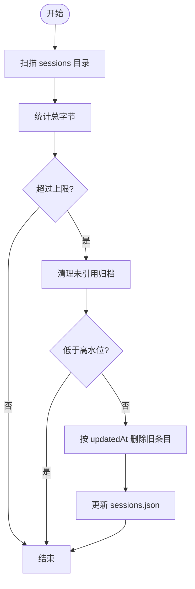
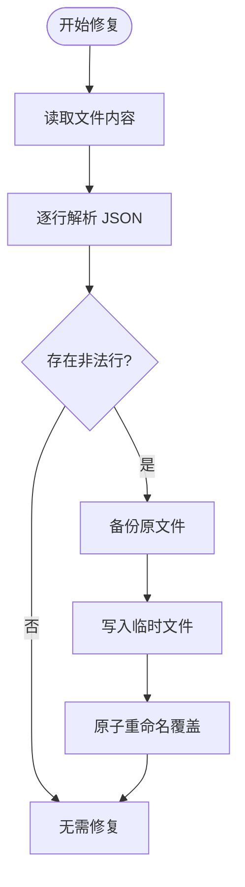
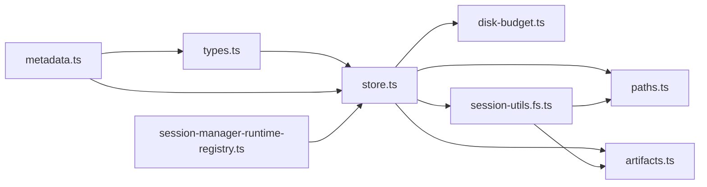

# 会话管理

<cite>
**本文引用的文件**
- [src/config/sessions/store.ts](file://src/config/sessions/store.ts)
- [src/config/sessions/types.ts](file://src/config/sessions/types.ts)
- [src/config/sessions/paths.ts](file://src/config/sessions/paths.ts)
- [src/config/sessions/artifacts.ts](file://src/config/sessions/artifacts.ts)
- [src/config/sessions/disk-budget.ts](file://src/config/sessions/disk-budget.ts)
- [src/gateway/session-utils.fs.ts](file://src/gateway/session-utils.fs.ts)
- [src/agents/pi-extensions/session-manager-runtime-registry.ts](file://src/agents/pi-extensions/session-manager-runtime-registry.ts)
- [src/agents/session-file-repair.ts](file://src/agents/session-file-repair.ts)
- [src/commands/doctor-state-integrity.ts](file://src/commands/doctor-state-integrity.ts)
- [src/config/sessions/reset.ts](file://src/config/sessions/reset.ts)
- [src/config/types.base.ts](file://src/config/types.base.ts)
</cite>

## 目录

1. [简介](#简介)
2. [项目结构](#项目结构)
3. [核心组件](#核心组件)
4. [架构总览](#架构总览)
5. [详细组件分析](#详细组件分析)
6. [依赖关系分析](#依赖关系分析)
7. [性能考量](#性能考量)
8. [故障排查指南](#故障排查指南)
9. [结论](#结论)
10. [附录](#附录)

## 简介

本技术文档面向 OpenClaw 会话管理系统，系统性阐述会话生命周期管理、状态持久化与数据组织机制，覆盖会话目录结构、文件命名规范、数据修复策略、工作空间管理、转录文件维护与会话清理流程，并提供性能优化、并发控制与错误恢复方法，以及配置定制与数据迁移指南，帮助开发者构建稳定可靠的会话管理能力。

## 项目结构

OpenClaw 的会话管理由“配置层（sessions）+ 网关工具（gateway）+ 运行时扩展（agents/pi-extensions）”协同实现：

- 配置层：负责会话存储的读写、缓存、维护（裁剪、封顶、轮转）、磁盘预算控制、路径解析与归档/清理等。
- 网关工具：负责转录文件读取、标题字段缓存、预览生成、归档与清理等文件级操作。
- 运行时扩展：提供会话级运行时注册表，确保会话作用域内对象稳定持有。

**图表来源**

- [src/config/sessions/store.ts](file://src/config/sessions/store.ts#L1-L120)
- [src/config/sessions/types.ts](file://src/config/sessions/types.ts#L68-L174)
- [src/config/sessions/paths.ts](file://src/config/sessions/paths.ts#L33-L74)
- [src/config/sessions/artifacts.ts](file://src/config/sessions/artifacts.ts#L1-L35)
- [src/config/sessions/disk-budget.ts](file://src/config/sessions/disk-budget.ts#L188-L375)
- [src/gateway/session-utils.fs.ts](file://src/gateway/session-utils.fs.ts#L73-L163)
- [src/agents/pi-extensions/session-manager-runtime-registry.ts](file://src/agents/pi-extensions/session-manager-runtime-registry.ts#L1-L29)

**章节来源**

- [src/config/sessions/store.ts](file://src/config/sessions/store.ts#L1-L120)
- [src/gateway/session-utils.fs.ts](file://src/gateway/session-utils.fs.ts#L1-L74)

## 核心组件

- 会话存储与维护：提供加载、缓存、裁剪、封顶、轮转、磁盘预算清理、警告模式等能力；支持 Windows 原子写入与锁队列保证一致性。
- 会话类型与元数据：定义 SessionEntry 结构、运行时模型字段规范化、合并策略、分组键解析、来源派生与显示名构建。
- 路径解析与安全：统一解析会话目录、校验相对路径、兼容旧版绝对路径、生成安全的会话文件名。
- 归档与清理：识别主转录与归档文件，按原因与时间戳归档，按保留期清理过期归档。
- 磁盘预算控制：统计目录大小，优先清理未被引用的归档与主转录，必要时删除最旧条目并更新 sessions.json。
- 文件修复：对损坏的会话文件进行修复（丢弃非法行、备份、重写），避免数据丢失。
- 运行时注册表：以 WeakMap 为会话管理器实例建立会话作用域的运行时值存储。

**章节来源**

- [src/config/sessions/store.ts](file://src/config/sessions/store.ts#L198-L284)
- [src/config/sessions/types.ts](file://src/config/sessions/types.ts#L68-L174)
- [src/config/sessions/paths.ts](file://src/config/sessions/paths.ts#L223-L265)
- [src/config/sessions/artifacts.ts](file://src/config/sessions/artifacts.ts#L16-L35)
- [src/config/sessions/disk-budget.ts](file://src/config/sessions/disk-budget.ts#L188-L375)
- [src/gateway/session-utils.fs.ts](file://src/gateway/session-utils.fs.ts#L187-L227)
- [src/agents/session-file-repair.ts](file://src/agents/session-file-repair.ts#L19-L109)
- [src/agents/pi-extensions/session-manager-runtime-registry.ts](file://src/agents/pi-extensions/session-manager-runtime-registry.ts#L1-L29)

## 架构总览

会话管理采用“配置层存储 + 网关工具文件操作 + 运行时注册表”的分层设计，围绕 sessions.json 与 .jsonl 转录文件展开，通过维护策略与磁盘预算控制保障长期稳定性。

**图表来源**

- [src/config/sessions/store.ts](file://src/config/sessions/store.ts#L642-L769)
- [src/config/sessions/disk-budget.ts](file://src/config/sessions/disk-budget.ts#L188-L375)
- [src/gateway/session-utils.fs.ts](file://src/gateway/session-utils.fs.ts#L187-L227)

## 详细组件分析

### 组件A：会话存储与维护（store.ts）

- 加载与缓存：支持 TTL 缓存、mtime 校验、Windows 空文件重试、深拷贝返回，避免外部修改污染缓存。
- 维护策略：裁剪过期条目、按最近更新封顶、轮转大文件、清理过期归档、可选警告模式不强制执行。
- 并发控制：基于锁队列串行化写入，超时保护，失败自动出队，避免死锁。
- Windows 原子写：临时文件 + 重命名，避免并发读到空文件。
- 磁盘预算联动：在维护阶段触发磁盘预算清理，优先移除未引用归档与主转录。

**图表来源**

- [src/config/sessions/store.ts](file://src/config/sessions/store.ts#L642-L800)

**章节来源**

- [src/config/sessions/store.ts](file://src/config/sessions/store.ts#L198-L284)
- [src/config/sessions/store.ts](file://src/config/sessions/store.ts#L455-L559)
- [src/config/sessions/store.ts](file://src/config/sessions/store.ts#L575-L627)
- [src/config/sessions/store.ts](file://src/config/sessions/store.ts#L642-L800)

### 组件B：会话类型与元数据（types.ts、metadata.ts）

- SessionEntry：集中定义会话状态字段（如运行时模型、队列策略、令牌用量、ACP 元信息、来源与投递上下文等），并提供规范化与合并逻辑。
- 元数据派生：从消息上下文推导来源、群组会话补丁、显示名等，确保跨渠道一致性。
- 运行时模型字段：提供标准化与设置接口，避免提供者与模型不一致导致的回退问题。

**图表来源**

- [src/config/sessions/types.ts](file://src/config/sessions/types.ts#L68-L174)
- [src/config/sessions/metadata.ts](file://src/config/sessions/metadata.ts#L45-L172)

**章节来源**

- [src/config/sessions/types.ts](file://src/config/sessions/types.ts#L68-L174)
- [src/config/sessions/metadata.ts](file://src/config/sessions/metadata.ts#L45-L172)

### 组件C：路径解析与文件命名（paths.ts、artifacts.ts）

- 目录与路径：统一解析 agents/<agentId>/sessions，支持相对/绝对路径、跨根兼容与同根兄弟代理目录映射。
- 安全校验：严格限制文件必须位于 sessions 目录内，防止越权访问。
- 文件命名：主转录为 sessionId.jsonl；带主题为 sessionId-topic-<id>.jsonl；归档按原因与时间戳后缀。
- 主/归档识别：通过正则识别 .deleted/.reset/.bak.<iso-timestamp> 形态，排除归档识别主文件。

**图表来源**

- [src/config/sessions/paths.ts](file://src/config/sessions/paths.ts#L223-L265)
- [src/config/sessions/artifacts.ts](file://src/config/sessions/artifacts.ts#L27-L35)

**章节来源**

- [src/config/sessions/paths.ts](file://src/config/sessions/paths.ts#L223-L265)
- [src/config/sessions/artifacts.ts](file://src/config/sessions/artifacts.ts#L1-L35)

### 组件D：转录读取与预览（session-utils.fs.ts）

- 多候选路径解析：优先 sessions.json 中记录的 sessionFile，其次按目录扫描，再回退到历史目录。
- 标题字段缓存：对首用户消息与末尾消息预览进行缓存，避免重复扫描。
- 预览生成：从尾部读取若干字节，提取最近消息，构建 UI 可渲染的预览项。
- 归档与清理：按原因与时间戳归档，按保留期清理过期归档文件。

**图表来源**

- [src/gateway/session-utils.fs.ts](file://src/gateway/session-utils.fs.ts#L120-L163)
- [src/gateway/session-utils.fs.ts](file://src/gateway/session-utils.fs.ts#L302-L372)
- [src/gateway/session-utils.fs.ts](file://src/gateway/session-utils.fs.ts#L718-L743)

**章节来源**

- [src/gateway/session-utils.fs.ts](file://src/gateway/session-utils.fs.ts#L73-L163)
- [src/gateway/session-utils.fs.ts](file://src/gateway/session-utils.fs.ts#L229-L266)

### 组件E：磁盘预算控制（disk-budget.ts）

- 统计与评估：计算 sessions.json 与目录文件总大小，判断是否超过上限。
- 清理策略：优先删除未被引用的归档与主转录；若仍超限，按 updatedAt 升序删除最旧条目并同步更新 sessions.json。
- 干运行与日志：支持 dry-run 与日志输出，便于审计与调试。

**图表来源**

- [src/config/sessions/disk-budget.ts](file://src/config/sessions/disk-budget.ts#L188-L375)

**章节来源**

- [src/config/sessions/disk-budget.ts](file://src/config/sessions/disk-budget.ts#L188-L375)

### 组件F：文件修复（session-file-repair.ts）

- 修复流程：读取文件，逐行解析 JSON，丢弃非法行，保留有效行，备份原文件，写入临时文件并原子重命名。
- 安全措施：异常时清理临时文件，保留原文件权限，记录原因与备份路径。

**图表来源**

- [src/agents/session-file-repair.ts](file://src/agents/session-file-repair.ts#L19-L109)

**章节来源**

- [src/agents/session-file-repair.ts](file://src/agents/session-file-repair.ts#L19-L109)

### 组件G：会话重置策略（reset.ts、types.base.ts）

- 重置模式：支持按空闲时长或每日边界重置，支持按直接/群组/主题类型分别配置。
- 默认行为：若未显式配置且存在旧版 idleMinutes，则默认空闲模式。

**章节来源**

- [src/config/sessions/reset.ts](file://src/config/sessions/reset.ts#L84-L120)
- [src/config/types.base.ts](file://src/config/types.base.ts#L71-L103)

## 依赖关系分析

- store.ts 依赖 paths.ts（路径解析）、artifacts.ts（归档识别）、disk-budget.ts（预算清理）、gateway 的归档/清理函数。
- session-utils.fs.ts 依赖 artifacts.ts 与 paths.ts，用于转录读取与归档/清理。
- types.ts 提供类型契约，被 store.ts 与 metadata.ts 使用。
- 运行时注册表弱引用会话管理器实例，避免强引用导致内存泄漏。

**图表来源**

- [src/config/sessions/store.ts](file://src/config/sessions/store.ts#L1-L30)
- [src/config/sessions/paths.ts](file://src/config/sessions/paths.ts#L1-L20)
- [src/config/sessions/artifacts.ts](file://src/config/sessions/artifacts.ts#L1-L10)
- [src/config/sessions/disk-budget.ts](file://src/config/sessions/disk-budget.ts#L1-L10)
- [src/gateway/session-utils.fs.ts](file://src/gateway/session-utils.fs.ts#L1-L17)
- [src/config/sessions/types.ts](file://src/config/sessions/types.ts#L1-L10)
- [src/config/sessions/metadata.ts](file://src/config/sessions/metadata.ts#L1-L10)
- [src/agents/pi-extensions/session-manager-runtime-registry.ts](file://src/agents/pi-extensions/session-manager-runtime-registry.ts#L1-L10)

**章节来源**

- [src/config/sessions/store.ts](file://src/config/sessions/store.ts#L1-L30)
- [src/gateway/session-utils.fs.ts](file://src/gateway/session-utils.fs.ts#L1-L17)

## 性能考量

- 缓存与读取：启用 TTL 缓存减少磁盘 IO；Windows 下对空文件进行短暂停顿重试，避免并发读到截断文件。
- 写入与锁：使用锁队列串行化写入，避免竞争；Windows 原子写通过临时文件 + 重命名，降低锁持有时间。
- 预览与扫描：转录预览采用尾部扫描与多尺寸试探，减少全量读取；标题字段缓存限制最大条目数，避免内存膨胀。
- 磁盘预算：先清理未引用归档与主转录，再按 updatedAt 删除条目，尽量保持活跃会话数据完整。

[本节为通用指导，无需特定文件分析]

## 故障排查指南

- 存储损坏或空文件：检查 sessions.json 是否为空或被截断，确认写入是否成功；必要时使用磁盘预算清理或手动轮转。
- 会话文件损坏：使用文件修复工具丢弃非法行并备份原文件，核对备份路径与修复报告。
- 缺失转录文件：通过诊断命令检查 sessions.json 中条目与实际文件匹配情况，按提示执行清理或修复。
- 归档过多或占用空间：调整维护配置（裁剪窗口、封顶数量、轮转阈值、磁盘预算），或手动清理过期归档。

**章节来源**

- [src/agents/session-file-repair.ts](file://src/agents/session-file-repair.ts#L19-L109)
- [src/commands/doctor-state-integrity.ts](file://src/commands/doctor-state-integrity.ts#L414-L499)
- [src/gateway/session-utils.fs.ts](file://src/gateway/session-utils.fs.ts#L229-L266)

## 结论

OpenClaw 的会话管理以“配置层存储 + 网关工具 + 运行时注册表”为核心，结合严格的路径校验、归档/清理策略与磁盘预算控制，实现了高可用、可维护、可扩展的会话生命周期管理。通过缓存、锁队列与原子写入等机制，兼顾性能与一致性；通过修复、诊断与清理工具，保障长期运行的稳定性。

[本节为总结，无需特定文件分析]

## 附录

### 会话目录结构与文件命名规范

- 目录：agents/<agentId>/sessions
- 主转录：sessionId.jsonl；带主题：sessionId-topic-<id>.jsonl
- 归档：按原因与 ISO 时间戳后缀，如 .deleted.<timestamp>、.reset.<timestamp>、.bak.<timestamp>
- 会话存储：sessions.json（位于 agents/<agentId>/sessions）

**章节来源**

- [src/config/sessions/paths.ts](file://src/config/sessions/paths.ts#L223-L265)
- [src/config/sessions/artifacts.ts](file://src/config/sessions/artifacts.ts#L27-L35)

### 数据修复策略

- 修复流程：读取、解析、丢弃非法行、备份、写入临时文件、原子重命名。
- 异常处理：清理临时文件、保留权限、记录原因与备份路径。

**章节来源**

- [src/agents/session-file-repair.ts](file://src/agents/session-file-repair.ts#L19-L109)

### 工作空间管理与转录维护

- 转录读取：多候选路径解析、首尾扫描、缓存与预览生成。
- 归档与清理：按原因与时间戳归档，按保留期清理过期归档。

**章节来源**

- [src/gateway/session-utils.fs.ts](file://src/gateway/session-utils.fs.ts#L120-L163)
- [src/gateway/session-utils.fs.ts](file://src/gateway/session-utils.fs.ts#L187-L227)
- [src/gateway/session-utils.fs.ts](file://src/gateway/session-utils.fs.ts#L229-L266)

### 会话清理流程

- 维护阶段：裁剪过期条目、封顶、轮转、清理过期归档。
- 磁盘预算：清理未引用归档与主转录，必要时删除旧条目并更新 sessions.json。

**章节来源**

- [src/config/sessions/store.ts](file://src/config/sessions/store.ts#L694-L769)
- [src/config/sessions/disk-budget.ts](file://src/config/sessions/disk-budget.ts#L254-L340)

### 并发控制与错误恢复

- 锁队列：串行化写入，超时保护，失败自动出队。
- Windows 原子写：临时文件 + 重命名，避免并发读到空文件。
- 诊断与修复：提供诊断命令与文件修复工具，辅助恢复。

**章节来源**

- [src/config/sessions/store.ts](file://src/config/sessions/store.ts#L906-L933)
- [src/commands/doctor-state-integrity.ts](file://src/commands/doctor-state-integrity.ts#L414-L499)

### 会话配置定制与数据迁移

- 维护配置：裁剪窗口、封顶数量、轮转阈值、磁盘预算上限与高水位、重置策略（空闲/每日）。
- 数据迁移：路径兼容旧版绝对路径与历史目录，自动归一化为相对路径。

**章节来源**

- [src/config/sessions/store.ts](file://src/config/sessions/store.ts#L430-L448)
- [src/config/sessions/paths.ts](file://src/config/sessions/paths.ts#L159-L221)
- [src/config/sessions/reset.ts](file://src/config/sessions/reset.ts#L84-L120)
