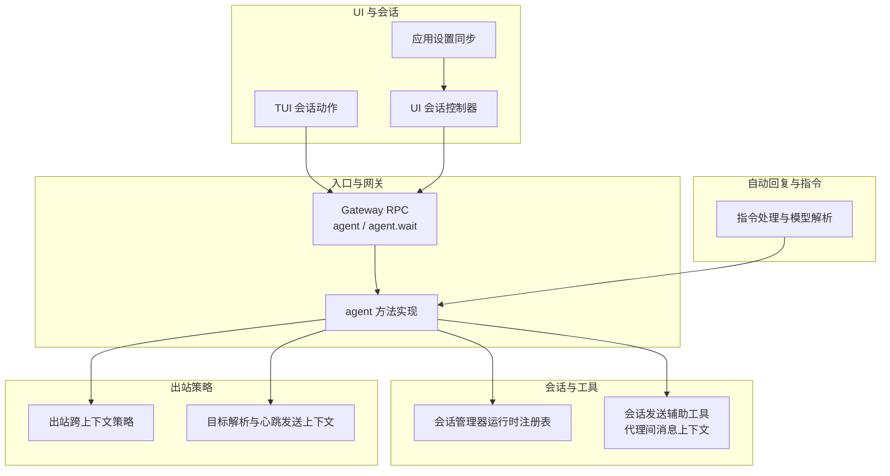
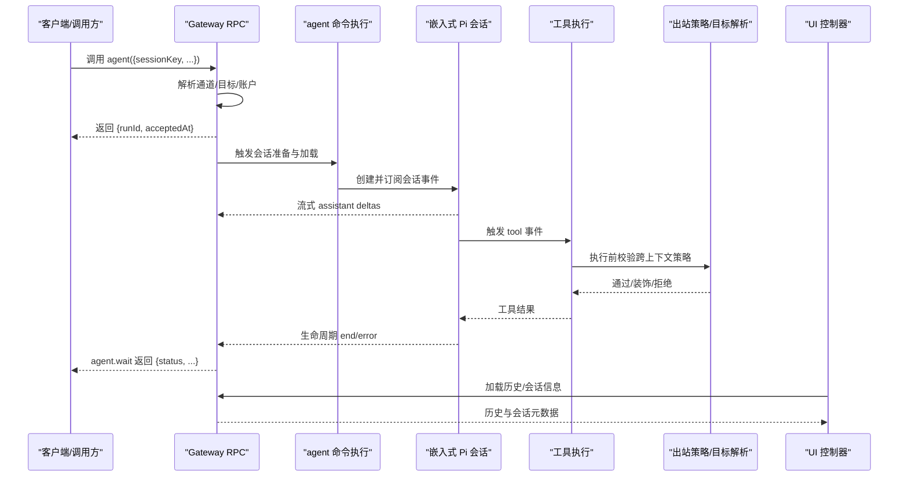
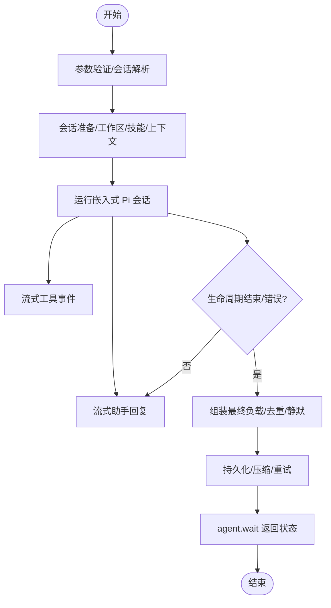
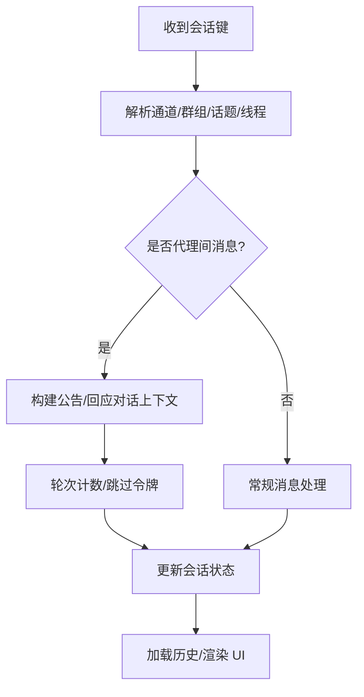
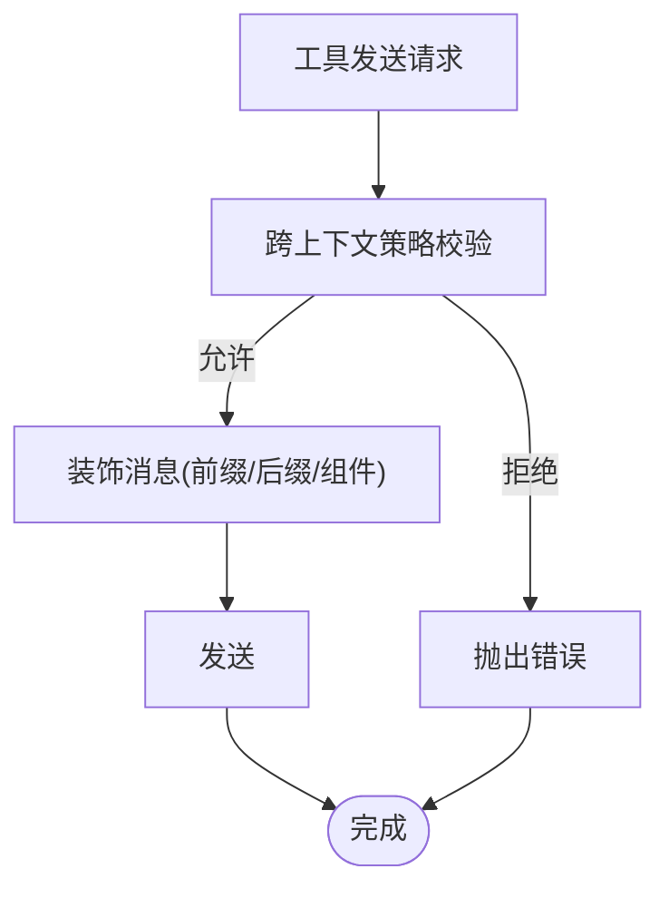
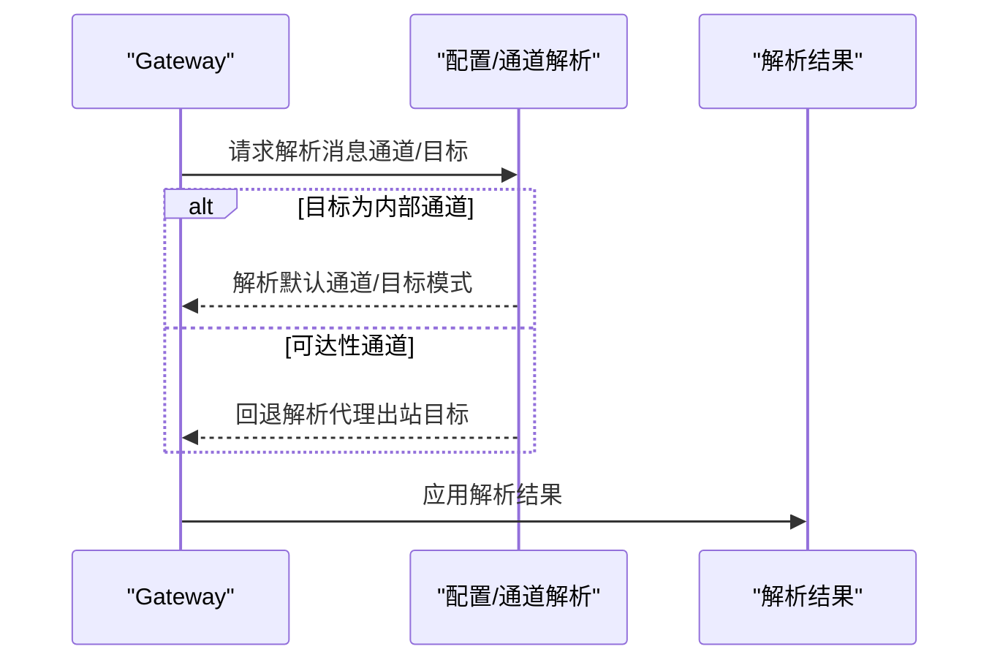
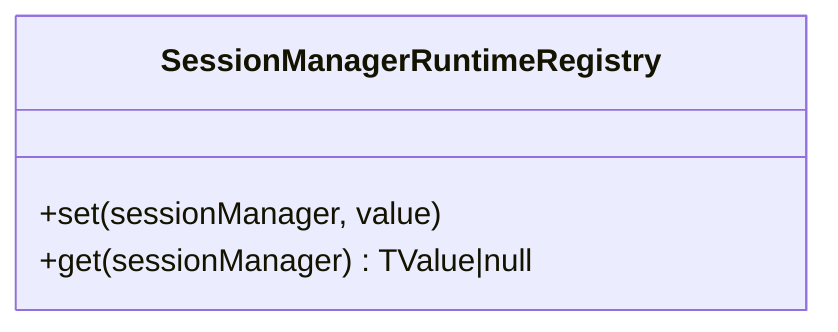
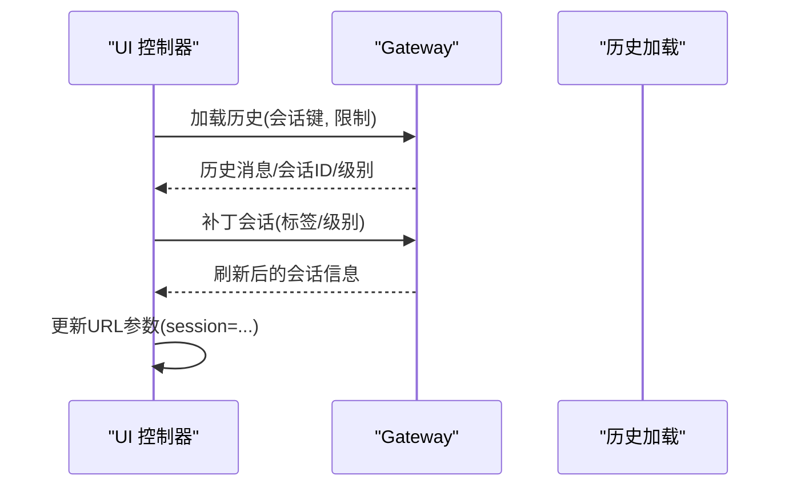
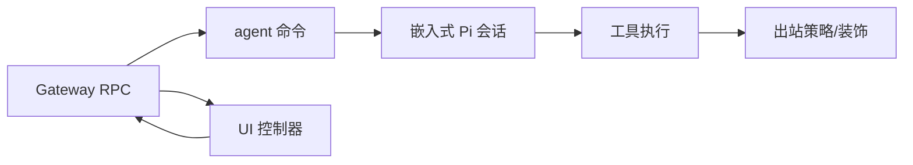

# 对话循环机制

<cite>
**本文引用的文件**   
- [docs/concepts/agent-loop.md](file://docs/concepts/agent-loop.md)
- [src/agents/tools/sessions-send-helpers.ts](file://src/agents/tools/sessions-send-helpers.ts)
- [src/agents/pi-extensions/session-manager-runtime-registry.ts](file://src/agents/pi-extensions/session-manager-runtime-registry.ts)
- [src/infra/outbound/outbound-policy.ts](file://src/infra/outbound/outbound-policy.ts)
- [src/gateway/server-methods/agent.ts](file://src/gateway/server-methods/agent.ts)
- [src/infra/outbound/targets.ts](file://src/infra/outbound/targets.ts)
- [src/gateway/server.sessions-send.test.ts](file://src/gateway/server.sessions-send.test.ts)
- [src/agents/openclaw-tools.sessions.test.ts](file://src/agents/openclaw-tools.sessions.test.ts)
- [src/auto-reply/reply/directive-handling.impl.ts](file://src/auto-reply/reply/directive-handling.impl.ts)
- [src/tui/tui-session-actions.ts](file://src/tui/tui-session-actions.ts)
- [ui/src/ui/controllers/sessions.ts](file://ui/src/ui/controllers/sessions.ts)
- [ui/src/ui/app-settings.ts](file://ui/src/ui/app-settings.ts)
</cite>

## 目录

1. [引言](#引言)
2. [项目结构](#项目结构)
3. [核心组件](#核心组件)
4. [架构总览](#架构总览)
5. [详细组件分析](#详细组件分析)
6. [依赖关系分析](#依赖关系分析)
7. [性能考量](#性能考量)
8. [故障排查指南](#故障排查指南)
9. [结论](#结论)
10. [附录](#附录)

## 引言

本文件系统性阐述 OpenClaw 的“代理对话循环”机制：从消息入口到上下文组装、模型推理、工具执行、流式回复、持久化，再到会话状态维护与跨上下文策略控制。文档聚焦以下主题：

- 循环工作原理与生命周期事件
- 消息处理流程与状态转换
- 上下文管理、工具调用序列与结果处理
- 消息路由、会话状态维护与工具执行生命周期
- 循环优化策略、错误恢复与性能监控
- 定制指南与调试技巧

## 项目结构

围绕对话循环的关键代码分布在以下模块：

- 文档与概念：agent-loop 概念文档
- 网关与 RPC：agent/agent.wait 入口与消息投递解析
- 会话与工具：会话键解析、代理间消息上下文构建、工具执行策略
- 出站策略：跨上下文发送限制与装饰
- UI 与会话：会话列表、历史加载、运行中状态管理
- 自动回复与指令：模型选择与指令解析

**图表来源**

- [docs/concepts/agent-loop.md](file://docs/concepts/agent-loop.md#L1-L149)
- [src/gateway/server-methods/agent.ts](file://src/gateway/server-methods/agent.ts#L517-L552)
- [src/agents/tools/sessions-send-helpers.ts](file://src/agents/tools/sessions-send-helpers.ts#L1-L167)
- [src/agents/pi-extensions/session-manager-runtime-registry.ts](file://src/agents/pi-extensions/session-manager-runtime-registry.ts#L1-L30)
- [src/infra/outbound/outbound-policy.ts](file://src/infra/outbound/outbound-policy.ts#L1-L222)
- [src/infra/outbound/targets.ts](file://src/infra/outbound/targets.ts#L520-L549)
- [src/tui/tui-session-actions.ts](file://src/tui/tui-session-actions.ts#L284-L400)
- [ui/src/ui/controllers/sessions.ts](file://ui/src/ui/controllers/sessions.ts#L130-L165)
- [ui/src/ui/app-settings.ts](file://ui/src/ui/app-settings.ts#L409-L459)
- [src/auto-reply/reply/directive-handling.impl.ts](file://src/auto-reply/reply/directive-handling.impl.ts#L115-L133)

**章节来源**

- [docs/concepts/agent-loop.md](file://docs/concepts/agent-loop.md#L1-L149)

## 核心组件

- 代理循环（Agent Loop）：一次完整的“摄入→上下文组装→模型推理→工具执行→流式回复→持久化”的真实运行路径，保证会话状态一致性。
- 网关 RPC：通过 agent/agent.wait 提供入口；agent 返回 runId，agent.wait 阻塞等待生命周期结束或错误。
- 会话管理与运行时注册表：以对象身份为键的会话级运行时注册表，确保同一 SessionManager 实例在 set/get 期间稳定。
- 会话发送辅助：构建代理间“公告/回应对话”的上下文提示，支持轮次上限与跳过令牌。
- 出站跨上下文策略：在跨通道/同通道发送时进行策略校验与消息装饰，防止越权或混淆。
- 目标解析与心跳上下文：根据上次发送与当前通道解析允许的发送者与目标。
- UI 与会话：会话列表、历史加载、活动运行 ID 维护、URL 同步。

**章节来源**

- [docs/concepts/agent-loop.md](file://docs/concepts/agent-loop.md#L10-L16)
- [src/agents/pi-extensions/session-manager-runtime-registry.ts](file://src/agents/pi-extensions/session-manager-runtime-registry.ts#L1-L30)
- [src/agents/tools/sessions-send-helpers.ts](file://src/agents/tools/sessions-send-helpers.ts#L1-L167)
- [src/infra/outbound/outbound-policy.ts](file://src/infra/outbound/outbound-policy.ts#L89-L139)
- [src/infra/outbound/targets.ts](file://src/infra/outbound/targets.ts#L520-L549)
- [src/tui/tui-session-actions.ts](file://src/tui/tui-session-actions.ts#L284-L400)
- [ui/src/ui/controllers/sessions.ts](file://ui/src/ui/controllers/sessions.ts#L130-L165)
- [ui/src/ui/app-settings.ts](file://ui/src/ui/app-settings.ts#L409-L459)

## 架构总览

下图展示从网关入口到会话执行、工具调用与回复输出的端到端流程，以及跨上下文策略与 UI 协同。

**图表来源**

- [docs/concepts/agent-loop.md](file://docs/concepts/agent-loop.md#L23-L44)
- [src/gateway/server-methods/agent.ts](file://src/gateway/server-methods/agent.ts#L517-L552)
- [src/infra/outbound/outbound-policy.ts](file://src/infra/outbound/outbound-policy.ts#L89-L139)
- [src/tui/tui-session-actions.ts](file://src/tui/tui-session-actions.ts#L284-L400)

## 详细组件分析

### 组件A：代理循环生命周期与流式事件

- 入口：Gateway RPC 的 agent/agent.wait；agent 立即返回 runId，agent.wait 阻塞等待生命周期结束或错误。
- 会话准备：工作区解析与创建、技能快照加载、引导/上下文注入、会话写锁与 SessionManager 打开。
- 推理与流式：系统提示构建、模型选择与指令解析、推理流式输出、工具事件流式。
- 结束与收尾：生命周期 end/error、最终负载组装、去重与静默策略、可选重试与压缩。

**图表来源**

- [docs/concepts/agent-loop.md](file://docs/concepts/agent-loop.md#L23-L44)
- [src/auto-reply/reply/directive-handling.impl.ts](file://src/auto-reply/reply/directive-handling.impl.ts#L115-L133)

**章节来源**

- [docs/concepts/agent-loop.md](file://docs/concepts/agent-loop.md#L10-L16)
- [src/auto-reply/reply/directive-handling.impl.ts](file://src/auto-reply/reply/directive-handling.impl.ts#L115-L133)

### 组件B：消息处理与状态转换

- 会话键解析与代理间消息上下文：支持从 sessionKey 推导通道/群组/话题/线程等目标，并生成“公告/回应对话”的上下文提示。
- 代理间 ping-pong 轮次控制：最大轮次限制、跳过令牌、角色切换与回合计数。
- 会话状态维护：TUI/UI 层维护 currentSessionKey/currentSessionId/activeChatRunId，加载历史、中止运行、URL 同步。

**图表来源**

- [src/agents/tools/sessions-send-helpers.ts](file://src/agents/tools/sessions-send-helpers.ts#L20-L89)
- [src/agents/tools/sessions-send-helpers.ts](file://src/agents/tools/sessions-send-helpers.ts#L91-L148)
- [src/tui/tui-session-actions.ts](file://src/tui/tui-session-actions.ts#L284-L400)
- [ui/src/ui/controllers/sessions.ts](file://ui/src/ui/controllers/sessions.ts#L130-L165)
- [ui/src/ui/app-settings.ts](file://ui/src/ui/app-settings.ts#L409-L459)

**章节来源**

- [src/agents/tools/sessions-send-helpers.ts](file://src/agents/tools/sessions-send-helpers.ts#L1-L167)
- [src/tui/tui-session-actions.ts](file://src/tui/tui-session-actions.ts#L284-L400)
- [ui/src/ui/controllers/sessions.ts](file://ui/src/ui/controllers/sessions.ts#L130-L165)
- [ui/src/ui/app-settings.ts](file://ui/src/ui/app-settings.ts#L409-L459)

### 组件C：出站跨上下文策略与装饰

- 策略校验：在跨通道/同通道发送时，依据配置决定是否允许 withinProvider/acrossProviders，并对目标进行归一化比较。
- 装饰与标记：为跨上下文消息添加前缀/后缀或组件形式的来源标记，便于用户识别消息来源。
- 心跳与发送者解析：结合上次发送目标与当前通道解析允许的发送者集合。

**图表来源**

- [src/infra/outbound/outbound-policy.ts](file://src/infra/outbound/outbound-policy.ts#L89-L139)
- [src/infra/outbound/outbound-policy.ts](file://src/infra/outbound/outbound-policy.ts#L141-L196)
- [src/infra/outbound/targets.ts](file://src/infra/outbound/targets.ts#L520-L549)

**章节来源**

- [src/infra/outbound/outbound-policy.ts](file://src/infra/outbound/outbound-policy.ts#L1-L222)
- [src/infra/outbound/targets.ts](file://src/infra/outbound/targets.ts#L520-L549)

### 组件D：网关消息投递与通道解析

- 内部消息通道处理：当目标为内部通道时，解析默认通道与目标模式，必要时回退到代理出站目标。
- 可达性与回退：若未显式指定 to，且通道可投递，则解析代理出站目标作为回退。

**图表来源**

- [src/gateway/server-methods/agent.ts](file://src/gateway/server-methods/agent.ts#L517-L552)

**章节来源**

- [src/gateway/server-methods/agent.ts](file://src/gateway/server-methods/agent.ts#L517-L552)

### 组件E：会话管理器运行时注册表

- 以对象身份为键的弱映射存储，确保同一 SessionManager 实例在 set/get 期间稳定，避免跨调用丢失状态。

**图表来源**

- [src/agents/pi-extensions/session-manager-runtime-registry.ts](file://src/agents/pi-extensions/session-manager-runtime-registry.ts#L1-L30)

**章节来源**

- [src/agents/pi-extensions/session-manager-runtime-registry.ts](file://src/agents/pi-extensions/session-manager-runtime-registry.ts#L1-L30)

### 组件F：UI 侧会话与历史管理

- 会话设置与切换：维护 currentSessionKey/currentSessionId/activeChatRunId，加载历史并渲染。
- 会话补丁与刷新：支持标签/思考/详细级别等属性变更。
- URL 同步：确保会话键与浏览器地址栏同步，便于分享与导航。

**图表来源**

- [src/tui/tui-session-actions.ts](file://src/tui/tui-session-actions.ts#L284-L400)
- [ui/src/ui/controllers/sessions.ts](file://ui/src/ui/controllers/sessions.ts#L130-L165)
- [ui/src/ui/app-settings.ts](file://ui/src/ui/app-settings.ts#L409-L459)

**章节来源**

- [src/tui/tui-session-actions.ts](file://src/tui/tui-session-actions.ts#L284-L400)
- [ui/src/ui/controllers/sessions.ts](file://ui/src/ui/controllers/sessions.ts#L130-L165)
- [ui/src/ui/app-settings.ts](file://ui/src/ui/app-settings.ts#L409-L459)

## 依赖关系分析

- 网关层依赖会话与通道解析，再驱动 agent 命令执行。
- agent 命令依赖嵌入式 Pi 会话，Pi 会话产生工具与助手事件流。
- 工具执行前受出站跨上下文策略约束，策略依赖通道插件与目标归一化。
- UI 通过 Gateway 查询历史与会话状态，形成闭环。

**图表来源**

- [docs/concepts/agent-loop.md](file://docs/concepts/agent-loop.md#L23-L44)
- [src/infra/outbound/outbound-policy.ts](file://src/infra/outbound/outbound-policy.ts#L89-L139)
- [src/tui/tui-session-actions.ts](file://src/tui/tui-session-actions.ts#L284-L400)

**章节来源**

- [docs/concepts/agent-loop.md](file://docs/concepts/agent-loop.md#L23-L44)
- [src/infra/outbound/outbound-policy.ts](file://src/infra/outbound/outbound-policy.ts#L89-L139)
- [src/tui/tui-session-actions.ts](file://src/tui/tui-session-actions.ts#L284-L400)

## 性能考量

- 队列与并发：每会话串行化运行，必要时通过全局队列串行化，避免工具/会话竞态与历史不一致。
- 超时与中止：agent.wait 默认等待超时；agent 运行时有全局超时，超时触发中止。
- 压缩与重试：自动压缩周期发出压缩事件，可能触发重试；重试时清空内存缓冲与工具摘要，避免重复输出。
- 流式块回复：块流式可在文本结束或消息结束时发出，减少往返延迟。

**章节来源**

- [docs/concepts/agent-loop.md](file://docs/concepts/agent-loop.md#L45-L49)
- [docs/concepts/agent-loop.md](file://docs/concepts/agent-loop.md#L138-L149)
- [docs/concepts/agent-loop.md](file://docs/concepts/agent-loop.md#L121-L126)
- [docs/concepts/agent-loop.md](file://docs/concepts/agent-loop.md#L97-L102)

## 故障排查指南

- 代理间回应对话异常
  - 确认会话键格式与代理间上下文构建逻辑一致。
  - 使用跳过令牌中断 ping-pong，检查测试用例中的回退行为。
- 跨上下文发送被拒
  - 检查配置中 allowCrossContextSend/allowWithinProvider/allowAcrossProviders。
  - 核对当前绑定通道与目标通道/目标 ID 是否归一化一致。
- agent.wait 无响应
  - 检查 agent 命令是否正确发出生命周期 end/error。
  - 调整 agent.wait 超时参数或确认 agent 运行时超时未提前中止。
- UI 历史为空或状态不同步
  - 确认 currentSessionKey 设置正确，加载历史后再渲染。
  - 检查 activeChatRunId 是否被清空或中止。

**章节来源**

- [src/agents/tools/sessions-send-helpers.ts](file://src/agents/tools/sessions-send-helpers.ts#L150-L156)
- [src/infra/outbound/outbound-policy.ts](file://src/infra/outbound/outbound-policy.ts#L104-L139)
- [src/gateway/server.sessions-send.test.ts](file://src/gateway/server.sessions-send.test.ts#L106-L140)
- [src/agents/openclaw-tools.sessions.test.ts](file://src/agents/openclaw-tools.sessions.test.ts#L689-L724)
- [src/tui/tui-session-actions.ts](file://src/tui/tui-session-actions.ts#L284-L400)

## 结论

OpenClaw 的对话循环以“会话为中心”，通过严格的生命周期事件、流式输出与工具执行、跨上下文策略与 UI 协同，实现了可扩展、可观测、可恢复的智能对话能力。开发者可通过定制钩子、调整队列与超时、优化压缩与重试策略，进一步提升稳定性与性能。

## 附录

- 定制指南
  - 在 agent 命令阶段插入 before_model_resolve/before_prompt_build 钩子，按需覆盖模型与系统提示。
  - 在工具调用前后使用 before_tool_call/after_tool_call 与 tool_result_persist 钩子，拦截与转换工具结果。
  - 在消息发送阶段使用 message_sending/message_sent 钩子，实现审计与二次处理。
- 调试技巧
  - 使用 agent.wait 获取 runId 并拉取聊天历史，核对 assistant/tool/lifecycle 事件顺序。
  - 在 UI 中切换会话键并观察 URL 同步，定位会话状态问题。
  - 通过测试用例风格的断言与回退行为，快速复现代理间回应对话与跨上下文策略场景。
