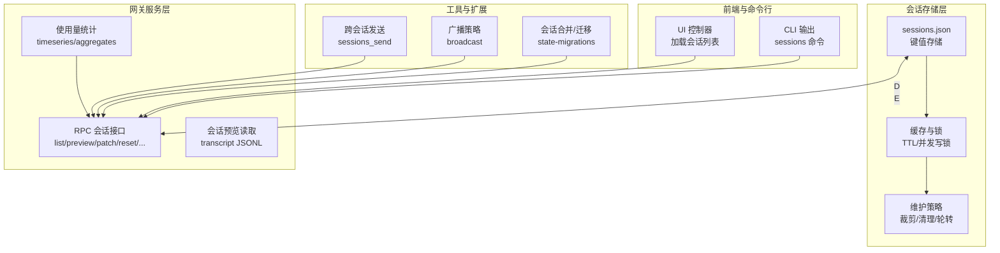
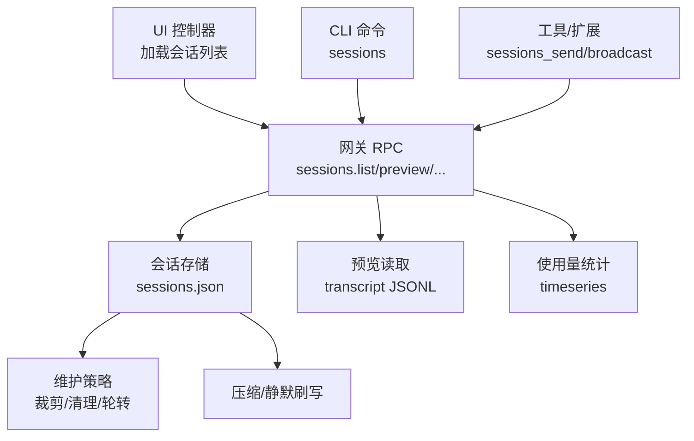
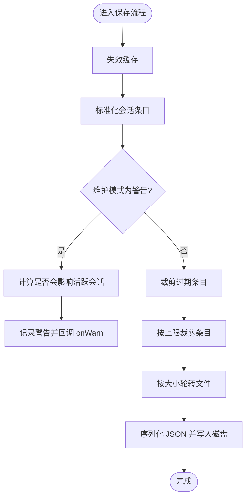
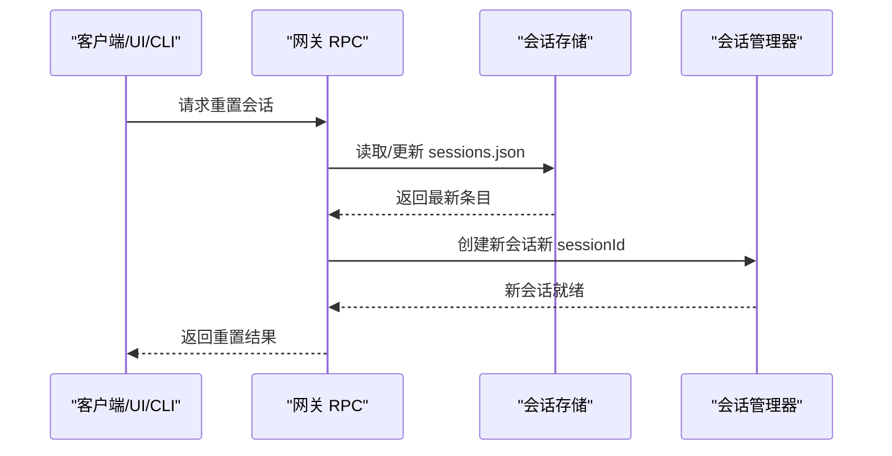
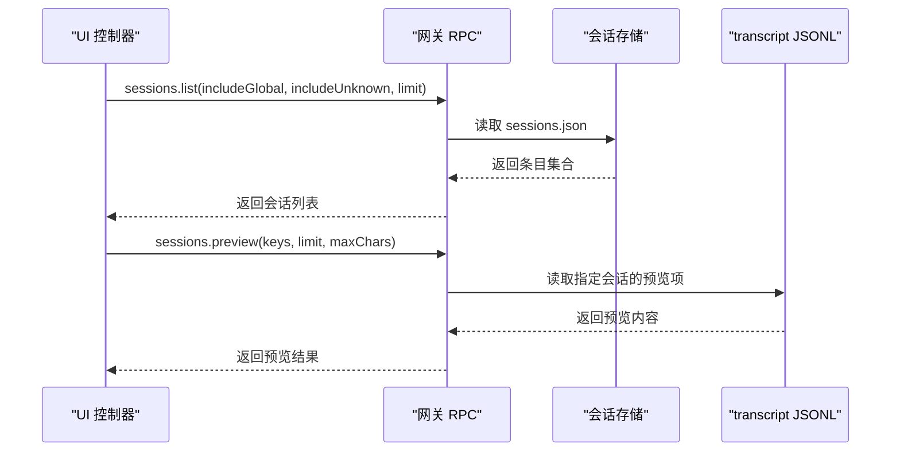
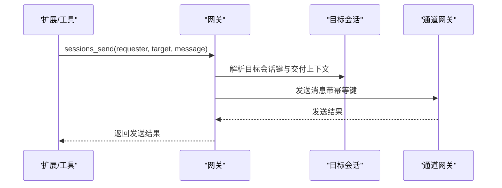
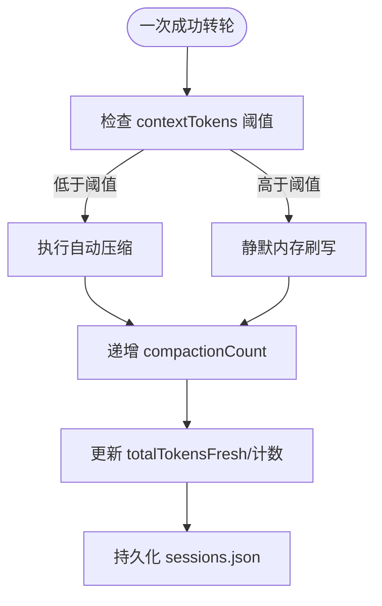
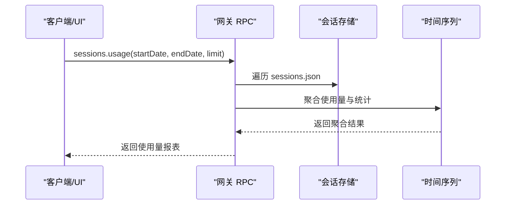
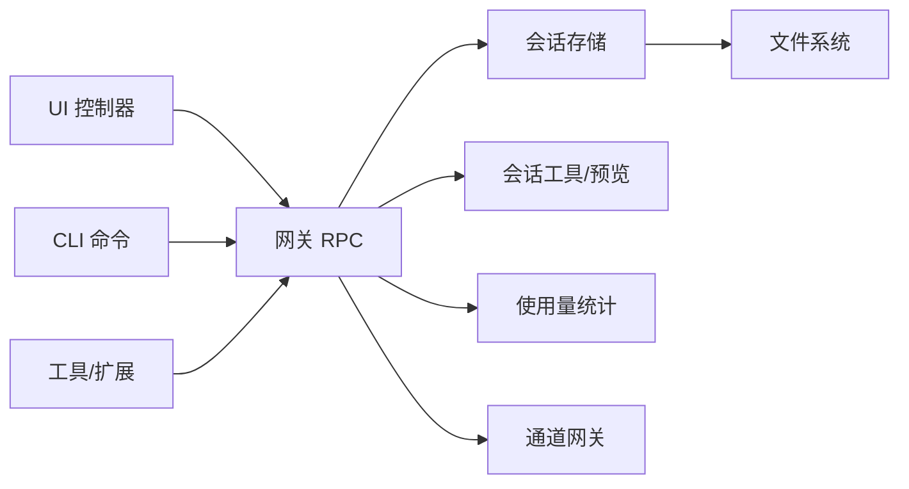

# 会话管理工具

<cite>
**本文引用的文件**
- [src/config/sessions/store.ts](file://src/config/sessions/store.ts)
- [src/config/sessions/types.ts](file://src/config/sessions/types.ts)
- [src/gateway/server-methods/sessions.ts](file://src/gateway/server-methods/sessions.ts)
- [src/gateway/server-methods/usage.ts](file://src/gateway/server-methods/usage.ts)
- [src/commands/sessions.ts](file://src/commands/sessions.ts)
- [src/agents/tools/sessions-send-tool.a2a.ts](file://src/agents/tools/sessions-send-tool.a2a.ts)
- [src/web/auto-reply/monitor/broadcast.ts](file://src/web/auto-reply/monitor/broadcast.ts)
- [src/gateway/server-chat.ts](file://src/gateway/server-chat.ts)
- [src/infra/session-maintenance-warning.ts](file://src/infra/session-maintenance-warning.ts)
- [src/agents/pi-embedded-runner/session-manager-cache.ts](file://src/agents/pi-embedded-runner/session-manager-cache.ts)
- [src/auto-reply/reply/session-updates.ts](file://src/auto-reply/reply/session-updates.ts)
- [docs/reference/session-management-compaction.md](file://docs/reference/session-management-compaction.md)
- [ui/src/ui/controllers/sessions.ts](file://ui/src/ui/controllers/sessions.ts)
- [ui/src/ui/app.ts](file://ui/src/ui/app.ts)
- [src/security/audit-extra.async.ts](file://src/security/audit-extra.async.ts)
- [src/agents/tools/sessions-list-tool.ts](file://src/agents/tools/sessions-list-tool.ts)
- [src/infra/state-migrations.ts](file://src/infra/state-migrations.ts)
</cite>

## 目录

1. [简介](#简介)
2. [项目结构](#项目结构)
3. [核心组件](#核心组件)
4. [架构总览](#架构总览)
5. [详细组件分析](#详细组件分析)
6. [依赖关系分析](#依赖关系分析)
7. [性能考量](#性能考量)
8. [故障排查指南](#故障排查指南)
9. [结论](#结论)
10. [附录](#附录)

## 简介

本文件为 OpenClaw 会话管理工具系统的技术文档，围绕会话的创建、维护与销毁，会话列表查询、历史记录管理与状态跟踪，会话间通信、消息转发与广播机制，权限控制与安全策略，会话合并/分割/迁移，存储优化与持久化策略，以及监控、统计与性能指标收集进行系统性阐述。文档以代码级实现为依据，辅以图示帮助不同背景读者理解。

## 项目结构

会话管理涉及多个子系统协同工作：

- 会话存储与维护：基于 sessions.json 的键值存储、缓存、维护（裁剪、清理、轮转）与并发写锁
- 会话生命周期与状态：会话键解析、会话条目结构、会话重置与合并
- 会话查询与预览：服务端 RPC 接口、CLI 输出、UI 控制器
- 会话间通信与广播：跨代理消息发送、广播策略、聊天事件广播
- 存储优化与持久化：自动压缩计数、静默内存刷写、历史归档
- 监控与统计：使用量聚合、时间序列、UI 展示
- 安全与权限：文件权限审计、跨代理访问策略

**图表来源**

- [src/config/sessions/store.ts](file://src/config/sessions/store.ts#L147-L213)
- [src/gateway/server-methods/sessions.ts](file://src/gateway/server-methods/sessions.ts#L44-L67)
- [src/gateway/server-methods/usage.ts](file://src/gateway/server-methods/usage.ts#L751-L800)
- [src/agents/tools/sessions-send-tool.a2a.ts](file://src/agents/tools/sessions-send-tool.a2a.ts#L102-L149)
- [src/web/auto-reply/monitor/broadcast.ts](file://src/web/auto-reply/monitor/broadcast.ts#L14-L40)
- [src/infra/state-migrations.ts](file://src/infra/state-migrations.ts#L683-L763)
- [ui/src/ui/controllers/sessions.ts](file://ui/src/ui/controllers/sessions.ts#L44-L92)
- [src/commands/sessions.ts](file://src/commands/sessions.ts#L148-L175)

**章节来源**

- [src/config/sessions/store.ts](file://src/config/sessions/store.ts#L147-L213)
- [src/gateway/server-methods/sessions.ts](file://src/gateway/server-methods/sessions.ts#L44-L67)
- [src/gateway/server-methods/usage.ts](file://src/gateway/server-methods/usage.ts#L751-L800)
- [src/commands/sessions.ts](file://src/commands/sessions.ts#L148-L175)
- [ui/src/ui/controllers/sessions.ts](file://ui/src/ui/controllers/sessions.ts#L44-L92)

## 核心组件

- 会话存储与维护
  - 会话存储：键值映射 sessionKey → SessionEntry，支持缓存、TTL、并发写锁、维护策略（裁剪、清理、轮转）
  - 维护策略：按时间阈值裁剪过期条目、按数量上限裁剪、按大小轮转旧文件
  - 并发控制：基于队列的写锁，避免竞态与丢失更新
- 会话生命周期与状态
  - 会话键解析与规范化
  - 会话条目结构定义与合并
  - 会话重置（按空闲、每日、指令触发）
- 会话查询与预览
  - 网关 RPC 提供 list/preview/resolve/patch/reset 等能力
  - CLI 与 UI 分别消费这些能力
- 会话间通信与广播
  - 跨代理消息发送（sessions_send）
  - 广播策略（并行/串行）
  - 聊天事件广播与接收者跟踪
- 存储优化与持久化
  - 自动压缩计数与静默内存刷写
  - 历史归档与迁移
- 监控与统计
  - 使用量聚合与时间序列
  - UI 层汇总展示
- 安全与权限
  - 文件权限审计
  - 跨代理访问策略

**章节来源**

- [src/config/sessions/store.ts](file://src/config/sessions/store.ts#L28-L128)
- [src/config/sessions/types.ts](file://src/config/sessions/types.ts#L25-L109)
- [src/gateway/server-methods/sessions.ts](file://src/gateway/server-methods/sessions.ts#L44-L231)
- [src/agents/tools/sessions-send-tool.a2a.ts](file://src/agents/tools/sessions-send-tool.a2a.ts#L102-L149)
- [src/web/auto-reply/monitor/broadcast.ts](file://src/web/auto-reply/monitor/broadcast.ts#L14-L40)
- [src/auto-reply/reply/session-updates.ts](file://src/auto-reply/reply/session-updates.ts#L225-L276)
- [src/infra/state-migrations.ts](file://src/infra/state-migrations.ts#L683-L763)
- [src/gateway/server-methods/usage.ts](file://src/gateway/server-methods/usage.ts#L751-L800)
- [src/security/audit-extra.async.ts](file://src/security/audit-extra.async.ts#L477-L501)
- [src/agents/tools/sessions-list-tool.ts](file://src/agents/tools/sessions-list-tool.ts#L98-L130)

## 架构总览

下图展示了会话管理在系统中的位置与交互关系：UI/CLI 通过网关 RPC 查询与修改会话；网关读写 sessions.json 并访问 transcript JSONL；工具与扩展参与跨会话通信与广播；后台维护线程负责裁剪、清理与轮转。

**图表来源**

- [ui/src/ui/controllers/sessions.ts](file://ui/src/ui/controllers/sessions.ts#L44-L92)
- [src/commands/sessions.ts](file://src/commands/sessions.ts#L148-L175)
- [src/gateway/server-methods/sessions.ts](file://src/gateway/server-methods/sessions.ts#L44-L135)
- [src/gateway/server-methods/usage.ts](file://src/gateway/server-methods/usage.ts#L751-L800)
- [src/config/sessions/store.ts](file://src/config/sessions/store.ts#L476-L578)
- [src/auto-reply/reply/session-updates.ts](file://src/auto-reply/reply/session-updates.ts#L225-L276)

## 详细组件分析

### 会话存储与维护

- 缓存与 TTL
  - 会话存储支持 TTL 缓存，避免频繁磁盘 IO；缓存命中时返回深拷贝，防止外部修改污染缓存
  - 缓存失效策略：TTL 过期或文件 mtime 变更
- 并发写锁
  - 写操作通过队列化的写锁串行化，避免竞态；支持超时与过期清理
- 维护策略
  - 裁剪：按 updatedAt 超过阈值移除条目
  - 裁剪上限：按最近更新排序，超过最大条目数时移除最旧条目
  - 轮转：当文件大小超过阈值时重命名为 .bak.<timestamp>，保留最近 3 份备份
- 权限与一致性
  - 写入前失效缓存，写入后设置严格权限（如 0600），Windows 下采用顺序写避免原子重命名问题

**图表来源**

- [src/config/sessions/store.ts](file://src/config/sessions/store.ts#L476-L578)
- [src/config/sessions/store.ts](file://src/config/sessions/store.ts#L301-L397)
- [src/config/sessions/store.ts](file://src/config/sessions/store.ts#L413-L465)

**章节来源**

- [src/config/sessions/store.ts](file://src/config/sessions/store.ts#L28-L128)
- [src/config/sessions/store.ts](file://src/config/sessions/store.ts#L301-L397)
- [src/config/sessions/store.ts](file://src/config/sessions/store.ts#L413-L465)
- [src/config/sessions/store.ts](file://src/config/sessions/store.ts#L476-L578)

### 会话生命周期与状态

- 会话键与条目
  - 会话键由 agentId、通道、群组/房间等组成，规范化的 SessionEntry 包含会话元数据、令牌计数、模型选择、发送策略等
- 会话重置
  - 支持按空闲时间、每日边界、指令触发等方式重置会话，生成新的 sessionId
- 合并与迁移
  - 将旧版本会话存储与目标存储合并，规范化键名并保存

**图表来源**

- [src/gateway/server-methods/sessions.ts](file://src/gateway/server-methods/sessions.ts#L214-L231)
- [src/config/sessions/types.ts](file://src/config/sessions/types.ts#L25-L109)
- [src/infra/state-migrations.ts](file://src/infra/state-migrations.ts#L683-L763)

**章节来源**

- [src/config/sessions/types.ts](file://src/config/sessions/types.ts#L25-L109)
- [src/gateway/server-methods/sessions.ts](file://src/gateway/server-methods/sessions.ts#L214-L231)
- [src/infra/state-migrations.ts](file://src/infra/state-migrations.ts#L683-L763)

### 会话查询与预览

- 会话列表
  - 网关提供 sessions.list，支持过滤与限制
  - UI 控制器封装加载逻辑，支持多种过滤条件与并发保护
- 会话预览
  - sessions.preview 读取 transcript JSONL 的若干条目作为预览
- CLI 输出
  - sessions 命令将条目转换为表格行，按 updatedAt 排序

**图表来源**

- [ui/src/ui/controllers/sessions.ts](file://ui/src/ui/controllers/sessions.ts#L44-L92)
- [src/gateway/server-methods/sessions.ts](file://src/gateway/server-methods/sessions.ts#L44-L135)
- [src/commands/sessions.ts](file://src/commands/sessions.ts#L148-L175)

**章节来源**

- [ui/src/ui/controllers/sessions.ts](file://ui/src/ui/controllers/sessions.ts#L44-L92)
- [src/gateway/server-methods/sessions.ts](file://src/gateway/server-methods/sessions.ts#L44-L135)
- [src/commands/sessions.ts](file://src/commands/sessions.ts#L148-L175)

### 会话间通信、消息转发与广播

- 跨会话发送
  - sessions_send 工具支持向目标会话发送消息，并可选进行“宣告式”通知
- 广播策略
  - 基于配置的广播列表与策略（并行/串行），对多代理进行消息分发
- 聊天事件广播
  - 跟踪每个运行 ID 的接收者集合，支持最终标记与过期清理

**图表来源**

- [src/agents/tools/sessions-send-tool.a2a.ts](file://src/agents/tools/sessions-send-tool.a2a.ts#L102-L149)
- [src/web/auto-reply/monitor/broadcast.ts](file://src/web/auto-reply/monitor/broadcast.ts#L14-L40)
- [src/gateway/server-chat.ts](file://src/gateway/server-chat.ts#L178-L224)

**章节来源**

- [src/agents/tools/sessions-send-tool.a2a.ts](file://src/agents/tools/sessions-send-tool.a2a.ts#L102-L149)
- [src/web/auto-reply/monitor/broadcast.ts](file://src/web/auto-reply/monitor/broadcast.ts#L14-L40)
- [src/gateway/server-chat.ts](file://src/gateway/server-chat.ts#L178-L224)

### 存储优化、压缩与持久化

- 自动压缩计数
  - 每次成功压缩后递增 compactionCount，并在需要时更新 totalTokens 与 Fresh 标记
- 静默内存刷写
  - 在阈值接近时执行“无声”转轮，将关键上下文写入磁盘，避免被压缩清除
- 历史归档与迁移
  - 合并旧版本会话存储，规范化键名并迁移文件

**图表来源**

- [src/auto-reply/reply/session-updates.ts](file://src/auto-reply/reply/session-updates.ts#L225-L276)
- [docs/reference/session-management-compaction.md](file://docs/reference/session-management-compaction.md#L174-L216)
- [src/infra/state-migrations.ts](file://src/infra/state-migrations.ts#L683-L763)

**章节来源**

- [src/auto-reply/reply/session-updates.ts](file://src/auto-reply/reply/session-updates.ts#L225-L276)
- [docs/reference/session-management-compaction.md](file://docs/reference/session-management-compaction.md#L174-L216)
- [src/infra/state-migrations.ts](file://src/infra/state-migrations.ts#L683-L763)

### 监控、统计与性能指标

- 使用量统计
  - sessions.usage 与 sessions.usage.timeseries 提供会话维度的使用量聚合与时间序列
- UI 层汇总
  - UI 对 provider、agent、channel 等维度进行聚合与展示

**图表来源**

- [src/gateway/server-methods/usage.ts](file://src/gateway/server-methods/usage.ts#L751-L800)
- [ui/src/ui/views/usage.ts](file://ui/src/ui/views/usage.ts#L446-L479)

**章节来源**

- [src/gateway/server-methods/usage.ts](file://src/gateway/server-methods/usage.ts#L751-L800)
- [ui/src/ui/views/usage.ts](file://ui/src/ui/views/usage.ts#L446-L479)

### 权限控制、访问限制与安全策略

- 文件权限审计
  - 对 sessions.json 的可读性进行审计，建议设置严格权限（如 0600）
- 跨代理访问策略
  - 会话列表工具对跨代理访问进行策略校验，仅允许授权代理访问
- 安全建议
  - 保持会话存储最小暴露面，定期审计权限与访问日志

**章节来源**

- [src/security/audit-extra.async.ts](file://src/security/audit-extra.async.ts#L477-L501)
- [src/agents/tools/sessions-list-tool.ts](file://src/agents/tools/sessions-list-tool.ts#L98-L130)

## 依赖关系分析

- 组件耦合
  - 网关服务层依赖会话存储模块与工具模块
  - UI/CLI 通过网关间接依赖会话存储与统计模块
  - 扩展与工具依赖网关 RPC 与通道网关
- 外部依赖
  - 文件系统（读写 sessions.json 与 transcript JSONL）
  - 通道网关（消息发送）
- 循环依赖
  - 通过模块职责划分避免循环依赖（存储、服务、工具、UI 分层）

**图表来源**

- [ui/src/ui/controllers/sessions.ts](file://ui/src/ui/controllers/sessions.ts#L44-L92)
- [src/commands/sessions.ts](file://src/commands/sessions.ts#L148-L175)
- [src/gateway/server-methods/sessions.ts](file://src/gateway/server-methods/sessions.ts#L44-L135)
- [src/gateway/server-methods/usage.ts](file://src/gateway/server-methods/usage.ts#L751-L800)
- [src/config/sessions/store.ts](file://src/config/sessions/store.ts#L476-L578)

**章节来源**

- [ui/src/ui/controllers/sessions.ts](file://ui/src/ui/controllers/sessions.ts#L44-L92)
- [src/commands/sessions.ts](file://src/commands/sessions.ts#L148-L175)
- [src/gateway/server-methods/sessions.ts](file://src/gateway/server-methods/sessions.ts#L44-L135)
- [src/gateway/server-methods/usage.ts](file://src/gateway/server-methods/usage.ts#L751-L800)
- [src/config/sessions/store.ts](file://src/config/sessions/store.ts#L476-L578)

## 性能考量

- 缓存与并发
  - 合理设置缓存 TTL 与启用写锁，减少磁盘 IO 与竞态
- 维护策略
  - 裁剪与轮转降低 sessions.json 体积，提升读写性能
- 预览与统计
  - 限制预览条数与字符数，避免大文件扫描
- 压缩与静默刷写
  - 在阈值附近执行静默刷写，避免压缩导致的上下文丢失与重试开销

[本节为通用指导，无需特定文件来源]

## 故障排查指南

- 会话列表为空或不一致
  - 确认网关主机与 sessions.json 路径，检查缓存是否过期
- 会话重置无效
  - 检查空闲/每日/指令触发条件，确认新 sessionId 已生成
- 广播失败
  - 查看广播策略与目标代理权限，确认通道网关可达
- 存储过大
  - 检查维护模式与轮转阈值，确认轮转是否生效
- 权限问题
  - 使用审计工具检查 sessions.json 权限，必要时调整为 0600

**章节来源**

- [src/config/sessions/store.ts](file://src/config/sessions/store.ts#L413-L465)
- [src/security/audit-extra.async.ts](file://src/security/audit-extra.async.ts#L477-L501)
- [src/infra/session-maintenance-warning.ts](file://src/infra/session-maintenance-warning.ts#L94-L108)

## 结论

OpenClaw 的会话管理通过“网关权威 + 分层存储”的设计实现了高可靠与高性能的会话生命周期管理。会话存储层提供缓存、并发写锁与维护策略；网关服务层统一对外提供查询、预览、重置、统计等能力；工具与扩展支持跨会话通信与广播；UI/CLI 提供直观的交互入口。配合压缩、静默刷写与权限审计，系统在可用性、安全性与可运维性方面达到平衡。

[本节为总结，无需特定文件来源]

## 附录

- 术语
  - 会话键（sessionKey）：路由与隔离标识
  - 会话 ID（sessionId）：当前对话的 transcript 文件名
  - 交付上下文（deliveryContext）：通道、目标、账号、主题等
- 常用路径
  - 会话存储：~/.openclaw/agents/<agentId>/sessions/sessions.json
  - 会话转录：~/.openclaw/agents/<agentId>/sessions/<sessionId>.jsonl

[本节为补充说明，无需特定文件来源]
