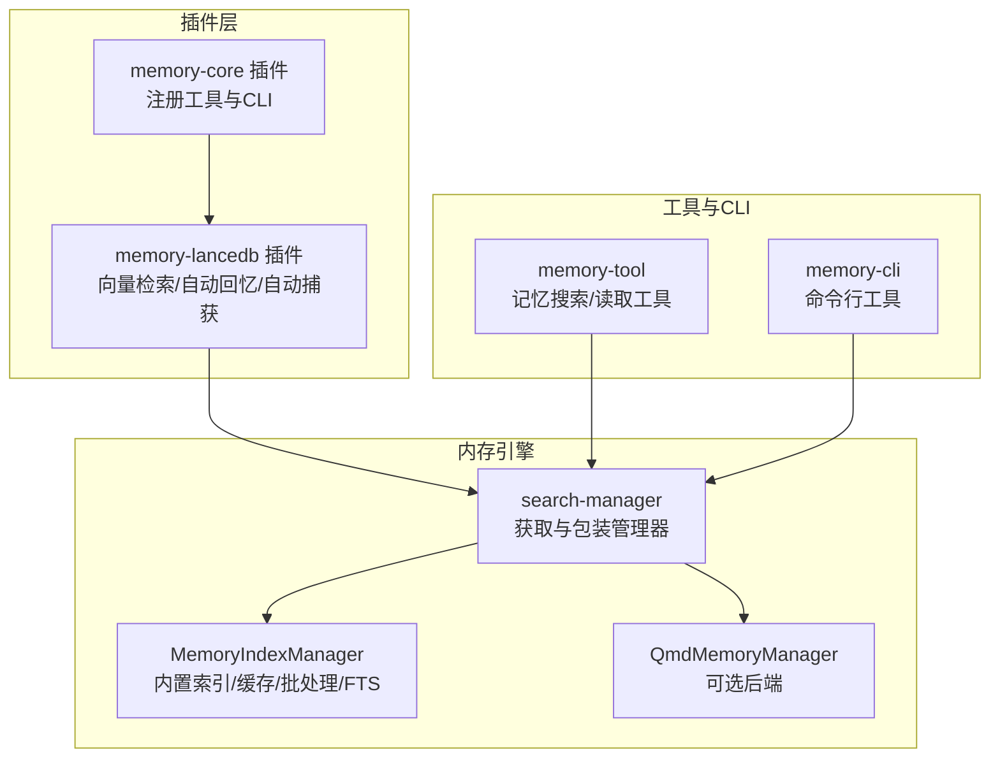
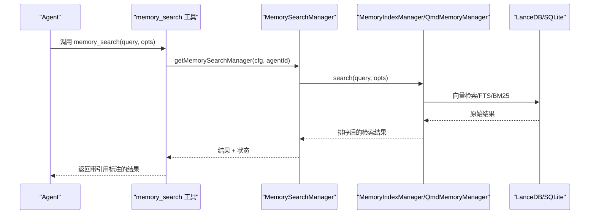
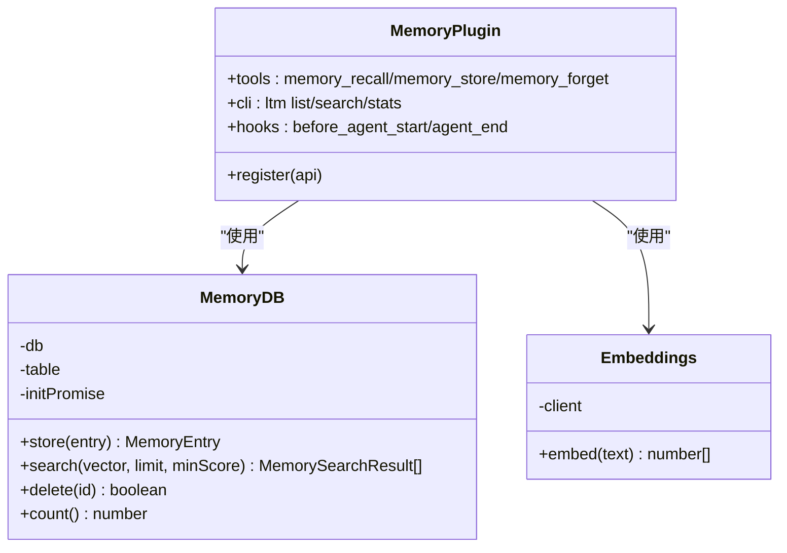
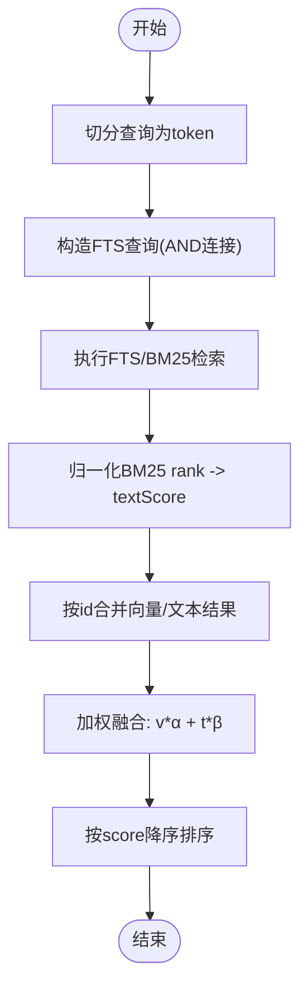
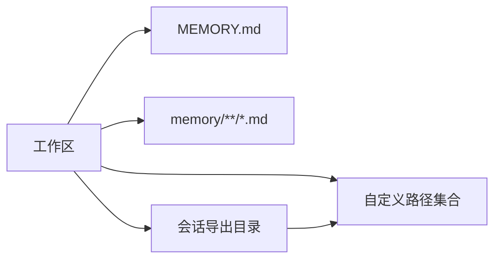
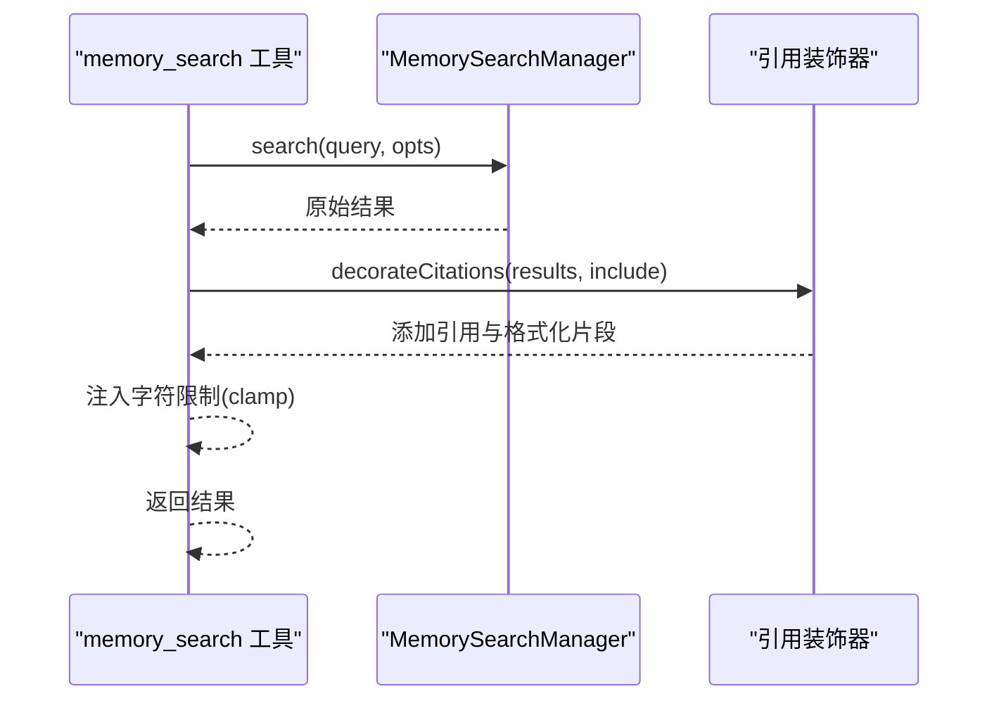
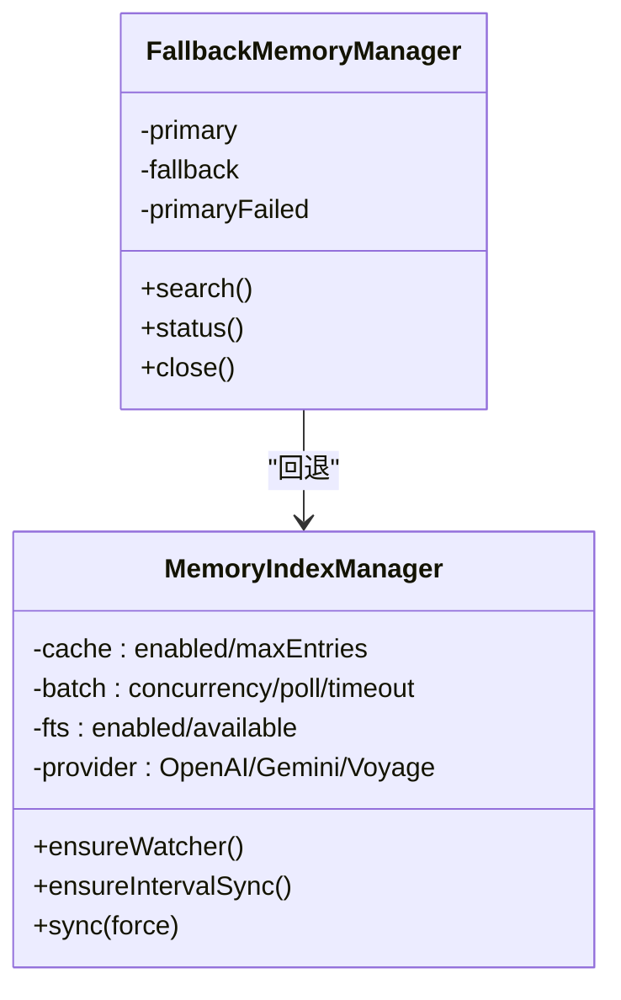
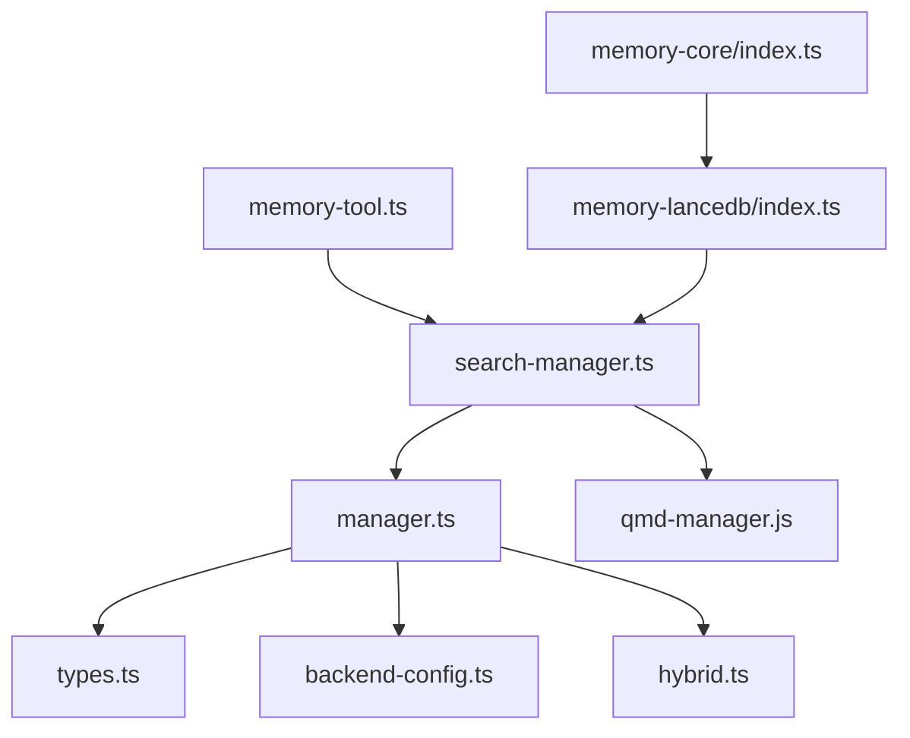

# 内存检索工具

<cite>
**本文档引用的文件**
- [extensions/memory-core/index.ts](file://extensions/memory-core/index.ts)
- [extensions/memory-lancedb/index.ts](file://extensions/memory-lancedb/index.ts)
- [extensions/memory-lancedb/config.ts](file://extensions/memory-lancedb/config.ts)
- [src/memory/index.ts](file://src/memory/index.ts)
- [src/memory/types.ts](file://src/memory/types.ts)
- [src/memory/search-manager.ts](file://src/memory/search-manager.ts)
- [src/memory/manager.ts](file://src/memory/manager.ts)
- [src/memory/backend-config.ts](file://src/memory/backend-config.ts)
- [src/memory/hybrid.ts](file://src/memory/hybrid.ts)
- [src/agents/tools/memory-tool.ts](file://src/agents/tools/memory-tool.ts)
- [src/cli/memory-cli.ts](file://src/cli/memory-cli.ts)
- [docs/concepts/memory.md](file://docs/concepts/memory.md)
</cite>

## 目录

1. [简介](#简介)
2. [项目结构](#项目结构)
3. [核心组件](#核心组件)
4. [架构总览](#架构总览)
5. [详细组件分析](#详细组件分析)
6. [依赖关系分析](#依赖关系分析)
7. [性能考量](#性能考量)
8. [故障排查指南](#故障排查指南)
9. [结论](#结论)
10. [附录](#附录)

## 简介

本文件面向OpenClaw的“内存检索工具”，系统性阐述其知识检索机制、语义搜索算法与向量嵌入技术，覆盖内存索引构建、查询优化与结果排序策略，并记录检索范围控制、时间过滤与相关性评分机制。文档同时解释不同类型内容（会话历史、媒体文件、外部链接等）的检索方式，以及检索性能优化、缓存策略与并发访问控制；并提供检索查询的最佳实践与检索结果的格式化、摘要生成与引用标注功能。

## 项目结构

OpenClaw的内存检索能力由两部分组成：

- 基于LanceDB的长程记忆插件：提供向量检索、自动回忆与自动捕获、CLI命令与工具注册。
- 内置内存搜索管理器：统一抽象检索接口、支持回退机制、缓存与批处理、全文检索（FTS5/BM25）与混合检索策略。

图表来源

- [extensions/memory-core/index.ts](file://extensions/memory-core/index.ts#L1-L39)
- [extensions/memory-lancedb/index.ts](file://extensions/memory-lancedb/index.ts#L242-L627)
- [src/memory/search-manager.ts](file://src/memory/search-manager.ts#L19-L65)
- [src/memory/manager.ts](file://src/memory/manager.ts#L111-L248)
- [src/agents/tools/memory-tool.ts](file://src/agents/tools/memory-tool.ts#L25-L88)
- [src/cli/memory-cli.ts](file://src/cli/memory-cli.ts#L348-L373)

章节来源

- [extensions/memory-core/index.ts](file://extensions/memory-core/index.ts#L1-L39)
- [extensions/memory-lancedb/index.ts](file://extensions/memory-lancedb/index.ts#L242-L627)
- [src/memory/search-manager.ts](file://src/memory/search-manager.ts#L19-L65)
- [src/memory/manager.ts](file://src/memory/manager.ts#L111-L248)
- [src/agents/tools/memory-tool.ts](file://src/agents/tools/memory-tool.ts#L25-L88)
- [src/cli/memory-cli.ts](file://src/cli/memory-cli.ts#L348-L373)

## 核心组件

- 记忆检索管理器接口：定义统一的检索、读取、状态查询、同步与探针方法，支持最大结果数、最小相关性阈值与会话键参数。
- 搜索管理器工厂：根据配置选择QMD或内置索引管理器，若QMD不可用则回退到内置实现。
- 内置索引管理器：负责数据库连接、模式初始化、FTS可用性检测、向量维度、缓存与批处理配置、文件监听与增量同步。
- 混合检索辅助：提供FTS查询构造、BM25分数归一化与向量/文本分数加权融合。
- 记忆工具与CLI：对外暴露记忆搜索与读取工具，支持引用标注与注入字符限制。

章节来源

- [src/memory/types.ts](file://src/memory/types.ts#L61-L81)
- [src/memory/search-manager.ts](file://src/memory/search-manager.ts#L19-L65)
- [src/memory/manager.ts](file://src/memory/manager.ts#L111-L248)
- [src/memory/hybrid.ts](file://src/memory/hybrid.ts#L23-L116)
- [src/agents/tools/memory-tool.ts](file://src/agents/tools/memory-tool.ts#L25-L88)
- [src/cli/memory-cli.ts](file://src/cli/memory-cli.ts#L348-L373)

## 架构总览

OpenClaw的检索体系采用“插件 + 引擎 + 工具/CLI”的分层设计：

- 插件层：通过OpenClaw插件SDK注册工具与CLI，提供向量检索、存储与遗忘等能力。
- 引擎层：统一抽象检索接口，按需加载QMD或内置索引，支持回退与缓存。
- 工具与CLI：面向Agent与用户，提供检索与读取能力，并支持引用标注与上下文注入限制。

图表来源

- [src/agents/tools/memory-tool.ts](file://src/agents/tools/memory-tool.ts#L46-L82)
- [src/memory/search-manager.ts](file://src/memory/search-manager.ts#L81-L102)
- [src/memory/manager.ts](file://src/memory/manager.ts#L111-L248)
- [extensions/memory-lancedb/index.ts](file://extensions/memory-lancedb/index.ts#L272-L305)

章节来源

- [src/agents/tools/memory-tool.ts](file://src/agents/tools/memory-tool.ts#L46-L82)
- [src/memory/search-manager.ts](file://src/memory/search-manager.ts#L81-L102)
- [src/memory/manager.ts](file://src/memory/manager.ts#L111-L248)
- [extensions/memory-lancedb/index.ts](file://extensions/memory-lancedb/index.ts#L272-L305)

## 详细组件分析

### 向量检索与嵌入（LanceDB）

- 存储模型：使用LanceDB表存储记忆条目，字段包含唯一ID、文本、向量、重要度、类别与创建时间。
- 嵌入模型：通过OpenAI Embeddings生成向量，支持多模型维度映射。
- 检索流程：对查询进行嵌入，执行向量相似度检索，将L2距离转换为0-1相似度，并按最小阈值过滤。
- 自动回忆：在Agent开始前对提示词嵌入，检索相关记忆并注入上下文。
- 自动捕获：对话结束后提取可捕获文本，基于规则与分类进行去重与存储。

图表来源

- [extensions/memory-lancedb/index.ts](file://extensions/memory-lancedb/index.ts#L58-L156)
- [extensions/memory-lancedb/index.ts](file://extensions/memory-lancedb/index.ts#L162-L179)
- [extensions/memory-lancedb/index.ts](file://extensions/memory-lancedb/index.ts#L242-L627)

章节来源

- [extensions/memory-lancedb/index.ts](file://extensions/memory-lancedb/index.ts#L58-L156)
- [extensions/memory-lancedb/index.ts](file://extensions/memory-lancedb/index.ts#L162-L179)
- [extensions/memory-lancedb/index.ts](file://extensions/memory-lancedb/index.ts#L242-L627)

### 混合检索与相关性评分

- FTS查询构造：将查询按词法切分为token，使用AND连接，避免空查询。
- BM25分数归一化：将rank映射到0-1区间，保证与向量分数在同一尺度。
- 结果融合：按chunk id合并向量与文本结果，计算加权最终得分并降序排序。

图表来源

- [src/memory/hybrid.ts](file://src/memory/hybrid.ts#L23-L116)
- [docs/concepts/memory.md](file://docs/concepts/memory.md#L397-L422)

章节来源

- [src/memory/hybrid.ts](file://src/memory/hybrid.ts#L23-L116)
- [docs/concepts/memory.md](file://docs/concepts/memory.md#L397-L422)

### 检索范围控制与会话集成

- 检索范围：默认检索工作区内的MEMORY.md与memory目录下的Markdown文件；可配置自定义路径集合。
- 会话历史：支持将会话导出到指定目录并纳入检索范围，受发送策略控制。
- 会话键：工具执行时传入sessionKey，用于决定是否显示引用标注与注入字符限制。

图表来源

- [src/memory/backend-config.ts](file://src/memory/backend-config.ts#L233-L252)
- [src/memory/backend-config.ts](file://src/memory/backend-config.ts#L184-L198)
- [src/agents/tools/memory-tool.ts](file://src/agents/tools/memory-tool.ts#L190-L219)

章节来源

- [src/memory/backend-config.ts](file://src/memory/backend-config.ts#L233-L252)
- [src/memory/backend-config.ts](file://src/memory/backend-config.ts#L184-L198)
- [src/agents/tools/memory-tool.ts](file://src/agents/tools/memory-tool.ts#L190-L219)

### 结果排序与引用标注

- 排序策略：内置索引管理器返回结果已按相关性排序；混合检索进一步融合向量与文本信号。
- 引用标注：根据配置与聊天类型（直接/群组/频道）决定是否添加引用；引用格式为“路径#L起-L止”。

图表来源

- [src/agents/tools/memory-tool.ts](file://src/agents/tools/memory-tool.ts#L145-L188)
- [src/agents/tools/memory-tool.ts](file://src/agents/tools/memory-tool.ts#L190-L219)

章节来源

- [src/agents/tools/memory-tool.ts](file://src/agents/tools/memory-tool.ts#L145-L188)
- [src/agents/tools/memory-tool.ts](file://src/agents/tools/memory-tool.ts#L190-L219)

### 缓存策略与并发控制

- 缓存：内置索引管理器维护缓存开关与最大条目数，支持按配置启用。
- 批处理：批量嵌入与更新具备并发限制、轮询间隔与超时控制，失败计数与锁保护避免抖动。
- 回退机制：当QMD不可用时自动切换至内置索引管理器，记录回退原因并清理缓存以便重试。

图表来源

- [src/memory/manager.ts](file://src/memory/manager.ts#L111-L248)
- [src/memory/search-manager.ts](file://src/memory/search-manager.ts#L67-L202)

章节来源

- [src/memory/manager.ts](file://src/memory/manager.ts#L111-L248)
- [src/memory/search-manager.ts](file://src/memory/search-manager.ts#L67-L202)

### 查询最佳实践

- 关键词组合：使用自然语言描述，系统将自动切分为token并以AND连接；建议包含具体实体名称与上下文。
- 布尔查询：当前实现以AND连接token，不支持显式布尔操作符；可通过精确短语与实体名提升召回。
- 高级技巧：优先描述意图而非直接给出答案；结合“记忆搜索 + 安全读取”流程，先检索再按需拉取片段。
- 结果格式化：工具自动添加引用标注与上下文注入限制；必要时调整maxResults与minScore以平衡召回与精度。

章节来源

- [src/memory/hybrid.ts](file://src/memory/hybrid.ts#L23-L34)
- [src/agents/tools/memory-tool.ts](file://src/agents/tools/memory-tool.ts#L164-L188)

## 依赖关系分析

- 组件耦合：工具层仅依赖检索管理器接口，引擎层通过工厂选择实现；插件层通过SDK注册工具与CLI，降低耦合。
- 外部依赖：LanceDB用于向量检索；OpenAI用于嵌入；SQLite/FTS5用于全文检索；可选QMD作为后端。
- 循环依赖：未发现循环依赖；回退包装器在运行时动态创建，避免编译期耦合。

图表来源

- [src/agents/tools/memory-tool.ts](file://src/agents/tools/memory-tool.ts#L1-L219)
- [src/memory/search-manager.ts](file://src/memory/search-manager.ts#L1-L65)
- [src/memory/manager.ts](file://src/memory/manager.ts#L111-L248)
- [src/memory/types.ts](file://src/memory/types.ts#L1-L81)
- [src/memory/backend-config.ts](file://src/memory/backend-config.ts#L1-L311)
- [src/memory/hybrid.ts](file://src/memory/hybrid.ts#L1-L116)
- [extensions/memory-lancedb/index.ts](file://extensions/memory-lancedb/index.ts#L242-L627)
- [extensions/memory-core/index.ts](file://extensions/memory-core/index.ts#L1-L39)

章节来源

- [src/agents/tools/memory-tool.ts](file://src/agents/tools/memory-tool.ts#L1-L219)
- [src/memory/search-manager.ts](file://src/memory/search-manager.ts#L1-L65)
- [src/memory/manager.ts](file://src/memory/manager.ts#L111-L248)
- [src/memory/types.ts](file://src/memory/types.ts#L1-L81)
- [src/memory/backend-config.ts](file://src/memory/backend-config.ts#L1-L311)
- [src/memory/hybrid.ts](file://src/memory/hybrid.ts#L1-L116)
- [extensions/memory-lancedb/index.ts](file://extensions/memory-lancedb/index.ts#L242-L627)
- [extensions/memory-core/index.ts](file://extensions/memory-core/index.ts#L1-L39)

## 性能考量

- 向量检索：LanceDB默认使用L2距离，系统将其转换为相似度；合理设置minScore与limit可减少无效匹配。
- 全文检索：FTS5/BM25在精确token上表现更优；与向量检索融合可兼顾语义与精确匹配。
- 批处理与并发：批处理配置包含并发度、轮询间隔与超时，避免频繁调用导致资源争用。
- 缓存：启用缓存可显著降低重复查询开销；注意缓存大小与失效策略。
- 字符注入限制：在QMD后端中限制注入字符数，避免上下文过长影响推理效率。

章节来源

- [src/memory/manager.ts](file://src/memory/manager.ts#L124-L134)
- [src/memory/manager.ts](file://src/memory/manager.ts#L228-L231)
- [src/agents/tools/memory-tool.ts](file://src/agents/tools/memory-tool.ts#L164-L188)

## 故障排查指南

- 向量检索失败：检查嵌入模型与API密钥配置；确认LanceDB加载成功与表存在。
- FTS不可用：确认SQLite/FTS5可用性；若不可用，系统仍可回退至向量检索。
- 回退日志：当QMD失败时，系统会记录回退原因并切换到内置索引；可在状态中查看fallback信息。
- CLI诊断：使用ltm命令查看统计与搜索结果，核对输出是否包含预期片段与引用。

章节来源

- [extensions/memory-lancedb/config.ts](file://extensions/memory-lancedb/config.ts#L80-L112)
- [src/memory/search-manager.ts](file://src/memory/search-manager.ts#L81-L102)
- [src/cli/memory-cli.ts](file://src/cli/memory-cli.ts#L348-L373)

## 结论

OpenClaw的内存检索工具通过“插件 + 引擎 + 工具/CLI”的分层设计，实现了从向量检索到混合检索、从自动回忆到自动捕获的完整闭环。内置索引管理器提供了稳健的缓存、批处理与回退机制，确保在不同环境下稳定运行。通过合理的查询策略与配置，用户可以在语义理解与精确匹配之间取得良好平衡，并获得可追溯的引用标注与可控的上下文注入。

## 附录

- 检索范围控制：默认包含工作区根与memory目录下的Markdown文件，可配置自定义路径与会话导出目录。
- 时间过滤：当前实现未提供显式时间过滤；可通过会话导出策略与文件命名约定间接控制。
- 相关性评分：向量相似度与BM25分数经归一化后加权融合，最终按score降序排列。
- 结果格式化：工具自动添加引用标注与上下文注入限制；引用格式为“路径#L起-L止”。

章节来源

- [src/memory/backend-config.ts](file://src/memory/backend-config.ts#L233-L252)
- [src/memory/hybrid.ts](file://src/memory/hybrid.ts#L36-L39)
- [src/agents/tools/memory-tool.ts](file://src/agents/tools/memory-tool.ts#L145-L162)
