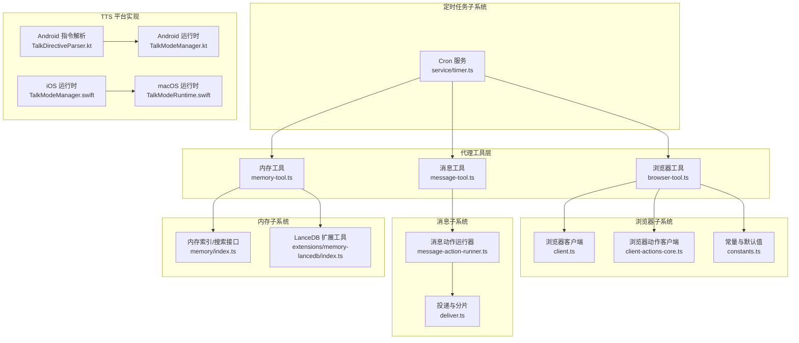
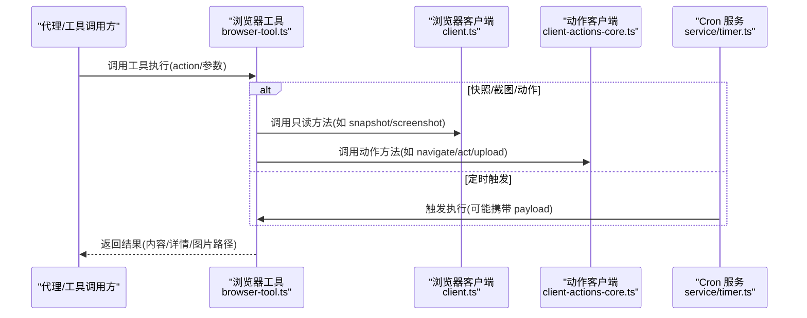
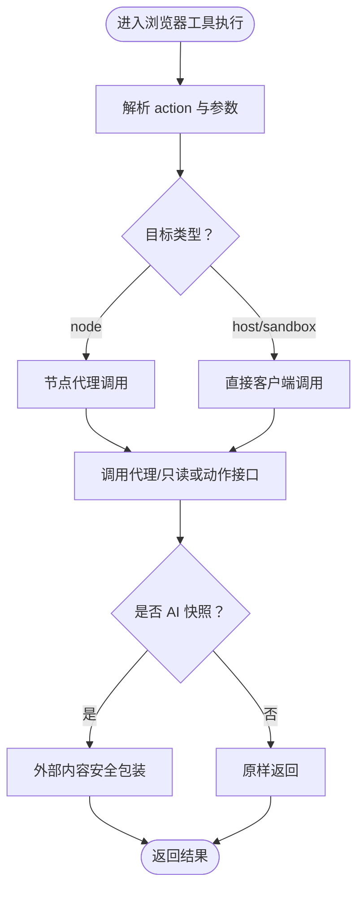
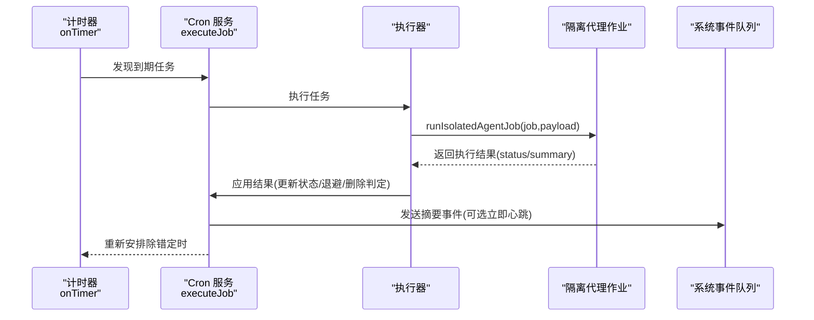
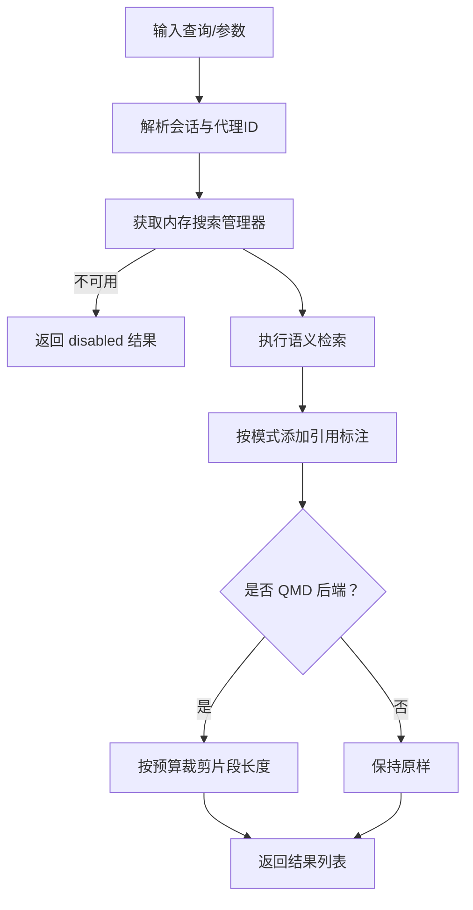
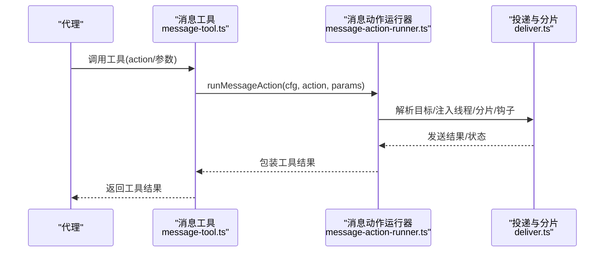
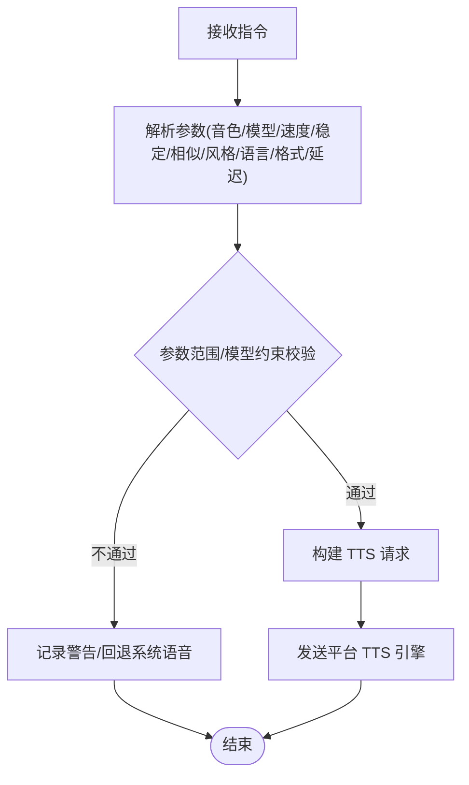
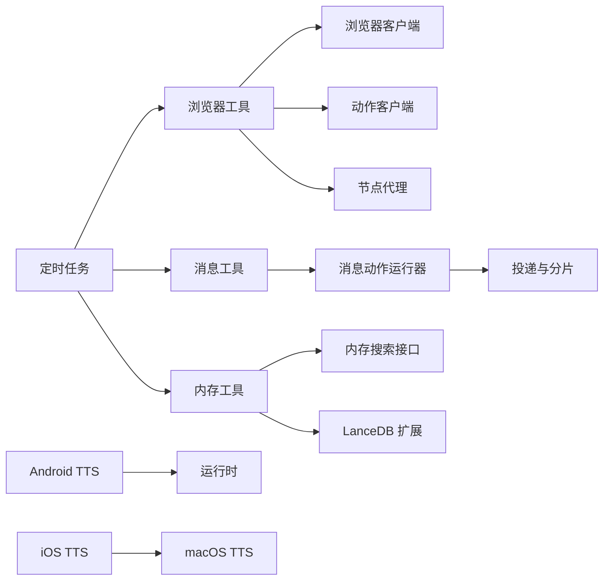

# 内置工具集

<cite>
**本文档引用的文件**
- [src/agents/tools/browser-tool.ts](file://src/agents/tools/browser-tool.ts)
- [src/browser/client.ts](file://src/browser/client.ts)
- [src/browser/client-actions-core.ts](file://src/browser/client-actions-core.ts)
- [src/browser/constants.ts](file://src/browser/constants.ts)
- [src/agents/tools/browser-tool.schema.ts](file://src/agents/tools/browser-tool.schema.ts)
- [src/agents/tools/browser-tool.test.ts](file://src/agents/tools/browser-tool.test.ts)
- [src/cron/service/timer.ts](file://src/cron/service/timer.ts)
- [src/cron/service.every-jobs-fire.test.ts](file://src/cron/service.every-jobs-fire.test.ts)
- [src/cron/service.issue-regressions.test.ts](file://src/cron/service.issue-regressions.test.ts)
- [src/cli/cron-cli/register.cron-edit.ts](file://src/cli/cron-cli/register.cron-edit.ts)
- [src/agents/tools/memory-tool.ts](file://src/agents/tools/memory-tool.ts)
- [src/memory/index.ts](file://src/memory/index.ts)
- [extensions/memory-lancedb/index.ts](file://extensions/memory-lancedb/index.ts)
- [src/agents/tools/message-tool.ts](file://src/agents/tools/message-tool.ts)
- [src/infra/outbound/message-action-runner.ts](file://src/infra/outbound/message-action-runner.ts)
- [src/infra/outbound/deliver.ts](file://src/infra/outbound/deliver.ts)
- [apps/android/app/src/main/java/ai/openclaw/android/voice/TalkDirectiveParser.kt](file://apps/android/app/src/main/java/ai/openclaw/android/voice/TalkDirectiveParser.kt)
- [apps/android/app/src/main/java/ai/openclaw/android/voice/TalkModeManager.kt](file://apps/android/app/src/main/java/ai/openclaw/android/voice/TalkModeManager.kt)
- [apps/ios/Sources/Voice/TalkModeManager.swift](file://apps/ios/Sources/Voice/TalkModeManager.swift)
- [apps/macos/Sources/OpenClaw/TalkModeRuntime.swift](file://apps/macos/Sources/OpenClaw/TalkModeRuntime.swift)
</cite>

## 目录

1. [简介](#简介)
2. [项目结构](#项目结构)
3. [核心组件](#核心组件)
4. [架构总览](#架构总览)
5. [详细组件分析](#详细组件分析)
6. [依赖关系分析](#依赖关系分析)
7. [性能考量](#性能考量)
8. [故障排查指南](#故障排查指南)
9. [结论](#结论)
10. [附录](#附录)

## 简介

本文件系统性梳理 OpenClaw 的内置工具集，覆盖以下工具类别与能力：

- 浏览器工具：网页抓取（快照/截图）、自动化操作（导航/点击/输入/上传/对话框）、日志与标签页管理
- 定时任务工具：基于 Cron/每间隔/at 的调度、执行策略、结果回传与错误退避
- 内存工具：知识检索、引用标注、会话上下文整合、向量存储扩展
- 消息工具：多通道发送、转发、广播、带按钮/卡片、附件与分片策略
- 文本转语音工具：音色/模型/语速/稳定性/相似度/风格/延迟等参数控制与平台适配

文档同时阐述各工具间的协作机制与数据流，帮助开发者与使用者高效配置与扩展。

## 项目结构

内置工具主要分布在 agents/tools 下的各类工具实现，配合 browser、cron、memory、infra/outbound 等子系统完成端到端流程；平台侧的 TTS 在各客户端工程中实现统一指令解析与请求构造。

图表来源

- [src/agents/tools/browser-tool.ts](file://src/agents/tools/browser-tool.ts#L1-L844)
- [src/browser/client.ts](file://src/browser/client.ts#L276-L337)
- [src/browser/client-actions-core.ts](file://src/browser/client-actions-core.ts#L239-L263)
- [src/browser/constants.ts](file://src/browser/constants.ts#L1-L9)
- [src/agents/tools/message-tool.ts](file://src/agents/tools/message-tool.ts#L1-L493)
- [src/infra/outbound/message-action-runner.ts](file://src/infra/outbound/message-action-runner.ts#L1-L1159)
- [src/infra/outbound/deliver.ts](file://src/infra/outbound/deliver.ts#L370-L411)
- [src/agents/tools/memory-tool.ts](file://src/agents/tools/memory-tool.ts#L1-L219)
- [src/memory/index.ts](file://src/memory/index.ts#L1-L8)
- [extensions/memory-lancedb/index.ts](file://extensions/memory-lancedb/index.ts#L262-L410)
- [src/cron/service/timer.ts](file://src/cron/service/timer.ts#L43-L594)
- [apps/android/app/src/main/java/ai/openclaw/android/voice/TalkDirectiveParser.kt](file://apps/android/app/src/main/java/ai/openclaw/android/voice/TalkDirectiveParser.kt#L47-L68)
- [apps/android/app/src/main/java/ai/openclaw/android/voice/TalkModeManager.kt](file://apps/android/app/src/main/java/ai/openclaw/android/voice/TalkModeManager.kt#L494-L1045)
- [apps/ios/Sources/Voice/TalkModeManager.swift](file://apps/ios/Sources/Voice/TalkModeManager.swift#L995-L1015)
- [apps/macos/Sources/OpenClaw/TalkModeRuntime.swift](file://apps/macos/Sources/OpenClaw/TalkModeRuntime.swift#L564-L924)

章节来源

- [src/agents/tools/browser-tool.ts](file://src/agents/tools/browser-tool.ts#L1-L844)
- [src/agents/tools/message-tool.ts](file://src/agents/tools/message-tool.ts#L1-L493)
- [src/agents/tools/memory-tool.ts](file://src/agents/tools/memory-tool.ts#L1-L219)
- [src/cron/service/timer.ts](file://src/cron/service/timer.ts#L43-L594)

## 核心组件

- 浏览器工具：提供状态查询、启动/停止、标签页管理、快照/截图、导航、控制台日志、PDF 导出、文件上传与对话框钩子等能力，并支持沙箱/宿主/节点代理模式。
- 定时任务工具：以 Cron 表达式、固定间隔或一次性时间点驱动任务执行，内置连续错误计数与指数退避、自动禁用、下次运行时间重算与心跳唤醒。
- 内存工具：语义检索与片段读取，支持引用标注、会话上下文注入、后端配置与字符预算裁剪。
- 消息工具：统一路由与参数校验，支持发送、回复、转发、广播、带按钮/卡片、附件与分片、插件钩子与跨上下文装饰。
- 文本转语音工具：在 Android/iOS/macOS 上解析统一指令，构建 TTS 请求，支持音色、速度、稳定性、相似度、风格、延迟层级等参数。

章节来源

- [src/agents/tools/browser-tool.ts](file://src/agents/tools/browser-tool.ts#L245-L844)
- [src/cron/service/timer.ts](file://src/cron/service/timer.ts#L48-L564)
- [src/agents/tools/memory-tool.ts](file://src/agents/tools/memory-tool.ts#L25-L135)
- [src/agents/tools/message-tool.ts](file://src/agents/tools/message-tool.ts#L388-L493)
- [apps/android/app/src/main/java/ai/openclaw/android/voice/TalkModeManager.kt](file://apps/android/app/src/main/java/ai/openclaw/android/voice/TalkModeManager.kt#L494-L1045)

## 架构总览

下图展示浏览器工具与消息工具在系统中的调用链路与依赖关系：

图表来源

- [src/agents/tools/browser-tool.ts](file://src/agents/tools/browser-tool.ts#L268-L844)
- [src/browser/client.ts](file://src/browser/client.ts#L276-L337)
- [src/browser/client-actions-core.ts](file://src/browser/client-actions-core.ts#L239-L263)
- [src/cron/service/timer.ts](file://src/cron/service/timer.ts#L160-L506)

## 详细组件分析

### 浏览器工具

- 功能特性
  - 状态与生命周期：status/start/stop/profiles/tabs/open/focus/close
  - 抓取与可视化：snapshot（AI/Aria 模式，可裁剪字符数、标签、引用类型、交互/紧凑/深度/选择器/框架/模式）
  - 截图：screenshot（目标/全页/元素/类型）
  - 自动化：navigate、console、pdf、upload（文件选择器）、dialog（确认/提示）
  - 节点代理：当存在可用节点时自动路由至节点代理，支持指定节点或自动选择
- 使用场景
  - 网页快照用于 AI 推理与后续 UI 自动化
  - 截图用于问题定位与证据留存
  - 文件上传与对话框钩子用于模拟用户交互
- 配置选项
  - profile：chrome（浏览器扩展接管）/openclaw（隔离浏览器）
  - target：sandbox/host/node（沙箱/宿主/节点）
  - snapshot 参数：format、targetId、limit、maxChars、refs、interactive、compact、depth、selector、frame、labels、mode
  - screenshot 参数：targetId、fullPage、ref、element、type
  - 动作参数：request（act 请求体）、accept/promptText、paths/inputRef/element、timeoutMs 等
- 数据流
  - 工具参数经解析后，按目标（宿主/沙箱/节点）选择对应客户端或代理调用，返回结果封装为图片或文本并安全包装外部内容

图表来源

- [src/agents/tools/browser-tool.ts](file://src/agents/tools/browser-tool.ts#L268-L844)
- [src/browser/client.ts](file://src/browser/client.ts#L276-L337)
- [src/browser/client-actions-core.ts](file://src/browser/client-actions-core.ts#L239-L263)

章节来源

- [src/agents/tools/browser-tool.ts](file://src/agents/tools/browser-tool.ts#L245-L844)
- [src/browser/client.ts](file://src/browser/client.ts#L276-L337)
- [src/browser/client-actions-core.ts](file://src/browser/client-actions-core.ts#L239-L263)
- [src/browser/constants.ts](file://src/browser/constants.ts#L6-L9)
- [src/agents/tools/browser-tool.schema.ts](file://src/agents/tools/browser-tool.schema.ts#L80-L112)
- [src/agents/tools/browser-tool.test.ts](file://src/agents/tools/browser-tool.test.ts#L95-L178)

### 定时任务工具

- 调度机制
  - 支持三种计划：cron（Cron 表达式）、every（固定间隔）、at（一次性时间点）
  - 计时器周期性检查到期任务，避免长任务导致的漏检
- 执行策略
  - 任务执行前记录 runningAtMs，结束后更新 lastRunAtMs/lastDurationMs/lastStatus/lastError
  - 连续错误计数，触发指数退避与自动禁用
  - 一次性任务（at）执行后根据配置决定删除
- 结果处理
  - 将摘要回传至主会话，必要时请求心跳唤醒
  - 事件回调通知状态变更
- 关键行为验证
  - 计划变更后重新计算 nextRunAtMs
  - 每分钟任务与 legacy-every 同时触发且统计正确

图表来源

- [src/cron/service/timer.ts](file://src/cron/service/timer.ts#L160-L506)
- [src/cron/service.every-jobs-fire.test.ts](file://src/cron/service.every-jobs-fire.test.ts#L196-L225)
- [src/cron/service.issue-regressions.test.ts](file://src/cron/service.issue-regressions.test.ts#L63-L91)
- [src/cli/cron-cli/register.cron-edit.ts](file://src/cli/cron-cli/register.cron-edit.ts#L116-L138)

章节来源

- [src/cron/service/timer.ts](file://src/cron/service/timer.ts#L48-L564)
- [src/cron/service.every-jobs-fire.test.ts](file://src/cron/service.every-jobs-fire.test.ts#L196-L225)
- [src/cron/service.issue-regressions.test.ts](file://src/cron/service.issue-regressions.test.ts#L63-L91)
- [src/cli/cron-cli/register.cron-edit.ts](file://src/cli/cron-cli/register.cron-edit.ts#L116-L138)

### 内存工具

- 功能特性
  - 语义检索：memory_search，支持 maxResults/minScore，返回带引用标注的片段
  - 片段读取：memory_get，按路径与行号范围读取
  - 引用管理：根据配置自动/强制/关闭引用标注，区分私聊/群组/频道
  - 后端适配：QMD 字符预算裁剪，向量数据库扩展（LanceDB）
- 使用场景
  - 回答历史/偏好/决策前的“强制回忆”步骤
  - 将检索结果注入上下文，减少幻觉与上下文膨胀
- 配置选项
  - memory.citations：on/off/auto
  - QMD 注入字符预算限制
  - LanceDB 存储/检索/删除能力（recall/store/forget）

图表来源

- [src/agents/tools/memory-tool.ts](file://src/agents/tools/memory-tool.ts#L25-L135)
- [src/memory/index.ts](file://src/memory/index.ts#L1-L8)
- [extensions/memory-lancedb/index.ts](file://extensions/memory-lancedb/index.ts#L262-L410)

章节来源

- [src/agents/tools/memory-tool.ts](file://src/agents/tools/memory-tool.ts#L25-L219)
- [src/memory/index.ts](file://src/memory/index.ts#L1-L8)
- [extensions/memory-lancedb/index.ts](file://extensions/memory-lancedb/index.ts#L262-L410)

### 消息工具

- 功能特性
  - 统一动作：send/sendWithEffect/sendAttachment/reply/thread-reply/broadcast/poll/setGroupIcon 等
  - 多通道支持：通过插件体系扩展，支持按钮/卡片、媒体、分片、跨上下文装饰
  - 安全与策略：插件钩子（message_sending）可修改/取消内容；文本分片与 Markdown 表格转换
  - 目标解析：自动注入线程/论坛话题 ID，镜像 Slack 自动线程行为
- 使用场景
  - 机器人自动回复、批量广播、带交互按钮的消息
  - 跨渠道转发与带附件的富媒体消息
- 配置选项
  - channel/targets/accountId/dryRun 等路由参数
  - 媒体/缓冲区/文件名/内容类型/标题/回复/静默/表情/最佳尝试/GIF 播放等发送参数
  - 插件钩子与文本分片策略

图表来源

- [src/agents/tools/message-tool.ts](file://src/agents/tools/message-tool.ts#L388-L493)
- [src/infra/outbound/message-action-runner.ts](file://src/infra/outbound/message-action-runner.ts#L1-L1159)
- [src/infra/outbound/deliver.ts](file://src/infra/outbound/deliver.ts#L370-L411)

章节来源

- [src/agents/tools/message-tool.ts](file://src/agents/tools/message-tool.ts#L1-L493)
- [src/infra/outbound/message-action-runner.ts](file://src/infra/outbound/message-action-runner.ts#L1-L1159)
- [src/infra/outbound/deliver.ts](file://src/infra/outbound/deliver.ts#L370-L411)

### 文本转语音工具

- 功能特性
  - 统一指令解析：在 Android/iOS/macOS 上解析 voice/model/speed/rate/stability/similarity/style/speakerBoost/seed/normalize/language/outputFormat/latencyTier/once 等
  - 请求构建：根据平台差异与模型约束进行参数校验与转换
  - 速度与稳定性：支持 WPM 与倍速互转，范围校验与警告
- 使用场景
  - 语音播报、TTS 集成、多平台一致性输出
- 配置选项
  - 速度：speed 或 rateWPM（互斥，范围 0.5-2.0）
  - 稳定性/相似度/风格：0-1 或特定模型限定值
  - 语言/输出格式/延迟层级/一次性播放等

图表来源

- [apps/android/app/src/main/java/ai/openclaw/android/voice/TalkDirectiveParser.kt](file://apps/android/app/src/main/java/ai/openclaw/android/voice/TalkDirectiveParser.kt#L47-L68)
- [apps/android/app/src/main/java/ai/openclaw/android/voice/TalkModeManager.kt](file://apps/android/app/src/main/java/ai/openclaw/android/voice/TalkModeManager.kt#L494-L1045)
- [apps/ios/Sources/Voice/TalkModeManager.swift](file://apps/ios/Sources/Voice/TalkModeManager.swift#L995-L1015)
- [apps/macos/Sources/OpenClaw/TalkModeRuntime.swift](file://apps/macos/Sources/OpenClaw/TalkModeRuntime.swift#L564-L924)

章节来源

- [apps/android/app/src/main/java/ai/openclaw/android/voice/TalkDirectiveParser.kt](file://apps/android/app/src/main/java/ai/openclaw/android/voice/TalkDirectiveParser.kt#L47-L68)
- [apps/android/app/src/main/java/ai/openclaw/android/voice/TalkModeManager.kt](file://apps/android/app/src/main/java/ai/openclaw/android/voice/TalkModeManager.kt#L494-L1045)
- [apps/ios/Sources/Voice/TalkModeManager.swift](file://apps/ios/Sources/Voice/TalkModeManager.swift#L995-L1015)
- [apps/macos/Sources/OpenClaw/TalkModeRuntime.swift](file://apps/macos/Sources/OpenClaw/TalkModeRuntime.swift#L564-L924)

## 依赖关系分析

- 浏览器工具依赖浏览器客户端与动作客户端，支持节点代理模式以提升安全性与可移植性
- 定时任务工具与消息/浏览器/内存工具解耦，通过系统事件与隔离代理作业集成
- 消息工具通过运行器与投递模块实现跨通道、跨上下文的一致性
- 内存工具依赖内存搜索管理器与可插拔后端（QMD/LanceDB）
- TTS 工具在各平台独立实现，共享统一指令解析

图表来源

- [src/agents/tools/browser-tool.ts](file://src/agents/tools/browser-tool.ts#L1-L844)
- [src/browser/client.ts](file://src/browser/client.ts#L1-L337)
- [src/browser/client-actions-core.ts](file://src/browser/client-actions-core.ts#L1-L263)
- [src/cron/service/timer.ts](file://src/cron/service/timer.ts#L1-L594)
- [src/agents/tools/message-tool.ts](file://src/agents/tools/message-tool.ts#L1-L493)
- [src/infra/outbound/message-action-runner.ts](file://src/infra/outbound/message-action-runner.ts#L1-L1159)
- [src/infra/outbound/deliver.ts](file://src/infra/outbound/deliver.ts#L1-L411)
- [src/agents/tools/memory-tool.ts](file://src/agents/tools/memory-tool.ts#L1-L219)
- [src/memory/index.ts](file://src/memory/index.ts#L1-L8)
- [extensions/memory-lancedb/index.ts](file://extensions/memory-lancedb/index.ts#L1-L410)
- [apps/android/app/src/main/java/ai/openclaw/android/voice/TalkModeManager.kt](file://apps/android/app/src/main/java/ai/openclaw/android/voice/TalkModeManager.kt#L1-L1045)
- [apps/ios/Sources/Voice/TalkModeManager.swift](file://apps/ios/Sources/Voice/TalkModeManager.swift#L1-L1015)
- [apps/macos/Sources/OpenClaw/TalkModeRuntime.swift](file://apps/macos/Sources/OpenClaw/TalkModeRuntime.swift#L1-L924)

章节来源

- [src/agents/tools/browser-tool.ts](file://src/agents/tools/browser-tool.ts#L1-L844)
- [src/cron/service/timer.ts](file://src/cron/service/timer.ts#L1-L594)
- [src/agents/tools/message-tool.ts](file://src/agents/tools/message-tool.ts#L1-L493)
- [src/agents/tools/memory-tool.ts](file://src/agents/tools/memory-tool.ts#L1-L219)

## 性能考量

- 浏览器快照
  - AI 模式默认最大字符数与高效模式深度/字符上限可通过配置与常量控制，避免上下文溢出
  - 标签与引用类型影响快照体积与解析成本
- 定时任务
  - 计时器固定重检间隔避免长任务导致的静默停摆；连续错误触发退避，降低系统压力
- 消息投递
  - 文本分片与 Markdown 表格转换减少单次发送失败；插件钩子允许在发送前修正内容
- 内存检索
  - QMD 注入预算裁剪与引用标注开关平衡召回质量与上下文大小
- TTS
  - 参数范围校验与平台默认值减少无效请求；延迟层级与一次性播放优化用户体验

## 故障排查指南

- 浏览器工具
  - 无可用节点时自动回退至宿主/沙箱；若使用 Chrome 扩展接管需确保已附加标签页
  - 快照/截图失败时检查目标 Id 与引用类型一致性
- 定时任务
  - 若任务未按时触发，检查计时器是否被长任务阻塞；计划变更后确认 nextRunAtMs 已更新
  - 连续错误过多将触发自动禁用，需人工干预
- 消息工具
  - 广播需启用 tools.message.broadcast.enabled；目标解析失败需检查 channel/targets
  - 插件钩子异常不影响整体投递，但可能导致内容被取消或修改
- 内存工具
  - 检查 memory.citations 配置与会话类型；QMD 后端注意注入字符预算
- TTS
  - 速度/稳定性/相似度超出范围将被忽略并记录警告；缺失 API Key 将回退系统语音

章节来源

- [src/agents/tools/browser-tool.ts](file://src/agents/tools/browser-tool.ts#L275-L282)
- [src/cron/service/timer.ts](file://src/cron/service/timer.ts#L160-L183)
- [src/agents/tools/message-tool.ts](file://src/agents/tools/message-tool.ts#L404-L437)
- [src/agents/tools/memory-tool.ts](file://src/agents/tools/memory-tool.ts#L137-L203)
- [apps/android/app/src/main/java/ai/openclaw/android/voice/TalkModeManager.kt](file://apps/android/app/src/main/java/ai/openclaw/android/voice/TalkModeManager.kt#L494-L505)

## 结论

OpenClaw 内置工具集围绕“可组合、可扩展、可治理”的设计原则构建：浏览器工具提供强大的网页抓取与自动化能力；定时任务工具保障稳定可靠的周期性执行；消息工具实现跨通道一致的发送与转发；内存工具强化长期记忆与检索；TTS 工具在多平台提供统一的语音体验。通过清晰的参数模型、安全包装与策略化执行，这些工具可在复杂场景中协同工作，满足从自动化到智能交互的多样化需求。

## 附录

- 浏览器快照默认字符上限与高效模式参数可参考常量定义
- CLI 中 Cron 编辑支持 at/every/cron 三类计划切换与时区设置
- LanceDB 扩展提供 recall/store/forget 三类核心能力，便于构建长期记忆系统

章节来源

- [src/browser/constants.ts](file://src/browser/constants.ts#L6-L9)
- [src/cli/cron-cli/register.cron-edit.ts](file://src/cli/cron-cli/register.cron-edit.ts#L116-L138)
- [extensions/memory-lancedb/index.ts](file://extensions/memory-lancedb/index.ts#L262-L410)
