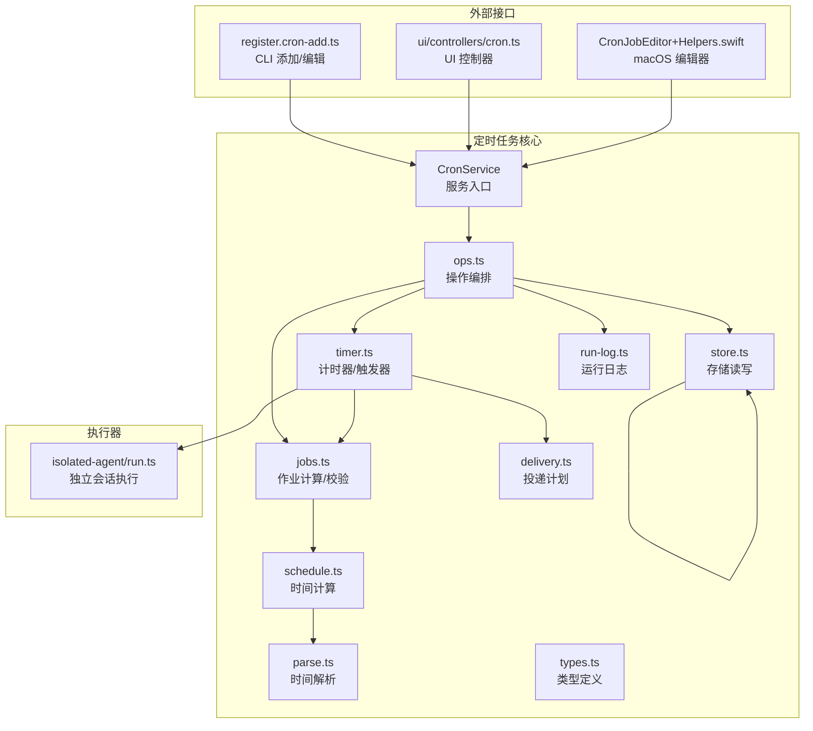
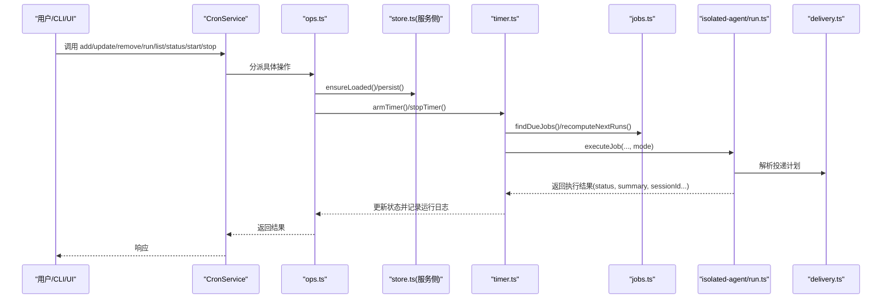
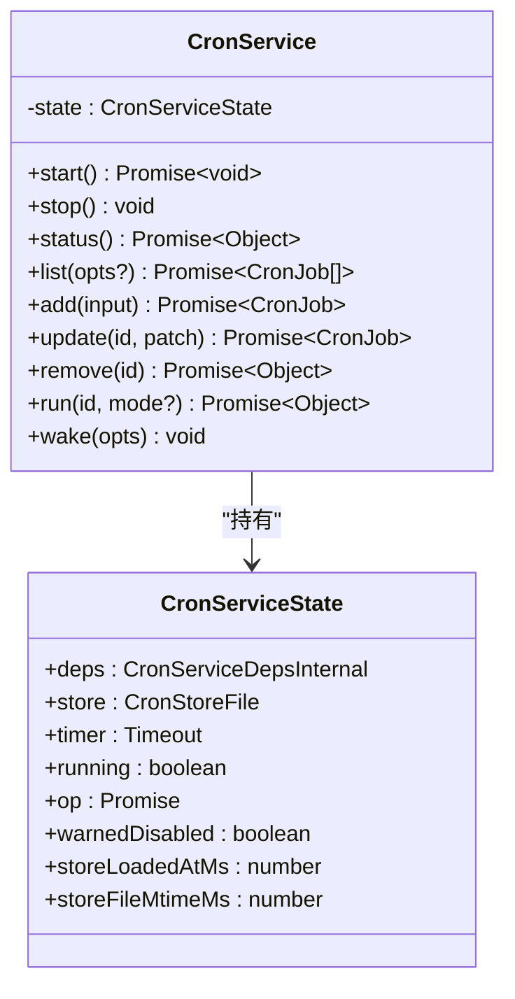
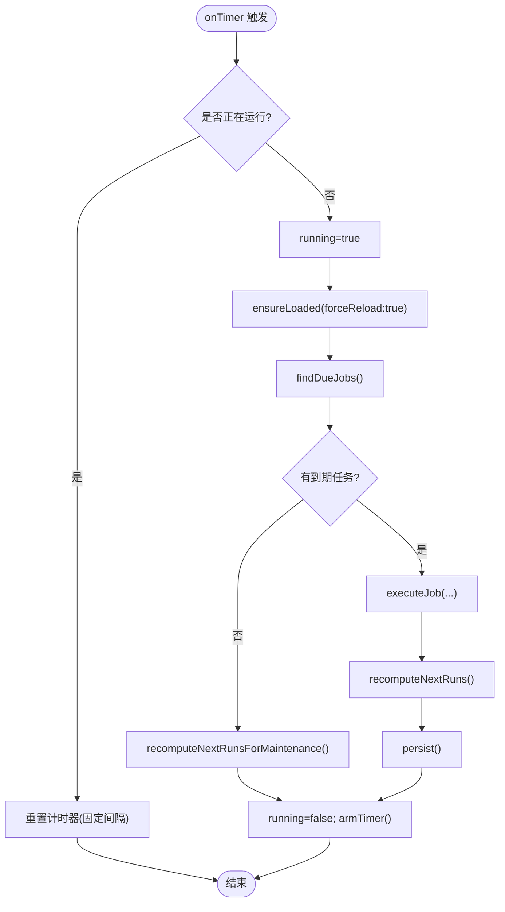
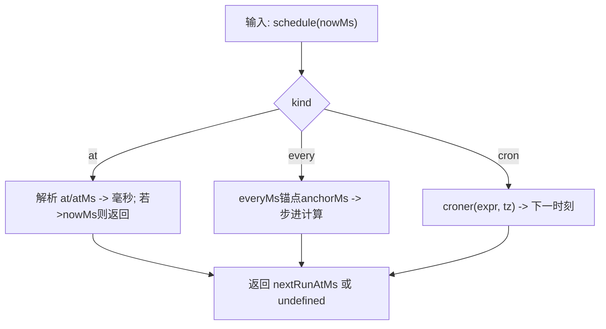
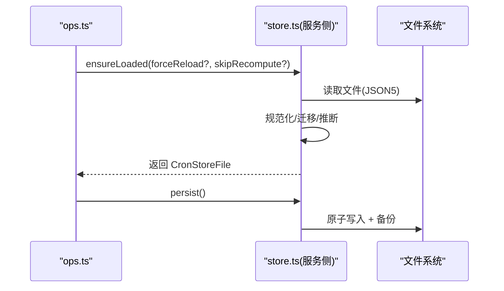
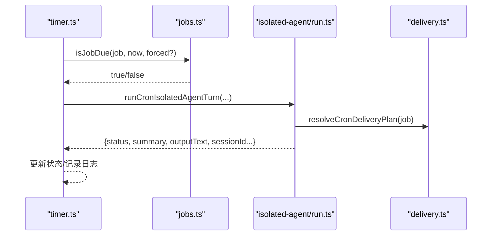
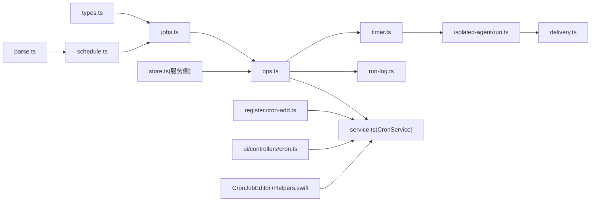

# 定时任务工具

<cite>
**本文引用的文件**
- [src/cron/service.ts](file://src/cron/service.ts)
- [src/cron/service/state.ts](file://src/cron/service/state.ts)
- [src/cron/service/ops.ts](file://src/cron/service/ops.ts)
- [src/cron/service/timer.ts](file://src/cron/service/timer.ts)
- [src/cron/service/jobs.ts](file://src/cron/service/jobs.ts)
- [src/cron/service/store.ts](file://src/cron/service/store.ts)
- [src/cron/schedule.ts](file://src/cron/schedule.ts)
- [src/cron/parse.ts](file://src/cron/parse.ts)
- [src/cron/types.ts](file://src/cron/types.ts)
- [src/cron/store.ts](file://src/cron/store.ts)
- [src/cron/delivery.ts](file://src/cron/delivery.ts)
- [src/cron/isolated-agent/run.ts](file://src/cron/isolated-agent/run.ts)
- [src/cron/run-log.ts](file://src/cron/run-log.ts)
- [src/cli/cron-cli/register.cron-add.ts](file://src/cli/cron-cli/register.cron-add.ts)
- [src/cli/cron-cli/register.cron-edit.ts](file://src/cli/cron-cli/register.cron-edit.ts)
- [apps/macos/Sources/OpenClaw/CronJobEditor+Helpers.swift](file://apps/macos/Sources/OpenClaw/CronJobEditor+Helpers.swift)
- [ui/src/ui/controllers/cron.ts](file://ui/src/ui/controllers/cron.ts)
- [docs/cli/cron.md](file://docs/cli/cron.md)
</cite>

## 目录

1. [简介](#简介)
2. [项目结构](#项目结构)
3. [核心组件](#核心组件)
4. [架构总览](#架构总览)
5. [详细组件分析](#详细组件分析)
6. [依赖关系分析](#依赖关系分析)
7. [性能考量](#性能考量)
8. [故障排除指南](#故障排除指南)
9. [结论](#结论)
10. [附录：常见场景与最佳实践](#附录常见场景与最佳实践)

## 简介

本文件为 OpenClaw 定时任务工具（Cron）的全面技术文档，覆盖 Cron 表达式解析、任务调度机制、执行策略与结果处理流程；说明任务的创建、修改、删除与查询；记录任务存储机制、持久化策略与状态管理；解释任务执行上下文、参数传递与返回值处理；涵盖任务优先级、并发控制、失败重试与超时处理；并提供常见定时任务场景的实际示例与监控、日志记录及故障排除指南。

## 项目结构

定时任务子系统主要位于 src/cron 目录下，围绕服务层、存储层、调度器与执行器展开，并通过 CLI 与 UI 提供操作入口。

**图表来源**

- [src/cron/service.ts](file://src/cron/service.ts#L1-L48)
- [src/cron/service/ops.ts](file://src/cron/service/ops.ts#L1-L212)
- [src/cron/service/timer.ts](file://src/cron/service/timer.ts#L160-L358)
- [src/cron/service/jobs.ts](file://src/cron/service/jobs.ts#L1-L490)
- [src/cron/service/store.ts](file://src/cron/service/store.ts#L1-L509)
- [src/cron/schedule.ts](file://src/cron/schedule.ts#L1-L68)
- [src/cron/parse.ts](file://src/cron/parse.ts#L1-L32)
- [src/cron/types.ts](file://src/cron/types.ts#L1-L99)
- [src/cron/delivery.ts](file://src/cron/delivery.ts#L1-L78)
- [src/cron/isolated-agent/run.ts](file://src/cron/isolated-agent/run.ts#L1-L620)
- [src/cron/run-log.ts](file://src/cron/run-log.ts#L1-L122)
- [src/cli/cron-cli/register.cron-add.ts](file://src/cli/cron-cli/register.cron-add.ts#L1-L251)
- [ui/src/ui/controllers/cron.ts](file://ui/src/ui/controllers/cron.ts#L150-L202)
- [apps/macos/Sources/OpenClaw/CronJobEditor+Helpers.swift](file://apps/macos/Sources/OpenClaw/CronJobEditor+Helpers.swift#L134-L171)

**章节来源**

- [src/cron/service.ts](file://src/cron/service.ts#L1-L48)
- [src/cron/service/state.ts](file://src/cron/service/state.ts#L1-L105)
- [src/cron/service/ops.ts](file://src/cron/service/ops.ts#L1-L212)
- [src/cron/service/timer.ts](file://src/cron/service/timer.ts#L160-L358)
- [src/cron/service/jobs.ts](file://src/cron/service/jobs.ts#L1-L490)
- [src/cron/service/store.ts](file://src/cron/service/store.ts#L1-L509)
- [src/cron/schedule.ts](file://src/cron/schedule.ts#L1-L68)
- [src/cron/parse.ts](file://src/cron/parse.ts#L1-L32)
- [src/cron/types.ts](file://src/cron/types.ts#L1-L99)
- [src/cron/delivery.ts](file://src/cron/delivery.ts#L1-L78)
- [src/cron/isolated-agent/run.ts](file://src/cron/isolated-agent/run.ts#L1-L620)
- [src/cron/run-log.ts](file://src/cron/run-log.ts#L1-L122)
- [src/cli/cron-cli/register.cron-add.ts](file://src/cli/cron-cli/register.cron-add.ts#L1-L251)
- [ui/src/ui/controllers/cron.ts](file://ui/src/ui/controllers/cron.ts#L150-L202)
- [apps/macos/Sources/OpenClaw/CronJobEditor+Helpers.swift](file://apps/macos/Sources/OpenClaw/CronJobEditor+Helpers.swift#L134-L171)

## 核心组件

- CronService：对外暴露 start/stop/status/list/add/update/remove/run/wake 等方法，封装状态机与操作编排。
- ops.ts：统一编排 start/status/list/add/update/remove/run/wake 等操作，负责加载/保存存储、重新计算下次运行时间、设置计时器等。
- timer.ts：基于定时器驱动的调度循环，检测到期任务并执行；在执行期间保持计时器重置，避免长任务导致调度器“死亡”。
- jobs.ts：作业规范校验、名称推断、下次运行时间计算、到期判断、补丁应用、合并交付配置等。
- store.ts（服务侧）：确保加载、迁移与规范化存储内容，必要时持久化；warnIfDisabled 处理禁用状态提示。
- schedule.ts/parse.ts：解析 Cron 表达式、at/atMs/everyMs 到毫秒时间戳；处理时区与边界条件。
- types.ts：定义 CronSchedule、CronPayload、CronDelivery、CronJob 等核心类型。
- delivery.ts：根据 delivery/payload 推导投递计划（是否需要投递、通道、目标）。
- isolated-agent/run.ts：独立会话执行器，支持模型回退、令牌统计、会话持久化、消息投递与最佳努力模式。
- run-log.ts：按作业粒度的 JSONL 运行日志，带裁剪策略。
- CLI/UI/macOS：提供添加/编辑/运行/删除/列表等操作入口。

**章节来源**

- [src/cron/service.ts](file://src/cron/service.ts#L1-L48)
- [src/cron/service/ops.ts](file://src/cron/service/ops.ts#L1-L212)
- [src/cron/service/timer.ts](file://src/cron/service/timer.ts#L160-L358)
- [src/cron/service/jobs.ts](file://src/cron/service/jobs.ts#L1-L490)
- [src/cron/service/store.ts](file://src/cron/service/store.ts#L1-L509)
- [src/cron/schedule.ts](file://src/cron/schedule.ts#L1-L68)
- [src/cron/parse.ts](file://src/cron/parse.ts#L1-L32)
- [src/cron/types.ts](file://src/cron/types.ts#L1-L99)
- [src/cron/delivery.ts](file://src/cron/delivery.ts#L1-L78)
- [src/cron/isolated-agent/run.ts](file://src/cron/isolated-agent/run.ts#L1-L620)
- [src/cron/run-log.ts](file://src/cron/run-log.ts#L1-L122)

## 架构总览

定时任务从“存储文件”出发，通过“服务层”进行加载、规范化与持久化；“计时器”周期性扫描到期任务；“执行器”根据作业类型（主会话事件或独立会话代理对话）执行并产出运行日志与可选投递。

**图表来源**

- [src/cron/service.ts](file://src/cron/service.ts#L1-L48)
- [src/cron/service/ops.ts](file://src/cron/service/ops.ts#L1-L212)
- [src/cron/service/store.ts](file://src/cron/service/store.ts#L264-L485)
- [src/cron/service/timer.ts](file://src/cron/service/timer.ts#L160-L358)
- [src/cron/service/jobs.ts](file://src/cron/service/jobs.ts#L340-L490)
- [src/cron/isolated-agent/run.ts](file://src/cron/isolated-agent/run.ts#L106-L620)
- [src/cron/delivery.ts](file://src/cron/delivery.ts#L30-L78)

## 详细组件分析

### CronService 与操作编排

- 对外方法：start/stop/status/list/add/update/remove/run/wake。
- 内部状态：CronServiceState 包含 deps、store、timer、running、op、warnedDisabled、storeLoadedAtMs、storeFileMtimeMs。
- 操作编排：ops.ts 统一处理加锁、加载存储、计算下次运行时间、持久化、计时器重置与事件上报。

**图表来源**

- [src/cron/service.ts](file://src/cron/service.ts#L1-L48)
- [src/cron/service/state.ts](file://src/cron/service/state.ts#L53-L79)

**章节来源**

- [src/cron/service.ts](file://src/cron/service.ts#L1-L48)
- [src/cron/service/state.ts](file://src/cron/service/state.ts#L1-L105)

### 计时器与到期检测

- onTimer：若正在运行则先重置计时器，避免长任务导致调度停滞；否则标记 running=true，加载并确保存储已加载，查找到期任务，逐个执行。
- findDueJobs：过滤 enabled、未在运行中、nextRunAtMs 已到或缺失的任务。
- 重入保护：MAX_TIMER_DELAY_MS 固定重检查间隔，防止零延迟热循环；同时在 finally 中恢复 running=false 并重新挂载计时器。

**图表来源**

- [src/cron/service/timer.ts](file://src/cron/service/timer.ts#L160-L358)
- [src/cron/service/jobs.ts](file://src/cron/service/jobs.ts#L340-L358)

**章节来源**

- [src/cron/service/timer.ts](file://src/cron/service/timer.ts#L160-L358)
- [src/cron/service/jobs.ts](file://src/cron/service/jobs.ts#L340-L358)

### 作业计算与调度

- computeJobNextRunAtMs：针对 at/every/cron 三类调度分别计算；at 类型在成功完成后清除下次运行时间；every 类型使用 anchorMs 与每间隔步进。
- recomputeNextRuns：批量重算 nextRunAtMs，清理过期 running 标记，处理连续调度错误阈值自动禁用。
- schedule.ts：Cron 表达式使用 croner，按秒粒度计算下一时刻；at/every 使用 parse.ts 与毫秒换算。
- 时间边界：floor(nowMs/1000)\*1000 避免同一秒重复触发；every 采用向上取整步数，保证不回退。

**图表来源**

- [src/cron/schedule.ts](file://src/cron/schedule.ts#L13-L67)
- [src/cron/parse.ts](file://src/cron/parse.ts#L18-L31)

**章节来源**

- [src/cron/service/jobs.ts](file://src/cron/service/jobs.ts#L57-L88)
- [src/cron/schedule.ts](file://src/cron/schedule.ts#L13-L67)
- [src/cron/parse.ts](file://src/cron/parse.ts#L18-L31)

### 存储与持久化

- 存储路径：默认 ~/.openclaw/config/cron/jobs.json，支持 ~ 展开与自定义路径。
- 加载/保存：loadCronStore/saveCronStore 支持 JSON5 解析与原子写入，保留 .bak 备份。
- 服务侧加载：ensureLoaded 负责规范化字段、迁移旧字段、推断名称、设置默认 delivery、修正 every 锚点等；必要时调用 persist。
- 文件监控：记录 storeFileMtimeMs，避免细粒度 mtime 导致的竞态。

**图表来源**

- [src/cron/service/store.ts](file://src/cron/service/store.ts#L264-L485)
- [src/cron/store.ts](file://src/cron/store.ts#L22-L61)

**章节来源**

- [src/cron/service/store.ts](file://src/cron/service/store.ts#L264-L485)
- [src/cron/store.ts](file://src/cron/store.ts#L11-L61)

### 执行策略与上下文

- 主会话事件：sessionTarget="main" 且 payload.kind="systemEvent"，通过 enqueueSystemEvent 触发系统事件。
- 独立会话代理：sessionTarget="isolated" 且 payload.kind="agentTurn"，由 isolated-agent/run.ts 执行。
- 上下文与会话：resolveCronSession 构建会话键、标签、令牌统计、模型选择、思考层级、超时、安全包装与投递目标解析。
- 投递策略：resolveCronDeliveryPlan 合并 delivery/payload 的通道与目标，支持最佳努力模式；心跳仅内容为空时跳过投递。
- 结果返回：返回 status/summary/outputText/sessionId/sessionKey 等信息，用于 UI/CLI 展示与日志记录。

**图表来源**

- [src/cron/service/jobs.ts](file://src/cron/service/jobs.ts#L470-L490)
- [src/cron/isolated-agent/run.ts](file://src/cron/isolated-agent/run.ts#L106-L620)
- [src/cron/delivery.ts](file://src/cron/delivery.ts#L30-L78)

**章节来源**

- [src/cron/isolated-agent/run.ts](file://src/cron/isolated-agent/run.ts#L106-L620)
- [src/cron/delivery.ts](file://src/cron/delivery.ts#L1-L78)

### 运行日志与监控

- 日志文件：每个作业一个 runs/jobId.jsonl，追加写入并按大小/行数裁剪。
- 字段：ts、jobId、action=finished、status/error/summary、sessionId/sessionKey、runAtMs/durationMs/nextRunAtMs。
- 读取：支持倒序读取最近 N 条，可按 jobId 过滤。

**章节来源**

- [src/cron/run-log.ts](file://src/cron/run-log.ts#L1-L122)

### CLI、UI 与 macOS 编辑器

- CLI：register.cron-add.ts 提供 add/create/list/status 等命令，解析 --at/--every/--cron、--session/--announce/--no-deliver 等选项，调用网关 RPC。
- 编辑：register.cron-edit.ts 支持修改调度与交付设置，校验互斥与组合合法性。
- macOS：CronJobEditor+Helpers.swift 将界面输入转换为标准调度/负载结构。
- UI：ui/controllers/cron.ts 提供切换启用/运行/删除等操作，调用客户端请求并刷新视图。

**章节来源**

- [src/cli/cron-cli/register.cron-add.ts](file://src/cli/cron-cli/register.cron-add.ts#L61-L251)
- [src/cli/cron-cli/register.cron-edit.ts](file://src/cli/cron-cli/register.cron-edit.ts#L116-L138)
- [apps/macos/Sources/OpenClaw/CronJobEditor+Helpers.swift](file://apps/macos/Sources/OpenClaw/CronJobEditor+Helpers.swift#L134-L171)
- [ui/src/ui/controllers/cron.ts](file://ui/src/ui/controllers/cron.ts#L150-L202)
- [docs/cli/cron.md](file://docs/cli/cron.md#L1-L45)

## 依赖关系分析

**图表来源**

- [src/cron/types.ts](file://src/cron/types.ts#L1-L99)
- [src/cron/parse.ts](file://src/cron/parse.ts#L1-L32)
- [src/cron/schedule.ts](file://src/cron/schedule.ts#L1-L68)
- [src/cron/service/jobs.ts](file://src/cron/service/jobs.ts#L1-L490)
- [src/cron/service/store.ts](file://src/cron/service/store.ts#L1-L509)
- [src/cron/service/ops.ts](file://src/cron/service/ops.ts#L1-L212)
- [src/cron/service/timer.ts](file://src/cron/service/timer.ts#L160-L358)
- [src/cron/isolated-agent/run.ts](file://src/cron/isolated-agent/run.ts#L1-L620)
- [src/cron/delivery.ts](file://src/cron/delivery.ts#L1-L78)
- [src/cron/run-log.ts](file://src/cron/run-log.ts#L1-L122)
- [src/cron/service.ts](file://src/cron/service.ts#L1-L48)
- [src/cli/cron-cli/register.cron-add.ts](file://src/cli/cron-cli/register.cron-add.ts#L1-L251)
- [ui/src/ui/controllers/cron.ts](file://ui/src/ui/controllers/cron.ts#L150-L202)
- [apps/macos/Sources/OpenClaw/CronJobEditor+Helpers.swift](file://apps/macos/Sources/OpenClaw/CronJobEditor+Helpers.swift#L134-L171)

**章节来源**

- [src/cron/service.ts](file://src/cron/service.ts#L1-L48)
- [src/cron/service/ops.ts](file://src/cron/service/ops.ts#L1-L212)
- [src/cron/service/timer.ts](file://src/cron/service/timer.ts#L160-L358)
- [src/cron/service/jobs.ts](file://src/cron/service/jobs.ts#L1-L490)
- [src/cron/service/store.ts](file://src/cron/service/store.ts#L1-L509)
- [src/cron/schedule.ts](file://src/cron/schedule.ts#L1-L68)
- [src/cron/parse.ts](file://src/cron/parse.ts#L1-L32)
- [src/cron/types.ts](file://src/cron/types.ts#L1-L99)
- [src/cron/delivery.ts](file://src/cron/delivery.ts#L1-L78)
- [src/cron/isolated-agent/run.ts](file://src/cron/isolated-agent/run.ts#L1-L620)
- [src/cron/run-log.ts](file://src/cron/run-log.ts#L1-L122)
- [src/cli/cron-cli/register.cron-add.ts](file://src/cli/cron-cli/register.cron-add.ts#L1-L251)
- [ui/src/ui/controllers/cron.ts](file://ui/src/ui/controllers/cron.ts#L150-L202)
- [apps/macos/Sources/OpenClaw/CronJobEditor+Helpers.swift](file://apps/macos/Sources/OpenClaw/CronJobEditor+Helpers.swift#L134-L171)

## 性能考量

- 计时器稳定性：固定最大重检查间隔，避免长任务导致调度器“死亡”；执行期间重置计时器，保证持续心跳。
- 重算策略：仅在缺失或已过期时重算 nextRunAtMs，避免重启后无意推进未来任务。
- 存储 I/O：ensureLoaded 可跳过重算以减少磁盘访问；persist 采用原子写入并保留备份。
- 日志裁剪：按大小与行数限制，避免无限增长。
- 并发控制：所有操作通过 locked(state, ...) 串行化，避免竞态。

[本节为通用指导，无需列出具体文件来源]

## 故障排除指南

- 调度器被禁用：warnIfDisabled 在操作前发出警告；可通过 cron.status 查看 enabled 状态。
- 作业卡住：若 runningAtMs 超过阈值（约 2 小时），自动清理标记并允许重新调度。
- 调度错误过多：连续调度计算错误超过阈值（默认 3 次）自动禁用作业并记录错误。
- 一次性作业未删除：at 类型默认 deleteAfterRun=true；可通过 keep-after-run 保持。
- 重试策略：CLI 文档指出递增退避（30s→1m→5m→15m→60m），成功后回到正常调度。
- 日志定位：查看 runs/jobId.jsonl；或通过 cron.list/cron.status 获取最近一次运行信息。
- 时区问题：cron 表达式支持 IANA 时区；at/every 支持绝对时间与相对时长解析。

**章节来源**

- [src/cron/service/store.ts](file://src/cron/service/store.ts#L487-L499)
- [src/cron/service/jobs.ts](file://src/cron/service/jobs.ts#L115-L164)
- [src/cron/service/jobs.ts](file://src/cron/service/jobs.ts#L90-L91)
- [docs/cli/cron.md](file://docs/cli/cron.md#L24-L25)
- [src/cron/run-log.ts](file://src/cron/run-log.ts#L1-L122)
- [src/cron/parse.ts](file://src/cron/parse.ts#L18-L31)

## 结论

OpenClaw 的定时任务系统以“服务层 + 计时器 + 执行器”的清晰分层实现，具备完善的存储规范化、调度计算、并发控制与日志监控能力。通过 CLI/UI/macOS 编辑器提供一致的操作体验；通过独立会话执行器与投递计划实现灵活的消息投递与最佳努力容错。建议在生产环境中结合日志与状态监控，合理配置时区与退避策略，确保稳定运行。

[本节为总结性内容，无需列出具体文件来源]

## 附录：常见场景与最佳实践

- 数据备份
  - 使用 at 一次性任务在指定时间触发系统事件或代理对话，完成后自动删除（默认）。
  - 如需保留，使用 keep-after-run。
  - 参考：[src/cli/cron-cli/register.cron-add.ts](file://src/cli/cron-cli/register.cron-add.ts#L104-L123)

- 系统维护
  - 使用 cron 表达式定期触发系统事件，例如健康检查、清理临时文件等。
  - 注意时区设置与边界秒级触发，避免重复执行。
  - 参考：[src/cron/schedule.ts](file://src/cron/schedule.ts#L48-L67)

- 周期性报告
  - 使用 every 间隔任务生成摘要文本并通过 announce 投递至指定通道/目标。
  - 如投递失败可启用 best-effort-deliver 以避免阻塞后续调度。
  - 参考：[src/cron/delivery.ts](file://src/cron/delivery.ts#L30-L78)

- 任务优先级与并发
  - 通过 locked(state, ...) 串行化操作，避免并发冲突。
  - 通过 MAX_TIMER_DELAY_MS 保障调度器持续心跳。
  - 参考：[src/cron/service/timer.ts](file://src/cron/service/timer.ts#L160-L183)

- 失败重试与超时
  - CLI 文档描述递增退避策略；成功后回归正常调度。
  - 代理任务支持超时配置与模型回退。
  - 参考：[docs/cli/cron.md](file://docs/cli/cron.md#L24-L25)、[src/cron/isolated-agent/run.ts](file://src/cron/isolated-agent/run.ts#L299-L303)

- 参数传递与返回值
  - 主会话：systemEvent.text 必填；通过 enqueueSystemEvent 触发。
  - 独立会话：agentTurn.message 必填；返回 status/summary/outputText/sessionId/sessionKey。
  - 参考：[src/cron/types.ts](file://src/cron/types.ts#L24-L53)、[src/cron/isolated-agent/run.ts](file://src/cron/isolated-agent/run.ts#L96-L104)

- 监控与日志
  - 通过 cron.status/cron.list 获取概览与详情；查看 runs/jobId.jsonl 获取每次运行的详细结果。
  - 参考：[src/cron/run-log.ts](file://src/cron/run-log.ts#L64-L121)
