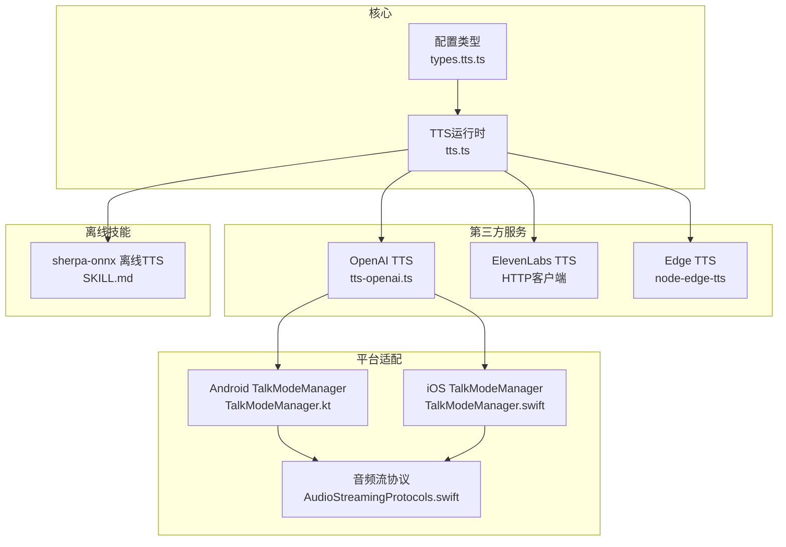
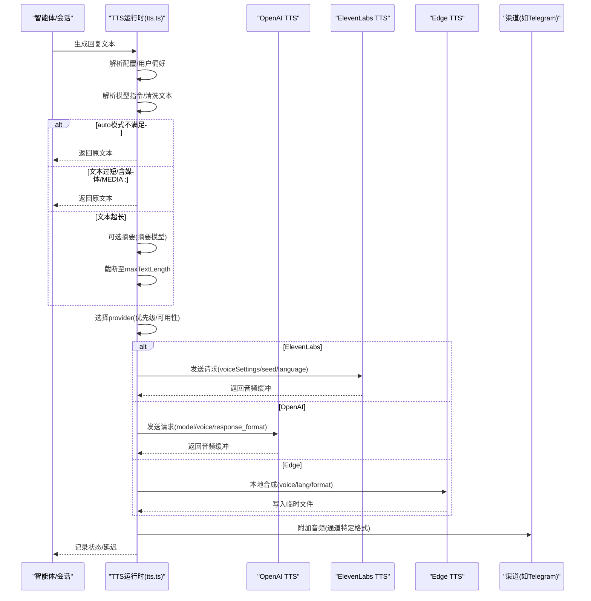
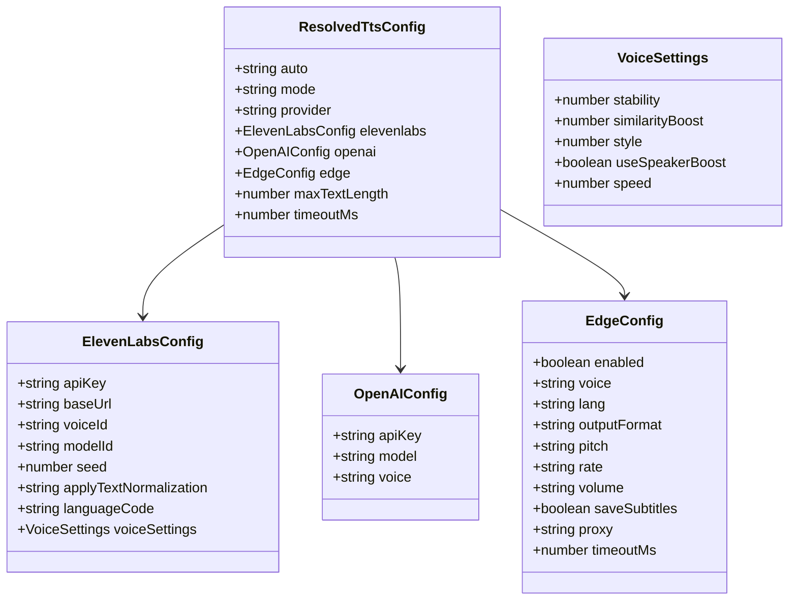
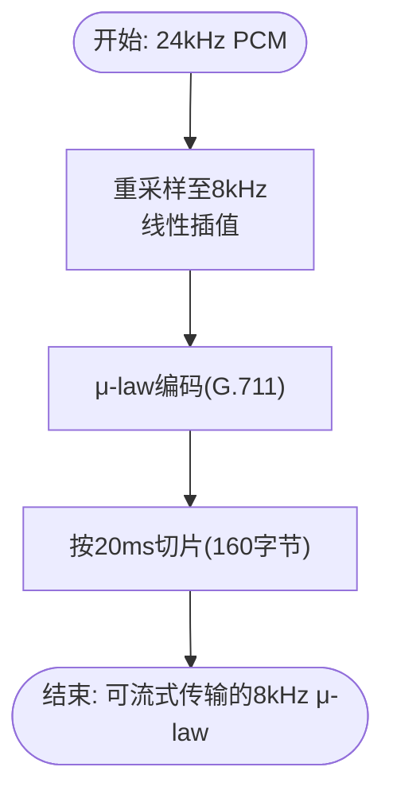
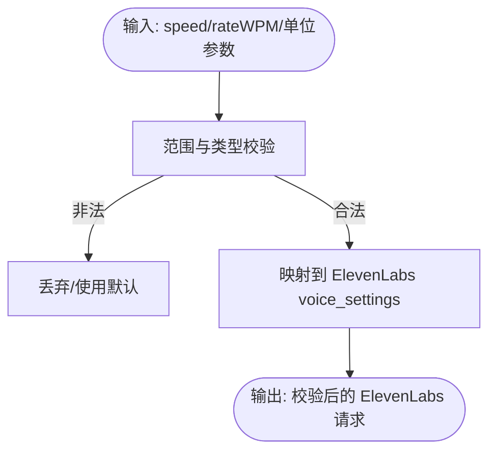
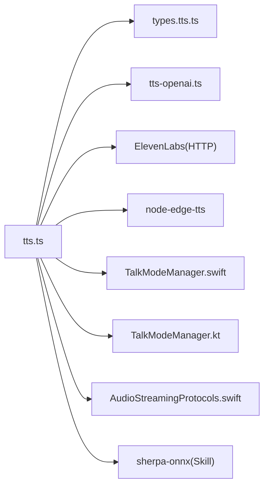

# 文本转语音工具

<cite>
**本文档引用的文件**
- [tts.ts](file://src/tts/tts.ts)
- [types.tts.ts](file://src/config/types.tts.ts)
- [tts.md](file://docs/tts.md)
- [tts.md](file://docs/zh-CN/tts.md)
- [tts-openai.ts](file://extensions/voice-call/src/providers/tts-openai.ts)
- [telephony-audio.ts](file://extensions/voice-call/src/telephony-audio.ts)
- [SKILL.md](file://skills/sherpa-onnx-tts/SKILL.md)
- [AudioStreamingProtocols.swift](file://apps/shared/OpenClawKit/Sources/OpenClawKit/AudioStreamingProtocols.swift)
- [TalkModeManager.swift](file://apps/ios/Sources/Voice/TalkModeManager.swift)
- [TalkModeManager.kt](file://apps/android/app/src/main/java/ai/openclaw/android/voice/TalkModeManager.kt)
</cite>

## 目录

1. [简介](#简介)
2. [项目结构](#项目结构)
3. [核心组件](#核心组件)
4. [架构总览](#架构总览)
5. [详细组件分析](#详细组件分析)
6. [依赖关系分析](#依赖关系分析)
7. [性能考虑](#性能考虑)
8. [故障排除指南](#故障排除指南)
9. [结论](#结论)
10. [附录](#附录)

## 简介

本文件为 OpenClaw 文本转语音（TTS）工具的技术文档，系统阐述语音合成技术、音色选择与语速调节、多语言与方言支持、音频质量与编码控制、文本预处理与情感表达、参数调优与个性化定制、播放控制与实时合成、离线缓存与导出、以及质量评估等完整能力。文档基于仓库中的 TTS 实现与相关技能进行整理，帮助开发者与用户理解并正确使用该能力。

## 项目结构

OpenClaw 的 TTS 能力由核心运行时、配置类型定义、平台适配层、第三方服务集成与本地离线技能共同组成：

- 核心运行时与逻辑：位于 src/tts/tts.ts，负责配置解析、文本预处理、摘要策略、多提供商调度、输出格式选择与临时文件管理。
- 配置类型定义：位于 src/config/types.tts.ts，统一描述 TTS 配置项与可选字段。
- 文档说明：位于 docs/tts.md 与 docs/zh-CN/tts.md，提供配置示例、行为说明与限制。
- 第三方服务集成：
  - OpenAI TTS：位于 extensions/voice-call/src/providers/tts-openai.ts，支持实时合成、指令风格控制与 Telephony 专用编码转换。
  - ElevenLabs TTS：在核心运行时中通过 HTTP 客户端调用，支持多种音色、语速、稳定性等参数。
  - Edge TTS：通过 node-edge-tts 库调用微软在线神经 TTS，无需 API Key。
- 本地离线技能：skills/sherpa-onnx-tts/SKILL.md 提供本地 sherpa-onnx 离线 TTS 能力。
- 平台播放协议与验证：apps/shared/OpenClawKit/Sources/OpenClawKit/AudioStreamingProtocols.swift 定义流式播放协议；iOS/Android 中 TalkModeManager 对 ElevenLabs 参数进行校验与转换。

**图表来源**

- [tts.ts](file://src/tts/tts.ts#L1-L1584)
- [types.tts.ts](file://src/config/types.tts.ts#L1-L83)
- [tts-openai.ts](file://extensions/voice-call/src/providers/tts-openai.ts#L1-L260)
- [AudioStreamingProtocols.swift](file://apps/shared/OpenClawKit/Sources/OpenClawKit/AudioStreamingProtocols.swift#L1-L16)
- [TalkModeManager.swift](file://apps/ios/Sources/Voice/TalkModeManager.swift#L995-L1669)
- [TalkModeManager.kt](file://apps/android/app/src/main/java/ai/openclaw/android/voice/TalkModeManager.kt#L994-L1079)
- [SKILL.md](file://skills/sherpa-onnx-tts/SKILL.md#L1-L104)

**章节来源**

- [tts.ts](file://src/tts/tts.ts#L1-L1584)
- [types.tts.ts](file://src/config/types.tts.ts#L1-L83)
- [tts.md](file://docs/tts.md#L1-L397)
- [tts.md](file://docs/zh-CN/tts.md#L194-L226)

## 核心组件

- 配置解析与策略
  - 解析 messages.tts 配置，支持 auto 模式（off/always/inbound/tagged）、provider 优先级、摘要模型、最大文本长度、超时、用户偏好路径等。
  - 用户偏好支持按会话覆盖与本地 JSON 存储，提供启用/禁用、提供者切换、长度限制与摘要开关。
- 文本预处理与摘要
  - 移除 Markdown 以避免 TTS 误读；根据 maxLength 与摘要开关决定是否对长文本进行摘要；摘要模型可自定义。
- 多提供商调度
  - 自动选择 provider（OpenAI/ElevenLabs/Edge），支持模型指令覆盖（如 provider、voice、model、速度、稳定性等）。
- 输出格式与通道适配
  - Telegram 使用 Opus（48kHz/64kbps）以获得圆润语音气泡体验；其他渠道默认 MP3（44.1kHz/128kbps）。
  - Telephony 场景使用固定 PCM/PCM_22050 或 PCM（24kHz）格式，配合后续编码转换。
- 临时文件与清理
  - 生成的音频保存在临时目录，定时清理，避免磁盘占用。

**章节来源**

- [tts.ts](file://src/tts/tts.ts#L249-L304)
- [tts.ts](file://src/tts/tts.ts#L402-L475)
- [tts.ts](file://src/tts/tts.ts#L1162-L1331)
- [tts.ts](file://src/tts/tts.ts#L1333-L1425)
- [tts.ts](file://src/tts/tts.ts#L1427-L1570)

## 架构总览

下图展示从回复生成到最终音频输出的关键流程，包括自动触发条件、摘要策略、提供商选择与输出格式适配。

**图表来源**

- [tts.ts](file://src/tts/tts.ts#L1427-L1570)
- [tts.ts](file://src/tts/tts.ts#L1162-L1331)
- [tts.ts](file://src/tts/tts.ts#L1001-L1122)

**章节来源**

- [tts.ts](file://src/tts/tts.ts#L1427-L1570)
- [tts.md](file://docs/tts.md#L325-L351)

## 详细组件分析

### 组件A：TTS 运行时与配置

- 功能要点
  - 配置解析：支持 ElevenLabs/OpenAI/Edge 三类提供商，提供默认值与环境变量回退。
  - 用户偏好：支持 per-session 切换 auto 模式、provider、长度限制与摘要开关。
  - 文本指令：支持 [[tts:...]] 与 [[tts:text]]...[ [/tts:text] ] 控制音色、模型、语速、稳定性、语言等。
  - 摘要策略：当文本超过 maxLength 且摘要开启时，使用 summaryModel 执行摘要，再截断至 maxTextLength。
  - 输出格式：Telegram 强制 Opus，其他渠道默认 MP3；Edge 支持多种格式并自动回退。
- 关键数据结构
  - ResolvedTtsConfig：聚合 ElevenLabs/OpenAI/Edge 配置与默认值。
  - TtsDirectiveOverrides：模型指令覆盖集合。
  - TtsResult/TtsTelephonyResult：结果封装，包含成功标志、延迟、提供商、输出格式/采样率等。

**图表来源**

- [types.tts.ts](file://src/config/types.tts.ts#L26-L82)
- [tts.ts](file://src/tts/tts.ts#L85-L129)

**章节来源**

- [types.tts.ts](file://src/config/types.tts.ts#L1-L83)
- [tts.ts](file://src/tts/tts.ts#L249-L304)
- [tts.ts](file://src/tts/tts.ts#L594-L821)

### 组件B：OpenAI TTS 集成与 Telephony 编码

- 功能要点
  - 支持 gpt-4o-mini-tts（推荐用于智能实时应用，支持 instructions）、tts-1、tts-1-hd。
  - 语音选择：内置 13 种语音，其中 marin 与 cedar 质量最佳；tts-1/tts-1-hd 支持子集。
  - 指令风格控制：仅在 gpt-4o-mini-tts 模型上生效，可用于情绪与口音控制。
  - Telephony 编码：将 24kHz PCM 重采样至 8kHz，并转换为 mu-law（G.711）以适配传统电话系统。
- 关键算法
  - 线性插值重采样：从 24kHz 到 8kHz。
  - G.711 μ-law 编码：标准电话编码格式。
  - 20ms 帧切片：便于流式传输。

**图表来源**

- [tts-openai.ts](file://extensions/voice-call/src/providers/tts-openai.ts#L149-L259)
- [telephony-audio.ts](file://extensions/voice-call/src/telephony-audio.ts#L10-L68)

**章节来源**

- [tts-openai.ts](file://extensions/voice-call/src/providers/tts-openai.ts#L1-L260)
- [telephony-audio.ts](file://extensions/voice-call/src/telephony-audio.ts#L1-L90)

### 组件C：ElevenLabs TTS 参数校验与平台适配

- 功能要点
  - 参数校验：stability/similarityBoost/style 在 [0,1] 区间，speed 在 [0.5,2.0]，seed 在 [0, 4294967295]。
  - 语言代码：2 字母 ISO 639-1（如 en/de/fr）。
  - 速度映射：iOS/Android 中 TalkModeManager 支持 speed 与 WPM（字每分钟）互转与范围校验。
  - 输出格式：支持多种 PCM 采样率（16k/22k/24k/44.1k）与 MP3/Ogg/WebM/Opus 等。
- 平台差异
  - iOS/Android 对 ElevenLabs 参数进行严格校验与默认值处理，确保跨平台一致性。

**图表来源**

- [TalkModeManager.swift](file://apps/ios/Sources/Voice/TalkModeManager.swift#L995-L1013)
- [TalkModeManager.kt](file://apps/android/app/src/main/java/ai/openclaw/android/voice/TalkModeManager.kt#L1012-L1079)

**章节来源**

- [tts.ts](file://src/tts/tts.ts#L530-L576)
- [TalkModeManager.swift](file://apps/ios/Sources/Voice/TalkModeManager.swift#L995-L1013)
- [TalkModeManager.kt](file://apps/android/app/src/main/java/ai/openclaw/android/voice/TalkModeManager.kt#L1012-L1079)

### 组件D：Edge TTS 与通道兼容性

- 功能要点
  - 无需 API Key，直接调用微软在线神经 TTS。
  - 支持多种输出格式（WebM/Ogg/Opus/WAV/MP3），自动推断扩展名并回退。
  - Telegram 语音气泡要求 Opus（48kHz/64kbps），Edge 默认 audio-24khz-48kbitrate-mono-mp3，必要时回退 MP3。
- 兼容性
  - 通道适配：Telegram 识别 voiceCompatible 标志，自动发送圆形语音气泡。

**章节来源**

- [tts.ts](file://src/tts/tts.ts#L1124-L1160)
- [tts.md](file://docs/tts.md#L309-L322)

### 组件E：离线 TTS 技能（sherpa-onnx）

- 功能要点
  - 本地离线合成，无需网络，适合隐私与低延迟场景。
  - 需要下载 runtime 与模型，配置环境变量后即可使用。
  - 支持多平台（macOS/Linux/Windows），可更换不同模型以获得不同音色。
- 使用建议
  - 在需要稳定离线能力的环境中优先使用；对实时性要求高时结合云端服务。

**章节来源**

- [SKILL.md](file://skills/sherpa-onnx-tts/SKILL.md#L1-L104)

## 依赖关系分析

- 组件耦合
  - TTS 运行时与配置类型强耦合，保证配置项的类型安全与默认值一致。
  - 与第三方服务通过 HTTP/库调用解耦，便于替换与扩展。
  - 平台适配通过 TalkModeManager 与协议接口隔离，保持核心逻辑稳定。
- 外部依赖
  - ElevenLabs：HTTP API，需 API Key。
  - OpenAI：HTTP API，需 API Key。
  - Edge TTS：node-edge-tts 库，无需 API Key。
  - 本地离线：sherpa-onnx CLI，需 runtime 与模型文件。

**图表来源**

- [tts.ts](file://src/tts/tts.ts#L1-L1584)
- [types.tts.ts](file://src/config/types.tts.ts#L1-L83)
- [tts-openai.ts](file://extensions/voice-call/src/providers/tts-openai.ts#L1-L260)
- [AudioStreamingProtocols.swift](file://apps/shared/OpenClawKit/Sources/OpenClawKit/AudioStreamingProtocols.swift#L1-L16)
- [TalkModeManager.swift](file://apps/ios/Sources/Voice/TalkModeManager.swift#L995-L1669)
- [TalkModeManager.kt](file://apps/android/app/src/main/java/ai/openclaw/android/voice/TalkModeManager.kt#L994-L1079)
- [SKILL.md](file://skills/sherpa-onnx-tts/SKILL.md#L1-L104)

**章节来源**

- [tts.ts](file://src/tts/tts.ts#L1-L1584)

## 性能考虑

- 合理设置 maxTextLength 与摘要阈值，避免长文本导致的超时与带宽浪费。
- 选择合适 provider：
  - OpenAI：tts-1 低延迟，tts-1-hd 高质量；gpt-4o-mini-tts 支持指令风格控制。
  - ElevenLabs：多音色与可调参数，适合高质量与个性化。
  - Edge TTS：无需 API Key，但无 SLA 与容量保障，适合轻量场景。
- 输出格式选择：
  - Telegram：Opus（48kHz/64kbps）获得最佳语音气泡体验。
  - 其他渠道：MP3（44.1kHz/128kbps）平衡清晰度与体积。
- 临时文件管理：运行时自动清理临时目录，避免磁盘膨胀。

[本节为通用指导，无需具体文件分析]

## 故障排除指南

- 常见错误与定位
  - API Key 缺失：检查 ELEVENLABS_API_KEY/XI_API_KEY/OPENAI_API_KEY 是否正确设置。
  - 摘要失败：确认 summaryModel 可用且有对应 API Key；查看超时与长度限制。
  - Edge 输出格式失败：Edge 服务不支持某些格式，运行时会自动回退 MP3。
  - 通道不兼容：Telegram 需要 Opus voice note，若非 Opus 将无法显示为圆润语音气泡。
- 调试建议
  - 开启 verbose 日志，观察 lastTtsAttempt 与 provider 选择链路。
  - 使用 /tts audio 进行一次性测试，快速验证文本与参数。
  - 检查模型指令语法与参数范围，避免被忽略或报错。

**章节来源**

- [tts.ts](file://src/tts/tts.ts#L1317-L1331)
- [tts.ts](file://src/tts/tts.ts#L1218-L1244)
- [tts.ts](file://src/tts/tts.ts#L1567-L1569)

## 结论

OpenClaw 的 TTS 工具通过统一的配置与运行时、灵活的多提供商调度、严格的参数校验与通道适配，实现了从文本到音频的高质量、可定制化输出。结合本地离线技能与 Telephony 编码转换，既能满足实时交互需求，也能兼顾隐私与稳定性。建议在生产环境中合理配置 provider 与输出格式，并利用摘要与长度限制提升整体性能与用户体验。

[本节为总结，无需具体文件分析]

## 附录

### A. 支持的语音模型、语言与方言

- OpenAI
  - 模型：gpt-4o-mini-tts（支持指令风格控制）、tts-1（低延迟）、tts-1-hd（高质量）。
  - 语音：内置 13 种语音，marin/cedar 质量最佳；tts-1/tts-1-hd 支持子集。
- ElevenLabs
  - 支持多音色与多语言，可通过 languageCode 与 applyTextNormalization 控制。
- Edge TTS
  - 无需 API Key，支持多种输出格式，自动回退。

**章节来源**

- [tts-openai.ts](file://extensions/voice-call/src/providers/tts-openai.ts#L19-L42)
- [tts.ts](file://src/tts/tts.ts#L823-L870)
- [tts.md](file://docs/tts.md#L15-L54)

### B. 音频质量控制、采样率与编码格式

- Telegram：Opus（48kHz/64kbps）。
- 其他渠道：MP3（44.1kHz/128kbps）。
- Telephony：固定 PCM/PCM_22050 或 PCM（24kHz），随后转换为 μ-law（G.711）。
- Edge：根据 outputFormat 推断扩展名，不支持时自动回退 MP3。

**章节来源**

- [tts.ts](file://src/tts/tts.ts#L62-L81)
- [tts.ts](file://src/tts/tts.ts#L1124-L1139)
- [tts.md](file://docs/tts.md#L309-L322)

### C. 文本预处理、发音纠正与情感表达

- 预处理：移除 Markdown，避免 TTS 将标题符号读作“hashtag”等。
- 发音纠正：ElevenLabs 支持 applyTextNormalization（auto/on/off）与 languageCode。
- 情感表达：OpenAI gpt-4o-mini-tts 支持 instructions 控制语调与风格。

**章节来源**

- [tts.ts](file://src/tts/tts.ts#L1525-L1528)
- [tts-openai.ts](file://extensions/voice-call/src/providers/tts-openai.ts#L37-L42)
- [tts.ts](file://src/tts/tts.ts#L1031-L1033)

### D. 语音参数调优与个性化

- ElevenLabs：stability/similarityBoost/style/speed/useSpeakerBoost/seed/languageCode。
- OpenAI：model/voice/response_format/speed。
- 模型指令：支持 provider/voice/model/voiceSettings/language/seed 等覆盖。

**章节来源**

- [tts.ts](file://src/tts/tts.ts#L536-L541)
- [tts.ts](file://src/tts/tts.ts#L594-L821)
- [tts.md](file://docs/tts.md#L235-L292)

### E. 多语言、混合语言与方言识别

- ElevenLabs：languageCode 为 2 字母 ISO 639-1；applyTextNormalization 支持 auto/on/off。
- Edge：遵循 Microsoft Speech 输出格式规范，部分格式不被 Edge 支持。
- 混合语言：建议明确指定 languageCode 与 applyTextNormalization，避免歧义。

**章节来源**

- [tts.ts](file://src/tts/tts.ts#L543-L565)
- [tts.ts](file://src/tts/tts.ts#L1031-L1033)
- [tts.md](file://docs/tts.md#L228-L233)

### F. 音频播放控制、实时合成与离线缓存

- 流式播放协议：StreamingAudioPlaying/PCMStreamingAudioPlaying 定义于 OpenClawKit。
- iOS/Android：TalkModeManager 对 ElevenLabs 参数进行校验与转换，支持流式播放。
- 离线缓存：运行时将音频写入临时目录，定时清理；Edge 合成直接落盘。

**章节来源**

- [AudioStreamingProtocols.swift](file://apps/shared/OpenClawKit/Sources/OpenClawKit/AudioStreamingProtocols.swift#L1-L16)
- [TalkModeManager.swift](file://apps/ios/Sources/Voice/TalkModeManager.swift#L995-L1013)
- [TalkModeManager.kt](file://apps/android/app/src/main/java/ai/openclaw/android/voice/TalkModeManager.kt#L1012-L1079)
- [tts.ts](file://src/tts/tts.ts#L1197-L1246)

### G. 音频导出、格式转换与质量评估

- 导出：运行时将音频写入临时文件，Telegram 语音气泡与普通 MP3 可分别生成。
- 转换：Telephony 使用重采样与 μ-law 编码；OpenAI 提供 mp3/opus/pcm 等响应格式。
- 质量评估：通过 lastTtsAttempt 记录延迟、提供商与是否摘要，辅助优化策略。

**章节来源**

- [tts.ts](file://src/tts/tts.ts#L1304-L1316)
- [tts.ts](file://src/tts/tts.ts#L1383-L1410)
- [tts.ts](file://src/tts/tts.ts#L1539-L1556)
