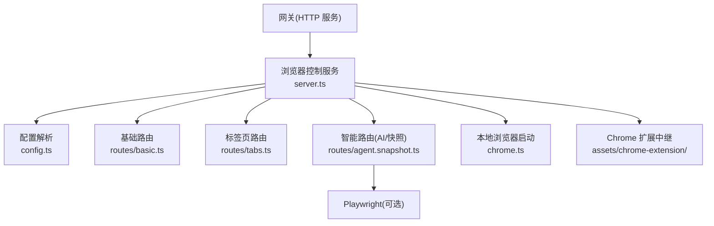
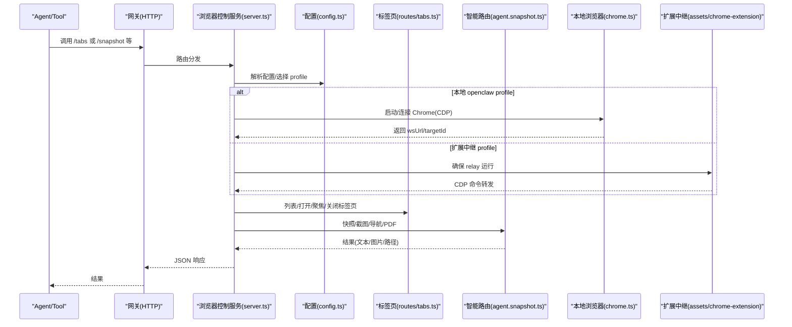
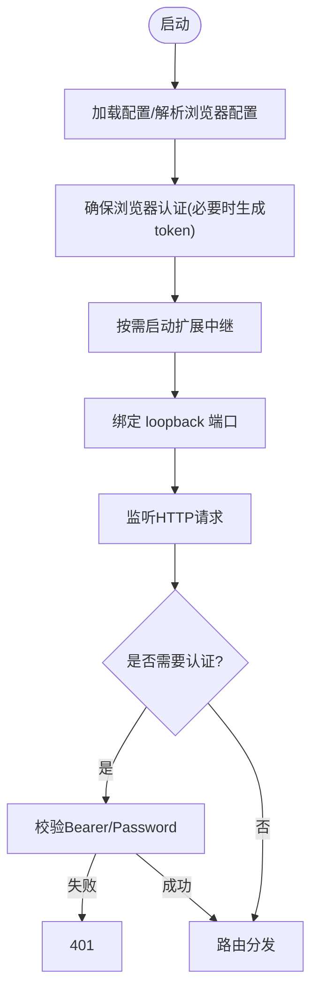
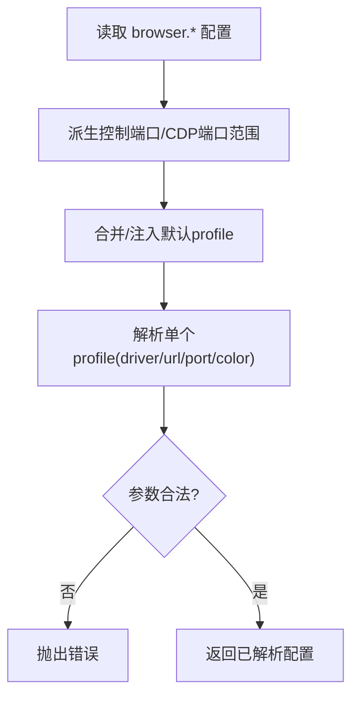
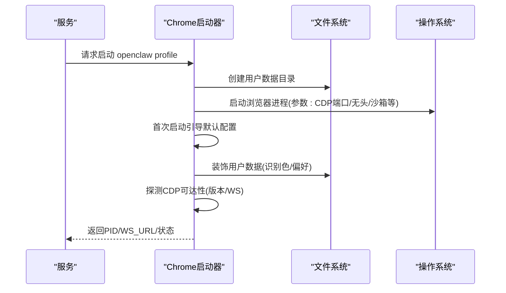
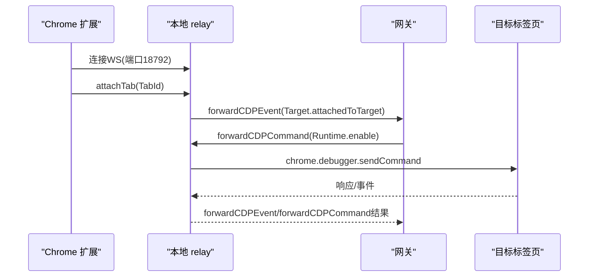
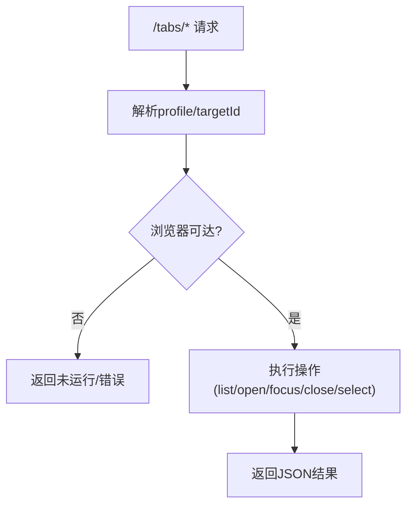
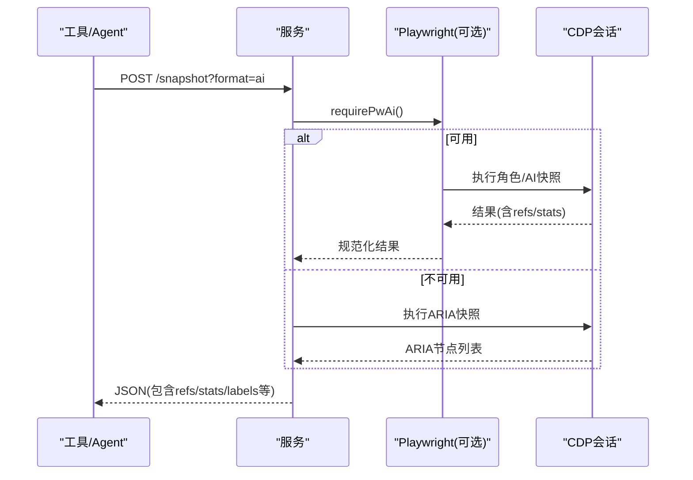
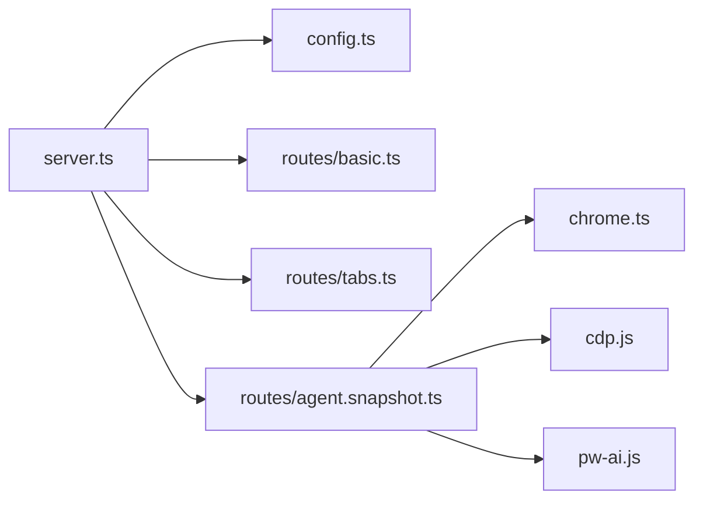

# 浏览器控制工具

<cite>
**本文档引用的文件**
- [README.md](file://README.md)
- [docs/tools/browser.md](file://docs/tools/browser.md)
- [docs/tools/chrome-extension.md](file://docs/tools/chrome-extension.md)
- [src/browser/server.ts](file://src/browser/server.ts)
- [src/browser/client.ts](file://src/browser/client.ts)
- [src/browser/chrome.ts](file://src/browser/chrome.ts)
- [src/browser/config.ts](file://src/browser/config.ts)
- [src/browser/routes/agent.snapshot.ts](file://src/browser/routes/agent.snapshot.ts)
- [src/browser/routes/basic.ts](file://src/browser/routes/basic.ts)
- [src/browser/routes/tabs.ts](file://src/browser/routes/tabs.ts)
- [assets/chrome-extension/README.md](file://assets/chrome-extension/README.md)
- [assets/chrome-extension/manifest.json](file://assets/chrome-extension/manifest.json)
- [assets/chrome-extension/background.js](file://assets/chrome-extension/background.js)
</cite>

## 目录

1. [简介](#简介)
2. [项目结构](#项目结构)
3. [核心组件](#核心组件)
4. [架构总览](#架构总览)
5. [详细组件分析](#详细组件分析)
6. [依赖关系分析](#依赖关系分析)
7. [性能考虑](#性能考虑)
8. [故障排除指南](#故障排除指南)
9. [结论](#结论)
10. [附录](#附录)

## 简介

本文件为 OpenClaw 浏览器控制工具的详细功能文档，覆盖以下主题：

- 浏览器自动化能力：网页快照（AI/ARIA）、截图生成、页面导航、控制台日志与网络请求监控、PDF 导出、文件上传下载、状态与环境设置等
- 代理机制：节点代理（node host）与沙箱代理（sandbox）的配置与使用
- 配置选项：快照格式、目标 ID、标签页管理、文件上传下载、浏览器配置文件管理、安全内容包装等
- Chrome 扩展中继：本地 relay 服务器、CDP 消息桥接、安全注意事项
- 实际使用示例：UI 自动化、网页抓取、调试诊断
- 错误处理、超时配置与性能优化建议

## 项目结构

OpenClaw 的浏览器子系统由“网关内嵌的浏览器控制服务 + 多种驱动模式（本地/远程 CDP、Chrome 扩展中继）+ Playwright 支持（可选）”构成。核心目录与文件如下：

- 控制服务与路由：src/browser/server.ts、src/browser/routes/\*
- 客户端 API 封装：src/browser/client.ts
- 浏览器启动与 CDP 连接：src/browser/chrome.ts、src/browser/cdp.js
- 配置解析与多配置文件支持：src/browser/config.ts、src/browser/profiles-service.ts
- Chrome 扩展中继：assets/chrome-extension/\*

图表来源

- [src/browser/server.ts](file://src/browser/server.ts#L78-L165)
- [src/browser/config.ts](file://src/browser/config.ts#L138-L216)
- [src/browser/routes/basic.ts](file://src/browser/routes/basic.ts#L7-L73)
- [src/browser/routes/tabs.ts](file://src/browser/routes/tabs.ts#L5-L21)
- [src/browser/routes/agent.snapshot.ts](file://src/browser/routes/agent.snapshot.ts#L25-L329)
- [src/browser/chrome.ts](file://src/browser/chrome.ts#L163-L316)
- [assets/chrome-extension/README.md](file://assets/chrome-extension/README.md#L1-L23)

章节来源

- [README.md](file://README.md#L199-L207)
- [docs/tools/browser.md](file://docs/tools/browser.md#L10-L583)

## 核心组件

- 浏览器控制服务：基于 Express 的 loopback HTTP 服务，提供状态查询、启动/停止、标签页管理、快照/截图/导航、调试与状态设置等接口
- 配置系统：解析 browser.\* 配置，支持默认 profile、多 profile、远程 CDP、扩展中继等
- 本地浏览器：通过 Chrome 可执行文件启动独立用户数据目录，绑定专用 CDP 端口
- Chrome 扩展中继：在本地运行 relay，通过 debugger API 与 CDP 桥接，使现有 Chrome 标签页可被网关控制
- Playwright 集成：当可用时，提供更丰富的快照（AI/角色）、截图（元素/全页）、PDF、等待条件等能力

章节来源

- [src/browser/server.ts](file://src/browser/server.ts#L78-L165)
- [src/browser/config.ts](file://src/browser/config.ts#L138-L216)
- [src/browser/chrome.ts](file://src/browser/chrome.ts#L163-L316)
- [src/browser/client.ts](file://src/browser/client.ts#L101-L337)

## 架构总览

浏览器控制的整体工作流如下：

图表来源

- [src/browser/server.ts](file://src/browser/server.ts#L125-L164)
- [src/browser/config.ts](file://src/browser/config.ts#L222-L257)
- [src/browser/routes/tabs.ts](file://src/browser/routes/tabs.ts#L6-L21)
- [src/browser/routes/agent.snapshot.ts](file://src/browser/routes/agent.snapshot.ts#L29-L55)
- [src/browser/chrome.ts](file://src/browser/chrome.ts#L163-L316)
- [assets/chrome-extension/background.js](file://assets/chrome-extension/background.js#L52-L103)

## 详细组件分析

### 组件A：浏览器控制服务与认证

- 功能要点
  - 在 loopback 地址监听，端口派生自网关端口
  - 可选的令牌或密码认证，支持 Bearer 与 Basic
  - 自动初始化扩展中继（若存在 extension 驱动）
  - 提供状态、启动/停止、重置、创建/删除 profile 等基础接口
- 认证流程
  - 若未配置，则自动在启动时生成网关 token 并持久化
  - 请求头支持 Authorization: Bearer 或 x-openclaw-password
- 关键实现位置
  - 服务启动与认证：[src/browser/server.ts](file://src/browser/server.ts#L78-L165)
  - 认证解析与校验：[src/browser/server.ts](file://src/browser/server.ts#L50-L76)

图表来源

- [src/browser/server.ts](file://src/browser/server.ts#L78-L165)

章节来源

- [src/browser/server.ts](file://src/browser/server.ts#L78-L165)

### 组件B：配置系统与多配置文件

- 功能要点
  - 默认启用；支持默认 profile、多 profile（openclaw、chrome、remote）
  - 自动推导控制端口与 CDP 端口范围，避免冲突
  - 支持 headless/no-sandbox/attachOnly/executablePath 等运行参数
  - 远程 CDP 支持带鉴权的 URL（查询令牌/基本认证）
- 关键实现位置
  - 配置解析与默认 profile 注入：[src/browser/config.ts](file://src/browser/config.ts#L138-L216)
  - 单个 profile 解析与 driver 类型判定：[src/browser/config.ts](file://src/browser/config.ts#L222-L257)

图表来源

- [src/browser/config.ts](file://src/browser/config.ts#L138-L216)
- [src/browser/config.ts](file://src/browser/config.ts#L222-L257)

章节来源

- [src/browser/config.ts](file://src/browser/config.ts#L138-L216)
- [src/browser/config.ts](file://src/browser/config.ts#L222-L257)

### 组件C：本地浏览器启动与 CDP 连接

- 功能要点
  - 自动检测系统浏览器（Chrome/Brave/Edge/Chromium/Canary），支持 headless/no-sandbox
  - 使用独立用户数据目录，首次启动引导默认配置，随后装饰以识别色
  - 通过 CDP /json/version 与 WebSocket 探测可达性，确保稳定连接
- 关键实现位置
  - 启动与装饰：[src/browser/chrome.ts](file://src/browser/chrome.ts#L163-L316)
  - CDP 可达性探测：[src/browser/chrome.ts](file://src/browser/chrome.ts#L70-L161)

图表来源

- [src/browser/chrome.ts](file://src/browser/chrome.ts#L163-L316)

章节来源

- [src/browser/chrome.ts](file://src/browser/chrome.ts#L163-L316)

### 组件D：Chrome 扩展中继（使用现有 Chrome）

- 功能要点
  - 本地 relay 服务器（默认 127.0.0.1:18792）与扩展配合
  - 通过 chrome.debugger API 附加到标签页，转发 CDP 命令/事件
  - 支持 Target.createTarget/Target.closeTarget/Target.activateTarget 等
- 关键实现位置
  - 扩展安装与使用说明：[assets/chrome-extension/README.md](file://assets/chrome-extension/README.md#L1-L23)
  - Manifest 权限与后台脚本：[assets/chrome-extension/manifest.json](file://assets/chrome-extension/manifest.json#L1-L26)
  - 中继逻辑与命令转发：[assets/chrome-extension/background.js](file://assets/chrome-extension/background.js#L52-L103)

图表来源

- [assets/chrome-extension/background.js](file://assets/chrome-extension/background.js#L52-L103)
- [assets/chrome-extension/background.js](file://assets/chrome-extension/background.js#L320-L396)

章节来源

- [assets/chrome-extension/README.md](file://assets/chrome-extension/README.md#L1-L23)
- [assets/chrome-extension/manifest.json](file://assets/chrome-extension/manifest.json#L1-L26)
- [assets/chrome-extension/background.js](file://assets/chrome-extension/background.js#L52-L103)

### 组件E：标签页管理与操作

- 功能要点
  - 列表、打开、聚焦、关闭标签页
  - 通过 /tabs/action 统一入口，支持 list/new/close/select
  - 对扩展中继与本地 CDP 的差异进行适配
- 关键实现位置
  - 标签页路由：[src/browser/routes/tabs.ts](file://src/browser/routes/tabs.ts#L5-L145)

图表来源

- [src/browser/routes/tabs.ts](file://src/browser/routes/tabs.ts#L6-L21)

章节来源

- [src/browser/routes/tabs.ts](file://src/browser/routes/tabs.ts#L5-L145)

### 组件F：快照、截图、导航与 PDF

- 功能要点
  - 快照：支持 ARIA（无障碍树）与 AI（含数字 ref）两种格式；可高效模式、交互式、紧凑、深度、选择器、iframe 范围等
  - 截图：支持全页/元素/指定类型（PNG/JPEG），并进行质量与尺寸归一化
  - 导航：通过 Playwright 在 CDP 上执行
  - PDF：保存到媒体存储
- 关键实现位置
  - 快照/截图/导航/PDF 路由：[src/browser/routes/agent.snapshot.ts](file://src/browser/routes/agent.snapshot.ts#L25-L329)
  - 客户端 API 封装：[src/browser/client.ts](file://src/browser/client.ts#L276-L337)

图表来源

- [src/browser/routes/agent.snapshot.ts](file://src/browser/routes/agent.snapshot.ts#L158-L329)

章节来源

- [src/browser/routes/agent.snapshot.ts](file://src/browser/routes/agent.snapshot.ts#L25-L329)
- [src/browser/client.ts](file://src/browser/client.ts#L276-L337)

### 组件G：状态与环境设置

- 功能要点
  - Cookie/Storage 读写与清空
  - 环境开关：离线、自定义请求头、HTTP 基本认证、地理、媒体、时区、语言、设备/视口
- 关键实现位置
  - 状态与环境路由：[src/browser/routes/agent.snapshot.ts](file://src/browser/routes/agent.snapshot.ts#L25-L329)
  - 客户端 API 封装：[src/browser/client.ts](file://src/browser/client.ts#L42-L88)

章节来源

- [src/browser/routes/agent.snapshot.ts](file://src/browser/routes/agent.snapshot.ts#L25-L329)
- [src/browser/client.ts](file://src/browser/client.ts#L42-L88)

## 依赖关系分析

- 组件耦合
  - server.ts 依赖 config.ts（解析配置）、routes/\*（注册路由）、chrome.ts（本地浏览器）、extension-relay（扩展中继）
  - routes/\* 依赖 server-context（上下文）、utils（参数解析）、cdp.js（CDP 操作）、pw-ai（Playwright）
- 外部依赖
  - Express（HTTP 服务）、ws（WebSocket）、Playwright（可选，用于高级快照/截图/PDF）

图表来源

- [src/browser/server.ts](file://src/browser/server.ts#L10-L12)
- [src/browser/routes/agent.snapshot.ts](file://src/browser/routes/agent.snapshot.ts#L1-L24)

章节来源

- [src/browser/server.ts](file://src/browser/server.ts#L10-L12)
- [src/browser/routes/agent.snapshot.ts](file://src/browser/routes/agent.snapshot.ts#L1-L24)

## 性能考虑

- 快照策略
  - AI 快照默认开启，但可通过 mode=efficient 降低字符上限与深度，提升吞吐
  - 仅在需要时启用 labels，避免额外截图开销
- 截图优化
  - 归一化最大边与字节限制，减少传输与存储成本
  - 元素截图优先使用 Playwright，全页截图在扩展中继或缺失 WS 时回退
- CDP 连接
  - 本地 profile 使用 loopback，延迟低；远程 CDP 需合理设置超时
- Playwright 可选
  - 缺失时仍可使用非 Playwright 能力（ARIA 快照、基础截图），但 AI 快照/角色快照/PDF 等将不可用

## 故障排除指南

- “浏览器未运行/不可达”
  - 检查 /status 是否显示 running=true；必要时调用 /start
  - 本地 profile：确认端口未被占用，浏览器可正常启动
  - 远程 CDP：检查 URL、鉴权、网络连通性与超时设置
- “扩展中继不可用”
  - 确认扩展已安装并固定；badge 显示 ON 表示已附加
  - 检查本地 relay 是否在 127.0.0.1:18792 可达
- “权限不足/401”
  - 若启用认证，确保请求携带正确的 Authorization 或 x-openclaw-password
- “Playwright 不可用”
  - 安装完整 Playwright 包（非 core），或在 Docker 中使用打包 CLI 安装
- “沙箱会话无法控制主机浏览器”
  - 非沙箱会话可直接使用 host；沙箱会话需允许 host 控制或显式 target=host

章节来源

- [src/browser/server.ts](file://src/browser/server.ts#L50-L76)
- [src/browser/routes/basic.ts](file://src/browser/routes/basic.ts#L19-L73)
- [assets/chrome-extension/README.md](file://assets/chrome-extension/README.md#L1-L23)
- [docs/tools/browser.md](file://docs/tools/browser.md#L559-L583)

## 结论

OpenClaw 的浏览器控制工具提供了统一的 loopback HTTP 接口，兼容本地 openclaw profile、远程 CDP 与 Chrome 扩展中继三种驱动方式，并在 Playwright 可用时提供强大的 AI/角色快照与截图能力。通过合理的配置与安全策略（认证、私有网络、鉴权令牌），可在本地或远程节点上安全地执行 UI 自动化、网页抓取与调试诊断任务。

## 附录

### 实际使用示例

- UI 自动化
  - 打开目标页面 -> 快照（AI/角色）-> 选择 ref -> 点击/输入/拖拽 -> 截图/PDF 存档
- 网页抓取
  - 设置 headers/credentials/geo/media/locale/timezone/device -> 导航 -> 快照/截图 -> 下载文件
- 调试诊断
  - 打开控制台/请求/错误 -> 开启 trace -> 复现问题 -> 导出 trace/PDF/截图

章节来源

- [docs/tools/browser.md](file://docs/tools/browser.md#L362-L583)

### API 一览（节选）

- 基础
  - GET /、POST /start、POST /stop、POST /reset-profile
  - GET /profiles、POST /profiles/create、DELETE /profiles/:name
- 标签页
  - GET /tabs、POST /tabs/open、POST /tabs/focus、DELETE /tabs/:targetId、POST /tabs/action
- 快照/截图/导航/PDF
  - GET /snapshot、POST /screenshot、POST /navigate、POST /pdf
- 调试与状态
  - GET /console、GET /errors、GET /requests、POST /trace/start、POST /trace/stop
  - GET /cookies、POST /cookies/set、POST /cookies/clear
  - GET /storage/:kind、POST /storage/:kind/set、POST /storage/:kind/clear
  - POST /set/offline、POST /set/headers、POST /set/credentials、POST /set/geolocation、POST /set/media、POST /set/timezone、POST /set/locale、POST /set/device

章节来源

- [docs/tools/browser.md](file://docs/tools/browser.md#L300-L334)
- [src/browser/client.ts](file://src/browser/client.ts#L101-L337)
