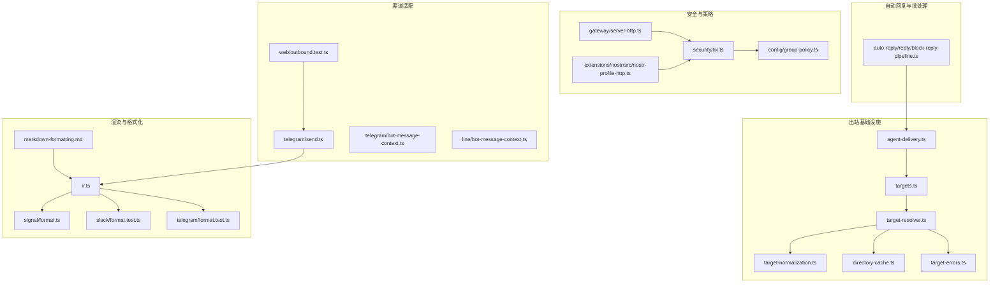
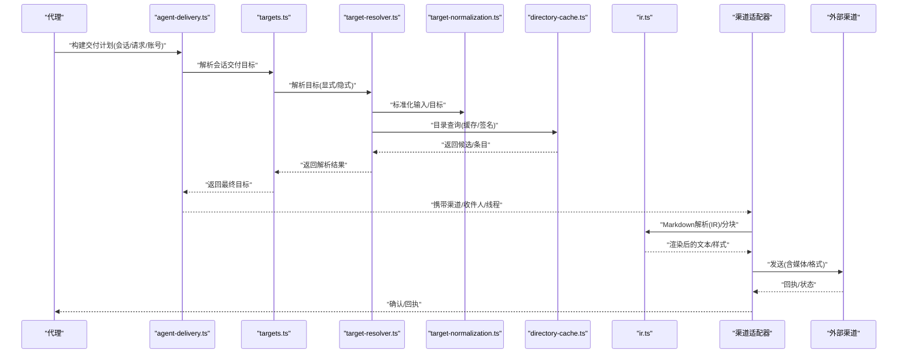
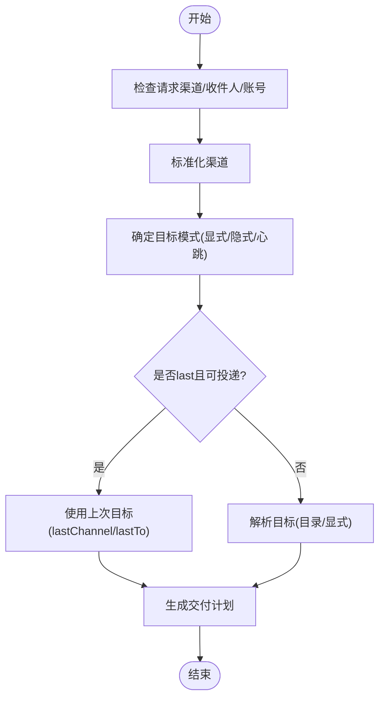
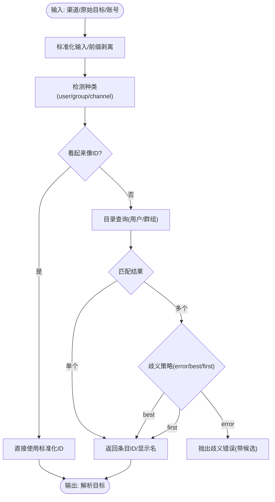
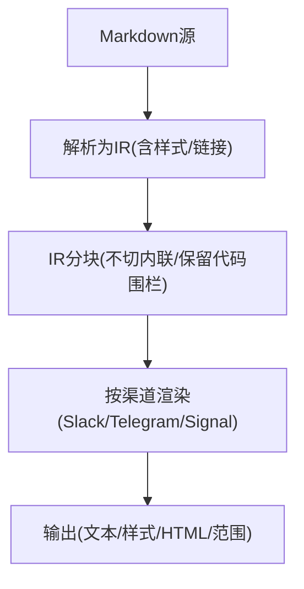
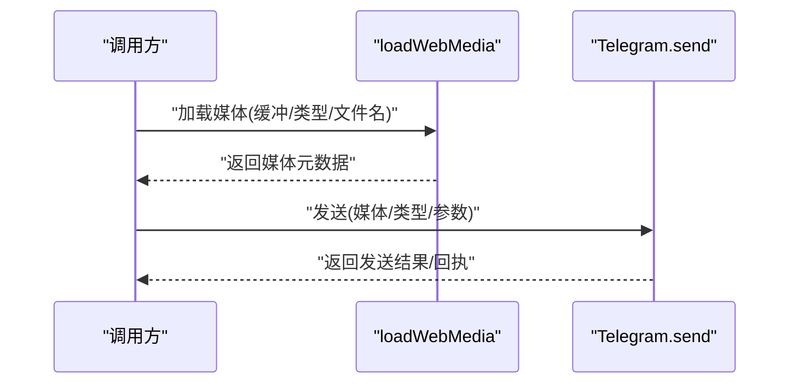
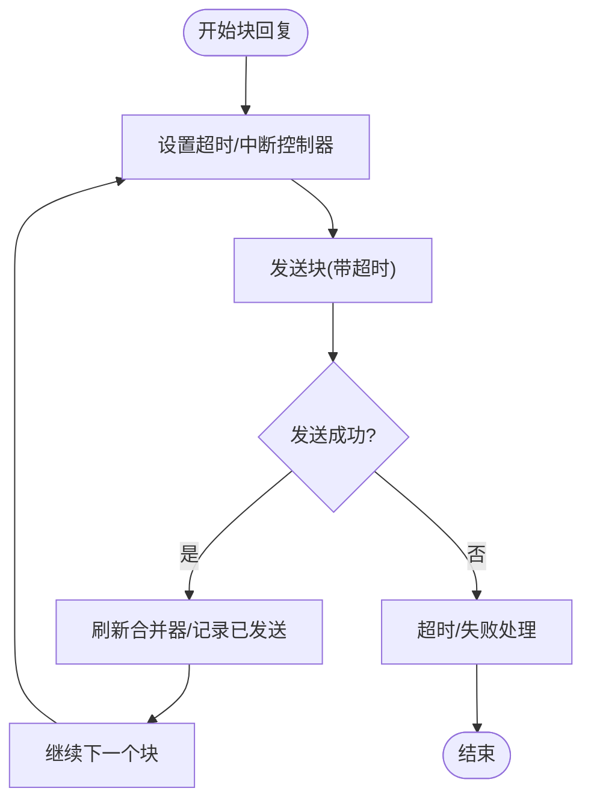
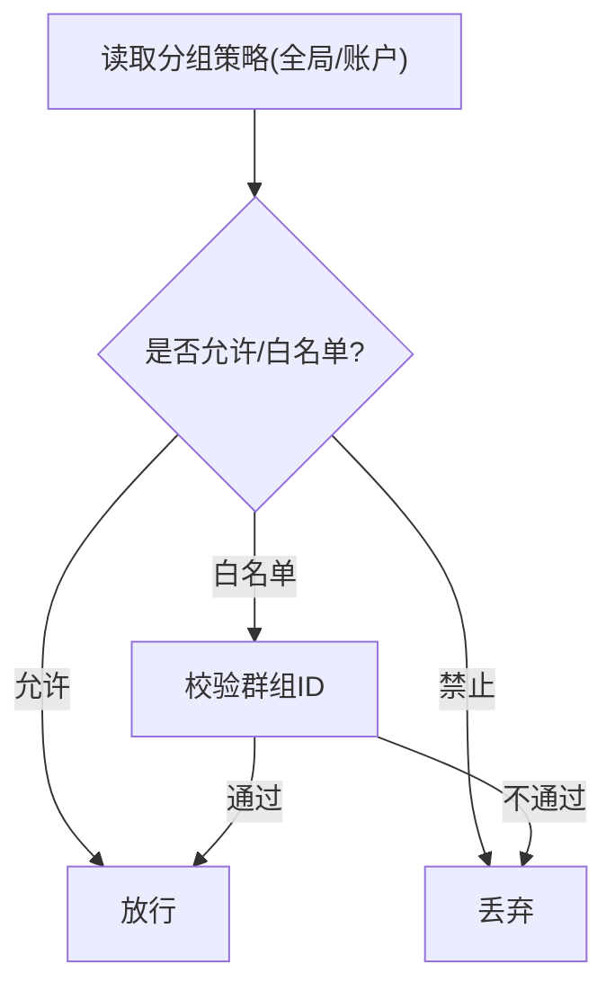
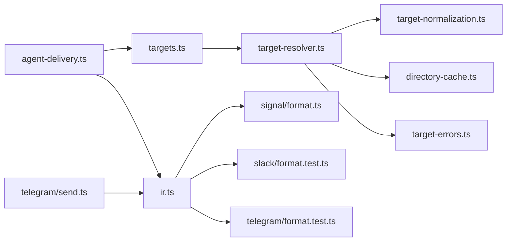

# 消息发送工具

<cite>
**本文档引用的文件**
- [agent-delivery.ts](file://src/infra/outbound/agent-delivery.ts)
- [targets.ts](file://src/infra/outbound/targets.ts)
- [target-resolver.ts](file://src/infra/outbound/target-resolver.ts)
- [target-normalization.ts](file://src/infra/outbound/target-normalization.ts)
- [directory-cache.ts](file://src/infra/outbound/directory-cache.ts)
- [target-errors.ts](file://src/infra/outbound/target-errors.ts)
- [markdown-formatting.md](file://docs/concepts/markdown-formatting.md)
- [ir.ts](file://src/markdown/ir.ts)
- [signal/format.ts](file://src/signal/format.ts)
- [slack/format.test.ts](file://src/slack/format.test.ts)
- [telegram/format.test.ts](file://src/telegram/format.test.ts)
- [server-http.ts](file://src/gateway/server-http.ts)
- [nostr-profile-http.ts](file://extensions/nostr/src/nostr-profile-http.ts)
- [fix.ts](file://src/security/fix.ts)
- [group-policy.ts](file://src/config/group-policy.ts)
- [conversation-label.ts](file://src/channels/conversation-label.ts)
- [block-reply-pipeline.ts](file://src/auto-reply/reply/block-reply-pipeline.ts)
- [outbound.test.ts](file://src/web/outbound.test.ts)
- [bot-message-context.ts](file://src/telegram/bot-message-context.ts)
- [line/bot-message-context.ts](file://src/line/bot-message-context.ts)
- [send.ts](file://src/telegram/send.ts)
- [configuration.md](file://docs/zh-CN/gateway/configuration.md)
- [masking.go](file://scripts/docs-i18n/masking.go)
</cite>

## 目录

1. [简介](#简介)
2. [项目结构](#项目结构)
3. [核心组件](#核心组件)
4. [架构总览](#架构总览)
5. [详细组件分析](#详细组件分析)
6. [依赖关系分析](#依赖关系分析)
7. [性能考量](#性能考量)
8. [故障排查指南](#故障排查指南)
9. [结论](#结论)
10. [附录](#附录)

## 简介

本文件面向OpenClaw消息发送工具，系统性阐述消息发送机制、渠道适配与目标路由功能，覆盖以下能力：

- 支持的消息类型：文本、图片、视频、文件与富媒体内容
- 消息格式化、Markdown渲染与渠道特定格式转换
- 批量发送、延迟投递与优先级处理
- 消息确认、回执跟踪与送达状态查询
- 跨渠道消息同步、群组管理与话题线程处理
- 模板、变量替换与个性化内容生成
- 安全验证、速率限制与错误处理策略

## 项目结构

消息发送相关代码主要分布在以下模块：

- 出站基础设施：目标解析、目录缓存、目标规范化与错误处理
- 渲染与格式化：Markdown中间表示(IR)与多渠道渲染器
- 渠道适配：Telegram、Signal、Slack等通道的发送与格式化
- 安全与策略：速率限制、分组策略与安全修复
- 自动回复与批处理：块回复流水线与超时控制

**图表来源**

- [agent-delivery.ts](file://src/infra/outbound/agent-delivery.ts#L1-L144)
- [targets.ts](file://src/infra/outbound/targets.ts#L39-L349)
- [target-resolver.ts](file://src/infra/outbound/target-resolver.ts#L1-L498)
- [target-normalization.ts](file://src/infra/outbound/target-normalization.ts#L1-L34)
- [directory-cache.ts](file://src/infra/outbound/directory-cache.ts#L1-L68)
- [target-errors.ts](file://src/infra/outbound/target-errors.ts#L1-L31)
- [markdown-formatting.md](file://docs/concepts/markdown-formatting.md#L1-L131)
- [ir.ts](file://src/markdown/ir.ts#L1-L200)
- [signal/format.ts](file://src/signal/format.ts#L1-L238)
- [slack/format.test.ts](file://src/slack/format.test.ts#L1-L38)
- [telegram/format.test.ts](file://src/telegram/format.test.ts#L1-L43)
- [telegram/send.ts](file://src/telegram/send.ts#L364-L396)
- [telegram/bot-message-context.ts](file://src/telegram/bot-message-context.ts#L356-L383)
- [line/bot-message-context.ts](file://src/line/bot-message-context.ts#L124-L177)
- [web/outbound.test.ts](file://src/web/outbound.test.ts#L90-L134)
- [security/fix.ts](file://src/security/fix.ts#L187-L230)
- [gateway/server-http.ts](file://src/gateway/server-http.ts#L152-L181)
- [extensions/nostr/src/nostr-profile-http.ts](file://extensions/nostr/src/nostr-profile-http.ts#L35-L69)
- [config/group-policy.ts](file://src/config/group-policy.ts#L108-L169)
- [auto-reply/reply/block-reply-pipeline.ts](file://src/auto-reply/reply/block-reply-pipeline.ts#L109-L161)

**章节来源**

- [agent-delivery.ts](file://src/infra/outbound/agent-delivery.ts#L1-L144)
- [targets.ts](file://src/infra/outbound/targets.ts#L39-L349)
- [target-resolver.ts](file://src/infra/outbound/target-resolver.ts#L1-L498)
- [markdown-formatting.md](file://docs/concepts/markdown-formatting.md#L1-L131)

## 核心组件

- 出站交付计划与目标解析
  - 解析代理交付计划，确定渠道、收件人、账号与线程ID，并支持显式/隐式目标模式
  - 将会话上下文映射为可交付的目标，必要时回退到“上一次”目标
- 目标解析器
  - 统一的通道目标解析流程：输入标准化、种类检测、目录查询、歧义处理与显示名格式化
  - 目录缓存与签名校验，避免重复请求与配置变更导致的陈旧缓存
- Markdown中间表示与渲染
  - 通过共享IR解析Markdown，再按渠道渲染，确保跨渠道一致性与安全分块
  - 支持表格模式、Spoiler标记、链接策略与块级代码保留
- 渠道适配与媒体处理
  - Telegram发送器支持媒体加载、类型推断、GIF/视频备注与文件名推断
  - Web端媒体映射测试覆盖图片、视频与文档
- 安全与策略
  - 分组策略允许/禁止/白名单控制，安全修复脚本统一策略翻转
  - 多通道速率限制与认证失败节流

**章节来源**

- [agent-delivery.ts](file://src/infra/outbound/agent-delivery.ts#L20-L102)
- [targets.ts](file://src/infra/outbound/targets.ts#L41-L173)
- [target-resolver.ts](file://src/infra/outbound/target-resolver.ts#L32-L459)
- [directory-cache.ts](file://src/infra/outbound/directory-cache.ts#L22-L66)
- [markdown-formatting.md](file://docs/concepts/markdown-formatting.md#L25-L98)
- [ir.ts](file://src/markdown/ir.ts#L48-L99)
- [telegram/send.ts](file://src/telegram/send.ts#L385-L396)
- [web/outbound.test.ts](file://src/web/outbound.test.ts#L90-L134)
- [config/group-policy.ts](file://src/config/group-policy.ts#L146-L169)
- [security/fix.ts](file://src/security/fix.ts#L187-L230)

## 架构总览

消息从“代理交付计划”开始，经过“目标解析与规范化”，进入“Markdown渲染与分块”，最终由“渠道适配器”发送。

**图表来源**

- [agent-delivery.ts](file://src/infra/outbound/agent-delivery.ts#L29-L102)
- [targets.ts](file://src/infra/outbound/targets.ts#L53-L173)
- [target-resolver.ts](file://src/infra/outbound/target-resolver.ts#L331-L459)
- [target-normalization.ts](file://src/infra/outbound/target-normalization.ts#L4-L16)
- [directory-cache.ts](file://src/infra/outbound/directory-cache.ts#L22-L66)
- [ir.ts](file://src/markdown/ir.ts#L101-L118)

## 详细组件分析

### 出站交付与目标路由

- 交付计划
  - 输入会话、请求渠道、显式收件人/线程与账号，输出标准化的交付目标
  - 支持“last”回退到上次渠道/收件人，隐式/显式目标模式切换
- 目标解析
  - 将会话上下文与请求合并，决定是否使用上次目标
  - 对不可投递渠道直接返回空目标
- 心跳目标
  - 支持“none/last/指定渠道”三种心跳目标策略，结合上次目标与账号选择

**图表来源**

- [agent-delivery.ts](file://src/infra/outbound/agent-delivery.ts#L29-L102)
- [targets.ts](file://src/infra/outbound/targets.ts#L53-L173)

**章节来源**

- [agent-delivery.ts](file://src/infra/outbound/agent-delivery.ts#L20-L102)
- [targets.ts](file://src/infra/outbound/targets.ts#L41-L173)

### 目标解析器与目录缓存

- 输入标准化与种类检测
  - 去除前缀、大小写归一化、识别用户/群组/频道
- 目录查询与缓存
  - 缓存键包含渠道、账号、种类、来源与签名，TTL控制
  - 支持“缓存命中/实时拉取”策略，避免过期数据
- 歧义处理
  - 单一匹配直接返回；多匹配支持error/最佳/首个策略
- 显示名格式化
  - 根据插件或通用规则生成展示名，兼容Slack大小写保留

**图表来源**

- [target-resolver.ts](file://src/infra/outbound/target-resolver.ts#L331-L459)
- [directory-cache.ts](file://src/infra/outbound/directory-cache.ts#L17-L66)
- [target-normalization.ts](file://src/infra/outbound/target-normalization.ts#L4-L16)
- [target-errors.ts](file://src/infra/outbound/target-errors.ts#L9-L23)

**章节来源**

- [target-resolver.ts](file://src/infra/outbound/target-resolver.ts#L32-L459)
- [directory-cache.ts](file://src/infra/outbound/directory-cache.ts#L22-L66)
- [target-errors.ts](file://src/infra/outbound/target-errors.ts#L1-L31)

### Markdown格式化与渠道渲染

- 中间表示(IR)
  - 文本+样式跨度+链接跨度，UTF-16偏移用于Signal对齐
  - 支持表格模式、Spoiler、自动链接与块引用前缀
- 分块策略
  - 在IR层进行分块，保证内联样式不跨块；代码围栏保留换行
- 渲染器
  - Slack: mrkdwn令牌与链接格式
  - Telegram: HTML标签与转义
  - Signal: 纯文本+样式范围；链接差异化处理

**图表来源**

- [markdown-formatting.md](file://docs/concepts/markdown-formatting.md#L25-L98)
- [ir.ts](file://src/markdown/ir.ts#L101-L118)
- [signal/format.ts](file://src/signal/format.ts#L210-L238)
- [slack/format.test.ts](file://src/slack/format.test.ts#L1-L38)
- [telegram/format.test.ts](file://src/telegram/format.test.ts#L1-L43)

**章节来源**

- [markdown-formatting.md](file://docs/concepts/markdown-formatting.md#L1-L131)
- [ir.ts](file://src/markdown/ir.ts#L1-L200)
- [signal/format.ts](file://src/signal/format.ts#L1-L238)

### 渠道适配与媒体处理

- Telegram发送
  - 加载Web媒体、推断类型、识别GIF/视频备注、生成文件名
  - 支持纯文本回退与错误包装
- Web端媒体映射
  - 图片、视频、文档映射与文件名保留
- 媒体占位符与上下文
  - Telegram/Line根据媒体类型生成占位符，Line支持多图统计

**图表来源**

- [telegram/send.ts](file://src/telegram/send.ts#L385-L396)
- [web/outbound.test.ts](file://src/web/outbound.test.ts#L90-L134)
- [telegram/bot-message-context.ts](file://src/telegram/bot-message-context.ts#L356-L383)
- [line/bot-message-context.ts](file://src/line/bot-message-context.ts#L124-L177)

**章节来源**

- [telegram/send.ts](file://src/telegram/send.ts#L364-L396)
- [web/outbound.test.ts](file://src/web/outbound.test.ts#L90-L134)
- [telegram/bot-message-context.ts](file://src/telegram/bot-message-context.ts#L356-L383)
- [line/bot-message-context.ts](file://src/line/bot-message-context.ts#L124-L177)

### 批量发送、延迟投递与优先级

- 块回复流水线
  - 超时控制与中断信号，避免阻塞后续块
  - 可选合并器，按配置刷新缓冲
- 延迟与顺序
  - 超时后跳过剩余块以保持顺序一致性

**图表来源**

- [block-reply-pipeline.ts](file://src/auto-reply/reply/block-reply-pipeline.ts#L109-L161)

**章节来源**

- [block-reply-pipeline.ts](file://src/auto-reply/reply/block-reply-pipeline.ts#L109-L161)

### 消息确认、回执跟踪与送达状态

- 回执与状态
  - 渠道适配器负责发送并返回回执/状态
  - 未实现统一回执模型，需在各适配器中实现
- 建议实践
  - 在适配器层记录消息ID与状态，提供查询接口

[本节为通用建议，不直接分析具体文件]

### 跨渠道消息同步、群组管理与话题线程

- 线程与会话
  - 交付计划包含threadId，目标解析保留lastThreadId
- 群组策略
  - 支持全局/账户级别分组策略，允许/禁止/白名单
  - 安全修复脚本可将策略从open翻转为allowlist

**图表来源**

- [config/group-policy.ts](file://src/config/group-policy.ts#L146-L169)
- [security/fix.ts](file://src/security/fix.ts#L187-L230)

**章节来源**

- [targets.ts](file://src/infra/outbound/targets.ts#L41-L51)
- [config/group-policy.ts](file://src/config/group-policy.ts#L108-L169)
- [security/fix.ts](file://src/security/fix.ts#L187-L230)

### 模板、变量替换与个性化

- 模板变量
  - 支持Body、RawBody、From、To、MessageSid、SessionId、ChatType、GroupSubject等
  - 适用于工具参数模板化
- 会话标签与对话标签
  - 根据聊天类型与来源派生对话标签，避免重复ID追加

**章节来源**

- [configuration.md](file://docs/zh-CN/gateway/configuration.md#L3290-L3315)
- [conversation-label.ts](file://src/channels/conversation-label.ts#L23-L69)

### 安全验证、速率限制与错误处理

- 认证失败节流
  - 基于客户端键的窗口计数，超过阈值计算重试等待
- 速率限制
  - Nostr示例：每分钟最多5次请求，窗口滚动计数
- 错误处理
  - 目标缺失/歧义/未知目标的统一错误构造与提示
- 安全修复
  - 自动将分组策略从open翻转为allowlist，提升安全性

**章节来源**

- [server-http.ts](file://src/gateway/server-http.ts#L152-L181)
- [extensions/nostr/src/nostr-profile-http.ts](file://extensions/nostr/src/nostr-profile-http.ts#L35-L69)
- [target-errors.ts](file://src/infra/outbound/target-errors.ts#L1-L31)
- [security/fix.ts](file://src/security/fix.ts#L187-L230)

## 依赖关系分析

- 组件耦合
  - agent-delivery依赖targets与message-channel工具
  - targets依赖resolver与session上下文
  - resolver依赖插件目录、缓存与规范化
  - 渲染链路依赖IR与渠道格式化器
- 外部集成
  - 渠道适配器依赖各自SDK/HTTP API
  - 安全与策略通过配置驱动

**图表来源**

- [agent-delivery.ts](file://src/infra/outbound/agent-delivery.ts#L1-L144)
- [targets.ts](file://src/infra/outbound/targets.ts#L1-L349)
- [target-resolver.ts](file://src/infra/outbound/target-resolver.ts#L1-L498)
- [ir.ts](file://src/markdown/ir.ts#L1-L200)
- [signal/format.ts](file://src/signal/format.ts#L1-L238)
- [slack/format.test.ts](file://src/slack/format.test.ts#L1-L38)
- [telegram/format.test.ts](file://src/telegram/format.test.ts#L1-L43)
- [telegram/send.ts](file://src/telegram/send.ts#L364-L396)

**章节来源**

- [agent-delivery.ts](file://src/infra/outbound/agent-delivery.ts#L1-L144)
- [targets.ts](file://src/infra/outbound/targets.ts#L1-L349)
- [target-resolver.ts](file://src/infra/outbound/target-resolver.ts#L1-L498)
- [ir.ts](file://src/markdown/ir.ts#L1-L200)

## 性能考量

- 目录缓存
  - TTL控制与配置变更感知，减少重复目录查询
- 分块渲染
  - IR层分块避免样式跨块，降低重渲染成本
- 媒体加载
  - Web媒体按需加载与类型推断，避免不必要的转换

[本节提供通用指导，不直接分析具体文件]

## 故障排查指南

- 目标解析失败
  - 检查输入是否为空、是否为明确ID、目录是否存在匹配
  - 查看歧义错误与候选列表
- 认证失败与节流
  - 观察节流窗口与重试时间，调整请求频率
- 速率限制触发
  - 控制并发与请求间隔，遵循通道限速
- 媒体发送异常
  - 核对媒体类型、大小限制与文件名推断逻辑

**章节来源**

- [target-errors.ts](file://src/infra/outbound/target-errors.ts#L1-L31)
- [server-http.ts](file://src/gateway/server-http.ts#L152-L181)
- [extensions/nostr/src/nostr-profile-http.ts](file://extensions/nostr/src/nostr-profile-http.ts#L35-L69)
- [telegram/send.ts](file://src/telegram/send.ts#L385-L396)

## 结论

OpenClaw消息发送工具通过“交付计划—目标解析—Markdown渲染—渠道适配”的清晰流水线，实现了跨渠道的一致性与可扩展性。借助IR与目录缓存，系统在性能与正确性之间取得平衡；通过模板变量与分组策略，满足个性化与安全需求。建议在各渠道适配器中完善回执与状态查询，进一步增强可观测性与可靠性。

## 附录

- Markdown国际化掩码处理
  - 掩码内联代码、角度链接与URL，便于翻译流程

**章节来源**

- [masking.go](file://scripts/docs-i18n/masking.go#L16-L44)
