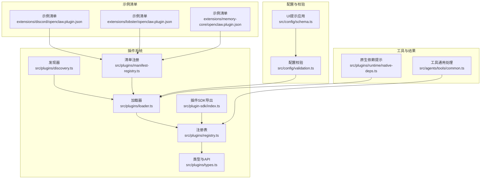
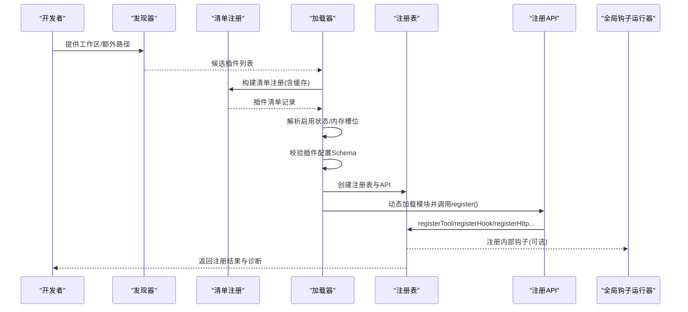
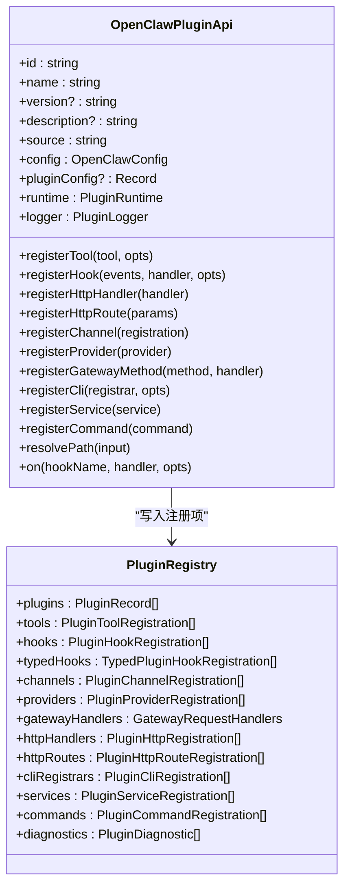
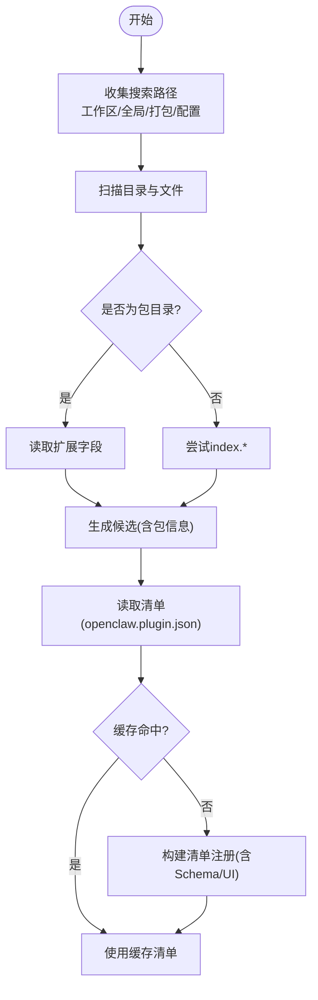
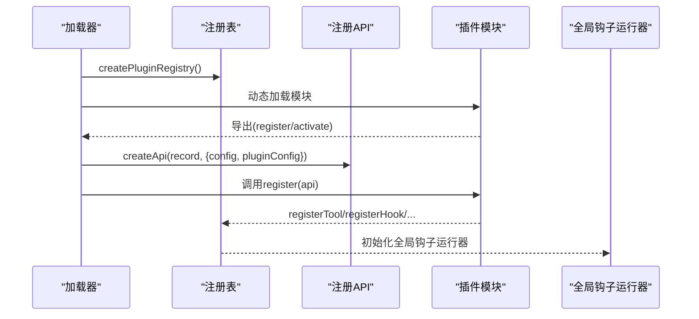
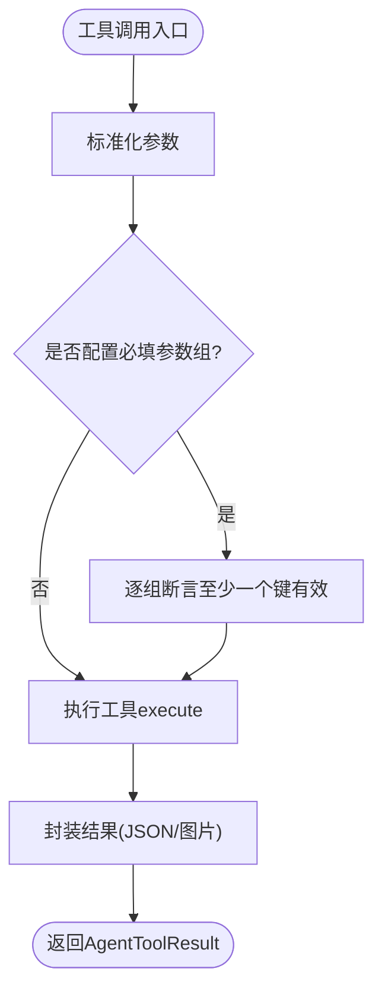
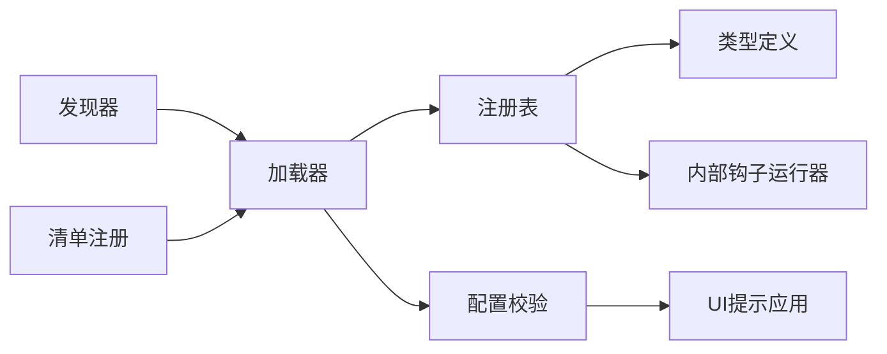

# 工具定义与注册

<cite>
**本文引用的文件**
- [src/plugins/types.ts](file://src/plugins/types.ts)
- [src/plugins/registry.ts](file://src/plugins/registry.ts)
- [src/plugins/loader.ts](file://src/plugins/loader.ts)
- [src/plugins/discovery.ts](file://src/plugins/discovery.ts)
- [src/plugins/manifest-registry.ts](file://src/plugins/manifest-registry.ts)
- [src/config/validation.ts](file://src/config/validation.ts)
- [src/config/schema.ts](file://src/config/schema.ts)
- [src/plugin-sdk/index.ts](file://src/plugin-sdk/index.ts)
- [src/agents/tools/common.ts](file://src/agents/tools/common.ts)
- [src/plugins/runtime/native-deps.ts](file://src/plugins/runtime/native-deps.ts)
- [extensions/discord/openclaw.plugin.json](file://extensions/discord/openclaw.plugin.json)
- [extensions/lobster/openclaw.plugin.json](file://extensions/lobster/openclaw.plugin.json)
- [extensions/memory-core/openclaw.plugin.json](file://extensions/memory-core/openclaw.plugin.json)
</cite>

## 目录

1. [引言](#引言)
2. [项目结构](#项目结构)
3. [核心组件](#核心组件)
4. [架构总览](#架构总览)
5. [详细组件分析](#详细组件分析)
6. [依赖关系分析](#依赖关系分析)
7. [性能考量](#性能考量)
8. [故障排查指南](#故障排查指南)
9. [结论](#结论)
10. [附录](#附录)

## 引言

本文件面向“OpenClaw 工具定义与注册”子系统，系统化阐述工具的定义规范、注册流程、接口标准、参数校验与返回值格式、元数据与权限声明、依赖管理、版本与兼容性策略、以及工具发现、动态加载与热更新能力。目标是帮助开发者快速理解并正确实现自定义工具与插件，确保在不同运行环境（本地、全局、工作区、打包）中稳定集成。

## 项目结构

围绕工具定义与注册的关键目录与文件如下：

- 插件类型与API：src/plugins/types.ts
- 注册表与注册逻辑：src/plugins/registry.ts
- 插件加载与生命周期：src/plugins/loader.ts
- 插件发现与来源解析：src/plugins/discovery.ts
- 清单缓存与注册：src/plugins/manifest-registry.ts
- 配置校验与UI提示：src/config/validation.ts、src/config/schema.ts
- 插件SDK导出：src/plugin-sdk/index.ts
- 工具通用参数与结果：src/agents/tools/common.ts
- 原生依赖提示：src/plugins/runtime/native-deps.ts
- 示例插件清单：extensions/\*/openclaw.plugin.json

图表来源

- [src/plugins/discovery.ts](file://src/plugins/discovery.ts#L301-L365)
- [src/plugins/loader.ts](file://src/plugins/loader.ts#L170-L457)
- [src/plugins/registry.ts](file://src/plugins/registry.ts#L146-L516)
- [src/plugins/types.ts](file://src/plugins/types.ts#L229-L538)
- [src/plugins/manifest-registry.ts](file://src/plugins/manifest-registry.ts#L33-L79)
- [src/config/validation.ts](file://src/config/validation.ts#L176-L207)
- [src/config/schema.ts](file://src/config/schema.ts#L91-L132)
- [src/agents/tools/common.ts](file://src/agents/tools/common.ts#L1-L244)
- [src/plugins/runtime/native-deps.ts](file://src/plugins/runtime/native-deps.ts#L1-L28)
- [extensions/discord/openclaw.plugin.json](file://extensions/discord/openclaw.plugin.json#L1-L10)
- [extensions/lobster/openclaw.plugin.json](file://extensions/lobster/openclaw.plugin.json#L1-L11)
- [extensions/memory-core/openclaw.plugin.json](file://extensions/memory-core/openclaw.plugin.json#L1-L10)

章节来源

- [src/plugins/discovery.ts](file://src/plugins/discovery.ts#L1-L365)
- [src/plugins/loader.ts](file://src/plugins/loader.ts#L1-L457)
- [src/plugins/registry.ts](file://src/plugins/registry.ts#L1-L516)
- [src/plugins/types.ts](file://src/plugins/types.ts#L1-L538)
- [src/plugins/manifest-registry.ts](file://src/plugins/manifest-registry.ts#L1-L79)
- [src/config/validation.ts](file://src/config/validation.ts#L176-L207)
- [src/config/schema.ts](file://src/config/schema.ts#L91-L132)
- [src/plugin-sdk/index.ts](file://src/plugin-sdk/index.ts#L1-L392)
- [src/agents/tools/common.ts](file://src/agents/tools/common.ts#L1-L244)
- [src/plugins/runtime/native-deps.ts](file://src/plugins/runtime/native-deps.ts#L1-L28)
- [extensions/discord/openclaw.plugin.json](file://extensions/discord/openclaw.plugin.json#L1-L10)
- [extensions/lobster/openclaw.plugin.json](file://extensions/lobster/openclaw.plugin.json#L1-L11)
- [extensions/memory-core/openclaw.plugin.json](file://extensions/memory-core/openclaw.plugin.json#L1-L10)

## 核心组件

- 插件类型与API：定义插件模块、注册API、钩子、命令、HTTP路由、服务等类型与契约，统一工具工厂、上下文与生命周期回调。
- 注册表：维护已加载插件、工具、钩子、通道、提供者、网关方法、CLI命令、HTTP处理器与路由、服务等的集中登记点，并进行诊断收集。
- 加载器：负责发现候选插件、构建清单注册、按配置启用/禁用、校验插件配置、动态加载模块、调用注册函数、建立全局钩子运行器。
- 发现器：从工作区、全局、打包目录与显式路径扫描插件入口，支持包式插件与单文件插件，生成候选集合并记录诊断。
- 清单注册：基于插件清单（openclaw.plugin.json）构建插件清单注册，支持缓存与变更检测，提供UI提示与JSON Schema。
- 配置校验与Schema：对插件配置进行Schema校验，应用UI提示，生成可序列化的配置提示映射。
- 工具通用处理：提供字符串/数字/数组参数读取、反应动作参数解析、JSON与图片结果封装等工具通用能力。
- 原生依赖提示：为原生模块缺失或需重建场景提供可执行步骤建议。

章节来源

- [src/plugins/types.ts](file://src/plugins/types.ts#L229-L538)
- [src/plugins/registry.ts](file://src/plugins/registry.ts#L124-L138)
- [src/plugins/loader.ts](file://src/plugins/loader.ts#L170-L457)
- [src/plugins/discovery.ts](file://src/plugins/discovery.ts#L301-L365)
- [src/plugins/manifest-registry.ts](file://src/plugins/manifest-registry.ts#L33-L79)
- [src/config/validation.ts](file://src/config/validation.ts#L176-L207)
- [src/config/schema.ts](file://src/config/schema.ts#L91-L132)
- [src/agents/tools/common.ts](file://src/agents/tools/common.ts#L1-L244)
- [src/plugins/runtime/native-deps.ts](file://src/plugins/runtime/native-deps.ts#L1-L28)

## 架构总览

下图展示从“发现插件”到“注册工具”的端到端流程，包括配置校验、清单缓存、加载与注册API调用、以及诊断输出。

图表来源

- [src/plugins/discovery.ts](file://src/plugins/discovery.ts#L301-L365)
- [src/plugins/manifest-registry.ts](file://src/plugins/manifest-registry.ts#L33-L79)
- [src/plugins/loader.ts](file://src/plugins/loader.ts#L170-L457)
- [src/plugins/registry.ts](file://src/plugins/registry.ts#L146-L516)

## 详细组件分析

### 组件A：插件类型与注册API

- 类型体系：定义插件模块、配置Schema、工具工厂、钩子事件、命令、HTTP路由、服务、通道、提供者等类型；统一插件API接口，暴露注册方法与上下文。
- 注册API：提供 registerTool、registerHook、registerHttpHandler、registerHttpRoute、registerChannel、registerProvider、registerGatewayMethod、registerCli、registerService、registerCommand、on 等方法，支持工具名/别名、钩子名称、HTTP路径规范化、重复检测与诊断。
- 钩子系统：内置多种钩子事件（消息收发、工具调用前后、会话开始/结束、网关启停等），支持优先级与内部开关控制。

图表来源

- [src/plugins/types.ts](file://src/plugins/types.ts#L244-L283)
- [src/plugins/registry.ts](file://src/plugins/registry.ts#L124-L138)

章节来源

- [src/plugins/types.ts](file://src/plugins/types.ts#L229-L538)
- [src/plugins/registry.ts](file://src/plugins/registry.ts#L146-L516)

### 组件B：插件发现与清单注册

- 发现策略：支持从工作区、全局、打包目录与配置显式路径发现插件；支持包式插件（通过 package.json 的扩展字段）与单文件插件（index.\*）。
- 清单注册：基于 openclaw.plugin.json 构建清单记录，支持缓存、过期时间、文件修改时间检测；提供 UI 提示与 JSON Schema 字段。
- 缓存控制：可通过环境变量控制缓存开关与缓存时长，默认开启短缓存以提升加载速度。

图表来源

- [src/plugins/discovery.ts](file://src/plugins/discovery.ts#L115-L201)
- [src/plugins/manifest-registry.ts](file://src/plugins/manifest-registry.ts#L33-L79)

章节来源

- [src/plugins/discovery.ts](file://src/plugins/discovery.ts#L1-L365)
- [src/plugins/manifest-registry.ts](file://src/plugins/manifest-registry.ts#L33-L79)

### 组件C：插件加载与注册流程

- 启用状态：根据配置与来源解析插件启用状态，支持“覆盖”与“禁用原因”记录；内存类插件受槽位策略影响。
- 配置校验：使用清单中的 JSON Schema 对插件配置进行校验，失败则记录错误并标记为“error”状态。
- 模块加载：使用 jiti 动态加载插件模块，支持 TS/JS 多扩展名与默认导出；调用 register/activate 导出。
- 注册API：创建插件API实例，传入配置与插件配置，调用插件注册函数，登记工具、钩子、HTTP、通道、提供者、服务、命令等。
- 全局钩子：初始化全局钩子运行器，按配置决定是否注册内部钩子。

图表来源

- [src/plugins/loader.ts](file://src/plugins/loader.ts#L170-L457)
- [src/plugins/registry.ts](file://src/plugins/registry.ts#L468-L514)

章节来源

- [src/plugins/loader.ts](file://src/plugins/loader.ts#L170-L457)
- [src/plugins/registry.ts](file://src/plugins/registry.ts#L146-L516)

### 组件D：工具定义规范与参数校验

- 工具接口：工具为统一的 AgentTool 类型，支持 execute 回调；注册时可直接注册对象或工厂函数。
- 参数读取：提供字符串、数字、数组、反应动作等参数读取与校验工具，支持必填、去空、整数等选项。
- 结果封装：提供 JSON 文本结果与图片结果封装，自动注入媒体占位与细节信息，并进行图片清洗。
- 必填参数组：支持按组校验，满足任一键即视为满足，增强健壮性。

图表来源

- [src/agents/tools/common.ts](file://src/agents/tools/common.ts#L33-L160)
- [src/agents/tools/common.ts](file://src/agents/tools/common.ts#L189-L244)

章节来源

- [src/agents/tools/common.ts](file://src/agents/tools/common.ts#L1-L244)

### 组件E：插件清单与元数据配置

- 清单字段：id、name、description、kind（如 memory）、channels、configSchema、configUiHints 等。
- 元数据来源：支持从包内 openclaw.plugin.json 读取；未提供时由发现器推断 id 与来源。
- UI提示：通过 configUiHints 将插件配置键映射为标签、帮助文本、敏感字段等，结合配置Schema应用到UI。

章节来源

- [extensions/discord/openclaw.plugin.json](file://extensions/discord/openclaw.plugin.json#L1-L10)
- [extensions/lobster/openclaw.plugin.json](file://extensions/lobster/openclaw.plugin.json#L1-L11)
- [extensions/memory-core/openclaw.plugin.json](file://extensions/memory-core/openclaw.plugin.json#L1-L10)
- [src/config/schema.ts](file://src/config/schema.ts#L91-L132)

### 组件F：权限声明与依赖管理

- 权限与认证：ProviderPlugin 定义了认证方式（oauth、api_key、token、device_code、custom）与凭证格式，支持刷新与格式化。
- 依赖管理：原生依赖缺失时提供安装与重建建议，支持 pnpm/npm/yarn 管理器与批准构建流程。

章节来源

- [src/plugins/types.ts](file://src/plugins/types.ts#L107-L125)
- [src/plugins/runtime/native-deps.ts](file://src/plugins/runtime/native-deps.ts#L1-L28)

### 组件G：版本管理、兼容性与升级策略

- 版本与来源：插件记录包含 id、name、version、source、origin 等，用于追踪与覆盖判定。
- 兼容性：加载阶段进行 id/kind 匹配校验，不一致时记录警告；内存槽位策略确保仅一个 memory 插件生效。
- 升级策略：通过启用状态解析与覆盖规则，避免同 id 插件重复加载；建议在升级后清理缓存或重启以确保新版本生效。

章节来源

- [src/plugins/loader.ts](file://src/plugins/loader.ts#L258-L295)
- [src/plugins/loader.ts](file://src/plugins/loader.ts#L319-L341)
- [src/plugins/loader.ts](file://src/plugins/loader.ts#L443-L448)

### 组件H：工具发现、动态加载与热更新

- 工具发现：通过注册API的 registerTool 支持工具名/别名注册，支持工厂函数延迟创建。
- 动态加载：加载器使用 jiti 动态加载模块，支持多扩展名与默认导出；注册阶段捕获异常并记录诊断。
- 热更新：注册表支持缓存键（工作区+插件配置），缓存命中时直接复用；建议在热更新后清理缓存或重启以确保一致性。

章节来源

- [src/plugins/registry.ts](file://src/plugins/registry.ts#L168-L193)
- [src/plugins/loader.ts](file://src/plugins/loader.ts#L214-L222)
- [src/plugins/loader.ts](file://src/plugins/loader.ts#L182-L188)

## 依赖关系分析

- 组件耦合：加载器依赖发现器与清单注册；注册表依赖类型定义与内部钩子；配置校验依赖清单Schema与UI提示。
- 外部依赖：jiti 用于动态加载；Node FS 用于文件系统操作；包管理器用于依赖状态检查（见更新检查）。
- 循环依赖：当前设计通过“先构建注册表，再调用注册函数”的顺序避免循环依赖。

图表来源

- [src/plugins/discovery.ts](file://src/plugins/discovery.ts#L301-L365)
- [src/plugins/loader.ts](file://src/plugins/loader.ts#L170-L457)
- [src/plugins/registry.ts](file://src/plugins/registry.ts#L146-L516)
- [src/plugins/types.ts](file://src/plugins/types.ts#L229-L538)
- [src/config/validation.ts](file://src/config/validation.ts#L176-L207)
- [src/config/schema.ts](file://src/config/schema.ts#L91-L132)

章节来源

- [src/plugins/discovery.ts](file://src/plugins/discovery.ts#L1-L365)
- [src/plugins/loader.ts](file://src/plugins/loader.ts#L1-L457)
- [src/plugins/registry.ts](file://src/plugins/registry.ts#L1-L516)
- [src/plugins/types.ts](file://src/plugins/types.ts#L1-L538)
- [src/config/validation.ts](file://src/config/validation.ts#L176-L207)
- [src/config/schema.ts](file://src/config/schema.ts#L91-L132)

## 性能考量

- 缓存策略：清单注册默认启用短缓存，可通过环境变量调整；加载器支持注册表缓存，减少重复构建。
- 启用状态：尽早解析启用状态与覆盖规则，避免无效加载。
- 动态加载：使用 jiti 并限制扩展名，减少不必要的解析成本。
- 钩子注册：内部钩子系统可按配置关闭，降低运行时开销。

章节来源

- [src/plugins/manifest-registry.ts](file://src/plugins/manifest-registry.ts#L33-L79)
- [src/plugins/loader.ts](file://src/plugins/loader.ts#L182-L188)
- [src/plugins/registry.ts](file://src/plugins/registry.ts#L255-L263)

## 故障排查指南

- 插件加载失败：检查模块导出是否包含 register/activate；查看诊断日志中的错误信息。
- 配置校验失败：核对 openclaw.plugin.json 中的 configSchema 是否与实际配置匹配；修正后重试。
- 钩子/HTTP重复注册：确认事件名/路径唯一；移除重复注册。
- 内存插件冲突：确保仅一个 kind 为 memory 的插件被启用；检查槽位配置。
- 原生依赖问题：根据提示安装并重建原生模块；必要时批准构建流程。

章节来源

- [src/plugins/loader.ts](file://src/plugins/loader.ts#L298-L313)
- [src/plugins/loader.ts](file://src/plugins/loader.ts#L373-L386)
- [src/plugins/registry.ts](file://src/plugins/registry.ts#L206-L214)
- [src/plugins/registry.ts](file://src/plugins/registry.ts#L296-L326)
- [src/plugins/registry.ts](file://src/plugins/registry.ts#L356-L383)
- [src/plugins/runtime/native-deps.ts](file://src/plugins/runtime/native-deps.ts#L1-L28)

## 结论

OpenClaw 的工具定义与注册系统通过清晰的类型契约、严格的清单与配置校验、灵活的发现与加载机制，以及完善的注册表与钩子体系，实现了高可扩展与可维护的工具生态。遵循本文档的规范与最佳实践，开发者可以高效地实现工具与插件，并在多环境下稳定运行。

## 附录

### 工具开发模板与命名约定

- 清单文件：在插件根目录提供 openclaw.plugin.json，包含 id、name、description、kind、configSchema、configUiHints 等字段。
- 模块导出：导出 register 或 activate 函数，接收 OpenClawPluginApi 并调用其注册方法。
- 工具命名：使用语义化名称，避免特殊字符；支持别名注册以增强兼容性。
- 配置Schema：使用 JSON Schema 定义插件配置，配合 UI 提示提升可维护性。

章节来源

- [extensions/discord/openclaw.plugin.json](file://extensions/discord/openclaw.plugin.json#L1-L10)
- [extensions/lobster/openclaw.plugin.json](file://extensions/lobster/openclaw.plugin.json#L1-L11)
- [extensions/memory-core/openclaw.plugin.json](file://extensions/memory-core/openclaw.plugin.json#L1-L10)
- [src/plugin-sdk/index.ts](file://src/plugin-sdk/index.ts#L1-L392)
