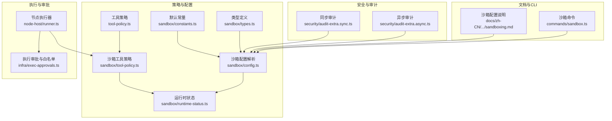
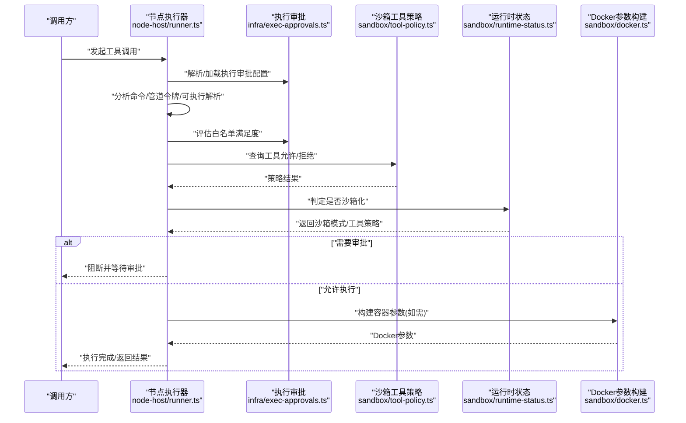
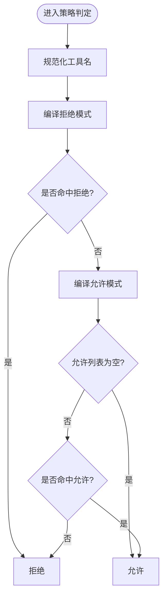
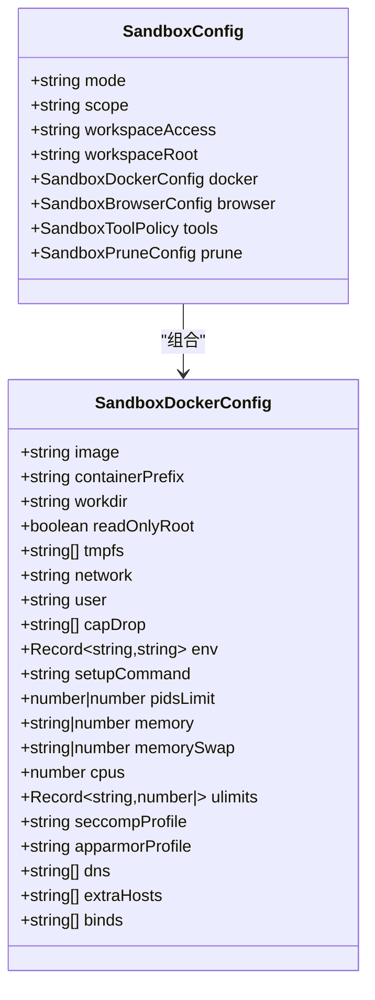
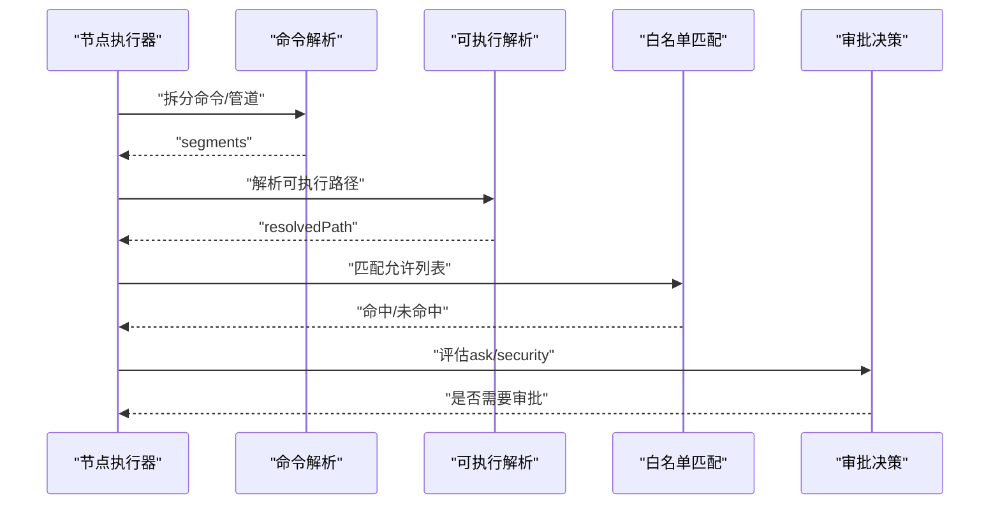
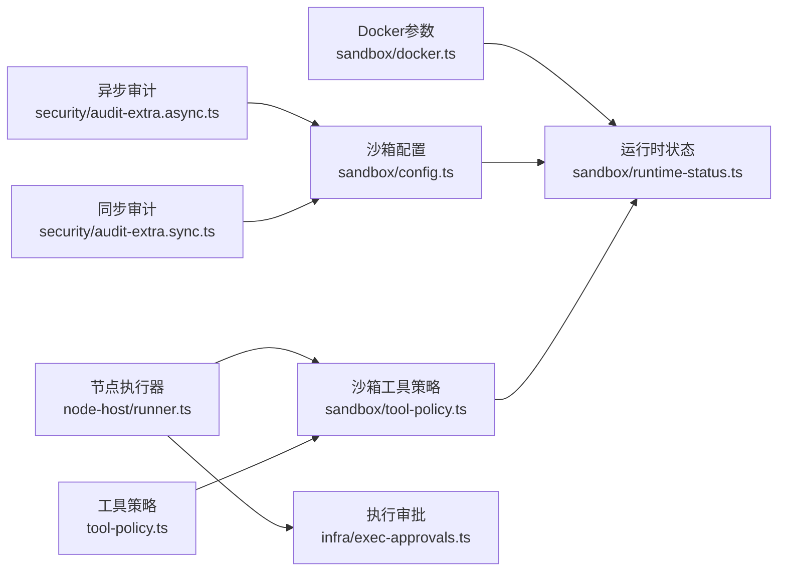

# 工具执行策略

<cite>
**本文引用的文件**
- [src/agents/sandbox/tool-policy.ts](file://src/agents/sandbox/tool-policy.ts)
- [src/agents/sandbox/runtime-status.ts](file://src/agents/sandbox/runtime-status.ts)
- [src/agents/sandbox/config.ts](file://src/agents/sandbox/config.ts)
- [src/agents/sandbox/constants.ts](file://src/agents/sandbox/constants.ts)
- [src/agents/sandbox/types.ts](file://src/agents/sandbox/types.ts)
- [src/agents/sandbox/docker.ts](file://src/agents/sandbox/docker.ts)
- [src/agents/sandbox-create-args.test.ts](file://src/agents/sandbox-create-args.test.ts)
- [src/agents/pi-tools-agent-config.test.ts](file://src/agents/pi-tools-agent-config.test.ts)
- [src/agents/tool-policy.ts](file://src/agents/tool-policy.ts)
- [src/infra/exec-approvals.ts](file://src/infra/exec-approvals.ts)
- [src/node-host/runner.ts](file://src/node-host/runner.ts)
- [src/security/audit-extra.sync.ts](file://src/security/audit-extra.sync.ts)
- [src/security/audit-extra.async.ts](file://src/security/audit-extra.async.ts)
- [docs/zh-CN/gateway/sandboxing.md](file://docs/zh-CN/gateway/sandboxing.md)
- [src/commands/sandbox.ts](file://src/commands/sandbox.ts)
</cite>

## 目录

1. [简介](#简介)
2. [项目结构](#项目结构)
3. [核心组件](#核心组件)
4. [架构总览](#架构总览)
5. [详细组件分析](#详细组件分析)
6. [依赖关系分析](#依赖关系分析)
7. [性能考量](#性能考量)
8. [故障排查指南](#故障排查指南)
9. [结论](#结论)
10. [附录](#附录)

## 简介

本文件面向OpenClaw工具执行策略系统，系统性阐述工具权限控制、沙箱隔离与安全限制机制，覆盖策略配置项、优先级规则与动态调整、工具调用审批流程、白名单管理与黑名单过滤、策略规则编写指南、测试与调试方法、执行监控与审计日志以及异常处理。目标是帮助开发者与运维人员在理解实现细节的同时，能够正确设计与维护工具执行策略。

## 项目结构

围绕工具执行策略的关键模块包括：

- 沙箱工具策略与运行时状态：负责工具允许/拒绝判定、策略来源解析、模式与作用域决策。
- 沙箱配置与Docker参数构建：负责模式、作用域、工作区访问、容器参数与挂载等。
- 执行审批与白名单：负责命令解析、管道与令牌校验、白名单匹配、审批决策与持久化。
- 审计与安全检查：负责配置与文件权限审计、敏感信息暴露风险识别。
- 文档与CLI：提供沙箱模式/作用域/工作区访问等配置参考与沙箱容器管理命令。

**图表来源**

- [src/agents/sandbox/tool-policy.ts](file://src/agents/sandbox/tool-policy.ts#L1-L143)
- [src/agents/sandbox/runtime-status.ts](file://src/agents/sandbox/runtime-status.ts#L1-L139)
- [src/agents/sandbox/config.ts](file://src/agents/sandbox/config.ts#L1-L173)
- [src/agents/sandbox/constants.ts](file://src/agents/sandbox/constants.ts#L1-L52)
- [src/agents/sandbox/types.ts](file://src/agents/sandbox/types.ts#L1-L86)
- [src/infra/exec-approvals.ts](file://src/infra/exec-approvals.ts#L1-L800)
- [src/node-host/runner.ts](file://src/node-host/runner.ts#L889-L1071)
- [src/security/audit-extra.sync.ts](file://src/security/audit-extra.sync.ts#L1-L31)
- [src/security/audit-extra.async.ts](file://src/security/audit-extra.async.ts#L436-L545)
- [docs/zh-CN/gateway/sandboxing.md](file://docs/zh-CN/gateway/sandboxing.md#L39-L73)
- [src/commands/sandbox.ts](file://src/commands/sandbox.ts#L1-L201)

**章节来源**

- [src/agents/sandbox/tool-policy.ts](file://src/agents/sandbox/tool-policy.ts#L1-L143)
- [src/agents/sandbox/runtime-status.ts](file://src/agents/sandbox/runtime-status.ts#L1-L139)
- [src/agents/sandbox/config.ts](file://src/agents/sandbox/config.ts#L1-L173)
- [src/agents/sandbox/constants.ts](file://src/agents/sandbox/constants.ts#L1-L52)
- [src/agents/sandbox/types.ts](file://src/agents/sandbox/types.ts#L1-L86)
- [src/infra/exec-approvals.ts](file://src/infra/exec-approvals.ts#L1-L800)
- [src/node-host/runner.ts](file://src/node-host/runner.ts#L889-L1071)
- [src/security/audit-extra.sync.ts](file://src/security/audit-extra.sync.ts#L1-L31)
- [src/security/audit-extra.async.ts](file://src/security/audit-extra.async.ts#L436-L545)
- [docs/zh-CN/gateway/sandboxing.md](file://docs/zh-CN/gateway/sandboxing.md#L39-L73)
- [src/commands/sandbox.ts](file://src/commands/sandbox.ts#L1-L201)

## 核心组件

- 沙箱工具策略与模式解析
  - 工具名规范化、通配与分组展开、允许/拒绝判定、策略来源标注。
  - 运行时沙箱模式与是否沙箱化判定、工具策略阻断消息格式化。
- 沙箱配置与Docker参数
  - 模式/作用域/工作区访问、Docker镜像/网络/用户/资源限制、挂载与安全选项。
- 执行审批与白名单
  - 命令解析与管道令牌校验、可执行解析、路径匹配、白名单满足度评估、审批决策与持久化。
- 审计与安全检查
  - 同步/异步审计收集、配置快照、权限检查、敏感信息暴露风险提示。
- CLI与文档
  - 沙箱容器列表/重建、模式/作用域/工作区访问说明。

**章节来源**

- [src/agents/sandbox/tool-policy.ts](file://src/agents/sandbox/tool-policy.ts#L58-L143)
- [src/agents/sandbox/runtime-status.ts](file://src/agents/sandbox/runtime-status.ts#L45-L139)
- [src/agents/sandbox/config.ts](file://src/agents/sandbox/config.ts#L126-L173)
- [src/agents/sandbox/docker.ts](file://src/agents/sandbox/docker.ts#L125-L318)
- [src/infra/exec-approvals.ts](file://src/infra/exec-approvals.ts#L1-L800)
- [src/security/audit-extra.sync.ts](file://src/security/audit-extra.sync.ts#L1-L31)
- [src/security/audit-extra.async.ts](file://src/security/audit-extra.async.ts#L436-L545)
- [docs/zh-CN/gateway/sandboxing.md](file://docs/zh-CN/gateway/sandboxing.md#L39-L73)
- [src/commands/sandbox.ts](file://src/commands/sandbox.ts#L1-L201)

## 架构总览

下图展示工具执行策略在系统中的关键交互：策略解析、运行时状态判定、执行审批与白名单、沙箱容器生命周期与Docker参数构建、审计与CLI操作。

**图表来源**

- [src/node-host/runner.ts](file://src/node-host/runner.ts#L889-L1071)
- [src/infra/exec-approvals.ts](file://src/infra/exec-approvals.ts#L1-L800)
- [src/agents/sandbox/tool-policy.ts](file://src/agents/sandbox/tool-policy.ts#L58-L143)
- [src/agents/sandbox/runtime-status.ts](file://src/agents/sandbox/runtime-status.ts#L45-L139)
- [src/agents/sandbox/docker.ts](file://src/agents/sandbox/docker.ts#L125-L318)

## 详细组件分析

### 组件A：沙箱工具策略与运行时状态

- 工具策略
  - 支持精确匹配、通配符(\*)与glob模式；支持工具分组与插件分组展开；默认允许/拒绝集合与“image”工具的特殊处理。
  - 策略来源标注：按“agent > global > default”顺序，便于审计与排障。
- 运行时状态
  - 模式：off/non-main/all；作用域：session/agent/shared；工作区访问：none/ro/rw。
  - 判定逻辑：根据会话键与主会话键决定是否沙箱化；阻断消息格式化，包含原因与修复建议。

**图表来源**

- [src/agents/sandbox/tool-policy.ts](file://src/agents/sandbox/tool-policy.ts#L16-L69)

**章节来源**

- [src/agents/sandbox/tool-policy.ts](file://src/agents/sandbox/tool-policy.ts#L1-L143)
- [src/agents/sandbox/runtime-status.ts](file://src/agents/sandbox/runtime-status.ts#L1-L139)
- [src/agents/sandbox/types.ts](file://src/agents/sandbox/types.ts#L1-L86)
- [src/agents/sandbox/constants.ts](file://src/agents/sandbox/constants.ts#L1-L52)

### 组件B：沙箱配置与Docker参数构建

- 配置解析
  - 模式/作用域/工作区访问、Docker镜像/网络/用户/资源限制、挂载与安全选项合并。
  - 作用域共享(shared)时忽略每智能体Docker配置，避免重复覆盖。
- Docker参数构建
  - 只读根文件系统、tmpfs、无网络、能力降级、seccomp/AppArmor、DNS/hosts、自定义挂载等。
  - 容器创建与启动、可选初始化命令执行。

**图表来源**

- [src/agents/sandbox/types.ts](file://src/agents/sandbox/types.ts#L1-L86)
- [src/agents/sandbox/config.ts](file://src/agents/sandbox/config.ts#L39-L173)
- [src/agents/sandbox/docker.ts](file://src/agents/sandbox/docker.ts#L125-L318)

**章节来源**

- [src/agents/sandbox/config.ts](file://src/agents/sandbox/config.ts#L1-L173)
- [src/agents/sandbox/docker.ts](file://src/agents/sandbox/docker.ts#L125-L318)
- [src/agents/sandbox-create-args.test.ts](file://src/agents/sandbox-create-args.test.ts#L1-L147)
- [docs/zh-CN/gateway/sandboxing.md](file://docs/zh-CN/gateway/sandboxing.md#L39-L73)

### 组件C：执行审批与白名单

- 命令解析与管道令牌校验
  - Shell命令拆分、引号/转义处理、heredoc解析、不支持令牌过滤。
  - Windows平台对特定令牌的限制。
- 可执行解析与路径匹配
  - PATH解析、扩展名处理、绝对/相对路径解析、真实路径规范化。
- 白名单评估
  - 允许列表条目匹配、支持glob模式、路径规范化、命中记录。
- 审批决策
  - ask策略：off/on-miss/always；security策略：deny/allowlist/full；当allowlist未满足或分析失败且ask为on-miss/always时触发审批。
- 持久化
  - 执行审批配置文件的读取/归一化/保存，权限严格控制(0600)。

**图表来源**

- [src/infra/exec-approvals.ts](file://src/infra/exec-approvals.ts#L619-L800)
- [src/infra/exec-approvals.ts](file://src/infra/exec-approvals.ts#L466-L492)
- [src/infra/exec-approvals.ts](file://src/infra/exec-approvals.ts#L582-L604)
- [src/infra/exec-approvals.ts](file://src/infra/exec-approvals.ts#L1494-L1506)
- [src/node-host/runner.ts](file://src/node-host/runner.ts#L889-L1071)

**章节来源**

- [src/infra/exec-approvals.ts](file://src/infra/exec-approvals.ts#L1-L800)
- [src/node-host/runner.ts](file://src/node-host/runner.ts#L889-L1071)

### 组件D：审计与安全检查

- 同步审计
  - 基于配置的安全属性分析，不涉及I/O。
- 异步审计
  - 文件系统权限检查：auth-profiles.json、日志文件等可读/可写风险识别与修复建议。
- 配置快照
  - 读取配置文件快照用于审计比对。

**章节来源**

- [src/security/audit-extra.sync.ts](file://src/security/audit-extra.sync.ts#L1-L31)
- [src/security/audit-extra.async.ts](file://src/security/audit-extra.async.ts#L436-L545)

### 组件E：CLI与沙箱管理

- 沙箱命令
  - 列表、重建、过滤（按会话/智能体）、确认交互、移除容器与浏览器容器。
- 文档参考
  - 沙箱模式、作用域、工作区访问、自定义绑定挂载等配置说明。

**章节来源**

- [src/commands/sandbox.ts](file://src/commands/sandbox.ts#L1-L201)
- [docs/zh-CN/gateway/sandboxing.md](file://docs/zh-CN/gateway/sandboxing.md#L39-L73)

## 依赖关系分析

- 策略层
  - 工具策略依赖工具分组与别名映射；沙箱工具策略依赖默认允许/拒绝集与“image”工具特殊处理。
  - 运行时状态依赖会话键规范化与主会话键解析。
- 执行层
  - 节点执行器依赖执行审批模块进行命令分析、白名单评估与审批决策。
- 配置层
  - 沙箱配置解析综合全局与每智能体设置，并在共享作用域下合并Docker参数与挂载。
- 安全层
  - 审计模块依赖平台与环境变量，异步审计通过文件系统检查权限。

**图表来源**

- [src/agents/tool-policy.ts](file://src/agents/tool-policy.ts#L1-L292)
- [src/agents/sandbox/tool-policy.ts](file://src/agents/sandbox/tool-policy.ts#L1-L143)
- [src/agents/sandbox/runtime-status.ts](file://src/agents/sandbox/runtime-status.ts#L1-L139)
- [src/agents/sandbox/config.ts](file://src/agents/sandbox/config.ts#L1-L173)
- [src/agents/sandbox/docker.ts](file://src/agents/sandbox/docker.ts#L125-L318)
- [src/node-host/runner.ts](file://src/node-host/runner.ts#L889-L1071)
- [src/infra/exec-approvals.ts](file://src/infra/exec-approvals.ts#L1-L800)
- [src/security/audit-extra.sync.ts](file://src/security/audit-extra.sync.ts#L1-L31)
- [src/security/audit-extra.async.ts](file://src/security/audit-extra.async.ts#L436-L545)

**章节来源**

- [src/agents/tool-policy.ts](file://src/agents/tool-policy.ts#L1-L292)
- [src/agents/sandbox/tool-policy.ts](file://src/agents/sandbox/tool-policy.ts#L1-L143)
- [src/agents/sandbox/runtime-status.ts](file://src/agents/sandbox/runtime-status.ts#L1-L139)
- [src/agents/sandbox/config.ts](file://src/agents/sandbox/config.ts#L1-L173)
- [src/agents/sandbox/docker.ts](file://src/agents/sandbox/docker.ts#L125-L318)
- [src/node-host/runner.ts](file://src/node-host/runner.ts#L889-L1071)
- [src/infra/exec-approvals.ts](file://src/infra/exec-approvals.ts#L1-L800)
- [src/security/audit-extra.sync.ts](file://src/security/audit-extra.sync.ts#L1-L31)
- [src/security/audit-extra.async.ts](file://src/security/audit-extra.async.ts#L436-L545)

## 性能考量

- 策略编译与匹配
  - 通配与正则编译在策略解析阶段完成，运行时采用预编译对象快速匹配，避免重复计算。
- 命令解析
  - Shell拆分与引号处理在单次调用内完成，避免多次I/O；Windows令牌限制减少无效尝试。
- 容器参数构建
  - 参数合并与标签设置在创建前一次性完成，减少后续调用成本。
- 审计
  - 同步审计不进行I/O，异步审计仅在必要时读取文件元数据，降低开销。

[本节为通用指导，无需具体文件分析]

## 故障排查指南

- 工具被阻断
  - 使用运行时状态提供的阻断消息格式化函数，查看拒绝原因与修复建议；核对策略来源键路径与当前模式。
- 执行审批未触发
  - 检查ask/security/autoAllowSkills配置；确认命令解析是否成功、白名单是否满足；Windows平台的令牌限制。
- 沙箱容器问题
  - 使用CLI命令列出/重建容器；核对作用域与共享配置；检查Docker参数与挂载。
- 权限与安全
  - 查看审计报告中的权限问题与修复建议；确保配置文件与日志文件权限符合要求。

**章节来源**

- [src/agents/sandbox/runtime-status.ts](file://src/agents/sandbox/runtime-status.ts#L81-L139)
- [src/infra/exec-approvals.ts](file://src/infra/exec-approvals.ts#L1494-L1506)
- [src/commands/sandbox.ts](file://src/commands/sandbox.ts#L1-L201)
- [src/security/audit-extra.async.ts](file://src/security/audit-extra.async.ts#L436-L545)

## 结论

OpenClaw工具执行策略系统通过“策略解析—运行时状态—执行审批—沙箱隔离—审计监控”的闭环设计，在保证灵活性的同时强化了安全性与可观测性。策略优先级清晰、配置项丰富、审批与白名单机制完善、沙箱参数硬核加固、审计覆盖全面。遵循本文的编写指南、测试方法与调试技巧，可有效提升策略设计质量与系统稳定性。

[本节为总结，无需具体文件分析]

## 附录

### 策略规则编写指南

- 工具策略
  - 使用精确名称、通配符与分组；默认允许/拒绝集合已考虑多模态与基础能力；避免过度收紧导致功能不可用。
  - 使用策略来源标注键路径，便于定位与审计。
- 执行审批
  - 明确ask/security/autoAllowSkills；合理设置允许列表，避免误放；Windows平台注意令牌限制。
- 沙箱配置
  - 模式选择：off/non-main/all；作用域：session/agent/shared；工作区访问：none/ro/rw；Docker参数按最小权限原则配置。

**章节来源**

- [src/agents/sandbox/tool-policy.ts](file://src/agents/sandbox/tool-policy.ts#L58-L143)
- [src/agents/sandbox/runtime-status.ts](file://src/agents/sandbox/runtime-status.ts#L10-L18)
- [src/agents/sandbox/config.ts](file://src/agents/sandbox/config.ts#L126-L173)
- [src/infra/exec-approvals.ts](file://src/infra/exec-approvals.ts#L1-L800)
- [docs/zh-CN/gateway/sandboxing.md](file://docs/zh-CN/gateway/sandboxing.md#L39-L73)

### 测试方法与示例

- 沙箱工具策略
  - 单元测试覆盖通配与分组展开、允许/拒绝判定、策略来源标注。
- 沙箱容器参数
  - 单元测试覆盖硬核参数、资源限制、自定义挂载与标签生成。
- 智能体配置集成
  - 集成测试验证智能体策略优先于沙箱策略，最终结果为最严格约束。

**章节来源**

- [src/agents/sandbox/tool-policy.test.ts](file://src/agents/sandbox/tool-policy.test.ts#L1-L21)
- [src/agents/sandbox-create-args.test.ts](file://src/agents/sandbox-create-args.test.ts#L1-L147)
- [src/agents/pi-tools-agent-config.test.ts](file://src/agents/pi-tools-agent-config.test.ts#L460-L504)

### 调试技巧

- 使用阻断消息格式化函数输出策略来源与修复建议。
- 在节点执行器中启用详细日志，观察命令解析、白名单匹配与审批决策过程。
- 通过CLI命令查看/重建沙箱容器，核对作用域与配置哈希。

**章节来源**

- [src/agents/sandbox/runtime-status.ts](file://src/agents/sandbox/runtime-status.ts#L81-L139)
- [src/node-host/runner.ts](file://src/node-host/runner.ts#L889-L1071)
- [src/commands/sandbox.ts](file://src/commands/sandbox.ts#L1-L201)
