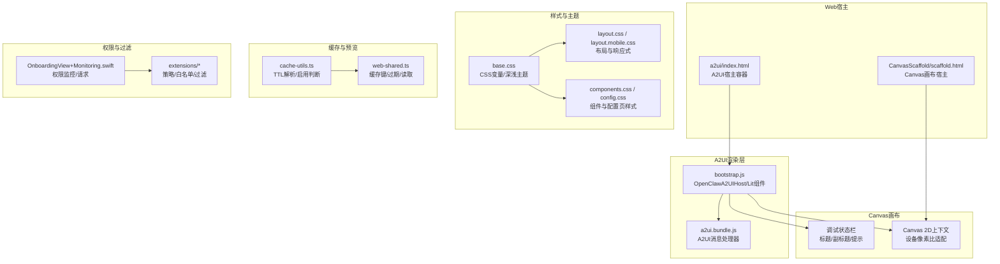
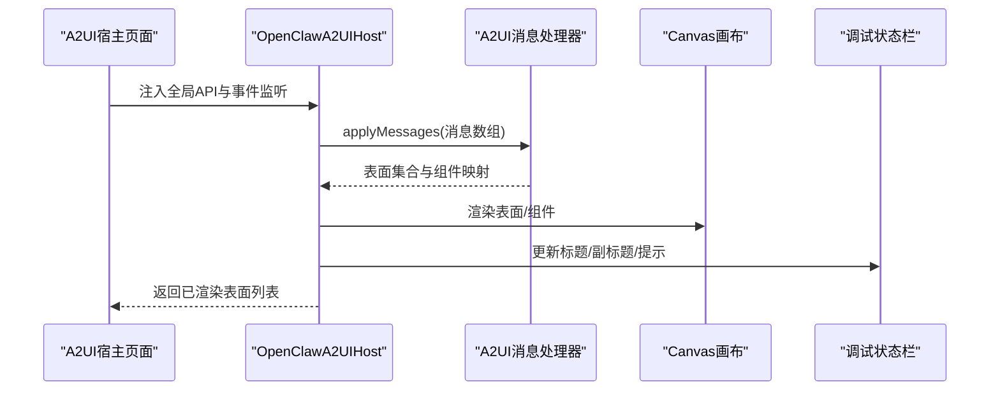
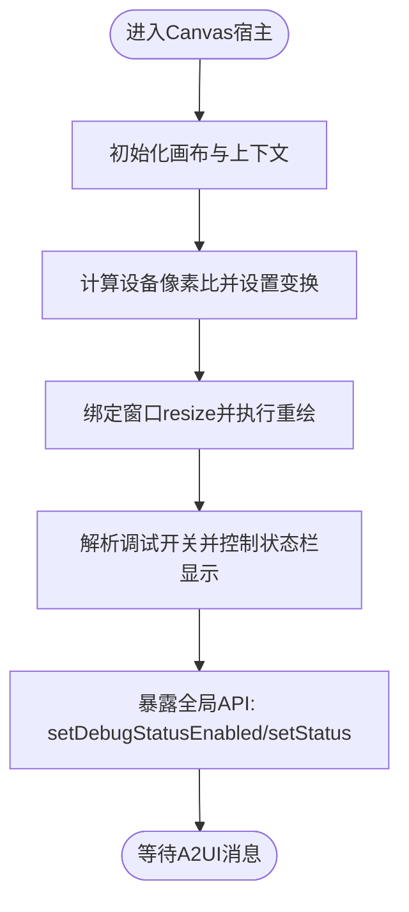
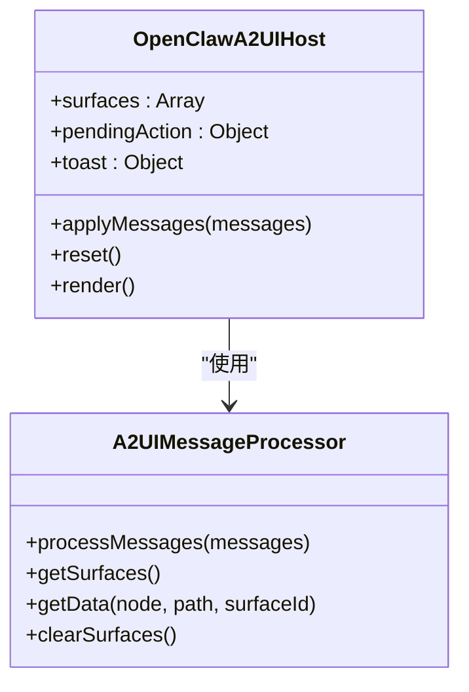
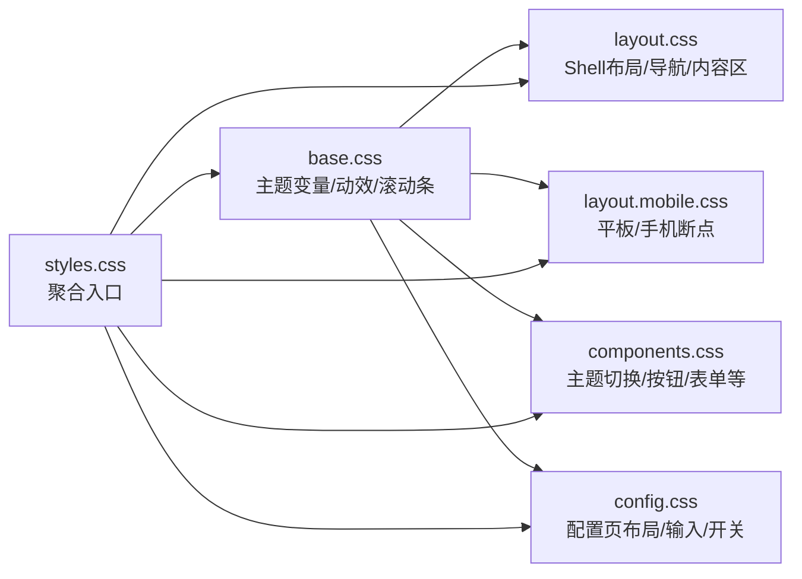
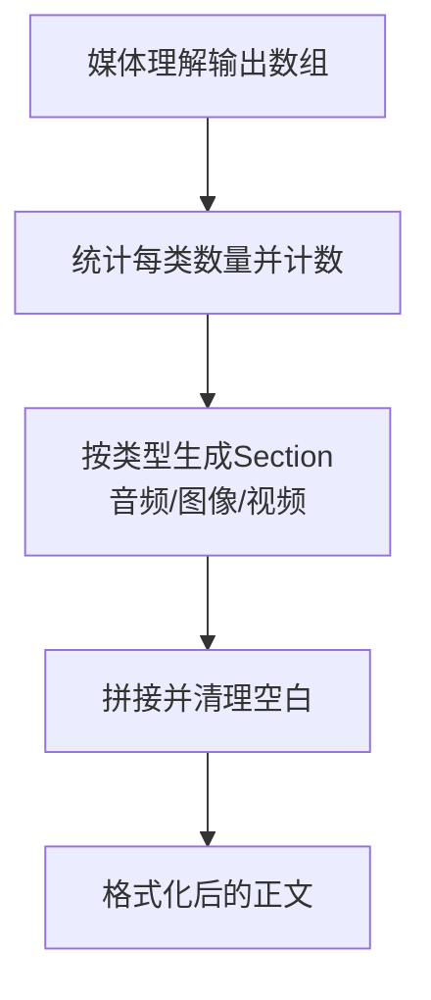
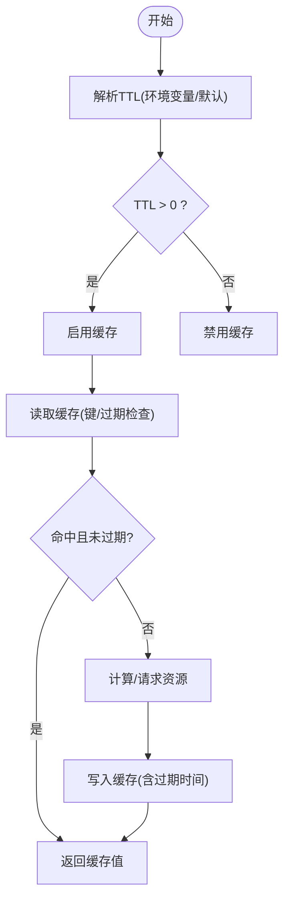
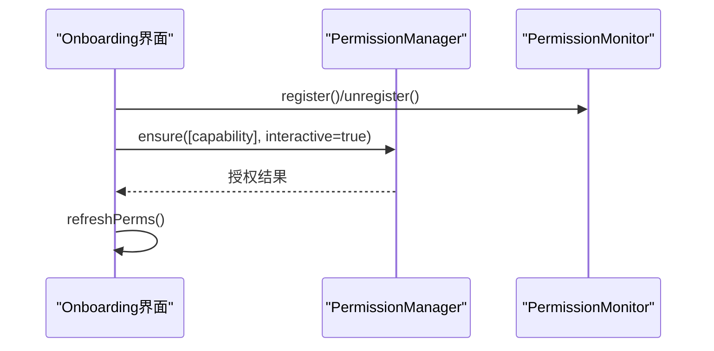
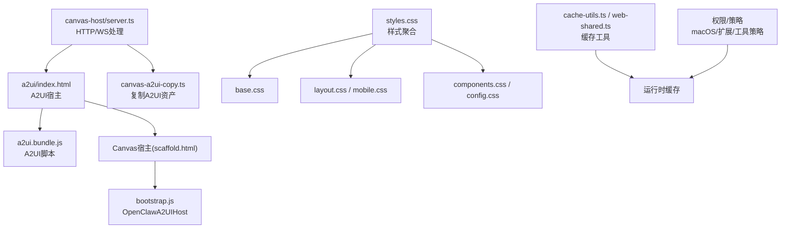

# 工具显示配置

<cite>
**本文档引用的文件**
- [apps/shared/OpenClawKit/Sources/OpenClawKit/Resources/CanvasScaffold/scaffold.html](file://apps/shared/OpenClawKit/Sources/OpenClawKit/Resources/CanvasScaffold/scaffold.html)
- [src/canvas-host/a2ui/index.html](file://src/canvas-host/a2ui/index.html)
- [apps/shared/OpenClawKit/Tools/CanvasA2UI/bootstrap.js](file://apps/shared/OpenClawKit/Tools/CanvasA2UI/bootstrap.js)
- [src/canvas-host/server.ts](file://src/canvas-host/server.ts)
- [scripts/canvas-a2ui-copy.ts](file://scripts/canvas-a2ui-copy.ts)
- [src/media-understanding/format.ts](file://src/media-understanding/format.ts)
- [src/media-understanding/index.ts](file://src/media-understanding/index.ts)
- [src/media-understanding/providers/index.ts](file://src/media-understanding/providers/index.ts)
- [src/config/cache-utils.ts](file://src/config/cache-utils.ts)
- [src/agents/tools/web-shared.ts](file://src/agents/tools/web-shared.ts)
- [src/telegram/sticker-cache.test.ts](file://src/telegram/sticker-cache.test.ts)
- [apps/android/app/src/main/java/ai/openclaw/android/NodeRuntime.kt](file://apps/android/app/src/main/java/ai/openclaw/android/NodeRuntime.kt)
- [apps/ios/Sources/Screen/ScreenController.swift](file://apps/ios/Sources/Screen/ScreenController.swift)
- [ui/src/styles/base.css](file://ui/src/styles/base.css)
- [ui/src/styles/components.css](file://ui/src/styles/components.css)
- [ui/src/styles/config.css](file://ui/src/styles/config.css)
- [ui/src/styles/layout.css](file://ui/src/styles/layout.css)
- [ui/src/styles/layout.mobile.css](file://ui/src/styles/layout.mobile.css)
- [ui/src/styles.css](file://ui/src/styles.css)
- [src/tui/theme/theme.ts](file://src/tui/theme/theme.ts)
- [src/logging/console.ts](file://src/logging/console.ts)
- [apps/macos/Sources/OpenClaw/OnboardingView+Monitoring.swift](file://apps/macos/Sources/OpenClaw/OnboardingView+Monitoring.swift)
- [extensions/phone-control/openclaw.plugin.json](file://extensions/phone-control/openclaw.plugin.json)
- [extensions/nextcloud-talk/src/policy.test.ts](file://extensions/nextcloud-talk/src/policy.test.ts)
- [src/agents/pi-tools.policy.test.ts](file://src/agents/pi-tools.policy.test.ts)
</cite>

## 目录

1. [简介](#简介)
2. [项目结构](#项目结构)
3. [核心组件](#核心组件)
4. [架构总览](#架构总览)
5. [详细组件分析](#详细组件分析)
6. [依赖关系分析](#依赖关系分析)
7. [性能考虑](#性能考虑)
8. [故障排查指南](#故障排查指南)
9. [结论](#结论)
10. [附录](#附录)

## 简介

本文件面向OpenClaw工具显示配置系统，系统性阐述工具结果在多端（Web、iOS、Android）的可视化展示、格式化与渲染机制，覆盖显示配置参数、样式定制与主题适配、图片与多媒体内容展示、复杂数据结构渲染、显示模板开发与CSS规范、响应式布局、缓存与预览生成、性能优化策略，以及显示权限控制、隐私保护与内容过滤机制。

## 项目结构

OpenClaw的显示配置体系由“宿主页面 + A2UI渲染层 + Canvas画布 + 主题与样式 + 缓存与预览 + 权限与过滤”构成，跨平台通过统一的A2UI消息协议驱动UI更新，Canvas负责底层绘制与状态提示，UI样式采用CSS变量与响应式媒体查询实现深浅主题切换与移动端自适应。

**图表来源**

- [src/canvas-host/a2ui/index.html](file://src/canvas-host/a2ui/index.html#L1-L308)
- [apps/shared/OpenClawKit/Sources/OpenClawKit/Resources/CanvasScaffold/scaffold.html](file://apps/shared/OpenClawKit/Sources/OpenClawKit/Resources/CanvasScaffold/scaffold.html#L1-L226)
- [apps/shared/OpenClawKit/Tools/CanvasA2UI/bootstrap.js](file://apps/shared/OpenClawKit/Tools/CanvasA2UI/bootstrap.js#L1-L491)
- [ui/src/styles/base.css](file://ui/src/styles/base.css#L1-L389)
- [ui/src/styles/layout.css](file://ui/src/styles/layout.css#L1-L622)
- [ui/src/styles/layout.mobile.css](file://ui/src/styles/layout.mobile.css#L1-L375)
- [src/config/cache-utils.ts](file://src/config/cache-utils.ts#L1-L27)
- [src/agents/tools/web-shared.ts](file://src/agents/tools/web-shared.ts#L1-L43)
- [apps/macos/Sources/OpenClaw/OnboardingView+Monitoring.swift](file://apps/macos/Sources/OpenClaw/OnboardingView+Monitoring.swift#L1-L28)
- [extensions/nextcloud-talk/src/policy.test.ts](file://extensions/nextcloud-talk/src/policy.test.ts#L1-L33)

**章节来源**

- [src/canvas-host/a2ui/index.html](file://src/canvas-host/a2ui/index.html#L1-L308)
- [apps/shared/OpenClawKit/Sources/OpenClawKit/Resources/CanvasScaffold/scaffold.html](file://apps/shared/OpenClawKit/Sources/OpenClawKit/Resources/CanvasScaffold/scaffold.html#L1-L226)
- [apps/shared/OpenClawKit/Tools/CanvasA2UI/bootstrap.js](file://apps/shared/OpenClawKit/Tools/CanvasA2UI/bootstrap.js#L1-L491)
- [ui/src/styles/base.css](file://ui/src/styles/base.css#L1-L389)
- [ui/src/styles/layout.css](file://ui/src/styles/layout.css#L1-L622)
- [ui/src/styles/layout.mobile.css](file://ui/src/styles/layout.mobile.css#L1-L375)

## 核心组件

- Canvas宿主与A2UI宿主：提供统一的画布与A2UI容器，支持调试状态栏、设备像素比缩放、平台差异化背景。
- A2UI渲染层：基于Lit的OpenClawA2UIHost组件，负责接收A2UI消息、管理表面（surfaces）、处理用户动作、状态提示与吐司反馈。
- 样式与主题：以CSS变量为核心，定义深浅主题色板、阴影、圆角、动效曲线与过渡；配合媒体查询实现响应式布局。
- 缓存与预览：提供TTL解析、缓存启用判断、键规范化与过期检测，支撑工具调用与资源复用。
- 权限与过滤：平台侧权限监控与请求、扩展策略白名单匹配、工具策略允许/拒绝规则。

**章节来源**

- [apps/shared/OpenClawKit/Sources/OpenClawKit/Resources/CanvasScaffold/scaffold.html](file://apps/shared/OpenClawKit/Sources/OpenClawKit/Resources/CanvasScaffold/scaffold.html#L1-L226)
- [apps/shared/OpenClawKit/Tools/CanvasA2UI/bootstrap.js](file://apps/shared/OpenClawKit/Tools/CanvasA2UI/bootstrap.js#L154-L491)
- [ui/src/styles/base.css](file://ui/src/styles/base.css#L1-L389)
- [src/config/cache-utils.ts](file://src/config/cache-utils.ts#L1-L27)
- [src/agents/tools/web-shared.ts](file://src/agents/tools/web-shared.ts#L1-L43)
- [apps/macos/Sources/OpenClaw/OnboardingView+Monitoring.swift](file://apps/macos/Sources/OpenClaw/OnboardingView+Monitoring.swift#L1-L28)

## 架构总览

显示配置系统遵循“消息驱动 + 组件渲染 + 画布绘制”的分层架构。A2UI消息经由宿主注入到OpenClawA2UIHost，组件根据消息构建UI表面并渲染；Canvas负责底层绘制与调试状态提示；样式系统通过CSS变量与媒体查询实现主题切换与响应式适配；缓存与权限分别在运行时与平台侧保障性能与安全。

**图表来源**

- [src/canvas-host/a2ui/index.html](file://src/canvas-host/a2ui/index.html#L235-L305)
- [apps/shared/OpenClawKit/Tools/CanvasA2UI/bootstrap.js](file://apps/shared/OpenClawKit/Tools/CanvasA2UI/bootstrap.js#L424-L448)

**章节来源**

- [src/canvas-host/a2ui/index.html](file://src/canvas-host/a2ui/index.html#L235-L305)
- [apps/shared/OpenClawKit/Tools/CanvasA2UI/bootstrap.js](file://apps/shared/OpenClawKit/Tools/CanvasA2UI/bootstrap.js#L424-L448)

## 详细组件分析

### Canvas宿主与A2UI宿主

- Canvas宿主负责初始化画布尺寸、设备像素比变换、调试状态栏显示控制，并暴露全局API供A2UI宿主调用。
- A2UI宿主作为Lit组件，维护表面集合、待处理动作、吐司提示，处理用户动作事件并通过原生桥向平台发送。

**图表来源**

- [apps/shared/OpenClawKit/Sources/OpenClawKit/Resources/CanvasScaffold/scaffold.html](file://apps/shared/OpenClawKit/Sources/OpenClawKit/Resources/CanvasScaffold/scaffold.html#L173-L195)
- [src/canvas-host/a2ui/index.html](file://src/canvas-host/a2ui/index.html#L257-L279)

**章节来源**

- [apps/shared/OpenClawKit/Sources/OpenClawKit/Resources/CanvasScaffold/scaffold.html](file://apps/shared/OpenClawKit/Sources/OpenClawKit/Resources/CanvasScaffold/scaffold.html#L1-L226)
- [src/canvas-host/a2ui/index.html](file://src/canvas-host/a2ui/index.html#L1-L308)

### A2UI渲染层与消息处理

- OpenClawA2UIHost使用v0_8消息处理器解析A2UI消息，构建表面与组件树，支持状态栏与吐司提示，处理用户动作并上报平台。
- 支持平台差异（如Android）的视觉风格调整与阴影/模糊效果。

**图表来源**

- [apps/shared/OpenClawKit/Tools/CanvasA2UI/bootstrap.js](file://apps/shared/OpenClawKit/Tools/CanvasA2UI/bootstrap.js#L154-L491)

**章节来源**

- [apps/shared/OpenClawKit/Tools/CanvasA2UI/bootstrap.js](file://apps/shared/OpenClawKit/Tools/CanvasA2UI/bootstrap.js#L154-L491)

### 样式系统与主题适配

- 基础样式通过CSS变量定义颜色、阴影、圆角、字体与动效曲线，支持深浅主题切换与视图过渡动画。
- 响应式布局通过媒体查询在不同屏幕宽度下调整网格、导航与控件尺寸，移动端进一步细化至小屏断点。

**图表来源**

- [ui/src/styles/base.css](file://ui/src/styles/base.css#L1-L389)
- [ui/src/styles/layout.css](file://ui/src/styles/layout.css#L1-L622)
- [ui/src/styles/layout.mobile.css](file://ui/src/styles/layout.mobile.css#L1-L375)
- [ui/src/styles/components.css](file://ui/src/styles/components.css#L214-L281)
- [ui/src/styles/config.css](file://ui/src/styles/config.css#L1-L1058)
- [ui/src/styles.css](file://ui/src/styles.css#L1-L6)

**章节来源**

- [ui/src/styles/base.css](file://ui/src/styles/base.css#L1-L389)
- [ui/src/styles/layout.css](file://ui/src/styles/layout.css#L1-L622)
- [ui/src/styles/layout.mobile.css](file://ui/src/styles/layout.mobile.css#L1-L375)
- [ui/src/styles/components.css](file://ui/src/styles/components.css#L214-L281)
- [ui/src/styles/config.css](file://ui/src/styles/config.css#L1-L1058)
- [ui/src/styles.css](file://ui/src/styles.css#L1-L6)

### 多媒体内容与复杂数据结构展示

- 媒体理解输出（音频转写、图像描述、视频描述）通过格式化函数生成结构化文本，支持多输出合并与序号后缀。
- A2UI组件体系内置对音频、视频、图片、列表、表格等元素的支持，结合Markdown渲染与自定义样式实现丰富展示。

**图表来源**

- [src/media-understanding/format.ts](file://src/media-understanding/format.ts#L47-L98)

**章节来源**

- [src/media-understanding/format.ts](file://src/media-understanding/format.ts#L47-L98)
- [src/media-understanding/index.ts](file://src/media-understanding/index.ts#L1-L9)
- [src/media-understanding/providers/index.ts](file://src/media-understanding/providers/index.ts#L29-L58)

### 显示模板开发指南与CSS规范

- 模板开发建议：基于A2UI组件库，优先使用内置元素（Button、Card、Column、Row、Divider、Text、TextField、Image、Video等），通过additionalStyles扩展卡片、模态框、按钮等通用样式。
- CSS规范：统一使用CSS变量命名空间，遵循动效曲线与过渡时长；响应式断点参考layout.mobile.css中的断点值；主题切换使用:root[data-theme="light"]选择器。

**章节来源**

- [apps/shared/OpenClawKit/Tools/CanvasA2UI/bootstrap.js](file://apps/shared/OpenClawKit/Tools/CanvasA2UI/bootstrap.js#L113-L151)
- [ui/src/styles/base.css](file://ui/src/styles/base.css#L1-L389)
- [ui/src/styles/layout.mobile.css](file://ui/src/styles/layout.mobile.css#L1-L375)

### 缓存与预览生成

- TTL解析与启用：支持从环境变量解析TTL毫秒数，默认值回退策略，启用条件为ttlMs > 0。
- 工具缓存：提供标准化缓存键、过期时间与读取逻辑，避免重复计算或网络请求。
- 资源缓存示例：Telegram贴图缓存统计测试验证缓存命中与时间戳管理。

**图表来源**

- [src/config/cache-utils.ts](file://src/config/cache-utils.ts#L3-L19)
- [src/agents/tools/web-shared.ts](file://src/agents/tools/web-shared.ts#L26-L39)
- [src/telegram/sticker-cache.test.ts](file://src/telegram/sticker-cache.test.ts#L231-L257)

**章节来源**

- [src/config/cache-utils.ts](file://src/config/cache-utils.ts#L1-L27)
- [src/agents/tools/web-shared.ts](file://src/agents/tools/web-shared.ts#L1-L43)
- [src/telegram/sticker-cache.test.ts](file://src/telegram/sticker-cache.test.ts#L231-L257)

### 权限控制、隐私保护与内容过滤

- 平台权限：macOS侧通过权限监控与请求接口动态刷新与申请能力，确保显示相关功能（如相机/屏幕/写入）具备授权。
- 扩展策略：支持白名单匹配（如Nextcloud Talk），工具策略支持通配符允许/拒绝（如web\_\*），部分工具（如apply_patch）在exec允许时自动放行。
- 隐私保护：通过策略与白名单限制消息来源与工具调用范围，避免越权访问。

**图表来源**

- [apps/macos/Sources/OpenClaw/OnboardingView+Monitoring.swift](file://apps/macos/Sources/OpenClaw/OnboardingView+Monitoring.swift#L1-L28)

**章节来源**

- [apps/macos/Sources/OpenClaw/OnboardingView+Monitoring.swift](file://apps/macos/Sources/OpenClaw/OnboardingView+Monitoring.swift#L1-L28)
- [extensions/nextcloud-talk/src/policy.test.ts](file://extensions/nextcloud-talk/src/policy.test.ts#L1-L33)
- [src/agents/pi-tools.policy.test.ts](file://src/agents/pi-tools.policy.test.ts#L1-L36)
- [extensions/phone-control/openclaw.plugin.json](file://extensions/phone-control/openclaw.plugin.json#L1-L10)

### 跨平台适配与A2UI版本约束

- iOS/Android平台通过原生WebView与JSBridge交互，A2UI v0.8消息集被严格校验，仅允许特定消息类型，防止新版本特性在旧宿主中误用。
- iOS侧支持动态设置调试状态栏标题/副标题，通过JS注入方式同步到Canvas宿主。

**章节来源**

- [apps/android/app/src/main/java/ai/openclaw/android/NodeRuntime.kt](file://apps/android/app/src/main/java/ai/openclaw/android/NodeRuntime.kt#L1185-L1229)
- [apps/ios/Sources/Screen/ScreenController.swift](file://apps/ios/Sources/Screen/ScreenController.swift#L95-L131)

## 依赖关系分析

**图表来源**

- [src/canvas-host/server.ts](file://src/canvas-host/server.ts#L436-L479)
- [scripts/canvas-a2ui-copy.ts](file://scripts/canvas-a2ui-copy.ts#L1-L40)
- [src/canvas-host/a2ui/index.html](file://src/canvas-host/a2ui/index.html#L235-L236)
- [apps/shared/OpenClawKit/Sources/OpenClawKit/Resources/CanvasScaffold/scaffold.html](file://apps/shared/OpenClawKit/Sources/OpenClawKit/Resources/CanvasScaffold/scaffold.html#L146-L152)
- [apps/shared/OpenClawKit/Tools/CanvasA2UI/bootstrap.js](file://apps/shared/OpenClawKit/Tools/CanvasA2UI/bootstrap.js#L276-L300)
- [ui/src/styles.css](file://ui/src/styles.css#L1-L6)
- [src/config/cache-utils.ts](file://src/config/cache-utils.ts#L1-L27)
- [src/agents/tools/web-shared.ts](file://src/agents/tools/web-shared.ts#L1-L43)
- [apps/macos/Sources/OpenClaw/OnboardingView+Monitoring.swift](file://apps/macos/Sources/OpenClaw/OnboardingView+Monitoring.swift#L1-L28)

**章节来源**

- [src/canvas-host/server.ts](file://src/canvas-host/server.ts#L436-L479)
- [scripts/canvas-a2ui-copy.ts](file://scripts/canvas-a2ui-copy.ts#L1-L40)
- [ui/src/styles.css](file://ui/src/styles.css#L1-L6)

## 性能考虑

- 设备像素比与Canvas尺寸：在窗口resize时按设备像素比重设画布宽高并设置变换矩阵，避免模糊与过度绘制。
- 动效与主题切换：使用CSS变量与view-transition实现主题切换动画，减少重排与重绘开销。
- 缓存策略：合理设置TTL与键规范化，避免频繁IO；对工具调用与资源请求进行缓存命中检测。
- 响应式布局：在移动设备上减少不必要的阴影与模糊，降低GPU压力。

**章节来源**

- [apps/shared/OpenClawKit/Sources/OpenClawKit/Resources/CanvasScaffold/scaffold.html](file://apps/shared/OpenClawKit/Sources/OpenClawKit/Resources/CanvasScaffold/scaffold.html#L173-L183)
- [ui/src/styles/base.css](file://ui/src/styles/base.css#L211-L242)
- [src/config/cache-utils.ts](file://src/config/cache-utils.ts#L1-L27)
- [src/agents/tools/web-shared.ts](file://src/agents/tools/web-shared.ts#L1-L43)

## 故障排查指南

- A2UI消息校验失败：检查消息类型是否仅包含允许项，避免混入新版本字段（如createSurface）。
- Canvas宿主未就绪：确认全局API对象存在且方法可用，检查调试状态栏开关与URL查询参数。
- A2UI资源缺失：构建阶段确保a2ui.bundle.js与index.html存在，否则复制脚本会抛出错误。
- 权限不足：在macOS上触发权限请求并刷新状态，确认平台已授予所需能力。
- 日志与控制台样式：通过日志配置解析与缓存，确保控制台级别与样式一致。

**章节来源**

- [apps/android/app/src/main/java/ai/openclaw/android/NodeRuntime.kt](file://apps/android/app/src/main/java/ai/openclaw/android/NodeRuntime.kt#L1185-L1199)
- [apps/shared/OpenClawKit/Sources/OpenClawKit/Resources/CanvasScaffold/scaffold.html](file://apps/shared/OpenClawKit/Sources/OpenClawKit/Resources/CanvasScaffold/scaffold.html#L206-L221)
- [scripts/canvas-a2ui-copy.ts](file://scripts/canvas-a2ui-copy.ts#L13-L28)
- [apps/macos/Sources/OpenClaw/OnboardingView+Monitoring.swift](file://apps/macos/Sources/OpenClaw/OnboardingView+Monitoring.swift#L10-L17)
- [src/logging/console.ts](file://src/logging/console.ts#L37-L80)

## 结论

OpenClaw工具显示配置系统通过A2UI消息驱动、Canvas底层绘制与统一样式体系，实现了跨平台一致的可视化体验。系统在主题适配、响应式布局、缓存与权限控制方面具备完善的机制，能够满足复杂数据结构与多媒体内容的展示需求，并提供可扩展的模板开发与性能优化路径。

## 附录

- TUI主题示例：用于命令行界面的主题配置，体现颜色与动效的一致性。
- 样式入口：聚合基础、布局、移动端、组件与配置页样式，便于统一管理与按需加载。

**章节来源**

- [src/tui/theme/theme.ts](file://src/tui/theme/theme.ts#L83-L137)
- [ui/src/styles.css](file://ui/src/styles.css#L1-L6)
