# 工具系统

<cite>
**本文引用的文件**
- [src/agents/tool-policy.ts](file://src/agents/tool-policy.ts)
- [src/agents/tool-policy.conformance.ts](file://src/agents/tool-policy.conformance.ts)
- [src/agents/pi-tools.policy.ts](file://src/agents/pi-tools.policy.ts)
- [src/agents/pi-tools.ts](file://src/agents/pi-tools.ts)
- [src/agents/pi-tools.read.ts](file://src/agents/pi-tools.read.ts)
- [src/agents/pi-tool-definition-adapter.ts](file://src/agents/pi-tool-definition-adapter.ts)
- [src/agents/tools/browser-tool.ts](file://src/agents/tools/browser-tool.ts)
- [src/agents/tools/canvas-tool.ts](file://src/agents/tools/canvas-tool.ts)
- [src/agents/tools/image-tool.ts](file://src/agents/tools/image-tool.ts)
- [src/gateway/tools-invoke-http.ts](file://src/gateway/tools-invoke-http.ts)
- [src/config/types.tools.ts](file://src/config/types.tools.ts)
- [src/agents/sandbox/tool-policy.ts](file://src/agents/sandbox/tool-policy.ts)
- [ui/src/ui/tool-display.ts](file://ui/src/ui/tool-display.ts)
- [src/plugins/registry.ts](file://src/plugins/registry.ts)
- [src/plugins/tools.optional.test.ts](file://src/plugins/tools.optional.test.ts)
- [src/agents/tools/common.ts](file://src/agents/tools/common.ts)
- [src/agents/tools/gateway.ts](file://src/agents/tools/gateway.ts)
- [src/agents/tools/nodes-utils.ts](file://src/agents/tools/nodes-utils.ts)
- [src/browser/client-actions.ts](file://src/browser/client-actions.ts)
- [src/browser/client.js](file://src/browser/client.js)
- [src/browser/config.js](file://src/browser/config.js)
- [src/media/store.js](file://src/media/store.js)
- [src/security/external-content.js](file://src/security/external-content.js)
- [src/agents/pi-tools.before-tool-call.test.ts](file://src/agents/pi-tools.before-tool-call.test.ts)
- [src/agents/pi-tools.safe-bins.test.ts](file://src/agents/pi-tools.safe-bins.test.ts)
- [src/agents/pi-embedded-runner/tool-split.ts](file://src/agents/pi-embedded-runner/tool-split.ts)
- [src/agents/pi-embedded-runner.splitsdktools.test.ts](file://src/agents/pi-embedded-runner.splitsdktools.test.ts)
- [src/agents/test-helpers/fast-core-tools.ts](file://src/agents/test-helpers/fast-core-tools.ts)
- [src/agents/pi-tools.abort.js](file://src/agents/pi-tools.abort.js)
- [src/agents/pi-tools.before-tool-call.js](file://src/agents/pi-tools.before-tool-call.js)
- [src/agents/pi-tools.schema.js](file://src/agents/pi-tools.schema.js)
- [src/agents/pi-tools.read.js](file://src/agents/pi-tools.read.js)
- [src/agents/sandbox.js](file://src/agents/sandbox.js)
- [src/agents/model-auth.js](file://src/agents/model-auth.js)
- [src/agents/models-config.js](file://src/agents/models-config.js)
- [src/agents/pi-model-discovery.js](file://src/agents/pi-model-discovery.js)
- [src/agents/minimax-vlm.js](file://src/agents/minimax-vlm.js)
- [src/agents/model-fallback.js](file://src/agents/model-fallback.js)
- [src/agents/model-selection.js](file://src/agents/model-selection.js)
- [src/agents/defaults.js](file://src/agents/defaults.js)
- [src/agents/auth-profiles.js](file://src/agents/auth-profiles.js)
- [src/agents/agent-scope.js](file://src/agents/agent-scope.js)
- [src/config/group-policy.js](file://src/config/group-policy.js)
- [src/channels/dock.js](file://src/channels/dock.js)
- [src/routing/session-key.js](file://src/routing/session-key.js)
- [src/utils/message-channel.js](file://src/utils/message-channel.js)
- [src/gateway/server-methods/nodes.ts](file://src/gateway/server-methods/nodes.ts)
- [src/gateway/http-common.js](file://src/gateway/http-common.js)
- [src/gateway/http-utils.js](file://src/gateway/http-utils.js)
- [src/gateway/auth.js](file://src/gateway/auth.js)
- [src/logger.js](file://src/logger.js)
- [src/infra/exec-approvals.js](file://src/infra/exec-approvals.js)
- [src/agents/bash-tools.js](file://src/agents/bash-tools.js)
- [src/agents/apply-patch.js](file://src/agents/apply-patch.js)
- [src/agents/channel-tools.js](file://src/agents/channel-tools.js)
- [src/agents/openclaw-tools.js](file://src/agents/openclaw-tools.js)
- [src/cli/nodes-camera.js](file://src/cli/nodes-camera.js)
- [src/cli/nodes-canvas.js](file://src/cli/nodes-canvas.js)
- [src/media/mime.js](file://src/media/mime.js)
- [src/web/media.js](file://src/web/media.js)
- [src/agents/schema/typebox.js](file://src/agents/schema/typebox.js)
- [src/agents/tools/browser-tool.schema.js](file://src/agents/tools/browser-tool.schema.js)
- [src/agents/tools/common.js](file://src/agents/tools/common.js)
- [src/agents/tools/gateway.js](file://src/agents/tools/gateway.js)
- [src/agents/tools/nodes-utils.js](file://src/agents/tools/nodes-utils.js)
- [src/browser/client-actions.js](file://src/browser/client-actions.js)
- [src/browser/client.js](file://src/browser/client.js)
- [src/browser/config.js](file://src/browser/config.js)
- [src/media/store.js](file://src/media/store.js)
- [src/security/external-content.js](file://src/security/external-content.js)
</cite>

## 目录

1. [简介](#简介)
2. [项目结构](#项目结构)
3. [核心组件](#核心组件)
4. [架构总览](#架构总览)
5. [详细组件分析](#详细组件分析)
6. [依赖关系分析](#依赖关系分析)
7. [性能考量](#性能考量)
8. [故障排查指南](#故障排查指南)
9. [结论](#结论)
10. [附录](#附录)

## 简介

本文件系统化梳理 OpenClaw 的工具系统，覆盖工具定义、注册与执行机制，工具策略管理、显示配置与图像处理，工具调用协议、参数验证与结果处理流程，并提供内置工具与自定义工具的开发指南、权限控制与安全限制、最佳实践、错误处理策略与性能优化建议，以及扩展性与插件集成方式。

## 项目结构

OpenClaw 工具系统由“策略层”“工具层”“网关层”“UI 展示层”“插件生态”等组成：

- 策略层：统一的工具组、别名、配置档与策略解析，支持全局/代理/提供商/群组/子代理/沙箱等多维策略叠加与展开。
- 工具层：内置工具（浏览器、画布、图像理解、文件读写、进程执行等），以及通过插件生态动态注册的第三方工具。
- 网关层：HTTP 接口接收工具调用请求，应用策略过滤，转发到工具执行器并返回结果。
- UI 展示层：根据工具显示配置生成可读的标题、标签、动词与摘要详情。
- 插件生态：通过注册表动态发现与加载工具，支持可选工具与插件组聚合。

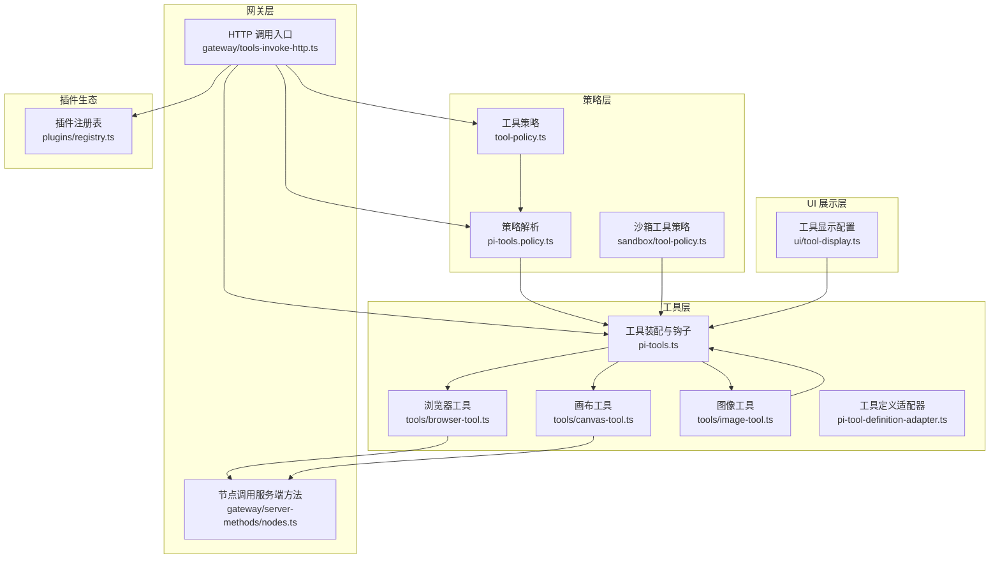

图表来源

- [src/agents/tool-policy.ts](file://src/agents/tool-policy.ts#L1-L292)
- [src/agents/pi-tools.policy.ts](file://src/agents/pi-tools.policy.ts#L1-L340)
- [src/agents/sandbox/tool-policy.ts](file://src/agents/sandbox/tool-policy.ts#L81-L123)
- [src/agents/tools/browser-tool.ts](file://src/agents/tools/browser-tool.ts#L1-L844)
- [src/agents/tools/canvas-tool.ts](file://src/agents/tools/canvas-tool.ts#L1-L181)
- [src/agents/tools/image-tool.ts](file://src/agents/tools/image-tool.ts#L1-L452)
- [src/agents/pi-tools.ts](file://src/agents/pi-tools.ts#L1-L457)
- [src/agents/pi-tool-definition-adapter.ts](file://src/agents/pi-tool-definition-adapter.ts#L106-L147)
- [src/gateway/tools-invoke-http.ts](file://src/gateway/tools-invoke-http.ts#L102-L327)
- [src/gateway/server-methods/nodes.ts](file://src/gateway/server-methods/nodes.ts#L432-L478)
- [ui/src/ui/tool-display.ts](file://ui/src/ui/tool-display.ts#L159-L226)
- [src/plugins/registry.ts](file://src/plugins/registry.ts#L178-L214)

章节来源

- [src/agents/tool-policy.ts](file://src/agents/tool-policy.ts#L1-L292)
- [src/agents/pi-tools.policy.ts](file://src/agents/pi-tools.policy.ts#L1-L340)
- [src/agents/pi-tools.ts](file://src/agents/pi-tools.ts#L1-L457)
- [src/gateway/tools-invoke-http.ts](file://src/gateway/tools-invoke-http.ts#L102-L327)
- [ui/src/ui/tool-display.ts](file://ui/src/ui/tool-display.ts#L159-L226)
- [src/plugins/registry.ts](file://src/plugins/registry.ts#L178-L214)

## 核心组件

- 工具策略与组
  - 定义工具组（如内存、网络、文件系统、运行时、会话、UI、自动化、消息、节点、OpenClaw 原生工具集），并通过别名映射与规范化工具名，支持策略展开与去重。
  - 提供工具资料档（conformance）以静态快照校验策略一致性。
- 工具装配与钩子
  - 统一创建编码类工具集合，注入参数规范化、必填参数校验、模型兼容性修补、前/后置钩子、中断信号、沙箱策略等。
  - 将工具转换为适配器形式，捕获异常并标准化错误结果。
- 网关 HTTP 入口
  - 解析请求、鉴权、合并 action 参数、按策略层层过滤、定位工具并执行，返回结构化结果或错误。
- UI 显示配置
  - 依据工具名与动作，从配置映射中解析图标、标题、标签、动词与摘要详情，支持路径取值与细节截断。
- 插件生态
  - 注册插件工具，构建插件工具组，支持“仅插件允许列表”的剥离与警告，保证核心工具可用性。

章节来源

- [src/agents/tool-policy.ts](file://src/agents/tool-policy.ts#L15-L147)
- [src/agents/tool-policy.conformance.ts](file://src/agents/tool-policy.conformance.ts#L15-L17)
- [src/agents/pi-tools.ts](file://src/agents/pi-tools.ts#L115-L456)
- [src/agents/pi-tool-definition-adapter.ts](file://src/agents/pi-tool-definition-adapter.ts#L106-L147)
- [src/gateway/tools-invoke-http.ts](file://src/gateway/tools-invoke-http.ts#L102-L327)
- [ui/src/ui/tool-display.ts](file://ui/src/ui/tool-display.ts#L159-L226)
- [src/plugins/registry.ts](file://src/plugins/registry.ts#L178-L214)

## 架构总览

下图展示从 HTTP 请求到工具执行与结果返回的完整链路，以及策略解析与工具装配的关键节点。

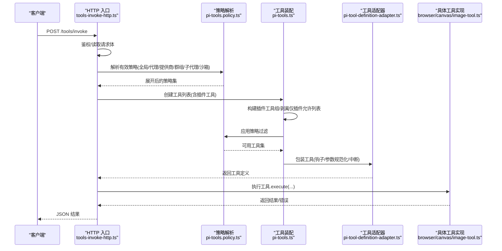

图表来源

- [src/gateway/tools-invoke-http.ts](file://src/gateway/tools-invoke-http.ts#L102-L327)
- [src/agents/pi-tools.policy.ts](file://src/agents/pi-tools.policy.ts#L230-L272)
- [src/agents/pi-tools.ts](file://src/agents/pi-tools.ts#L375-L456)
- [src/agents/pi-tool-definition-adapter.ts](file://src/agents/pi-tool-definition-adapter.ts#L106-L147)
- [src/agents/tools/browser-tool.ts](file://src/agents/tools/browser-tool.ts#L245-L800)
- [src/agents/tools/canvas-tool.ts](file://src/agents/tools/canvas-tool.ts#L51-L181)
- [src/agents/tools/image-tool.ts](file://src/agents/tools/image-tool.ts#L306-L452)

## 详细组件分析

### 工具策略与组（tool-policy.ts）

- 工具组与别名
  - 定义多组工具（如 group:memory、group:web、group:fs、group:runtime、group:sessions、group:ui、group:automation、group:messaging、group:nodes、group:openclaw），并提供别名映射（如 bash → exec、apply-patch → apply_patch）。
  - 规范化工具名与列表，支持去重与展开。
- 配置档与策略解析
  - 支持工具资料档（profile）、alsoAllow、deny、byProvider 等配置项；提供解析器将配置转换为策略对象。
  - 提供 stripPluginOnlyAllowlist 以避免仅启用插件工具导致核心工具被意外禁用，并输出告警。
- 插件组聚合
  - 构建插件工具组，支持 group:plugins 与按插件 ID 的展开，使策略能同时作用于核心与插件工具。

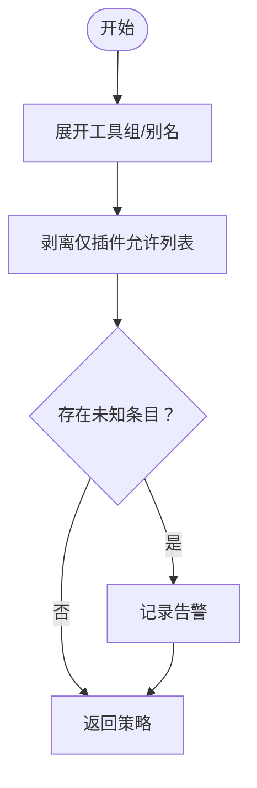

图表来源

- [src/agents/tool-policy.ts](file://src/agents/tool-policy.ts#L135-L147)
- [src/agents/tool-policy.ts](file://src/agents/tool-policy.ts#L230-L274)

章节来源

- [src/agents/tool-policy.ts](file://src/agents/tool-policy.ts#L10-L147)
- [src/agents/tool-policy.ts](file://src/agents/tool-policy.ts#L230-L274)
- [src/agents/tool-policy.conformance.ts](file://src/agents/tool-policy.conformance.ts#L15-L17)

### 策略解析与叠加（pi-tools.policy.ts）

- 有效策略解析
  - 从全局与代理配置中提取策略，支持 byProvider 按提供商/模型键匹配，支持 alsoAllow 的并集语义。
- 群组/子代理/沙箱策略
  - 群组策略基于会话键推导上下文（频道、群组、空间），结合通道对接点解析；默认子代理禁止列表覆盖主代理能力。
  - 沙箱策略支持 allow/deny 模式，编译为匹配器，支持通配符与正则。
- 工具过滤
  - 将策略转换为匹配器，过滤工具列表；特殊处理 apply_patch 对应的 exec 允许。

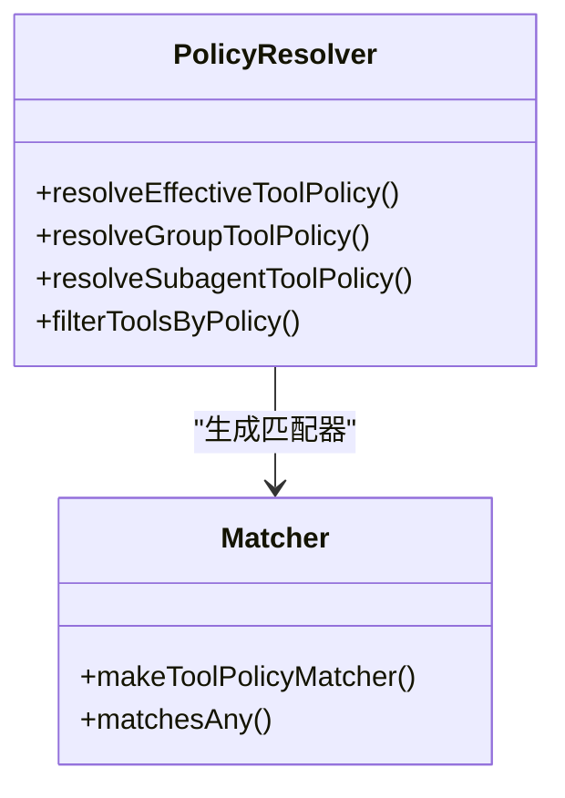

图表来源

- [src/agents/pi-tools.policy.ts](file://src/agents/pi-tools.policy.ts#L230-L272)
- [src/agents/pi-tools.policy.ts](file://src/agents/pi-tools.policy.ts#L275-L332)
- [src/agents/pi-tools.policy.ts](file://src/agents/pi-tools.policy.ts#L115-L121)

章节来源

- [src/agents/pi-tools.policy.ts](file://src/agents/pi-tools.policy.ts#L115-L121)
- [src/agents/pi-tools.policy.ts](file://src/agents/pi-tools.policy.ts#L230-L272)
- [src/agents/pi-tools.policy.ts](file://src/agents/pi-tools.policy.ts#L275-L332)

### 工具装配与钩子（pi-tools.ts）

- 工具装配
  - 统一创建编码类工具集合，注入参数规范化、必填参数校验、模型兼容性修补、前/后置钩子、中断信号、沙箱策略等。
  - 将工具转换为适配器形式，捕获异常并标准化错误结果。
- 执行管线
  - normalizeToolParameters → wrapToolWithBeforeToolCallHook → wrapToolWithAbortSignal → 返回工具集合。
- 模型与安全
  - 针对不同提供商（如 OpenAI、Anthropic、Google）做参数与模式兼容处理；支持 apply_patch 的模型白名单控制。

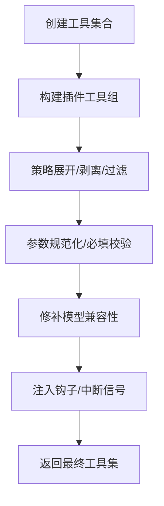

图表来源

- [src/agents/pi-tools.ts](file://src/agents/pi-tools.ts#L375-L456)
- [src/agents/pi-tools.read.ts](file://src/agents/pi-tools.read.ts#L234-L252)
- [src/agents/pi-tools.schema.js](file://src/agents/pi-tools.schema.js#L1-L200)

章节来源

- [src/agents/pi-tools.ts](file://src/agents/pi-tools.ts#L115-L456)
- [src/agents/pi-tools.read.ts](file://src/agents/pi-tools.read.ts#L234-L252)
- [src/agents/pi-tool-definition-adapter.ts](file://src/agents/pi-tool-definition-adapter.ts#L106-L147)

### HTTP 工具调用协议（tools-invoke-http.ts）

- 请求处理
  - 仅接受 POST /tools/invoke；鉴权失败返回 401；读取请求体并校验必需字段（tool）。
  - 合并 action 到参数（当工具 Schema 支持 action 字段时）。
- 策略应用
  - 解析有效策略（profile、byProvider、全局/代理/群组/子代理/沙箱），逐层展开与过滤。
- 工具执行与结果
  - 定位工具并执行，捕获异常返回 400；成功返回 { ok: true, result }。

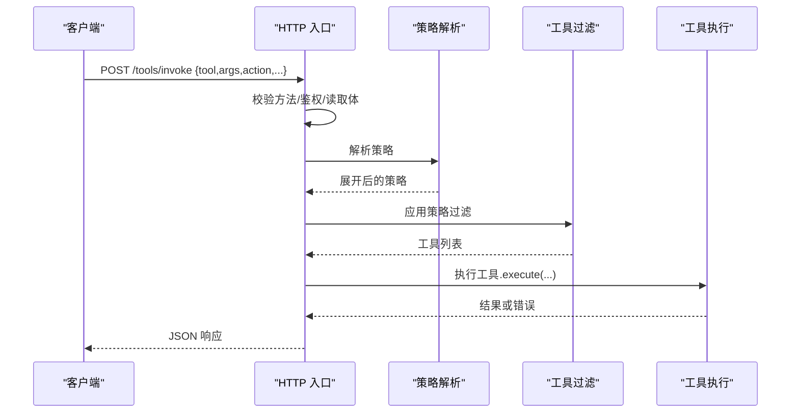

图表来源

- [src/gateway/tools-invoke-http.ts](file://src/gateway/tools-invoke-http.ts#L102-L327)

章节来源

- [src/gateway/tools-invoke-http.ts](file://src/gateway/tools-invoke-http.ts#L102-L327)

### 工具显示配置（ui/tool-display.ts）

- 配置映射
  - 从 JSON 配置读取工具显示规范（图标、标题、标签、动作细节键），提供回退规则。
- 动作与细节
  - 根据动作选择动作规范，从参数路径提取细节文本；针对特定工具（read/write/attach）提供专用解析。
- 格式化
  - 将动词与详情组合为摘要字符串，支持路径简写（~）替换。

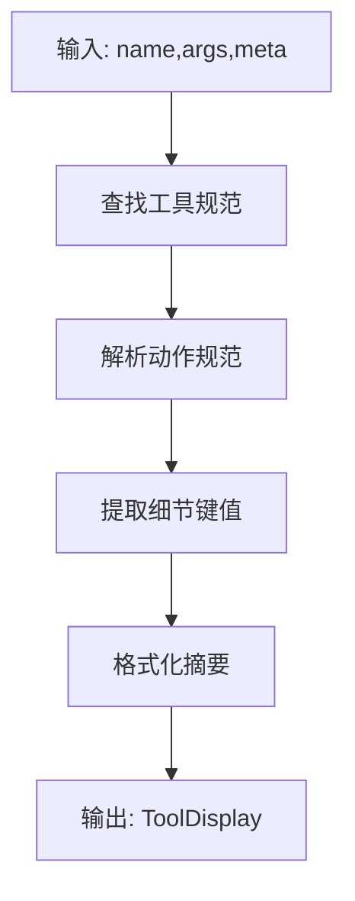

图表来源

- [ui/src/ui/tool-display.ts](file://ui/src/ui/tool-display.ts#L159-L226)

章节来源

- [ui/src/ui/tool-display.ts](file://ui/src/ui/tool-display.ts#L159-L226)

### 插件注册与工具发现（plugins/registry.ts）

- 注册流程
  - 插件通过注册表声明工具工厂与名称，支持可选工具与来源标记；记录工具元信息（插件 ID）。
- 工具组构建
  - 从已注册工具构建“所有工具”与“按插件分组”的映射，用于策略展开与过滤。

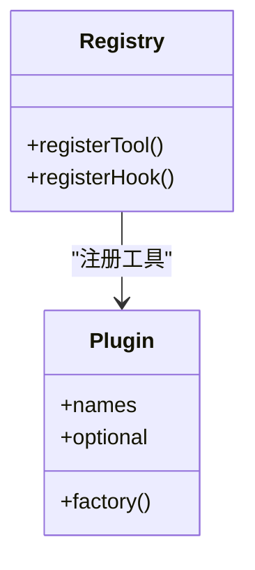

图表来源

- [src/plugins/registry.ts](file://src/plugins/registry.ts#L178-L214)

章节来源

- [src/plugins/registry.ts](file://src/plugins/registry.ts#L178-L214)

### 内置工具：浏览器（browser-tool.ts）

- 能力范围
  - 状态查询、启动/停止、配置文件、标签页管理、打开/聚焦/关闭、导航、截图、PDF 保存、上传/对话框钩子、快照与控制台日志。
- 目标选择
  - 自动选择宿主机浏览器或节点代理（受策略与沙箱桥接 URL 控制），支持手动指定节点。
- 安全包装
  - 对外部 JSON 输出进行安全包装，避免直接信任不可信内容。

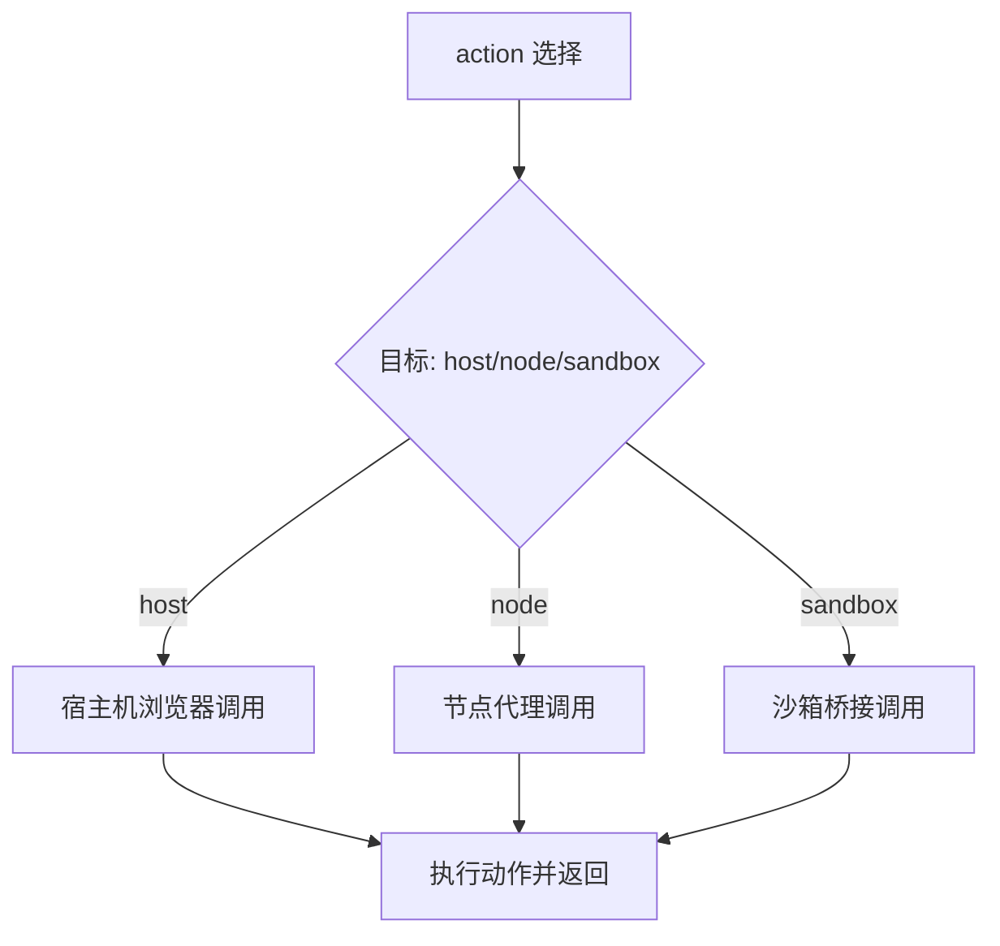

图表来源

- [src/agents/tools/browser-tool.ts](file://src/agents/tools/browser-tool.ts#L245-L800)
- [src/browser/client.js](file://src/browser/client.js#L1-L200)
- [src/browser/client-actions.ts](file://src/browser/client-actions.ts#L1-L200)
- [src/browser/config.js](file://src/browser/config.js#L1-L200)
- [src/security/external-content.js](file://src/security/external-content.js#L1-L200)

章节来源

- [src/agents/tools/browser-tool.ts](file://src/agents/tools/browser-tool.ts#L245-L800)

### 内置工具：画布（canvas-tool.ts）

- 能力范围
  - 展示/隐藏、导航、JavaScript 评估、截图、A2UI 推送/重置。
- 节点交互
  - 通过网关节点命令执行，支持超时与幂等键。
- 图像处理
  - 截图结果写入临时文件并返回图片结果。

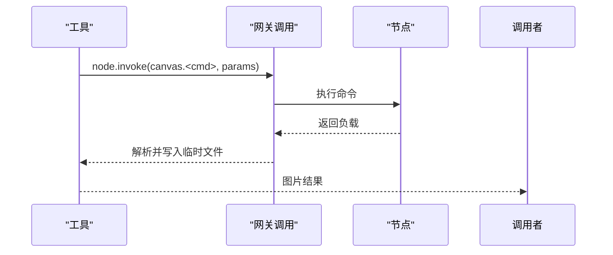

图表来源

- [src/agents/tools/canvas-tool.ts](file://src/agents/tools/canvas-tool.ts#L51-L181)
- [src/agents/tools/gateway.ts](file://src/agents/tools/gateway.ts#L1-L200)
- [src/cli/nodes-camera.js](file://src/cli/nodes-camera.js#L1-L200)
- [src/cli/nodes-canvas.js](file://src/cli/nodes-canvas.js#L1-L200)
- [src/media/mime.js](file://src/media/mime.js#L1-L200)

章节来源

- [src/agents/tools/canvas-tool.ts](file://src/agents/tools/canvas-tool.ts#L51-L181)

### 内置工具：图像（image-tool.ts）

- 能力范围
  - 使用视觉模型对图像进行描述；支持数据 URL、本地路径、HTTP(S) URL；支持沙箱路径解析与最大字节限制。
- 模型选择与回退
  - 优先配置或与主模型“配对”的视觉模型，跨提供商回退；MiniMax 特殊路径。
- 结果封装
  - 返回文本描述与尝试记录，支持重写来源路径提示。

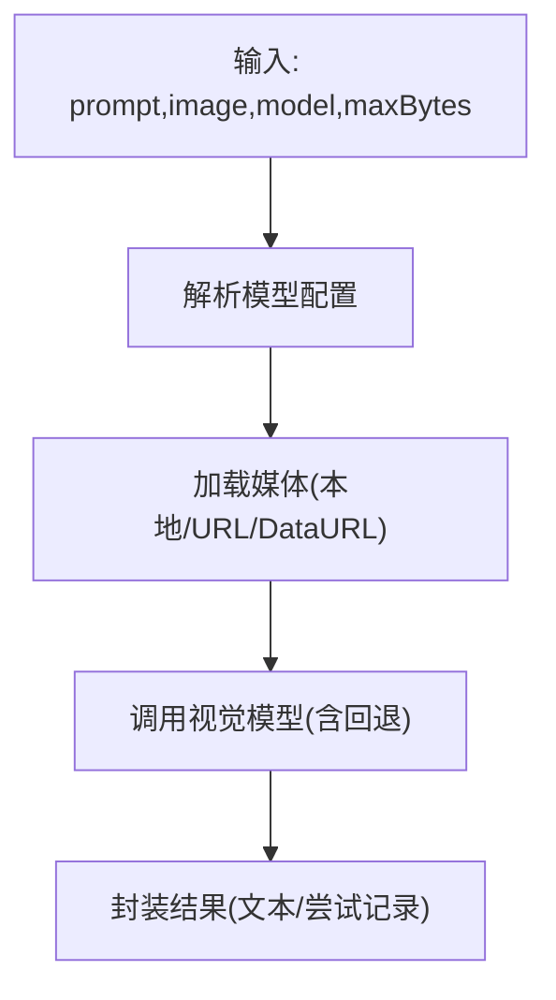

图表来源

- [src/agents/tools/image-tool.ts](file://src/agents/tools/image-tool.ts#L306-L452)
- [src/agents/model-auth.js](file://src/agents/model-auth.js#L1-L200)
- [src/agents/models-config.js](file://src/agents/models-config.js#L1-L200)
- [src/agents/pi-model-discovery.js](file://src/agents/pi-model-discovery.js#L1-L200)
- [src/agents/minimax-vlm.js](file://src/agents/minimax-vlm.js#L1-L200)
- [src/agents/model-fallback.js](file://src/agents/model-fallback.js#L1-L200)
- [src/agents/model-selection.js](file://src/agents/model-selection.js#L1-L200)
- [src/agents/defaults.js](file://src/agents/defaults.js#L1-L200)
- [src/agents/auth-profiles.js](file://src/agents/auth-profiles.js#L1-L200)
- [src/web/media.js](file://src/web/media.js#L1-L200)

章节来源

- [src/agents/tools/image-tool.ts](file://src/agents/tools/image-tool.ts#L306-L452)

### 权限控制与安全限制

- 工具资料档（owner-only）
  - 某些工具仅限所有者发送者使用，非所有者会被移除或执行时抛错。
- 策略剥离
  - 当 allowlist 仅包含插件工具时自动剥离，防止核心工具被禁用，并给出提示。
- 沙箱策略
  - 按来源（agent/global/default）确定 allow/deny，展开后合并；默认拒绝子代理危险工具。
- 执行审批与安全二进制
  - 在工具执行前检查执行审批与安全二进制白名单，结合 ask/askFallback/autoAllowSkills 策略。

章节来源

- [src/agents/tool-policy.ts](file://src/agents/tool-policy.ts#L87-L110)
- [src/agents/tool-policy.ts](file://src/agents/tool-policy.ts#L230-L274)
- [src/agents/sandbox/tool-policy.ts](file://src/agents/sandbox/tool-policy.ts#L81-L123)
- [src/agents/pi-tools.safe-bins.test.ts](file://src/agents/pi-tools.safe-bins.test.ts#L83-L87)
- [src/infra/exec-approvals.js](file://src/infra/exec-approvals.js#L1-L200)

### 开发指南：内置工具与自定义工具

- 内置工具
  - 遵循统一的工具接口（name、description、parameters、execute），使用工具通用辅助（读参、结果封装、网关调用）。
  - 对外部输出进行安全包装，必要时返回图片结果。
- 自定义工具（插件）
  - 通过注册表注册工具工厂与名称，构建插件工具组；在策略中通过 group:plugins 或插件 ID 启用。
  - 使用参数规范化与必填校验，确保与模型兼容。

章节来源

- [src/agents/tools/common.js](file://src/agents/tools/common.js#L1-L200)
- [src/plugins/registry.ts](file://src/plugins/registry.ts#L178-L214)
- [src/agents/pi-tools.read.ts](file://src/agents/pi-tools.read.ts#L234-L252)

## 依赖关系分析

- 策略层依赖
  - tool-policy.ts 提供工具组与别名；pi-tools.policy.ts 基于配置与上下文解析策略；sandbox/tool-policy.ts 提供沙箱策略来源。
- 工具层依赖
  - pi-tools.ts 依赖策略解析、参数规范化、模型兼容修补、钩子与中断；具体工具实现依赖网关调用、媒体存储与安全包装。
- 网关层依赖
  - tools-invoke-http.ts 依赖策略解析、插件工具发现、鉴权与 HTTP 常用工具；server-methods/nodes.ts 提供节点调用结果处理。
- UI 展示依赖
  - ui/tool-display.ts 依赖工具显示配置 JSON 与工具名/动作解析。

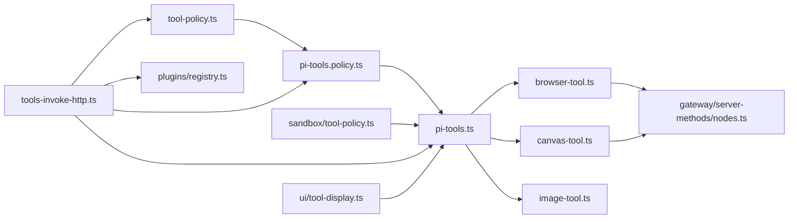

图表来源

- [src/agents/tool-policy.ts](file://src/agents/tool-policy.ts#L1-L292)
- [src/agents/pi-tools.policy.ts](file://src/agents/pi-tools.policy.ts#L1-L340)
- [src/agents/sandbox/tool-policy.ts](file://src/agents/sandbox/tool-policy.ts#L81-L123)
- [src/agents/pi-tools.ts](file://src/agents/pi-tools.ts#L1-L457)
- [src/agents/tools/browser-tool.ts](file://src/agents/tools/browser-tool.ts#L1-L844)
- [src/agents/tools/canvas-tool.ts](file://src/agents/tools/canvas-tool.ts#L1-L181)
- [src/agents/tools/image-tool.ts](file://src/agents/tools/image-tool.ts#L1-L452)
- [src/gateway/tools-invoke-http.ts](file://src/gateway/tools-invoke-http.ts#L1-L328)
- [src/plugins/registry.ts](file://src/plugins/registry.ts#L178-L214)
- [src/gateway/server-methods/nodes.ts](file://src/gateway/server-methods/nodes.ts#L432-L478)
- [ui/src/ui/tool-display.ts](file://ui/src/ui/tool-display.ts#L1-L234)

章节来源

- [src/agents/tool-policy.ts](file://src/agents/tool-policy.ts#L1-L292)
- [src/agents/pi-tools.policy.ts](file://src/agents/pi-tools.policy.ts#L1-L340)
- [src/agents/pi-tools.ts](file://src/agents/pi-tools.ts#L1-L457)
- [src/gateway/tools-invoke-http.ts](file://src/gateway/tools-invoke-http.ts#L1-L328)
- [src/plugins/registry.ts](file://src/plugins/registry.ts#L178-L214)
- [src/gateway/server-methods/nodes.ts](file://src/gateway/server-methods/nodes.ts#L432-L478)
- [ui/src/ui/tool-display.ts](file://ui/src/ui/tool-display.ts#L1-L234)

## 性能考量

- 策略展开与去重
  - 工具组展开与集合去重减少重复计算；stripPluginOnlyAllowlist 避免无效策略带来的额外过滤成本。
- 参数规范化与模型兼容
  - 在进入模型前统一参数与 Schema，减少模型侧拒绝与重试。
- 超时与中断
  - 为工具执行设置超时与中断信号，避免长时间阻塞；浏览器与节点操作设置合理超时阈值。
- 媒体与截图
  - 限制媒体大小与截图质量，避免内存与磁盘压力；沙箱路径解析减少 IO 开销。
- 插件工具发现
  - 仅在需要时构建插件工具组，避免不必要的遍历与映射。

## 故障排查指南

- HTTP 调用失败
  - 检查鉴权头与请求体字段（tool 必需）；确认工具名大小写与别名映射；查看策略过滤是否误删工具。
- 工具执行错误
  - 查看工具适配器的错误封装与堆栈日志；确认参数必填与类型；检查模型认证与回退链。
- 浏览器/节点问题
  - 确认目标选择（host/node/sandbox）与策略限制；检查节点连通性与命令支持；关注外部 JSON 包装与安全提示。
- 插件工具缺失
  - 检查插件是否启用与注册；确认策略 allowlist 是否包含 group:plugins 或插件 ID；留意剥离仅插件允许列表的告警。

章节来源

- [src/gateway/tools-invoke-http.ts](file://src/gateway/tools-invoke-http.ts#L102-L327)
- [src/agents/pi-tool-definition-adapter.ts](file://src/agents/pi-tool-definition-adapter.ts#L106-L147)
- [src/agents/tools/browser-tool.ts](file://src/agents/tools/browser-tool.ts#L245-L800)
- [src/gateway/server-methods/nodes.ts](file://src/gateway/server-methods/nodes.ts#L432-L478)
- [src/plugins/tools.optional.test.ts](file://src/plugins/tools.optional.test.ts#L1-L47)

## 结论

OpenClaw 工具系统通过“策略层—工具层—网关层—UI 展示—插件生态”的分层设计，实现了灵活、可扩展且安全的工具定义、注册与执行机制。策略解析与工具装配确保了在多维度上下文中的一致性与可控性；HTTP 入口提供了统一的调用协议与结果处理；内置工具覆盖浏览器、画布与图像理解等关键场景；插件生态进一步增强了扩展能力。遵循本文的最佳实践与安全限制，可高效开发与维护高质量工具。

## 附录

- 配置参考
  - 工具配置类型（profile、allow/deny、byProvider、alsoAllow、sandbox.tools、elevated 等）见配置类型定义。
- 开发最佳实践
  - 使用参数规范化与必填校验；对模型进行兼容修补；为工具添加钩子与中断支持；对外部输出进行安全包装；在沙箱环境中限制路径与写入。
- 错误处理策略
  - 工具适配器统一捕获异常并返回结构化错误；HTTP 层对未找到工具与执行错误分别返回 404/400；日志记录关键堆栈与调试信息。
- 性能优化技巧
  - 合理设置超时与中断；限制媒体大小与截图质量；避免不必要的策略展开；缓存模型与认证信息；在插件工具发现阶段减少不必要操作。

章节来源

- [src/config/types.tools.ts](file://src/config/types.tools.ts#L198-L222)
- [src/agents/pi-tools.before-tool-call.test.ts](file://src/agents/pi-tools.before-tool-call.test.ts#L40-L71)
- [src/agents/pi-tools.safe-bins.test.ts](file://src/agents/pi-tools.safe-bins.test.ts#L83-L87)
- [src/agents/pi-embedded-runner/tool-split.ts](file://src/agents/pi-embedded-runner/tool-split.ts#L1-L17)
- [src/agents/pi-embedded-runner.splitsdktools.test.ts](file://src/agents/pi-embedded-runner.splitsdktools.test.ts#L102-L149)
- [src/agents/test-helpers/fast-core-tools.ts](file://src/agents/test-helpers/fast-core-tools.ts#L1-L30)
