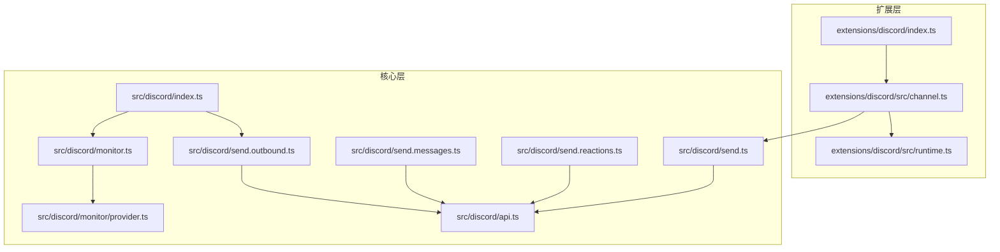
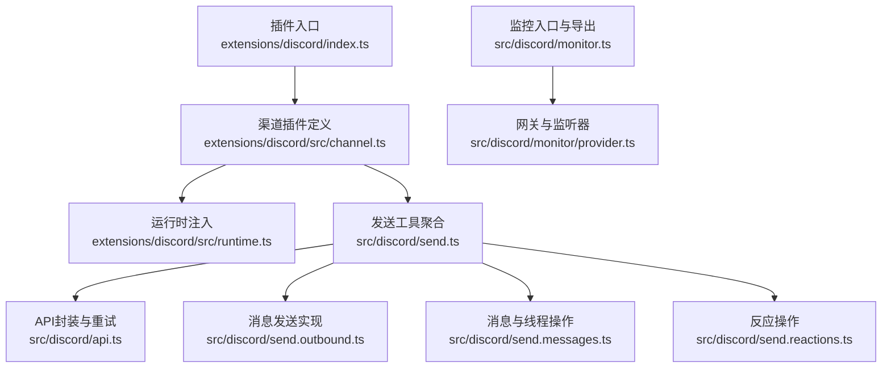
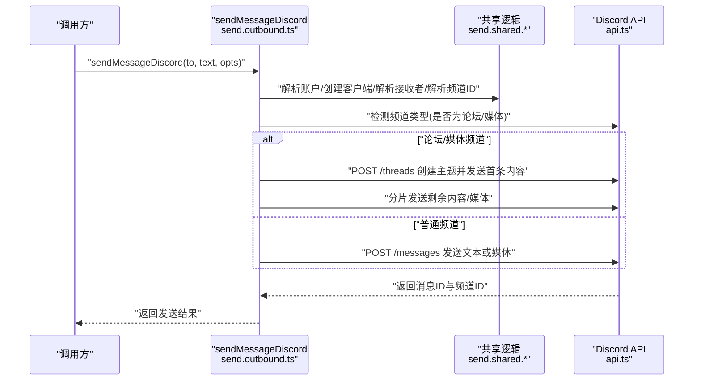
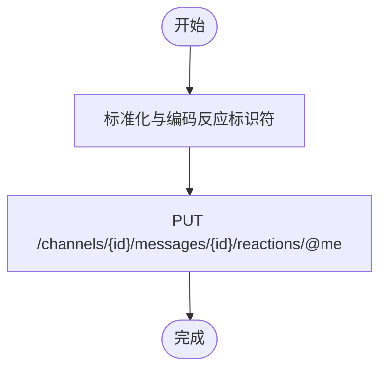
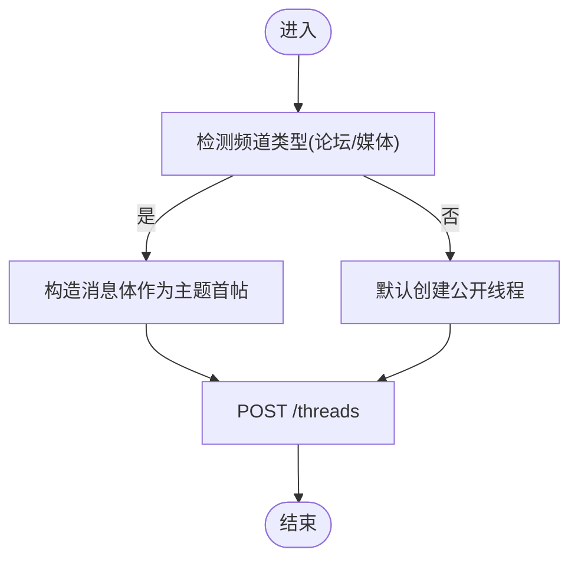
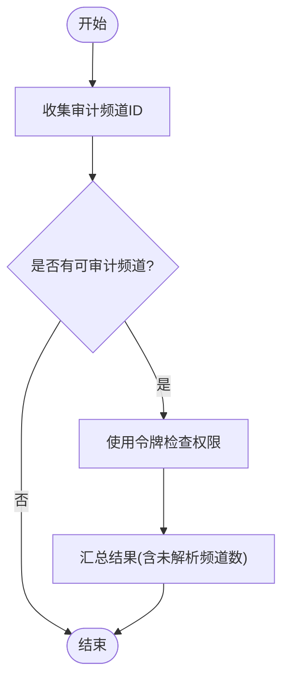
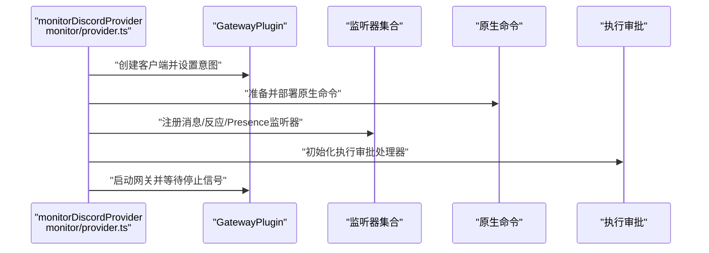
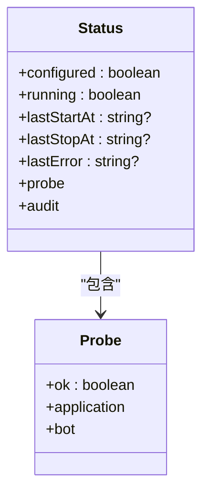
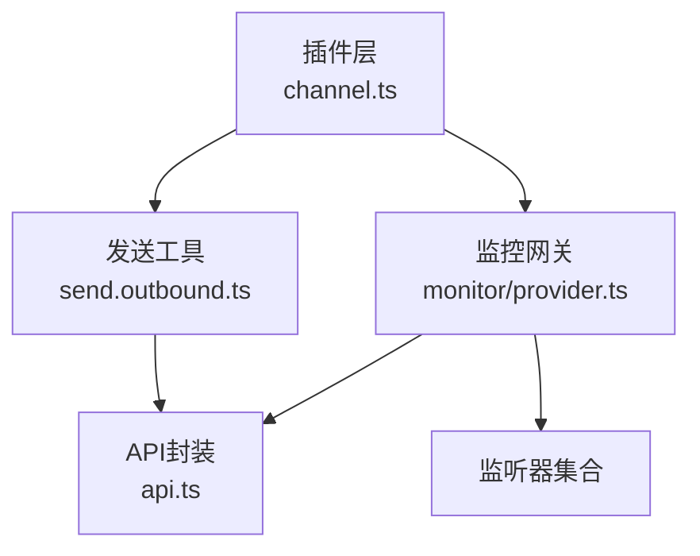

# Discord工具

<cite>
**本文引用的文件**
- [extensions/discord/index.ts](file://extensions/discord/index.ts)
- [extensions/discord/src/channel.ts](file://extensions/discord/src/channel.ts)
- [extensions/discord/src/runtime.ts](file://extensions/discord/src/runtime.ts)
- [extensions/discord/openclaw.plugin.json](file://extensions/discord/openclaw.plugin.json)
- [extensions/discord/package.json](file://extensions/discord/package.json)
- [src/discord/index.ts](file://src/discord/index.ts)
- [src/discord/api.ts](file://src/discord/api.ts)
- [src/discord/send.ts](file://src/discord/send.ts)
- [src/discord/send.outbound.ts](file://src/discord/send.outbound.ts)
- [src/discord/send.messages.ts](file://src/discord/send.messages.ts)
- [src/discord/send.reactions.ts](file://src/discord/send.reactions.ts)
- [src/discord/monitor.ts](file://src/discord/monitor.ts)
- [src/discord/monitor/provider.ts](file://src/discord/monitor/provider.ts)
</cite>

## 目录

1. [简介](#简介)
2. [项目结构](#项目结构)
3. [核心组件](#核心组件)
4. [架构总览](#架构总览)
5. [详细组件分析](#详细组件分析)
6. [依赖关系分析](#依赖关系分析)
7. [性能考量](#性能考量)
8. [故障排查指南](#故障排查指南)
9. [结论](#结论)
10. [附录](#附录)

## 简介

本文件为Discord渠道专用工具的技术文档，面向系统架构、消息操作、服务器管理、权限控制与状态管理等模块进行深入解析。文档同时覆盖工具配置、认证机制、错误处理与性能优化策略，帮助开发者与运维人员快速理解并高效使用该工具体系。

## 项目结构

- 扩展层（插件）：在插件入口中注册Discord渠道，并将运行时注入到插件上下文中，使插件能够调用底层发送与监控能力。
- 核心层（工具集）：提供Discord API封装、消息发送、反应管理、消息检索与线程管理、服务器与频道管理、权限查询、探针与审计、以及监控网关启动与事件监听等能力。

图表来源

- [extensions/discord/index.ts](file://extensions/discord/index.ts#L1-L18)
- [extensions/discord/src/channel.ts](file://extensions/discord/src/channel.ts#L1-L430)
- [extensions/discord/src/runtime.ts](file://extensions/discord/src/runtime.ts#L1-L15)
- [src/discord/index.ts](file://src/discord/index.ts#L1-L3)
- [src/discord/api.ts](file://src/discord/api.ts#L1-L137)
- [src/discord/send.ts](file://src/discord/send.ts#L1-L70)
- [src/discord/send.outbound.ts](file://src/discord/send.outbound.ts#L1-L280)
- [src/discord/send.messages.ts](file://src/discord/send.messages.ts#L1-L181)
- [src/discord/send.reactions.ts](file://src/discord/send.reactions.ts#L1-L123)
- [src/discord/monitor.ts](file://src/discord/monitor.ts#L1-L29)
- [src/discord/monitor/provider.ts](file://src/discord/monitor/provider.ts#L1-L716)

章节来源

- [extensions/discord/index.ts](file://extensions/discord/index.ts#L1-L18)
- [extensions/discord/src/channel.ts](file://extensions/discord/src/channel.ts#L1-L430)
- [extensions/discord/src/runtime.ts](file://extensions/discord/src/runtime.ts#L1-L15)
- [src/discord/index.ts](file://src/discord/index.ts#L1-L3)
- [src/discord/api.ts](file://src/discord/api.ts#L1-L137)
- [src/discord/send.ts](file://src/discord/send.ts#L1-L70)
- [src/discord/send.outbound.ts](file://src/discord/send.outbound.ts#L1-L280)
- [src/discord/send.messages.ts](file://src/discord/send.messages.ts#L1-L181)
- [src/discord/send.reactions.ts](file://src/discord/send.reactions.ts#L1-L123)
- [src/discord/monitor.ts](file://src/discord/monitor.ts#L1-L29)
- [src/discord/monitor/provider.ts](file://src/discord/monitor/provider.ts#L1-L716)

## 核心组件

- 插件注册与运行时注入：通过插件入口注册Discord渠道，并将运行时注入到插件上下文，供后续消息动作与通道配置使用。
- 消息发送工具：支持文本、媒体、贴纸、投票等多形态消息发送；自动适配论坛/媒体频道的发帖行为；具备分片与Markdown表格转换能力。
- 反应管理工具：支持添加、移除自身反应、批量移除自身反应、查询反应详情等。
- 消息检索与线程管理：支持消息读取、编辑、删除、置顶/取消置顶、搜索、线程创建与列表查询。
- 服务器与频道管理：提供频道创建/编辑/移动/删除、权限设置/移除、表情包与贴纸上传、计划活动创建等。
- 权限控制与审计：基于配置的组策略、允许列表、DM策略与用户/频道级白名单合并；支持审计频道权限。
- 监控与网关：启动Discord网关，注册消息与反应监听器，按意图启用Presence监听；支持原生命令部署与交互组件。
- 状态管理与探针：提供账户状态采集、运行时摘要构建、探针检查与审计结果汇总。

章节来源

- [extensions/discord/index.ts](file://extensions/discord/index.ts#L1-L18)
- [extensions/discord/src/channel.ts](file://extensions/discord/src/channel.ts#L47-L430)
- [src/discord/send.outbound.ts](file://src/discord/send.outbound.ts#L54-L225)
- [src/discord/send.reactions.ts](file://src/discord/send.reactions.ts#L12-L69)
- [src/discord/send.messages.ts](file://src/discord/send.messages.ts#L13-L181)
- [src/discord/monitor/provider.ts](file://src/discord/monitor/provider.ts#L144-L700)

## 架构总览

下图展示从插件入口到核心工具链的整体调用关系与职责划分：

图表来源

- [extensions/discord/index.ts](file://extensions/discord/index.ts#L1-L18)
- [extensions/discord/src/channel.ts](file://extensions/discord/src/channel.ts#L1-L430)
- [extensions/discord/src/runtime.ts](file://extensions/discord/src/runtime.ts#L1-L15)
- [src/discord/send.ts](file://src/discord/send.ts#L1-L70)
- [src/discord/api.ts](file://src/discord/api.ts#L1-L137)
- [src/discord/send.outbound.ts](file://src/discord/send.outbound.ts#L1-L280)
- [src/discord/send.messages.ts](file://src/discord/send.messages.ts#L1-L181)
- [src/discord/send.reactions.ts](file://src/discord/send.reactions.ts#L1-L123)
- [src/discord/monitor.ts](file://src/discord/monitor.ts#L1-L29)
- [src/discord/monitor/provider.ts](file://src/discord/monitor/provider.ts#L1-L716)

## 详细组件分析

### 组件A：消息发送工具链

- 功能要点
  - 文本/媒体/贴纸/投票发送统一入口，自动识别目标类型（普通频道、论坛/媒体频道），对论坛/媒体频道自动创建主题并分片发送内容。
  - Markdown表格转换与分片策略由配置驱动，支持按账户与全局配置调整。
  - 发送过程记录通道活动，便于审计与统计。
- 关键流程（发送文本/媒体）

图表来源

- [src/discord/send.outbound.ts](file://src/discord/send.outbound.ts#L54-L225)
- [src/discord/api.ts](file://src/discord/api.ts#L96-L136)

章节来源

- [src/discord/send.outbound.ts](file://src/discord/send.outbound.ts#L54-L225)
- [src/discord/api.ts](file://src/discord/api.ts#L96-L136)

### 组件B：反应管理工具

- 功能要点
  - 添加反应、移除自身反应、批量移除自身反应、查询反应详情（含用户列表）。
  - 对反应标识符进行标准化与编码，确保跨平台兼容性。
- 流程概览（添加反应）

图表来源

- [src/discord/send.reactions.ts](file://src/discord/send.reactions.ts#L12-L26)

章节来源

- [src/discord/send.reactions.ts](file://src/discord/send.reactions.ts#L12-L69)

### 组件C：消息检索与线程管理

- 功能要点
  - 支持按时间窗口读取消息、获取单条消息、编辑/删除消息、置顶/取消置顶、列出置顶消息。
  - 线程创建支持指定归档时长、类型，默认在非论坛频道创建公开线程。
  - 消息搜索支持限定频道、作者、数量上限。
- 流程概览（线程创建）

图表来源

- [src/discord/send.messages.ts](file://src/discord/send.messages.ts#L98-L138)

章节来源

- [src/discord/send.messages.ts](file://src/discord/send.messages.ts#L13-L181)

### 组件D：服务器与频道管理

- 功能要点
  - 频道创建/编辑/移动/删除、权限设置/移除、表情包与贴纸上传、计划活动创建、语音状态查询、成员信息查询等。
  - 通过send.ts聚合导出，便于上层调用。
- 关系示意

图表来源

- [src/discord/send.ts](file://src/discord/send.ts#L1-L70)

章节来源

- [src/discord/send.ts](file://src/discord/send.ts#L1-L70)

### 组件E：权限控制与审计

- 功能要点
  - 基于组策略（开放/白名单）、允许列表、DM策略与用户/频道级白名单合并，形成最终访问控制矩阵。
  - 审计阶段收集待审计频道ID，使用令牌逐频道检查权限，汇总未解析频道数与检查结果。
- 流程概览（权限审计）

图表来源

- [extensions/discord/src/channel.ts](file://extensions/discord/src/channel.ts#L335-L360)

章节来源

- [extensions/discord/src/channel.ts](file://extensions/discord/src/channel.ts#L113-L149)
- [extensions/discord/src/channel.ts](file://extensions/discord/src/channel.ts#L335-L360)

### 组件F：监控与网关

- 功能要点
  - 解析意图配置，注册消息与反应监听器；按需启用Presence监听。
  - 原生命令部署与清理；交互组件（按钮/选择器）集成；执行审批流程初始化。
  - 网关连接超时检测与断线重连策略；支持AbortSignal优雅停止。
- 序列图（启动流程）

图表来源

- [src/discord/monitor/provider.ts](file://src/discord/monitor/provider.ts#L515-L700)

章节来源

- [src/discord/monitor/provider.ts](file://src/discord/monitor/provider.ts#L125-L142)
- [src/discord/monitor/provider.ts](file://src/discord/monitor/provider.ts#L515-L700)

### 组件G：状态管理与探针

- 功能要点
  - 账户状态快照构建：包含配置状态、运行时状态、探针结果、审计结果、最近入站/出站时间等。
  - 探针检查应用与机器人信息，用于诊断意图与权限问题。
- 关系示意

图表来源

- [extensions/discord/src/channel.ts](file://extensions/discord/src/channel.ts#L361-L382)

章节来源

- [extensions/discord/src/channel.ts](file://extensions/discord/src/channel.ts#L312-L382)

## 依赖关系分析

- 插件层依赖核心层的发送与监控能力；核心层通过统一的API封装与重试策略降低外部依赖复杂度。
- 监控网关依赖Carbon客户端与Gateway插件，按配置动态注册监听器与组件。
- 权限控制与审计依赖配置解析与令牌校验，确保最小暴露面。

图表来源

- [extensions/discord/src/channel.ts](file://extensions/discord/src/channel.ts#L1-L430)
- [src/discord/send.outbound.ts](file://src/discord/send.outbound.ts#L1-L280)
- [src/discord/monitor/provider.ts](file://src/discord/monitor/provider.ts#L1-L716)
- [src/discord/api.ts](file://src/discord/api.ts#L1-L137)

章节来源

- [extensions/discord/src/channel.ts](file://extensions/discord/src/channel.ts#L1-L430)
- [src/discord/send.outbound.ts](file://src/discord/send.outbound.ts#L1-L280)
- [src/discord/monitor/provider.ts](file://src/discord/monitor/provider.ts#L1-L716)
- [src/discord/api.ts](file://src/discord/api.ts#L1-L137)

## 性能考量

- 重试与退避：API封装内置重试策略与429限流退避，避免瞬时高峰导致失败。
- 分片与限流：消息分片与Markdown表格转换在发送前完成，减少单次请求体积；线程创建默认公开线程以提升可见性。
- 网关稳定性：连接超时检测与断线重连策略，结合AbortSignal优雅停止，降低资源泄漏风险。
- 媒体大小限制：按配置限制媒体最大体积，避免超大文件导致延迟或失败。

章节来源

- [src/discord/api.ts](file://src/discord/api.ts#L5-L10)
- [src/discord/api.ts](file://src/discord/api.ts#L96-L136)
- [src/discord/monitor/provider.ts](file://src/discord/monitor/provider.ts#L644-L667)

## 故障排查指南

- 认证与意图
  - 缺少令牌：启动时若未提供令牌将直接报错，需在配置中设置账户令牌或使用环境变量。
  - 意图未启用：当消息内容意图被禁用或受限时，监控日志会给出提示，建议在开发者门户开启或改为提及触发。
- 错误格式化
  - API错误统一包装为DiscordApiError，包含状态码与可选的retry-after秒数，便于重试策略与可观测性。
- 网关异常
  - 当达到最大重连次数或出现致命错误时，监控将停止并输出错误日志；可通过探针与审计结果定位问题。
- 权限问题
  - 使用审计功能检查各频道权限；结合组策略与允许列表核对访问控制配置。

章节来源

- [src/discord/monitor/provider.ts](file://src/discord/monitor/provider.ts#L150-L155)
- [src/discord/monitor/provider.ts](file://src/discord/monitor/provider.ts#L402-L411)
- [src/discord/api.ts](file://src/discord/api.ts#L80-L89)
- [src/discord/api.ts](file://src/discord/api.ts#L113-L123)

## 结论

该Discord工具体系以插件化方式接入OpenClaw生态，核心层围绕API封装、消息发送、反应管理、消息检索与线程管理、服务器与频道管理、权限控制与审计、监控网关展开，形成完整的能力闭环。通过配置驱动的策略与严格的错误处理、重试与限流机制，能够在复杂场景下保持稳定与高性能。

## 附录

- 插件元数据与配置
  - 插件ID、支持的渠道、空配置模式等由插件清单与入口定义。
- 运行时注入
  - 插件通过运行时接口注入底层能力，保证渠道插件与核心工具解耦。

章节来源

- [extensions/discord/openclaw.plugin.json](file://extensions/discord/openclaw.plugin.json#L1-L10)
- [extensions/discord/package.json](file://extensions/discord/package.json#L1-L15)
- [extensions/discord/src/runtime.ts](file://extensions/discord/src/runtime.ts#L1-L15)
