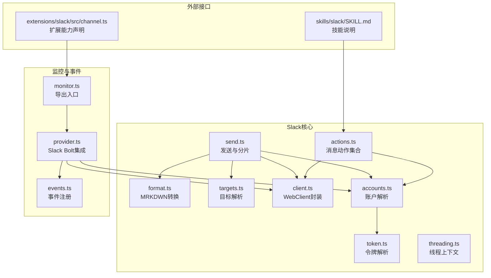
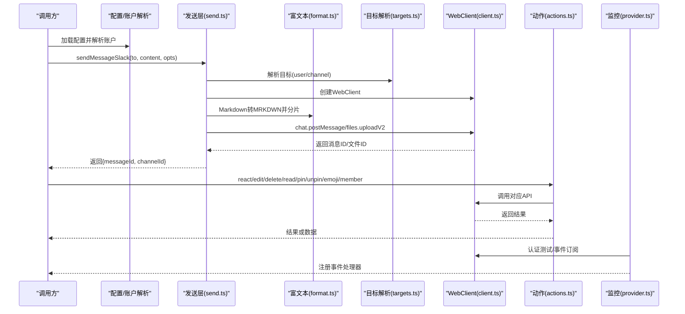
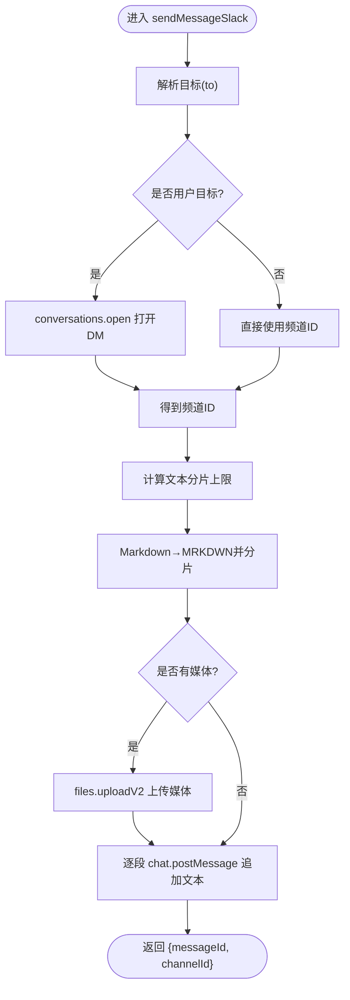
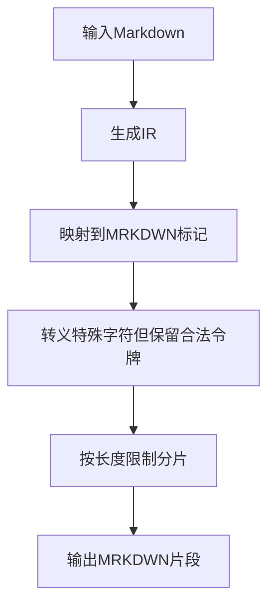
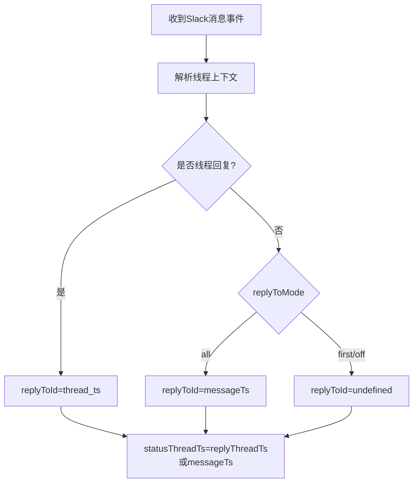
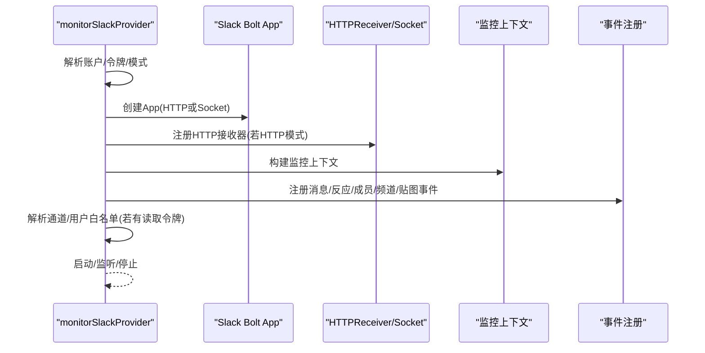
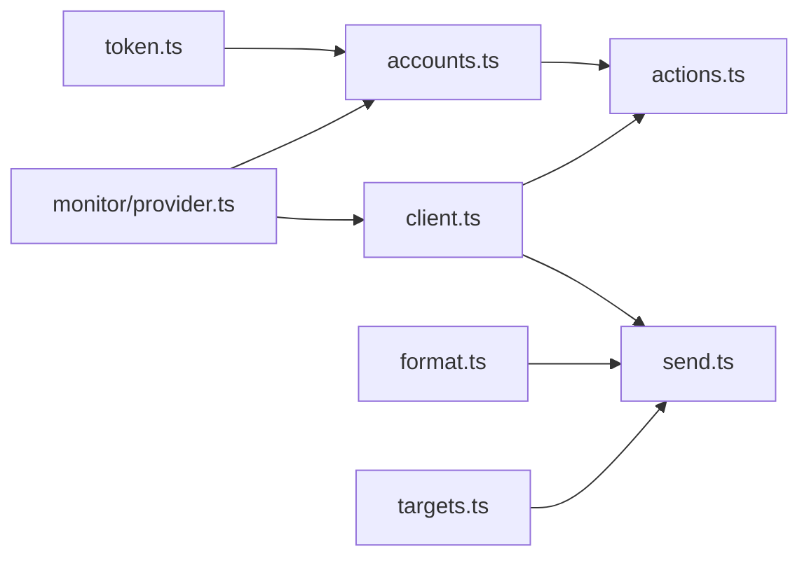

# Slack工具

<cite>
**本文引用的文件**
- [src/slack/index.ts](file://src/slack/index.ts)
- [src/slack/actions.ts](file://src/slack/actions.ts)
- [src/slack/send.ts](file://src/slack/send.ts)
- [src/slack/client.ts](file://src/slack/client.ts)
- [src/slack/format.ts](file://src/slack/format.ts)
- [src/slack/targets.ts](file://src/slack/targets.ts)
- [src/slack/accounts.ts](file://src/slack/accounts.ts)
- [src/slack/token.ts](file://src/slack/token.ts)
- [src/slack/threading.ts](file://src/slack/threading.ts)
- [src/slack/monitor.ts](file://src/slack/monitor.ts)
- [src/slack/monitor/provider.ts](file://src/slack/monitor/provider.ts)
- [src/slack/monitor/events.ts](file://src/slack/monitor/events.ts)
- [src/slack/directory-live.ts](file://src/slack/directory-live.ts)
- [skills/slack/SKILL.md](file://skills/slack/SKILL.md)
- [extensions/slack/src/channel.ts](file://extensions/slack/src/channel.ts)
</cite>

## 目录

1. [简介](#简介)
2. [项目结构](#项目结构)
3. [核心组件](#核心组件)
4. [架构总览](#架构总览)
5. [组件详解](#组件详解)
6. [依赖关系分析](#依赖关系分析)
7. [性能与可靠性](#性能与可靠性)
8. [故障排查指南](#故障排查指南)
9. [结论](#结论)
10. [附录](#附录)

## 简介

本文件面向Slack渠道专用工具的技术文档，系统阐述其架构设计与实现要点，覆盖消息发送（含富文本与块级元素）、频道管理、用户权限与线程处理，并补充Slack API集成、OAuth认证、事件监听与错误处理策略。文档同时给出关键流程图与时序图，帮助读者快速理解从配置到运行时行为的全链路。

## 项目结构

围绕Slack能力，代码主要分布在以下模块：

- 核心动作与客户端：消息发送、编辑、删除、反应、贴图、表情包、成员信息等
- 文本与富文本适配：Markdown到Slack MRKDWN转换与分片
- 目标解析：支持用户/频道目标解析与DM通道打开
- 账户与令牌：账户解析、令牌来源与默认账号
- 线程上下文：消息线程识别与回复目标推导
- 监控与事件：Socket模式或HTTP Webhook模式接入、事件注册、Slash命令、白名单解析
- 扩展与技能：插件能力声明、技能文档定义

图表来源

- [src/slack/actions.ts](file://src/slack/actions.ts#L1-L264)
- [src/slack/send.ts](file://src/slack/send.ts#L1-L208)
- [src/slack/format.ts](file://src/slack/format.ts#L1-L148)
- [src/slack/targets.ts](file://src/slack/targets.ts#L1-L68)
- [src/slack/client.ts](file://src/slack/client.ts#L1-L21)
- [src/slack/accounts.ts](file://src/slack/accounts.ts#L1-L135)
- [src/slack/token.ts](file://src/slack/token.ts#L1-L13)
- [src/slack/threading.ts](file://src/slack/threading.ts#L1-L46)
- [src/slack/monitor.ts](file://src/slack/monitor.ts#L1-L6)
- [src/slack/monitor/provider.ts](file://src/slack/monitor/provider.ts#L1-L381)
- [src/slack/monitor/events.ts](file://src/slack/monitor/events.ts#L1-L24)
- [skills/slack/SKILL.md](file://skills/slack/SKILL.md#L1-L145)
- [extensions/slack/src/channel.ts](file://extensions/slack/src/channel.ts#L54-L99)

章节来源

- [src/slack/index.ts](file://src/slack/index.ts#L1-L26)
- [src/slack/monitor.ts](file://src/slack/monitor.ts#L1-L6)

## 核心组件

- 消息动作层：提供反应、贴图、消息读取、编辑、删除、表情包、成员信息、贴图列表等能力，统一通过Web API客户端调用。
- 发送层：负责目标解析、DM通道打开、媒体上传、文本分片与MRKDWN转换、线程回复。
- 富文本与块元素：基于Markdown IR与Slack MRKDWN标记映射，支持粗体、斜体、删除线、代码、代码块、块引用、链接等；表格渲染策略可配置。
- 目标解析：支持多种输入形式（提及、user:、channel:、slack:、@、#），自动校验并标准化。
- 账户与令牌：支持多账号、环境变量与配置优先级、令牌来源追踪。
- 线程上下文：根据事件的thread_ts、ts、parent_user_id等字段推导回复目标与线程ID。
- 监控与事件：Slack Bolt集成，支持Socket与HTTP两种模式，注册消息、反应、成员、频道、贴图等事件，以及Slash命令。
- 技能与扩展：技能文档定义可用操作；扩展声明渠道能力（聊天类型、反应、线程、媒体、原生命令等）。

章节来源

- [src/slack/actions.ts](file://src/slack/actions.ts#L1-L264)
- [src/slack/send.ts](file://src/slack/send.ts#L1-L208)
- [src/slack/format.ts](file://src/slack/format.ts#L1-L148)
- [src/slack/targets.ts](file://src/slack/targets.ts#L1-L68)
- [src/slack/accounts.ts](file://src/slack/accounts.ts#L1-L135)
- [src/slack/token.ts](file://src/slack/token.ts#L1-L13)
- [src/slack/threading.ts](file://src/slack/threading.ts#L1-L46)
- [src/slack/monitor/provider.ts](file://src/slack/monitor/provider.ts#L1-L381)
- [skills/slack/SKILL.md](file://skills/slack/SKILL.md#L1-L145)
- [extensions/slack/src/channel.ts](file://extensions/slack/src/channel.ts#L54-L99)

## 架构总览

下图展示Slack工具在运行时的整体交互：配置加载与账户解析决定令牌来源；发送与动作通过Web API客户端执行；富文本经由MRKDWN转换器处理；监控侧通过Slack Bolt接入事件流，按策略进行线程与权限处理。

图表来源

- [src/slack/send.ts](file://src/slack/send.ts#L127-L208)
- [src/slack/format.ts](file://src/slack/format.ts#L97-L148)
- [src/slack/targets.ts](file://src/slack/targets.ts#L16-L62)
- [src/slack/client.ts](file://src/slack/client.ts#L18-L21)
- [src/slack/actions.ts](file://src/slack/actions.ts#L147-L264)
- [src/slack/monitor/provider.ts](file://src/slack/monitor/provider.ts#L124-L217)

## 组件详解

### 消息发送工具

- 功能概览
  - 支持向用户或频道发送消息，自动打开DM对话（用户目标）
  - 支持媒体直传（files.uploadV2），自动分片与后续文本追加
  - 支持线程回复（thread_ts）
  - 文本长度限制与分片策略可按账号配置
- 关键流程
  - 目标解析：兼容多种输入形式，标准化为user/channel ID
  - DM通道：用户目标通过conversations.open获取私信频道ID
  - 富文本：Markdown转MRKDWN，按行/表策略分片
  - 发送：先媒体后文本，保持顺序与线程一致性
- 错误处理
  - 缺少令牌/内容/媒体时抛出明确错误
  - DM通道打开失败时抛出异常
  - 媒体大小限制可配置

图表来源

- [src/slack/send.ts](file://src/slack/send.ts#L127-L208)
- [src/slack/format.ts](file://src/slack/format.ts#L121-L148)
- [src/slack/targets.ts](file://src/slack/targets.ts#L16-L62)

章节来源

- [src/slack/send.ts](file://src/slack/send.ts#L1-L208)
- [src/slack/format.ts](file://src/slack/format.ts#L1-L148)
- [src/slack/targets.ts](file://src/slack/targets.ts#L1-L68)

### 富文本与块元素处理

- 设计思路
  - 使用Markdown IR构建中间表示，再映射到Slack MRKDWN标记
  - 特殊字符转义保留合法的尖括号令牌（提及、频道、链接、mailto/tel等）
  - 表格渲染策略可配置（如禁用表格、降级为文本）
- 处理流程
  - 将Markdown转换为IR
  - 应用样式标记与转义规则
  - 按长度限制分片输出

图表来源

- [src/slack/format.ts](file://src/slack/format.ts#L97-L148)

章节来源

- [src/slack/format.ts](file://src/slack/format.ts#L1-L148)

### 频道管理与目录

- 频道列表与成员
  - 通过目录配置参数与令牌解析用户/频道列表
  - 支持读取令牌优先级（userToken优先于botToken）
- 目录查询
  - 用户与频道结构化定义，便于后续权限与白名单解析
- 权限与访问控制
  - 通过组策略与通道白名单控制访问范围
  - 支持将名称解析为ID并汇总映射结果

章节来源

- [src/slack/directory-live.ts](file://src/slack/directory-live.ts#L1-L56)
- [src/slack/accounts.ts](file://src/slack/accounts.ts#L37-L41)

### 用户权限与角色管理

- 令牌来源与账户解析
  - 默认账号允许从环境变量读取令牌
  - 支持多账号合并配置，追踪令牌来源（env/config/none）
- 允许列表解析
  - 用户与频道允许列表可解析为真实ID并合并
  - 映射过程输出已解析与未解析项摘要
- 反应通知与白名单
  - 可配置反应通知模式与允许列表，影响ACK反应策略

章节来源

- [src/slack/accounts.ts](file://src/slack/accounts.ts#L74-L114)
- [src/slack/monitor/provider.ts](file://src/slack/monitor/provider.ts#L225-L350)

### 线程处理工具

- 线程上下文推导
  - 根据事件的thread_ts、ts、parent_user_id判断是否为线程回复
  - replyToId优先取thread_ts，否则按replyToMode选择messageTs或不回复
- 回复目标与状态线程
  - replyThreadTs：用于回复的线程
  - statusThreadTs：用于状态/摘要的线程（通常与回复线程一致）

图表来源

- [src/slack/threading.ts](file://src/slack/threading.ts#L12-L45)

章节来源

- [src/slack/threading.ts](file://src/slack/threading.ts#L1-L46)

### Slack API集成与事件监听

- 客户端封装
  - 默认重试策略，统一WebClient选项
- 监控提供者
  - Socket模式：使用Socket Mode连接，自动启动
  - HTTP模式：注册HTTP接收器，绑定webhook路径与签名密钥
  - 认证测试：获取bot用户ID、团队ID与API应用ID，辅助令牌一致性校验
- 事件注册
  - 注册消息、反应、成员、频道、贴图等事件处理器
  - 支持Slash命令匹配与配置
- 白名单解析
  - 在有读取令牌时，尝试解析通道与用户白名单为真实ID并合并

图表来源

- [src/slack/monitor/provider.ts](file://src/slack/monitor/provider.ts#L42-L217)
- [src/slack/monitor/events.ts](file://src/slack/monitor/events.ts#L10-L24)

章节来源

- [src/slack/monitor.ts](file://src/slack/monitor.ts#L1-L6)
- [src/slack/monitor/provider.ts](file://src/slack/monitor/provider.ts#L1-L381)
- [src/slack/monitor/events.ts](file://src/slack/monitor/events.ts#L1-L24)

### OAuth认证与令牌管理

- 令牌解析
  - 支持从环境变量与配置中解析bot/app令牌
  - 令牌规范化与来源追踪
- 模式要求
  - Socket模式需要botToken与appToken
  - HTTP模式需要botToken与signingSecret
- 令牌一致性检查
  - 从botToken与appToken中提取API应用ID并进行一致性校验

章节来源

- [src/slack/token.ts](file://src/slack/token.ts#L1-L13)
- [src/slack/monitor/provider.ts](file://src/slack/monitor/provider.ts#L64-L77)
- [src/slack/monitor/provider.ts](file://src/slack/monitor/provider.ts#L157-L171)

### 技能与扩展能力

- 技能文档
  - 定义可用动作（反应、消息读写编辑删除、贴图、成员信息、表情包列表）
  - 提供典型JSON示例与输入规范
- 扩展能力声明
  - 声明支持的聊天类型（direct/channel/thread）
  - 支持反应、线程、媒体、原生命令
  - 流式输出分片策略默认值

章节来源

- [skills/slack/SKILL.md](file://skills/slack/SKILL.md#L1-L145)
- [extensions/slack/src/channel.ts](file://extensions/slack/src/channel.ts#L54-L99)

## 依赖关系分析

- 内部依赖
  - actions.ts依赖client.ts与accounts.ts；send.ts依赖targets.ts、format.ts、client.ts与accounts.ts
  - monitor/provider.ts依赖accounts.ts、client.ts、resolve-channels/resolve-users等工具
- 外部依赖
  - @slack/web-api：Web API客户端
  - @slack/bolt：Socket/HTTP事件接入与命令处理

图表来源

- [src/slack/actions.ts](file://src/slack/actions.ts#L1-L264)
- [src/slack/send.ts](file://src/slack/send.ts#L1-L208)
- [src/slack/client.ts](file://src/slack/client.ts#L1-L21)
- [src/slack/accounts.ts](file://src/slack/accounts.ts#L1-L135)
- [src/slack/token.ts](file://src/slack/token.ts#L1-L13)
- [src/slack/format.ts](file://src/slack/format.ts#L1-L148)
- [src/slack/targets.ts](file://src/slack/targets.ts#L1-L68)
- [src/slack/monitor/provider.ts](file://src/slack/monitor/provider.ts#L1-L381)

章节来源

- [src/slack/index.ts](file://src/slack/index.ts#L1-L26)

## 性能与可靠性

- 重试策略
  - 默认指数退避重试，避免瞬时网络波动导致失败
- 分片与限长
  - 文本分片与媒体大小限制可按账号配置，避免单次请求过大
- 并发与批量
  - 删除/移除反应等操作采用并发处理以提升效率
- 事件处理
  - Socket模式低延迟，HTTP模式需正确配置webhook与签名密钥

章节来源

- [src/slack/client.ts](file://src/slack/client.ts#L3-L16)
- [src/slack/send.ts](file://src/slack/send.ts#L168-L171)
- [src/slack/actions.ts](file://src/slack/actions.ts#L120-L129)

## 故障排查指南

- 常见错误与定位
  - 缺少令牌：检查SLACK_BOT_TOKEN/SLACK_APP_TOKEN或配置中的botToken/appToken
  - HTTP模式缺少签名密钥：确保channels.slack.signingSecret已配置
  - DM通道无法打开：确认用户ID有效且具备相应权限
  - 文本/媒体为空：发送前需至少提供一种内容
  - 令牌不一致：botToken与appToken的API应用ID需匹配
- 日志与诊断
  - 监控提供者在启动与解析白名单时输出摘要日志
  - 建议开启详细日志以观察事件注册与处理流程

章节来源

- [src/slack/monitor/provider.ts](file://src/slack/monitor/provider.ts#L64-L77)
- [src/slack/monitor/provider.ts](file://src/slack/monitor/provider.ts#L253-L256)
- [src/slack/send.ts](file://src/slack/send.ts#L133-L135)
- [src/slack/monitor/provider.ts](file://src/slack/monitor/provider.ts#L167-L171)

## 结论

该Slack工具体系以清晰的分层设计实现了消息发送、富文本处理、线程管理与事件接入。通过多账号与令牌来源的灵活配置，结合白名单解析与权限策略，满足不同规模与安全需求的部署场景。建议在生产环境中：

- 明确Socket/HTTP模式与令牌配置
- 合理设置文本分片与媒体大小限制
- 使用白名单解析与组策略控制访问范围
- 对事件处理与ACK反应策略进行针对性配置

## 附录

- 技能动作参考：见技能文档中的动作分组与示例
- 扩展能力声明：见扩展渠道插件对聊天类型、反应、线程、媒体与原生命令的支持

章节来源

- [skills/slack/SKILL.md](file://skills/slack/SKILL.md#L21-L145)
- [extensions/slack/src/channel.ts](file://extensions/slack/src/channel.ts#L88-L94)
