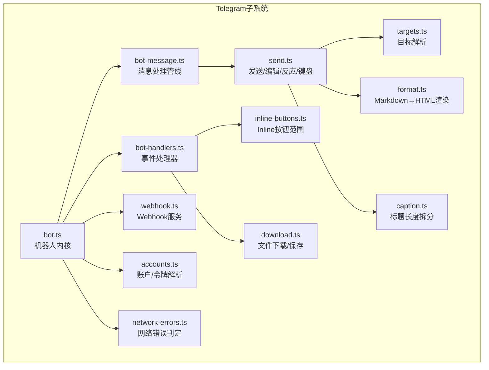
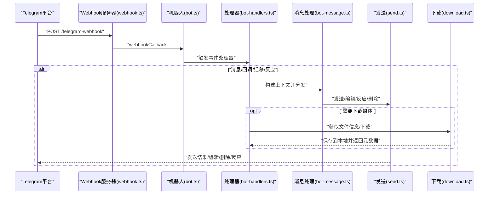
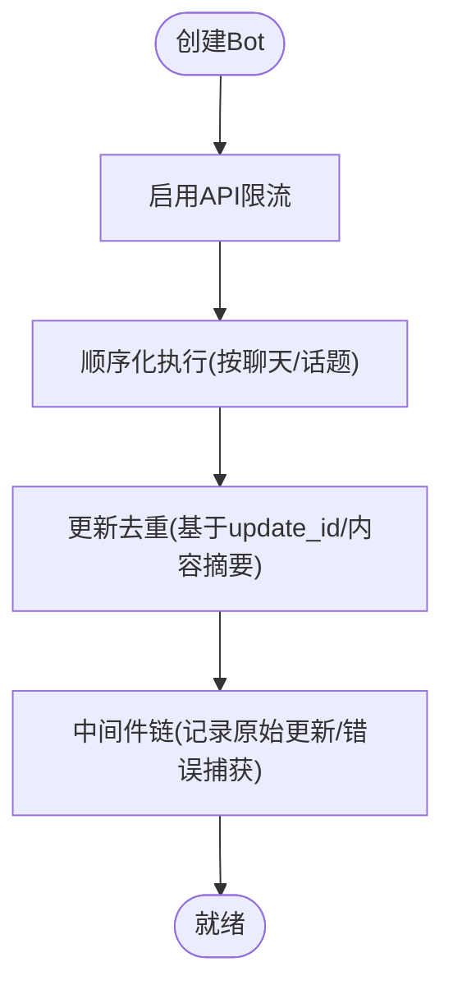
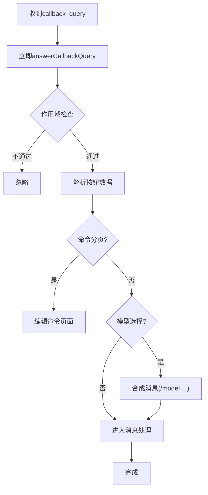
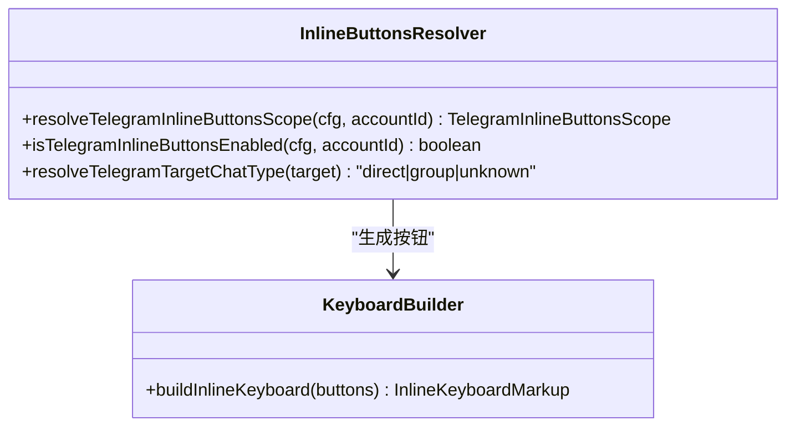
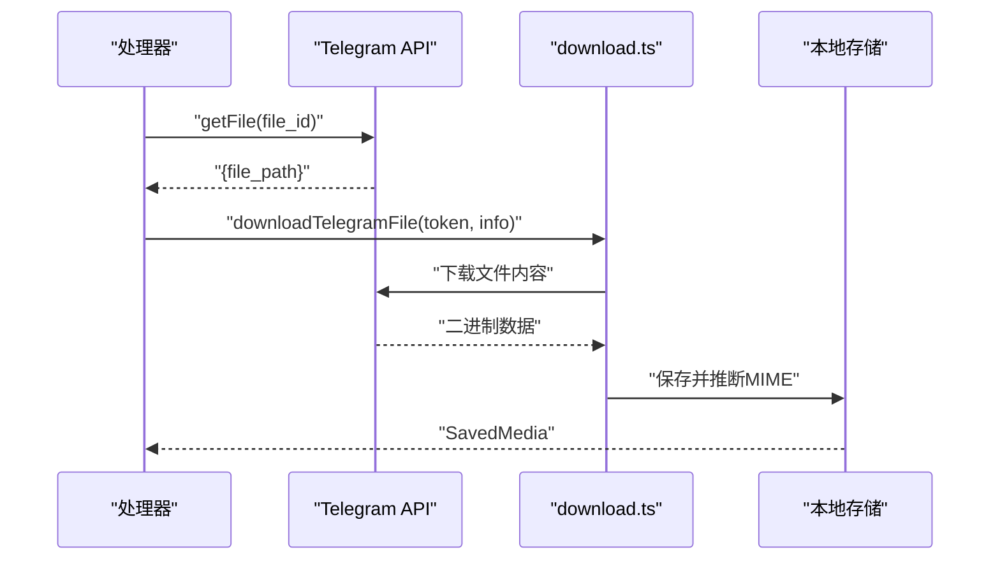
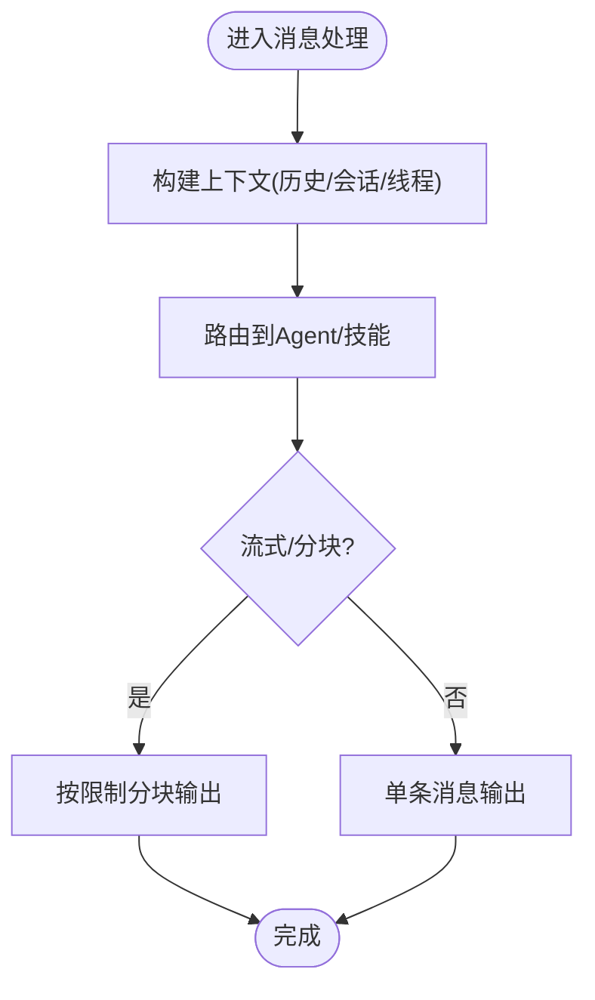
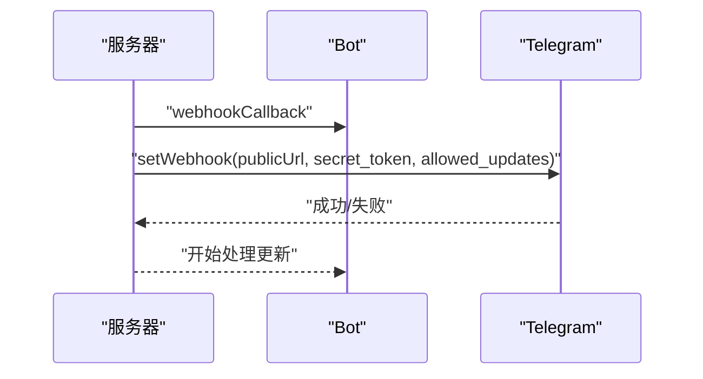
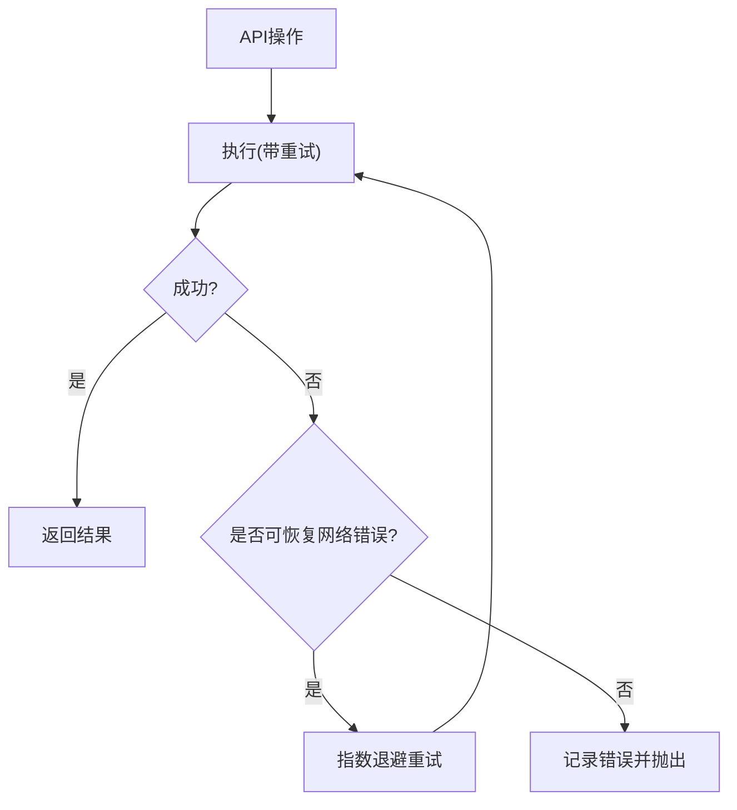
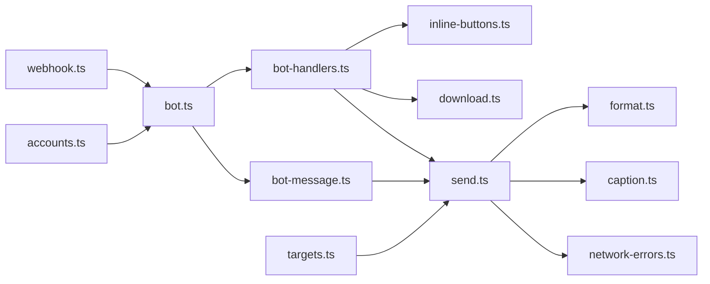

# Telegram工具

<cite>
**本文档引用的文件**
- [src/telegram/index.ts](file://src/telegram/index.ts)
- [src/telegram/bot.ts](file://src/telegram/bot.ts)
- [src/telegram/bot-handlers.ts](file://src/telegram/bot-handlers.ts)
- [src/telegram/bot-message.ts](file://src/telegram/bot-message.ts)
- [src/telegram/inline-buttons.ts](file://src/telegram/inline-buttons.ts)
- [src/telegram/send.ts](file://src/telegram/send.ts)
- [src/telegram/webhook.ts](file://src/telegram/webhook.ts)
- [src/telegram/accounts.ts](file://src/telegram/accounts.ts)
- [src/telegram/targets.ts](file://src/telegram/targets.ts)
- [src/telegram/caption.ts](file://src/telegram/caption.ts)
- [src/telegram/format.ts](file://src/telegram/format.ts)
- [src/telegram/network-errors.ts](file://src/telegram/network-errors.ts)
- [src/telegram/download.ts](file://src/telegram/download.ts)
- [extensions/telegram/openclaw.plugin.json](file://extensions/telegram/openclaw.plugin.json)
</cite>

## 目录

1. [简介](#简介)
2. [项目结构](#项目结构)
3. [核心组件](#核心组件)
4. [架构总览](#架构总览)
5. [详细组件分析](#详细组件分析)
6. [依赖关系分析](#依赖关系分析)
7. [性能考量](#性能考量)
8. [故障排查指南](#故障排查指南)
9. [结论](#结论)
10. [附录](#附录)

## 简介

本文件面向Telegram渠道专用工具，系统化阐述其架构与实现要点，覆盖机器人功能、Inline按钮、媒体处理与消息路由机制；同时详解命令处理、回调查询与更新监听流程，Inline按钮系统的创建、交互与状态管理，以及媒体上传下载能力。文档还提供消息上下文管理（会话跟踪、用户状态与消息链管理）的方法论，包含Telegram API集成、Webhook配置、错误处理与速率限制策略。

## 项目结构

Telegram工具位于src/telegram目录，采用按职责分层的模块化组织：

- 入口与导出：index.ts统一导出对外接口（机器人创建、Webhook启动、发送与监控等）
- 机器人内核：bot.ts负责Bot实例构建、中间件、去重、顺序化与全局错误捕获
- 处理器：bot-handlers.ts注册各类事件处理器（消息、回调、迁移、反应等）
- 消息处理管线：bot-message.ts构建上下文并调度分发
- 发送与格式化：send.ts封装发送、编辑、删除、反应、键盘构建与HTML渲染
- Webhook：webhook.ts提供HTTP服务与setWebhook配置
- 配置与账户：accounts.ts解析账户与令牌，targets.ts解析目标
- 媒体与下载：download.ts封装Telegram文件信息获取与下载保存
- 工具与策略：inline-buttons.ts、caption.ts、format.ts、network-errors.ts等

图表来源

- [src/telegram/bot.ts](file://src/telegram/bot.ts#L112-L494)
- [src/telegram/bot-handlers.ts](file://src/telegram/bot-handlers.ts#L45-L938)
- [src/telegram/bot-message.ts](file://src/telegram/bot-message.ts#L27-L92)
- [src/telegram/send.ts](file://src/telegram/send.ts#L232-L785)
- [src/telegram/webhook.ts](file://src/telegram/webhook.ts#L19-L127)
- [src/telegram/accounts.ts](file://src/telegram/accounts.ts#L85-L139)
- [src/telegram/targets.ts](file://src/telegram/targets.ts#L36-L56)
- [src/telegram/inline-buttons.ts](file://src/telegram/inline-buttons.ts#L44-L82)
- [src/telegram/download.ts](file://src/telegram/download.ts#L11-L57)
- [src/telegram/format.ts](file://src/telegram/format.ts#L40-L79)
- [src/telegram/caption.ts](file://src/telegram/caption.ts#L3-L15)
- [src/telegram/network-errors.ts](file://src/telegram/network-errors.ts#L118-L150)

章节来源

- [src/telegram/index.ts](file://src/telegram/index.ts#L1-L5)
- [src/telegram/bot.ts](file://src/telegram/bot.ts#L112-L494)

## 核心组件

- 机器人内核与中间件
  - 构建Bot实例，启用API限流与顺序化执行，统一错误捕获
  - 去重与更新偏移记录，避免重复处理与消息回放
- 事件处理器
  - 注册消息、回调查询、群组迁移、反应等事件处理
  - 支持文本片段合并、媒体组聚合、分页与模型选择Inline按钮
- 消息处理管线
  - 构建上下文（含历史、会话键、线程ID、允许来源），分发到自动回复或技能
- 发送与编辑
  - 统一封装发送、编辑、删除、反应，支持HTML渲染、链接预览、静默通知、回复参数
  - 自动根据媒体类型选择最佳发送方式（照片/视频/动画/音频/文档），并处理超长标题拆分
- Webhook与轮询
  - 提供HTTP Webhook服务，自动设置Webhook与allowed_updates
  - 可扩展为轮询模式（未在本文件中展开）
- 账户与目标解析
  - 解析多账户配置、令牌来源与默认账户
  - 解析目标聊天ID、论坛主题ID与内部前缀剥离
- Inline按钮系统
  - 解析按钮作用域（关闭/私聊/群组/全部/白名单）
  - 构建“提供者/模型”选择键盘，支持分页与选择后转为合成命令
- 媒体下载
  - 获取Telegram文件信息，下载并保存到本地存储，推断MIME并修正扩展名
- 错误与网络策略
  - 判定可恢复网络错误，统一日志与重试包装
  - 速率限制通过grammy内置throttler与自定义重试策略协同

章节来源

- [src/telegram/bot.ts](file://src/telegram/bot.ts#L112-L494)
- [src/telegram/bot-handlers.ts](file://src/telegram/bot-handlers.ts#L45-L938)
- [src/telegram/bot-message.ts](file://src/telegram/bot-message.ts#L27-L92)
- [src/telegram/send.ts](file://src/telegram/send.ts#L232-L785)
- [src/telegram/webhook.ts](file://src/telegram/webhook.ts#L19-L127)
- [src/telegram/accounts.ts](file://src/telegram/accounts.ts#L85-L139)
- [src/telegram/targets.ts](file://src/telegram/targets.ts#L36-L56)
- [src/telegram/inline-buttons.ts](file://src/telegram/inline-buttons.ts#L44-L82)
- [src/telegram/download.ts](file://src/telegram/download.ts#L11-L57)
- [src/telegram/network-errors.ts](file://src/telegram/network-errors.ts#L118-L150)

## 架构总览

下图展示从Webhook接收更新到消息处理与响应的端到端流程，以及Inline按钮交互与媒体下载的关键路径。

图表来源

- [src/telegram/webhook.ts](file://src/telegram/webhook.ts#L46-L110)
- [src/telegram/bot.ts](file://src/telegram/bot.ts#L146-L152)
- [src/telegram/bot-handlers.ts](file://src/telegram/bot-handlers.ts#L677-L783)
- [src/telegram/bot-message.ts](file://src/telegram/bot-message.ts#L51-L91)
- [src/telegram/send.ts](file://src/telegram/send.ts#L232-L592)
- [src/telegram/download.ts](file://src/telegram/download.ts#L11-L57)

## 详细组件分析

### 机器人内核与中间件

- 中间件与顺序化
  - 使用顺序化键按聊天/话题维度串行处理，避免并发冲突
  - 启用API限流器，降低被平台限速风险
- 更新去重与偏移
  - 基于更新ID与内容摘要去重，记录最大update_id以避免重复处理
- 全局错误捕获
  - 统一捕获中间件异常，防止未处理拒绝导致进程退出
- 配置注入
  - 合并账户级配置，解析令牌来源，支持代理与超时设置

图表来源

- [src/telegram/bot.ts](file://src/telegram/bot.ts#L146-L152)
- [src/telegram/bot.ts](file://src/telegram/bot.ts#L170-L183)
- [src/telegram/bot.ts](file://src/telegram/bot.ts#L211-L224)

章节来源

- [src/telegram/bot.ts](file://src/telegram/bot.ts#L112-L494)

### 事件处理器与消息路由

- 回调查询处理
  - 立即应答以避免平台重试
  - 解析按钮数据，按作用域过滤（私聊/群组/白名单）
  - 支持命令分页、模型选择（提供者/列表/选择），并以合成命令形式进入消息处理
- 群组迁移
  - 监听迁移事件，迁移配置并写回配置文件
- 文本片段与媒体组
  - 将接近阈值的粘贴文本合并为一条消息
  - 聚合媒体组，提取各媒体并转为统一引用，再进入消息处理
- 路由与会话
  - 计算peerId、parentPeer与会话键，支持论坛主题线程
  - 结合允许来源、群组策略与配对策略进行访问控制

图表来源

- [src/telegram/bot-handlers.ts](file://src/telegram/bot-handlers.ts#L279-L623)

章节来源

- [src/telegram/bot-handlers.ts](file://src/telegram/bot-handlers.ts#L45-L938)

### Inline按钮系统

- 作用域解析
  - 从账户能力(capabilities)解析按钮作用域，默认白名单
  - 支持关闭、私聊、群组、全部、白名单五种模式
- 目标类型解析
  - 识别直接聊天与群组聊天（基于ID正负号）
- 键盘构建
  - 提供“提供者/模型”选择键盘，支持分页与当前模型高亮
  - 编辑消息失败时的降级处理（删除原消息并重新发送）

图表来源

- [src/telegram/inline-buttons.ts](file://src/telegram/inline-buttons.ts#L44-L82)
- [src/telegram/send.ts](file://src/telegram/send.ts#L208-L230)

章节来源

- [src/telegram/inline-buttons.ts](file://src/telegram/inline-buttons.ts#L1-L82)
- [src/telegram/send.ts](file://src/telegram/send.ts#L208-L230)

### 媒体处理与下载

- 下载流程
  - 通过文件ID获取file_path
  - 下载文件内容，推断MIME类型，保存到本地inbound目录
  - 若缺少contentType则根据MIME补全
- 发送策略
  - 根据媒体类型选择最佳API（照片/视频/动画/音频/文档）
  - 视频可选“视频便签”模式，音频可选“语音消息”模式
  - 超长标题拆分为独立文本消息，保持键盘仅在主消息上

图表来源

- [src/telegram/download.ts](file://src/telegram/download.ts#L11-L57)
- [src/telegram/send.ts](file://src/telegram/send.ts#L385-L569)

章节来源

- [src/telegram/download.ts](file://src/telegram/download.ts#L1-L57)
- [src/telegram/caption.ts](file://src/telegram/caption.ts#L3-L15)
- [src/telegram/send.ts](file://src/telegram/send.ts#L385-L569)

### 消息上下文管理

- 上下文构建
  - 合并历史、允许来源、线程ID、会话键、父peer等
  - 支持DM策略、群组策略与话题路由
- 分发与流式
  - 根据流式模式与文本限制进行分块与流式输出
  - 支持回复模式（首条/最新）与引用回复

图表来源

- [src/telegram/bot-message.ts](file://src/telegram/bot-message.ts#L51-L91)

章节来源

- [src/telegram/bot-message.ts](file://src/telegram/bot-message.ts#L1-L93)

### Webhook配置与API集成

- Webhook服务
  - 创建HTTP服务器，仅接受指定路径与POST请求
  - 健康检查路径与诊断心跳
  - 设置Telegram Webhook，配置secret_token与allowed_updates
- API集成
  - 通过grammy Bot API进行消息发送、编辑、删除、反应
  - 支持代理fetch与超时配置，统一错误日志

图表来源

- [src/telegram/webhook.ts](file://src/telegram/webhook.ts#L46-L110)
- [src/telegram/bot.ts](file://src/telegram/bot.ts#L146-L152)

章节来源

- [src/telegram/webhook.ts](file://src/telegram/webhook.ts#L1-L128)
- [src/telegram/bot.ts](file://src/telegram/bot.ts#L112-L494)

### 错误处理与速率限制

- 可恢复网络错误
  - 基于错误码、名称与消息片段判定，支持发送/轮询/Webhook场景
- 速率限制与重试
  - grammY throttler + 自定义重试策略，结合超时与代理fetch
- API错误日志
  - 包装API操作，统一记录错误详情与敏感信息脱敏

图表来源

- [src/telegram/network-errors.ts](file://src/telegram/network-errors.ts#L118-L150)
- [src/telegram/send.ts](file://src/telegram/send.ts#L272-L286)

章节来源

- [src/telegram/network-errors.ts](file://src/telegram/network-errors.ts#L1-L151)
- [src/telegram/send.ts](file://src/telegram/send.ts#L272-L286)

## 依赖关系分析

- 模块耦合
  - bot.ts为核心入口，依赖accounts.ts、targets.ts、bot-handlers.ts、bot-message.ts
  - bot-handlers.ts依赖inline-buttons.ts、download.ts、send.ts等
  - send.ts依赖format.ts、caption.ts、network-errors.ts
  - webhook.ts依赖bot.ts与allowed-updates解析
- 外部依赖
  - grammY Bot/Transformer-Throttler/Runner
  - Node HTTP服务器与fetch实现（可选代理）

图表来源

- [src/telegram/bot.ts](file://src/telegram/bot.ts#L112-L494)
- [src/telegram/bot-handlers.ts](file://src/telegram/bot-handlers.ts#L45-L938)
- [src/telegram/bot-message.ts](file://src/telegram/bot-message.ts#L27-L92)
- [src/telegram/send.ts](file://src/telegram/send.ts#L232-L785)
- [src/telegram/webhook.ts](file://src/telegram/webhook.ts#L19-L127)
- [src/telegram/accounts.ts](file://src/telegram/accounts.ts#L85-L139)
- [src/telegram/targets.ts](file://src/telegram/targets.ts#L36-L56)
- [src/telegram/inline-buttons.ts](file://src/telegram/inline-buttons.ts#L44-L82)
- [src/telegram/download.ts](file://src/telegram/download.ts#L11-L57)
- [src/telegram/format.ts](file://src/telegram/format.ts#L40-L79)
- [src/telegram/caption.ts](file://src/telegram/caption.ts#L3-L15)
- [src/telegram/network-errors.ts](file://src/telegram/network-errors.ts#L118-L150)

章节来源

- [src/telegram/index.ts](file://src/telegram/index.ts#L1-L5)

## 性能考量

- 顺序化与去重
  - 通过顺序化键与去重机制减少并发冲突与重复处理
- 文本与媒体批处理
  - 文本片段合并与媒体组聚合，降低消息数量与API调用次数
- 流式与分块
  - 按Telegram限制分块输出，避免超限失败
- 代理与超时
  - 通过代理fetch与超时配置提升网络稳定性与可控性

## 故障排查指南

- Webhook无法设置
  - 检查publicUrl可达性、secret_token一致性与allowed_updates配置
- 消息未送达或线程错误
  - 确认message_thread_id是否仍有效，必要时移除线程参数重试
- HTML渲染失败
  - 当出现实体解析错误时，自动回退为纯文本发送
- 文件下载失败
  - 检查file_id有效性、网络连通性与MIME推断结果
- 网络不稳定
  - 利用可恢复错误判定与重试策略，观察诊断日志

章节来源

- [src/telegram/webhook.ts](file://src/telegram/webhook.ts#L99-L110)
- [src/telegram/send.ts](file://src/telegram/send.ts#L353-L382)
- [src/telegram/network-errors.ts](file://src/telegram/network-errors.ts#L118-L150)
- [src/telegram/download.ts](file://src/telegram/download.ts#L16-L27)

## 结论

该Telegram工具以grammy为核心，结合严格的顺序化、去重与错误处理策略，提供了稳定的消息路由与丰富的交互能力。Inline按钮系统与媒体处理模块增强了用户体验与自动化能力；Webhook配置与速率限制策略确保了生产环境的可靠性与可维护性。通过清晰的模块边界与可测试的接口，系统具备良好的扩展性与演进空间。

## 附录

- 插件声明
  - 扩展插件清单中声明Telegram通道支持，便于在OpenClaw生态中集成与发现

章节来源

- [extensions/telegram/openclaw.plugin.json](file://extensions/telegram/openclaw.plugin.json#L1-L10)
