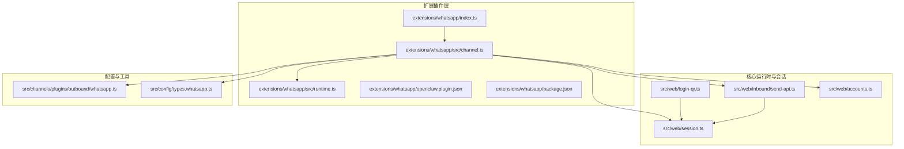
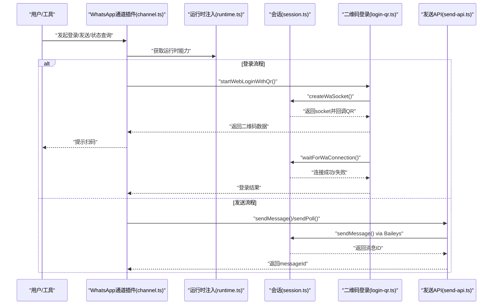
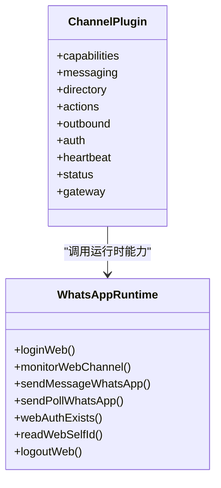
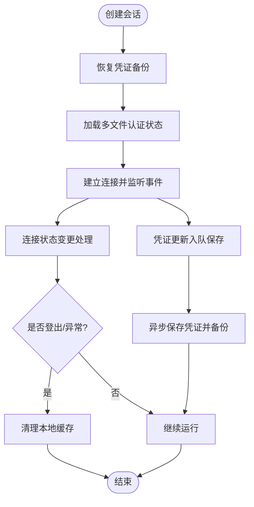
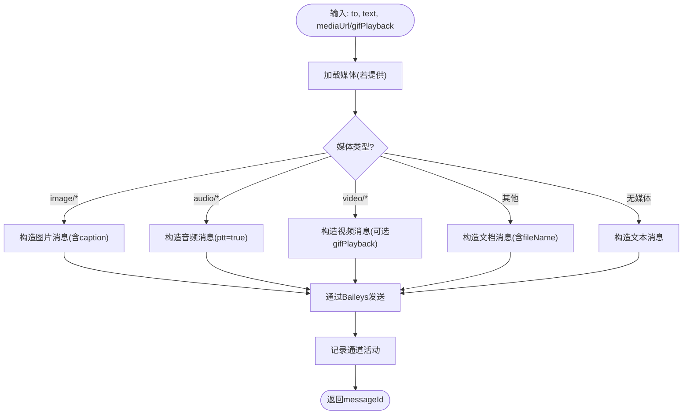
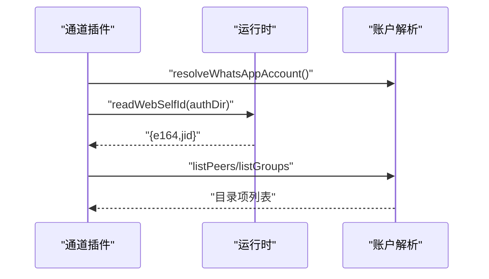
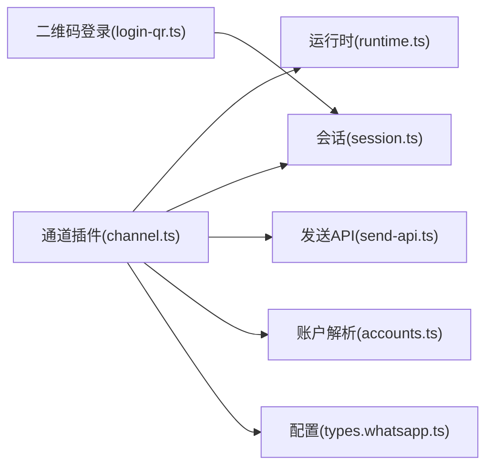

# WhatsApp工具

<cite>
**本文引用的文件**
- [extensions/whatsapp/index.ts](file://extensions/whatsapp/index.ts)
- [extensions/whatsapp/src/channel.ts](file://extensions/whatsapp/src/channel.ts)
- [extensions/whatsapp/src/runtime.ts](file://extensions/whatsapp/src/runtime.ts)
- [extensions/whatsapp/openclaw.plugin.json](file://extensions/whatsapp/openclaw.plugin.json)
- [extensions/whatsapp/package.json](file://extensions/whatsapp/package.json)
- [src/web/session.ts](file://src/web/session.ts)
- [src/web/login-qr.ts](file://src/web/login-qr.ts)
- [src/web/inbound/send-api.ts](file://src/web/inbound/send-api.ts)
- [src/web/accounts.ts](file://src/web/accounts.ts)
- [src/channels/plugins/outbound/whatsapp.ts](file://src/channels/plugins/outbound/whatsapp.ts)
- [src/config/types.whatsapp.ts](file://src/config/types.whatsapp.ts)
- [src/web/inbound.test.ts](file://src/web/inbound.test.ts)
- [src/web/outbound.test.ts](file://src/web/outbound.test.ts)
</cite>

## 目录

1. [简介](#简介)
2. [项目结构](#项目结构)
3. [核心组件](#核心组件)
4. [架构总览](#架构总览)
5. [详细组件分析](#详细组件分析)
6. [依赖关系分析](#依赖关系分析)
7. [性能考量](#性能考量)
8. [故障排查指南](#故障排查指南)
9. [结论](#结论)
10. [附录](#附录)

## 简介

本文件为WhatsApp渠道专用工具的技术文档，面向开发者与运维人员，系统性阐述基于Baileys的WhatsApp通道实现，覆盖以下主题：

- 架构设计：插件化通道、运行时注入、会话管理与错误处理
- 联系人管理：自我身份识别、联系人与群组目录查询
- 群组操作：群组创建、成员管理与权限策略
- 消息发送：文本、媒体（图片/音频/视频/文档）、投票与位置信息
- 状态同步：在线状态、输入状态与最后Seen时间管理
- 设备认证：二维码登录流程与会话持久化
- 错误处理：连接中断、登出、重启与凭证备份恢复

## 项目结构

WhatsApp通道由“扩展插件层 + 核心运行时 + 会话与登录层 + 配置类型”构成，采用分层解耦设计，便于在不同运行环境中复用。

图表来源

- [extensions/whatsapp/index.ts](file://extensions/whatsapp/index.ts#L1-L18)
- [extensions/whatsapp/src/channel.ts](file://extensions/whatsapp/src/channel.ts#L1-L498)
- [extensions/whatsapp/src/runtime.ts](file://extensions/whatsapp/src/runtime.ts#L1-L15)
- [extensions/whatsapp/openclaw.plugin.json](file://extensions/whatsapp/openclaw.plugin.json#L1-L10)
- [extensions/whatsapp/package.json](file://extensions/whatsapp/package.json#L1-L16)
- [src/web/session.ts](file://src/web/session.ts#L94-L165)
- [src/web/login-qr.ts](file://src/web/login-qr.ts#L108-L214)
- [src/web/inbound/send-api.ts](file://src/web/inbound/send-api.ts#L6-L63)
- [src/web/accounts.ts](file://src/web/accounts.ts#L114-L134)
- [src/channels/plugins/outbound/whatsapp.ts](file://src/channels/plugins/outbound/whatsapp.ts#L49-L80)
- [src/config/types.whatsapp.ts](file://src/config/types.whatsapp.ts#L105-L135)

章节来源

- [extensions/whatsapp/index.ts](file://extensions/whatsapp/index.ts#L1-L18)
- [extensions/whatsapp/src/channel.ts](file://extensions/whatsapp/src/channel.ts#L1-L498)
- [extensions/whatsapp/src/runtime.ts](file://extensions/whatsapp/src/runtime.ts#L1-L15)
- [extensions/whatsapp/openclaw.plugin.json](file://extensions/whatsapp/openclaw.plugin.json#L1-L10)
- [extensions/whatsapp/package.json](file://extensions/whatsapp/package.json#L1-L16)
- [src/web/session.ts](file://src/web/session.ts#L94-L165)
- [src/web/login-qr.ts](file://src/web/login-qr.ts#L108-L214)
- [src/web/inbound/send-api.ts](file://src/web/inbound/send-api.ts#L6-L63)
- [src/web/accounts.ts](file://src/web/accounts.ts#L114-L134)
- [src/channels/plugins/outbound/whatsapp.ts](file://src/channels/plugins/outbound/whatsapp.ts#L49-L80)
- [src/config/types.whatsapp.ts](file://src/config/types.whatsapp.ts#L105-L135)

## 核心组件

- 插件注册与运行时注入
  - 扩展入口负责注册通道并注入运行时，使通道能力可被上层调用。
- 通道定义（ChannelPlugin）
  - 提供能力声明（聊天类型、投票/反应/媒体支持）、目标解析、消息发送、动作处理、目录查询、心跳与状态收集等。
- 会话与登录
  - 基于Baileys多文件认证存储，提供二维码登录、连接等待、错误处理与凭证备份恢复。
- 发送API
  - 统一封装文本、媒体、投票与位置消息的发送逻辑，并记录通道活动。
- 配置与账户解析
  - 支持账户级配置（启用、策略、历史限制、允许来源等），并解析认证目录与兼容旧版路径。

章节来源

- [extensions/whatsapp/index.ts](file://extensions/whatsapp/index.ts#L6-L15)
- [extensions/whatsapp/src/channel.ts](file://extensions/whatsapp/src/channel.ts#L37-L498)
- [src/web/session.ts](file://src/web/session.ts#L94-L165)
- [src/web/login-qr.ts](file://src/web/login-qr.ts#L108-L214)
- [src/web/inbound/send-api.ts](file://src/web/inbound/send-api.ts#L6-L63)
- [src/web/accounts.ts](file://src/web/accounts.ts#L114-L134)
- [src/config/types.whatsapp.ts](file://src/config/types.whatsapp.ts#L105-L135)

## 架构总览

下图展示从通道插件到Baileys会话、再到发送与状态管理的整体交互。

图表来源

- [extensions/whatsapp/src/channel.ts](file://extensions/whatsapp/src/channel.ts#L356-L388)
- [extensions/whatsapp/src/runtime.ts](file://extensions/whatsapp/src/runtime.ts#L5-L14)
- [src/web/session.ts](file://src/web/session.ts#L94-L165)
- [src/web/login-qr.ts](file://src/web/login-qr.ts#L108-L214)
- [src/web/inbound/send-api.ts](file://src/web/inbound/send-api.ts#L6-L63)

## 详细组件分析

### 通道插件与能力声明

- 能力与特性
  - 支持直聊与群聊、投票、反应、媒体发送。
  - 目标解析器接受E.164或群JID格式。
- 安全与策略
  - 支持直接消息策略（如配对模式）与允许来源白名单。
  - 对群组策略进行安全警告与建议。
- 目录与动作
  - 自我身份查询、联系人与群组目录列举、反应动作处理。
- 心跳与状态
  - 就绪检查、心跳收件人解析、状态快照构建与问题收集。
- 网关与登录
  - 提供网关启动、二维码登录开始/等待、登出清理。

图表来源

- [extensions/whatsapp/src/channel.ts](file://extensions/whatsapp/src/channel.ts#L37-L498)
- [extensions/whatsapp/src/runtime.ts](file://extensions/whatsapp/src/runtime.ts#L5-L14)

章节来源

- [extensions/whatsapp/src/channel.ts](file://extensions/whatsapp/src/channel.ts#L37-L498)

### 设备认证与二维码登录

- 流程要点
  - 解析账户与认证目录，若已链接且非强制重连则提示。
  - 启动会话并监听QR事件，渲染二维码数据。
  - 等待连接，处理登出、重启请求码等特殊场景。
- 错误处理
  - 登出：清理本地缓存并提示重新扫码。
  - 重启：针对特定错误码尝试一次重启。
  - 超时：超时后清理活跃登录并提示重新发起。

```mermaid
sequenceDiagram
participant CLI as "CLI/调用方"
participant QR as "startWebLoginWithQr"
participant Sess as "createWaSocket"
participant Wait as "waitForWaConnection"
CLI->>QR : "请求生成二维码"
QR->>Sess : "创建socket并设置onQr回调"
Sess-->>QR : "返回socket并触发QR"
QR-->>CLI : "返回二维码数据URL"
CLI->>QR : "等待登录完成"
QR->>Wait : "等待连接事件"
alt 连接成功
Wait-->>QR : "resolve"
QR-->>CLI : "登录成功"
else 登出/错误
Wait-->>QR : "reject with error"
QR-->>CLI : "错误提示并清理"
end
```

图表来源

- [src/web/login-qr.ts](file://src/web/login-qr.ts#L108-L214)
- [src/web/session.ts](file://src/web/session.ts#L94-L165)

章节来源

- [src/web/login-qr.ts](file://src/web/login-qr.ts#L108-L214)
- [src/web/session.ts](file://src/web/session.ts#L94-L165)

### 会话管理与凭证持久化

- 多文件认证状态
  - 使用Baileys多文件认证状态，确保断线后可恢复。
- 凭证保存队列
  - 串行化保存以避免竞态；保存前备份，崩溃后可恢复。
- 连接事件与错误
  - 记录连接状态变化、WebSocket错误与连接关闭原因。
- 会话生命周期
  - 创建、等待连接、错误处理、关闭与清理。

图表来源

- [src/web/session.ts](file://src/web/session.ts#L33-L88)
- [src/web/session.ts](file://src/web/session.ts#L94-L165)

章节来源

- [src/web/session.ts](file://src/web/session.ts#L33-L88)
- [src/web/session.ts](file://src/web/session.ts#L94-L165)

### 消息发送工具

- 文本消息
  - 直接封装为文本内容并发送。
- 媒体消息
  - 图片：带标题（caption）
  - 语音/音频：ptt=true
  - 视频：可选gif回放
  - 其他：作为文档发送，附文件名
- 投票消息
  - 支持问题、选项与最大选择数。
- 位置消息
  - 支持静态地点与实时位置，提取经纬度、精度、名称、地址、说明与类型。

图表来源

- [src/web/inbound/send-api.ts](file://src/web/inbound/send-api.ts#L6-L63)
- [src/web/outbound.test.ts](file://src/web/outbound.test.ts#L90-L134)
- [src/web/inbound.test.ts](file://src/web/inbound.test.ts#L196-L237)

章节来源

- [src/web/inbound/send-api.ts](file://src/web/inbound/send-api.ts#L6-L63)
- [src/web/outbound.test.ts](file://src/web/outbound.test.ts#L90-L134)
- [src/web/inbound.test.ts](file://src/web/inbound.test.ts#L196-L237)

### 联系人管理与目录

- 自我身份
  - 从认证目录读取e164或jid，用于显示与日志。
- 目录查询
  - 列举联系人与群组，支持从配置中解析。
- 目标解析
  - 支持E.164与群JID，群聊直接放行，私聊按策略与白名单过滤。

图表来源

- [extensions/whatsapp/src/channel.ts](file://extensions/whatsapp/src/channel.ts#L227-L244)
- [src/web/accounts.ts](file://src/web/accounts.ts#L114-L134)

章节来源

- [extensions/whatsapp/src/channel.ts](file://extensions/whatsapp/src/channel.ts#L227-L244)
- [src/web/accounts.ts](file://src/web/accounts.ts#L114-L134)

### 群组操作与权限控制

- 群组策略
  - 支持开放/白名单策略，结合允许来源与提及要求。
- 工具策略
  - 基于配置决定是否允许在群组中执行某些工具动作。
- 成员管理
  - 通过群JID进行消息路由与权限校验。

章节来源

- [extensions/whatsapp/src/channel.ts](file://extensions/whatsapp/src/channel.ts#L200-L205)
- [src/config/types.whatsapp.ts](file://src/config/types.whatsapp.ts#L105-L135)

### 状态同步与心跳

- 在线状态
  - 通过会话事件与运行时快照维护连接状态与重连次数。
- 输入状态与最后Seen
  - 通道层提供状态汇总与快照构建，便于UI与监控展示。
- 心跳
  - 解析心跳收件人，按可见性与指示器类型发送“OK”反馈。

章节来源

- [extensions/whatsapp/src/channel.ts](file://extensions/whatsapp/src/channel.ts#L389-L459)
- [src/web/auto-reply/heartbeat-runner.ts](file://src/web/auto-reply/heartbeat-runner.ts#L245-L282)

## 依赖关系分析

- 插件与运行时
  - 通道插件通过运行时注入获取底层能力，避免硬编码。
- 通道与会话
  - 通道调用运行时的登录、监控、发送与登出接口，会话层负责Baileys集成。
- 通道与发送API
  - 发送API统一封装消息类型映射与通道活动记录。
- 配置与账户
  - 账户解析与认证目录兼容新旧路径，保障迁移平滑。

图表来源

- [extensions/whatsapp/src/channel.ts](file://extensions/whatsapp/src/channel.ts#L1-L498)
- [extensions/whatsapp/src/runtime.ts](file://extensions/whatsapp/src/runtime.ts#L1-L15)
- [src/web/session.ts](file://src/web/session.ts#L94-L165)
- [src/web/login-qr.ts](file://src/web/login-qr.ts#L108-L214)
- [src/web/inbound/send-api.ts](file://src/web/inbound/send-api.ts#L6-L63)
- [src/web/accounts.ts](file://src/web/accounts.ts#L114-L134)
- [src/config/types.whatsapp.ts](file://src/config/types.whatsapp.ts#L105-L135)

章节来源

- [extensions/whatsapp/src/channel.ts](file://extensions/whatsapp/src/channel.ts#L1-L498)
- [extensions/whatsapp/src/runtime.ts](file://extensions/whatsapp/src/runtime.ts#L1-L15)
- [src/web/session.ts](file://src/web/session.ts#L94-L165)
- [src/web/login-qr.ts](file://src/web/login-qr.ts#L108-L214)
- [src/web/inbound/send-api.ts](file://src/web/inbound/send-api.ts#L6-L63)
- [src/web/accounts.ts](file://src/web/accounts.ts#L114-L134)
- [src/config/types.whatsapp.ts](file://src/config/types.whatsapp.ts#L105-L135)

## 性能考量

- 凭证保存串行化
  - 通过队列避免并发写入导致的损坏与丢失。
- 媒体发送优化
  - 按类型映射减少转换开销；视频可选gif回放以提升体验。
- 连接事件处理
  - 仅在必要时打印QR，降低I/O与终端压力。
- 心跳与可见性
  - 根据可见性与指示器类型控制反馈，避免冗余消息。

## 故障排查指南

- 登录失败
  - 若出现登出错误，系统会清理本地缓存并提示重新扫码。
  - 若遇到特定重启错误码，将尝试一次性重启连接。
- 连接未完成
  - 等待超时或未扫描时，返回明确提示并可重新发起登录。
- 凭证损坏
  - 保存前进行备份，崩溃后可从备份恢复。
- 媒体发送异常
  - 检查媒体类型与URL加载结果；测试用例覆盖了图片、音频、视频与文档映射。

章节来源

- [src/web/login-qr.ts](file://src/web/login-qr.ts#L262-L284)
- [src/web/session.ts](file://src/web/session.ts#L61-L88)
- [src/web/outbound.test.ts](file://src/web/outbound.test.ts#L90-L134)

## 结论

该WhatsApp工具体系以插件化通道为核心，结合Baileys会话层与完善的认证、发送与状态管理机制，提供了稳定可靠的跨平台消息能力。通过清晰的分层与健壮的错误处理，能够满足生产环境下的设备认证、消息发送与状态同步需求。

## 附录

- 配置字段参考
  - 账户级字段：启用、策略、历史限制、允许来源、群组策略等。
- 关键路径
  - 插件注册与运行时注入：extensions/whatsapp/index.ts, extensions/whatsapp/src/runtime.ts
  - 通道能力与状态：extensions/whatsapp/src/channel.ts
  - 会话与登录：src/web/session.ts, src/web/login-qr.ts
  - 发送API：src/web/inbound/send-api.ts
  - 账户解析：src/web/accounts.ts
  - 配置类型：src/config/types.whatsapp.ts
