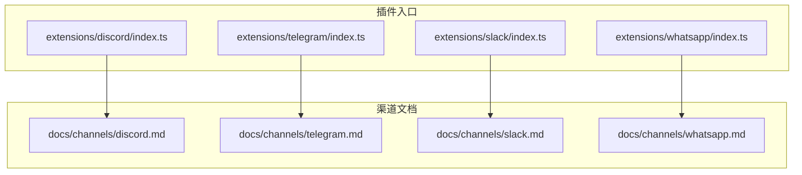
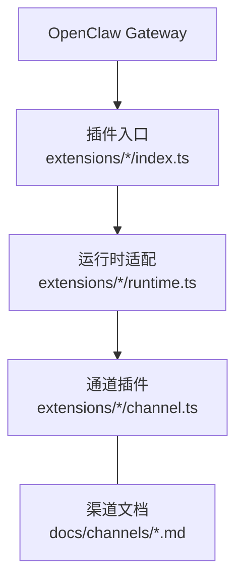
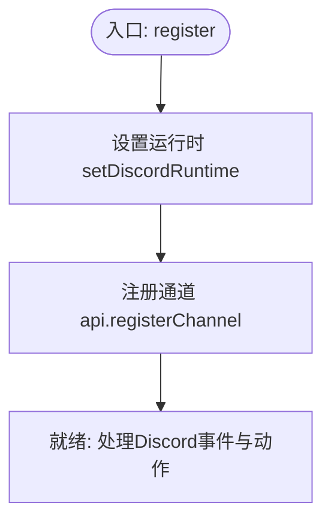
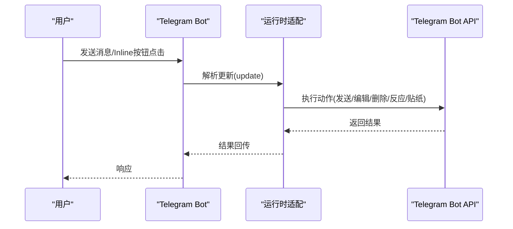
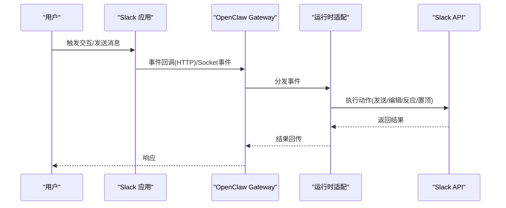
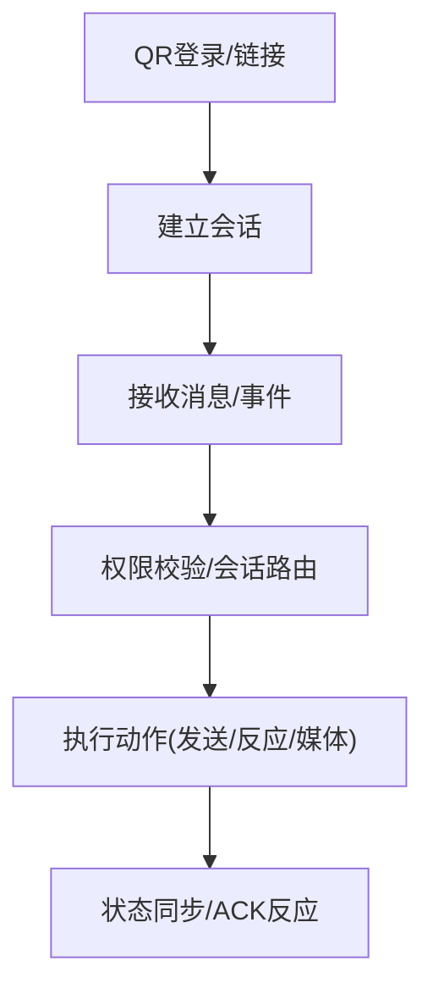
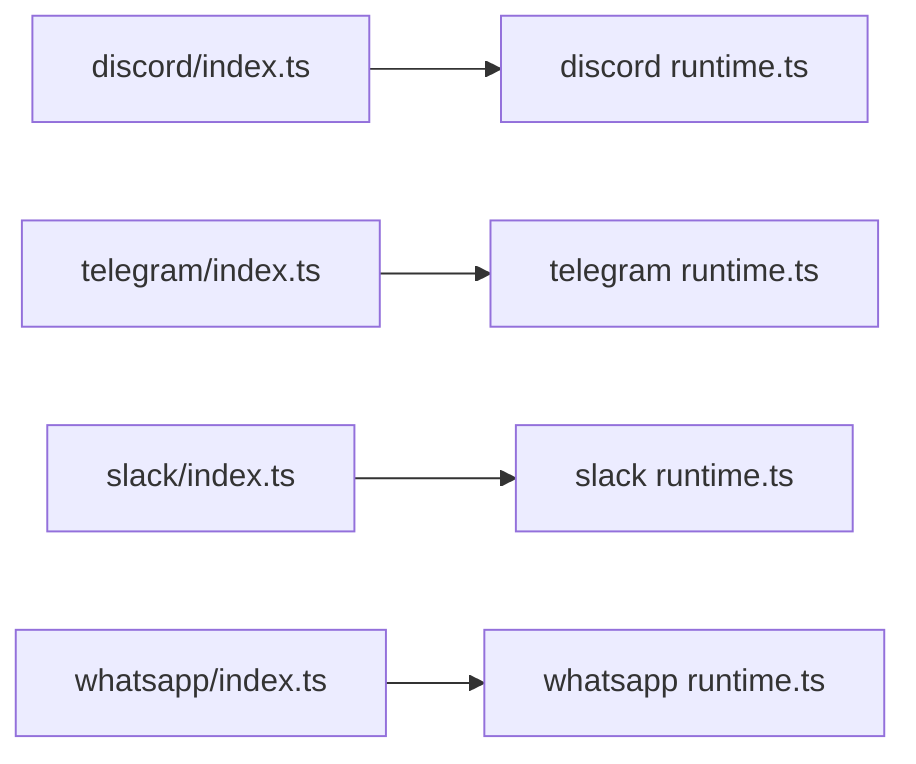

# 渠道专用工具

<cite>
**本文引用的文件**
- [extensions/discord/index.ts](file://extensions/discord/index.ts)
- [extensions/telegram/index.ts](file://extensions/telegram/index.ts)
- [extensions/slack/index.ts](file://extensions/slack/index.ts)
- [extensions/whatsapp/index.ts](file://extensions/whatsapp/index.ts)
- [docs/channels/discord.md](file://docs/channels/discord.md)
- [docs/channels/telegram.md](file://docs/channels/telegram.md)
- [docs/channels/slack.md](file://docs/channels/slack.md)
- [docs/channels/whatsapp.md](file://docs/channels/whatsapp.md)
</cite>

## 目录

1. [简介](#简介)
2. [项目结构](#项目结构)
3. [核心组件](#核心组件)
4. [架构总览](#架构总览)
5. [详细组件分析](#详细组件分析)
6. [依赖关系分析](#依赖关系分析)
7. [性能考量](#性能考量)
8. [故障排查指南](#故障排查指南)
9. [结论](#结论)
10. [附录](#附录)

## 简介

本文件面向OpenClaw渠道专用工具系统，聚焦四个消息渠道（Discord、Telegram、Slack、WhatsApp）的工具实现、API适配与功能扩展。内容覆盖：

- 服务器管理、频道操作与用户权限控制（Discord）
- 机器人功能、Inline按钮与媒体处理（Telegram）
- 集成能力、Block元素与工作流自动化（Slack）
- 联系人管理、群组操作与状态同步（WhatsApp）
- 认证机制、速率限制与错误处理策略

## 项目结构

OpenClaw通过插件化架构在extensions目录下为每个渠道提供独立的插件入口与运行时配置，并在docs/channels中提供详尽的渠道使用与配置说明。

图表来源

- [extensions/discord/index.ts](file://extensions/discord/index.ts#L1-L18)
- [extensions/telegram/index.ts](file://extensions/telegram/index.ts#L1-L18)
- [extensions/slack/index.ts](file://extensions/slack/index.ts#L1-L18)
- [extensions/whatsapp/index.ts](file://extensions/whatsapp/index.ts#L1-L18)
- [docs/channels/discord.md](file://docs/channels/discord.md#L1-L485)
- [docs/channels/telegram.md](file://docs/channels/telegram.md#L1-L697)
- [docs/channels/slack.md](file://docs/channels/slack.md#L1-L455)
- [docs/channels/whatsapp.md](file://docs/channels/whatsapp.md#L1-L435)

章节来源

- [extensions/discord/index.ts](file://extensions/discord/index.ts#L1-L18)
- [extensions/telegram/index.ts](file://extensions/telegram/index.ts#L1-L18)
- [extensions/slack/index.ts](file://extensions/slack/index.ts#L1-L18)
- [extensions/whatsapp/index.ts](file://extensions/whatsapp/index.ts#L1-L18)
- [docs/channels/discord.md](file://docs/channels/discord.md#L1-L485)
- [docs/channels/telegram.md](file://docs/channels/telegram.md#L1-L697)
- [docs/channels/slack.md](file://docs/channels/slack.md#L1-L455)
- [docs/channels/whatsapp.md](file://docs/channels/whatsapp.md#L1-L435)

## 核心组件

- 插件注册器：各渠道插件在入口文件中完成注册，设置运行时并注册通道插件实例。
- 运行时适配：通过setXxxRuntime注入渠道专属运行时，承载连接、事件处理与动作执行。
- 通道插件：封装渠道特有的消息收发、权限校验、会话路由与动作门控等能力。

章节来源

- [extensions/discord/index.ts](file://extensions/discord/index.ts#L6-L15)
- [extensions/telegram/index.ts](file://extensions/telegram/index.ts#L6-L15)
- [extensions/slack/index.ts](file://extensions/slack/index.ts#L6-L15)
- [extensions/whatsapp/index.ts](file://extensions/whatsapp/index.ts#L6-L15)

## 架构总览

OpenClaw的渠道工具采用“插件入口 + 文档配置 + 运行时适配”的分层设计。插件入口负责注册与桥接，运行时适配负责具体平台API调用与事件循环，文档提供配置参考与最佳实践。

图表来源

- [extensions/discord/index.ts](file://extensions/discord/index.ts#L11-L14)
- [extensions/telegram/index.ts](file://extensions/telegram/index.ts#L11-L14)
- [extensions/slack/index.ts](file://extensions/slack/index.ts#L11-L14)
- [extensions/whatsapp/index.ts](file://extensions/whatsapp/index.ts#L11-L14)

## 详细组件分析

### Discord 工具

- 服务器管理与权限控制
  - 支持基于公会（服务器）与角色的访问策略，包括允许列表、禁用与开放模式。
  - 默认提及门控，支持自定义提及模式与回复目标。
  - 可启用PluralKit解析以映射代理身份；支持反应通知与执行审批。
- 频道操作
  - 历史上下文与线程行为：支持线程作为会话键，继承父级配置。
  - 回复标签：支持回复到当前或指定消息ID。
- 动作门控
  - 提供消息、反应、线程、置顶、搜索、成员信息、角色信息、频道信息、语音状态、事件、贴纸、表情上传、权限等动作组的默认开关。
- 配置要点
  - 启动与鉴权：enabled、token、accounts.\*、allowBots。
  - 策略：groupPolicy、dm._、guilds._、guilds._.channels._。
  - 命令与交付：commands.native、configWrites、replyToMode、historyLimit、textChunkLimit、chunkMode、maxLinesPerMessage。
  - 媒体与重试：mediaMaxMb、retry。
  - 动作：actions.\*。
  - 特性：pluralkit、execApprovals、intents、agentComponents、heartbeat、responsePrefix。

图表来源

- [extensions/discord/index.ts](file://extensions/discord/index.ts#L11-L14)

章节来源

- [extensions/discord/index.ts](file://extensions/discord/index.ts#L1-L18)
- [docs/channels/discord.md](file://docs/channels/discord.md#L90-L172)
- [docs/channels/discord.md](file://docs/channels/discord.md#L261-L372)
- [docs/channels/discord.md](file://docs/channels/discord.md#L374-L395)
- [docs/channels/discord.md](file://docs/channels/discord.md#L456-L472)

### Telegram 工具

- 机器人功能
  - 原生命令菜单注册（setMyCommands），支持自定义命令条目。
  - 支持设备配对命令（device-pair插件）。
- Inline按钮与交互
  - 内联按钮作用域可按DM、群组、全部或白名单配置。
  - 回调数据透传为文本给代理。
- 媒体处理
  - 支持音频（语音笔记与音频文件）、视频（视频消息与视频文件）、贴纸（静态下载与缓存）。
  - 支持草稿气泡流式输出（draft streaming）与块流式输出。
- 会话与线程
  - 私聊线程保持线程感知会话键；论坛主题附加topic标识。
- 动作与门控
  - 消息发送、编辑、删除、反应、贴纸等动作；可通过actions.\*进行门控。
- 配置要点
  - 启动与鉴权：enabled、botToken、tokenFile、accounts.\*。
  - 访问控制：dmPolicy、allowFrom、groupPolicy、groupAllowFrom、groups、groups._.topics._。
  - 命令与菜单：commands.native、customCommands。
  - 线程与回复：replyToMode。
  - 流式输出：streamMode、draftChunk、blockStreaming。
  - 格式化与投递：textChunkLimit、chunkMode、linkPreview、responsePrefix。
  - 媒体与网络：mediaMaxMb、timeoutSeconds、retry、network.autoSelectFamily、proxy。
  - Webhook：webhookUrl、webhookSecret、webhookPath。
  - 能力与动作：capabilities.inlineButtons、actions.sendMessage|editMessage|deleteMessage|reactions|sticker。
  - 反应通知：reactionNotifications、reactionLevel。
  - 配置写入与历史：configWrites、historyLimit、dmHistoryLimit、dms.\*.historyLimit。

图表来源

- [extensions/telegram/index.ts](file://extensions/telegram/index.ts#L11-L14)
- [docs/channels/telegram.md](file://docs/channels/telegram.md#L385-L405)

章节来源

- [extensions/telegram/index.ts](file://extensions/telegram/index.ts#L1-L18)
- [docs/channels/telegram.md](file://docs/channels/telegram.md#L104-L206)
- [docs/channels/telegram.md](file://docs/channels/telegram.md#L218-L624)
- [docs/channels/telegram.md](file://docs/channels/telegram.md#L626-L670)
- [docs/channels/telegram.md](file://docs/channels/telegram.md#L672-L691)

### Slack 工具

- 集成能力
  - 支持Socket Mode与HTTP Events API两种接入方式；默认Socket Mode。
  - 用户令牌与机器人令牌组合使用，读写场景按令牌类型选择。
- Block元素与工作流自动化
  - 通过消息块（Blocks）与交互元素（按钮、选择菜单等）构建工作流。
  - 事件订阅覆盖应用提及、消息、反应、成员加入/离开、频道重命名、置顶等。
- 动作与门控
  - 消息、反应、置顶、成员信息、表情列表等动作组默认开启。
- 配置要点
  - 模式与鉴权：mode、botToken、appToken、signingSecret、webhookPath、accounts.\*。
  - DM访问：dm.enabled、dm.policy、dm.allowFrom、dm.groupEnabled、dm.groupChannels。
  - 频道访问：groupPolicy、channels._、channels._.users、channels.\*.requireMention。
  - 线程与历史：replyToMode、replyToModeByChatType、thread._、historyLimit、dmHistoryLimit、dms._.historyLimit。
  - 投递：textChunkLimit、chunkMode、mediaMaxMb。
  - 运维与特性：configWrites、commands.native、slashCommand._、actions._、userToken、userTokenReadOnly。

图表来源

- [extensions/slack/index.ts](file://extensions/slack/index.ts#L11-L14)
- [docs/channels/slack.md](file://docs/channels/slack.md#L24-L121)
- [docs/channels/slack.md](file://docs/channels/slack.md#L264-L277)

章节来源

- [extensions/slack/index.ts](file://extensions/slack/index.ts#L1-L18)
- [docs/channels/slack.md](file://docs/channels/slack.md#L123-L194)
- [docs/channels/slack.md](file://docs/channels/slack.md#L196-L262)
- [docs/channels/slack.md](file://docs/channels/slack.md#L264-L285)
- [docs/channels/slack.md](file://docs/channels/slack.md#L374-L431)
- [docs/channels/slack.md](file://docs/channels/slack.md#L433-L447)

### WhatsApp 工具

- 联系人管理与群组操作
  - 支持个人号与专用号部署模式；默认提及门控，支持会话级激活命令。
  - 自聊天保护：识别自身消息，跳过已读回执与自我提醒。
- 状态同步与会话路由
  - 状态与广播聊天忽略；私聊按会话规则路由；群组会话隔离。
  - 群组未处理消息缓冲注入上下文，支持历史限制配置。
- 媒体与交付
  - 支持图片、视频、音频（含PTT）、文档与贴纸；自动优化与失败回退。
  - 立即确认反应（ackReaction）提升即时反馈体验。
- 配置要点
  - 访问控制：dmPolicy、allowFrom、groupPolicy、groupAllowFrom、groups。
  - 交付：textChunkLimit、chunkMode、mediaMaxMb、sendReadReceipts、ackReaction。
  - 多账户：accounts.<id>.enabled、accounts.<id>.authDir、账户级覆盖。
  - 运维：configWrites、debounceMs、web.enabled、web.heartbeatSeconds、web.reconnect.\*。
  - 会话行为：session.dmScope、historyLimit、dmHistoryLimit、dms.<id>.historyLimit。

图表来源

- [extensions/whatsapp/index.ts](file://extensions/whatsapp/index.ts#L11-L14)
- [docs/channels/whatsapp.md](file://docs/channels/whatsapp.md#L126-L133)
- [docs/channels/whatsapp.md](file://docs/channels/whatsapp.md#L284-L307)
- [docs/channels/whatsapp.md](file://docs/channels/whatsapp.md#L357-L364)

章节来源

- [extensions/whatsapp/index.ts](file://extensions/whatsapp/index.ts#L1-L18)
- [docs/channels/whatsapp.md](file://docs/channels/whatsapp.md#L126-L193)
- [docs/channels/whatsapp.md](file://docs/channels/whatsapp.md#L194-L282)
- [docs/channels/whatsapp.md](file://docs/channels/whatsapp.md#L284-L307)
- [docs/channels/whatsapp.md](file://docs/channels/whatsapp.md#L309-L333)
- [docs/channels/whatsapp.md](file://docs/channels/whatsapp.md#L334-L356)
- [docs/channels/whatsapp.md](file://docs/channels/whatsapp.md#L357-L364)
- [docs/channels/whatsapp.md](file://docs/channels/whatsapp.md#L416-L435)

## 依赖关系分析

- 插件入口与运行时耦合度低：入口仅负责注册与运行时注入，具体平台逻辑由运行时承载。
- 通道插件与文档配置强关联：运行时行为遵循文档中的配置项与默认值。
- 动作门控与安全策略：各渠道均提供动作门控与访问策略，避免越权操作。

图表来源

- [extensions/discord/index.ts](file://extensions/discord/index.ts#L1-L18)
- [extensions/telegram/index.ts](file://extensions/telegram/index.ts#L1-L18)
- [extensions/slack/index.ts](file://extensions/slack/index.ts#L1-L18)
- [extensions/whatsapp/index.ts](file://extensions/whatsapp/index.ts#L1-L18)

章节来源

- [extensions/discord/index.ts](file://extensions/discord/index.ts#L1-L18)
- [extensions/telegram/index.ts](file://extensions/telegram/index.ts#L1-L18)
- [extensions/slack/index.ts](file://extensions/slack/index.ts#L1-L18)
- [extensions/whatsapp/index.ts](file://extensions/whatsapp/index.ts#L1-L18)

## 性能考量

- 并发与限流
  - Telegram长轮询使用grammY运行器，按聊天/线程序列化，整体并发受agents.defaults.maxConcurrent约束。
  - Slack Socket Mode与HTTP Events API均需考虑事件处理吞吐与重试策略。
  - WhatsApp网关维护活跃监听，注意断线重连与媒体传输开销。
- 媒体与文本
  - 合理设置textChunkLimit与chunkMode，减少拆分与往返。
  - 媒体大小限制与自动优化降低带宽与存储压力。
- 会话与历史
  - 适当的历史限制与上下文注入，平衡响应质量与延迟。

## 故障排查指南

- Discord
  - 检查意图与权限、提及要求、群组/频道白名单与用户角色匹配。
  - 使用doctor/status/logs定位权限审计不一致与循环问题。
- Telegram
  - 非提及消息无响应通常与隐私模式相关；命令不可用多因DNS/HTTPS可达性或权限不足。
  - 长轮询/网络不稳定时检查IPv6出站与DNS解析。
- Slack
  - Socket模式无法连接检查令牌与Socket Mode启用；HTTP模式核对签名密钥与Webhook路径。
  - 原生/单命令模式差异导致命令不触发时，检查commands.native与slashCommand配置。
- WhatsApp
  - 未链接/断线重连时先doctor与日志；发送失败检查活跃监听与媒体大小限制。

章节来源

- [docs/channels/discord.md](file://docs/channels/discord.md#L396-L454)
- [docs/channels/telegram.md](file://docs/channels/telegram.md#L626-L668)
- [docs/channels/slack.md](file://docs/channels/slack.md#L374-L431)
- [docs/channels/whatsapp.md](file://docs/channels/whatsapp.md#L365-L414)

## 结论

OpenClaw的渠道专用工具通过统一的插件入口与运行时适配，实现了对Discord、Telegram、Slack、WhatsApp四大渠道的深度集成。借助详尽的文档配置与动作门控，系统在保证安全性的同时提供了丰富的消息处理、权限控制与工作流自动化能力。建议在生产环境中结合各渠道的最佳实践与限流策略，持续优化性能与稳定性。

## 附录

- 配置参考与高信号字段可直接查阅各渠道文档中的“配置参考指针”部分，获取更细粒度的参数说明与示例。
