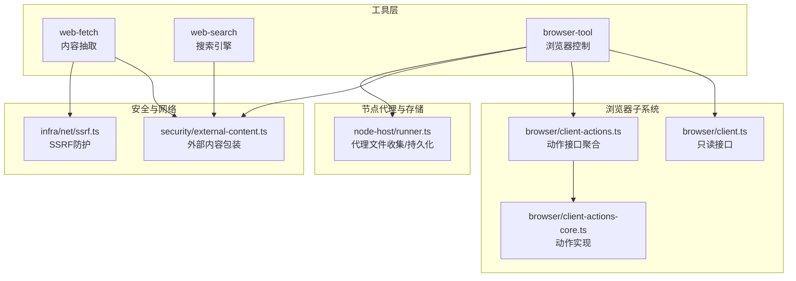
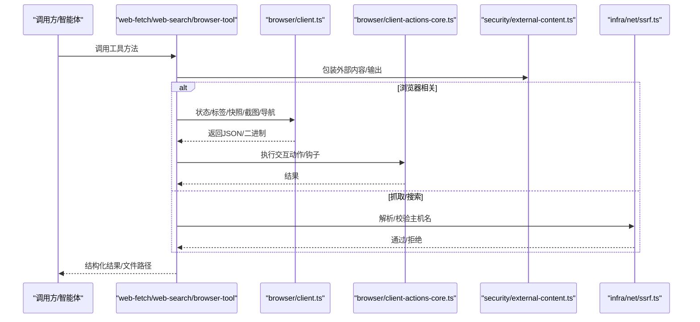
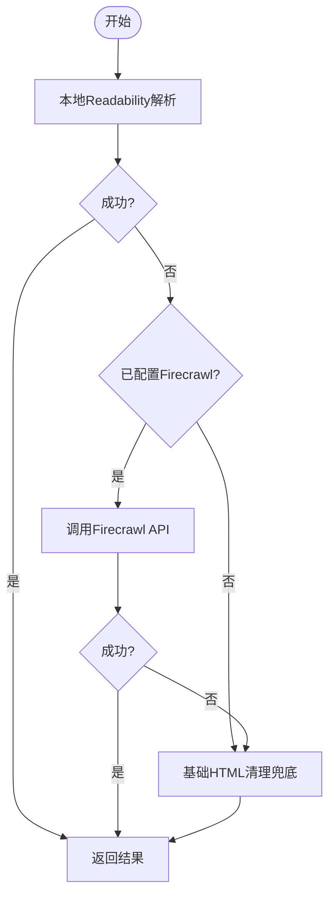
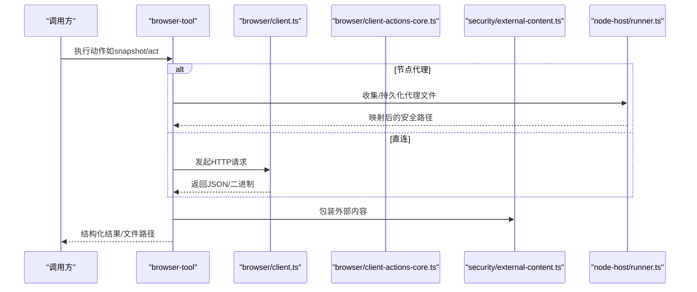
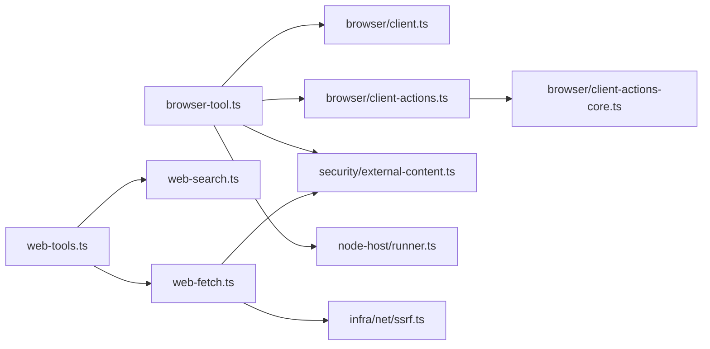

# 网页内容工具

<cite>
**本文引用的文件**
- [src/agents/tools/web-tools.ts](file://src/agents/tools/web-tools.ts)
- [src/agents/tools/web-fetch.ts](file://src/agents/tools/web-fetch.ts)
- [src/agents/tools/web-search.ts](file://src/agents/tools/web-search.ts)
- [src/agents/tools/browser-tool.ts](file://src/agents/tools/browser-tool.ts)
- [src/browser/client.ts](file://src/browser/client.ts)
- [src/browser/client-actions.ts](file://src/browser/client-actions.ts)
- [src/browser/client-actions-core.ts](file://src/browser/client-actions-core.ts)
- [src/agents/tools/web-fetch.ssrf.test.ts](file://src/agents/tools/web-fetch.ssrf.test.ts)
- [src/agents/tools/web-tools.fetch.test.ts](file://src/agents/tools/web-tools.fetch.test.ts)
- [src/infra/net/ssrf.ts](file://src/infra/net/ssrf.ts)
- [src/security/external-content.ts](file://src/security/external-content.ts)
- [src/node-host/runner.ts](file://src/node-host/runner.ts)
- [docs/tools/firecrawl.md](file://docs/tools/firecrawl.md)
</cite>

## 目录

1. [简介](#简介)
2. [项目结构](#项目结构)
3. [核心组件](#核心组件)
4. [架构总览](#架构总览)
5. [组件详解](#组件详解)
6. [依赖关系分析](#依赖关系分析)
7. [性能考量](#性能考量)
8. [故障排查指南](#故障排查指南)
9. [结论](#结论)
10. [附录](#附录)

## 简介

本文件面向OpenClaw网页内容工具系统，系统性阐述网页抓取、内容解析与信息提取的实现机制；记录搜索引擎集成、结果排序与去重策略；覆盖浏览器自动化、页面渲染与交互模拟；提供内容过滤、格式转换与结构化处理方案；并包含反爬虫应对、代理配置与会话管理；解释内容缓存策略、增量更新与性能优化技巧；最后说明Firecrawl集成、SSRF防护与安全扫描机制。

## 项目结构

OpenClaw在“工具层”提供了统一的网页内容能力入口，包括：

- 网页抓取与内容抽取：web-fetch（含Readability本地解析、Firecrawl回退）
- 搜索引擎集成：web-search（支持多源聚合与排序）
- 浏览器控制：browser-tool（状态、标签页、快照、截图、导航、对话框/文件选择钩子、动作执行等）
- 安全与外部内容包装：external-content、SSRF防护
- 节点代理与文件持久化：node-host runner

图表来源

- [src/agents/tools/web-tools.ts](file://src/agents/tools/web-tools.ts#L1-L3)
- [src/agents/tools/web-fetch.ts](file://src/agents/tools/web-fetch.ts)
- [src/agents/tools/web-search.ts](file://src/agents/tools/web-search.ts)
- [src/agents/tools/browser-tool.ts](file://src/agents/tools/browser-tool.ts#L1-L800)
- [src/browser/client.ts](file://src/browser/client.ts#L1-L338)
- [src/browser/client-actions.ts](file://src/browser/client-actions.ts#L1-L5)
- [src/browser/client-actions-core.ts](file://src/browser/client-actions-core.ts)
- [src/security/external-content.ts](file://src/security/external-content.ts#L123-L163)
- [src/infra/net/ssrf.ts](file://src/infra/net/ssrf.ts)
- [src/node-host/runner.ts](file://src/node-host/runner.ts#L290-L326)

章节来源

- [src/agents/tools/web-tools.ts](file://src/agents/tools/web-tools.ts#L1-L3)
- [src/agents/tools/web-fetch.ts](file://src/agents/tools/web-fetch.ts)
- [src/agents/tools/web-search.ts](file://src/agents/tools/web-search.ts)
- [src/agents/tools/browser-tool.ts](file://src/agents/tools/browser-tool.ts#L1-L800)
- [src/browser/client.ts](file://src/browser/client.ts#L1-L338)
- [src/browser/client-actions.ts](file://src/browser/client-actions.ts#L1-L5)
- [src/browser/client-actions-core.ts](file://src/browser/client-actions-core.ts)
- [src/security/external-content.ts](file://src/security/external-content.ts#L123-L163)
- [src/infra/net/ssrf.ts](file://src/infra/net/ssrf.ts)
- [src/node-host/runner.ts](file://src/node-host/runner.ts#L290-L326)

## 核心组件

- 网页抓取与内容抽取
  - 本地Readability解析优先，失败后可回退至Firecrawl（需配置API Key），最终以基础HTML清理兜底。
  - 支持代理模式与缓存策略，提升对JS渲染与反爬站点的适配能力。
- 搜索引擎集成
  - 提供统一的搜索工具，支持多源聚合与排序，结合去重策略输出高质量结果。
- 浏览器自动化
  - 提供状态查询、启动/停止、配置文件夹、标签页管理、快照/截图、导航、控制台日志、PDF导出、文件上传/对话框钩子、以及复杂交互动作（act）。
  - 支持沙箱/宿主机/节点代理三种目标，自动路由到可用节点。
- 内容过滤与格式转换
  - 外部内容统一包装，避免直接注入与结构注入风险；对媒体文件进行类型检测与持久化。
- 反爬虫与安全
  - SSRF域名固定解析与拦截；外部内容包装；安全扫描规则（后续扩展）。

章节来源

- [src/agents/tools/web-fetch.ts](file://src/agents/tools/web-fetch.ts)
- [src/agents/tools/web-search.ts](file://src/agents/tools/web-search.ts)
- [src/agents/tools/browser-tool.ts](file://src/agents/tools/browser-tool.ts#L1-L800)
- [src/browser/client.ts](file://src/browser/client.ts#L1-L338)
- [src/security/external-content.ts](file://src/security/external-content.ts#L123-L163)
- [src/infra/net/ssrf.ts](file://src/infra/net/ssrf.ts)
- [src/node-host/runner.ts](file://src/node-host/runner.ts#L290-L326)

## 架构总览

下图展示从调用到执行的关键链路：工具层调用具体实现，浏览器控制通过HTTP客户端或节点代理访问浏览器服务端，安全模块贯穿于外部数据处理流程。

图表来源

- [src/agents/tools/web-fetch.ts](file://src/agents/tools/web-fetch.ts)
- [src/agents/tools/web-search.ts](file://src/agents/tools/web-search.ts)
- [src/agents/tools/browser-tool.ts](file://src/agents/tools/browser-tool.ts#L1-L800)
- [src/browser/client.ts](file://src/browser/client.ts#L1-L338)
- [src/browser/client-actions-core.ts](file://src/browser/client-actions-core.ts)
- [src/security/external-content.ts](file://src/security/external-content.ts#L123-L163)
- [src/infra/net/ssrf.ts](file://src/infra/net/ssrf.ts)

## 组件详解

### 网页抓取与内容抽取（web-fetch）

- 实现要点
  - 顺序策略：本地Readability → Firecrawl（可选）→ 基础HTML清理。
  - Firecrawl集成：支持代理模式（basic/stealth/auto）、缓存控制、超时设置；当存在API Key时默认启用。
  - SSRF防护：在发起抓取前对主机名进行固定解析与拦截，防止内网/环回地址访问。
  - 外部内容包装：对返回的文本/元数据进行包装，避免直接注入与结构注入风险。
- 关键参数与行为
  - 代理与缓存：maxAgeMs控制缓存有效期；proxy自动选择以提升成功率。
  - 回退策略：Readability失败则尝试Firecrawl；仍失败则使用基础清理。
- 测试与验证
  - 单元测试覆盖了Firecrawl响应、错误场景与SSRF拦截逻辑。

图表来源

- [src/agents/tools/web-fetch.ts](file://src/agents/tools/web-fetch.ts)
- [src/agents/tools/web-tools.fetch.test.ts](file://src/agents/tools/web-tools.fetch.test.ts#L1-L50)
- [docs/tools/firecrawl.md](file://docs/tools/firecrawl.md#L1-L62)

章节来源

- [src/agents/tools/web-fetch.ts](file://src/agents/tools/web-fetch.ts)
- [src/agents/tools/web-tools.fetch.test.ts](file://src/agents/tools/web-tools.fetch.test.ts#L1-L50)
- [src/agents/tools/web-fetch.ssrf.test.ts](file://src/agents/tools/web-fetch.ssrf.test.ts#L1-L50)
- [src/infra/net/ssrf.ts](file://src/infra/net/ssrf.ts)
- [docs/tools/firecrawl.md](file://docs/tools/firecrawl.md#L1-L62)

### 搜索引擎集成（web-search）

- 功能概述
  - 提供统一的搜索工具，支持多源聚合与排序，结合去重策略输出高质量结果。
  - 配合内容过滤与格式转换，确保输出结构化、可读性强且安全。
- 与web-fetch的关系
  - 搜索结果通常需要进一步抓取与解析，可复用web-fetch的抽取链路。

章节来源

- [src/agents/tools/web-search.ts](file://src/agents/tools/web-search.ts)

### 浏览器自动化（browser-tool）

- 能力矩阵
  - 状态与生命周期：status/start/stop/reset-profile/create/delete profile。
  - 标签页管理：list/new/close/select。
  - 视图与交互：snapshot（AI/ARIA格式）、screenshot、navigate、console、pdf、upload、dialog、act。
  - 外部内容包装：对快照、控制台、标签列表等进行安全包装。
  - 文件持久化：代理返回的文件经收集与保存，映射为安全路径。
- 目标路由
  - 支持sandbox/host/node三种目标；当存在节点代理时自动路由；可通过node或target显式指定。
- 参数与默认值
  - 快照默认格式为AI；可按需开启refs/interactive/compact/labels/深度/选择器/框架等。
  - 截图支持PNG/JPEG；PDF导出返回文件路径；上传/对话框钩子支持超时与元素定位。

图表来源

- [src/agents/tools/browser-tool.ts](file://src/agents/tools/browser-tool.ts#L1-L800)
- [src/browser/client.ts](file://src/browser/client.ts#L1-L338)
- [src/browser/client-actions-core.ts](file://src/browser/client-actions-core.ts)
- [src/security/external-content.ts](file://src/security/external-content.ts#L123-L163)
- [src/node-host/runner.ts](file://src/node-host/runner.ts#L290-L326)

章节来源

- [src/agents/tools/browser-tool.ts](file://src/agents/tools/browser-tool.ts#L1-L800)
- [src/browser/client.ts](file://src/browser/client.ts#L1-L338)
- [src/browser/client-actions.ts](file://src/browser/client-actions.ts#L1-L5)
- [src/browser/client-actions-core.ts](file://src/browser/client-actions-core.ts)
- [src/security/external-content.ts](file://src/security/external-content.ts#L123-L163)
- [src/node-host/runner.ts](file://src/node-host/runner.ts#L290-L326)

### 内容过滤、格式转换与结构化处理

- 外部内容包装
  - 对来自浏览器/抓取的文本进行包装，避免直接注入与结构注入风险；可选择是否包含警告信息。
- 媒体与文件处理
  - 代理返回的文件被收集并持久化，映射为安全路径；对图片/PDF等进行类型检测与限制。
- 文本截断与编码
  - 对长文本进行截断；解码时采用UTF-8兜底，保证稳定性。

章节来源

- [src/security/external-content.ts](file://src/security/external-content.ts#L123-L163)
- [src/node-host/runner.ts](file://src/node-host/runner.ts#L290-L326)

### 反爬虫应对、代理配置与会话管理

- Firecrawl代理与缓存
  - 自动代理模式（auto）在基础失败时切换隐身代理，提高成功率但可能消耗更多配额；支持缓存控制与超时设置。
- SSRF防护
  - 在抓取前对主机名进行固定解析与拦截，阻止访问localhost/127.0.0.1/内网等敏感地址。
- 会话与超时
  - 工具层统一设置超时；浏览器动作支持自定义超时；节点代理调用通过网关透传并限制最大超时。

章节来源

- [docs/tools/firecrawl.md](file://docs/tools/firecrawl.md#L1-L62)
- [src/agents/tools/web-fetch.ssrf.test.ts](file://src/agents/tools/web-fetch.ssrf.test.ts#L1-L50)
- [src/agents/tools/web-tools.fetch.test.ts](file://src/agents/tools/web-tools.fetch.test.ts#L1-L50)
- [src/agents/tools/browser-tool.ts](file://src/agents/tools/browser-tool.ts#L1-L800)

### 内容缓存策略、增量更新与性能优化

- Firecrawl缓存
  - 通过maxAgeMs控制缓存有效期，默认2天；storeInCache启用后可显著降低重复请求成本。
- 增量更新建议
  - 基于URL与时间戳的简单缓存键；对频繁访问的页面优先命中缓存，再决定是否回源。
- 性能优化
  - 优先使用高效快照模式（efficient）；合理设置maxChars与深度限制；避免不必要的全页截图与PDF导出。

章节来源

- [docs/tools/firecrawl.md](file://docs/tools/firecrawl.md#L1-L62)

### Firecrawl集成、SSRF防护与安全扫描机制

- Firecrawl集成
  - 当配置API Key时默认启用；支持代理模式与缓存；作为web_fetch的回退方案。
- SSRF防护
  - 在抓取前解析并校验主机名，拦截环回/内网地址，防止内部资源泄露。
- 安全扫描（扩展）
  - 提供规则模板用于检测潜在的数据外泄、混淆代码与环境变量读取等高危行为，便于后续扩展。

章节来源

- [docs/tools/firecrawl.md](file://docs/tools/firecrawl.md#L1-L62)
- [src/agents/tools/web-fetch.ssrf.test.ts](file://src/agents/tools/web-fetch.ssrf.test.ts#L1-L50)
- [src/security/skill-scanner.ts](file://src/security/skill-scanner.ts#L107-L148)

## 依赖关系分析

- 工具层依赖
  - web-tools.ts导出web-fetch与web-search入口。
  - browser-tool.ts依赖browser/client.ts与client-actions-core.ts，并通过网关工具调用节点代理。
- 安全依赖
  - external-content.ts贯穿于浏览器与抓取输出；ssrf.ts在抓取前进行主机名解析与拦截。
- 存储与代理
  - node-host/runner.ts负责代理文件的收集、大小限制与MIME检测，并持久化为安全路径。

图表来源

- [src/agents/tools/web-tools.ts](file://src/agents/tools/web-tools.ts#L1-L3)
- [src/agents/tools/web-fetch.ts](file://src/agents/tools/web-fetch.ts)
- [src/agents/tools/web-search.ts](file://src/agents/tools/web-search.ts)
- [src/agents/tools/browser-tool.ts](file://src/agents/tools/browser-tool.ts#L1-L800)
- [src/browser/client.ts](file://src/browser/client.ts#L1-L338)
- [src/browser/client-actions.ts](file://src/browser/client-actions.ts#L1-L5)
- [src/browser/client-actions-core.ts](file://src/browser/client-actions-core.ts)
- [src/security/external-content.ts](file://src/security/external-content.ts#L123-L163)
- [src/infra/net/ssrf.ts](file://src/infra/net/ssrf.ts)
- [src/node-host/runner.ts](file://src/node-host/runner.ts#L290-L326)

章节来源

- [src/agents/tools/web-tools.ts](file://src/agents/tools/web-tools.ts#L1-L3)
- [src/agents/tools/browser-tool.ts](file://src/agents/tools/browser-tool.ts#L1-L800)
- [src/browser/client.ts](file://src/browser/client.ts#L1-L338)
- [src/browser/client-actions.ts](file://src/browser/client-actions.ts#L1-L5)
- [src/browser/client-actions-core.ts](file://src/browser/client-actions-core.ts)
- [src/security/external-content.ts](file://src/security/external-content.ts#L123-L163)
- [src/infra/net/ssrf.ts](file://src/infra/net/ssrf.ts)
- [src/node-host/runner.ts](file://src/node-host/runner.ts#L290-L326)

## 性能考量

- 快照与渲染
  - 使用efficient模式减少AI快照体积；限制maxChars与深度；仅在必要时生成全页截图。
- 抓取与缓存
  - 合理设置maxAgeMs与proxy模式；优先命中缓存，降低外部依赖压力。
- 代理与超时
  - 为浏览器动作设置合理超时；节点代理调用受网关限制，避免过长阻塞。

## 故障排查指南

- 浏览器相关
  - 若快照为空或标签异常，检查浏览器状态与目标tab；确认是否使用正确profile（如chrome扩展接管）。
  - 截图/PDF导出失败时，确认目标tab与元素定位；检查文件大小限制与MIME类型。
- 抓取与搜索
  - Firecrawl失败时检查API Key与代理模式；查看缓存是否命中；必要时禁用缓存重试。
  - SSRF拦截导致抓取失败时，检查目标主机名是否在允许范围内。
- 外部内容
  - 若出现注入风险提示，确认external-content包装是否启用；检查输出是否被二次处理。

章节来源

- [src/agents/tools/browser-tool.ts](file://src/agents/tools/browser-tool.ts#L1-L800)
- [src/agents/tools/web-tools.fetch.test.ts](file://src/agents/tools/web-tools.fetch.test.ts#L1-L50)
- [src/agents/tools/web-fetch.ssrf.test.ts](file://src/agents/tools/web-fetch.ssrf.test.ts#L1-L50)
- [src/security/external-content.ts](file://src/security/external-content.ts#L123-L163)

## 结论

OpenClaw网页内容工具体系以“本地优先、回退稳健、安全可控”为核心设计原则：本地解析与基础清理提供快速响应，Firecrawl增强反爬与JS渲染能力，浏览器自动化覆盖复杂交互场景；SSRF与外部内容包装保障安全边界；节点代理与文件持久化提升可运维性。通过合理的缓存与超时策略，系统在准确性、稳定性与性能之间取得平衡。

## 附录

- 配置参考
  - Firecrawl配置项（apiKey、baseUrl、onlyMainContent、maxAgeMs、timeoutSeconds）见文档说明。
- 常见问题
  - Chrome扩展接管需确保已附加目标标签；快照引用需在同一标签内保持稳定。

章节来源

- [docs/tools/firecrawl.md](file://docs/tools/firecrawl.md#L1-L62)
