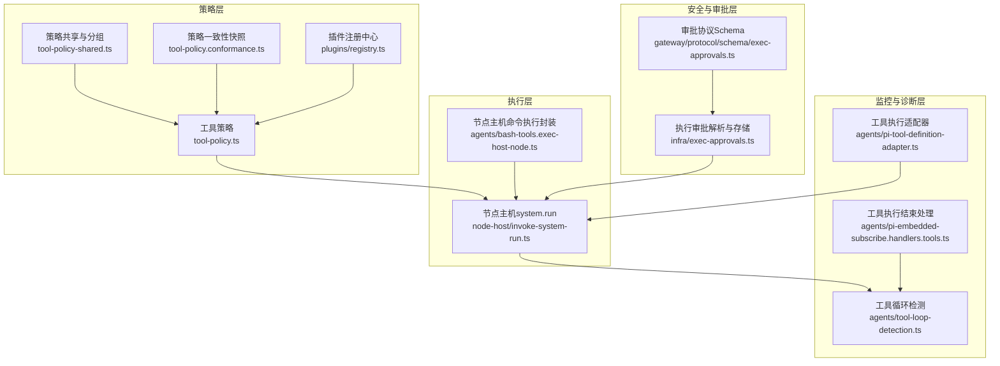
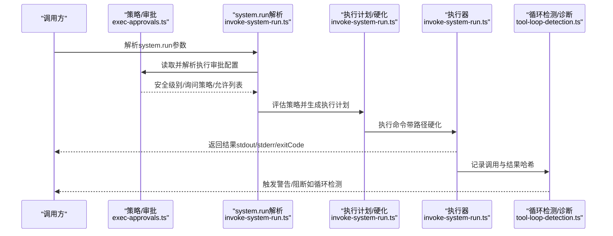
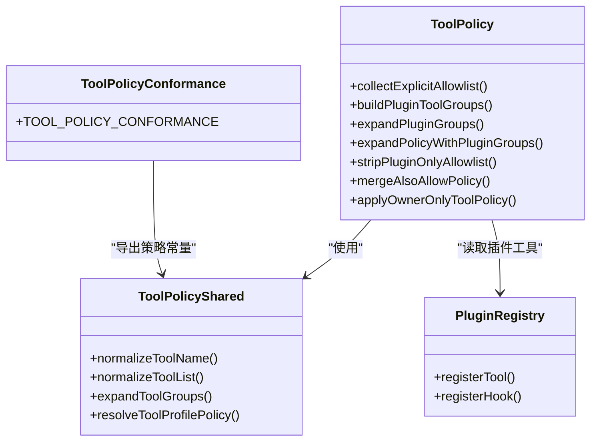
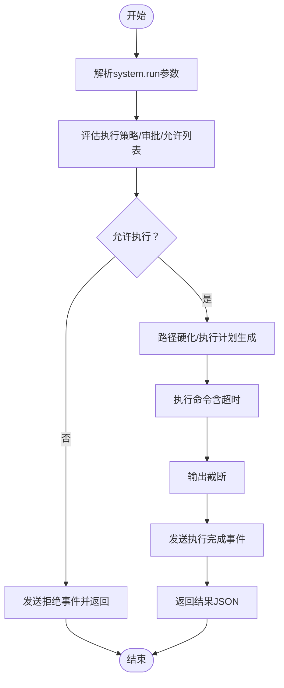
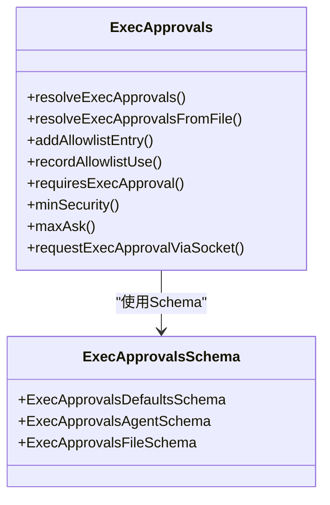
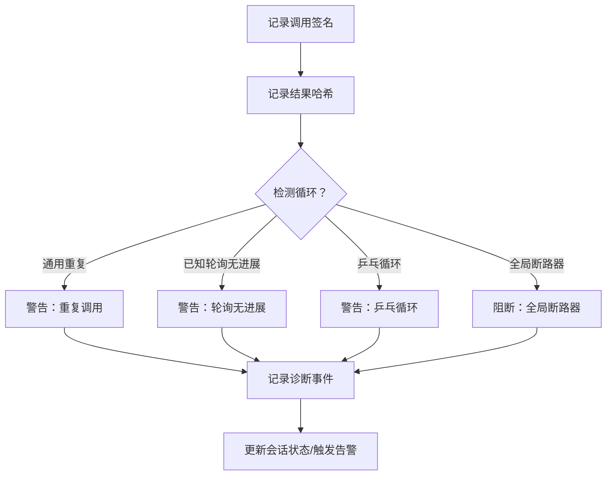
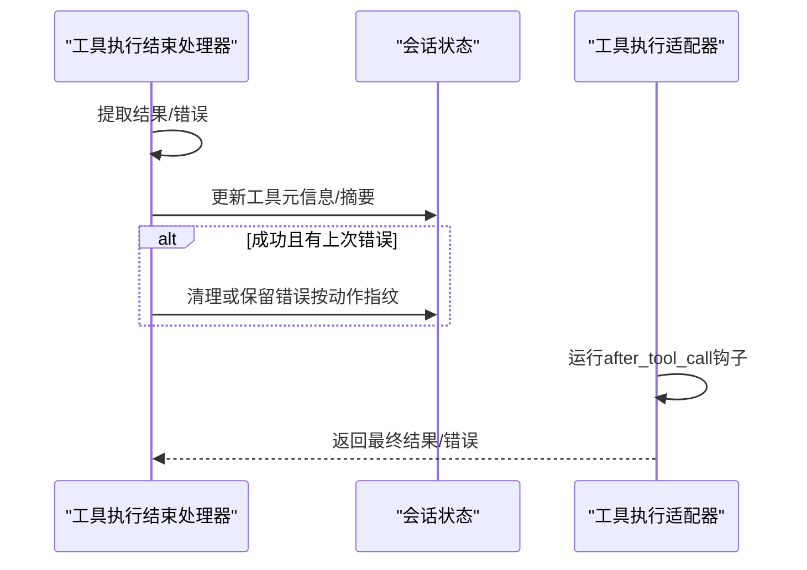
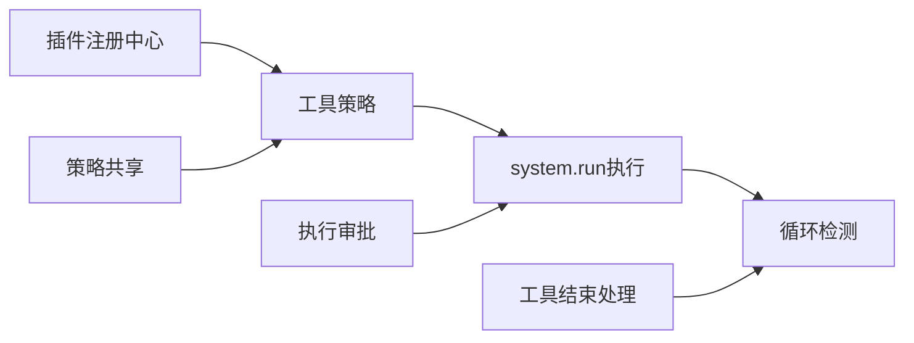

# 工具调用系统

<cite>
**本文档引用的文件**
- [src/agents/tool-loop-detection.ts](file://src/agents/tool-loop-detection.ts)
- [src/node-host/invoke-system-run.ts](file://src/node-host/invoke-system-run.ts)
- [src/agents/bash-tools.exec-host-node.ts](file://src/agents/bash-tools.exec-host-node.ts)
- [src/agents/tool-policy.ts](file://src/agents/tool-policy.ts)
- [src/agents/tool-policy-shared.ts](file://src/agents/tool-policy-shared.ts)
- [src/agents/tool-policy.conformance.ts](file://src/agents/tool-policy.conformance.ts)
- [src/infra/exec-approvals.ts](file://src/infra/exec-approvals.ts)
- [src/agents/tool-loop-detection.test.ts](file://src/agents/tool-loop-detection.test.ts)
- [src/agents/pi-embedded-subscribe.handlers.tools.ts](file://src/agents/pi-embedded-subscribe.handlers.tools.ts)
- [src/agents/pi-tool-definition-adapter.ts](file://src/agents/pi-tool-definition-adapter.ts)
- [src/plugins/registry.ts](file://src/plugins/registry.ts)
- [src/gateway/protocol/schema/exec-approvals.ts](file://src/gateway/protocol/schema/exec-approvals.ts)
- [src/gateway/protocol/schema/agents-models-skills.ts](file://src/gateway/protocol/schema/agents-models-skills.ts)
- [apps/shared/OpenClawKit/Sources/OpenClawProtocol/GatewayModels.swift](file://apps/shared/OpenClawKit/Sources/OpenClawProtocol/GatewayModels.swift)
- [apps/macos/Sources/OpenClawProtocol/GatewayModels.swift](file://apps/macos/Sources/OpenClawProtocol/GatewayModels.swift)
- [extensions/lobster/src/lobster-tool.test.ts](file://extensions/lobster/src/lobster-tool.test.ts)
</cite>

## 目录

1. [简介](#简介)
2. [项目结构](#项目结构)
3. [核心组件](#核心组件)
4. [架构总览](#架构总览)
5. [详细组件分析](#详细组件分析)
6. [依赖关系分析](#依赖关系分析)
7. [性能考量](#性能考量)
8. [故障排查指南](#故障排查指南)
9. [结论](#结论)
10. [附录](#附录)

## 简介

本技术文档面向OpenClaw工具调用系统，系统性阐述工具调用机制、策略管理与执行流程，覆盖工具注册、权限控制与安全边界设计、执行管道、结果处理与错误恢复策略、工具循环检测、性能监控与资源管理，并提供自定义工具开发、集成与优化的完整指南，帮助开发者构建强大的工具调用能力。

## 项目结构

OpenClaw工具调用系统由“策略层”“执行层”“安全与审批层”“监控与诊断层”四大部分组成：

- 策略层：工具策略解析、插件工具注册、工具目录与分组、策略一致性快照
- 执行层：节点主机system.run调用、命令解析与执行计划、输出截断与事件上报
- 安全与审批层：执行审批文件解析、安全级别与询问策略、允许列表与路径硬化
- 监控与诊断层：工具循环检测（通用重复、已知轮询无进展、全局断路器、乒乓循环）、会话状态记录、诊断事件

图表来源

- [src/agents/tool-policy.ts](file://src/agents/tool-policy.ts#L1-L206)
- [src/agents/tool-policy-shared.ts](file://src/agents/tool-policy-shared.ts#L1-L50)
- [src/agents/tool-policy.conformance.ts](file://src/agents/tool-policy.conformance.ts#L1-L18)
- [src/plugins/registry.ts](file://src/plugins/registry.ts#L182-L218)
- [src/node-host/invoke-system-run.ts](file://src/node-host/invoke-system-run.ts#L1-L480)
- [src/agents/bash-tools.exec-host-node.ts](file://src/agents/bash-tools.exec-host-node.ts#L1-L357)
- [src/infra/exec-approvals.ts](file://src/infra/exec-approvals.ts#L1-L559)
- [src/gateway/protocol/schema/exec-approvals.ts](file://src/gateway/protocol/schema/exec-approvals.ts#L1-L50)
- [src/agents/tool-loop-detection.ts](file://src/agents/tool-loop-detection.ts#L1-L624)
- [src/agents/pi-embedded-subscribe.handlers.tools.ts](file://src/agents/pi-embedded-subscribe.handlers.tools.ts#L331-L377)
- [src/agents/pi-tool-definition-adapter.ts](file://src/agents/pi-tool-definition-adapter.ts#L173-L211)

章节来源

- [src/agents/tool-policy.ts](file://src/agents/tool-policy.ts#L1-L206)
- [src/agents/tool-policy-shared.ts](file://src/agents/tool-policy-shared.ts#L1-L50)
- [src/agents/tool-policy.conformance.ts](file://src/agents/tool-policy.conformance.ts#L1-L18)
- [src/plugins/registry.ts](file://src/plugins/registry.ts#L182-L218)
- [src/node-host/invoke-system-run.ts](file://src/node-host/invoke-system-run.ts#L1-L480)
- [src/agents/bash-tools.exec-host-node.ts](file://src/agents/bash-tools.exec-host-node.ts#L1-L357)
- [src/infra/exec-approvals.ts](file://src/infra/exec-approvals.ts#L1-L559)
- [src/gateway/protocol/schema/exec-approvals.ts](file://src/gateway/protocol/schema/exec-approvals.ts#L1-L50)
- [src/agents/tool-loop-detection.ts](file://src/agents/tool-loop-detection.ts#L1-L624)
- [src/agents/pi-embedded-subscribe.handlers.tools.ts](file://src/agents/pi-embedded-subscribe.handlers.tools.ts#L331-L377)
- [src/agents/pi-tool-definition-adapter.ts](file://src/agents/pi-tool-definition-adapter.ts#L173-L211)

## 核心组件

- 工具策略与注册
  - 工具策略解析与合并、插件工具分组与展开、所有者限制策略应用、策略一致性快照
- 执行管道
  - system.run解析、策略评估、执行计划生成、路径硬化、命令执行、输出截断、事件上报
- 权限控制与安全边界
  - 执行审批文件读取与规范化、安全级别与询问策略、允许列表匹配与使用记录、路径硬化与计划校验
- 循环检测与诊断
  - 工具调用历史哈希、无进展计数、乒乓模式检测、全局断路器、诊断事件与告警键
- 结果处理与错误恢复
  - 工具执行结束事件处理、错误提取与清理、失败保留策略、工具执行适配器错误描述

章节来源

- [src/agents/tool-policy.ts](file://src/agents/tool-policy.ts#L1-L206)
- [src/agents/tool-policy-shared.ts](file://src/agents/tool-policy-shared.ts#L1-L50)
- [src/plugins/registry.ts](file://src/plugins/registry.ts#L182-L218)
- [src/node-host/invoke-system-run.ts](file://src/node-host/invoke-system-run.ts#L1-L480)
- [src/agents/bash-tools.exec-host-node.ts](file://src/agents/bash-tools.exec-host-node.ts#L1-L357)
- [src/infra/exec-approvals.ts](file://src/infra/exec-approvals.ts#L1-L559)
- [src/agents/tool-loop-detection.ts](file://src/agents/tool-loop-detection.ts#L1-L624)
- [src/agents/pi-embedded-subscribe.handlers.tools.ts](file://src/agents/pi-embedded-subscribe.handlers.tools.ts#L331-L377)
- [src/agents/pi-tool-definition-adapter.ts](file://src/agents/pi-tool-definition-adapter.ts#L173-L211)

## 架构总览

下图展示从工具调用到执行完成的关键交互：策略解析与审批 → 命令解析与策略评估 → 路径硬化与执行计划 → 执行与结果上报 → 循环检测与诊断。

图表来源

- [src/infra/exec-approvals.ts](file://src/infra/exec-approvals.ts#L381-L451)
- [src/node-host/invoke-system-run.ts](file://src/node-host/invoke-system-run.ts#L179-L341)
- [src/agents/tool-loop-detection.ts](file://src/agents/tool-loop-detection.ts#L497-L588)

## 详细组件分析

### 组件A：工具策略与注册

- 功能要点
  - 工具名称标准化与别名映射、工具组展开、插件工具分组统计
  - 策略合并与去重、插件仅允许列表剥离逻辑、owner-only工具策略应用
  - 策略一致性快照用于CI对比
- 关键接口
  - 工具组常量导出、策略解析函数、插件工具分组构建、策略剥离与合并
- 设计要点
  - 浏览器侧安全：避免运行时导入工具实现，仅在策略层面操作
  - 插件工具可选注册与显式允许白名单结合

图表来源

- [src/agents/tool-policy.ts](file://src/agents/tool-policy.ts#L70-L206)
- [src/agents/tool-policy-shared.ts](file://src/agents/tool-policy-shared.ts#L12-L49)
- [src/plugins/registry.ts](file://src/plugins/registry.ts#L182-L218)
- [src/agents/tool-policy.conformance.ts](file://src/agents/tool-policy.conformance.ts#L10-L17)

章节来源

- [src/agents/tool-policy.ts](file://src/agents/tool-policy.ts#L1-L206)
- [src/agents/tool-policy-shared.ts](file://src/agents/tool-policy-shared.ts#L1-L50)
- [src/agents/tool-policy.conformance.ts](file://src/agents/tool-policy.conformance.ts#L1-L18)
- [src/plugins/registry.ts](file://src/plugins/registry.ts#L182-L218)

### 组件B：执行管道与system.run调用

- 功能要点
  - system.run参数解析、命令文本与argv转换、环境变量清洗
  - 审批与安全策略评估、允许列表匹配、安全二进制运行时策略
  - 执行计划生成、路径硬化、Windows/cmd.exe特判、macOS执行宿主优先
  - 执行命令、输出截断、执行完成事件、结果JSON封装
- 关键流程
  - 解析阶段 → 策略评估阶段 → 执行阶段
  - 失败路径：拒绝原因枚举、事件上报、结果返回

图表来源

- [src/node-host/invoke-system-run.ts](file://src/node-host/invoke-system-run.ts#L179-L479)

章节来源

- [src/node-host/invoke-system-run.ts](file://src/node-host/invoke-system-run.ts#L1-L480)
- [src/agents/bash-tools.exec-host-node.ts](file://src/agents/bash-tools.exec-host-node.ts#L1-L357)

### 组件C：权限控制与安全边界

- 功能要点
  - 执行审批文件读取、规范化、默认值与代理策略合并
  - 安全级别与询问策略选择、ask回退策略、自动允许技能开关
  - 允许列表条目添加与使用记录、哈希与持久化
  - 审批请求通过socket通信，支持决策等待与超时
- 协议与模型
  - 执行审批文件Schema定义、默认值、代理策略字段、允许列表条目结构

图表来源

- [src/infra/exec-approvals.ts](file://src/infra/exec-approvals.ts#L381-L559)
- [src/gateway/protocol/schema/exec-approvals.ts](file://src/gateway/protocol/schema/exec-approvals.ts#L1-L50)

章节来源

- [src/infra/exec-approvals.ts](file://src/infra/exec-approvals.ts#L1-L559)
- [src/gateway/protocol/schema/exec-approvals.ts](file://src/gateway/protocol/schema/exec-approvals.ts#L1-L50)

### 组件D：工具循环检测与诊断

- 功能要点
  - 工具调用历史滑动窗口、稳定哈希（工具名+参数）、结果哈希（内容/详情/错误）
  - 检测器：通用重复、已知轮询无进展、全局断路器、乒乓循环
  - 诊断事件：告警级别、动作（warn/block）、检测器类型、配对工具名
- 阈值与配置
  - 默认阈值与可配置项、检测器开关、历史窗口大小

图表来源

- [src/agents/tool-loop-detection.ts](file://src/agents/tool-loop-detection.ts#L372-L495)
- [src/logging/diagnostic.ts](file://src/logging/diagnostic.ts#L259-L293)

章节来源

- [src/agents/tool-loop-detection.ts](file://src/agents/tool-loop-detection.ts#L1-L624)
- [src/agents/tool-loop-detection.test.ts](file://src/agents/tool-loop-detection.test.ts#L1-L575)
- [src/logging/diagnostic.ts](file://src/logging/diagnostic.ts#L259-L293)

### 组件E：结果处理与错误恢复

- 功能要点
  - 工具执行结束事件：记录元数据、错误提取、最后工具错误状态维护
  - 错误清理规则：同动作成功后清除未决错误；无关工具成功不清除
  - 工具执行适配器：钩子前后置、错误描述、AbortError处理
- 诊断与会话
  - 工具元信息聚合、会话状态工具摘要更新

图表来源

- [src/agents/pi-embedded-subscribe.handlers.tools.ts](file://src/agents/pi-embedded-subscribe.handlers.tools.ts#L331-L377)
- [src/agents/pi-tool-definition-adapter.ts](file://src/agents/pi-tool-definition-adapter.ts#L173-L211)

章节来源

- [src/agents/pi-embedded-subscribe.handlers.tools.ts](file://src/agents/pi-embedded-subscribe.handlers.tools.ts#L331-L377)
- [src/agents/pi-tool-definition-adapter.ts](file://src/agents/pi-tool-definition-adapter.ts#L173-L211)

## 依赖关系分析

- 策略层依赖工具目录与分组常量，插件注册中心提供工具集合
- 执行层依赖策略层的策略与审批结果，同时依赖安全策略与允许列表
- 安全层提供审批文件与socket通信能力，保障跨进程审批
- 监控层依赖会话状态与工具调用历史，向执行层反馈阻断或警告

图表来源

- [src/plugins/registry.ts](file://src/plugins/registry.ts#L182-L218)
- [src/agents/tool-policy.ts](file://src/agents/tool-policy.ts#L1-L206)
- [src/node-host/invoke-system-run.ts](file://src/node-host/invoke-system-run.ts#L1-L480)
- [src/infra/exec-approvals.ts](file://src/infra/exec-approvals.ts#L1-L559)
- [src/agents/tool-loop-detection.ts](file://src/agents/tool-loop-detection.ts#L1-L624)
- [src/agents/pi-embedded-subscribe.handlers.tools.ts](file://src/agents/pi-embedded-subscribe.handlers.tools.ts#L331-L377)

章节来源

- [src/plugins/registry.ts](file://src/plugins/registry.ts#L182-L218)
- [src/agents/tool-policy.ts](file://src/agents/tool-policy.ts#L1-L206)
- [src/node-host/invoke-system-run.ts](file://src/node-host/invoke-system-run.ts#L1-L480)
- [src/infra/exec-approvals.ts](file://src/infra/exec-approvals.ts#L1-L559)
- [src/agents/tool-loop-detection.ts](file://src/agents/tool-loop-detection.ts#L1-L624)
- [src/agents/pi-embedded-subscribe.handlers.tools.ts](file://src/agents/pi-embedded-subscribe.handlers.tools.ts#L331-L377)

## 性能考量

- 输出截断：执行完成后统一进行输出截断，避免大体量日志影响传输与存储
- 历史窗口：循环检测采用固定大小滑动窗口，平衡检测精度与内存占用
- 超时控制：system.run支持超时参数，防止长时间阻塞
- 允许列表命中：命中允许列表时记录使用情况，便于后续策略优化
- 平台差异：Windows/cmd.exe调用路径特殊处理，减少不必要的包装开销

## 故障排查指南

- 常见拒绝原因
  - 安全级别拒绝、需要审批、允许列表不满足、执行计划不匹配、配套应用不可用、缺少屏幕录制权限
- 审批问题
  - 审批文件格式异常、socket通信失败、决策等待超时、ask回退策略导致的放行/阻断
- 循环检测告警
  - 通用重复、轮询无进展、乒乓循环、全局断路器触发；检查阈值与检测器开关
- 工具执行错误
  - 使用工具执行适配器的错误描述与堆栈记录，定位具体工具实现问题
- UI与协议
  - 工具目录与分组Schema确保前端渲染一致；审批协议Schema保证跨端一致性

章节来源

- [src/node-host/invoke-system-run.ts](file://src/node-host/invoke-system-run.ts#L148-L174)
- [src/infra/exec-approvals.ts](file://src/infra/exec-approvals.ts#L528-L559)
- [src/agents/tool-loop-detection.ts](file://src/agents/tool-loop-detection.ts#L372-L495)
- [src/agents/pi-tool-definition-adapter.ts](file://src/agents/pi-tool-definition-adapter.ts#L193-L211)
- [src/gateway/protocol/schema/agents-models-skills.ts](file://src/gateway/protocol/schema/agents-models-skills.ts#L286-L304)
- [apps/shared/OpenClawKit/Sources/OpenClawProtocol/GatewayModels.swift](file://apps/shared/OpenClawKit/Sources/OpenClawProtocol/GatewayModels.swift#L2255-L2283)
- [apps/macos/Sources/OpenClawProtocol/GatewayModels.swift](file://apps/macos/Sources/OpenClawProtocol/GatewayModels.swift#L2255-L2283)

## 结论

OpenClaw工具调用系统以“策略—执行—安全—监控”为主线，形成闭环的安全可控执行链路。通过工具策略与插件注册、system.run执行管道、执行审批与允许列表、循环检测与诊断，系统在保证安全性的同时提供了可观测性与可扩展性。开发者可基于此蓝图快速集成与优化自定义工具，构建稳健的自动化执行能力。

## 附录

### 自定义工具开发与集成指南

- 注册工具
  - 在插件注册中心注册工具工厂与名称，支持可选工具与显式允许白名单
- 策略与分组
  - 使用工具策略共享模块进行名称标准化与分组展开，必要时扩展工具组
  - 应用owner-only策略与策略剥离逻辑，确保仅核心工具默认可用
- 执行与审批
  - 在节点主机封装system.run调用，遵循环境变量清洗、路径硬化与执行计划
  - 通过执行审批文件配置安全级别与询问策略，启用允许列表与自动技能允许
- 监控与诊断
  - 在工具执行结束处理器中记录元信息与错误，配合循环检测进行告警与阻断
  - 利用策略一致性快照进行CI校验，确保策略实现与模型一致

章节来源

- [src/plugins/registry.ts](file://src/plugins/registry.ts#L182-L218)
- [src/agents/tool-policy-shared.ts](file://src/agents/tool-policy-shared.ts#L12-L49)
- [src/agents/tool-policy.ts](file://src/agents/tool-policy.ts#L1-L206)
- [src/agents/bash-tools.exec-host-node.ts](file://src/agents/bash-tools.exec-host-node.ts#L1-L357)
- [src/infra/exec-approvals.ts](file://src/infra/exec-approvals.ts#L1-L559)
- [src/agents/pi-embedded-subscribe.handlers.tools.ts](file://src/agents/pi-embedded-subscribe.handlers.tools.ts#L331-L377)
- [src/agents/tool-loop-detection.ts](file://src/agents/tool-loop-detection.ts#L1-L624)
- [src/agents/tool-policy.conformance.ts](file://src/agents/tool-policy.conformance.ts#L1-L18)

### 工具调用示例与约束

- 行为约束测试参考
  - run动作需提供pipeline、resume动作需token与批准、未知动作拒绝、cwd必须为相对路径等
- 工具目录与分组
  - 工具目录分组Schema确保前端渲染一致性；工具catalog入口与分组结构稳定

章节来源

- [extensions/lobster/src/lobster-tool.test.ts](file://extensions/lobster/src/lobster-tool.test.ts#L174-L217)
- [src/gateway/protocol/schema/agents-models-skills.ts](file://src/gateway/protocol/schema/agents-models-skills.ts#L286-L304)
- [apps/shared/OpenClawKit/Sources/OpenClawProtocol/GatewayModels.swift](file://apps/shared/OpenClawKit/Sources/OpenClawProtocol/GatewayModels.swift#L2255-L2283)
- [apps/macos/Sources/OpenClawProtocol/GatewayModels.swift](file://apps/macos/Sources/OpenClawProtocol/GatewayModels.swift#L2255-L2283)
