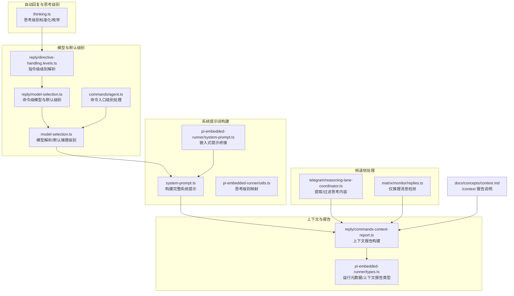
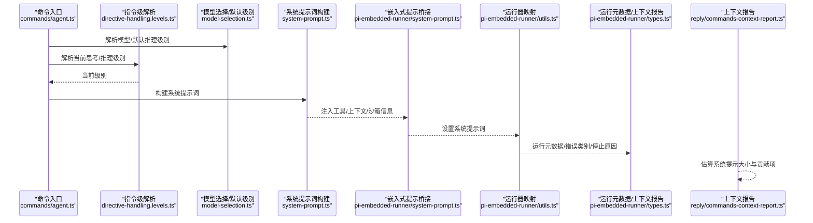
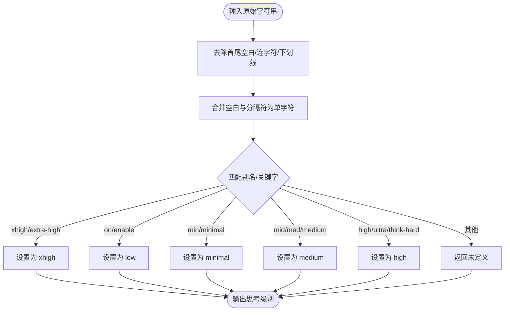
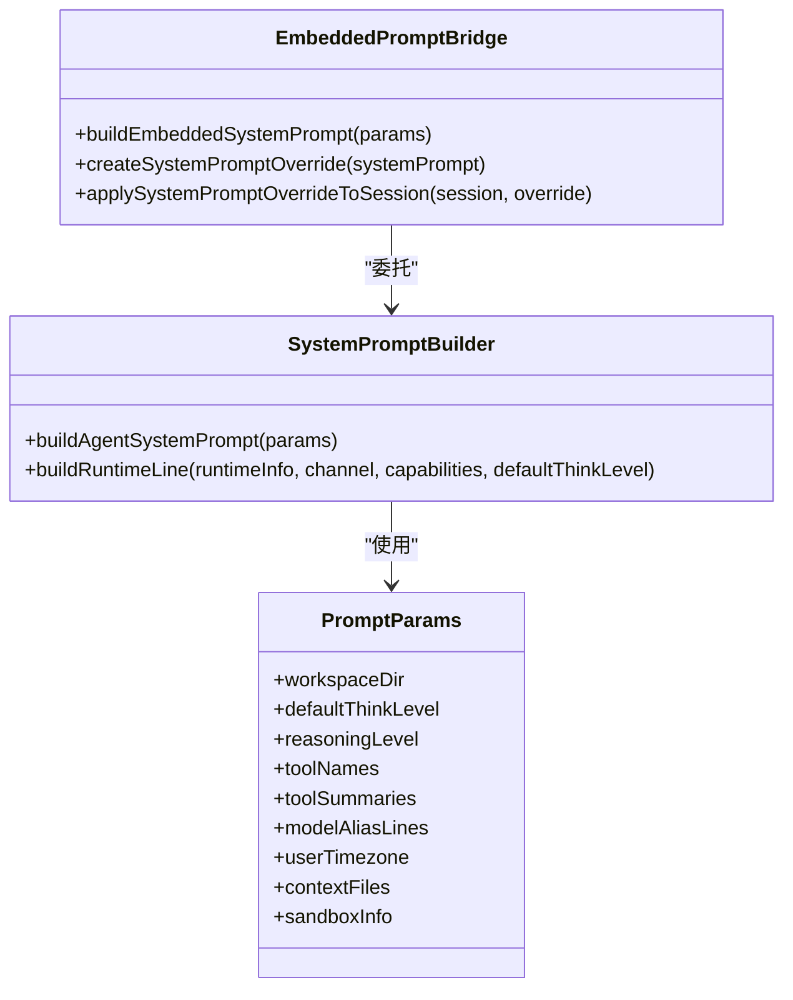
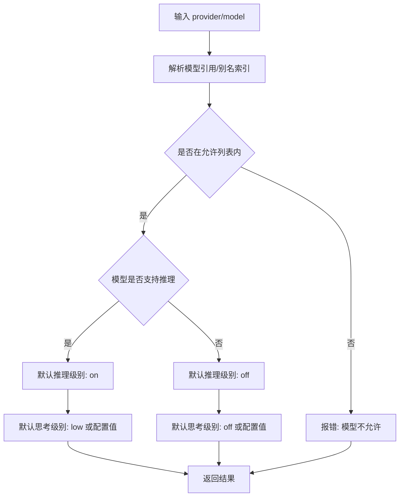
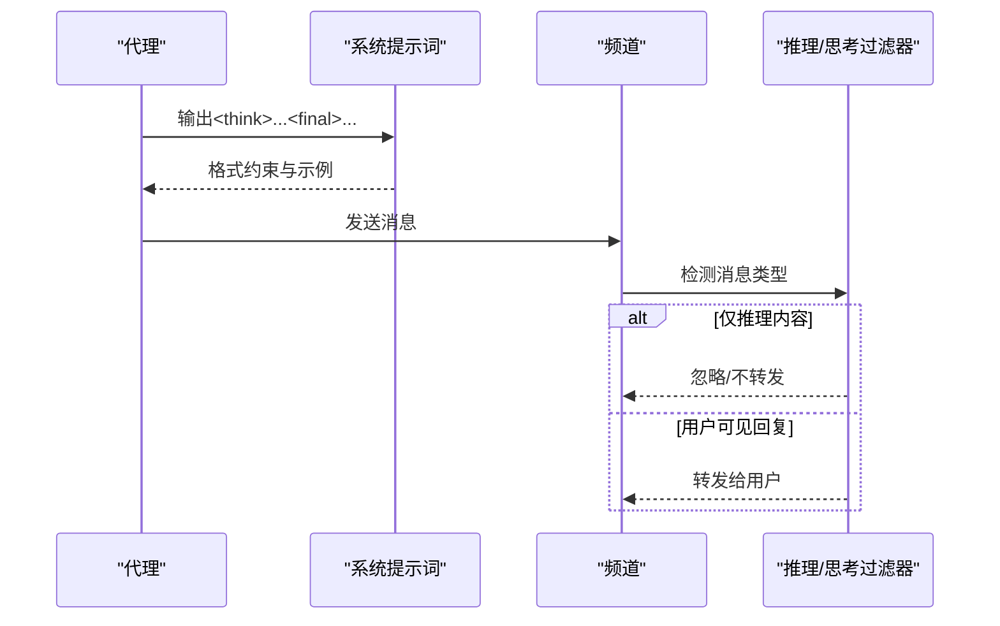
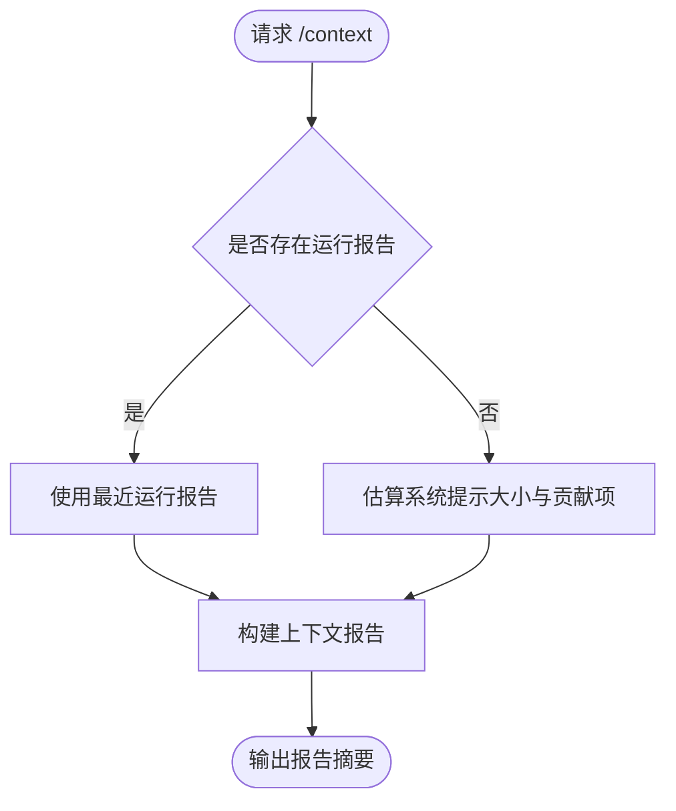
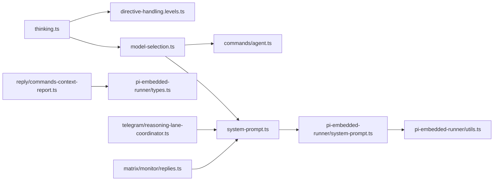

# 思考与推理系统

<cite>
**本文引用的文件**
- [src/auto-reply/thinking.ts](file://src/auto-reply/thinking.ts)
- [src/agents/system-prompt.ts](file://src/agents/system-prompt.ts)
- [src/agents/pi-embedded-runner/system-prompt.ts](file://src/agents/pi-embedded-runner/system-prompt.ts)
- [src/agents/pi-embedded-runner/utils.ts](file://src/agents/pi-embedded-runner/utils.ts)
- [src/agents/model-selection.ts](file://src/agents/model-selection.ts)
- [src/commands/agent.ts](file://src/commands/agent.ts)
- [src/auto-reply/reply/directive-handling.levels.ts](file://src/auto-reply/reply/directive-handling.levels.ts)
- [src/auto-reply/reply/model-selection.ts](file://src/auto-reply/reply/model-selection.ts)
- [src/auto-reply/reply/commands-context-report.ts](file://src/auto-reply/reply/commands-context-report.ts)
- [src/agents/pi-embedded-runner/types.ts](file://src/agents/pi-embedded-runner/types.ts)
- [src/telegram/reasoning-lane-coordinator.ts](file://src/telegram/reasoning-lane-coordinator.ts)
- [extensions/matrix/src/matrix/monitor/replies.ts](file://extensions/matrix/src/matrix/monitor/replies.ts)
- [docs/concepts/context.md](file://docs/concepts/context.md)
</cite>

## 目录

1. [引言](#引言)
2. [项目结构](#项目结构)
3. [核心组件](#核心组件)
4. [架构总览](#架构总览)
5. [详细组件分析](#详细组件分析)
6. [依赖关系分析](#依赖关系分析)
7. [性能考量](#性能考量)
8. [故障排查指南](#故障排查指南)
9. [结论](#结论)
10. [附录](#附录)

## 引言

本技术文档聚焦于 OpenClaw 的“思考与推理系统”，系统性阐述代理的思考模式、推理机制与决策流程；解释系统提示词工程、参数注入与上下文构建策略；说明推理链路管理、思维过程可视化与结果评估机制；并给出思考模式配置、推理优化与性能调优方法，以及自定义推理策略与思考模板的开发指南。

## 项目结构

围绕思考与推理的关键代码分布在以下模块：

- 自动回复与思考级别解析：src/auto-reply/thinking.ts
- 系统提示词构建：src/agents/system-prompt.ts
- 嵌入式运行器系统提示词桥接：src/agents/pi-embedded-runner/system-prompt.ts
- 嵌入式运行器工具映射：src/agents/pi-embedded-runner/utils.ts
- 模型选择与默认推理级别解析：src/agents/model-selection.ts
- 命令入口对思考级别的处理：src/commands/agent.ts
- 指令级级别解析（会话态）：src/auto-reply/reply/directive-handling.levels.ts
- 命令级模型选择与默认级别解析：src/auto-reply/reply/model-selection.ts
- 上下文报告与系统提示估算：src/auto-reply/reply/commands-context-report.ts
- 运行元数据与上下文报告类型：src/agents/pi-embedded-runner/types.ts
- 频道侧推理/思考内容提取与过滤：src/telegram/reasoning-lane-coordinator.ts、extensions/matrix/src/matrix/monitor/replies.ts
- 文档：docs/concepts/context.md

图表来源

- [src/auto-reply/thinking.ts](file://src/auto-reply/thinking.ts#L1-L228)
- [src/agents/system-prompt.ts](file://src/agents/system-prompt.ts#L1-L705)
- [src/agents/pi-embedded-runner/system-prompt.ts](file://src/agents/pi-embedded-runner/system-prompt.ts#L1-L107)
- [src/agents/pi-embedded-runner/utils.ts](file://src/agents/pi-embedded-runner/utils.ts#L1-L28)
- [src/agents/model-selection.ts](file://src/agents/model-selection.ts#L1-L615)
- [src/commands/agent.ts](file://src/commands/agent.ts#L637-L673)
- [src/auto-reply/reply/directive-handling.levels.ts](file://src/auto-reply/reply/directive-handling.levels.ts#L1-L41)
- [src/auto-reply/reply/model-selection.ts](file://src/auto-reply/reply/model-selection.ts#L382-L426)
- [src/auto-reply/reply/commands-context-report.ts](file://src/auto-reply/reply/commands-context-report.ts#L44-L78)
- [src/agents/pi-embedded-runner/types.ts](file://src/agents/pi-embedded-runner/types.ts#L1-L106)
- [src/telegram/reasoning-lane-coordinator.ts](file://src/telegram/reasoning-lane-coordinator.ts#L1-L44)
- [extensions/matrix/src/matrix/monitor/replies.ts](file://extensions/matrix/src/matrix/monitor/replies.ts#L107-L124)
- [docs/concepts/context.md](file://docs/concepts/context.md#L154-L162)

章节来源

- [src/auto-reply/thinking.ts](file://src/auto-reply/thinking.ts#L1-L228)
- [src/agents/system-prompt.ts](file://src/agents/system-prompt.ts#L1-L705)
- [src/agents/pi-embedded-runner/system-prompt.ts](file://src/agents/pi-embedded-runner/system-prompt.ts#L1-L107)
- [src/agents/pi-embedded-runner/utils.ts](file://src/agents/pi-embedded-runner/utils.ts#L1-L28)
- [src/agents/model-selection.ts](file://src/agents/model-selection.ts#L1-L615)
- [src/commands/agent.ts](file://src/commands/agent.ts#L637-L673)
- [src/auto-reply/reply/directive-handling.levels.ts](file://src/auto-reply/reply/directive-handling.levels.ts#L1-L41)
- [src/auto-reply/reply/model-selection.ts](file://src/auto-reply/reply/model-selection.ts#L382-L426)
- [src/auto-reply/reply/commands-context-report.ts](file://src/auto-reply/reply/commands-context-report.ts#L44-L78)
- [src/agents/pi-embedded-runner/types.ts](file://src/agents/pi-embedded-runner/types.ts#L1-L106)
- [src/telegram/reasoning-lane-coordinator.ts](file://src/telegram/reasoning-lane-coordinator.ts#L1-L44)
- [extensions/matrix/src/matrix/monitor/replies.ts](file://extensions/matrix/src/matrix/monitor/replies.ts#L107-L124)
- [docs/concepts/context.md](file://docs/concepts/context.md#L154-L162)

## 核心组件

- 思考级别与推理可见性
  - 定义与标准化：支持 off/minimal/low/medium/high/xhigh；推理可见性支持 off/on/stream；提供别名归一化与格式化工具。
  - 参考路径：[src/auto-reply/thinking.ts](file://src/auto-reply/thinking.ts#L1-L228)

- 系统提示词工程
  - 构建完整系统提示，包含工具清单、工作区、内存检索、时间信息、消息通道、语音提示、沙箱信息、授权发送者、心跳与静默回复等。
  - 支持最小/无模式用于子代理或无上下文场景。
  - 参考路径：[src/agents/system-prompt.ts](file://src/agents/system-prompt.ts#L1-L705)

- 嵌入式运行器提示桥接
  - 将系统提示词与嵌入式运行器所需参数对接，并支持覆盖系统提示词。
  - 参考路径：[src/agents/pi-embedded-runner/system-prompt.ts](file://src/agents/pi-embedded-runner/system-prompt.ts#L1-L107)

- 思考级别到运行器映射
  - 将 OpenClaw 的思考级别映射到运行器内部级别。
  - 参考路径：[src/agents/pi-embedded-runner/utils.ts](file://src/agents/pi-embedded-runner/utils.ts#L1-L28)

- 模型选择与默认推理级别
  - 解析模型引用、别名索引、允许列表；根据模型能力决定默认推理级别与思考级别。
  - 参考路径：[src/agents/model-selection.ts](file://src/agents/model-selection.ts#L1-L615)

- 命令入口与指令级级别解析
  - 命令入口根据模型能力调整最高思考级别；指令级从会话态与代理默认解析当前级别。
  - 参考路径：
    - [src/commands/agent.ts](file://src/commands/agent.ts#L637-L673)
    - [src/auto-reply/reply/directive-handling.levels.ts](file://src/auto-reply/reply/directive-handling.levels.ts#L1-L41)
    - [src/auto-reply/reply/model-selection.ts](file://src/auto-reply/reply/model-selection.ts#L382-L426)

- 上下文报告与系统提示估算
  - 在无运行报告时估算系统提示大小与贡献项，便于 /context 命令输出。
  - 参考路径：[src/auto-reply/reply/commands-context-report.ts](file://src/auto-reply/reply/commands-context-report.ts#L44-L78)

- 运行元数据与上下文报告类型
  - 定义运行元数据、错误类别、停止原因、待处理工具调用、上下文报告等类型。
  - 参考路径：[src/agents/pi-embedded-runner/types.ts](file://src/agents/pi-embedded-runner/types.ts#L1-L106)

- 频道侧推理/思考内容处理
  - 提取/过滤思考标签与仅推理消息，避免在不支持“推理通道”的频道转发纯推理内容。
  - 参考路径：
    - [src/telegram/reasoning-lane-coordinator.ts](file://src/telegram/reasoning-lane-coordinator.ts#L1-L44)
    - [extensions/matrix/src/matrix/monitor/replies.ts](file://extensions/matrix/src/matrix/monitor/replies.ts#L107-L124)

章节来源

- [src/auto-reply/thinking.ts](file://src/auto-reply/thinking.ts#L1-L228)
- [src/agents/system-prompt.ts](file://src/agents/system-prompt.ts#L1-L705)
- [src/agents/pi-embedded-runner/system-prompt.ts](file://src/agents/pi-embedded-runner/system-prompt.ts#L1-L107)
- [src/agents/pi-embedded-runner/utils.ts](file://src/agents/pi-embedded-runner/utils.ts#L1-L28)
- [src/agents/model-selection.ts](file://src/agents/model-selection.ts#L1-L615)
- [src/commands/agent.ts](file://src/commands/agent.ts#L637-L673)
- [src/auto-reply/reply/directive-handling.levels.ts](file://src/auto-reply/reply/directive-handling.levels.ts#L1-L41)
- [src/auto-reply/reply/model-selection.ts](file://src/auto-reply/reply/model-selection.ts#L382-L426)
- [src/auto-reply/reply/commands-context-report.ts](file://src/auto-reply/reply/commands-context-report.ts#L44-L78)
- [src/agents/pi-embedded-runner/types.ts](file://src/agents/pi-embedded-runner/types.ts#L1-L106)
- [src/telegram/reasoning-lane-coordinator.ts](file://src/telegram/reasoning-lane-coordinator.ts#L1-L44)
- [extensions/matrix/src/matrix/monitor/replies.ts](file://extensions/matrix/src/matrix/monitor/replies.ts#L107-L124)

## 架构总览

OpenClaw 的思考与推理系统以“思考级别 + 推理可见性”为核心控制点，贯穿系统提示词构建、模型选择、运行器映射与频道侧展示。整体流程如下：

图表来源

- [src/commands/agent.ts](file://src/commands/agent.ts#L637-L673)
- [src/auto-reply/reply/directive-handling.levels.ts](file://src/auto-reply/reply/directive-handling.levels.ts#L1-L41)
- [src/agents/model-selection.ts](file://src/agents/model-selection.ts#L555-L587)
- [src/agents/system-prompt.ts](file://src/agents/system-prompt.ts#L189-L665)
- [src/agents/pi-embedded-runner/system-prompt.ts](file://src/agents/pi-embedded-runner/system-prompt.ts#L56-L84)
- [src/agents/pi-embedded-runner/utils.ts](file://src/agents/pi-embedded-runner/utils.ts#L4-L10)
- [src/agents/pi-embedded-runner/types.ts](file://src/agents/pi-embedded-runner/types.ts#L33-L55)
- [src/auto-reply/reply/commands-context-report.ts](file://src/auto-reply/reply/commands-context-report.ts#L44-L78)

## 详细组件分析

### 组件A：思考级别与推理可见性

- 功能要点
  - 定义思考级别枚举与别名归一化规则，支持 off/minimal/low/medium/high/xhigh。
  - 推理可见性支持 off/on/stream，提供格式化与使用显示模式解析。
  - 列出可用级别与标签，适配特定提供商（如二值化提供商）。
- 关键实现位置
  - 思考级别标准化与别名映射：[src/auto-reply/thinking.ts](file://src/auto-reply/thinking.ts#L42-L124)
  - 推理可见性标准化：[src/auto-reply/thinking.ts](file://src/auto-reply/thinking.ts#L212-L227)

图表来源

- [src/auto-reply/thinking.ts](file://src/auto-reply/thinking.ts#L42-L124)

章节来源

- [src/auto-reply/thinking.ts](file://src/auto-reply/thinking.ts#L1-L228)

### 组件B：系统提示词工程与上下文构建

- 功能要点
  - 构建工具清单、安全约束、工作区指引、文档链接、沙箱信息、授权发送者、时间信息、消息通道、语音提示、静默回复、心跳等。
  - 支持 PromptMode 控制段落包含范围（full/minimal/none），用于主代理与子代理。
  - 支持“项目上下文”注入用户可编辑文件，按路径与内容组织。
- 关键实现位置
  - 系统提示词构建函数：[src/agents/system-prompt.ts](file://src/agents/system-prompt.ts#L189-L665)
  - 嵌入式提示桥接与覆盖：[src/agents/pi-embedded-runner/system-prompt.ts](file://src/agents/pi-embedded-runner/system-prompt.ts#L56-L106)

图表来源

- [src/agents/system-prompt.ts](file://src/agents/system-prompt.ts#L189-L705)
- [src/agents/pi-embedded-runner/system-prompt.ts](file://src/agents/pi-embedded-runner/system-prompt.ts#L11-L106)

章节来源

- [src/agents/system-prompt.ts](file://src/agents/system-prompt.ts#L1-L705)
- [src/agents/pi-embedded-runner/system-prompt.ts](file://src/agents/pi-embedded-runner/system-prompt.ts#L1-L107)

### 组件C：模型选择与默认推理/思考级别

- 功能要点
  - 解析模型引用、别名索引、允许列表；根据模型 catalog 决定默认推理级别与思考级别。
  - 对 xhigh 思考级别的支持进行模型白名单校验与降级处理。
- 关键实现位置
  - 默认推理级别解析：[src/agents/model-selection.ts](file://src/agents/model-selection.ts#L574-L587)
  - 默认思考级别解析：[src/agents/model-selection.ts](file://src/agents/model-selection.ts#L555-L572)
  - 命令入口对 xhigh 的降级处理：[src/commands/agent.ts](file://src/commands/agent.ts#L637-L673)

图表来源

- [src/agents/model-selection.ts](file://src/agents/model-selection.ts#L405-L587)
- [src/commands/agent.ts](file://src/commands/agent.ts#L637-L673)

章节来源

- [src/agents/model-selection.ts](file://src/agents/model-selection.ts#L1-L615)
- [src/commands/agent.ts](file://src/commands/agent.ts#L637-L673)

### 组件D：推理链路管理与思维过程可视化

- 功能要点
  - 通过系统提示词中的“推理格式”约束，要求内部推理必须包裹在特定标签中，并以最终可见回复包裹在最终标签中。
  - 频道侧对仅包含推理内容的消息进行识别与过滤，避免在不支持“推理通道”的频道转发纯推理文本。
- 关键实现位置
  - 推理标签提示与格式示例：[src/agents/system-prompt.ts](file://src/agents/system-prompt.ts#L348-L359)
  - Telegram 思考内容提取与过滤：[src/telegram/reasoning-lane-coordinator.ts](file://src/telegram/reasoning-lane-coordinator.ts#L19-L44)
  - Matrix 仅推理消息检测：[extensions/matrix/src/matrix/monitor/replies.ts](file://extensions/matrix/src/matrix/monitor/replies.ts#L115-L124)

图表来源

- [src/agents/system-prompt.ts](file://src/agents/system-prompt.ts#L348-L359)
- [src/telegram/reasoning-lane-coordinator.ts](file://src/telegram/reasoning-lane-coordinator.ts#L19-L44)
- [extensions/matrix/src/matrix/monitor/replies.ts](file://extensions/matrix/src/matrix/monitor/replies.ts#L115-L124)

章节来源

- [src/agents/system-prompt.ts](file://src/agents/system-prompt.ts#L348-L359)
- [src/telegram/reasoning-lane-coordinator.ts](file://src/telegram/reasoning-lane-coordinator.ts#L1-L44)
- [extensions/matrix/src/matrix/monitor/replies.ts](file://extensions/matrix/src/matrix/monitor/replies.ts#L107-L124)

### 组件E：上下文报告与结果评估机制

- 功能要点
  - 在无运行报告时估算系统提示大小与贡献项，便于 /context 命令输出。
  - 运行元数据记录错误类别、停止原因、待处理工具调用等，辅助评估与排障。
- 关键实现位置
  - 上下文报告估算与构建：[src/auto-reply/reply/commands-context-report.ts](file://src/auto-reply/reply/commands-context-report.ts#L44-L78)
  - 运行元数据与错误类别：[src/agents/pi-embedded-runner/types.ts](file://src/agents/pi-embedded-runner/types.ts#L33-L55)
  - 文档说明 /context 行为：[docs/concepts/context.md](file://docs/concepts/context.md#L154-L162)

图表来源

- [src/auto-reply/reply/commands-context-report.ts](file://src/auto-reply/reply/commands-context-report.ts#L44-L78)
- [src/agents/pi-embedded-runner/types.ts](file://src/agents/pi-embedded-runner/types.ts#L33-L55)
- [docs/concepts/context.md](file://docs/concepts/context.md#L154-L162)

章节来源

- [src/auto-reply/reply/commands-context-report.ts](file://src/auto-reply/reply/commands-context-report.ts#L44-L78)
- [src/agents/pi-embedded-runner/types.ts](file://src/agents/pi-embedded-runner/types.ts#L1-L106)
- [docs/concepts/context.md](file://docs/concepts/context.md#L154-L162)

## 依赖关系分析

- 组件耦合与协作
  - thinking.ts 为全局级别标准化中心，被指令级解析与命令级解析共同依赖。
  - system-prompt.ts 作为系统提示词核心，被嵌入式桥接模块复用。
  - model-selection.ts 同时影响默认推理与思考级别，贯穿命令入口与会话态解析。
  - 运行元数据与上下文报告类型为运行期产物，服务于评估与可视化。
- 外部依赖与集成点
  - 频道侧过滤器依赖系统提示词中的推理格式约束，确保跨渠道一致性。

图表来源

- [src/auto-reply/thinking.ts](file://src/auto-reply/thinking.ts#L1-L228)
- [src/auto-reply/reply/directive-handling.levels.ts](file://src/auto-reply/reply/directive-handling.levels.ts#L1-L41)
- [src/agents/model-selection.ts](file://src/agents/model-selection.ts#L1-L615)
- [src/commands/agent.ts](file://src/commands/agent.ts#L637-L673)
- [src/agents/system-prompt.ts](file://src/agents/system-prompt.ts#L1-L705)
- [src/agents/pi-embedded-runner/system-prompt.ts](file://src/agents/pi-embedded-runner/system-prompt.ts#L1-L107)
- [src/agents/pi-embedded-runner/utils.ts](file://src/agents/pi-embedded-runner/utils.ts#L1-L28)
- [src/auto-reply/reply/commands-context-report.ts](file://src/auto-reply/reply/commands-context-report.ts#L44-L78)
- [src/agents/pi-embedded-runner/types.ts](file://src/agents/pi-embedded-runner/types.ts#L1-L106)
- [src/telegram/reasoning-lane-coordinator.ts](file://src/telegram/reasoning-lane-coordinator.ts#L1-L44)
- [extensions/matrix/src/matrix/monitor/replies.ts](file://extensions/matrix/src/matrix/monitor/replies.ts#L107-L124)

章节来源

- [src/auto-reply/thinking.ts](file://src/auto-reply/thinking.ts#L1-L228)
- [src/auto-reply/reply/directive-handling.levels.ts](file://src/auto-reply/reply/directive-handling.levels.ts#L1-L41)
- [src/agents/model-selection.ts](file://src/agents/model-selection.ts#L1-L615)
- [src/commands/agent.ts](file://src/commands/agent.ts#L637-L673)
- [src/agents/system-prompt.ts](file://src/agents/system-prompt.ts#L1-L705)
- [src/agents/pi-embedded-runner/system-prompt.ts](file://src/agents/pi-embedded-runner/system-prompt.ts#L1-L107)
- [src/agents/pi-embedded-runner/utils.ts](file://src/agents/pi-embedded-runner/utils.ts#L1-L28)
- [src/auto-reply/reply/commands-context-report.ts](file://src/auto-reply/reply/commands-context-report.ts#L44-L78)
- [src/agents/pi-embedded-runner/types.ts](file://src/agents/pi-embedded-runner/types.ts#L1-L106)
- [src/telegram/reasoning-lane-coordinator.ts](file://src/telegram/reasoning-lane-coordinator.ts#L1-L44)
- [extensions/matrix/src/matrix/monitor/replies.ts](file://extensions/matrix/src/matrix/monitor/replies.ts#L107-L124)

## 性能考量

- 思考级别与推理可见性
  - xhigh 思考级别仅在特定模型上启用，超出范围自动降级，避免无效开销。
  - 推理可见性为 off 时不输出中间推理，减少 token 消耗与带宽占用。
- 系统提示词大小控制
  - 通过 PromptMode 控制段落包含范围；在子代理与无上下文场景使用 minimal/none 模式。
  - 上下文报告估算帮助预判提示词大小，避免越界。
- 运行期评估
  - 运行元数据记录错误类别与停止原因，便于快速定位性能瓶颈与失败根因。

## 故障排查指南

- 常见问题与定位
  - “模型不允许”：检查模型允许列表与别名索引，确认模型引用格式正确。
  - “xhigh 不支持”：确认当前模型是否在 xhigh 白名单中，否则将被降级。
  - “仅推理消息未显示”：检查频道侧过滤逻辑与系统提示词中的推理格式约束。
  - “上下文过大”：查看 /context 报告估算，减少注入文件数量或缩短内容。
- 相关实现位置
  - 模型允许性与错误提示：[src/agents/model-selection.ts](file://src/agents/model-selection.ts#L541-L553)
  - xhigh 降级处理：[src/commands/agent.ts](file://src/commands/agent.ts#L650-L667)
  - 仅推理消息检测：[extensions/matrix/src/matrix/monitor/replies.ts](file://extensions/matrix/src/matrix/monitor/replies.ts#L115-L124)
  - 上下文报告估算：[src/auto-reply/reply/commands-context-report.ts](file://src/auto-reply/reply/commands-context-report.ts#L44-L78)

章节来源

- [src/agents/model-selection.ts](file://src/agents/model-selection.ts#L541-L553)
- [src/commands/agent.ts](file://src/commands/agent.ts#L650-L667)
- [extensions/matrix/src/matrix/monitor/replies.ts](file://extensions/matrix/src/matrix/monitor/replies.ts#L115-L124)
- [src/auto-reply/reply/commands-context-report.ts](file://src/auto-reply/reply/commands-context-report.ts#L44-L78)

## 结论

OpenClaw 的思考与推理系统通过“思考级别 + 推理可见性”的双维度控制，结合系统提示词工程与上下文报告估算，在保证推理过程可控与可观察的同时，兼顾性能与跨渠道一致性。通过对模型能力的严格解析与默认级别的动态适配，系统能够在不同场景下自动选择最优的推理策略，并通过运行元数据与上下文报告提供完善的评估与排障能力。

## 附录

- 自定义推理策略与思考模板开发指南
  - 使用系统提示词构建函数扩展“项目上下文”与“技能”部分，注入领域知识与模板化指令。
  - 通过嵌入式提示桥接覆盖系统提示词，满足特定运行器或频道的定制需求。
  - 在频道侧实现推理/思考内容过滤，确保仅向用户可见最终回复。
- 性能调优建议
  - 合理选择思考级别与推理可见性，避免不必要的 token 消耗。
  - 使用 minimal/none 模式在子代理与无上下文场景降低提示词规模。
  - 定期使用 /context 报告监控提示词大小与贡献项，及时清理冗余上下文。
