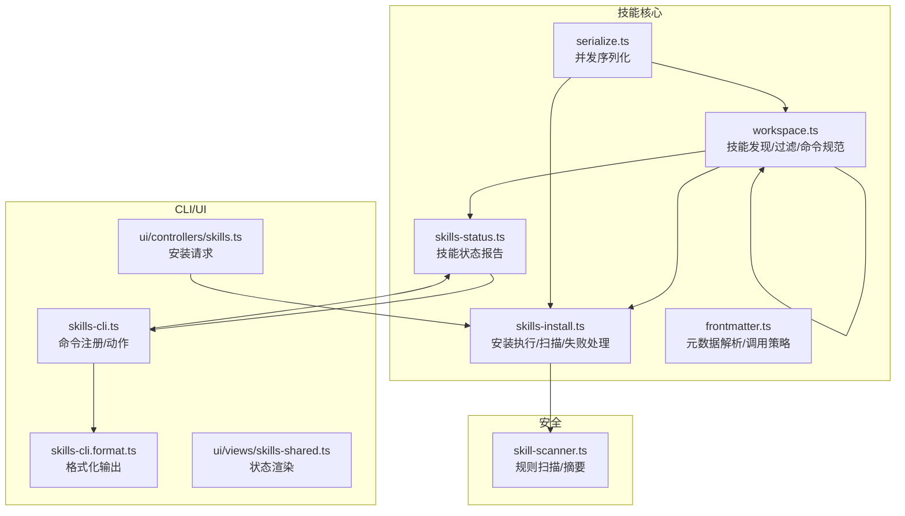
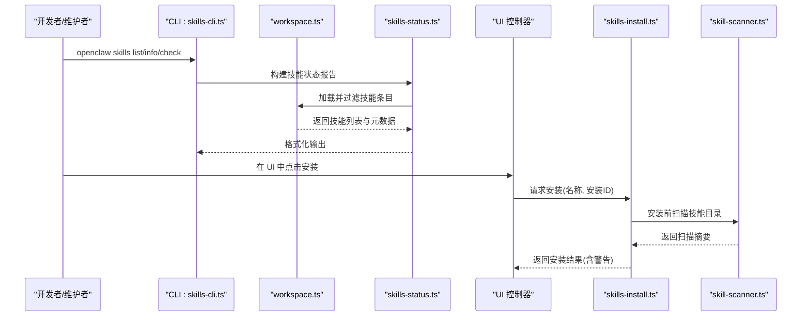
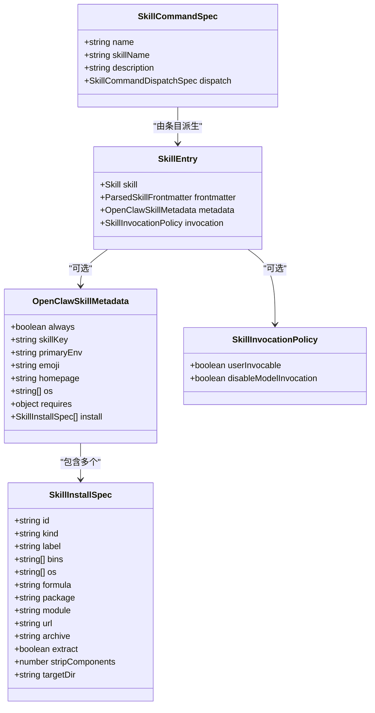
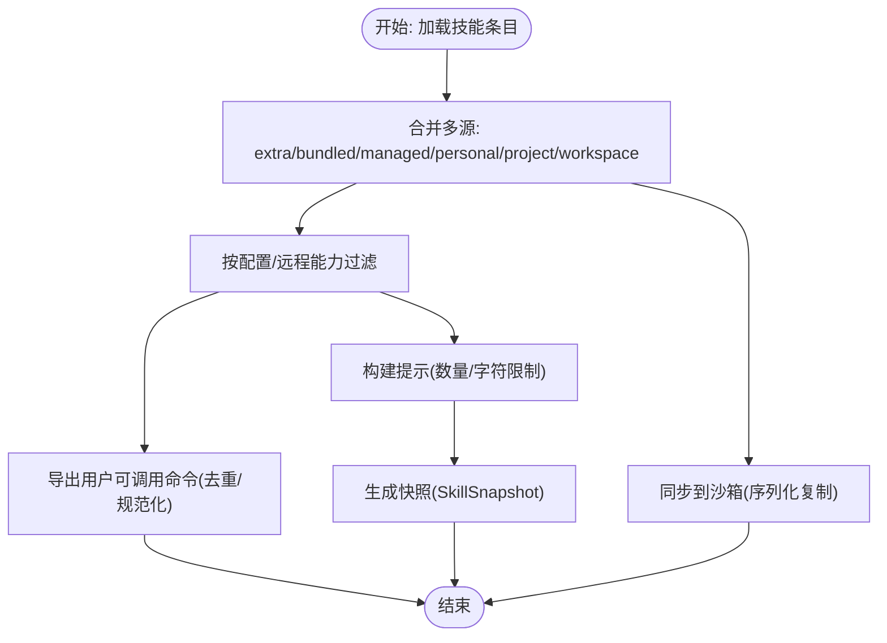
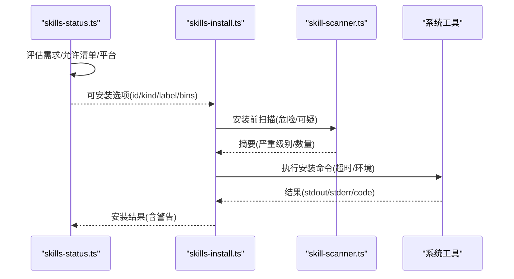
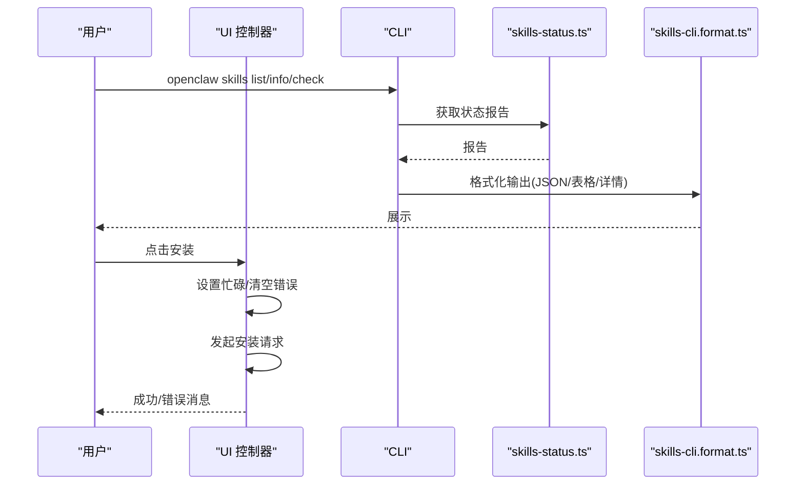
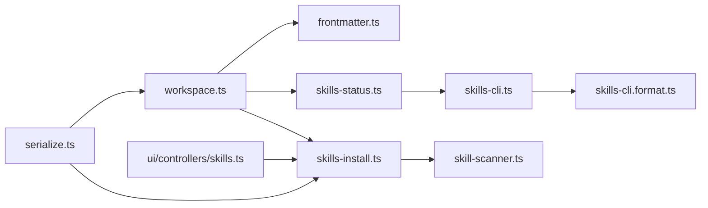

# 技能系统

<cite>
**本文引用的文件**
- [src/agents/skills.ts](file://src/agents/skills.ts)
- [src/agents/skills/types.ts](file://src/agents/skills/types.ts)
- [src/agents/skills/workspace.ts](file://src/agents/skills/workspace.ts)
- [src/agents/skills/status.ts](file://src/agents/skills-status.ts)
- [src/agents/skills-install.ts](file://src/agents/skills-install.ts)
- [src/agents/skills/frontmatter.ts](file://src/agents/skills/frontmatter.ts)
- [src/agents/skills/serialize.ts](file://src/agents/skills/serialize.ts)
- [src/agents/skills-cli.ts](file://src/cli/skills-cli.ts)
- [src/agents/skills-cli.format.ts](file://src/cli/skills-cli.format.ts)
- [src/security/skill-scanner.ts](file://src/security/skill-scanner.ts)
- [ui/src/ui/controllers/skills.ts](file://ui/src/ui/controllers/skills.ts)
- [ui/src/ui/views/skills-shared.ts](file://ui/src/ui/views/skills-shared.ts)
- [src/config/config.skills-entries-config.test.ts](file://src/config/config.skills-entries-config.test.ts)
- [src/gateway/server.skills-status.test.ts](file://src/gateway/server.skills-status.test.ts)
</cite>

## 目录

1. [简介](#简介)
2. [项目结构](#项目结构)
3. [核心组件](#核心组件)
4. [架构总览](#架构总览)
5. [详细组件分析](#详细组件分析)
6. [依赖关系分析](#依赖关系分析)
7. [性能考量](#性能考量)
8. [故障排查指南](#故障排查指南)
9. [结论](#结论)
10. [附录](#附录)

## 简介

本文件面向开发者与平台维护者，系统化阐述 OpenClaw 技能系统的架构设计、开发框架与部署机制。内容覆盖技能注册、加载与管理流程，技能配置、依赖与版本控制策略，以及安全扫描与安装流程。同时提供技能开发最佳实践、测试方法与性能优化建议，并给出自定义技能开发指南、模板使用与发布流程，帮助构建与扩展 AI 代理技能生态。

## 项目结构

OpenClaw 技能系统围绕“技能发现—状态评估—安装—运行时提示注入—命令导出”展开，主要代码位于 src/agents 下，CLI 与 UI 控制器分别在 src/cli 与 ui/src/ui 中，安全扫描逻辑在 src/security 中。

图表来源

- [src/agents/skills/workspace.ts](file://src/agents/skills/workspace.ts#L22-L22)
- [src/agents/skills-status.ts](file://src/agents/skills-status.ts#L227-L253)
- [src/agents/skills-install.ts](file://src/agents/skills-install.ts#L1-L471)
- [src/agents/skills/frontmatter.ts](file://src/agents/skills/frontmatter.ts#L81-L117)
- [src/agents/skills/serialize.ts](file://src/agents/skills/serialize.ts#L1-L14)
- [src/cli/skills-cli.ts](file://src/cli/skills-cli.ts#L40-L81)
- [src/cli/skills-cli.format.ts](file://src/cli/skills-cli.format.ts#L66-L133)
- [ui/src/ui/controllers/skills.ts](file://ui/src/ui/controllers/skills.ts#L132-L164)
- [ui/src/ui/views/skills-shared.ts](file://ui/src/ui/views/skills-shared.ts#L1-L52)
- [src/security/skill-scanner.ts](file://src/security/skill-scanner.ts#L1-L427)

章节来源

- [src/agents/skills/workspace.ts](file://src/agents/skills/workspace.ts#L1-L761)
- [src/agents/skills-status.ts](file://src/agents/skills-status.ts#L1-L254)
- [src/agents/skills-install.ts](file://src/agents/skills-install.ts#L1-L471)
- [src/agents/skills/frontmatter.ts](file://src/agents/skills/frontmatter.ts#L78-L117)
- [src/agents/skills/serialize.ts](file://src/agents/skills/serialize.ts#L1-L14)
- [src/cli/skills-cli.ts](file://src/cli/skills-cli.ts#L1-L82)
- [src/cli/skills-cli.format.ts](file://src/cli/skills-cli.format.ts#L1-L302)
- [ui/src/ui/controllers/skills.ts](file://ui/src/ui/controllers/skills.ts#L132-L164)
- [ui/src/ui/views/skills-shared.ts](file://ui/src/ui/views/skills-shared.ts#L1-L52)
- [src/security/skill-scanner.ts](file://src/security/skill-scanner.ts#L1-L427)

## 核心组件

- 技能类型与元数据：定义技能安装规格、调用策略、命令分发等类型与接口，支撑统一的技能描述与行为约束。
- 工作空间管理：负责技能目录发现、合并优先级、过滤、命令规范化、提示注入与同步到沙箱。
- 状态评估：基于平台能力、环境变量、配置路径与允许清单，生成技能就绪度报告与可安装选项。
- 安装执行：支持 brew/node/go/uv/download 多种安装方式，内置安全扫描与失败处理。
- 前体信息解析：从技能文档中提取 OpenClaw 元数据与调用策略，决定是否允许用户或模型调用。
- 并发控制：通过键控序列化确保同一目标的技能同步/安装串行化，避免竞态。
- CLI/格式化/前端控制器：提供命令行查询、安装与 UI 展示，统一输出风格与交互体验。

章节来源

- [src/agents/skills/types.ts](file://src/agents/skills/types.ts#L1-L90)
- [src/agents/skills/workspace.ts](file://src/agents/skills/workspace.ts#L446-L537)
- [src/agents/skills-status.ts](file://src/agents/skills-status.ts#L169-L225)
- [src/agents/skills-install.ts](file://src/agents/skills-install.ts#L392-L471)
- [src/agents/skills/frontmatter.ts](file://src/agents/skills/frontmatter.ts#L81-L117)
- [src/agents/skills/serialize.ts](file://src/agents/skills/serialize.ts#L3-L14)
- [src/cli/skills-cli.ts](file://src/cli/skills-cli.ts#L40-L81)
- [src/cli/skills-cli.format.ts](file://src/cli/skills-cli.format.ts#L66-L133)
- [ui/src/ui/controllers/skills.ts](file://ui/src/ui/controllers/skills.ts#L132-L164)

## 架构总览

技能系统以“工作空间”为中心，按来源优先级合并技能，结合状态评估与安装流程，最终将可用技能注入到代理提示中并导出命令规范。

图表来源

- [src/cli/skills-cli.ts](file://src/cli/skills-cli.ts#L20-L35)
- [src/agents/skills-status.ts](file://src/agents/skills-status.ts#L227-L253)
- [src/agents/skills/workspace.ts](file://src/agents/skills/workspace.ts#L539-L548)
- [ui/src/ui/controllers/skills.ts](file://ui/src/ui/controllers/skills.ts#L132-L164)
- [src/agents/skills-install.ts](file://src/agents/skills-install.ts#L392-L471)
- [src/security/skill-scanner.ts](file://src/security/skill-scanner.ts#L400-L427)

## 详细组件分析

### 组件A：技能类型与元数据（skills/types.ts, skills/frontmatter.ts）

- 类型定义
  - 安装规格：支持 brew/node/go/uv/download，包含 id、label、os 过滤、二进制/包名/模块/URL 等字段。
  - 元数据：always、skillKey、primaryEnv、homepage、os、requires、install。
  - 调用策略：userInvocable、disableModelInvocation。
  - 命令规范：name/skillName/description/dispatch(tool)。
  - 快照：prompt、skills 列表、过滤条件、版本号。
- 元数据解析
  - 从技能文档前言块解析 OpenClaw 元数据与调用策略，缺失字段安全回退。
- 关键点
  - install 规格与平台/包管理器偏好联动，支持多候选选择与标签化展示。
  - 调用策略影响命令导出与模型调用限制。

图表来源

- [src/agents/skills/types.ts](file://src/agents/skills/types.ts#L3-L33)
- [src/agents/skills/types.ts](file://src/agents/skills/types.ts#L35-L57)
- [src/agents/skills/types.ts](file://src/agents/skills/types.ts#L66-L71)
- [src/agents/skills/frontmatter.ts](file://src/agents/skills/frontmatter.ts#L81-L117)

章节来源

- [src/agents/skills/types.ts](file://src/agents/skills/types.ts#L1-L90)
- [src/agents/skills/frontmatter.ts](file://src/agents/skills/frontmatter.ts#L81-L117)

### 组件B：工作空间管理（skills/workspace.ts）

- 发现与合并
  - 支持 extra/bundled/managed/personal/project/workspace 多源合并，按优先级覆盖。
  - 自动检测嵌套 skills 根目录，限制候选数量与单文件大小，避免性能问题。
- 过滤与命令导出
  - 按配置与远程能力过滤；仅对允许用户调用的技能导出命令；去重与命名规范化。
- 提示注入与限制
  - 对路径进行紧凑化处理；按数量与字符数限制注入提示，超限截断并给出告警。
- 同步到沙箱
  - 序列化复制，保证目标目录唯一性与安全性；失败记录日志。
- 关键点
  - 严格的容量与字节数限制，防止提示膨胀。
  - 命令导出遵循 Discord 等平台限制（长度、描述长度）。

图表来源

- [src/agents/skills/workspace.ts](file://src/agents/skills/workspace.ts#L221-L406)
- [src/agents/skills/workspace.ts](file://src/agents/skills/workspace.ts#L446-L517)
- [src/agents/skills/workspace.ts](file://src/agents/skills/workspace.ts#L589-L645)

章节来源

- [src/agents/skills/workspace.ts](file://src/agents/skills/workspace.ts#L221-L406)
- [src/agents/skills/workspace.ts](file://src/agents/skills/workspace.ts#L446-L517)
- [src/agents/skills/workspace.ts](file://src/agents/skills/workspace.ts#L589-L645)

### 组件C：状态评估与安装（skills-status.ts, skills-install.ts）

- 状态评估
  - 计算 eligible/disabled/blocked/missing，汇总缺失项（二进制/环境/配置/OS），并生成可安装选项。
  - 安装选项选择遵循偏好链（brew/node/go/uv/download），考虑平台可用性与显式 OS 限定。
- 安装执行
  - 支持 brew/node/go/uv/download；自动处理 brew 缺失、go/apt 安装、GOBIN 指向等细节。
  - 执行前扫描技能目录，收集危险/可疑模式并作为警告返回；失败时格式化错误消息。
- 关键点
  - 安装过程带超时与失败兜底，确保幂等与可恢复。
  - 安全扫描与安装并行但不阻塞，安装后保留扫描警告供后续审计。

图表来源

- [src/agents/skills-status.ts](file://src/agents/skills-status.ts#L61-L103)
- [src/agents/skills-status.ts](file://src/agents/skills-status.ts#L105-L167)
- [src/agents/skills-install.ts](file://src/agents/skills-install.ts#L42-L85)
- [src/agents/skills-install.ts](file://src/agents/skills-install.ts#L392-L471)
- [src/security/skill-scanner.ts](file://src/security/skill-scanner.ts#L400-L427)

章节来源

- [src/agents/skills-status.ts](file://src/agents/skills-status.ts#L61-L167)
- [src/agents/skills-install.ts](file://src/agents/skills-install.ts#L42-L85)
- [src/agents/skills-install.ts](file://src/agents/skills-install.ts#L392-L471)
- [src/security/skill-scanner.ts](file://src/security/skill-scanner.ts#L400-L427)

### 组件D：CLI 与 UI 集成（skills-cli.ts, skills-cli.format.ts, ui/controllers/skills.ts, ui/views/skills-shared.ts）

- CLI
  - 子命令：list/info/check，默认列出；支持 JSON 输出与详细缺失项展示。
  - 与状态评估与格式化模块解耦，便于扩展新格式。
- UI
  - 安装流程：发起请求、等待结果、更新消息与错误状态；安装后刷新技能列表。
  - 渲染：状态芯片、缺失原因聚合、来源与就绪状态展示。

图表来源

- [src/cli/skills-cli.ts](file://src/cli/skills-cli.ts#L40-L81)
- [src/cli/skills-cli.format.ts](file://src/cli/skills-cli.format.ts#L66-L133)
- [ui/src/ui/controllers/skills.ts](file://ui/src/ui/controllers/skills.ts#L132-L164)
- [ui/src/ui/views/skills-shared.ts](file://ui/src/ui/views/skills-shared.ts#L1-L52)

章节来源

- [src/cli/skills-cli.ts](file://src/cli/skills-cli.ts#L1-L82)
- [src/cli/skills-cli.format.ts](file://src/cli/skills-cli.format.ts#L1-L302)
- [ui/src/ui/controllers/skills.ts](file://ui/src/ui/controllers/skills.ts#L132-L164)
- [ui/src/ui/views/skills-shared.ts](file://ui/src/ui/views/skills-shared.ts#L1-L52)

## 依赖关系分析

- 组件内聚与耦合
  - workspace.ts 与 frontmatter.ts 强关联：前者加载技能并解析元数据，后者提供元数据与调用策略。
  - skills-status.ts 与 skills-install.ts 通过 SkillEntry 与安装规格衔接，状态决定安装选项，安装结果影响状态。
  - serialize.ts 为 workspace.ts 与 skills-install.ts 提供并发控制，避免竞态。
- 外部依赖
  - 安全扫描依赖 skill-scanner.ts 的规则集与目录遍历实现。
  - CLI/格式化与 UI 控制器独立于核心逻辑，便于替换与扩展。
- 循环依赖
  - 未见直接循环依赖；workspace.ts 与 frontmatter.ts 为单向依赖。

图表来源

- [src/agents/skills/workspace.ts](file://src/agents/skills/workspace.ts#L16-L22)
- [src/agents/skills/frontmatter.ts](file://src/agents/skills/frontmatter.ts#L17-L20)
- [src/agents/skills-status.ts](file://src/agents/skills-status.ts#L1-L25)
- [src/agents/skills-install.ts](file://src/agents/skills-install.ts#L1-L17)
- [src/cli/skills-cli.ts](file://src/cli/skills-cli.ts#L1-L14)
- [src/cli/skills-cli.format.ts](file://src/cli/skills-cli.format.ts#L1-L6)
- [ui/src/ui/controllers/skills.ts](file://ui/src/ui/controllers/skills.ts#L1-L1)
- [src/security/skill-scanner.ts](file://src/security/skill-scanner.ts#L1-L5)
- [src/agents/skills/serialize.ts](file://src/agents/skills/serialize.ts#L1-L14)

章节来源

- [src/agents/skills/workspace.ts](file://src/agents/skills/workspace.ts#L16-L22)
- [src/agents/skills/frontmatter.ts](file://src/agents/skills/frontmatter.ts#L17-L20)
- [src/agents/skills-status.ts](file://src/agents/skills-status.ts#L1-L25)
- [src/agents/skills-install.ts](file://src/agents/skills-install.ts#L1-L17)
- [src/cli/skills-cli.ts](file://src/cli/skills-cli.ts#L1-L14)
- [src/cli/skills-cli.format.ts](file://src/cli/skills-cli.format.ts#L1-L6)
- [ui/src/ui/controllers/skills.ts](file://ui/src/ui/controllers/skills.ts#L1-L1)
- [src/security/skill-scanner.ts](file://src/security/skill-scanner.ts#L1-L5)
- [src/agents/skills/serialize.ts](file://src/agents/skills/serialize.ts#L1-L14)

## 性能考量

- 发现与加载
  - 限制每个根目录候选数量与最大加载技能数，避免大规模扫描导致延迟。
  - 单个 SKILL.md 文件大小限制，防止超大文件拖慢解析。
- 提示注入
  - 按数量与字符数双重限制，超限时二分搜索最优前缀，减少 LLM 提示开销。
- 并发控制
  - 使用 serializeByKey 对同一目标的同步/安装进行串行化，降低磁盘与网络竞争。
- 安装超时
  - 统一超时范围，避免长时间阻塞；失败快速反馈并格式化错误信息。
- 建议
  - 将大型技能拆分为子目录，合理组织 frontmatter，减少不必要的扫描与解析。
  - 使用 allowlist 与配置开关减少无效技能参与计算。

[本节为通用指导，无需特定文件引用]

## 故障排查指南

- 安装失败
  - 检查安装规格是否匹配当前平台；brew 缺失时按提示安装 Homebrew 或改用系统包管理器。
  - 查看扫描警告：存在危险/可疑模式需先修复再启用。
  - 失败信息包含 stdout/stderr/code，便于定位具体原因。
- 状态异常
  - eligible=false 通常由缺失二进制/环境变量/配置/OS 不满足导致；使用 openclaw skills check 获取明细。
  - blockedByAllowlist 表示被允许清单阻止，检查配置中的 skills.allowlist。
- UI 安装无响应
  - 确认客户端已连接；查看状态 busy/error 字段；重试或刷新页面。
- 测试验证
  - 单元测试覆盖配置 schema 与状态检查；网关测试验证敏感信息脱敏与配置检查。

章节来源

- [src/agents/skills-install.ts](file://src/agents/skills-install.ts#L195-L208)
- [src/agents/skills-install.ts](file://src/agents/skills-install.ts#L247-L254)
- [src/agents/skills-status.ts](file://src/agents/skills-status.ts#L29-L39)
- [src/config/config.skills-entries-config.test.ts](file://src/config/config.skills-entries-config.test.ts#L1-L47)
- [src/gateway/server.skills-status.test.ts](file://src/gateway/server.skills-status.test.ts#L36-L49)
- [ui/src/ui/controllers/skills.ts](file://ui/src/ui/controllers/skills.ts#L132-L164)

## 结论

OpenClaw 技能系统通过清晰的类型定义、严格的工作空间管理、稳健的状态评估与安装流程，以及完善的 CLI/UI 集成，实现了可扩展、可审计、可运维的技能生态。配合安全扫描与并发控制，既保障了易用性也兼顾了安全性与性能。建议在实际开发中遵循本文的最佳实践与测试方法，持续优化技能质量与用户体验。

[本节为总结，无需特定文件引用]

## 附录

### 技能开发最佳实践

- 文档与元数据
  - 在 SKILL.md 使用前言块声明 skillKey、primaryEnv、requires、install、os 等字段，确保状态评估与安装选项准确。
  - 保持 description 简洁且不超过平台限制长度，提升命令导出质量。
- 安装规格
  - 优先提供多候选安装规格（brew/node/go/uv/download），并标注 os 与 bins，提升跨平台兼容性。
  - 使用 id 明确区分同类型多规格，便于 UI 展示与 CLI 选择。
- 安全与合规
  - 安装前扫描会标记危险/可疑模式，应尽快修复；避免动态执行、环境变量外泄与非标准端口通信。
  - 使用 allowlist 与配置开关控制技能启用范围。
- 性能与提示
  - 控制 SKILL.md 与资源文件大小，避免触发加载限制。
  - 合理设置 always 与 disableModelInvocation，减少不必要的提示注入。

[本节为通用指导，无需特定文件引用]

### 自定义技能开发指南

- 目录结构
  - 在工作空间 skills 目录下创建独立子目录，包含 SKILL.md 与必要脚本/资源。
- 前言块字段
  - 必填：name、description。
  - 建议：skillKey、primaryEnv、requires、install、os、emoji、homepage。
- 命令导出
  - 名称自动规范化与去重；若需工具派发，设置 command-dispatch/tool/arg-mode。
- 安装与测试
  - 使用 openclaw skills list/info/check 验证状态；通过 UI 或 CLI 安装并观察扫描警告。
  - 运行 openclaw security audit --deep 进行深度审计。

[本节为通用指导，无需特定文件引用]

### 版本控制与发布策略

- 版本号
  - 使用 SkillSnapshot.version 字段标识提示快照版本，便于回滚与一致性校验。
- 发布流程
  - 在受信仓库维护技能源码，使用 CI 校验安装与扫描结果；变更后更新 SKILL.md 与安装规格。
  - 通过 openclaw skills check 与安全审计确认就绪后再推广至团队/公共仓库。

[本节为通用指导，无需特定文件引用]
