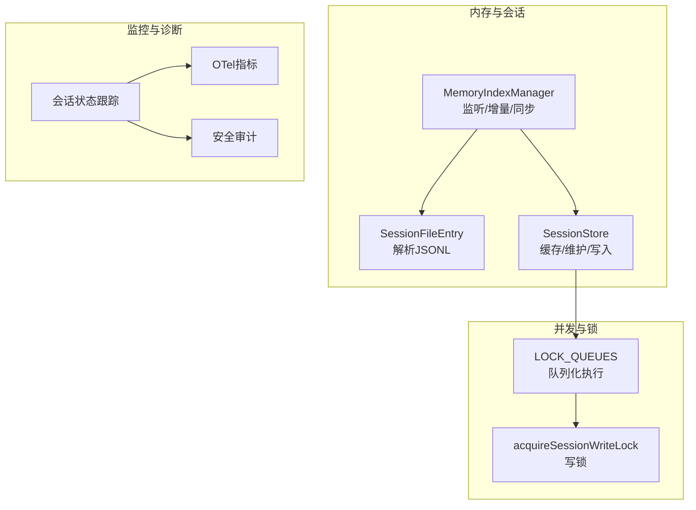
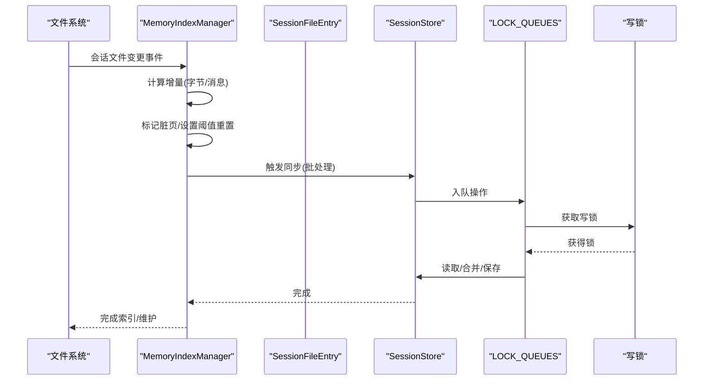
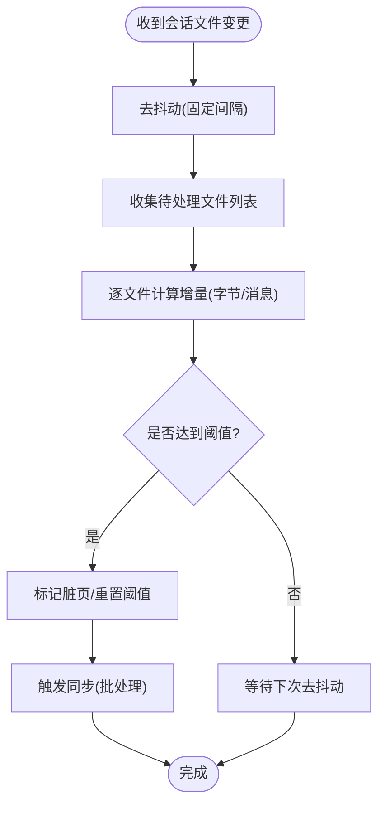
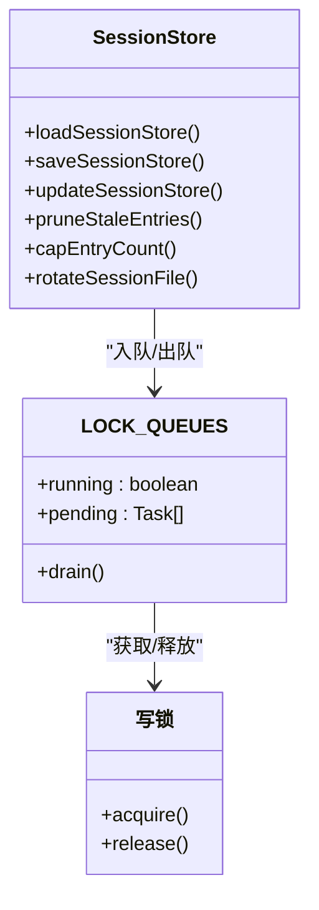
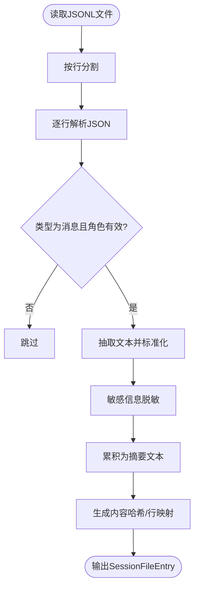
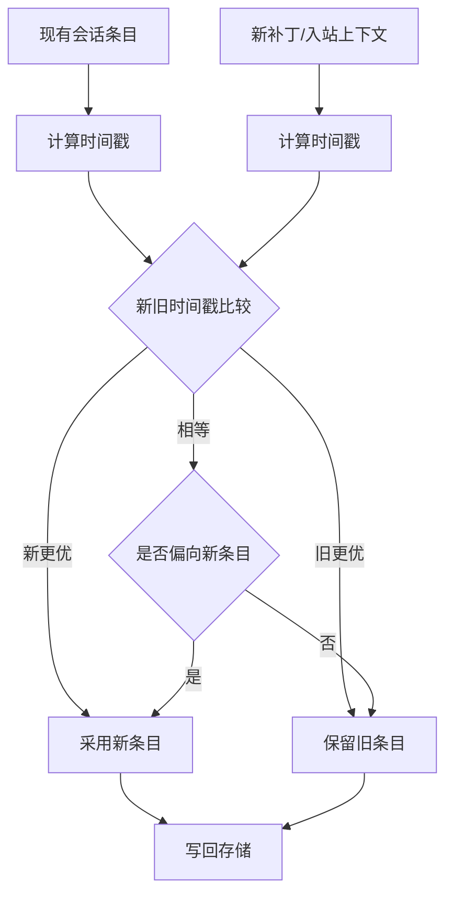
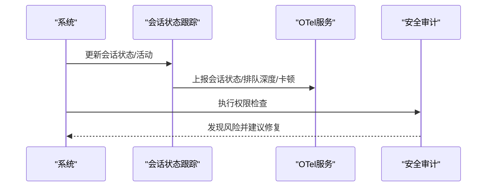
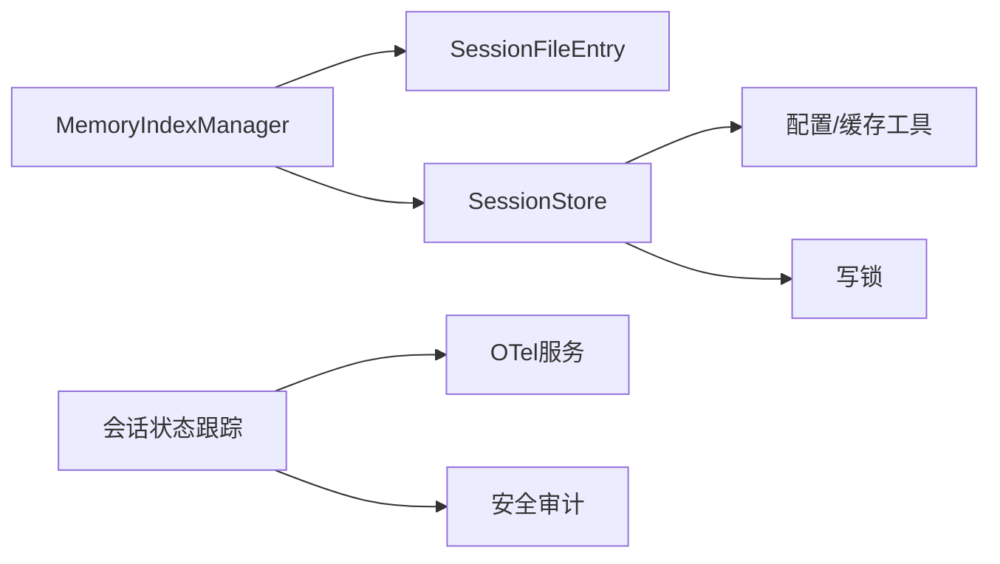

# 会话同步

<cite>
**本文引用的文件**
- [src/memory/manager.ts](file://src/memory/manager.ts)
- [src/config/sessions/store.ts](file://src/config/sessions/store.ts)
- [src/config/sessions/types.ts](file://src/config/sessions/types.ts)
- [src/memory/session-files.ts](file://src/memory/session-files.ts)
- [src/agents/session-file-repair.ts](file://src/agents/session-file-repair.ts)
- [src/cron/service/locked.ts](file://src/cron/service/locked.ts)
- [src/gateway/server-methods/usage.ts](file://src/gateway/server-methods/usage.ts)
- [src/logging/diagnostic.ts](file://src/logging/diagnostic.ts)
- [extensions/diagnostics-otel/src/service.ts](file://extensions/diagnostics-otel/src/service.ts)
- [src/security/audit-extra.async.ts](file://src/security/audit-extra.async.ts)
- [src/infra/state-migrations.ts](file://src/infra/state-migrations.ts)
</cite>

## 目录

1. [引言](#引言)
2. [项目结构](#项目结构)
3. [核心组件](#核心组件)
4. [架构总览](#架构总览)
5. [详细组件分析](#详细组件分析)
6. [依赖关系分析](#依赖关系分析)
7. [性能考量](#性能考量)
8. [故障排查指南](#故障排查指南)
9. [结论](#结论)
10. [附录](#附录)

## 引言

本文件面向OpenClaw会话同步系统，系统性阐述“会话文件与内存数据”的同步机制、增量更新与冲突解决策略、会话文件的序列化格式与版本迁移、同步任务调度与并发控制、事务一致性保障、性能优化与批量处理、错误恢复、状态管理与数据完整性校验，以及可靠性设计、监控告警与故障诊断方案。目标是帮助开发者与运维人员全面理解并高效维护该同步子系统。

## 项目结构

围绕会话同步的关键模块包括：

- 内存索引管理器：负责监听会话文件变化、计算增量、触发同步与索引构建。
- 会话存储（sessions.json）：持久化的会话元数据与路由信息，支持缓存、维护与原子写入。
- 会话文件解析：从JSONL会话文件中抽取可检索文本，生成内容摘要与行映射。
- 并发与锁：通过队列化与写锁确保对会话存储的串行化访问，避免竞态。
- 监控与诊断：会话状态跟踪、OTel指标与告警、安全审计与修复工具。

**图表来源**

- [src/memory/manager.ts](file://src/memory/manager.ts#L848-L913)
- [src/memory/session-files.ts](file://src/memory/session-files.ts#L74-L131)
- [src/config/sessions/store.ts](file://src/config/sessions/store.ts#L626-L753)
- [src/logging/diagnostic.ts](file://src/logging/diagnostic.ts#L1-L61)
- [extensions/diagnostics-otel/src/service.ts](file://extensions/diagnostics-otel/src/service.ts#L166-L202)
- [src/security/audit-extra.async.ts](file://src/security/audit-extra.async.ts#L477-L501)

**章节来源**

- [src/memory/manager.ts](file://src/memory/manager.ts#L848-L913)
- [src/config/sessions/store.ts](file://src/config/sessions/store.ts#L626-L753)
- [src/memory/session-files.ts](file://src/memory/session-files.ts#L74-L131)

## 核心组件

- MemoryIndexManager：监听会话目录变化，按阈值计算增量（字节/消息数），标记脏页并触发同步；支持定时同步与搜索触发同步。
- SessionStore：提供加载、更新、保存、维护（裁剪、清理、轮转）、缓存与写锁；支持迁移与兼容字段修正。
- SessionFileEntry：从JSONL会话文件提取用户/助手消息文本，生成内容摘要与哈希，用于索引比对与增量判断。
- 并发与锁：基于队列的串行化执行与写锁，确保多进程/多线程下的一致性。
- 监控与诊断：会话状态跟踪、OTel计数器/直方图、安全审计与修复工具。

**章节来源**

- [src/memory/manager.ts](file://src/memory/manager.ts#L111-L248)
- [src/config/sessions/store.ts](file://src/config/sessions/store.ts#L147-L213)
- [src/memory/session-files.ts](file://src/memory/session-files.ts#L10-L19)

## 架构总览

会话同步以“事件驱动 + 增量阈值 + 批处理 + 并发控制”为核心，形成如下闭环：

- 事件源：会话文件写入（JSONL）与内存文件变化。
- 增量计算：统计新增字节数与新增消息数，达到阈值后标记需要同步。
- 同步执行：合并脏页，批量索引，更新数据库，必要时进行维护（裁剪、轮转）。
- 并发控制：队列化与写锁，保证会话存储的原子性与一致性。
- 监控与恢复：状态跟踪、指标上报、安全审计、文件修复工具。

**图表来源**

- [src/memory/manager.ts](file://src/memory/manager.ts#L864-L913)
- [src/memory/session-files.ts](file://src/memory/session-files.ts#L74-L131)
- [src/config/sessions/store.ts](file://src/config/sessions/store.ts#L590-L602)
- [src/config/sessions/store.ts](file://src/config/sessions/store.ts#L712-L753)

## 详细组件分析

### 组件A：会话文件增量与同步调度

- 事件监听：订阅会话目录变更，去抖动后批量处理。
- 增量计算：基于文件大小与新增范围统计字节与消息数量，支持阈值触发。
- 批处理：将多个文件的增量合并，统一进入同步流程，降低写放大。
- 触发条件：阈值命中、定时器、搜索触发、会话开始等。

**图表来源**

- [src/memory/manager.ts](file://src/memory/manager.ts#L864-L913)
- [src/memory/manager.ts](file://src/memory/manager.ts#L915-L1010)

**章节来源**

- [src/memory/manager.ts](file://src/memory/manager.ts#L864-L913)
- [src/memory/manager.ts](file://src/memory/manager.ts#L915-L1010)

### 组件B：会话存储与并发控制

- 缓存：TTL缓存sessions.json，命中则直接返回深拷贝，避免重复解析。
- 维护：过期清理、条目上限裁剪、文件大小轮转，支持“仅警告不强制”模式。
- 写入：Windows平台直接写入；非Windows平台使用临时文件+原子重命名，失败回退。
- 并发：队列化执行，写锁保护，超时与清理保障。

**图表来源**

- [src/config/sessions/store.ts](file://src/config/sessions/store.ts#L147-L213)
- [src/config/sessions/store.ts](file://src/config/sessions/store.ts#L476-L588)
- [src/config/sessions/store.ts](file://src/config/sessions/store.ts#L626-L753)

**章节来源**

- [src/config/sessions/store.ts](file://src/config/sessions/store.ts#L147-L213)
- [src/config/sessions/store.ts](file://src/config/sessions/store.ts#L476-L588)
- [src/config/sessions/store.ts](file://src/config/sessions/store.ts#L626-L753)

### 组件C：会话文件解析与内容摘要

- 解析：逐行读取JSONL，过滤非消息类型，抽取用户/助手文本。
- 摘要：标准化空白字符，拼接为可检索文本，生成内容哈希与行映射。
- 红色：敏感信息脱敏，避免泄露。

**图表来源**

- [src/memory/session-files.ts](file://src/memory/session-files.ts#L74-L131)

**章节来源**

- [src/memory/session-files.ts](file://src/memory/session-files.ts#L74-L131)

### 组件D：会话元数据与冲突解决

- 字段合并：以updatedAt为准，时间戳更大者优先；相等时可配置偏向新值。
- 兼容迁移：旧字段（如provider、room）自动迁移至新字段（channel、groupChannel）。
- 最终一致性：通过增量阈值与定期同步，确保会话元数据与索引一致。

**图表来源**

- [src/config/sessions/types.ts](file://src/config/sessions/types.ts#L111-L121)
- [src/infra/state-migrations.ts](file://src/infra/state-migrations.ts#L226-L255)

**章节来源**

- [src/config/sessions/types.ts](file://src/config/sessions/types.ts#L111-L121)
- [src/infra/state-migrations.ts](file://src/infra/state-migrations.ts#L226-L255)

### 组件E：会话状态管理与监控

- 状态跟踪：记录会话键/ID、最后活动时间、队列深度、当前状态（空闲/处理/等待）。
- 指标上报：OTel计数器/直方图，覆盖会话卡顿、排队深度、运行尝试等。
- 安全审计：检查sessions.json权限，防止世界可读/组可读导致敏感信息泄露。

**图表来源**

- [src/logging/diagnostic.ts](file://src/logging/diagnostic.ts#L1-L61)
- [extensions/diagnostics-otel/src/service.ts](file://extensions/diagnostics-otel/src/service.ts#L166-L202)
- [src/security/audit-extra.async.ts](file://src/security/audit-extra.async.ts#L477-L501)

**章节来源**

- [src/logging/diagnostic.ts](file://src/logging/diagnostic.ts#L1-L61)
- [extensions/diagnostics-otel/src/service.ts](file://extensions/diagnostics-otel/src/service.ts#L166-L202)
- [src/security/audit-extra.async.ts](file://src/security/audit-extra.async.ts#L477-L501)

## 依赖关系分析

- MemoryIndexManager依赖：
  - 会话文件解析：构建SessionFileEntry，计算哈希与内容摘要。
  - 会话存储：读取/更新/保存，维护与轮转。
  - 并发控制：队列化与写锁，避免竞态。
- 会话存储依赖：
  - 配置与缓存工具：TTL缓存、维护参数解析。
  - 写锁：跨进程/线程串行化。
- 监控与诊断：
  - 会话状态跟踪与OTel指标联动。
  - 安全审计与修复工具协同。

**图表来源**

- [src/memory/manager.ts](file://src/memory/manager.ts#L848-L913)
- [src/memory/session-files.ts](file://src/memory/session-files.ts#L74-L131)
- [src/config/sessions/store.ts](file://src/config/sessions/store.ts#L626-L753)
- [src/logging/diagnostic.ts](file://src/logging/diagnostic.ts#L1-L61)
- [extensions/diagnostics-otel/src/service.ts](file://extensions/diagnostics-otel/src/service.ts#L166-L202)
- [src/security/audit-extra.async.ts](file://src/security/audit-extra.async.ts#L477-L501)

**章节来源**

- [src/memory/manager.ts](file://src/memory/manager.ts#L848-L913)
- [src/memory/session-files.ts](file://src/memory/session-files.ts#L74-L131)
- [src/config/sessions/store.ts](file://src/config/sessions/store.ts#L626-L753)

## 性能考量

- 增量阈值：通过字节与消息数双阈值减少无效同步，结合去抖动降低抖动开销。
- 批处理：合并多个文件增量，减少索引与写盘次数。
- 并发控制：队列化与写锁避免写放大与竞态，提升吞吐。
- 维护策略：裁剪与轮转在写入前执行，避免单次大写带来的阻塞。
- I/O优化：临时文件+原子重命名，失败回退到直接写入，兼顾一致性与可用性。

[本节为通用性能指导，无需特定文件引用]

## 故障排查指南

- 会话文件损坏或格式异常：使用会话修复工具扫描并丢弃无效行，保留有效头部与消息。
- 会话存储并发冲突：检查队列长度与超时日志，确认写锁是否被长时间占用。
- 权限问题：审计sessions.json权限，确保仅所有者可读写，避免敏感信息泄露。
- 卡顿与堆积：查看OTel会话卡顿计数与年龄直方图，定位长时间未完成的会话。
- 使用查询：通过网关方法查询会话使用时间序列，辅助定位异常峰值。

**章节来源**

- [src/agents/session-file-repair.ts](file://src/agents/session-file-repair.ts#L41-L70)
- [src/config/sessions/store.ts](file://src/config/sessions/store.ts#L626-L753)
- [src/security/audit-extra.async.ts](file://src/security/audit-extra.async.ts#L477-L501)
- [extensions/diagnostics-otel/src/service.ts](file://extensions/diagnostics-otel/src/service.ts#L195-L202)
- [src/gateway/server-methods/usage.ts](file://src/gateway/server-methods/usage.ts#L762-L800)

## 结论

OpenClaw会话同步系统通过“事件驱动 + 增量阈值 + 批处理 + 并发控制 + 维护策略 + 监控审计”的组合拳，实现了高可靠、高性能、可扩展的会话文件与内存数据同步。其设计在保证一致性的同时，兼顾了实时性与资源效率，并提供了完善的可观测性与安全基线，适合在生产环境中长期稳定运行。

## 附录

### 会话文件序列化格式与版本管理

- 文件格式：JSONL（每行一条消息记录），支持用户/助手角色的消息抽取。
- 元数据：会话条目包含路由、上下文、令牌用量、模型与提供方等字段，支持迁移与兼容。
- 版本与迁移：旧字段（如provider、room）自动迁移至新字段（channel、groupChannel），并提供兼容路径。

**章节来源**

- [src/memory/session-files.ts](file://src/memory/session-files.ts#L74-L131)
- [src/config/sessions/types.ts](file://src/config/sessions/types.ts#L14-L109)
- [src/infra/state-migrations.ts](file://src/infra/state-migrations.ts#L226-L255)

### 同步任务调度与事务一致性

- 调度：去抖动批处理、定时同步、搜索触发、会话开始触发。
- 一致性：写锁+队列化确保串行化写入；缓存TTL与失效策略保证读写一致性；维护阶段在写入前执行，避免脏数据。

**章节来源**

- [src/memory/manager.ts](file://src/memory/manager.ts#L864-L913)
- [src/config/sessions/store.ts](file://src/config/sessions/store.ts#L626-L753)

### 错误恢复与监控告警

- 错误恢复：写入失败回退到直接写入；修复工具丢弃无效行；审计发现权限问题及时提示修复。
- 监控告警：OTel计数器/直方图覆盖会话卡顿、排队深度、运行尝试等；诊断事件记录会话状态变化。

**章节来源**

- [src/config/sessions/store.ts](file://src/config/sessions/store.ts#L542-L577)
- [src/agents/session-file-repair.ts](file://src/agents/session-file-repair.ts#L41-L70)
- [extensions/diagnostics-otel/src/service.ts](file://extensions/diagnostics-otel/src/service.ts#L195-L202)
- [src/logging/diagnostic.ts](file://src/logging/diagnostic.ts#L1-L61)
