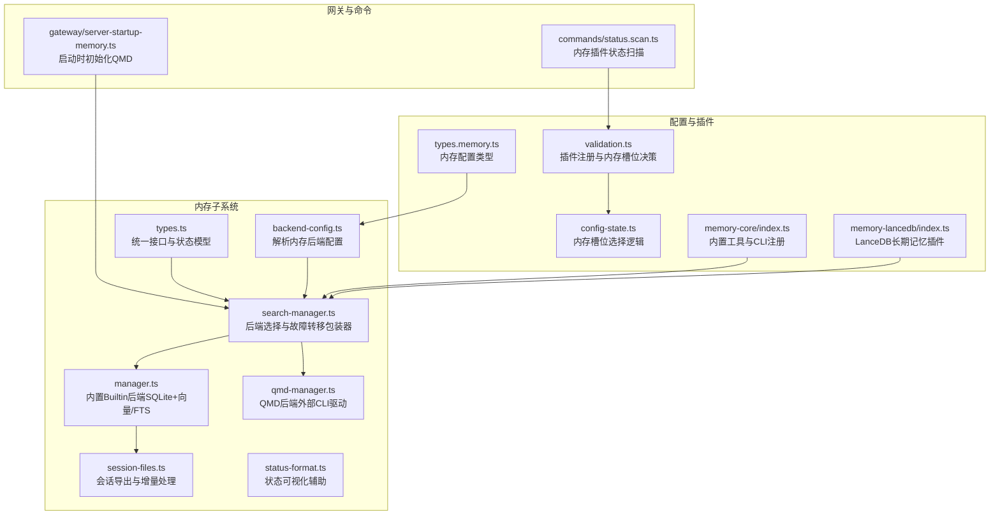
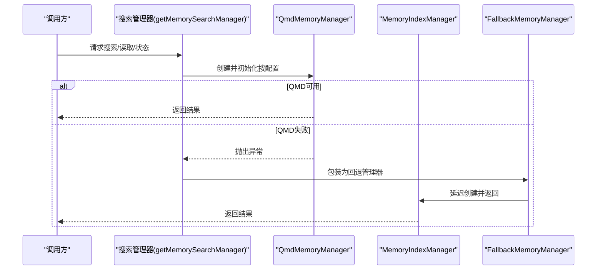
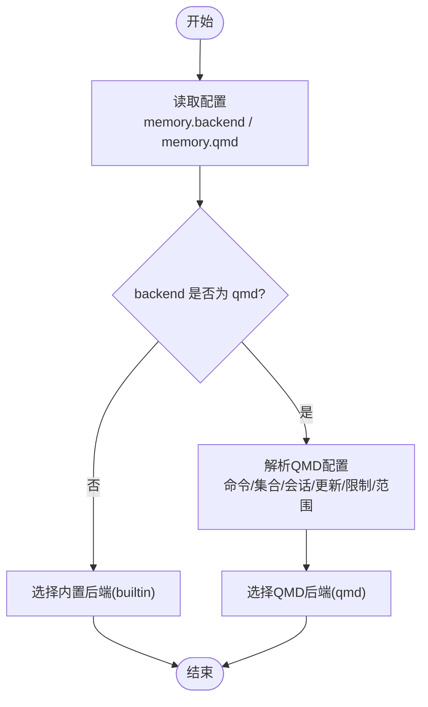
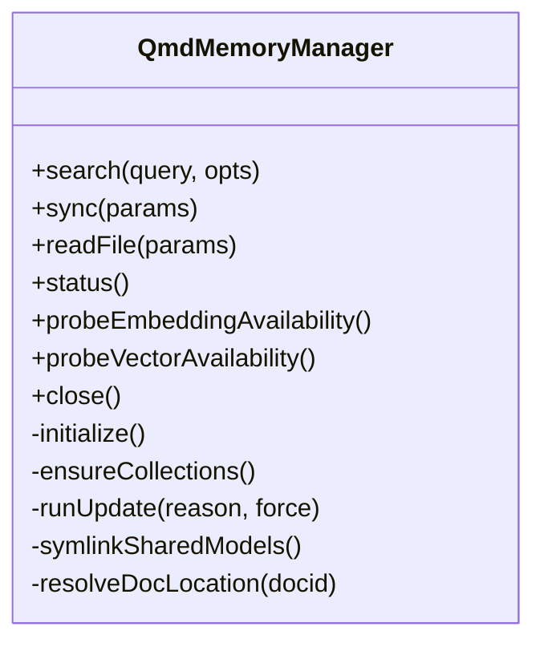
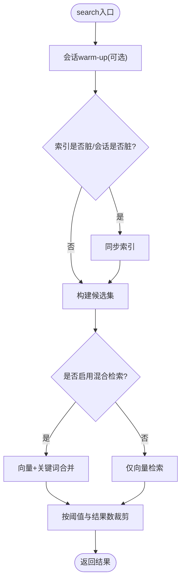
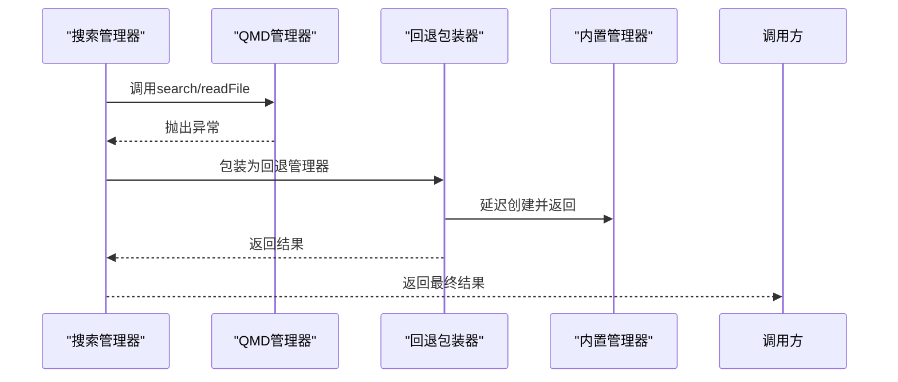
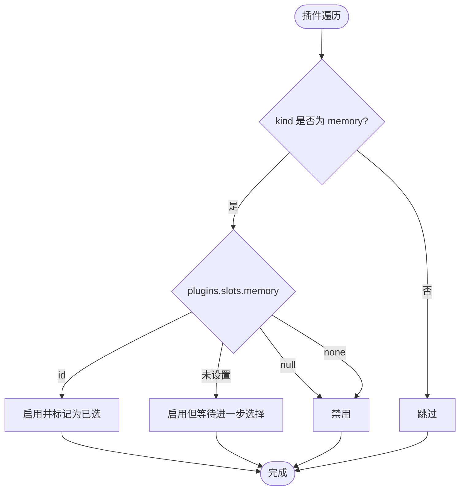
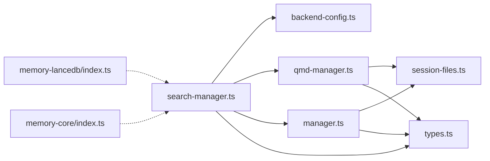

# 内存后端

<cite>
**本文引用的文件**
- [src/memory/backend-config.ts](file://src/memory/backend-config.ts)
- [src/memory/index.ts](file://src/memory/index.ts)
- [src/memory/search-manager.ts](file://src/memory/search-manager.ts)
- [src/memory/types.ts](file://src/memory/types.ts)
- [src/memory/qmd-manager.ts](file://src/memory/qmd-manager.ts)
- [src/memory/manager.ts](file://src/memory/manager.ts)
- [src/memory/session-files.ts](file://src/memory/session-files.ts)
- [src/memory/status-format.ts](file://src/memory/status-format.ts)
- [src/config/types.memory.ts](file://src/config/types.memory.ts)
- [src/config/validation.ts](file://src/config/validation.ts)
- [src/plugins/config-state.ts](file://src/plugins/config-state.ts)
- [src/gateway/server-startup-memory.ts](file://src/gateway/server-startup-memory.ts)
- [extensions/memory-core/index.ts](file://extensions/memory-core/index.ts)
- [extensions/memory-lancedb/index.ts](file://extensions/memory-lancedb/index.ts)
- [src/commands/status.scan.ts](file://src/commands/status.scan.ts)
- [src/agents/failover-error.ts](file://src/agents/failover-error.ts)
</cite>

## 目录

1. [简介](#简介)
2. [项目结构](#项目结构)
3. [核心组件](#核心组件)
4. [架构总览](#架构总览)
5. [详细组件分析](#详细组件分析)
6. [依赖关系分析](#依赖关系分析)
7. [性能考量](#性能考量)
8. [故障排查指南](#故障排查指南)
9. [结论](#结论)
10. [附录](#附录)

## 简介

本文件面向OpenClaw内存后端系统，系统采用“多后端 + 混合存储 + 故障转移”的架构设计，支持内置SQLite向量/关键词检索（builtin）与外部CLI驱动的QMD索引（qmd），并提供LanceDB长期记忆插件作为可选后端。文档覆盖以下主题：

- 多后端架构与后端选择策略
- 配置解析与验证、启动初始化
- Hybrid混合检索（向量+关键词）与优先级
- 故障转移与降级回退
- 连接池与资源监控
- 性能指标、容量规划与成本优化
- 后端切换、数据迁移与兼容性处理
- 扩展性、高可用与灾备策略

## 项目结构

OpenClaw将内存后端能力集中在src/memory目录，并通过插件扩展支持不同后端实现；配置类型定义在src/config下，插件槽位决策在src/plugins中。

图表来源

- [src/memory/backend-config.ts](file://src/memory/backend-config.ts#L254-L311)
- [src/memory/search-manager.ts](file://src/memory/search-manager.ts#L19-L65)
- [src/memory/manager.ts](file://src/memory/manager.ts#L169-L203)
- [src/memory/qmd-manager.ts](file://src/memory/qmd-manager.ts#L45-L133)
- [src/memory/session-files.ts](file://src/memory/session-files.ts#L21-L33)
- [src/memory/status-format.ts](file://src/memory/status-format.ts#L1-L45)
- [src/config/types.memory.ts](file://src/config/types.memory.ts#L1-L53)
- [src/config/validation.ts](file://src/config/validation.ts#L336-L365)
- [src/plugins/config-state.ts](file://src/plugins/config-state.ts#L197-L225)
- [extensions/memory-core/index.ts](file://extensions/memory-core/index.ts#L10-L35)
- [extensions/memory-lancedb/index.ts](file://extensions/memory-lancedb/index.ts#L242-L627)
- [src/gateway/server-startup-memory.ts](file://src/gateway/server-startup-memory.ts#L6-L24)
- [src/commands/status.scan.ts](file://src/commands/status.scan.ts#L29-L39)

章节来源

- [src/memory/backend-config.ts](file://src/memory/backend-config.ts#L1-L311)
- [src/memory/search-manager.ts](file://src/memory/search-manager.ts#L1-L224)
- [src/config/types.memory.ts](file://src/config/types.memory.ts#L1-L53)
- [src/config/validation.ts](file://src/config/validation.ts#L336-L365)
- [src/plugins/config-state.ts](file://src/plugins/config-state.ts#L197-L225)
- [src/gateway/server-startup-memory.ts](file://src/gateway/server-startup-memory.ts#L1-L24)
- [extensions/memory-core/index.ts](file://extensions/memory-core/index.ts#L1-L39)
- [extensions/memory-lancedb/index.ts](file://extensions/memory-lancedb/index.ts#L1-L627)
- [src/commands/status.scan.ts](file://src/commands/status.scan.ts#L23-L39)

## 核心组件

- 配置解析与默认值：负责将用户配置标准化为ResolvedQmdConfig或builtin配置，包括路径解析、时间间隔、超时、搜索模式、会话导出等。
- 搜索管理器：根据配置选择QMD或builtin后端；若QMD失败则自动回退到builtin；同时缓存管理器实例以避免重复初始化。
- QMD管理器：通过外部qmd CLI维护索引，支持集合管理、增量更新、嵌入生成、会话导出、文档定位与行号提取。
- 内置管理器（Builtin）：基于SQLite，支持向量表（sqlite-vec）、FTS表、嵌入批处理、缓存、增量同步与会话监听。
- 插件与槽位：通过插件系统注册memory类插件，使用plugins.slots.memory进行后端选择与启用控制。
- 状态与监控：统一的状态结构体包含向量/FTS/缓存/批处理等指标，便于CLI与UI展示。

章节来源

- [src/memory/backend-config.ts](file://src/memory/backend-config.ts#L254-L311)
- [src/memory/search-manager.ts](file://src/memory/search-manager.ts#L19-L65)
- [src/memory/types.ts](file://src/memory/types.ts#L24-L59)
- [src/memory/qmd-manager.ts](file://src/memory/qmd-manager.ts#L45-L133)
- [src/memory/manager.ts](file://src/memory/manager.ts#L111-L203)
- [src/plugins/config-state.ts](file://src/plugins/config-state.ts#L197-L225)

## 架构总览

OpenClaw内存后端采用“统一接口 + 多实现 + 自动回退”的设计：

- 统一接口：MemorySearchManager定义了search、readFile、status、sync、probeEmbeddingAvailability、probeVectorAvailability、close等方法。
- 多后端实现：builtin（SQLite向量/FTS）、qmd（外部CLI）、以及可选的LanceDB插件。
- 故障转移：当QMD不可用或异常时，自动包装为FallbackMemoryManager，回退到builtin；错误被记录并缓存，下次请求可重新尝试。
- 启动初始化：网关启动阶段可触发QMD的启动同步，确保索引就绪。

图表来源

- [src/memory/search-manager.ts](file://src/memory/search-manager.ts#L19-L65)
- [src/memory/qmd-manager.ts](file://src/memory/qmd-manager.ts#L45-L133)
- [src/memory/manager.ts](file://src/memory/manager.ts#L111-L203)

章节来源

- [src/memory/search-manager.ts](file://src/memory/search-manager.ts#L67-L202)
- [src/gateway/server-startup-memory.ts](file://src/gateway/server-startup-memory.ts#L6-L24)

## 详细组件分析

### 配置解析与后端选择

- 解析流程：从OpenClawConfig读取memory.backend与memory.qmd，结合agent工作区路径，解析集合、会话导出、更新策略、限制参数与搜索范围。
- 默认值策略：未设置时采用内置后端与合理默认值；QMD默认命令为qmd，搜索模式为query，更新间隔、去抖、超时均有默认。
- 插件槽位：plugins.slots.memory决定启用哪个memory插件；当设为none或未设置时禁用内存插件；否则默认memory-core。

图表来源

- [src/memory/backend-config.ts](file://src/memory/backend-config.ts#L254-L311)
- [src/config/types.memory.ts](file://src/config/types.memory.ts#L7-L22)
- [src/commands/status.scan.ts](file://src/commands/status.scan.ts#L29-L39)

章节来源

- [src/memory/backend-config.ts](file://src/memory/backend-config.ts#L16-L311)
- [src/config/types.memory.ts](file://src/config/types.memory.ts#L1-L53)
- [src/commands/status.scan.ts](file://src/commands/status.scan.ts#L23-L39)

### QMD后端（外部CLI驱动）

- 初始化与隔离：为每个agent在状态目录下建立独立的XDG目录，隔离qmd的配置与缓存；共享默认模型目录以避免重复下载。
- 集合管理：通过qmd CLI列出/添加集合，确保索引数据库中的集合存在且唯一。
- 更新与嵌入：支持定时更新与强制更新；按需执行embed生成向量；支持会话导出到独立集合。
- 查询与回退：支持多种搜索模式，不支持时自动回退到query模式；超时与错误处理完善。
- 文档定位：通过SQLite查询documents表定位文档路径与相对位置，提取片段行号。

图表来源

- [src/memory/qmd-manager.ts](file://src/memory/qmd-manager.ts#L45-L133)
- [src/memory/qmd-manager.ts](file://src/memory/qmd-manager.ts#L423-L471)
- [src/memory/qmd-manager.ts](file://src/memory/qmd-manager.ts#L553-L593)
- [src/memory/qmd-manager.ts](file://src/memory/qmd-manager.ts#L661-L697)

章节来源

- [src/memory/qmd-manager.ts](file://src/memory/qmd-manager.ts#L135-L170)
- [src/memory/qmd-manager.ts](file://src/memory/qmd-manager.ts#L182-L239)
- [src/memory/qmd-manager.ts](file://src/memory/qmd-manager.ts#L423-L471)
- [src/memory/qmd-manager.ts](file://src/memory/qmd-manager.ts#L553-L593)
- [src/memory/qmd-manager.ts](file://src/memory/qmd-manager.ts#L661-L697)

### 内置后端（Builtin，SQLite）

- 混合检索：支持向量检索（sqlite-vec）与FTS全文检索（可选），通过权重合并结果；支持BM25归一化评分。
- 批处理与缓存：支持远程嵌入批处理（OpenAI/Gemini/Voyage），嵌入缓存表减少重复计算；可配置批处理并发与轮询。
- 增量同步：文件系统监听与会话增量，按需同步；支持会话开始warm-up与定期同步。
- 状态与指标：统一状态结构体包含文件/块数量、向量/FTS可用性、缓存条目数、批处理失败计数等。

图表来源

- [src/memory/manager.ts](file://src/memory/manager.ts#L266-L314)
- [src/memory/manager.ts](file://src/memory/manager.ts#L316-L332)
- [src/memory/manager.ts](file://src/memory/manager.ts#L338-L358)
- [src/memory/manager.ts](file://src/memory/manager.ts#L360-L389)

章节来源

- [src/memory/manager.ts](file://src/memory/manager.ts#L266-L314)
- [src/memory/manager.ts](file://src/memory/manager.ts#L316-L332)
- [src/memory/manager.ts](file://src/memory/manager.ts#L338-L358)
- [src/memory/manager.ts](file://src/memory/manager.ts#L360-L389)
- [src/memory/manager.ts](file://src/memory/manager.ts#L470-L565)

### 故障转移与降级回退

- 包装器：FallbackMemoryManager在QMD失败时接管，延迟创建builtin实例；记录最后一次错误原因，下次请求可重新尝试。
- 缓存失效：一旦QMD失败，包装器从缓存中移除，避免重复使用失败实例。
- 状态标注：状态中包含fallback字段，指示回退来源与原因，便于诊断。

图表来源

- [src/memory/search-manager.ts](file://src/memory/search-manager.ts#L67-L202)

章节来源

- [src/memory/search-manager.ts](file://src/memory/search-manager.ts#L67-L202)

### 插件槽位与后端选择

- 插件注册：memory-core与memory-lancedb均为memory类插件；通过plugins.slots.memory选择启用的插件。
- 选择逻辑：当槽位为字符串且与插件id一致时启用；当已存在已选插件且当前插件不是它时拒绝启用；当槽位为null或none时禁用。

图表来源

- [src/plugins/config-state.ts](file://src/plugins/config-state.ts#L197-L225)
- [src/config/validation.ts](file://src/config/validation.ts#L336-L365)
- [src/commands/status.scan.ts](file://src/commands/status.scan.ts#L29-L39)

章节来源

- [src/plugins/config-state.ts](file://src/plugins/config-state.ts#L197-L225)
- [src/config/validation.ts](file://src/config/validation.ts#L336-L365)
- [src/commands/status.scan.ts](file://src/commands/status.scan.ts#L23-L39)

### 启动时初始化与会话导出

- 启动初始化：网关启动阶段可触发QMD的启动同步，确保索引在服务就绪前完成构建。
- 会话导出：内置后端可将会话转写为Markdown并导出到独立集合，支持保留天数清理。

章节来源

- [src/gateway/server-startup-memory.ts](file://src/gateway/server-startup-memory.ts#L6-L24)
- [src/memory/qmd-manager.ts](file://src/memory/qmd-manager.ts#L113-L132)
- [src/memory/manager.ts](file://src/memory/manager.ts#L606-L639)

## 依赖关系分析

- 组件耦合：search-manager对backend-config强依赖；qmd-manager与builtin分别依赖各自的配置解析与状态结构；session-files被两者共同使用。
- 外部依赖：qmd-manager依赖外部qmd CLI；builtin依赖sqlite与sqlite-vec扩展；LanceDB插件依赖@lancedb/lancedb与OpenAI。
- 可能的循环：当前模块间无明显循环导入；搜索管理器通过动态导入避免直接循环依赖。

图表来源

- [src/memory/search-manager.ts](file://src/memory/search-manager.ts#L19-L65)
- [src/memory/backend-config.ts](file://src/memory/backend-config.ts#L254-L311)
- [src/memory/qmd-manager.ts](file://src/memory/qmd-manager.ts#L45-L133)
- [src/memory/manager.ts](file://src/memory/manager.ts#L111-L203)
- [src/memory/session-files.ts](file://src/memory/session-files.ts#L21-L33)
- [src/memory/types.ts](file://src/memory/types.ts#L61-L81)
- [extensions/memory-lancedb/index.ts](file://extensions/memory-lancedb/index.ts#L242-L627)
- [extensions/memory-core/index.ts](file://extensions/memory-core/index.ts#L10-L35)

章节来源

- [src/memory/search-manager.ts](file://src/memory/search-manager.ts#L19-L65)
- [src/memory/backend-config.ts](file://src/memory/backend-config.ts#L254-L311)
- [src/memory/qmd-manager.ts](file://src/memory/qmd-manager.ts#L45-L133)
- [src/memory/manager.ts](file://src/memory/manager.ts#L111-L203)
- [src/memory/session-files.ts](file://src/memory/session-files.ts#L21-L33)
- [src/memory/types.ts](file://src/memory/types.ts#L61-L81)
- [extensions/memory-lancedb/index.ts](file://extensions/memory-lancedb/index.ts#L242-L627)
- [extensions/memory-core/index.ts](file://extensions/memory-core/index.ts#L10-L35)

## 性能考量

- 混合检索权重：向量与关键词权重可调，建议根据数据特征与召回需求调整；候选集大小与最小分数阈值影响性能与质量。
- 批处理与重试：内置后端支持嵌入批处理与重试策略，建议合理设置并发与超时，避免阻塞；批处理失败次数达到上限后进入保护状态。
- 向量扩展加载：sqlite-vec加载有超时保护，失败时会记录错误并保持可用性为false，避免影响主流程。
- QMD更新策略：支持去抖与强制队列，避免频繁更新；嵌入生成可按间隔触发，减少I/O压力。
- 容量规划与成本优化：
  - builtin：关注索引文件大小、向量维度、FTS可用性；合理设置最大注入字符数与结果数。
  - qmd：关注CLI命令超时、更新与嵌入超时；通过共享模型目录降低下载成本。
  - LanceDB：关注向量维度、表大小与嵌入模型成本；提供自动回忆与捕获，适合长期记忆场景。

章节来源

- [src/memory/manager.ts](file://src/memory/manager.ts#L286-L314)
- [src/memory/manager.ts](file://src/memory/manager.ts#L567-L582)
- [src/memory/manager.ts](file://src/memory/manager.ts#L613-L667)
- [src/memory/qmd-manager.ts](file://src/memory/qmd-manager.ts#L423-L471)
- [extensions/memory-lancedb/index.ts](file://extensions/memory-lancedb/index.ts#L115-L139)

## 故障排查指南

- QMD失败回退：查看回退包装器状态中的fallback字段，确认回退来源与错误原因；检查qmd CLI是否存在、权限与版本。
- 嵌入可用性探测：内置后端提供probeEmbeddingAvailability与probeVectorAvailability，用于快速判断远程/本地嵌入与向量扩展状态。
- 错误分类：对网络超时、连接中断等错误进行分类，便于区分临时性与永久性问题。
- 状态可视化：使用status-format工具将状态映射为视觉提示（ok/warn/muted），辅助运维观察。

章节来源

- [src/memory/search-manager.ts](file://src/memory/search-manager.ts#L115-L142)
- [src/memory/manager.ts](file://src/memory/manager.ts#L574-L582)
- [src/agents/failover-error.ts](file://src/agents/failover-error.ts#L167-L234)
- [src/memory/status-format.ts](file://src/memory/status-format.ts#L1-L45)

## 结论

OpenClaw内存后端通过统一接口与多后端实现，结合混合检索与自动回退机制，在保证功能完整性的同时兼顾性能与可靠性。配置解析与插件槽位决策提供了灵活的后端选择能力；内置与QMD后端各具优势，可按场景组合使用；LanceDB插件为长期记忆场景提供增强能力。通过完善的监控与故障转移策略，系统具备良好的可运维性与扩展性。

## 附录

- 启动初始化：网关启动阶段可触发QMD的启动同步，确保索引在服务就绪前完成构建。
- 工具与CLI：memory-core插件注册内存搜索与读取工具及CLI命令；LanceDB插件提供ltm命令族与生命周期钩子。

章节来源

- [src/gateway/server-startup-memory.ts](file://src/gateway/server-startup-memory.ts#L6-L24)
- [extensions/memory-core/index.ts](file://extensions/memory-core/index.ts#L10-L35)
- [extensions/memory-lancedb/index.ts](file://extensions/memory-lancedb/index.ts#L448-L488)
