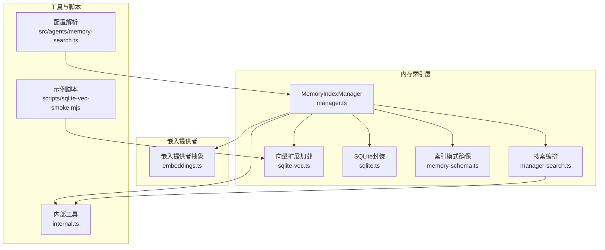
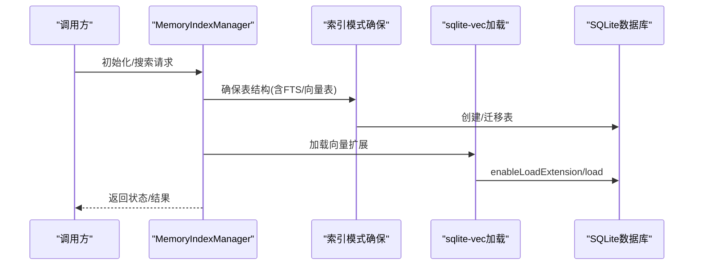
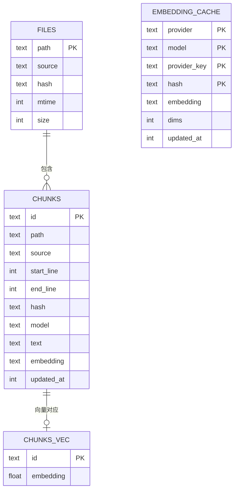
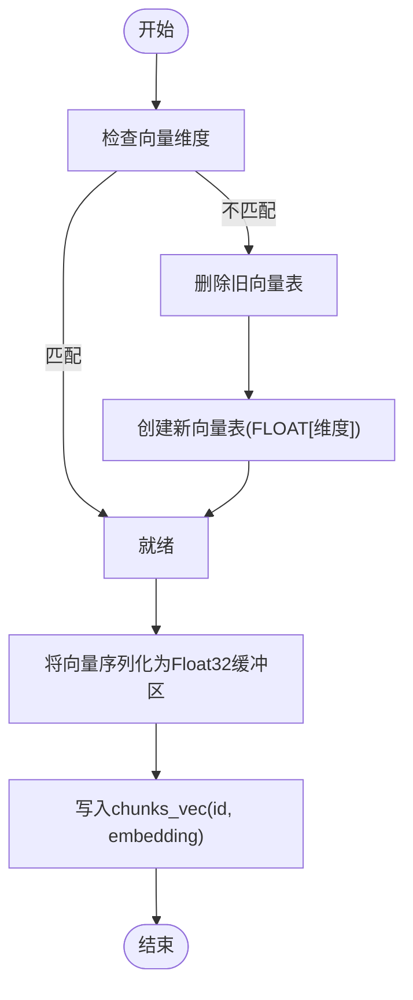
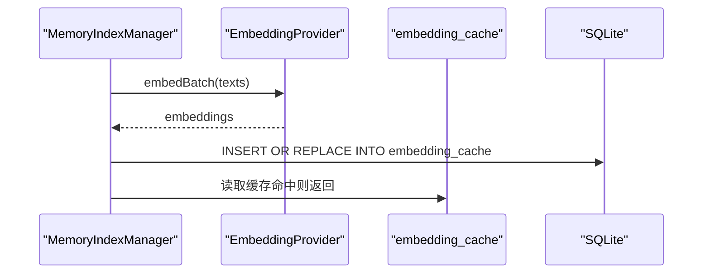
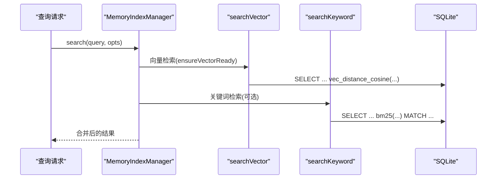
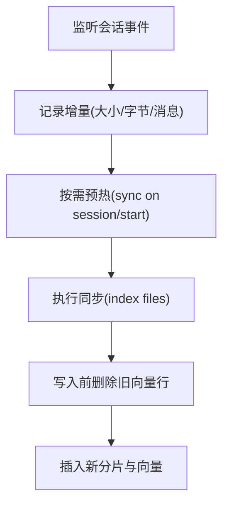
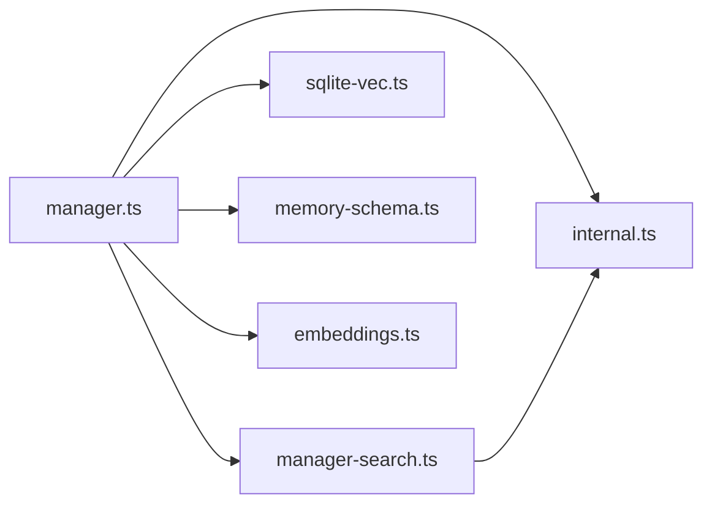

# 向量存储

<cite>
**本文引用的文件**
- [src/memory/manager.ts](file://src/memory/manager.ts)
- [src/memory/manager-search.ts](file://src/memory/manager-search.ts)
- [src/memory/sqlite-vec.ts](file://src/memory/sqlite-vec.ts)
- [src/memory/sqlite.ts](file://src/memory/sqlite.ts)
- [src/memory/memory-schema.ts](file://src/memory/memory-schema.ts)
- [src/memory/embeddings.ts](file://src/memory/embeddings.ts)
- [src/memory/internal.ts](file://src/memory/internal.ts)
- [scripts/sqlite-vec-smoke.mjs](file://scripts/sqlite-vec-smoke.mjs)
- [src/agents/memory-search.ts](file://src/agents/memory-search.ts)
- [src/memory/status-format.ts](file://src/memory/status-format.ts)
- [src/memory/manager.vector-dedupe.test.ts](file://src/memory/manager.vector-dedupe.test.ts)
</cite>

## 目录

1. [简介](#简介)
2. [项目结构](#项目结构)
3. [核心组件](#核心组件)
4. [架构总览](#架构总览)
5. [组件详解](#组件详解)
6. [依赖关系分析](#依赖关系分析)
7. [性能考量](#性能考量)
8. [故障排查指南](#故障排查指南)
9. [结论](#结论)
10. [附录](#附录)

## 简介

本文件面向OpenClaw向量存储系统，聚焦于基于SQLite的向量数据库实现，包括：

- SQLite向量数据库（sqlite-vec）的加载、表结构与索引策略
- 向量维度管理、序列化格式与相似度计算
- 批量嵌入生成与缓存机制
- 查询路径：向量检索与关键词检索的混合策略
- 配置参数、容量规划与维护策略
- 与会话文件的关联关系与同步机制
- 可扩展性、备份恢复与故障处理方案

## 项目结构

与向量存储直接相关的模块主要位于src/memory目录，关键文件职责如下：

- manager.ts：内存索引管理器，负责向量扩展加载、表结构确保、同步与查询编排
- manager-search.ts：向量与关键词检索的具体SQL实现
- sqlite-vec.ts：sqlite-vec扩展加载封装
- sqlite.ts：node:sqlite的加载封装
- memory-schema.ts：索引模式（含FTS与向量表）的初始化与迁移
- embeddings.ts：嵌入模型提供者抽象与本地/远程选择
- internal.ts：通用工具（文件遍历、分块、哈希等）
- scripts/sqlite-vec-smoke.mjs：sqlite-vec加载与基础用法示例
- src/agents/memory-search.ts：配置解析与默认值合并
- status-format.ts：状态展示辅助
- manager.vector-dedupe.test.ts：向量去重写入流程测试

**图示来源**

- [src/memory/manager.ts](file://src/memory/manager.ts#L111-L248)
- [src/memory/manager-search.ts](file://src/memory/manager-search.ts#L20-L94)
- [src/memory/sqlite-vec.ts](file://src/memory/sqlite-vec.ts#L3-L24)
- [src/memory/sqlite.ts](file://src/memory/sqlite.ts#L6-L9)
- [src/memory/memory-schema.ts](file://src/memory/memory-schema.ts#L3-L83)
- [src/memory/embeddings.ts](file://src/memory/embeddings.ts#L130-L200)
- [src/memory/internal.ts](file://src/memory/internal.ts#L166-L200)
- [scripts/sqlite-vec-smoke.mjs](file://scripts/sqlite-vec-smoke.mjs#L1-L38)
- [src/agents/memory-search.ts](file://src/agents/memory-search.ts#L120-L307)

**章节来源**

- [src/memory/manager.ts](file://src/memory/manager.ts#L111-L248)
- [src/memory/manager-search.ts](file://src/memory/manager-search.ts#L20-L94)
- [src/memory/sqlite-vec.ts](file://src/memory/sqlite-vec.ts#L3-L24)
- [src/memory/sqlite.ts](file://src/memory/sqlite.ts#L6-L9)
- [src/memory/memory-schema.ts](file://src/memory/memory-schema.ts#L3-L83)
- [src/memory/embeddings.ts](file://src/memory/embeddings.ts#L130-L200)
- [src/memory/internal.ts](file://src/memory/internal.ts#L166-L200)
- [scripts/sqlite-vec-smoke.mjs](file://scripts/sqlite-vec-smoke.mjs#L1-L38)
- [src/agents/memory-search.ts](file://src/agents/memory-search.ts#L120-L307)

## 核心组件

- 内存索引管理器（MemoryIndexManager）
  - 负责向量扩展加载、向量表与FTS表的创建、嵌入缓存、同步与查询编排
  - 提供向量可用性探测、状态报告与关闭清理
- 搜索编排（searchVector/searchKeyword）
  - 向量检索使用cosine距离；关键词检索使用FTS5并BM25打分
  - 支持混合检索与结果融合
- 嵌入提供者（EmbeddingProvider）
  - 抽象OpenAI/Gemini/Voyage与本地LLM模型，支持自动选择与回退
- sqlite-vec扩展加载
  - 动态启用扩展、按需加载或指定路径加载
- 索引模式与表结构
  - 统一的元数据、文件、分片与嵌入缓存表；可选FTS5虚拟表
- 工具与脚本
  - 文件遍历、分块、哈希、向量序列化（Float32缓冲区）、示例脚本

**章节来源**

- [src/memory/manager.ts](file://src/memory/manager.ts#L111-L248)
- [src/memory/manager-search.ts](file://src/memory/manager-search.ts#L20-L94)
- [src/memory/embeddings.ts](file://src/memory/embeddings.ts#L24-L40)
- [src/memory/sqlite-vec.ts](file://src/memory/sqlite-vec.ts#L3-L24)
- [src/memory/memory-schema.ts](file://src/memory/memory-schema.ts#L3-L83)
- [src/memory/internal.ts](file://src/memory/internal.ts#L146-L200)
- [scripts/sqlite-vec-smoke.mjs](file://scripts/sqlite-vec-smoke.mjs#L1-L38)

## 架构总览

OpenClaw向量存储以SQLite为核心，通过sqlite-vec扩展提供向量索引能力，并结合FTS5实现关键词检索。整体流程：

- 初始化：打开数据库、确保模式、加载向量扩展、准备FTS
- 同步：扫描工作区与额外路径，分块文本，生成嵌入，写入chunks与chunks_vec
- 查询：向量检索优先，必要时回退到本地cosine相似度；与FTS结果混合

**图示来源**

- [src/memory/manager.ts](file://src/memory/manager.ts#L232-L247)
- [src/memory/memory-schema.ts](file://src/memory/memory-schema.ts#L3-L83)
- [src/memory/sqlite-vec.ts](file://src/memory/sqlite-vec.ts#L3-L24)

## 组件详解

### 向量扩展与表结构

- sqlite-vec扩展加载
  - 允许动态启用扩展并加载；支持指定扩展路径或自动定位
  - 失败时记录错误并标记不可用
- 向量表（chunks_vec）
  - 使用vec0虚拟表，主键为id，列embedding为FLOAT[维度]
  - 维度变化时自动重建表
- 嵌入缓存表（embedding_cache）
  - 缓存provider/model/provider_key/hash到embedding的映射，带dims与更新时间
- FTS5表（可选）
  - 文本全文检索，用于关键词检索

**图示来源**

- [src/memory/memory-schema.ts](file://src/memory/memory-schema.ts#L3-L83)
- [src/memory/manager.ts](file://src/memory/manager.ts#L669-L683)

**章节来源**

- [src/memory/sqlite-vec.ts](file://src/memory/sqlite-vec.ts#L3-L24)
- [src/memory/manager.ts](file://src/memory/manager.ts#L613-L683)
- [src/memory/memory-schema.ts](file://src/memory/memory-schema.ts#L3-L83)

### 向量维度管理与序列化

- 维度管理
  - 读取索引元信息中的vectorDims，首次使用时确保向量表维度一致
  - 当维度变化时先删除旧表再重建
- 序列化格式
  - 向量数组序列化为Float32缓冲区（Buffer），作为BLOB写入
  - 查询时将向量转换为相同格式传入sqlite-vec函数
- 相似度计算
  - 向量检索使用vec_distance_cosine计算余弦距离
  - 回退路径使用cosineSimilarity进行本地计算

**图示来源**

- [src/memory/manager.ts](file://src/memory/manager.ts#L669-L683)
- [src/memory/manager-search.ts](file://src/memory/manager-search.ts#L5-L6)
- [src/memory/manager-search.ts](file://src/memory/manager-search.ts#L34-L94)

**章节来源**

- [src/memory/manager.ts](file://src/memory/manager.ts#L239-L242)
- [src/memory/manager.ts](file://src/memory/manager.ts#L669-L683)
- [src/memory/manager-search.ts](file://src/memory/manager-search.ts#L5-L6)
- [src/memory/manager-search.ts](file://src/memory/manager-search.ts#L34-L94)

### 批量嵌入与缓存

- 批量嵌入
  - 支持OpenAI、Gemini、Voyage与本地LLM模型
  - 自动选择与回退策略，失败计数与锁定机制
- 嵌入缓存
  - 将已生成的embedding写入embedding_cache，避免重复请求
  - 支持跨索引文件的缓存迁移（事务保障）

**图示来源**

- [src/memory/embeddings.ts](file://src/memory/embeddings.ts#L130-L200)
- [src/memory/manager.ts](file://src/memory/manager.ts#L716-L764)

**章节来源**

- [src/memory/embeddings.ts](file://src/memory/embeddings.ts#L130-L200)
- [src/memory/manager.ts](file://src/memory/manager.ts#L716-L764)

### 查询路径与混合检索

- 向量检索
  - 使用vec_distance_cosine排序，返回余弦相似度得分
  - 支持按source过滤与按provider model过滤
- 关键词检索（FTS5）
  - 使用buildFtsQuery生成查询，bm25RankToScore转换为分数
- 混合检索
  - 将向量与关键词结果按权重融合，输出统一结果

**图示来源**

- [src/memory/manager.ts](file://src/memory/manager.ts#L266-L314)
- [src/memory/manager-search.ts](file://src/memory/manager-search.ts#L20-L94)
- [src/memory/manager-search.ts](file://src/memory/manager-search.ts#L136-L187)

**章节来源**

- [src/memory/manager.ts](file://src/memory/manager.ts#L266-L314)
- [src/memory/manager-search.ts](file://src/memory/manager-search.ts#L20-L94)
- [src/memory/manager-search.ts](file://src/memory/manager-search.ts#L136-L187)

### 与会话文件的关联与同步

- 监听会话变更
  - 通过会话事件订阅与定时器，按配置在会话开始或搜索前触发同步
- 会话增量
  - 记录会话文件大小与待处理消息，避免频繁全量扫描
- 同步策略
  - 支持按需同步与定时同步，写入时先删除旧向量行再插入新行，保证一致性

**图示来源**

- [src/memory/manager.ts](file://src/memory/manager.ts#L250-L264)
- [src/memory/manager.ts](file://src/memory/manager.ts#L391-L403)
- [src/memory/manager.vector-dedupe.test.ts](file://src/memory/manager.vector-dedupe.test.ts#L42-L100)

**章节来源**

- [src/memory/manager.ts](file://src/memory/manager.ts#L250-L264)
- [src/memory/manager.ts](file://src/memory/manager.ts#L391-L403)
- [src/memory/manager.vector-dedupe.test.ts](file://src/memory/manager.vector-dedupe.test.ts#L42-L100)

### 配置参数与容量规划

- 存储与向量
  - store.path：索引数据库文件路径
  - store.vector.enabled：是否启用向量
  - store.vector.extensionPath：sqlite-vec扩展路径（可选）
- 嵌入与批处理
  - provider/model/fallback：提供者选择与回退
  - remote.batch.\*：批处理开关、并发、轮询间隔、超时
- 查询与分块
  - chunking.tokens/overlap：分块大小与重叠
  - query.maxResults/minScore/candidateMultiplier：检索参数
- 容量规划建议
  - 估算分片数量：文件数 × 分块数/文件
  - 向量表大小≈分片数 × 维度 × 4字节（Float32）
  - FTS表与嵌入缓存占用取决于分片与缓存条目数

**章节来源**

- [src/agents/memory-search.ts](file://src/agents/memory-search.ts#L120-L307)
- [src/memory/manager.ts](file://src/memory/manager.ts#L86-L102)

## 依赖关系分析

- 组件耦合
  - MemoryIndexManager依赖sqlite-vec加载、schema确保、嵌入提供者与内部工具
  - 搜索编排独立于具体提供者，便于替换与扩展
- 外部依赖
  - node:sqlite、sqlite-vec、node-llama-cpp（本地模型）
- 潜在循环依赖
  - 未见直接循环；各模块职责清晰

**图示来源**

- [src/memory/manager.ts](file://src/memory/manager.ts#L1-L67)
- [src/memory/manager-search.ts](file://src/memory/manager-search.ts#L1-L3)
- [src/memory/sqlite-vec.ts](file://src/memory/sqlite-vec.ts#L1-L24)
- [src/memory/memory-schema.ts](file://src/memory/memory-schema.ts#L1-L83)
- [src/memory/embeddings.ts](file://src/memory/embeddings.ts#L1-L25)
- [src/memory/internal.ts](file://src/memory/internal.ts#L1-L20)

**章节来源**

- [src/memory/manager.ts](file://src/memory/manager.ts#L1-L67)
- [src/memory/manager-search.ts](file://src/memory/manager-search.ts#L1-L3)
- [src/memory/sqlite-vec.ts](file://src/memory/sqlite-vec.ts#L1-L24)
- [src/memory/memory-schema.ts](file://src/memory/memory-schema.ts#L1-L83)
- [src/memory/embeddings.ts](file://src/memory/embeddings.ts#L1-L25)
- [src/memory/internal.ts](file://src/memory/internal.ts#L1-L20)

## 性能考量

- 向量检索
  - 优先使用sqlite-vec内置距离函数，避免纯SQL回退
  - 限制候选集数量（candidateMultiplier）控制向量查询成本
- 关键词检索
  - FTS5索引提升BM25检索效率
- 批处理与缓存
  - 嵌入缓存减少重复请求；批处理并发与超时参数需根据网络与模型服务调整
- I/O与同步
  - 会话增量与定时同步降低全量扫描频率
  - 写入采用“删除+插入”保证一致性，但可能产生临时碎片，建议定期维护

[本节为通用指导，无需列出具体文件来源]

## 故障排查指南

- 向量扩展加载失败
  - 检查store.vector.enabled与extensionPath；查看loadError；确认允许扩展加载
- 向量表不可用
  - 确认ensureVectorReady返回true；检查维度是否匹配；尝试重建表
- 嵌入提供者异常
  - 查看fallbackReason与batch失败统计；核对API密钥与网络连通性
- 查询无结果
  - 确认分块与嵌入生成是否完成；检查source过滤条件；验证FTS是否可用
- 状态诊断
  - 使用status接口获取files/chunks数量、向量/FTS状态、缓存条目数等

**章节来源**

- [src/memory/manager.ts](file://src/memory/manager.ts#L567-L582)
- [src/memory/manager.ts](file://src/memory/manager.ts#L470-L565)
- [src/memory/sqlite-vec.ts](file://src/memory/sqlite-vec.ts#L3-L24)
- [src/memory/status-format.ts](file://src/memory/status-format.ts#L3-L17)

## 结论

OpenClaw的向量存储以SQLite为基础，通过sqlite-vec提供高效的向量索引能力，并结合FTS5与嵌入缓存实现高性能、可维护的检索系统。其设计强调：

- 明确的维度管理与表重建策略
- 可插拔的嵌入提供者与批处理缓存
- 混合检索与状态可观测性
- 与会话文件的联动同步与增量维护

[本节为总结性内容，无需列出具体文件来源]

## 附录

### sqlite-vec基础用法示例

- 示例脚本展示了扩展加载、虚拟表创建、向量插入与cosine距离查询

**章节来源**

- [scripts/sqlite-vec-smoke.mjs](file://scripts/sqlite-vec-smoke.mjs#L1-L38)
