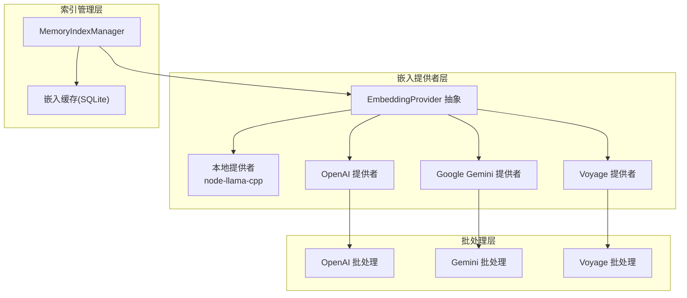
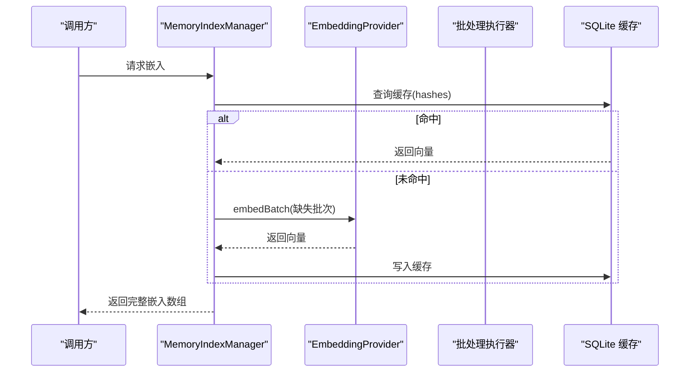
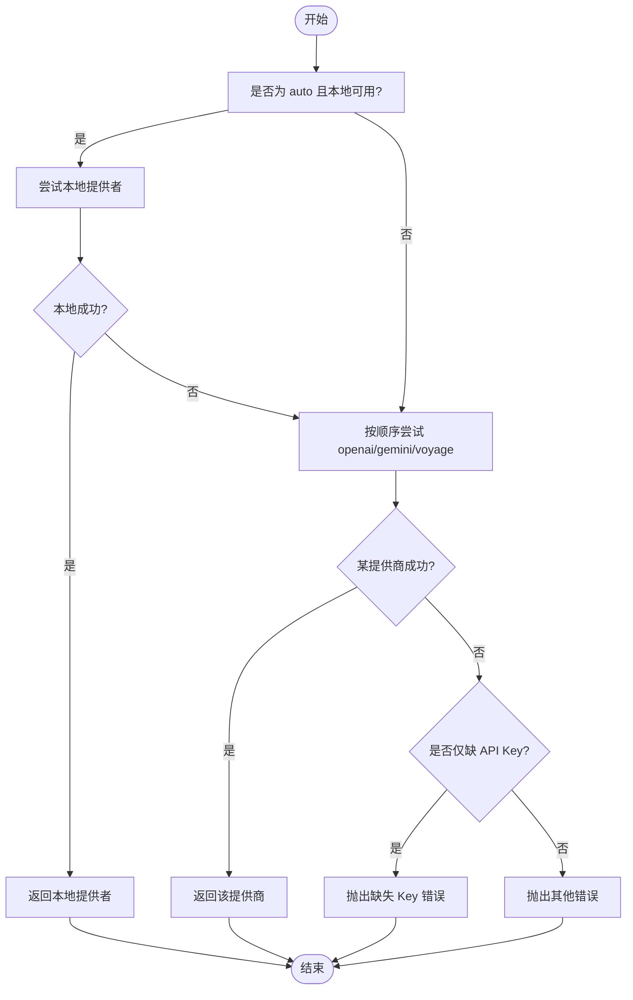
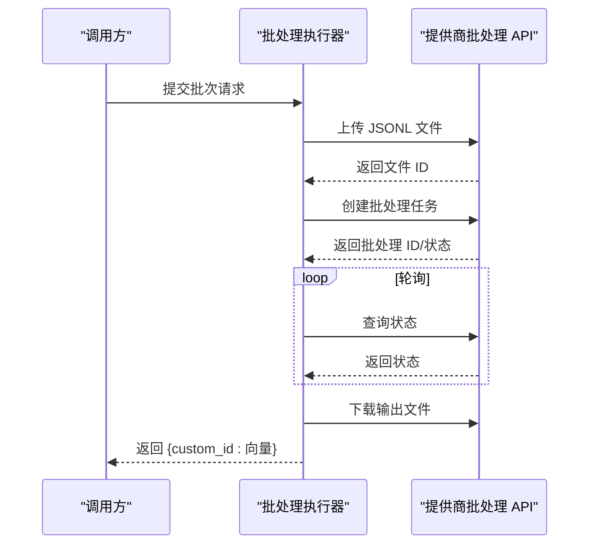
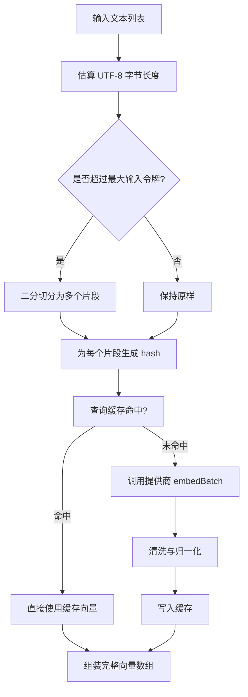
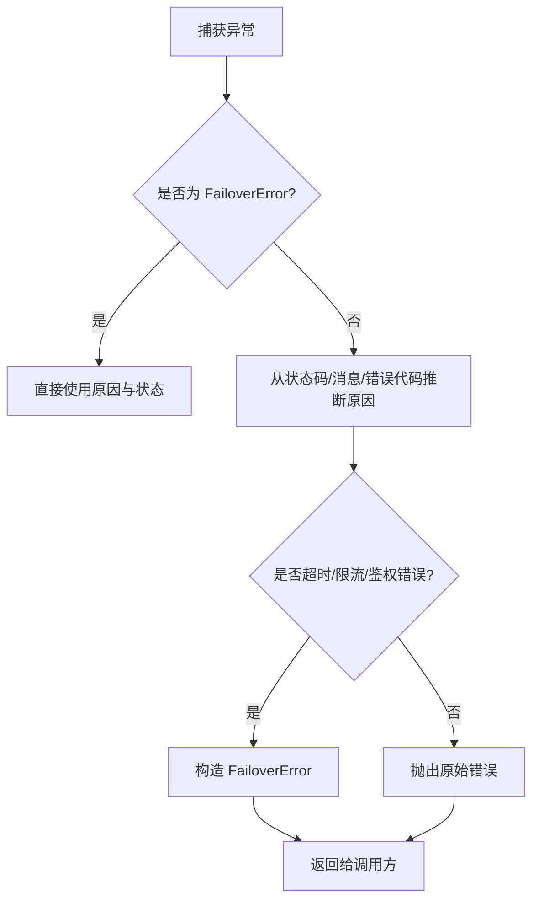
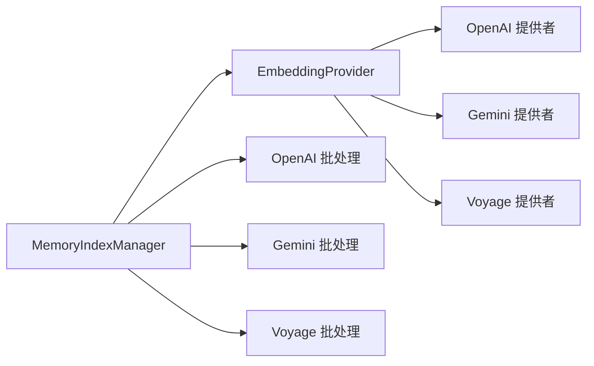

# 嵌入引擎

<cite>
**本文引用的文件**
- [embeddings.ts](file://src/memory/embeddings.ts)
- [embeddings-openai.ts](file://src/memory/embeddings-openai.ts)
- [embeddings-gemini.ts](file://src/memory/embeddings-gemini.ts)
- [embeddings-voyage.ts](file://src/memory/embeddings-voyage.ts)
- [manager.ts](file://src/memory/manager.ts)
- [memory-search.ts](file://src/agents/memory-search.ts)
- [batch-openai.ts](file://src/memory/batch-openai.ts)
- [batch-gemini.ts](file://src/memory/batch-gemini.ts)
- [batch-voyage.ts](file://src/memory/batch-voyage.ts)
- [embedding-chunk-limits.ts](file://src/memory/embedding-chunk-limits.ts)
- [embedding-input-limits.ts](file://src/memory/embedding-input-limits.ts)
- [failover-error.ts](file://src/agents/failover-error.ts)
- [backoff.ts](file://src/infra/backoff.ts)
- [search-manager.ts](file://src/memory/search-manager.ts)
</cite>

## 目录

1. [简介](#简介)
2. [项目结构](#项目结构)
3. [核心组件](#核心组件)
4. [架构总览](#架构总览)
5. [详细组件分析](#详细组件分析)
6. [依赖关系分析](#依赖关系分析)
7. [性能考量](#性能考量)
8. [故障排查指南](#故障排查指南)
9. [结论](#结论)
10. [附录](#附录)

## 简介

本文件系统性阐述 OpenClaw 嵌入引擎的设计与实现，覆盖以下主题：

- 文本嵌入生成原理：本地推理（node-llama-cpp）与远程提供商（OpenAI、Google Gemini、Voyage AI）的统一抽象与实现。
- 多提供商支持与自动选择：根据可用性与配置自动选择最佳嵌入提供者，并在失败时进行回退。
- 批处理机制：针对 OpenAI、Gemini、Voyage 的批量接口封装，支持并发、等待完成与结果解析。
- 预处理、归一化与缓存：输入长度限制、向量标准化、SQLite 缓存与容量裁剪。
- 配置项、错误处理与重试：内存检索配置、超时与重试策略、故障转移分类与状态码映射。
- 质量评估、性能监控与成本控制：通过批处理与缓存降低请求次数与成本；通过日志与指标辅助质量评估。
- 可扩展性、负载均衡与故障转移：基于配置的多提供商回退、批处理并发与分组、缓存命中优化。

## 项目结构

嵌入引擎主要由以下模块组成：

- 提供者抽象与工厂：统一的 EmbeddingProvider 接口与 createEmbeddingProvider 工厂函数，负责本地与远程提供商的创建与回退。
- 远程提供商适配器：分别针对 OpenAI、Google Gemini、Voyage 的客户端与端点封装。
- 批处理执行器：将请求拆分为批次并提交至各提供商的批处理服务，支持等待完成与并发控制。
- 内存索引管理：负责分块、批处理、缓存、向量维度与查询混合排序。
- 配置解析：将用户配置解析为运行时参数，包括批处理开关、并发度、超时、缓存上限等。
- 错误处理与重试：统一的故障转移错误类型与指数退避策略。

图表来源

- [embeddings.ts](file://src/memory/embeddings.ts#L24-L41)
- [embeddings-openai.ts](file://src/memory/embeddings-openai.ts#L29-L68)
- [embeddings-gemini.ts](file://src/memory/embeddings-gemini.ts#L68-L129)
- [embeddings-voyage.ts](file://src/memory/embeddings-voyage.ts#L29-L75)
- [batch-openai.ts](file://src/memory/batch-openai.ts#L283-L398)
- [batch-gemini.ts](file://src/memory/batch-gemini.ts#L315-L431)
- [batch-voyage.ts](file://src/memory/batch-voyage.ts#L243-L373)
- [manager.ts](file://src/memory/manager.ts#L111-L200)

章节来源

- [embeddings.ts](file://src/memory/embeddings.ts#L130-L214)
- [manager.ts](file://src/memory/manager.ts#L111-L200)

## 核心组件

- 统一提供者接口与工厂
  - EmbeddingProvider 定义 embedQuery 与 embedBatch 方法，以及可选的最大输入令牌数。
  - createEmbeddingProvider 支持 "auto"、"openai"、"gemini"、"voyage"、"local" 五种模式，按优先级与可用性选择并支持回退。
- 本地提供者（node-llama-cpp）
  - 惰性加载模型与上下文，统一返回向量并进行数值清洗与归一化。
- 远程提供者
  - OpenAI：标准 /v1/embeddings 端点，支持批处理。
  - Google Gemini：:embedContent 与 :batchEmbedContents 端点，支持批处理。
  - Voyage：/v1/embeddings 端点，支持批处理。
- 批处理执行器
  - 将请求拆分为最大请求数组，提交至提供商批处理服务，支持等待完成、轮询状态、并发与错误聚合。
- 内存索引管理
  - 分块、构建批次、缓存命中、写入缓存、容量裁剪、向量维度与查询混合排序。
- 配置解析
  - 解析 agents.defaults.memorySearch 与代理覆盖，合并默认值与校准范围，启用批处理与缓存。
- 错误处理与重试
  - FailoverError 类型与原因分类，统一状态码映射；backoff 指数退避策略。

章节来源

- [embeddings.ts](file://src/memory/embeddings.ts#L24-L41)
- [embeddings-openai.ts](file://src/memory/embeddings-openai.ts#L29-L68)
- [embeddings-gemini.ts](file://src/memory/embeddings-gemini.ts#L68-L129)
- [embeddings-voyage.ts](file://src/memory/embeddings-voyage.ts#L29-L75)
- [batch-openai.ts](file://src/memory/batch-openai.ts#L283-L398)
- [batch-gemini.ts](file://src/memory/batch-gemini.ts#L315-L431)
- [batch-voyage.ts](file://src/memory/batch-voyage.ts#L243-L373)
- [manager.ts](file://src/memory/manager.ts#L1550-L1715)
- [memory-search.ts](file://src/agents/memory-search.ts#L120-L294)
- [failover-error.ts](file://src/agents/failover-error.ts#L6-L35)
- [backoff.ts](file://src/infra/backoff.ts#L1-L28)

## 架构总览

嵌入引擎采用“提供者抽象 + 批处理 + 缓存”的分层架构：

- 提供者抽象层：统一本地与远程提供者的调用接口。
- 批处理层：将小批量请求聚合成大批次提交，减少 API 调用次数与成本。
- 缓存层：基于 SQLite 的嵌入缓存，按 provider、model、provider_key 与 hash 命中，支持容量裁剪。
- 索引管理层：负责分块、批次构建、缓存读写、向量维度与查询混合排序。

图表来源

- [manager.ts](file://src/memory/manager.ts#L1675-L1715)
- [embeddings.ts](file://src/memory/embeddings.ts#L117-L127)

章节来源

- [manager.ts](file://src/memory/manager.ts#L1675-L1715)

## 详细组件分析

### 组件A：提供者工厂与多提供商支持

- 自动选择逻辑
  - 当 provider 为 "auto" 且本地模型路径有效时，优先尝试本地提供者。
  - 否则依次尝试 openai、gemini、voyage，遇到缺少 API Key 时记录但继续尝试其他提供商。
- 回退策略
  - 若主提供商失败且 fallback 非 "none"，则尝试回退到指定提供商，并保留原始失败原因。
- 本地提供者
  - 惰性初始化 Llama、模型与上下文；返回向量后进行数值清洗与向量归一化。
- 远程提供者
  - OpenAI：/v1/embeddings；Gemini：:embedContent/:batchEmbedContents；Voyage：/v1/embeddings。
  - 均支持 embedQuery 与 embedBatch，并设置最大输入令牌数。

图表来源

- [embeddings.ts](file://src/memory/embeddings.ts#L156-L188)
- [embeddings.ts](file://src/memory/embeddings.ts#L190-L213)

章节来源

- [embeddings.ts](file://src/memory/embeddings.ts#L130-L214)

### 组件B：批处理机制（OpenAI/Gemini/Voyage）

- OpenAI 批处理
  - 将请求序列化为 JSONL，上传至 /files，再创建 /batches 并轮询状态，最后下载输出文件解析结果。
  - 支持并发分组、等待完成、超时与错误聚合。
- Google Gemini 批处理
  - 使用 multipart 上传 JSONL 至上传端点，创建异步批处理任务，轮询状态并下载输出文件。
  - 对 404 场景给出明确提示（模型或基础 URL 不支持异步批处理）。
- Voyage 批处理
  - 先上传文件，再创建批处理任务，轮询状态并流式读取输出文件内容。
  - 支持并发分组与错误聚合。

图表来源

- [batch-openai.ts](file://src/memory/batch-openai.ts#L69-L135)
- [batch-gemini.ts](file://src/memory/batch-gemini.ts#L111-L184)
- [batch-voyage.ts](file://src/memory/batch-voyage.ts#L72-L144)

章节来源

- [batch-openai.ts](file://src/memory/batch-openai.ts#L283-L398)
- [batch-gemini.ts](file://src/memory/batch-gemini.ts#L315-L431)
- [batch-voyage.ts](file://src/memory/batch-voyage.ts#L243-L373)

### 组件C：预处理、归一化与缓存

- 输入预处理
  - 估算 UTF-8 字节长度作为令牌上界，必要时对文本进行二分切分，避免 Unicode 代理对导致的截断。
  - 根据提供商最大输入令牌数进行强制限制与拆分。
- 向量归一化
  - 清洗非有限数值，计算向量模长并进行单位化，确保相似度计算稳定。
- 嵌入缓存
  - SQLite 表存储 provider、model、provider_key、hash、embedding、dims、updated_at。
  - 加载时按 provider/model/provider_key 进行批量查询，写入时使用 upsert，容量超过阈值时按更新时间淘汰最旧条目。

图表来源

- [embedding-input-limits.ts](file://src/memory/embedding-input-limits.ts#L7-L67)
- [embedding-chunk-limits.ts](file://src/memory/embedding-chunk-limits.ts#L6-L30)
- [embeddings.ts](file://src/memory/embeddings.ts#L11-L18)
- [manager.ts](file://src/memory/manager.ts#L1575-L1673)

章节来源

- [embedding-input-limits.ts](file://src/memory/embedding-input-limits.ts#L1-L68)
- [embedding-chunk-limits.ts](file://src/memory/embedding-chunk-limits.ts#L1-L31)
- [embeddings.ts](file://src/memory/embeddings.ts#L11-L18)
- [manager.ts](file://src/memory/manager.ts#L1575-L1673)

### 组件D：配置选项与查询参数

- 提供商与模型
  - provider: "openai" | "local" | "gemini" | "voyage" | "auto"
  - model: 默认模型名由提供商决定
  - fallback: "openai" | "gemini" | "local" | "voyage" | "none"
- 远程批处理
  - enabled、wait、concurrency、pollIntervalMs、timeoutMinutes
- 存储与缓存
  - store.driver、store.path、store.vector.enabled、cache.enabled、cache.maxEntries
- 查询与混合检索
  - maxResults、minScore、hybrid.enabled/vectorWeight/textWeight/candidateMultiplier

章节来源

- [memory-search.ts](file://src/agents/memory-search.ts#L8-L71)
- [memory-search.ts](file://src/agents/memory-search.ts#L120-L294)

### 组件E：错误处理与重试

- 故障转移错误
  - FailoverError 包含原因枚举（billing、rate_limit、auth、timeout、format）、状态码与错误代码映射。
  - 支持从错误对象推断原因，如超时、连接错误、HTTP 状态码等。
- 指数退避
  - backoff 计算下一次延迟，支持抖动与最大值限制，用于批处理重试与等待。
- 批处理重试
  - OpenAI/Voyage 批处理在特定状态码下进行有限次重试，提升稳定性。

图表来源

- [failover-error.ts](file://src/agents/failover-error.ts#L145-L180)
- [backoff.ts](file://src/infra/backoff.ts#L10-L14)

章节来源

- [failover-error.ts](file://src/agents/failover-error.ts#L6-L35)
- [failover-error.ts](file://src/agents/failover-error.ts#L145-L180)
- [backoff.ts](file://src/infra/backoff.ts#L1-L28)

## 依赖关系分析

- 组件耦合
  - MemoryIndexManager 依赖 EmbeddingProvider 抽象与批处理执行器，耦合度低，便于替换与扩展。
  - 批处理执行器独立于具体提供商，仅依赖客户端配置与通用上传/查询流程。
- 外部依赖
  - OpenAI：/v1/embeddings 与批处理 API。
  - Google Gemini：:embedContent/:batchEmbedContents 与异步批处理 API。
  - Voyage：/v1/embeddings 与批处理 API。
- 循环依赖
  - 无明显循环依赖；提供者与批处理通过配置注入，避免相互引用。

图表来源

- [manager.ts](file://src/memory/manager.ts#L23-L42)
- [embeddings-openai.ts](file://src/memory/embeddings-openai.ts#L29-L68)
- [embeddings-gemini.ts](file://src/memory/embeddings-gemini.ts#L68-L129)
- [embeddings-voyage.ts](file://src/memory/embeddings-voyage.ts#L29-L75)

章节来源

- [manager.ts](file://src/memory/manager.ts#L23-L42)

## 性能考量

- 批处理吞吐
  - 将小请求聚合成批次，显著降低 API 调用次数与网络开销，适合大规模索引场景。
- 并发控制
  - 批处理并发度可配置，避免过度并发导致提供商限流或资源争用。
- 缓存命中率
  - SQLite 缓存按 provider/model/provider_key/hash 命中，容量裁剪避免无限增长。
- 输入长度限制
  - 基于 UTF-8 字节估算与二分切分，避免超长文本导致的 API 错误与资源浪费。
- 归一化收益
  - 向量归一化提升余弦相似度稳定性，改善检索质量。

## 故障排查指南

- 本地嵌入不可用
  - 现象：提示缺少 node-llama-cpp 或安装失败。
  - 处理：确认 Node 版本与包管理器设置，按提示重新安装或切换到远程提供商。
- 缺少 API Key
  - 现象：自动选择阶段仅出现缺 Key 错误。
  - 处理：检查 providers 配置或环境变量中的对应 Key。
- 批处理失败
  - OpenAI：检查文件上传、批处理创建与状态轮询；关注 429/5xx 的重试策略。
  - Gemini：若出现 404，说明当前模型或基础 URL 不支持异步批处理，请禁用批处理或更换提供商。
  - Voyage：检查文件上传、批处理创建与输出文件下载。
- 超时与限流
  - 调整 wait/pollIntervalMs/timeoutMinutes 与并发度；结合指数退避策略优化重试。
- 缓存异常
  - 检查 SQLite 表是否存在、字段类型与索引；确认 capacity 裁剪逻辑是否生效。

章节来源

- [embeddings.ts](file://src/memory/embeddings.ts#L227-L249)
- [batch-gemini.ts](file://src/memory/batch-gemini.ts#L178-L183)
- [failover-error.ts](file://src/agents/failover-error.ts#L145-L180)

## 结论

OpenClaw 嵌入引擎通过统一的提供者抽象与批处理机制，实现了对本地与多家远程提供商的无缝集成。配合输入预处理、向量归一化与 SQLite 缓存，既保证了检索质量，又兼顾了成本与性能。完善的错误处理与回退策略提升了系统鲁棒性，适合在生产环境中大规模部署与扩展。

## 附录

- API 调用规范摘要
  - OpenAI：/v1/embeddings（单请求），/v1/embeddings（批处理文件上传），/v1/batches（批处理创建与状态查询）。
  - Google Gemini：:embedContent（单请求）、:batchEmbedContents（批量请求）、:asyncBatchEmbedContent（异步批处理）。
  - Voyage：/v1/embeddings（单请求），/v1/embeddings（批处理文件上传），/v1/batches（批处理创建与状态查询）。
- 关键配置项
  - provider、model、fallback、remote.batch._、store._、cache._、query.hybrid._、chunking.\*。
- 监控与诊断
  - 开启调试日志（OPENCLAW_DEBUG_MEMORY_EMBEDDINGS）观察批处理状态与请求细节；利用缓存命中率与批处理完成率评估性能。
