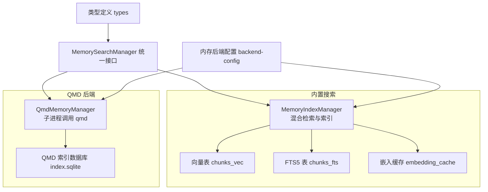
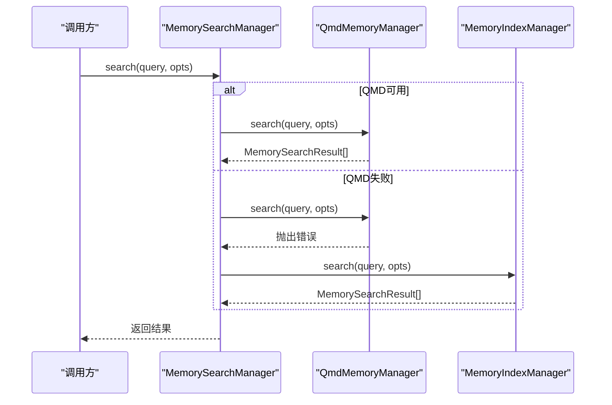
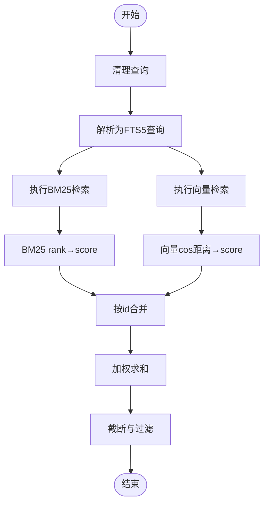
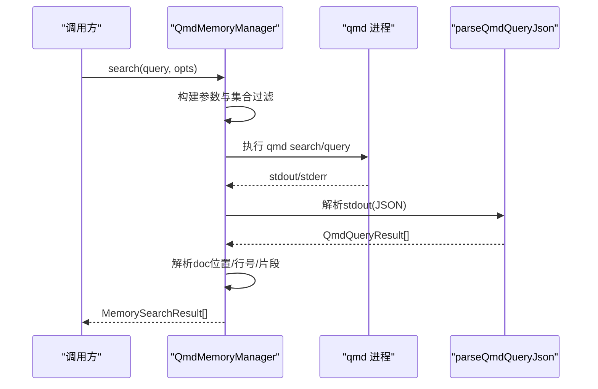
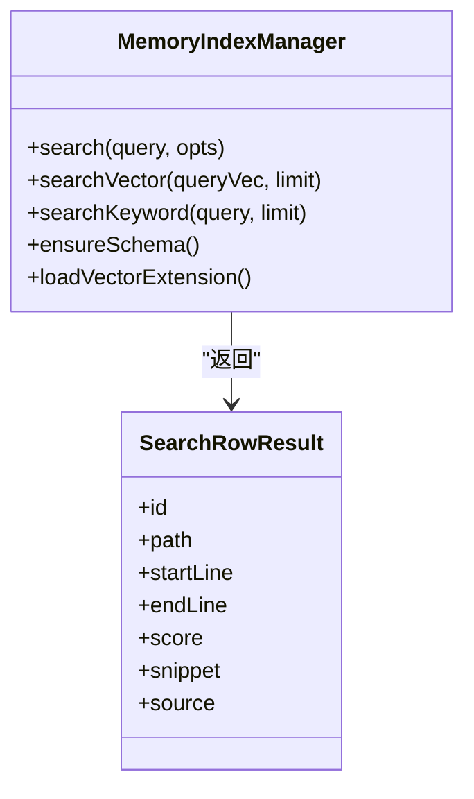
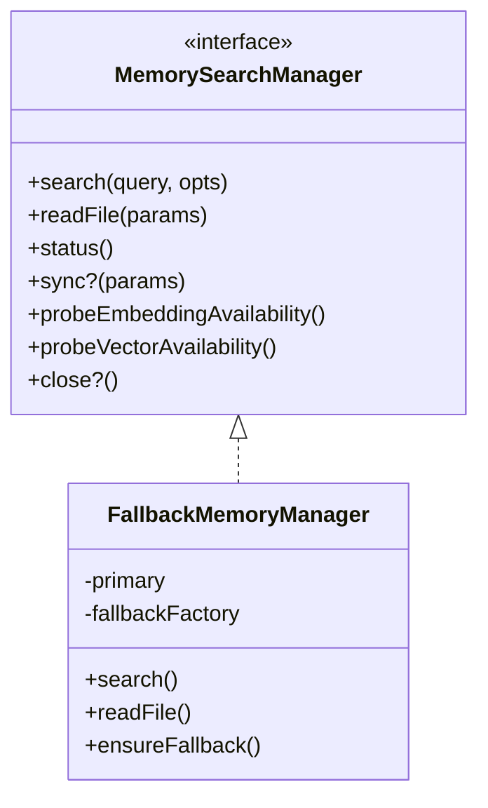
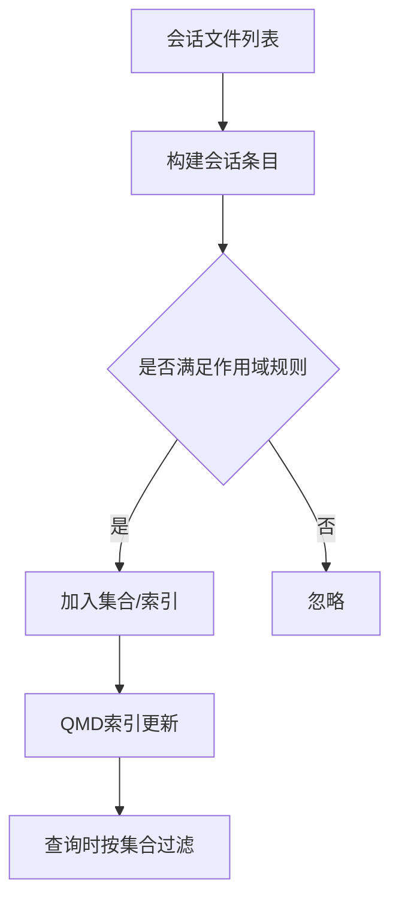
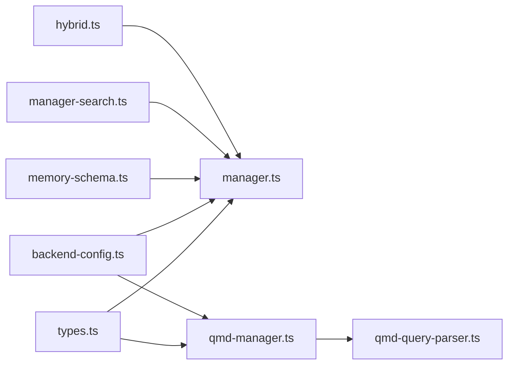

# 搜索系统

<cite>
**本文引用的文件**
- [src/memory/hybrid.ts](file://src/memory/hybrid.ts)
- [src/memory/manager.ts](file://src/memory/manager.ts)
- [src/memory/manager-search.ts](file://src/memory/manager-search.ts)
- [src/memory/memory-schema.ts](file://src/memory/memory-schema.ts)
- [src/memory/backend-config.ts](file://src/memory/backend-config.ts)
- [src/memory/qmd-manager.ts](file://src/memory/qmd-manager.ts)
- [src/memory/qmd-query-parser.ts](file://src/memory/qmd-query-parser.ts)
- [src/memory/search-manager.ts](file://src/memory/search-manager.ts)
- [src/memory/types.ts](file://src/memory/types.ts)
- [src/memory/session-files.ts](file://src/memory/session-files.ts)
- [src/agents/memory-search.ts](file://src/agents/memory-search.ts)
- [docs/zh-CN/concepts/memory.md](file://docs/zh-CN/concepts/memory.md)
- [apps/macos/Sources/OpenClawProtocol/GatewayModels.swift](file://apps/macos/Sources/OpenClawProtocol/GatewayModels.swift)
- [apps/shared/OpenClawKit/Sources/OpenClawProtocol/GatewayModels.swift](file://apps/shared/OpenClawKit/Sources/OpenClawProtocol/GatewayModels.swift)
- [src/gateway/server-methods/usage.ts](file://src/gateway/server-methods/usage.ts)
- [src/gateway/session-utils.ts](file://src/gateway/session-utils.ts)
- [src/tui/components/fuzzy-filter.ts](file://src/tui/components/fuzzy-filter.ts)
- [scripts/sqlite-vec-smoke.mjs](file://scripts/sqlite-vec-smoke.mjs)
</cite>

## 目录

1. [简介](#简介)
2. [项目结构](#项目结构)
3. [核心组件](#核心组件)
4. [架构总览](#架构总览)
5. [详细组件分析](#详细组件分析)
6. [依赖关系分析](#依赖关系分析)
7. [性能考量](#性能考量)
8. [故障排查指南](#故障排查指南)
9. [结论](#结论)
10. [附录](#附录)

## 简介

本文件面向OpenClaw搜索系统，聚焦语义搜索的实现原理、查询解析与相关性排序、QMD查询语法解析、布尔查询与模糊匹配机制、性能优化与索引策略、缓存机制、配置参数、召回率评估与精度调优、跨会话搜索与时间范围过滤、标签筛选、扩展性设计、并发处理与结果聚合策略等主题。文档以代码为依据，辅以可视化图表帮助理解。

## 项目结构

OpenClaw的搜索能力由两套后端构成：

- 内置向量/全文混合搜索（SQLite + sqlite-vec + FTS5）
- QMD外部索引后端（通过子进程调用qmd命令）

二者通过统一的MemorySearchManager接口对外提供搜索能力，并支持回退与缓存。

**图表来源**

- [src/memory/manager.ts](file://src/memory/manager.ts#L111-L200)
- [src/memory/qmd-manager.ts](file://src/memory/qmd-manager.ts#L45-L133)
- [src/memory/backend-config.ts](file://src/memory/backend-config.ts#L254-L311)
- [src/memory/types.ts](file://src/memory/types.ts#L61-L81)

**章节来源**

- [src/memory/manager.ts](file://src/memory/manager.ts#L111-L200)
- [src/memory/qmd-manager.ts](file://src/memory/qmd-manager.ts#L45-L133)
- [src/memory/backend-config.ts](file://src/memory/backend-config.ts#L254-L311)
- [src/memory/types.ts](file://src/memory/types.ts#L61-L81)

## 核心组件

- 混合检索与排序
  - 词法分词与布尔查询构建：将输入按字母数字与下划线切分为token，并以AND连接生成FTS5查询。
  - BM25到分数映射：单调递减映射，保证越低rank越高分。
  - 向量相似度：余弦距离，1-距离作为分数。
  - 结果合并：按id聚合，加权求和最终score，降序返回。
- 内置索引与查询
  - 向量检索：基于sqlite-vec的vec0表，执行余弦相似度查询。
  - 全文检索：基于FTS5，使用bm25排序。
  - 索引模式：确保meta/files/chunks/embedding_cache/fts表存在并维护必要索引。
- QMD后端
  - 子进程调用qmd命令，支持search/vsearch/query三种模式，自动回退。
  - 支持集合管理、会话导出、模型共享链接、读取索引统计。
- 统一接口与回退
  - MemorySearchManager封装search/readFile/status/sync等方法。
  - QMD失败时自动回退至内置索引管理器。
- 类型与配置
  - 统一结果类型、状态类型与后端配置解析（含默认值与路径解析）。

**章节来源**

- [src/memory/hybrid.ts](file://src/memory/hybrid.ts#L23-L116)
- [src/memory/manager-search.ts](file://src/memory/manager-search.ts#L20-L187)
- [src/memory/memory-schema.ts](file://src/memory/memory-schema.ts#L3-L96)
- [src/memory/qmd-manager.ts](file://src/memory/qmd-manager.ts#L241-L320)
- [src/memory/search-manager.ts](file://src/memory/search-manager.ts#L19-L113)
- [src/memory/types.ts](file://src/memory/types.ts#L3-L81)
- [src/memory/backend-config.ts](file://src/memory/backend-config.ts#L160-L311)

## 架构总览

OpenClaw搜索系统采用“统一接口 + 双后端 + 回退”的设计。客户端仅依赖MemorySearchManager；根据配置选择QMD或内置后端；当QMD不可用时自动切换内置后端并缓存包装器，提升后续请求成功率。

**图表来源**

- [src/memory/search-manager.ts](file://src/memory/search-manager.ts#L19-L113)
- [src/memory/qmd-manager.ts](file://src/memory/qmd-manager.ts#L241-L320)
- [src/memory/manager.ts](file://src/memory/manager.ts#L292-L314)

## 详细组件分析

### 混合检索与排序（向量 + BM25）

- 查询解析
  - 使用正则提取token，去除空串，用双引号包裹并以AND连接，形成FTS5查询。
- BM25分数映射
  - rank≥0时，分数=1/(1+rank)，rank越小分数越高；负rank按0处理。
- 向量分数
  - 余弦距离越小，分数越高；1-distance。
- 结果合并
  - 以id为键聚合，向量与文本分数分别保留，最终score=vectorWeight*vectorScore + textWeight*textScore，按score降序。

**图表来源**

- [src/memory/hybrid.ts](file://src/memory/hybrid.ts#L23-L116)
- [src/memory/manager-search.ts](file://src/memory/manager-search.ts#L136-L187)
- [src/memory/manager.ts](file://src/memory/manager.ts#L292-L314)

**章节来源**

- [src/memory/hybrid.ts](file://src/memory/hybrid.ts#L23-L116)
- [src/memory/manager-search.ts](file://src/memory/manager-search.ts#L20-L187)
- [src/memory/manager.ts](file://src/memory/manager.ts#L292-L314)
- [docs/zh-CN/concepts/memory.md](file://docs/zh-CN/concepts/memory.md#L232-L272)

### QMD查询语法与解析

- 查询模式
  - 支持search、vsearch、query三种模式；若当前模式不支持某些标志，自动回退到query。
- 参数构建
  - 基于配置构建集合过滤参数与限制（最大结果数、片段长度、超时）。
- 输出解析
  - 解析qmd输出的JSON数组；若stdout为“无结果”标记，返回空数组；否则尝试JSON解析，异常则抛错。
- 文档定位
  - 通过内部索引数据库查询文档集合与相对路径，缓存解析结果。

**图表来源**

- [src/memory/qmd-manager.ts](file://src/memory/qmd-manager.ts#L241-L320)
- [src/memory/qmd-query-parser.ts](file://src/memory/qmd-query-parser.ts#L13-L48)

**章节来源**

- [src/memory/qmd-manager.ts](file://src/memory/qmd-manager.ts#L241-L320)
- [src/memory/qmd-query-parser.ts](file://src/memory/qmd-query-parser.ts#L13-L48)

### 内置索引与查询（SQLite + sqlite-vec + FTS5）

- 索引模式
  - 确保meta、files、chunks、embedding_cache、fts表存在；为chunks.path与chunks.source建立索引。
- 向量检索
  - 若sqlite-vec可用，执行vec_distance_cosine查询，返回余弦相似度对应的分数。
- 全文检索
  - 使用FTS5 bm25排序，返回文本片段与行号信息。
- 索引管理
  - 动态创建/重建向量表，按维度管理；支持安全交换索引文件，避免写锁阻塞。

**图表来源**

- [src/memory/manager.ts](file://src/memory/manager.ts#L111-L200)
- [src/memory/manager-search.ts](file://src/memory/manager-search.ts#L20-L187)
- [src/memory/memory-schema.ts](file://src/memory/memory-schema.ts#L3-L96)

**章节来源**

- [src/memory/manager.ts](file://src/memory/manager.ts#L641-L810)
- [src/memory/manager-search.ts](file://src/memory/manager-search.ts#L20-L187)
- [src/memory/memory-schema.ts](file://src/memory/memory-schema.ts#L3-L96)
- [scripts/sqlite-vec-smoke.mjs](file://scripts/sqlite-vec-smoke.mjs#L1-L38)

### 统一接口与回退策略

- 接口职责
  - 提供search/readFile/status/sync/probe等方法；支持可选close。
- 回退机制
  - QMD首次失败后，记录错误并关闭旧实例；下次请求重新创建；缓存包装器以便快速恢复。
- 缓存
  - QMD管理器与搜索管理器均维护缓存，减少重复初始化成本。

**图表来源**

- [src/memory/types.ts](file://src/memory/types.ts#L61-L81)
- [src/memory/search-manager.ts](file://src/memory/search-manager.ts#L19-L113)

**章节来源**

- [src/memory/types.ts](file://src/memory/types.ts#L61-L81)
- [src/memory/search-manager.ts](file://src/memory/search-manager.ts#L19-L113)

### 配置参数与默认值

- 内置后端配置
  - provider/model/remote/local/batch等；query.maxResults/minScore；store.vector.enabled/extensionPath；chunking.tokens/overlap。
- QMD后端配置
  - command/searchMode/collections/sessions/includeDefaultMemory；update.intervalMs/debounceMs/onBoot/waitForBootSync/embedIntervalMs/command/update/embed超时；limits.maxResults/maxSnippetChars/maxInjectedChars/timeoutMs；scope（会话作用域）。
- 默认值
  - QMD默认搜索模式为query；默认最大结果数、片段长度、超时；默认scope默认拒绝，允许direct类聊天。

**章节来源**

- [src/agents/memory-search.ts](file://src/agents/memory-search.ts#L120-L307)
- [src/memory/backend-config.ts](file://src/memory/backend-config.ts#L64-L311)

### 跨会话搜索、时间范围过滤与标签筛选

- 跨会话搜索
  - QMD后端支持会话导出为Markdown并加入集合，实现跨会话检索。
- 时间范围过滤
  - 网关侧usage模块支持按起止日期或天数推导时间窗口，默认最近30天。
- 标签/通道/类型筛选
  - QMD后端支持基于会话键前缀、通道(channel)、聊天类型(chatType)的作用域规则，实现细粒度控制。

**图表来源**

- [src/memory/qmd-manager.ts](file://src/memory/qmd-manager.ts#L606-L639)
- [src/gateway/server-methods/usage.ts](file://src/gateway/server-methods/usage.ts#L100-L118)
- [src/gateway/session-utils.ts](file://src/gateway/session-utils.ts#L571-L617)

**章节来源**

- [src/memory/qmd-manager.ts](file://src/memory/qmd-manager.ts#L113-L132)
- [src/gateway/server-methods/usage.ts](file://src/gateway/server-methods/usage.ts#L100-L118)
- [src/gateway/session-utils.ts](file://src/gateway/session-utils.ts#L571-L617)

### 模糊匹配与TUI过滤

- TUI模糊过滤
  - 支持空格分隔的多token匹配，逐token打分；奖励连续匹配、词边界匹配，惩罚间隔与靠后匹配；最终要求全部token命中。
- 适用场景
  - UI交互式快速过滤，非语义检索，适合快速定位文件或条目。

**章节来源**

- [src/tui/components/fuzzy-filter.ts](file://src/tui/components/fuzzy-filter.ts#L51-L95)

## 依赖关系分析

- 组件耦合
  - MemoryIndexManager依赖sqlite-vec与FTS5；QmdMemoryManager依赖外部qmd命令与内部索引数据库。
  - 混合检索通过公共工具函数与类型接口解耦。
- 外部依赖
  - sqlite-vec扩展加载失败不影响整体可用性（回退至纯BM25或提示）。
- 潜在循环
  - 未见直接循环依赖；接口抽象清晰。

**图表来源**

- [src/memory/hybrid.ts](file://src/memory/hybrid.ts#L1-L116)
- [src/memory/manager.ts](file://src/memory/manager.ts#L1-L200)
- [src/memory/manager-search.ts](file://src/memory/manager-search.ts#L1-L187)
- [src/memory/memory-schema.ts](file://src/memory/memory-schema.ts#L1-L96)
- [src/memory/backend-config.ts](file://src/memory/backend-config.ts#L1-L311)
- [src/memory/qmd-manager.ts](file://src/memory/qmd-manager.ts#L1-L133)
- [src/memory/qmd-query-parser.ts](file://src/memory/qmd-query-parser.ts#L1-L48)
- [src/memory/types.ts](file://src/memory/types.ts#L1-L81)

**章节来源**

- [src/memory/manager.ts](file://src/memory/manager.ts#L1-L200)
- [src/memory/qmd-manager.ts](file://src/memory/qmd-manager.ts#L1-L133)

## 性能考量

- 并发与批处理
  - 内置后端对嵌入批次与文件索引任务采用并发控制，避免IO瓶颈。
- 索引策略
  - 为chunks.path与chunks.source建立索引；FTS5表按需创建；向量表按维度动态创建。
- 超时与回退
  - QMD命令设置超时；sqlite-vec加载失败时记录错误并回退；内置后端在FTS不可用时仍可返回向量结果。
- 结果截断与注入上限
  - QMD支持最大结果数、片段长度与注入字符数限制，避免大段内容影响响应与上下文。

**章节来源**

- [src/memory/manager.ts](file://src/memory/manager.ts#L90-L102)
- [src/memory/memory-schema.ts](file://src/memory/memory-schema.ts#L77-L83)
- [src/memory/backend-config.ts](file://src/memory/backend-config.ts#L74-L175)
- [src/memory/qmd-manager.ts](file://src/memory/qmd-manager.ts#L553-L593)

## 故障排查指南

- QMD命令失败
  - 检查命令路径与权限；确认集合已正确添加；关注超时与回退逻辑。
- sqlite-vec加载失败
  - 查看扩展路径与平台兼容性；确认扩展已安装；日志中会记录加载错误。
- FTS5不可用
  - 确认FTS5启用与数据库版本；内置后端会在FTS不可用时提示并回退。
- 结果为空
  - 检查查询解析是否产生有效token；确认集合过滤条件；核对会话作用域规则。

**章节来源**

- [src/memory/qmd-manager.ts](file://src/memory/qmd-manager.ts#L553-L593)
- [src/memory/manager.ts](file://src/memory/manager.ts#L641-L667)
- [src/memory/qmd-query-parser.ts](file://src/memory/qmd-query-parser.ts#L13-L48)

## 结论

OpenClaw搜索系统通过“统一接口 + 双后端 + 回退 + 缓存”的设计，在保证可用性的前提下兼顾了灵活性与性能。内置后端提供稳定的向量与全文检索能力，QMD后端则扩展了外部索引与会话集成能力。混合检索与严格的配置默认值使得系统在不同部署环境下都能取得较好的召回与精度表现。

## 附录

### 查询解析与相关性排序要点

- 词法与布尔
  - token化后以AND连接，适配FTS5布尔查询。
- 排序
  - BM25 rank越低分数越高；向量cos距离越小分数越高；最终按加权分数降序。
- 截断
  - 按配置限制最大结果数与片段长度，必要时进行注入字符数限制。

**章节来源**

- [src/memory/hybrid.ts](file://src/memory/hybrid.ts#L23-L116)
- [src/memory/manager-search.ts](file://src/memory/manager-search.ts#L136-L187)

### QMD查询模式与回退

- 模式
  - search/vsearch/query；不支持的标志自动回退到query。
- 输出
  - JSON数组；“无结果”标记返回空数组；其他情况JSON解析失败即报错。
- 作用域
  - 基于会话键前缀、通道与聊天类型进行允许/拒绝控制。

**章节来源**

- [src/memory/qmd-manager.ts](file://src/memory/qmd-manager.ts#L241-L320)
- [src/memory/qmd-query-parser.ts](file://src/memory/qmd-query-parser.ts#L13-L48)

### 配置参考（节选）

- 内置后端
  - provider/model/remote/local/batch/query/store.chunking/limits
- QMD后端
  - command/searchMode/collections/sessions/includeDefaultMemory/update/limits/scope

**章节来源**

- [src/agents/memory-search.ts](file://src/agents/memory-search.ts#L120-L307)
- [src/memory/backend-config.ts](file://src/memory/backend-config.ts#L254-L311)
