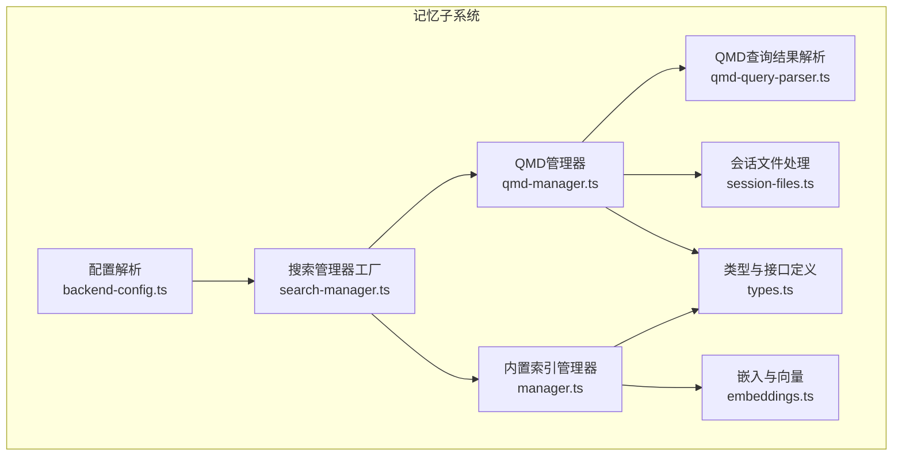
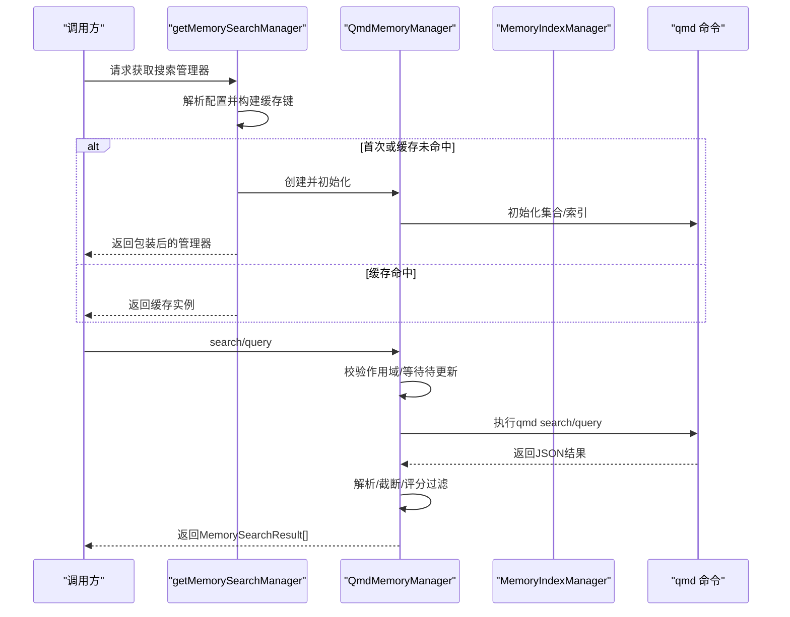
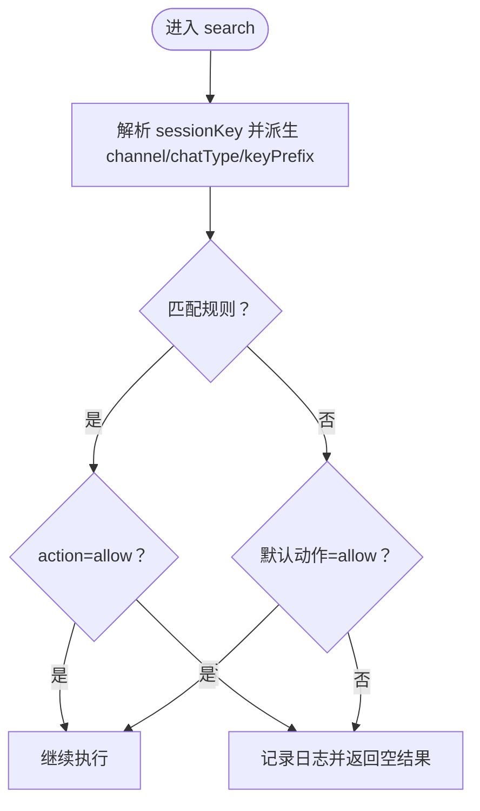
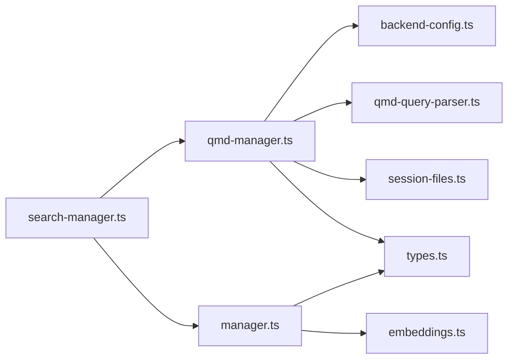

# 管理API

<cite>
**本文引用的文件**   
- [src/memory/qmd-manager.ts](file://src/memory/qmd-manager.ts)
- [src/memory/backend-config.ts](file://src/memory/backend-config.ts)
- [src/memory/search-manager.ts](file://src/memory/search-manager.ts)
- [src/memory/types.ts](file://src/memory/types.ts)
- [src/memory/qmd-query-parser.ts](file://src/memory/qmd-query-parser.ts)
- [src/memory/session-files.ts](file://src/memory/session-files.ts)
- [src/memory/manager.ts](file://src/memory/manager.ts)
- [src/memory/embeddings.ts](file://src/memory/embeddings.ts)
- [src/version.ts](file://src/version.ts)
- [src/commands/doctor-config-flow.ts](file://src/commands/doctor-config-flow.ts)
- [src/config/legacy.ts](file://src/config/legacy.ts)
- [src/infra/state-migrations.ts](file://src/infra/state-migrations.ts)
- [src/telegram/network-errors.ts](file://src/telegram/network-errors.ts)
- [src/logger.ts](file://src/logger.ts)
- [src/channels/command-gating.ts](file://src/channels/command-gating.ts)
- [src/gateway/server-startup-memory.test.ts](file://src/gateway/server-startup-memory.test.ts)
- [src/memory/qmd-manager.test.ts](file://src/memory/qmd-manager.test.ts)
</cite>

## 目录

1. [简介](#简介)
2. [项目结构](#项目结构)
3. [核心组件](#核心组件)
4. [架构总览](#架构总览)
5. [详细组件分析](#详细组件分析)
6. [依赖关系分析](#依赖关系分析)
7. [性能考量](#性能考量)
8. [故障排查指南](#故障排查指南)
9. [结论](#结论)
10. [附录](#附录)

## 简介

本文件面向OpenClaw记忆管理API，聚焦于QMD查询管理器（QmdMemoryManager）与通用搜索管理器（MemorySearchManager）的公共接口、方法签名与参数规范；覆盖状态查询、配置管理、内存状态格式化、Schema定义与数据模型；解释认证授权、权限控制与访问限制机制；并提供错误处理、异常规范与调试工具；最后给出版本管理、兼容性与迁移指南。

## 项目结构

OpenClaw记忆子系统由“配置解析”“搜索管理器工厂”“QMD管理器”“内置索引管理器”“会话导出”“嵌入与向量”等模块组成，形成可插拔的后端选择与降级回退机制。



图示来源

- [src/memory/backend-config.ts](file://src/memory/backend-config.ts#L254-L310)
- [src/memory/search-manager.ts](file://src/memory/search-manager.ts#L19-L65)
- [src/memory/qmd-manager.ts](file://src/memory/qmd-manager.ts#L45-L133)
- [src/memory/manager.ts](file://src/memory/manager.ts#L111-L203)
- [src/memory/qmd-query-parser.ts](file://src/memory/qmd-query-parser.ts#L13-L38)
- [src/memory/session-files.ts](file://src/memory/session-files.ts#L21-L33)
- [src/memory/types.ts](file://src/memory/types.ts#L61-L81)
- [src/memory/embeddings.ts](file://src/memory/embeddings.ts#L130-L214)

章节来源

- [src/memory/backend-config.ts](file://src/memory/backend-config.ts#L254-L310)
- [src/memory/search-manager.ts](file://src/memory/search-manager.ts#L19-L65)
- [src/memory/qmd-manager.ts](file://src/memory/qmd-manager.ts#L45-L133)
- [src/memory/manager.ts](file://src/memory/manager.ts#L111-L203)
- [src/memory/qmd-query-parser.ts](file://src/memory/qmd-query-parser.ts#L13-L38)
- [src/memory/session-files.ts](file://src/memory/session-files.ts#L21-L33)
- [src/memory/types.ts](file://src/memory/types.ts#L61-L81)
- [src/memory/embeddings.ts](file://src/memory/embeddings.ts#L130-L214)

## 核心组件

- QmdMemoryManager：封装对qmd命令行的调用，负责集合初始化、增量更新、向量化嵌入、查询与结果解析、会话导出、状态统计与关闭。
- MemorySearchManager：统一的搜索接口，支持search/readFile/status/sync/probe等能力，并在QMD不可用时自动回退到内置索引管理器。
- ResolvedQmdConfig：将用户配置解析为运行时可用的QMD配置，包括命令、集合、会话导出、更新策略、限制与作用域。
- MemorySearchResult/MemoryProviderStatus：标准化返回的数据模型与状态视图。
- SessionFileEntry：会话文件解析与导出辅助结构。

章节来源

- [src/memory/qmd-manager.ts](file://src/memory/qmd-manager.ts#L45-L133)
- [src/memory/search-manager.ts](file://src/memory/search-manager.ts#L67-L202)
- [src/memory/backend-config.ts](file://src/memory/backend-config.ts#L53-L62)
- [src/memory/types.ts](file://src/memory/types.ts#L3-L59)
- [src/memory/session-files.ts](file://src/memory/session-files.ts#L10-L19)

## 架构总览

QMD作为首选后端，通过getMemorySearchManager按agentId+配置缓存实例；若QMD失败则回退至内置索引管理器。QMD内部维护独立的XDG目录隔离索引，支持会话文件导出为Markdown集合参与检索。



图示来源

- [src/memory/search-manager.ts](file://src/memory/search-manager.ts#L19-L65)
- [src/memory/qmd-manager.ts](file://src/memory/qmd-manager.ts#L241-L320)
- [src/memory/qmd-query-parser.ts](file://src/memory/qmd-query-parser.ts#L13-L38)

## 详细组件分析

### QmdMemoryManager 公共接口与方法签名

- create(params): 静态工厂，接收cfg、agentId与已解析的ResolvedQmdConfig，返回QmdMemoryManager实例或null。
- search(query, opts?): 查询入口，支持maxResults、minScore、sessionKey作用域过滤。
- sync(params?): 同步/更新入口，支持reason、force与进度回调。
- readFile(params): 安全读取Markdown文件内容，支持按行切片。
- status(): 返回MemoryProviderStatus，包含后端、文件/块计数、来源分布、向量可用性、自定义字段等。
- probeEmbeddingAvailability()/probeVectorAvailability(): 能力探测。
- close(): 关闭并清理资源。

参数与行为要点

- 作用域控制：根据sessionKey推导channel/chatType/keyPrefix，匹配规则集与默认动作（allow/deny），拒绝时直接返回空结果并记录日志。
- 更新策略：runUpdate支持强制队列、去抖、嵌入周期、超时与模型共享符号链接；支持会话导出到独立集合。
- 查询解析：runQmd执行qmd命令，parseQmdQueryJson解析输出，支持降级到query模式以兼容旧版本qmd。
- 结果处理：按最大结果数、最大片段长度、最大注入字符数与最小分数进行裁剪与过滤。

```mermaid
classDiagram
class QmdMemoryManager {
+create(params) QmdMemoryManager|null
+search(query, opts) MemorySearchResult[]
+sync(params) void
+readFile(params) {text,path}
+status() MemoryProviderStatus
+probeEmbeddingAvailability() MemoryEmbeddingProbeResult
+probeVectorAvailability() boolean
+close() void
}
class MemorySearchManager {
<<interface>>
+search()
+readFile()
+status()
+sync()
+probeEmbeddingAvailability()
+probeVectorAvailability()
+close()
}
QmdMemoryManager ..|> MemorySearchManager
```

图示来源

- [src/memory/qmd-manager.ts](file://src/memory/qmd-manager.ts#L45-L133)
- [src/memory/types.ts](file://src/memory/types.ts#L61-L81)

章节来源

- [src/memory/qmd-manager.ts](file://src/memory/qmd-manager.ts#L45-L133)
- [src/memory/qmd-manager.ts](file://src/memory/qmd-manager.ts#L241-L320)
- [src/memory/qmd-manager.ts](file://src/memory/qmd-manager.ts#L322-L334)
- [src/memory/qmd-manager.ts](file://src/memory/qmd-manager.ts#L336-L362)
- [src/memory/qmd-manager.ts](file://src/memory/qmd-manager.ts#L364-L395)
- [src/memory/qmd-manager.ts](file://src/memory/qmd-manager.ts#L397-L403)
- [src/memory/qmd-manager.ts](file://src/memory/qmd-manager.ts#L405-L421)
- [src/memory/types.ts](file://src/memory/types.ts#L61-L81)

### QMD查询管理器API接口

- search(query, opts?)
  - 输入：query字符串，opts可选包含maxResults、minScore、sessionKey。
  - 行为：校验作用域、等待待更新、构造参数、调用qmd并解析JSON，按限制裁剪与过滤。
  - 输出：MemorySearchResult数组。
- sync(params?)
  - 输入：reason、force、progress回调。
  - 行为：触发runUpdate，必要时导出会话、执行update与embed，记录时间戳并清空路径缓存。
  - 输出：Promise<void>。
- readFile(params)
  - 输入：relPath，可选from/lines。
  - 行为：安全路径解析与白名单校验，读取文件并按行切片。
  - 输出：{text, path}。
- status()
  - 输出：MemoryProviderStatus，包含files/chunks/sources/sourceCounts/vector/batch/custom等。
- 探测能力
  - probeEmbeddingAvailability(): 返回{ok, error?}。
  - probeVectorAvailability(): 返回boolean。

章节来源

- [src/memory/qmd-manager.ts](file://src/memory/qmd-manager.ts#L241-L320)
- [src/memory/qmd-manager.ts](file://src/memory/qmd-manager.ts#L322-L334)
- [src/memory/qmd-manager.ts](file://src/memory/qmd-manager.ts#L336-L362)
- [src/memory/qmd-manager.ts](file://src/memory/qmd-manager.ts#L364-L395)
- [src/memory/qmd-manager.ts](file://src/memory/qmd-manager.ts#L397-L403)

### 配置管理与作用域控制

- 配置解析
  - resolveMemoryBackendConfig(cfg, agentId)：将用户配置转换为ResolvedQmdConfig，含命令、集合、会话导出、更新间隔/去抖/超时、限制与作用域。
  - 默认值：搜索模式、最大结果、最大片段长度、最大注入长度、超时、更新/嵌入间隔、作用域默认deny且允许direct聊天类型。
- 作用域规则
  - isScopeAllowed(sessionKey)：基于规则列表与默认动作决定是否允许；支持channel、chatType、keyPrefix匹配。
  - 拒绝时记录详细上下文日志。



图示来源

- [src/memory/qmd-manager.ts](file://src/memory/qmd-manager.ts#L754-L789)
- [src/memory/backend-config.ts](file://src/memory/backend-config.ts#L80-L88)

章节来源

- [src/memory/backend-config.ts](file://src/memory/backend-config.ts#L254-L310)
- [src/memory/backend-config.ts](file://src/memory/backend-config.ts#L160-L182)
- [src/memory/qmd-manager.ts](file://src/memory/qmd-manager.ts#L754-L789)

### 内存状态格式化与数据模型

- MemorySearchResult
  - 字段：path、startLine、endLine、score、snippet、source、citation?
- MemoryProviderStatus
  - 字段：backend/provider/model/requestedProvider、files/chunks/dirty/workspaceDir/dbPath、sources/sourceCounts、cache、fts、fallback、vector、batch、custom。
- SessionFileEntry
  - 字段：path、absPath、mtimeMs、size、hash、content、lineMap。
- QmdQueryResult
  - 字段：docid、score、file、snippet、body。

章节来源

- [src/memory/types.ts](file://src/memory/types.ts#L3-L59)
- [src/memory/session-files.ts](file://src/memory/session-files.ts#L10-L19)
- [src/memory/qmd-query-parser.ts](file://src/memory/qmd-query-parser.ts#L5-L11)

### 认证授权、权限控制与访问限制

- 会话级访问控制
  - QMD作用域：通过SessionSendPolicyConfig规则与默认动作实现channel/chatType/keyPrefix匹配，拒绝时直接短路。
- 控制命令门禁（通道层）
  - resolveControlCommandGate：当启用访问组且存在控制命令时，依据authorizers与模式（allow/deny/configured）决定是否阻断。
- 文件读取白名单
  - 内置索引管理器对readFile进行工作区与额外路径的严格校验，仅允许Markdown文件与受控范围。

章节来源

- [src/memory/qmd-manager.ts](file://src/memory/qmd-manager.ts#L754-L789)
- [src/channels/command-gating.ts](file://src/channels/command-gating.ts#L31-L45)
- [src/memory/manager.ts](file://src/memory/manager.ts#L405-L468)

### 错误处理、异常规范与调试工具

- QMD命令执行
  - runQmd：spawn子进程，设置超时，捕获stdout/stderr，非零退出码抛错；超时抛错；解析失败抛错。
- 查询解析
  - parseQmdQueryJson：空stdout且stderr为“无结果”标记时返回空数组；否则尝试JSON解析，失败抛错并记录警告。
- 回退机制
  - FallbackMemoryManager：QMD失败后切换到内置索引管理器，记录lastError并从缓存中移除失败包装器。
- 日志与调试
  - createSubsystemLogger用于细分子系统日志；logError/logDebug统一错误与调试输出。
- 网络/系统错误恢复判断
  - recoverable error code/name/message片段匹配，用于重试/降级决策。

章节来源

- [src/memory/qmd-manager.ts](file://src/memory/qmd-manager.ts#L553-L593)
- [src/memory/qmd-query-parser.ts](file://src/memory/qmd-query-parser.ts#L13-L38)
- [src/memory/search-manager.ts](file://src/memory/search-manager.ts#L67-L202)
- [src/logger.ts](file://src/logger.ts#L47-L61)
- [src/telegram/network-errors.ts](file://src/telegram/network-errors.ts#L54-L150)

### 版本管理、兼容性与迁移指南

- 版本来源
  - 优先从构建注入变量/环境变量读取，其次从包或构建信息解析，最终回退为"0.0.0"。
- 兼容性
  - 当qmd不支持特定选项时，自动回退到query模式；超时/失败有明确错误消息。
- 迁移
  - 旧配置检测与迁移：findLegacyConfigIssues/applyLegacyMigrations；状态目录迁移：autoMigrateLegacyStateDir/maybeMigrateLegacyConfig。
  - 医生流程：loadAndMaybeMigrateDoctorConfig按需迁移并提示变更/警告。

章节来源

- [src/version.ts](file://src/version.ts#L57-L72)
- [src/memory/qmd-manager.ts](file://src/memory/qmd-manager.ts#L275-L295)
- [src/config/legacy.ts](file://src/config/legacy.ts#L5-L43)
- [src/commands/doctor-config-flow.ts](file://src/commands/doctor-config-flow.ts#L192-L208)
- [src/infra/state-migrations.ts](file://src/infra/state-migrations.ts#L507-L527)

## 依赖关系分析



图示来源

- [src/memory/search-manager.ts](file://src/memory/search-manager.ts#L19-L65)
- [src/memory/qmd-manager.ts](file://src/memory/qmd-manager.ts#L1-L27)
- [src/memory/backend-config.ts](file://src/memory/backend-config.ts#L1-L14)
- [src/memory/qmd-query-parser.ts](file://src/memory/qmd-query-parser.ts#L1-L3)
- [src/memory/session-files.ts](file://src/memory/session-files.ts#L1-L6)
- [src/memory/manager.ts](file://src/memory/manager.ts#L1-L67)
- [src/memory/embeddings.ts](file://src/memory/embeddings.ts#L1-L9)
- [src/memory/types.ts](file://src/memory/types.ts#L1-L10)

章节来源

- [src/memory/search-manager.ts](file://src/memory/search-manager.ts#L19-L65)
- [src/memory/qmd-manager.ts](file://src/memory/qmd-manager.ts#L1-L27)
- [src/memory/backend-config.ts](file://src/memory/backend-config.ts#L1-L14)
- [src/memory/qmd-query-parser.ts](file://src/memory/qmd-query-parser.ts#L1-L3)
- [src/memory/session-files.ts](file://src/memory/session-files.ts#L1-L6)
- [src/memory/manager.ts](file://src/memory/manager.ts#L1-L67)
- [src/memory/embeddings.ts](file://src/memory/embeddings.ts#L1-L9)
- [src/memory/types.ts](file://src/memory/types.ts#L1-L10)

## 性能考量

- 更新节流：runUpdate支持去抖与强制队列，避免频繁I/O与模型下载。
- 模型复用：通过符号链接共享qmd模型目录，减少重复下载。
- 查询限制：maxResults/maxSnippetChars/maxInjectedChars/timeoutMs限制单次查询成本。
- 向量可用性：内置索引管理器按需加载sqlite-vec扩展，超时失败时降级。
- 会话导出：增量写入与保留期控制，避免冗余文件膨胀。

## 故障排查指南

- QMD初始化失败
  - 检查qmd命令是否存在、权限与PATH；查看启动日志中的warn信息。
- 查询无结果
  - 确认集合是否正确添加；检查作用域规则是否拒绝；确认searchMode与flags兼容性。
- 超时/失败
  - 提升timeoutMs或降低maxResults；检查网络与磁盘IO；查看runQmd错误消息。
- 回退生效
  - 若QMD失败，系统会自动切换到内置索引管理器；检查fallback.reason与lastError。
- 日志定位
  - 使用子系统日志定位memory相关问题；verbose模式下可观察调试输出。

章节来源

- [src/gateway/server-startup-memory.test.ts](file://src/gateway/server-startup-memory.test.ts#L41-L65)
- [src/memory/qmd-manager.test.ts](file://src/memory/qmd-manager.test.ts#L489-L585)
- [src/memory/search-manager.ts](file://src/memory/search-manager.ts#L51-L54)
- [src/memory/qmd-manager.ts](file://src/memory/qmd-manager.ts#L553-L593)

## 结论

QmdMemoryManager提供了稳定、可配置且具备回退能力的记忆检索后端，结合严格的会话作用域控制与完善的错误处理机制，满足多场景下的检索需求。通过清晰的配置解析、状态模型与调试工具，开发者可以快速定位问题并优化性能。

## 附录

### API方法清单与参数规范（摘要）

- QmdMemoryManager.search
  - 参数：query(string)、opts?({ maxResults?, minScore?, sessionKey? })
  - 返回：MemorySearchResult[]
- QmdMemoryManager.sync
  - 参数：params?({ reason?, force?, progress? })
  - 返回：Promise<void>
- QmdMemoryManager.readFile
  - 参数：params({ relPath, from?, lines? })
  - 返回：{ text, path }
- QmdMemoryManager.status
  - 返回：MemoryProviderStatus
- QmdMemoryManager.probeEmbeddingAvailability/probeVectorAvailability
  - 返回：MemoryEmbeddingProbeResult | boolean
- QmdMemoryManager.close
  - 返回：Promise<void>

章节来源

- [src/memory/qmd-manager.ts](file://src/memory/qmd-manager.ts#L241-L320)
- [src/memory/qmd-manager.ts](file://src/memory/qmd-manager.ts#L322-L334)
- [src/memory/qmd-manager.ts](file://src/memory/qmd-manager.ts#L336-L362)
- [src/memory/qmd-manager.ts](file://src/memory/qmd-manager.ts#L364-L395)
- [src/memory/qmd-manager.ts](file://src/memory/qmd-manager.ts#L397-L403)
- [src/memory/qmd-manager.ts](file://src/memory/qmd-manager.ts#L405-L421)
- [src/memory/types.ts](file://src/memory/types.ts#L61-L81)
