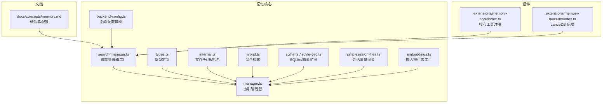
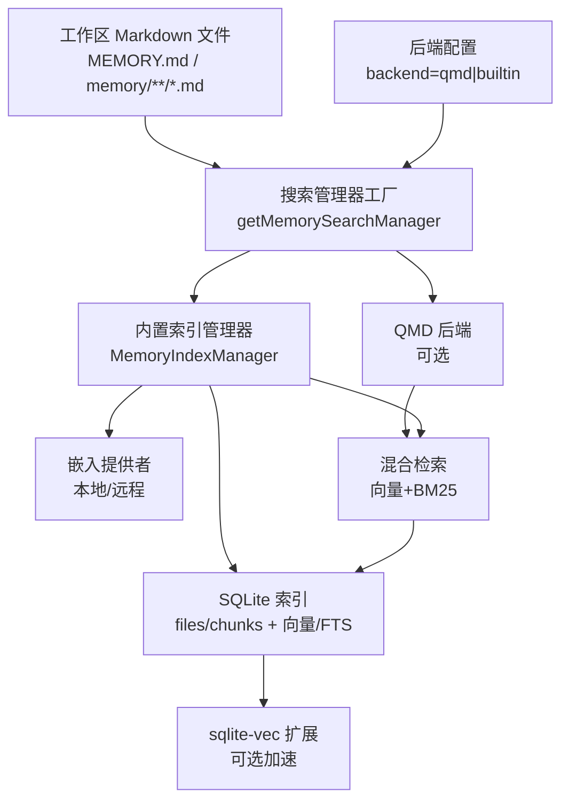
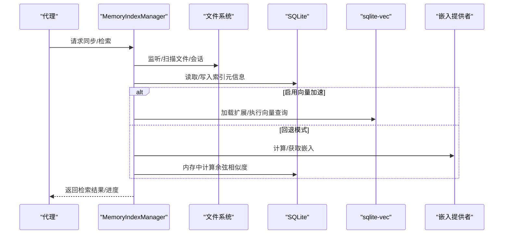
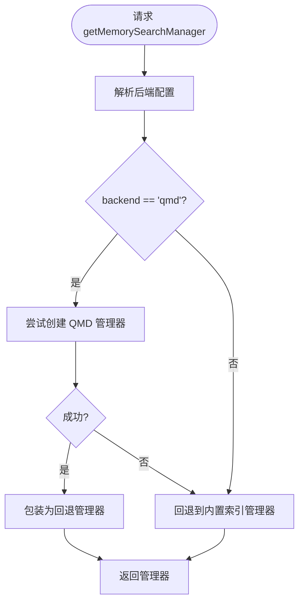
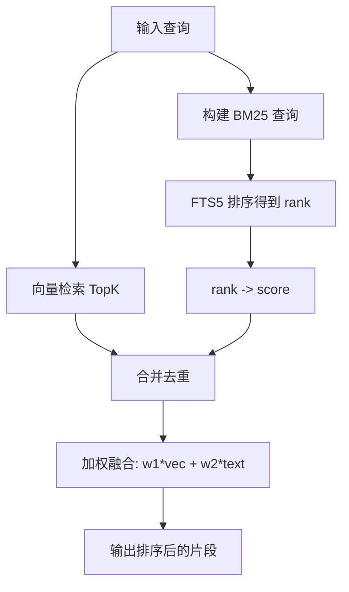
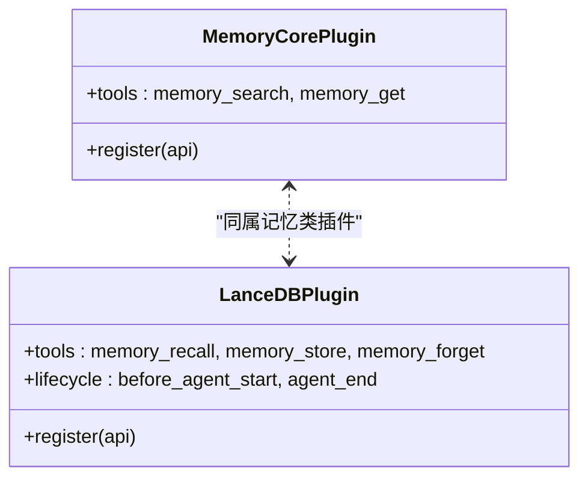
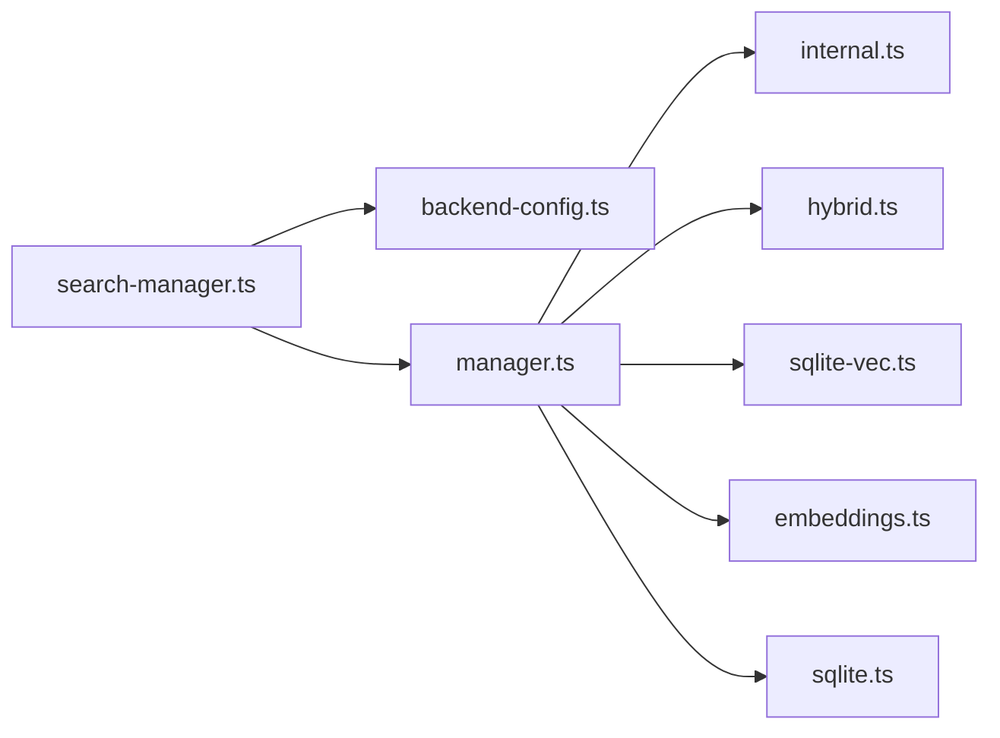

# 记忆管理

<cite>
**本文引用的文件**
- [docs/concepts/memory.md](file://docs/concepts/memory.md)
- [src/memory/manager.ts](file://src/memory/manager.ts)
- [src/memory/search-manager.ts](file://src/memory/search-manager.ts)
- [src/memory/backend-config.ts](file://src/memory/backend-config.ts)
- [src/memory/types.ts](file://src/memory/types.ts)
- [src/memory/internal.ts](file://src/memory/internal.ts)
- [src/memory/hybrid.ts](file://src/memory/hybrid.ts)
- [src/memory/sqlite.ts](file://src/memory/sqlite.ts)
- [src/memory/sqlite-vec.ts](file://src/memory/sqlite-vec.ts)
- [src/memory/sync-session-files.ts](file://src/memory/sync-session-files.ts)
- [src/memory/embeddings.ts](file://src/memory/embeddings.ts)
- [extensions/memory-core/index.ts](file://extensions/memory-core/index.ts)
- [extensions/memory-lancedb/index.ts](file://extensions/memory-lancedb/index.ts)
</cite>

## 目录

1. [简介](#简介)
2. [项目结构](#项目结构)
3. [核心组件](#核心组件)
4. [架构总览](#架构总览)
5. [详细组件分析](#详细组件分析)
6. [依赖关系分析](#依赖关系分析)
7. [性能考量](#性能考量)
8. [故障排查指南](#故障排查指南)
9. [结论](#结论)
10. [附录](#附录)

## 简介

本文件系统化梳理 OpenClaw 的记忆管理系统，覆盖以下方面：

- 记忆存储架构：基于工作区 Markdown 文件的纯文本源，SQLite 持久化索引，可选 sqlite-vec 向量加速。
- 向量嵌入技术：支持本地 node-llama-cpp 与远程 OpenAI/Gemini/Voyage；提供批处理与缓存策略。
- 检索机制：向量相似度与 BM25 关键词检索的混合融合，支持 QMD 后端与内置后端双栈回退。
- 内存后端配置：内置 SQLite、QMD（实验）、LanceDB（插件）三种形态。
- 批量处理与同步：增量同步、会话日志异步增量、批任务重试与并发控制。
- 配置项、性能调优与容量规划：提供参数指引与最佳实践。
- 与代理交互：工具注册、生命周期钩子、上下文注入与自动捕获。
- 可扩展性、备份恢复与数据迁移：多后端并行、状态目录与路径解析。

## 项目结构

记忆管理相关代码主要位于 src/memory 下，并通过插件扩展支持不同后端（如 LanceDB）。概念文档在 docs/concepts/memory.md 中对用户与运维有完整说明。

**图表来源**

- [src/memory/manager.ts](file://src/memory/manager.ts#L111-L200)
- [src/memory/search-manager.ts](file://src/memory/search-manager.ts#L19-L65)
- [src/memory/backend-config.ts](file://src/memory/backend-config.ts#L254-L311)
- [src/memory/types.ts](file://src/memory/types.ts#L61-L81)
- [src/memory/internal.ts](file://src/memory/internal.ts#L1-L200)
- [src/memory/hybrid.ts](file://src/memory/hybrid.ts#L1-L116)
- [src/memory/sqlite.ts](file://src/memory/sqlite.ts#L1-L10)
- [src/memory/sqlite-vec.ts](file://src/memory/sqlite-vec.ts#L1-L25)
- [src/memory/sync-session-files.ts](file://src/memory/sync-session-files.ts#L1-L132)
- [src/memory/embeddings.ts](file://src/memory/embeddings.ts#L130-L214)
- [extensions/memory-core/index.ts](file://extensions/memory-core/index.ts#L10-L35)
- [extensions/memory-lancedb/index.ts](file://extensions/memory-lancedb/index.ts#L242-L627)

**章节来源**

- [docs/concepts/memory.md](file://docs/concepts/memory.md#L1-L568)
- [src/memory/manager.ts](file://src/memory/manager.ts#L1-L200)
- [src/memory/search-manager.ts](file://src/memory/search-manager.ts#L1-L224)
- [src/memory/backend-config.ts](file://src/memory/backend-config.ts#L1-L311)
- [src/memory/types.ts](file://src/memory/types.ts#L1-L81)
- [src/memory/internal.ts](file://src/memory/internal.ts#L1-L200)
- [src/memory/hybrid.ts](file://src/memory/hybrid.ts#L1-L116)
- [src/memory/sqlite.ts](file://src/memory/sqlite.ts#L1-L10)
- [src/memory/sqlite-vec.ts](file://src/memory/sqlite-vec.ts#L1-L25)
- [src/memory/sync-session-files.ts](file://src/memory/sync-session-files.ts#L1-L132)
- [src/memory/embeddings.ts](file://src/memory/embeddings.ts#L1-L250)
- [extensions/memory-core/index.ts](file://extensions/memory-core/index.ts#L1-L39)
- [extensions/memory-lancedb/index.ts](file://extensions/memory-lancedb/index.ts#L1-L627)

## 核心组件

- 索引管理器（MemoryIndexManager）
  - 负责构建/维护 SQLite 索引，支持向量表与 FTS 表，按配置启用 sqlite-vec 加速。
  - 支持增量同步、会话文件异步增量、批处理嵌入、嵌入缓存、超时与重试策略。
- 搜索管理器工厂（getMemorySearchManager）
  - 解析后端配置，优先 QMD 后端，失败则回退到内置索引管理器。
- 后端配置解析（resolveMemoryBackendConfig）
  - 解析 memory.backend、qmd 配置、默认集合、自定义路径、更新/限制/作用域等。
- 类型与接口（types.ts）
  - 定义搜索结果、状态、进度、提供商探测等统一接口。
- 内部工具（internal.ts）
  - 文件枚举、去重、分块（按 token 数与重叠）、哈希、相对路径规范化。
- 混合检索（hybrid.ts）
  - 构建 BM25 查询、rank 到分数、向量与关键词结果合并。
- SQLite/向量扩展（sqlite.ts, sqlite-vec.ts）
  - 加载 node:sqlite 并按需加载 sqlite-vec 扩展。
- 会话文件同步（sync-session-files.ts）
  - 增量扫描会话 JSONL，按哈希判断是否需要重建索引。
- 嵌入提供者工厂（embeddings.ts）
  - 统一创建本地或远程嵌入客户端，支持自动选择与回退。

**章节来源**

- [src/memory/manager.ts](file://src/memory/manager.ts#L111-L200)
- [src/memory/search-manager.ts](file://src/memory/search-manager.ts#L19-L65)
- [src/memory/backend-config.ts](file://src/memory/backend-config.ts#L254-L311)
- [src/memory/types.ts](file://src/memory/types.ts#L1-L81)
- [src/memory/internal.ts](file://src/memory/internal.ts#L1-L200)
- [src/memory/hybrid.ts](file://src/memory/hybrid.ts#L1-L116)
- [src/memory/sqlite.ts](file://src/memory/sqlite.ts#L1-L10)
- [src/memory/sqlite-vec.ts](file://src/memory/sqlite-vec.ts#L1-L25)
- [src/memory/sync-session-files.ts](file://src/memory/sync-session-files.ts#L1-L132)
- [src/memory/embeddings.ts](file://src/memory/embeddings.ts#L130-L214)

## 架构总览

OpenClaw 记忆系统采用“文件源 + 索引 + 检索”的三层架构：

- 源：工作区 Markdown 文件（MEMORY.md、memory/ 目录及额外路径）。
- 索引：SQLite 数据库存储文件清单、分块、向量与 FTS；可选 sqlite-vec 向量加速。
- 检索：向量相似度 + BM25 关键词混合；支持 QMD 后端与内置后端双栈回退。

**图表来源**

- [src/memory/search-manager.ts](file://src/memory/search-manager.ts#L19-L65)
- [src/memory/backend-config.ts](file://src/memory/backend-config.ts#L254-L311)
- [src/memory/manager.ts](file://src/memory/manager.ts#L111-L200)
- [src/memory/sqlite-vec.ts](file://src/memory/sqlite-vec.ts#L1-L25)
- [src/memory/hybrid.ts](file://src/memory/hybrid.ts#L1-L116)

## 详细组件分析

### 索引管理器（MemoryIndexManager）

职责与特性：

- 管理索引元信息（模型、提供者指纹、分块参数、向量维度）。
- 增量同步：文件/会话变更触发，支持防抖与异步后台同步。
- 向量与关键词混合检索：向量相似度与 BM25 rank 转换后加权合并。
- 批处理嵌入：远程 OpenAI/Gemini/Voyage 批任务提交与轮询。
- 嵌入缓存：避免重复嵌入未变更文本。
- sqlite-vec 加速：按需加载扩展，否则回退到内存余弦计算。
- 超时与重试：查询与批任务分别设置本地/远程超时与指数退避重试。

关键流程（同步与检索）：

**图表来源**

- [src/memory/manager.ts](file://src/memory/manager.ts#L111-L200)
- [src/memory/sqlite-vec.ts](file://src/memory/sqlite-vec.ts#L1-L25)
- [src/memory/embeddings.ts](file://src/memory/embeddings.ts#L130-L214)

**章节来源**

- [src/memory/manager.ts](file://src/memory/manager.ts#L69-L103)
- [src/memory/manager.ts](file://src/memory/manager.ts#L1511-L1545)
- [src/memory/manager.ts](file://src/memory/manager.ts#L1547-L1560)

### 搜索管理器工厂与回退机制

- 解析后端配置，若 backend=qmd 则尝试启动 QMD 管理器；失败则回退到内置索引管理器。
- 缓存 QMD 管理器实例，失败时主动清理缓存以便下次重试。

**图表来源**

- [src/memory/search-manager.ts](file://src/memory/search-manager.ts#L19-L65)
- [src/memory/search-manager.ts](file://src/memory/search-manager.ts#L67-L202)

**章节来源**

- [src/memory/search-manager.ts](file://src/memory/search-manager.ts#L1-L224)

### 后端配置解析（QMD 与内置）

- 默认后端为内置（builtin），可切换至 QMD（实验）。
- QMD 支持默认集合（MEMORY.md、memory/\*\*.md）与自定义路径，配置包括命令、搜索模式、集合、会话导出、更新/嵌入间隔、限制与作用域。
- 内置后端支持额外路径、向量/FTS 开关、缓存、批任务等。

**章节来源**

- [src/memory/backend-config.ts](file://src/memory/backend-config.ts#L16-L62)
- [src/memory/backend-config.ts](file://src/memory/backend-config.ts#L254-L311)
- [docs/concepts/memory.md](file://docs/concepts/memory.md#L107-L231)

### 混合检索（向量 + BM25）

- 向量侧：从数据库或内存获取嵌入，计算相似度。
- 文本侧：构建 BM25 查询，将 rank 转换为 0..1 分数。
- 合并：按权重加权求和，去重后排序。

**图表来源**

- [src/memory/hybrid.ts](file://src/memory/hybrid.ts#L23-L116)

**章节来源**

- [src/memory/hybrid.ts](file://src/memory/hybrid.ts#L1-L116)

### 会话文件增量同步

- 基于会话 JSONL 文件，按大小/消息数阈值触发增量同步。
- 使用哈希判断是否需要重建索引，避免重复处理。
- 异步并发执行，支持进度回调。

**章节来源**

- [src/memory/sync-session-files.ts](file://src/memory/sync-session-files.ts#L19-L132)

### 嵌入提供者工厂与批处理

- 支持本地（node-llama-cpp）与远程（OpenAI/Gemini/Voyage）嵌入。
- 自动选择与回退：当某提供者不可用且存在回退配置时自动切换。
- 批处理：针对 OpenAI/Gemini/Voyage 提供批任务提交与轮询，支持并发与超时控制。

**章节来源**

- [src/memory/embeddings.ts](file://src/memory/embeddings.ts#L130-L214)
- [docs/concepts/memory.md](file://docs/concepts/memory.md#L313-L346)

### 插件：核心工具与 LanceDB 后端

- memory-core 插件：注册 memory_search 与 memory_get 工具，以及 CLI。
- memory-lancedb 插件：提供长时记忆（LanceDB 存储 + OpenAI 嵌入），支持自动回忆与自动捕获，带规则过滤与分类。

**图表来源**

- [extensions/memory-core/index.ts](file://extensions/memory-core/index.ts#L10-L35)
- [extensions/memory-lancedb/index.ts](file://extensions/memory-lancedb/index.ts#L242-L627)

**章节来源**

- [extensions/memory-core/index.ts](file://extensions/memory-core/index.ts#L1-L39)
- [extensions/memory-lancedb/index.ts](file://extensions/memory-lancedb/index.ts#L1-L627)

## 依赖关系分析

- 模块耦合
  - manager.ts 依赖 internal.ts（文件/分块）、hybrid.ts（混合检索）、sqlite-vec.ts（向量加速）、embeddings.ts（嵌入提供者）、backend-config.ts（后端配置）。
  - search-manager.ts 依赖 backend-config.ts 与 manager.ts（回退）。
- 外部依赖
  - node:sqlite、sqlite-vec、node-llama-cpp（可选）、OpenAI/Gemini/Voyage SDK。
- 循环依赖
  - 无直接循环；通过工厂函数与动态导入规避。

**图表来源**

- [src/memory/search-manager.ts](file://src/memory/search-manager.ts#L19-L65)
- [src/memory/manager.ts](file://src/memory/manager.ts#L1-L200)
- [src/memory/internal.ts](file://src/memory/internal.ts#L1-L200)
- [src/memory/hybrid.ts](file://src/memory/hybrid.ts#L1-L116)
- [src/memory/sqlite-vec.ts](file://src/memory/sqlite-vec.ts#L1-L25)
- [src/memory/embeddings.ts](file://src/memory/embeddings.ts#L130-L214)
- [src/memory/sqlite.ts](file://src/memory/sqlite.ts#L1-L10)

**章节来源**

- [src/memory/search-manager.ts](file://src/memory/search-manager.ts#L1-L224)
- [src/memory/manager.ts](file://src/memory/manager.ts#L1-L200)

## 性能考量

- 向量加速
  - 启用 sqlite-vec 可显著降低内存占用与提升查询速度；若加载失败，系统自动回退到内存余弦计算。
- 混合检索
  - 向量与 BM25 权重归一化，合理设置权重可兼顾语义与关键词召回。
- 增量同步
  - 文件与会话均采用哈希与阈值驱动的增量同步，减少全量重建开销。
- 批处理嵌入
  - 远程批任务显著降低 API 成本与延迟；建议根据负载调整并发与轮询间隔。
- 嵌入缓存
  - 对未变更文本复用嵌入，减少重复计算。
- 超时与重试
  - 查询与批任务分别设置本地/远程超时，避免阻塞；批任务失败上限保护与指数退避降低抖动。

[本节为通用性能指导，无需特定文件引用]

## 故障排查指南

- 嵌入提供者不可用
  - 检查 API Key、网络连通性与 provider/fallback 配置；本地 node-llama-cpp 未安装时会提示安装步骤。
- sqlite-vec 加载失败
  - 查看错误日志并确认扩展路径；可在配置中指定 extensionPath 或使用默认路径。
- QMD 后端不可用
  - 检查 qmd 可执行文件、SQLite 扩展可用性与权限；失败时自动回退内置索引。
- 批任务失败
  - 查看失败次数与最后错误原因；超过失败上限后锁定批任务功能，等待重试。
- 会话增量不同步
  - 检查 delta 字节/消息阈值与文件大小变化；确认会话目录可读。

**章节来源**

- [src/memory/embeddings.ts](file://src/memory/embeddings.ts#L227-L250)
- [src/memory/sqlite-vec.ts](file://src/memory/sqlite-vec.ts#L20-L24)
- [src/memory/search-manager.ts](file://src/memory/search-manager.ts#L51-L55)
- [src/memory/manager.ts](file://src/memory/manager.ts#L92-L102)

## 结论

OpenClaw 记忆系统以“文件源 + 索引 + 检索”为核心，结合向量与关键词混合检索、增量同步与批处理能力，既保证了检索质量，又兼顾了性能与成本。通过 QMD 与内置后端的双栈设计，系统具备良好的可扩展性与容错能力；配合插件生态，可满足从轻量到企业级的多样化需求。

[本节为总结，无需特定文件引用]

## 附录

### 配置要点与最佳实践

- 后端选择
  - 默认内置；需要本地-first 与 rerank 能力时可启用 QMD。
- 嵌入提供者
  - 优先本地 node-llama-cpp 以降低成本；远程提供者需正确配置 API Key 与 headers。
- 批处理
  - 大规模索引时启用批任务，合理设置并发与轮询间隔。
- 混合检索
  - 根据场景调整权重与候选倍数，确保语义与关键词召回平衡。
- 会话索引
  - 实验性功能，谨慎开启；注意磁盘访问边界与隔离策略。

**章节来源**

- [docs/concepts/memory.md](file://docs/concepts/memory.md#L352-L568)
- [src/memory/backend-config.ts](file://src/memory/backend-config.ts#L254-L311)

### 数据流与缓存策略

- 数据流
  - 文件变更 → 增量同步 → 嵌入生成/缓存 → 写入索引 → 检索（向量/FTS/混合）。
- 缓存
  - 嵌入缓存：避免重复嵌入；索引元信息与会话脏文件集合用于增量判断。

**章节来源**

- [src/memory/manager.ts](file://src/memory/manager.ts#L1511-L1545)
- [src/memory/sync-session-files.ts](file://src/memory/sync-session-files.ts#L19-L132)

### 扩展性、备份与迁移

- 扩展性
  - 多后端并行：QMD 与内置可同时存在；插件化工具与生命周期钩子便于扩展。
- 备份与恢复
  - SQLite 数据库与 QMD 状态目录为关键状态；可通过复制状态目录实现备份/迁移。
- 迁移
  - 不同后端间迁移需重新索引；建议先在新后端上重建索引，再切换配置。

**章节来源**

- [src/memory/sqlite.ts](file://src/memory/sqlite.ts#L1-L10)
- [src/memory/backend-config.ts](file://src/memory/backend-config.ts#L254-L311)
