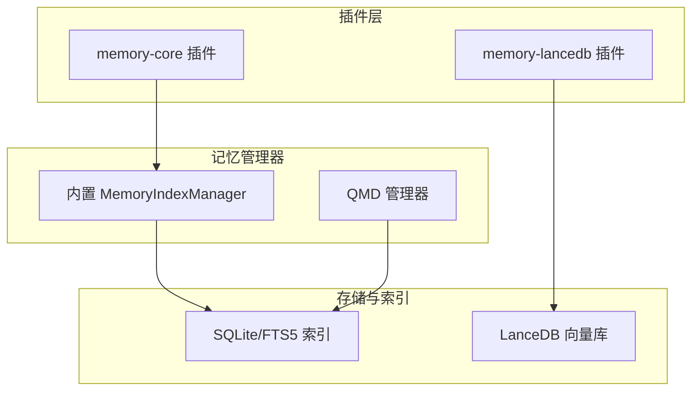
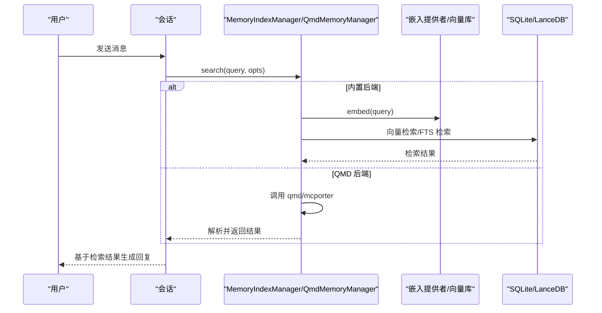
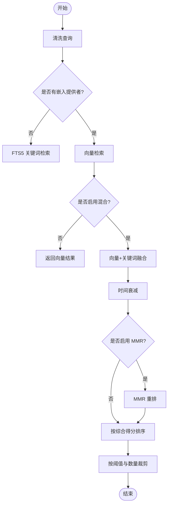
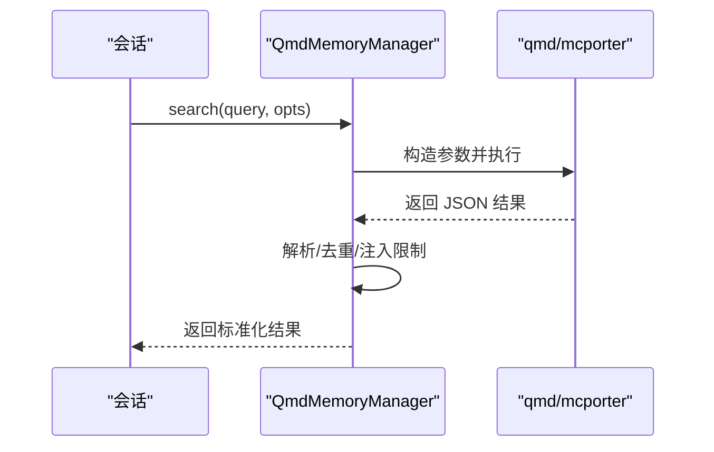
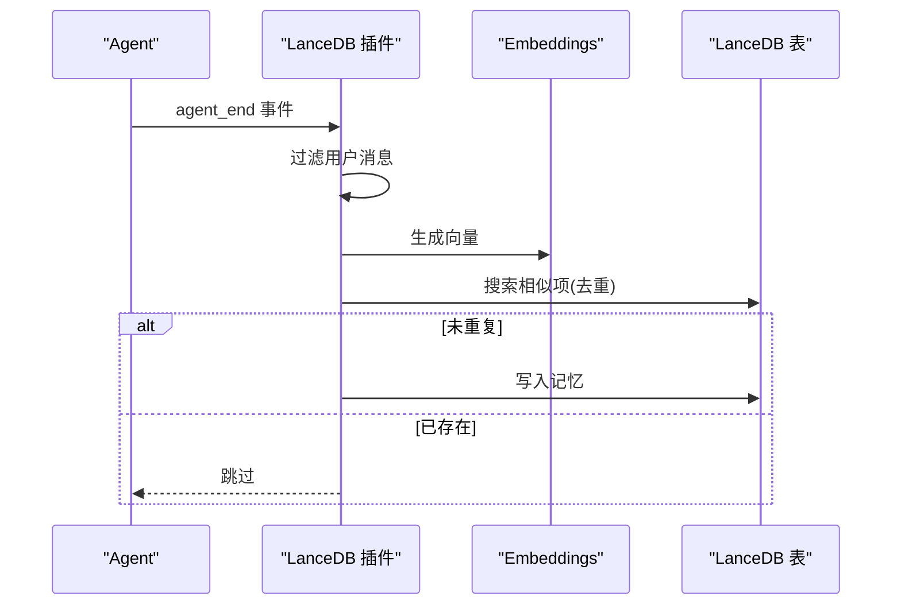
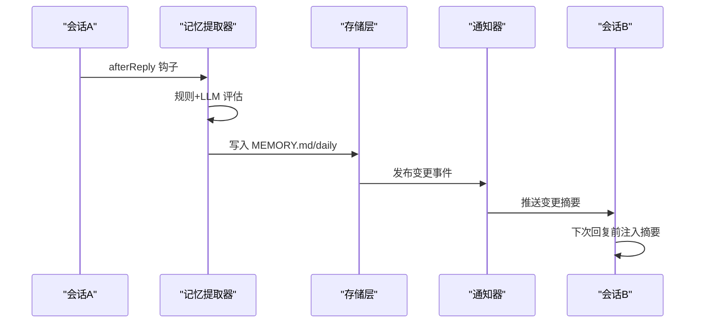
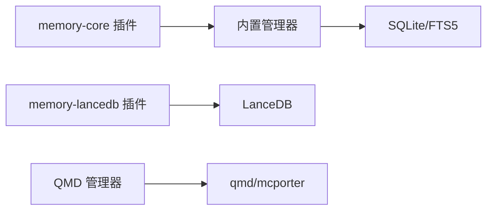

# 记忆系统

<cite>
**本文引用的文件**
- [extensions/memory-core/index.ts](file://extensions/memory-core/index.ts)
- [extensions/memory-lancedb/index.ts](file://extensions/memory-lancedb/index.ts)
- [src/memory/manager.ts](file://src/memory/manager.ts)
- [src/memory/types.ts](file://src/memory/types.ts)
- [src/memory/memory-schema.ts](file://src/memory/memory-schema.ts)
- [src/memory/hybrid.ts](file://src/memory/hybrid.ts)
- [src/memory/manager-search.ts](file://src/memory/manager-search.ts)
- [src/memory/qmd-manager.ts](file://src/memory/qmd-manager.ts)
- [src/memory/backend-config.ts](file://src/memory/backend-config.ts)
- [docs/design/cross-session-memory-sync.md](file://docs/design/cross-session-memory-sync.md)
</cite>

## 目录

1. [简介](#简介)
2. [项目结构](#项目结构)
3. [核心组件](#核心组件)
4. [架构总览](#架构总览)
5. [详细组件分析](#详细组件分析)
6. [依赖关系分析](#依赖关系分析)
7. [性能考量](#性能考量)
8. [故障排查指南](#故障排查指南)
9. [结论](#结论)
10. [附录](#附录)

## 简介

本文件面向开发者，系统化阐述 OpenClaw 记忆系统的架构设计、存储机制与检索策略，覆盖短期记忆（会话内）、长期记忆（文件与向量索引）以及跨会话同步机制。文档同时给出记忆索引与搜索算法、相关性排序方法、优化与容量管理、隐私保护策略，以及自定义记忆策略与检索增强的开发指南。

## 项目结构

OpenClaw 记忆系统由“内置搜索引擎 + 可选外部后端（如 LanceDB）+ QMD 后端”构成，插件化扩展提供工具与生命周期钩子，支撑自动记忆提取、跨会话同步与主动召回。



图表来源

- [extensions/memory-core/index.ts](file://extensions/memory-core/index.ts#L1-L39)
- [extensions/memory-lancedb/index.ts](file://extensions/memory-lancedb/index.ts#L1-L671)
- [src/memory/manager.ts](file://src/memory/manager.ts#L1-L641)
- [src/memory/qmd-manager.ts](file://src/memory/qmd-manager.ts#L1-L800)

章节来源

- [extensions/memory-core/index.ts](file://extensions/memory-core/index.ts#L1-L39)
- [extensions/memory-lancedb/index.ts](file://extensions/memory-lancedb/index.ts#L1-L671)
- [src/memory/manager.ts](file://src/memory/manager.ts#L1-L641)
- [src/memory/qmd-manager.ts](file://src/memory/qmd-manager.ts#L1-L800)

## 核心组件

- 内置搜索管理器（MemoryIndexManager）：负责文件扫描、分词索引（FTS5）、向量搜索、混合检索、批处理与缓存、状态查询与关闭。
- QMD 管理器（QmdMemoryManager）：封装外部 qmd/mcporter 工具，提供集合管理、增量更新、跨集合搜索与结果注入。
- LanceDB 插件：提供向量存储、自动捕获与召回、规则过滤、CLI 与生命周期钩子。
- 类型与模式：统一搜索结果、状态、配置解析与数据库表结构。

章节来源

- [src/memory/manager.ts](file://src/memory/manager.ts#L1-L641)
- [src/memory/types.ts](file://src/memory/types.ts#L1-L81)
- [src/memory/memory-schema.ts](file://src/memory/memory-schema.ts#L1-L97)
- [src/memory/hybrid.ts](file://src/memory/hybrid.ts#L1-L150)
- [src/memory/manager-search.ts](file://src/memory/manager-search.ts#L1-L192)
- [src/memory/qmd-manager.ts](file://src/memory/qmd-manager.ts#L1-L800)
- [src/memory/backend-config.ts](file://src/memory/backend-config.ts#L1-L355)
- [extensions/memory-lancedb/index.ts](file://extensions/memory-lancedb/index.ts#L1-L671)

## 架构总览

OpenClaw 记忆系统支持两种后端：

- 内置后端：SQLite + FTS5（纯文本检索）+ 向量表（cosine 距离），支持混合检索与多样性重排（MMR）与时间衰减。
- QMD 后端：通过 qmd/mcporter 管理集合、索引与搜索，支持多种搜索模式（search/vsearch/query），并可注入会话导出与范围控制。



图表来源

- [src/memory/manager.ts](file://src/memory/manager.ts#L207-L293)
- [src/memory/manager-search.ts](file://src/memory/manager-search.ts#L20-L94)
- [src/memory/qmd-manager.ts](file://src/memory/qmd-manager.ts#L608-L745)

章节来源

- [src/memory/manager.ts](file://src/memory/manager.ts#L207-L293)
- [src/memory/manager-search.ts](file://src/memory/manager-search.ts#L20-L94)
- [src/memory/qmd-manager.ts](file://src/memory/qmd-manager.ts#L608-L745)

## 详细组件分析

### 内置搜索管理器（MemoryIndexManager）

职责与特性

- 文件源与会话源双轨索引：支持 "memory" 与 "sessions" 两类来源，按来源过滤检索。
- 搜索模式：FTS-only（无嵌入提供者时）、混合检索（向量 + 关键词，BM25 归一化 + 权重融合）。
- 混合检索与重排：支持时间衰减与最大互相关（MMR）重排，提升多样性与时效性。
- 批处理与缓存：嵌入缓存表、批处理失败上限、并发与轮询参数，保障稳定性。
- 同步与状态：文件系统监听、会话增量标记、状态查询与关闭资源。

```mermaid
classDiagram
class MemoryIndexManager {
+search(query, opts) MemorySearchResult[]
+sync(params) void
+readFile(params) {text,path}
+status() MemoryProviderStatus
+probeEmbeddingAvailability() MemoryEmbeddingProbeResult
+probeVectorAvailability() boolean
+close() void
}
class MemorySearchManager {
<<interface>>
+search()
+readFile()
+status()
+probeEmbeddingAvailability()
+probeVectorAvailability()
}
MemoryIndexManager ..|> MemorySearchManager
```

图表来源

- [src/memory/manager.ts](file://src/memory/manager.ts#L43-L641)
- [src/memory/types.ts](file://src/memory/types.ts#L61-L81)

章节来源

- [src/memory/manager.ts](file://src/memory/manager.ts#L1-L641)
- [src/memory/types.ts](file://src/memory/types.ts#L1-L81)

### 搜索与索引实现（FTS5、向量、混合）

- FTS5：基于 SQLite 的全文检索，BM25 排序，查询词规范化与 AND 组合，支持按模型与来源过滤。
- 向量检索：cosine 距离计算，支持本地扩展与回退（无扩展时使用内存向量列表）。
- 混合检索：向量与关键词结果按权重融合，可选 MMR 与时间衰减，最终按综合得分排序。



图表来源

- [src/memory/manager.ts](file://src/memory/manager.ts#L227-L293)
- [src/memory/hybrid.ts](file://src/memory/hybrid.ts#L51-L150)
- [src/memory/manager-search.ts](file://src/memory/manager-search.ts#L20-L94)

章节来源

- [src/memory/manager-search.ts](file://src/memory/manager-search.ts#L1-L192)
- [src/memory/hybrid.ts](file://src/memory/hybrid.ts#L1-L150)

### QMD 管理器（QmdMemoryManager）

职责与特性

- 集合管理：默认 + 自定义集合，支持路径与模式绑定，跨集合搜索与结果去重。
- 生命周期：开机同步、定时更新、命令超时与回退策略、嵌入指数退避。
- 搜索模式：search/vsearch/query 三种模式，mcporter 可选加速；支持范围与会话导出。
- 结果注入：按来源多样化、注入字符上限控制，避免 context 泄漏。



图表来源

- [src/memory/qmd-manager.ts](file://src/memory/qmd-manager.ts#L608-L745)
- [src/memory/backend-config.ts](file://src/memory/backend-config.ts#L297-L355)

章节来源

- [src/memory/qmd-manager.ts](file://src/memory/qmd-manager.ts#L1-L800)
- [src/memory/backend-config.ts](file://src/memory/backend-config.ts#L1-L355)

### LanceDB 插件（自动捕获与召回）

职责与特性

- 自动捕获：afterReply 钩子分析用户消息，规则过滤 + LLM 评估，去重后写入 LanceDB。
- 主动召回：beforeAgentStart 钩子注入相关记忆上下文，避免 prompt 注入风险。
- 工具与 CLI：memory_recall/memory_store/memory_forget 三大工具与 CLI 命令。
- 安全：UUID 删除校验、prompt 转义、注入检测。



图表来源

- [extensions/memory-lancedb/index.ts](file://extensions/memory-lancedb/index.ts#L567-L650)

章节来源

- [extensions/memory-lancedb/index.ts](file://extensions/memory-lancedb/index.ts#L1-L671)

### 跨会话同步机制（设计草案）

- 自动提取：afterReply 钩子触发，规则预过滤 + LLM 评估 + 去重合并，写入 MEMORY.md 或每日日志。
- 变更通知：事件总线通知其他会话，消费队列并在下次回复前注入摘要。
- 增量同步：检测 MEMORY.md 变化，增量注入 system prompt。
- 主动召回：自动预搜索，将相关记忆注入 system prompt 补充区。



图表来源

- [docs/design/cross-session-memory-sync.md](file://docs/design/cross-session-memory-sync.md#L95-L123)

章节来源

- [docs/design/cross-session-memory-sync.md](file://docs/design/cross-session-memory-sync.md#L1-L734)

## 依赖关系分析

- 内置后端依赖 SQLite/FTS5 与嵌入提供者（OpenAI/Gemini/Mistral/Voyage），支持向量扩展与回退。
- QMD 后端依赖外部 qmd/mcporter，通过环境隔离与 XDG 目录管理索引。
- 插件层通过 OpenClaw 插件 API 注册工具、CLI 与生命周期钩子，实现自动捕获与召回。



图表来源

- [extensions/memory-core/index.ts](file://extensions/memory-core/index.ts#L1-L39)
- [extensions/memory-lancedb/index.ts](file://extensions/memory-lancedb/index.ts#L1-L671)
- [src/memory/manager.ts](file://src/memory/manager.ts#L1-L641)
- [src/memory/qmd-manager.ts](file://src/memory/qmd-manager.ts#L1-L800)

章节来源

- [extensions/memory-core/index.ts](file://extensions/memory-core/index.ts#L1-L39)
- [extensions/memory-lancedb/index.ts](file://extensions/memory-lancedb/index.ts#L1-L671)
- [src/memory/manager.ts](file://src/memory/manager.ts#L1-L641)
- [src/memory/qmd-manager.ts](file://src/memory/qmd-manager.ts#L1-L800)

## 性能考量

- 搜索性能
  - 向量检索：cosine 距离，支持本地扩展与回退；建议合理 limit 与阈值。
  - FTS5：BM25 排序，关键词规范化；注意查询词数量与模型过滤。
  - 混合检索：权重融合 + MMR + 时间衰减，适度降低候选集以控制开销。
- 批处理与缓存
  - 嵌入缓存表按 provider/model/hash 建立主键，定期清理与容量控制。
  - 批处理失败上限与指数退避，避免瞬时峰值。
- I/O 与索引
  - SQLite/FTS5：建立必要索引（chunks.path、chunks.source、embedding_cache.updated_at）。
  - QMD：命令超时、增量更新与集合绑定，避免无效扫描。
- 资源与容量
  - 控制最大结果数、注入字符上限、会话导出保留周期，避免内存与磁盘压力。

[本节为通用指导，不直接分析具体文件]

## 故障排查指南

- 嵌入提供者不可用
  - 使用探针接口检查可用性，查看 fallback 信息与错误原因。
- 向量扩展加载失败
  - 检查扩展路径与维度配置，确认 ensureVectorReady 成功。
- QMD 命令失败
  - 查看命令超时、集合缺失修复、null-byte 元数据修复尝试。
- 记忆写入异常
  - LanceDB 插件删除需 UUID 校验，避免注入；prompt 转义与注入检测。
- 跨会话同步未生效
  - 确认 afterReply 钩子触发、通知器事件发布、会话订阅与摘要注入。

章节来源

- [src/memory/manager.ts](file://src/memory/manager.ts#L578-L604)
- [src/memory/qmd-manager.ts](file://src/memory/qmd-manager.ts#L432-L441)
- [extensions/memory-lancedb/index.ts](file://extensions/memory-lancedb/index.ts#L142-L151)

## 结论

OpenClaw 记忆系统通过“内置 + QMD + 插件”的组合，实现了从文件到向量的多模态检索、跨会话同步与自动增强。内置后端强调稳定与可控，QMD 后端强调可扩展与生态，LanceDB 插件强调自动化与安全。配合跨会话同步设计草案，系统可在不改变用户习惯的前提下，提供更自然、更智能的记忆体验。

[本节为总结，不直接分析具体文件]

## 附录

### 开发指南：自定义记忆策略与检索增强

- 自定义检索策略
  - 在内置管理器中调整混合权重、MMR 参数与时间衰减半衰期，平衡相关性与多样性。
  - 通过来源过滤与模型过滤，限定检索范围，提升准确性。
- 检索增强
  - 在 Agent 流程中集成自动预搜索，将高相关片段注入 system prompt 补充区。
  - 使用 QMD 的多模式搜索与 mcporter 加速，结合注入字符上限控制。
- 安全与隐私
  - 使用 LanceDB 的 prompt 转义与注入检测，避免历史记忆污染。
  - 跨会话通知仅注入摘要，避免敏感内容泄露。
- 配置要点
  - 后端选择：builtin/qmd；内置后端启用 FTS 与向量；QMD 启用 mcporter 并配置集合。
  - 限额与超时：maxResults、maxSnippetChars、timeoutMs、maxInjectedChars。
  - 批处理：并发、轮询间隔、失败上限与等待策略。

章节来源

- [src/memory/hybrid.ts](file://src/memory/hybrid.ts#L51-L150)
- [src/memory/backend-config.ts](file://src/memory/backend-config.ts#L180-L355)
- [extensions/memory-lancedb/index.ts](file://extensions/memory-lancedb/index.ts#L227-L263)
- [docs/design/cross-session-memory-sync.md](file://docs/design/cross-session-memory-sync.md#L439-L483)
