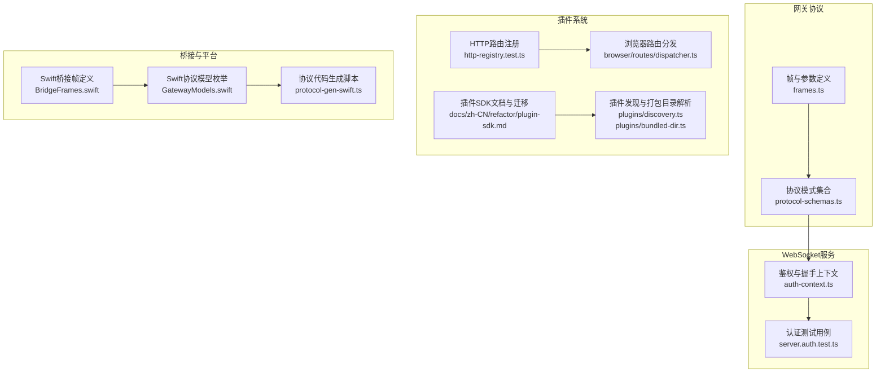
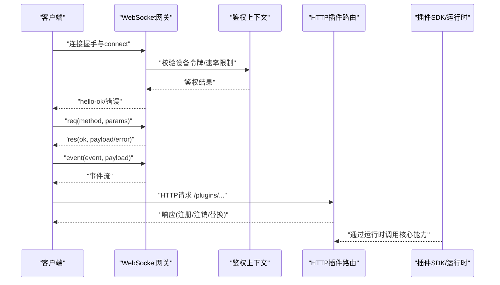
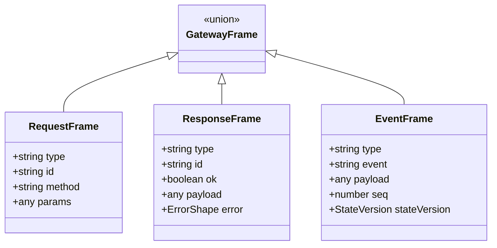
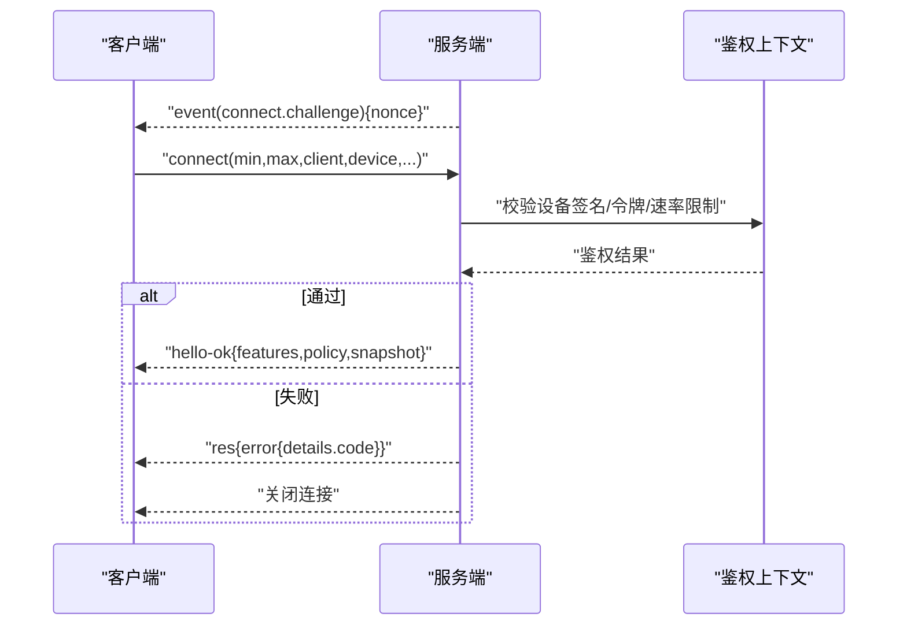
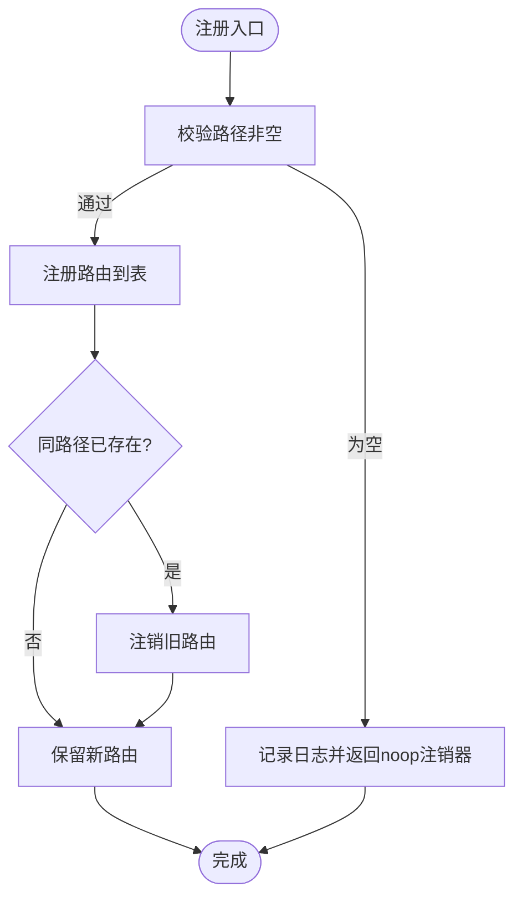
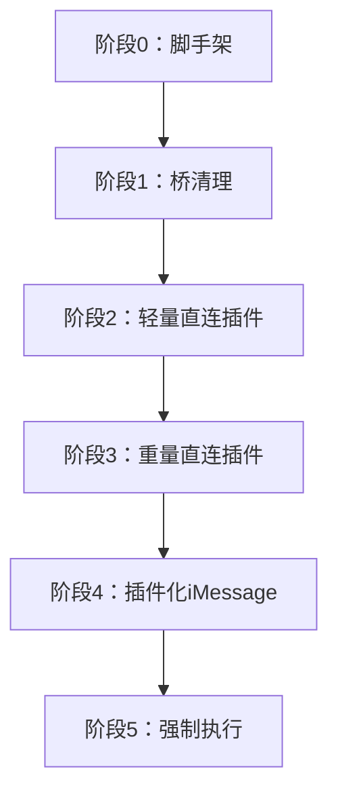
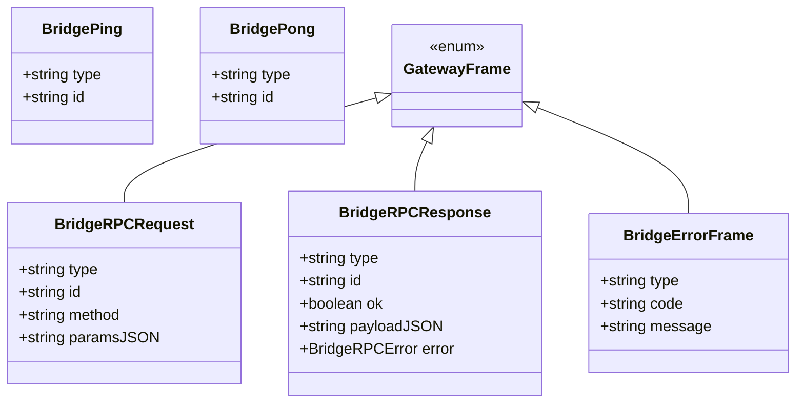
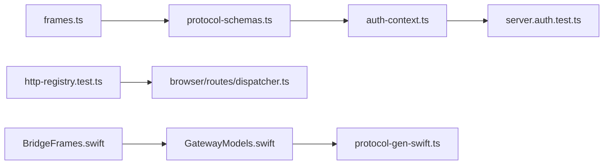

# API参考

<cite>
**本文引用的文件**
- [src/gateway/protocol/schema/frames.ts](file://src/gateway/protocol/schema/frames.ts)
- [src/gateway/protocol/schema/protocol-schemas.ts](file://src/gateway/protocol/schema/protocol-schemas.ts)
- [src/gateway/server.auth.test.ts](file://src/gateway/server.auth.test.ts)
- [apps/shared/OpenClawKit/Sources/OpenClawKit/BridgeFrames.swift](file://apps/shared/OpenClawKit/Sources/OpenClawKit/BridgeFrames.swift)
- [apps/macos/Sources/OpenClawProtocol/GatewayModels.swift](file://apps/macos/Sources/OpenClawProtocol/GatewayModels.swift)
- [scripts/protocol-gen-swift.ts](file://scripts/protocol-gen-swift.ts)
- [src/plugins/http-registry.test.ts](file://src/plugins/http-registry.test.ts)
- [src/browser/routes/dispatcher.ts](file://src/browser/routes/dispatcher.ts)
- [src/extensionAPI.ts](file://src/extensionAPI.ts)
- [docs/zh-CN/refactor/plugin-sdk.md](file://docs/zh-CN/refactor/plugin-sdk.md)
- [src/plugins/bundled-dir.ts](file://src/plugins/bundled-dir.ts)
- [src/plugins/discovery.ts](file://src/plugins/discovery.ts)
- [src/plugins/bundled-sources.test.ts](file://src/plugins/bundled-sources.test.ts)
- [src/gateway/protocol/schema/error-codes.ts](file://src/gateway/protocol/schema/error-codes.ts)
- [src/gateway/server/ws-connection/auth-context.ts](file://src/gateway/server/ws-connection/auth-context.ts)
- [src/browser/http-auth.ts](file://src/browser/http-auth.ts)
- [src/infra/unhandled-rejections.ts](file://src/infra/unhandled-rejections.ts)
- [src/telegram/network-errors.ts](file://src/telegram/network-errors.ts)
- [src/agents/pi-embedded-helpers/errors.ts](file://src/agents/pi-embedded-helpers/errors.ts)
- [docs/zh-CN/gateway/security/index.md](file://docs/zh-CN/gateway/security/index.md)
</cite>

## 目录

1. [简介](#简介)
2. [项目结构](#项目结构)
3. [核心组件](#核心组件)
4. [架构总览](#架构总览)
5. [详细组件分析](#详细组件分析)
6. [依赖关系分析](#依赖关系分析)
7. [性能考量](#性能考量)
8. [故障排查指南](#故障排查指南)
9. [结论](#结论)
10. [附录](#附录)

## 简介

本文件为 OpenClaw 的完整 API 参考，覆盖以下方面：

- WebSocket 协议与帧格式、事件类型与实时交互模式
- HTTP API 与插件路由注册机制
- 插件 SDK 与扩展 API 的设计、版本控制与迁移路径
- RPC 适配器与桥接帧格式
- 错误处理策略、安全考虑与调试工具使用方法
- 性能优化建议与最佳实践

## 项目结构

OpenClaw 的 API 相关能力主要分布在如下模块：

- 网关协议与帧定义：位于 gateway/protocol/schema
- WebSocket 服务器与鉴权：位于 gateway/server 与 ws-connection
- 插件系统与 HTTP 路由注册：位于 plugins 与 browser 路由分发
- 插件 SDK 文档与迁移计划：位于 docs/zh-CN/refactor
- 平台桥接与 Swift 协议模型：位于 apps/_/Sources/OpenClaw_

**图表来源**

- [src/gateway/protocol/schema/frames.ts](file://src/gateway/protocol/schema/frames.ts#L1-L164)
- [src/gateway/protocol/schema/protocol-schemas.ts](file://src/gateway/protocol/schema/protocol-schemas.ts#L1-L200)
- [src/gateway/server/ws-connection/auth-context.ts](file://src/gateway/server/ws-connection/auth-context.ts#L180-L218)
- [src/gateway/server.auth.test.ts](file://src/gateway/server.auth.test.ts#L500-L700)
- [src/plugins/http-registry.test.ts](file://src/plugins/http-registry.test.ts#L1-L44)
- [src/browser/routes/dispatcher.ts](file://src/browser/routes/dispatcher.ts#L40-L82)
- [docs/zh-CN/refactor/plugin-sdk.md](file://docs/zh-CN/refactor/plugin-sdk.md#L42-L222)
- [src/plugins/discovery.ts](file://src/plugins/discovery.ts#L322-L369)
- [src/plugins/bundled-dir.ts](file://src/plugins/bundled-dir.ts#L1-L41)
- [apps/shared/OpenClawKit/Sources/OpenClawKit/BridgeFrames.swift](file://apps/shared/OpenClawKit/Sources/OpenClawKit/BridgeFrames.swift#L187-L261)
- [apps/macos/Sources/OpenClawProtocol/GatewayModels.swift](file://apps/macos/Sources/OpenClawProtocol/GatewayModels.swift#L3295-L3329)
- [scripts/protocol-gen-swift.ts](file://scripts/protocol-gen-swift.ts#L203-L247)

**章节来源**

- [src/gateway/protocol/schema/frames.ts](file://src/gateway/protocol/schema/frames.ts#L1-L164)
- [src/gateway/protocol/schema/protocol-schemas.ts](file://src/gateway/protocol/schema/protocol-schemas.ts#L1-L200)
- [src/gateway/server/ws-connection/auth-context.ts](file://src/gateway/server/ws-connection/auth-context.ts#L180-L218)
- [src/gateway/server.auth.test.ts](file://src/gateway/server.auth.test.ts#L500-L700)
- [src/plugins/http-registry.test.ts](file://src/plugins/http-registry.test.ts#L1-L44)
- [src/browser/routes/dispatcher.ts](file://src/browser/routes/dispatcher.ts#L40-L82)
- [docs/zh-CN/refactor/plugin-sdk.md](file://docs/zh-CN/refactor/plugin-sdk.md#L42-L222)
- [src/plugins/discovery.ts](file://src/plugins/discovery.ts#L322-L369)
- [src/plugins/bundled-dir.ts](file://src/plugins/bundled-dir.ts#L1-L41)
- [apps/shared/OpenClawKit/Sources/OpenClawKit/BridgeFrames.swift](file://apps/shared/OpenClawKit/Sources/OpenClawKit/BridgeFrames.swift#L187-L261)
- [apps/macos/Sources/OpenClawProtocol/GatewayModels.swift](file://apps/macos/Sources/OpenClawProtocol/GatewayModels.swift#L3295-L3329)
- [scripts/protocol-gen-swift.ts](file://scripts/protocol-gen-swift.ts#L203-L247)

## 核心组件

- WebSocket 帧与协议
  - 请求帧、响应帧、事件帧与联合帧类型定义，统一的帧结构与字段约束
  - 连接参数、Hello 响应、错误形状等协议模式
- 鉴权与握手
  - 设备令牌校验、速率限制、错误细节码
  - 连接挑战与非匹配协议拒绝
- 插件系统与 HTTP API
  - 插件 HTTP 路由注册与注销、重复路径替换策略
  - 浏览器侧路由注册与分发
- 插件 SDK 与扩展 API
  - SDK 接口最小化、运行时注入、版本与兼容性策略
  - 分阶段迁移路径与强制检查
- 平台桥接与协议模型
  - Swift 桥接帧与协议模型枚举，代码生成流程

**章节来源**

- [src/gateway/protocol/schema/frames.ts](file://src/gateway/protocol/schema/frames.ts#L125-L163)
- [src/gateway/protocol/schema/protocol-schemas.ts](file://src/gateway/protocol/schema/protocol-schemas.ts#L153-L186)
- [src/gateway/server.auth.test.ts](file://src/gateway/server.auth.test.ts#L578-L601)
- [src/gateway/server/ws-connection/auth-context.ts](file://src/gateway/server/ws-connection/auth-context.ts#L180-L218)
- [src/plugins/http-registry.test.ts](file://src/plugins/http-registry.test.ts#L1-L44)
- [src/browser/routes/dispatcher.ts](file://src/browser/routes/dispatcher.ts#L40-L82)
- [docs/zh-CN/refactor/plugin-sdk.md](file://docs/zh-CN/refactor/plugin-sdk.md#L147-L192)
- [apps/shared/OpenClawKit/Sources/OpenClawKit/BridgeFrames.swift](file://apps/shared/OpenClawKit/Sources/OpenClawKit/BridgeFrames.swift#L187-L261)
- [apps/macos/Sources/OpenClawProtocol/GatewayModels.swift](file://apps/macos/Sources/OpenClawProtocol/GatewayModels.swift#L3295-L3329)

## 架构总览

下图展示 WebSocket 协议、HTTP 插件路由与插件 SDK 的整体交互。

**图表来源**

- [src/gateway/server.auth.test.ts](file://src/gateway/server.auth.test.ts#L564-L601)
- [src/gateway/server/ws-connection/auth-context.ts](file://src/gateway/server/ws-connection/auth-context.ts#L180-L218)
- [src/plugins/http-registry.test.ts](file://src/plugins/http-registry.test.ts#L1-L44)
- [docs/zh-CN/refactor/plugin-sdk.md](file://docs/zh-CN/refactor/plugin-sdk.md#L147-L192)

## 详细组件分析

### WebSocket 协议与帧格式

- 帧类型
  - 请求帧：包含 type="req"、id、method、params
  - 响应帧：包含 type="res"、id、ok、payload 或 error
  - 事件帧：包含 type="event"、event、payload、可选序号与状态版本
  - 联合帧：以 discriminator "type" 区分 req/res/event
- 连接参数与握手
  - ConnectParams：min/max 协议版本、客户端信息、设备签名、权限与环境等
  - HelloOk：返回协议版本、服务端版本、特性清单、快照、策略参数等
- 错误形状
  - ErrorShape：code、message、details、retryable、retryAfterMs

**图表来源**

- [src/gateway/protocol/schema/frames.ts](file://src/gateway/protocol/schema/frames.ts#L125-L163)

**章节来源**

- [src/gateway/protocol/schema/frames.ts](file://src/gateway/protocol/schema/frames.ts#L1-L164)
- [src/gateway/protocol/schema/protocol-schemas.ts](file://src/gateway/protocol/schema/protocol-schemas.ts#L153-L186)

### 鉴权与握手流程

- 连接挑战与 nonce
  - 服务器在连接建立后发送 "connect.challenge" 事件，携带 nonce
  - 客户端必须在首次 connect 请求中提供正确的 nonce
- 协议版本匹配
  - 若 min/max 协议不在服务端支持范围内，连接被拒绝
- 设备签名与权限
  - 设备签名需与 scopes 匹配；缺失或不一致将导致鉴权失败
- 速率限制
  - 设备令牌校验失败会触发速率限制记录与重试时间提示

**图表来源**

- [src/gateway/server.auth.test.ts](file://src/gateway/server.auth.test.ts#L564-L601)
- [src/gateway/server.auth.test.ts](file://src/gateway/server.auth.test.ts#L578-L601)
- [src/gateway/server.ws-connection/auth-context.ts](file://src/gateway/server/ws-connection/auth-context.ts#L180-L218)

**章节来源**

- [src/gateway/server.auth.test.ts](file://src/gateway/server.auth.test.ts#L564-L601)
- [src/gateway/server.auth.test.ts](file://src/gateway/server.auth.test.ts#L578-L601)
- [src/gateway/server/ws-connection/auth-context.ts](file://src/gateway/server/ws-connection/auth-context.ts#L180-L218)

### HTTP API 与插件路由

- 插件 HTTP 路由注册
  - 注册成功后可注销；空路径会记录日志并返回空操作注销器
  - 同路径新注册会替换旧路由，保留最新注册项
- 浏览器路由分发
  - 统一注册 GET/POST/DELETE，按方法与正则匹配分发，未命中返回 404

**图表来源**

- [src/plugins/http-registry.test.ts](file://src/plugins/http-registry.test.ts#L1-L44)

**章节来源**

- [src/plugins/http-registry.test.ts](file://src/plugins/http-registry.test.ts#L1-L44)
- [src/browser/routes/dispatcher.ts](file://src/browser/routes/dispatcher.ts#L40-L82)

### 插件 SDK 与扩展 API

- SDK 设计原则
  - 最小且稳定的 API 表面，仅暴露运行时所需能力
  - 运行时方法映射到现有核心实现，避免重复
- 版本与兼容性
  - SDK 采用语义化版本；运行时随核心发布版本标注
  - 插件声明所需运行时范围（如 "openclawRuntime: '>=YYYY.MM'"）
- 迁移计划（分阶段）
  - 引入 openclaw/plugin-sdk，替换各扩展的 core-bridge
  - 清理桥接代码，逐步迁移大型插件（如 MS Teams）
  - 强制检查：禁止 extensions/** 直接导入 src/**，并在 CI 中校验

**图表来源**

- [docs/zh-CN/refactor/plugin-sdk.md](file://docs/zh-CN/refactor/plugin-sdk.md#L153-L187)

**章节来源**

- [docs/zh-CN/refactor/plugin-sdk.md](file://docs/zh-CN/refactor/plugin-sdk.md#L42-L222)
- [docs/zh-CN/refactor/plugin-sdk.md](file://docs/zh-CN/refactor/plugin-sdk.md#L147-L192)

### 插件发现与打包目录

- 插件候选发现与边界安全
  - 解析包入口源，确保不逃逸插件包目录
  - 目录读取异常记录警告诊断
- 打包目录解析
  - 允许通过环境变量覆盖；支持可执行文件旁的 extensions/ 与 npm 开发场景向上查找

**章节来源**

- [src/plugins/discovery.ts](file://src/plugins/discovery.ts#L322-L369)
- [src/plugins/bundled-dir.ts](file://src/plugins/bundled-dir.ts#L1-L41)
- [src/plugins/bundled-sources.test.ts](file://src/plugins/bundled-sources.test.ts#L21-L64)

### RPC 适配器与桥接帧格式

- Swift 桥接帧
  - ping/pong、error、req、res 等帧结构，包含类型、ID、可选载荷与错误
- 协议模型枚举
  - GatewayFrame 作为 req/res/event 的判别联合，在解码时根据 type 分派
- 代码生成
  - 通过协议生成脚本输出 Swift 模型与枚举

**图表来源**

- [apps/shared/OpenClawKit/Sources/OpenClawKit/BridgeFrames.swift](file://apps/shared/OpenClawKit/Sources/OpenClawKit/BridgeFrames.swift#L187-L261)
- [apps/macos/Sources/OpenClawProtocol/GatewayModels.swift](file://apps/macos/Sources/OpenClawProtocol/GatewayModels.swift#L3295-L3329)
- [scripts/protocol-gen-swift.ts](file://scripts/protocol-gen-swift.ts#L203-L247)

**章节来源**

- [apps/shared/OpenClawKit/Sources/OpenClawKit/BridgeFrames.swift](file://apps/shared/OpenClawKit/Sources/OpenClawKit/BridgeFrames.swift#L187-L261)
- [apps/macos/Sources/OpenClawProtocol/GatewayModels.swift](file://apps/macos/Sources/OpenClawProtocol/GatewayModels.swift#L3295-L3329)
- [scripts/protocol-gen-swift.ts](file://scripts/protocol-gen-swift.ts#L203-L247)

### 错误处理策略

- 错误码与形状
  - ErrorCodes：NOT_LINKED、NOT_PAIRED、AGENT_TIMEOUT、INVALID_REQUEST、UNAVAILABLE、NOT_FOUND、PERMISSION_DENIED
  - ErrorShape：统一错误结构，支持 details、retryable、retryAfterMs
- 平台错误解析
  - 抽取错误码与 errno，收集错误候选链，识别网络瞬时错误
  - 解析 API 错误载荷，兼容多种前缀与格式
- 未处理拒绝与网络错误
  - 判断致命错误、配置错误与瞬时网络错误，避免不必要的崩溃

**章节来源**

- [src/gateway/protocol/schema/error-codes.ts](file://src/gateway/protocol/schema/error-codes.ts#L1-L25)
- [src/infra/unhandled-rejections.ts](file://src/infra/unhandled-rejections.ts#L156-L187)
- [src/telegram/network-errors.ts](file://src/telegram/network-errors.ts#L54-L83)
- [src/agents/pi-embedded-helpers/errors.ts](file://src/agents/pi-embedded-helpers/errors.ts#L297-L352)

### 安全考虑

- 安全审计与加固
  - 提供安全审计命令，自动收紧常见风险（群组策略、敏感信息脱敏、文件权限）
- HTTP 认证
  - 浏览器请求支持 Bearer 与 Basic 认证，使用恒等比较防止时序攻击
- 网关安全
  - 从最小权限出发，逐步扩大访问范围；关注设备令牌、速率限制与协议版本匹配

**章节来源**

- [docs/zh-CN/gateway/security/index.md](file://docs/zh-CN/gateway/security/index.md#L1-L45)
- [src/browser/http-auth.ts](file://src/browser/http-auth.ts#L1-L48)

## 依赖关系分析

- 协议层
  - frames.ts 定义帧与参数，protocol-schemas.ts 汇总为协议模式集合
- 服务层
  - auth-context.ts 依赖协议模式与速率限制逻辑，server.auth.test.ts 验证握手与错误细节
- 插件层
  - http-registry.test.ts 展示路由注册/注销/替换；browser/routes/dispatcher.ts 实现浏览器路由分发
- 平台层
  - BridgeFrames.swift 与 GatewayModels.swift 依赖协议生成脚本生成的模型

**图表来源**

- [src/gateway/protocol/schema/frames.ts](file://src/gateway/protocol/schema/frames.ts#L125-L163)
- [src/gateway/protocol/schema/protocol-schemas.ts](file://src/gateway/protocol/schema/protocol-schemas.ts#L153-L186)
- [src/gateway/server/ws-connection/auth-context.ts](file://src/gateway/server/ws-connection/auth-context.ts#L180-L218)
- [src/gateway/server.auth.test.ts](file://src/gateway/server.auth.test.ts#L564-L601)
- [src/plugins/http-registry.test.ts](file://src/plugins/http-registry.test.ts#L1-L44)
- [src/browser/routes/dispatcher.ts](file://src/browser/routes/dispatcher.ts#L40-L82)
- [apps/shared/OpenClawKit/Sources/OpenClawKit/BridgeFrames.swift](file://apps/shared/OpenClawKit/Sources/OpenClawKit/BridgeFrames.swift#L187-L261)
- [apps/macos/Sources/OpenClawProtocol/GatewayModels.swift](file://apps/macos/Sources/OpenClawProtocol/GatewayModels.swift#L3295-L3329)
- [scripts/protocol-gen-swift.ts](file://scripts/protocol-gen-swift.ts#L203-L247)

**章节来源**

- [src/gateway/protocol/schema/frames.ts](file://src/gateway/protocol/schema/frames.ts#L125-L163)
- [src/gateway/protocol/schema/protocol-schemas.ts](file://src/gateway/protocol/schema/protocol-schemas.ts#L153-L186)
- [src/gateway/server/ws-connection/auth-context.ts](file://src/gateway/server/ws-connection/auth-context.ts#L180-L218)
- [src/gateway/server.auth.test.ts](file://src/gateway/server.auth.test.ts#L564-L601)
- [src/plugins/http-registry.test.ts](file://src/plugins/http-registry.test.ts#L1-L44)
- [src/browser/routes/dispatcher.ts](file://src/browser/routes/dispatcher.ts#L40-L82)
- [apps/shared/OpenClawKit/Sources/OpenClawKit/BridgeFrames.swift](file://apps/shared/OpenClawKit/Sources/OpenClawKit/BridgeFrames.swift#L187-L261)
- [apps/macos/Sources/OpenClawProtocol/GatewayModels.swift](file://apps/macos/Sources/OpenClawProtocol/GatewayModels.swift#L3295-L3329)
- [scripts/protocol-gen-swift.ts](file://scripts/protocol-gen-swift.ts#L203-L247)

## 性能考量

- 帧与策略
  - 服务端在 HelloOk 中返回 maxPayload、maxBufferedBytes、tickIntervalMs 等策略参数，客户端据此调整缓冲与心跳
- 速率限制
  - 设备令牌校验失败会记录失败并设置重试时间，避免暴力尝试
- 瞬时网络错误
  - 识别并忽略可重试的网络错误，减少不必要的重启与崩溃

**章节来源**

- [src/gateway/protocol/schema/frames.ts](file://src/gateway/protocol/schema/frames.ts#L71-L112)
- [src/gateway/server/ws-connection/auth-context.ts](file://src/gateway/server/ws-connection/auth-context.ts#L180-L218)
- [src/infra/unhandled-rejections.ts](file://src/infra/unhandled-rejections.ts#L156-L187)

## 故障排查指南

- WebSocket 连接问题
  - 检查是否先收到 "connect.challenge" 事件并正确提供 nonce
  - 确认 min/max 协议版本与服务端兼容
  - 关注错误详情码，定位设备签名、令牌或权限问题
- HTTP 插件路由
  - 确认路径非空；若路径冲突，确认是否被最新注册覆盖
  - 查看日志中关于路径缺失的告警
- 错误解析
  - 使用错误码与 details 字段定位问题；必要时启用更详细的日志
  - 对于 API 错误载荷，注意前缀与 JSON 结构变化

**章节来源**

- [src/gateway/server.auth.test.ts](file://src/gateway/server.auth.test.ts#L564-L601)
- [src/gateway/server.auth.test.ts](file://src/gateway/server.auth.test.ts#L678-L700)
- [src/plugins/http-registry.test.ts](file://src/plugins/http-registry.test.ts#L24-L38)
- [src/gateway/protocol/schema/error-codes.ts](file://src/gateway/protocol/schema/error-codes.ts#L1-L25)
- [src/agents/pi-embedded-helpers/errors.ts](file://src/agents/pi-embedded-helpers/errors.ts#L326-L352)

## 结论

本文档系统梳理了 OpenClaw 的 WebSocket 协议、HTTP 插件路由、插件 SDK 与桥接模型，并提供了错误处理、安全与性能方面的实践建议。遵循本文档可帮助开发者稳定集成与扩展 OpenClaw 的 API 能力。

## 附录

- 客户端实现要点
  - 首次连接必须等待 "connect.challenge" 事件并提供 nonce
  - 使用 HelloOk 返回的 features/policy 调整客户端行为
  - 通过插件 SDK 与运行时访问核心能力，避免直接导入 src/\*\*
- 版本控制与迁移
  - 遵循 SDK 语义化版本；在插件中声明运行时范围
  - 按分阶段迁移计划逐步替换桥接代码与直接导入
- 调试工具
  - 使用安全审计命令检查常见风险
  - 在浏览器端使用 Bearer/Basic 认证头进行受控访问

**章节来源**

- [docs/zh-CN/refactor/plugin-sdk.md](file://docs/zh-CN/refactor/plugin-sdk.md#L147-L192)
- [src/browser/http-auth.ts](file://src/browser/http-auth.ts#L1-L48)
- [docs/zh-CN/gateway/security/index.md](file://docs/zh-CN/gateway/security/index.md#L1-L45)
