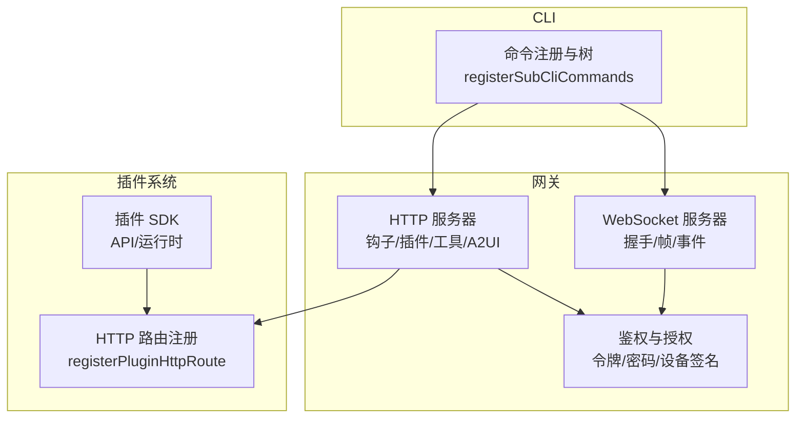
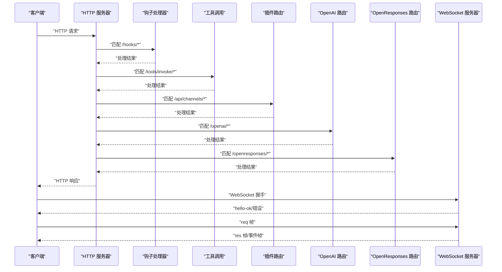
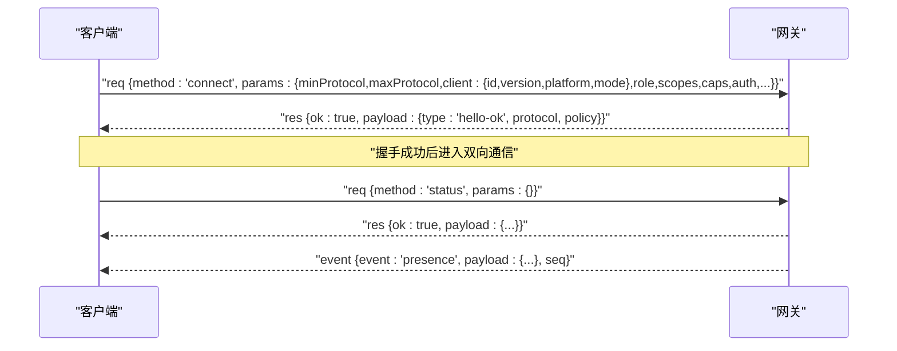
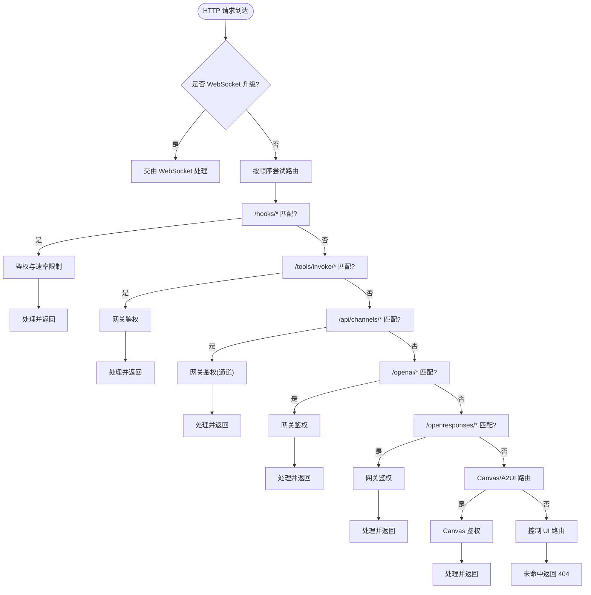
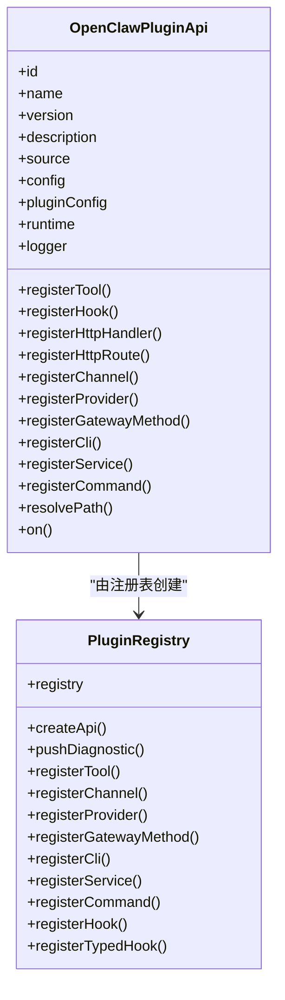
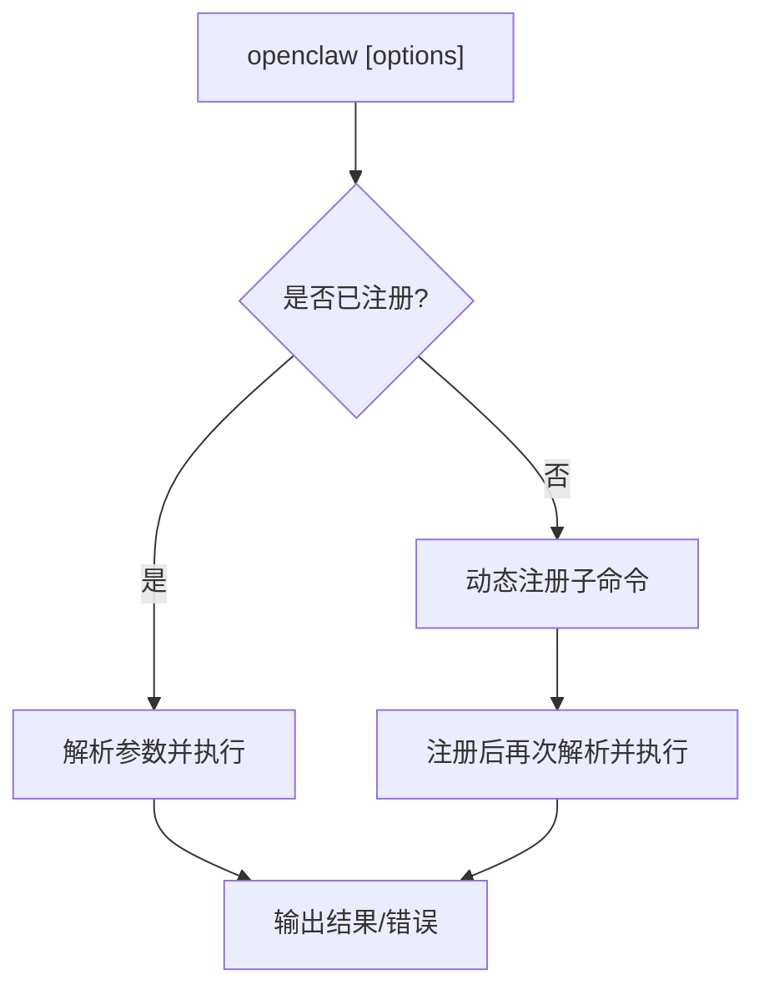
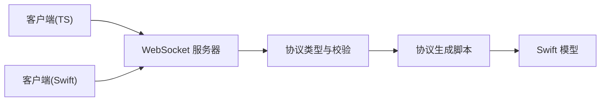

# API参考

<cite>
**本文引用的文件**
- [src/gateway/server-http.ts](file://src/gateway/server-http.ts)
- [src/gateway/server/ws-connection/message-handler.ts](file://src/gateway/server/ws-connection/message-handler.ts)
- [src/gateway/server/ws-types.ts](file://src/gateway/server/ws-types.ts)
- [src/gateway/client.ts](file://src/gateway/client.ts)
- [src/gateway/protocol/index.ts](file://src/gateway/protocol/index.ts)
- [docs/gateway/protocol.md](file://docs/gateway/protocol.md)
- [docs/gateway/authentication.md](file://docs/gateway/authentication.md)
- [src/plugins/http-registry.ts](file://src/plugins/http-registry.ts)
- [src/plugins/registry.ts](file://src/plugins/registry.ts)
- [src/cli/program/register.subclis.ts](file://src/cli/program/register.subclis.ts)
- [docs/cli/index.md](file://docs/cli/index.md)
- [scripts/protocol-gen-swift.ts](file://scripts/protocol-gen-swift.ts)
- [src/gateway/device-auth.ts](file://src/gateway/device-auth.ts)
- [scripts/dev/ios-node-e2e.ts](file://scripts/dev/ios-node-e2e.ts)
- [apps/macos/Tests/OpenClawIPCTests/GatewayProcessManagerTests.swift](file://apps/macos/Tests/OpenClawIPCTests/GatewayProcessManagerTests.swift)
- [apps/macos/Tests/OpenClawIPCTests/GatewayChannelConfigureTests.swift](file://apps/macos/Tests/OpenClawIPCTests/GatewayChannelConfigureTests.swift)
- [src/plugin-sdk/index.ts](file://src/plugin-sdk/index.ts)
- [scripts/write-plugin-sdk-entry-dts.ts](file://scripts/write-plugin-sdk-entry-dts.ts)
- [docs/refactor/plugin-sdk.md](file://docs/refactor/plugin-sdk.md)
- [docs/zh-CN/refactor/plugin-sdk.md](file://docs/zh-CN/refactor/plugin-sdk.md)
</cite>

## 目录

1. [简介](#简介)
2. [项目结构](#项目结构)
3. [核心组件](#核心组件)
4. [架构总览](#架构总览)
5. [详细组件分析](#详细组件分析)
6. [依赖关系分析](#依赖关系分析)
7. [性能考量](#性能考量)
8. [故障排查指南](#故障排查指南)
9. [结论](#结论)
10. [附录](#附录)

## 简介

本文件为 OpenClaw 的全面 API 参考，覆盖以下能力：

- WebSocket API：连接握手、帧格式、事件类型、角色与权限、设备身份与配对、TLS 与指纹校验、版本协商与错误处理。
- HTTP API：网关内置 HTTP 路由、钩子（webhook）入口、插件 HTTP 路由注册、Canvas/A2UI/工具调用等端点。
- CLI 命令参考：命令树、常用子命令、参数与选项、输出样式与颜色。
- 插件 API：SDK 暴露的运行时接口、HTTP 路由注册、钩子与通道集成、服务与命令注册。

文档同时给出协议特定示例、错误处理策略、安全考虑、速率限制与版本信息，并提供常见用例、客户端实现指南与性能优化建议。

## 项目结构

OpenClaw 的 API 主要分布在如下模块：

- 网关服务器：WebSocket 协议实现、HTTP 服务器与路由、鉴权与授权、Canvas/A2UI 支持。
- 插件系统：插件 SDK、HTTP 路由注册、运行时 API、钩子与通道集成。
- CLI：命令注册与延迟加载、命令树与选项说明。
- 文档：协议规范、认证与安全、插件 SDK 迁移与版本控制。

图示来源

- [src/gateway/server-http.ts](file://src/gateway/server-http.ts#L363-L515)
- [src/gateway/server/ws-connection/message-handler.ts](file://src/gateway/server/ws-connection/message-handler.ts#L307-L337)
- [src/plugins/http-registry.ts](file://src/plugins/http-registry.ts#L11-L52)
- [src/cli/program/register.subclis.ts](file://src/cli/program/register.subclis.ts#L244-L310)

章节来源

- [src/gateway/server-http.ts](file://src/gateway/server-http.ts#L1-L556)
- [src/gateway/server/ws-connection/message-handler.ts](file://src/gateway/server/ws-connection/message-handler.ts#L78-L108)
- [src/plugins/http-registry.ts](file://src/plugins/http-registry.ts#L1-L52)
- [src/cli/program/register.subclis.ts](file://src/cli/program/register.subclis.ts#L223-L310)

## 核心组件

- WebSocket 协议与帧格式：定义了连接握手、请求/响应帧、事件帧、序列号与状态版本字段。
- HTTP 服务器：统一处理钩子、工具调用、插件路由、Canvas/A2UI、控制 UI、OpenAI/OpenResponses 等。
- 插件 SDK：提供稳定的 API 表面，通过运行时访问核心能力，支持工具、钩子、通道、提供商、网关方法、CLI、服务与命令注册。
- CLI：命令树与延迟加载机制，支持子命令注册与参数解析。

章节来源

- [src/gateway/protocol/index.ts](file://src/gateway/protocol/index.ts#L1-L603)
- [docs/gateway/protocol.md](file://docs/gateway/protocol.md#L1-L222)
- [src/gateway/server-http.ts](file://src/gateway/server-http.ts#L363-L515)
- [src/plugin-sdk/index.ts](file://src/plugin-sdk/index.ts#L1-L392)
- [src/cli/program/register.subclis.ts](file://src/cli/program/register.subclis.ts#L244-L310)

## 架构总览

下图展示网关如何在 HTTP 层聚合多种入口，在 WebSocket 层提供统一的控制平面与节点传输。

图示来源

- [src/gateway/server-http.ts](file://src/gateway/server-http.ts#L398-L512)
- [src/gateway/server-http.ts](file://src/gateway/server-http.ts#L411-L463)

章节来源

- [src/gateway/server-http.ts](file://src/gateway/server-http.ts#L363-L515)

## 详细组件分析

### WebSocket API 规范

- 传输与帧格式
  - 文本帧，JSON 负载。
  - 请求：`{"type":"req", "id", "method", "params"}`
  - 响应：`{"type":"res", "id", "ok", "payload|error"}`
  - 事件：`{"type":"event", "event", "payload", "seq?", "stateVersion?"}`
- 握手与版本协商
  - 客户端首帧必须为 `connect` 请求，包含 `minProtocol`/`maxProtocol`、客户端元信息、角色与作用域、权限与能力声明、可选设备签名与认证信息。
  - 服务器根据协议版本范围进行匹配，不兼容时返回错误并关闭连接。
- 角色与作用域
  - `operator`：控制平面客户端（CLI/UI/自动化）。
  - `node`：能力宿主（摄像头/屏幕/画布/系统执行）。
  - operator 作用域包括只读/写入/管理/审批/配对等。
  - node 声明能力类别、命令白名单与细粒度权限。
- 设备身份与配对
  - 客户端需提供设备指纹与签名；本地连接可自动批准；非本地连接需对服务器挑战进行签名。
  - 成功配对后，服务器颁发设备令牌，客户端应持久化以便后续连接。
- TLS 与证书指纹
  - 支持 TLS；客户端可选择固定证书指纹。
- 错误处理与关闭码
  - 协议不匹配、鉴权失败、策略违规等场景会返回错误并关闭连接；关闭码提供语义提示。

图示来源

- [docs/gateway/protocol.md](file://docs/gateway/protocol.md#L22-L78)
- [src/gateway/server/ws-connection/message-handler.ts](file://src/gateway/server/ws-connection/message-handler.ts#L307-L337)
- [src/gateway/protocol/index.ts](file://src/gateway/protocol/index.ts#L153-L156)

章节来源

- [docs/gateway/protocol.md](file://docs/gateway/protocol.md#L1-L222)
- [src/gateway/server/ws-connection/message-handler.ts](file://src/gateway/server/ws-connection/message-handler.ts#L78-L108)
- [src/gateway/server/ws-connection/message-handler.ts](file://src/gateway/server/ws-connection/message-handler.ts#L307-L337)
- [src/gateway/protocol/index.ts](file://src/gateway/protocol/index.ts#L1-L603)

### HTTP API 规范

- 钩子（webhook）入口
  - 路径：`/hooks/<subpath>`
  - 方法：POST
  - 认证：必须通过 Bearer 令牌或 X-OpenClaw-Token 头；查询参数 token 不被允许。
  - 速率限制：连续鉴权失败超过阈值将触发限流，返回 Retry-After。
  - 功能：支持唤醒（wake）与代理（agent）两类动作，以及基于映射的转发。
- 工具调用
  - 路径：`/tools/invoke/*`
  - 鉴权：网关鉴权保护。
- 插件 HTTP 路由
  - 路径：`/api/channels/*`
  - 默认鉴权：网关鉴权保护；非通道插件路由由插件自身负责鉴权。
- OpenAI 兼容接口
  - 路径：`/openai/*`
  - 鉴权：网关鉴权保护。
- OpenResponses 接口
  - 路径：`/openresponses/*`
  - 鉴权：网关鉴权保护。
- Canvas/A2UI
  - 路径：`/a2ui/*`、`/canvas/*`、`/canvas_ws`
  - 鉴权：本地直连或携带有效令牌，或与已授权 WebSocket 客户端来自同一 IP。
- 控制 UI
  - 提供头像与页面渲染，路径受控。

图示来源

- [src/gateway/server-http.ts](file://src/gateway/server-http.ts#L398-L512)
- [src/gateway/server-http.ts](file://src/gateway/server-http.ts#L411-L463)

章节来源

- [src/gateway/server-http.ts](file://src/gateway/server-http.ts#L139-L361)
- [src/gateway/server-http.ts](file://src/gateway/server-http.ts#L363-L515)

### 插件 API 规范

- SDK 概述
  - 通过 `openclaw/plugin-sdk` 暴露稳定接口，插件通过 `api.runtime` 访问运行时能力，避免直接导入核心源码。
  - 版本管理：SDK 语义化版本，运行时随核心版本发布，插件声明所需运行时版本范围。
- 注册接口
  - HTTP 路由注册：`registerPluginHttpRoute`，支持路径归一化与去重。
  - 钩子注册：`registerHook`，支持事件监听与选项。
  - 通道/提供商/网关方法/CLI/服务/命令注册：对应 `registerChannel`/`registerProvider`/`registerGatewayMethod`/`registerCli`/`registerService`/`registerCommand`。
- 类型与工具
  - 提供通道适配器、消息动作、配置模式、工具策略、媒体限制、位置解析、提及门控、打字指示、会话记录等类型与工具函数。
- 迁移与兼容
  - 分阶段迁移：引入 SDK + 运行时桥接，逐步替换各扩展中的桥接代码，最终禁止 `extensions/**` 从 `src/**` 导入。

图示来源

- [src/plugins/registry.ts](file://src/plugins/registry.ts#L468-L515)
- [src/plugin-sdk/index.ts](file://src/plugin-sdk/index.ts#L61-L78)

章节来源

- [src/plugin-sdk/index.ts](file://src/plugin-sdk/index.ts#L1-L392)
- [src/plugins/registry.ts](file://src/plugins/registry.ts#L468-L515)
- [docs/refactor/plugin-sdk.md](file://docs/refactor/plugin-sdk.md#L147-L192)
- [docs/zh-CN/refactor/plugin-sdk.md](file://docs/zh-CN/refactor/plugin-sdk.md#L42-L222)

### CLI 命令参考

- 命令树与子命令
  - 支持 setup、onboard、configure、config、doctor、dashboard、reset、uninstall、update、message、agent、agents、acp、status、health、sessions、gateway、logs、system、models、memory、nodes、devices、node、approvals、sandbox、tui、browser、cron、dns、docs、hooks、webhooks、pairing、plugins、channels、security、skills、voicecall 等。
- 子命令注册机制
  - 采用延迟加载：首次调用时动态注册，减少启动开销。
  - 支持按名称注册与参数透传。
- 输出样式
  - TTY 下启用 ANSI 颜色与超链接；支持 `--json`、`--plain`、`--no-color` 等选项。
- 网关相关命令
  - `gateway call`、`gateway health`、`gateway status`、`gateway probe`、`gateway discover`、`gateway install|uninstall|start|stop|restart`、`gateway run` 等。
- 安全审计
  - `security audit` 支持深度探测与自动修复。

图示来源

- [src/cli/program/register.subclis.ts](file://src/cli/program/register.subclis.ts#L256-L310)
- [docs/cli/index.md](file://docs/cli/index.md#L1-L800)

章节来源

- [src/cli/program/register.subclis.ts](file://src/cli/program/register.subclis.ts#L223-L310)
- [docs/cli/index.md](file://docs/cli/index.md#L1-L800)

## 依赖关系分析

- WebSocket 客户端类型与连接上下文
  - 客户端通过 `GatewayWsClient` 维护连接参数、连接 ID、存在性键与客户端 IP。
- 设备鉴权与令牌
  - 通过 `buildDeviceAuthPayload` 生成设备签名载荷，支持 v1/v2 版本与可选 nonce。
- 协议生成与 Swift 客户端
  - 通过脚本从协议 Schema 生成 Swift 模型与枚举，确保跨语言一致性。

图示来源

- [src/gateway/server/ws-types.ts](file://src/gateway/server/ws-types.ts#L4-L10)
- [src/gateway/device-auth.ts](file://src/gateway/device-auth.ts#L13-L31)
- [scripts/protocol-gen-swift.ts](file://scripts/protocol-gen-swift.ts#L200-L244)

章节来源

- [src/gateway/server/ws-types.ts](file://src/gateway/server/ws-types.ts#L1-L10)
- [src/gateway/device-auth.ts](file://src/gateway/device-auth.ts#L1-L31)
- [scripts/protocol-gen-swift.ts](file://scripts/protocol-gen-swift.ts#L200-L244)

## 性能考量

- WebSocket
  - 合理设置 `policy.tickIntervalMs`，避免频繁心跳。
  - 使用事件序列号与状态版本进行增量同步，减少冗余数据。
  - 控制缓冲区大小与最大负载，防止内存压力。
- HTTP
  - 钩子入口启用速率限制与鉴权失败窗口计数，避免暴力破解。
  - 插件路由按需鉴权，通道类路由默认网关鉴权，其他路由由插件自行处理。
- CLI
  - 延迟注册减少启动时间；批量操作时合并请求，降低往返次数。
- 插件
  - 通过运行时访问核心能力，避免重复实现；使用 SDK 稳定接口，减少升级成本。

[本节为通用指导，无需列出具体文件来源]

## 故障排查指南

- WebSocket 连接失败
  - 协议不匹配：检查客户端 `minProtocol`/`maxProtocol` 与服务器期望版本。
  - 鉴权失败：确认 `connect.params.auth.token` 与服务端配置一致；若为设备令牌，需持久化并在后续连接中使用。
  - 设备签名问题：非本地连接需对挑战 nonce 进行签名。
- HTTP 钩子 401/429
  - 确认使用 Bearer 令牌或 X-OpenClaw-Token 头；不要通过查询参数传递 token。
  - 遵守速率限制，等待 `Retry-After` 后重试。
- 插件 HTTP 路由冲突
  - 路径重复注册会被忽略并记录日志；请检查路径归一化与唯一性。
- CLI 无法连接网关
  - 使用 `gateway status` 检查服务状态与探测目标 URL；必要时显式提供 `--url`、`--token` 或 `--password`。

章节来源

- [src/gateway/server/ws-connection/message-handler.ts](file://src/gateway/server/ws-connection/message-handler.ts#L78-L108)
- [src/gateway/server-http.ts](file://src/gateway/server-http.ts#L156-L177)
- [src/plugins/http-registry.ts](file://src/plugins/http-registry.ts#L25-L36)
- [docs/cli/index.md](file://docs/cli/index.md#L652-L744)

## 结论

OpenClaw 提供统一且强大的 API 平台：WebSocket 作为控制平面与节点传输，HTTP 提供灵活的钩子与插件扩展，CLI 与插件 SDK 支撑生态系统的可维护性与演进。遵循本文档的协议、认证、速率限制与版本策略，可构建稳定、安全与高性能的客户端与插件。

[本节为总结性内容，无需列出具体文件来源]

## 附录

- 安全与认证
  - 网关支持令牌与密码两种认证方式；推荐使用令牌并通过环境变量或守护进程配置存储。
  - 设备配对与签名增强非本地连接的安全性。
- 版本与兼容
  - 协议版本在核心定义；客户端需声明协议范围并与服务器兼容。
  - 插件 SDK 与运行时采用语义化版本，插件声明所需运行时版本范围。
- 客户端实现要点
  - WebSocket：严格遵守帧格式与握手流程；处理错误与关闭码；实现设备签名与令牌持久化。
  - HTTP：遵循钩子与插件路由的鉴权与速率限制；正确处理 Canvas/A2UI 与控制 UI 路由。
  - 插件：通过 SDK 与运行时访问核心能力；注册钩子、通道与 HTTP 路由；遵循迁移计划与兼容性检查。

章节来源

- [docs/gateway/authentication.md](file://docs/gateway/authentication.md#L1-L146)
- [docs/gateway/protocol.md](file://docs/gateway/protocol.md#L178-L222)
- [docs/refactor/plugin-sdk.md](file://docs/refactor/plugin-sdk.md#L188-L199)
- [docs/zh-CN/refactor/plugin-sdk.md](file://docs/zh-CN/refactor/plugin-sdk.md#L195-L219)
