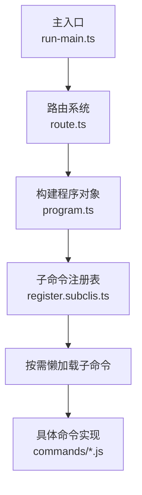
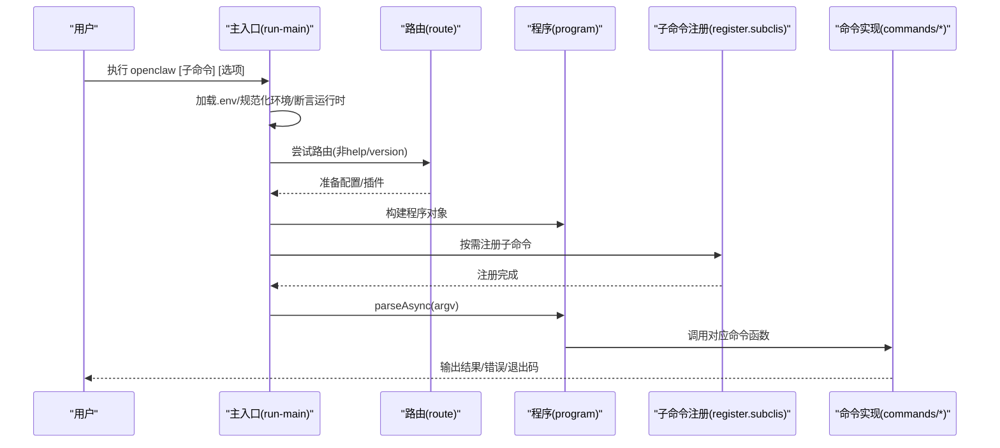
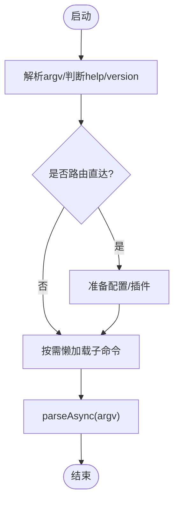

# CLI命令参考

<cite>
**本文档引用的文件**
- [src/cli/run-main.ts](file://src/cli/run-main.ts)
- [src/cli/route.ts](file://src/cli/route.ts)
- [src/cli/program/register.subclis.ts](file://src/cli/program/register.subclis.ts)
- [src/cli/program/register.configure.ts](file://src/cli/program/register.configure.ts)
- [src/cli/program/register.setup.ts](file://src/cli/program/register.setup.ts)
- [src/cli/program/register.status-health-sessions.ts](file://src/cli/program/register.status-health-sessions.ts)
- [src/cli/program/register.maintenance.ts](file://src/cli/program/register.maintenance.ts)
- [src/cli/program/register.agent.ts](file://src/cli/program/register.agent.ts)
- [src/cli/program/register.message.ts](file://src/cli/program/register.message.ts)
- [src/cli/config-cli.ts](file://src/cli/config-cli.ts)
- [src/cli/gateway-cli/register.ts](file://src/cli/gateway-cli/register.ts)
- [src/commands/doctor.ts](file://src/commands/doctor.ts)
- [src/commands/health.js](file://src/commands/health.js)
- [src/commands/status.js](file://src/commands/status.js)
- [src/commands/sessions.js](file://src/commands/sessions.js)
- [src/commands/configure.js](file://src/commands/configure.js)
- [src/commands/onboard.js](file://src/commands/onboard.js)
- [src/commands/setup.js](file://src/commands/setup.js)
- [src/commands/dashboard.js](file://src/commands/dashboard.js)
- [src/commands/reset.js](file://src/commands/reset.js)
- [src/commands/uninstall.js](file://src/commands/uninstall.js)
- [src/commands/agent-via-gateway.js](file://src/commands/agent-via-gateway.js)
- [src/commands/agents.js](file://src/commands/agents.js)
- [src/commands/doctor-auth.js](file://src/commands/doctor-auth.js)
- [src/commands/doctor-gateway-health.js](file://src/commands/doctor-gateway-health.js)
- [src/commands/doctor-gateway-services.js](file://src/commands/doctor-gateway-services.js)
- [src/commands/doctor-install.js](file://src/commands/doctor-install.js)
- [src/commands/doctor-platform-notes.js](file://src/commands/doctor-platform-notes.js)
- [src/commands/doctor-security.js](file://src/commands/doctor-security.js)
- [src/commands/doctor-state-integrity.js](file://src/commands/doctor-state-integrity.js)
- [src/commands/doctor-state-migrations.js](file://src/commands/doctor-state-migrations.js)
- [src/commands/doctor-ui.js](file://src/commands/doctor-ui.js)
- [src/commands/doctor-update.js](file://src/commands/doctor-update.js)
- [src/commands/doctor-workspace-status.js](file://src/commands/doctor-workspace-status.js)
- [src/commands/doctor-workspace.js](file://src/commands/doctor-workspace.js)
- [src/commands/doctor-completion.js](file://src/commands/doctor-completion.js)
- [src/commands/doctor-gateway-daemon-flow.js](file://src/commands/doctor-gateway-daemon-flow.js)
- [src/commands/doctor-prompter.ts](file://src/commands/doctor-prompter.ts)
- [src/commands/doctor-sandbox.js](file://src/commands/doctor-sandbox.js)
- [src/commands/doctor-config-flow.js](file://src/commands/doctor-config-flow.js)
- [src/commands/doctor-format.ts](file://src/commands/doctor-format.ts)
- [src/commands/doctor-legacy-config.js](file://src/commands/doctor-legacy-config.js)
- [src/commands/doctor-legacy-config.test.ts](file://src/commands/doctor-legacy-config.test.ts)
- [src/commands/doctor-platform-notes.launchctl-env-overrides.test.ts](file://src/commands/doctor-platform-notes.launchctl-env-overrides.test.ts)
- [src/commands/doctor-prompter.ts](file://src/commands/doctor-prompter.ts)
- [src/commands/doctor-sandbox.ts](file://src/commands/doctor-sandbox.ts)
- [src/commands/doctor-security.test.ts](file://src/commands/doctor-security.test.ts)
- [src/commands/doctor-security.ts](file://src/commands/doctor-security.ts)
- [src/commands/doctor-state-integrity.js](file://src/commands/doctor-state-integrity.js)
- [src/commands/doctor-state-migrations.js](file://src/commands/doctor-state-migrations.js)
- [src/commands/doctor-ui.js](file://src/commands/doctor-ui.js)
- [src/commands/doctor-update.js](file://src/commands/doctor-update.js)
- [src/commands/doctor-workspace-status.js](file://src/commands/doctor-workspace-status.js)
- [src/commands/doctor-workspace.js](file://src/commands/doctor-workspace.js)
- [src/commands/doctor-completion.js](file://src/commands/doctor-completion.js)
- [src/commands/doctor-gateway-daemon-flow.js](file://src/commands/doctor-gateway-daemon-flow.js)
- [src/commands/doctor-config-flow.js](file://src/commands/doctor-config-flow.js)
- [src/commands/doctor-format.ts](file://src/commands/doctor-format.ts)
- [src/commands/doctor-legacy-config.js](file://src/commands/doctor-legacy-config.js)
- [src/commands/doctor-legacy-config.test.ts](file://src/commands/doctor-legacy-config.test.ts)
- [src/commands/doctor-platform-notes.launchctl-env-overrides.test.ts](file://src/commands/doctor-platform-notes.launchctl-env-overrides.test.ts)
- [src/commands/doctor-prompter.ts](file://src/commands/doctor-prompter.ts)
- [src/commands/doctor-sandbox.ts](file://src/commands/doctor-sandbox.ts)
- [src/commands/doctor-security.test.ts](file://src/commands/doctor-security.test.ts)
- [src/commands/doctor-security.ts](file://src/commands/doctor-security.ts)
- [src/commands/doctor-state-integrity.js](file://src/commands/doctor-state-integrity.js)
- [src/commands/doctor-state-migrations.js](file://src/commands/doctor-state-migrations.js)
- [src/commands/doctor-ui.js](file://src/commands/doctor-ui.js)
- [src/commands/doctor-update.js](file://src/commands/doctor-update.js)
- [src/commands/doctor-workspace-status.js](file://src/commands/doctor-workspace-status.js)
- [src/commands/doctor-workspace.js](file://src/commands/doctor-workspace.js)
- [src/commands/doctor-completion.js](file://src/commands/doctor-completion.js)
- [src/commands/doctor-gateway-daemon-flow.js](file://src/commands/doctor-gateway-daemon-flow.js)
- [src/commands/doctor-config-flow.js](file://src/commands/doctor-config-flow.js)
- [src/commands/doctor-format.ts](file://src/commands/doctor-format.ts)
- [src/commands/doctor-legacy-config.js](file://src/commands/doctor-legacy-config.js)
- [src/commands/doctor-legacy-config.test.ts](file://src/commands/doctor-legacy-config.test.ts)
- [src/commands/doctor-platform-notes.launchctl-env-overrides.test.ts](file://src/commands/doctor-platform-notes.launchctl-env-overrides.test.ts)
- [src/commands/doctor-prompter.ts](file://src/commands/doctor-prompter.ts)
- [src/commands/doctor-sandbox.ts](file://src/commands/doctor-sandbox.ts)
- [src/commands/doctor-security.test.ts](file://src/commands/doctor-security.test.ts)
- [src/commands/doctor-security.ts](file://src/commands/doctor-security.ts)
- [src/commands/doctor-state-integrity.js](file://src/commands/doctor-state-integrity.js)
- [src/commands/doctor-state-migrations.js](file://src/commands/doctor-state-migrations.js)
- [src/commands/doctor-ui.js](file://src/commands/doctor-ui.js)
- [src/commands/doctor-update.js](file://src/commands/doctor-update.js)
- [src/commands/doctor-workspace-status.js](file://src/commands/doctor-workspace-status.js)
- [src/commands/doctor-workspace.js](file://src/commands/doctor-workspace.js)
- [src/commands/doctor-completion.js](file://src/commands/doctor-completion.js)
- [src/commands/doctor-gateway-daemon-flow.js](file://src/commands/doctor-gateway-daemon-flow.js)
- [src/commands/doctor-config-flow.js](file://src/commands/doctor-config-flow.js)
- [src/commands/doctor-format.ts](file://src/commands/doctor-format.ts)
- [src/commands/doctor-legacy-config.js](file://src/commands/doctor-legacy-config.js)
- [src/commands/doctor-legacy-config.test.ts](file://src/commands/doctor-legacy-config.test.ts)
- [src/commands/doctor-platform-notes.launchctl-env-overrides.test.ts](file://src/commands/doctor-platform-notes.launchctl-env-overrides.test.ts)
- [src/commands/doctor-prompter.ts](file://src/commands/doctor-prompter.ts)
- [src/commands/doctor-sandbox.ts](file://src/commands/doctor-sandbox.ts)
- [src/commands/doctor-security.test.ts](file://src/commands/doctor-security.test.ts)
- [src/commands/doctor-security.ts](file://src/commands/doctor-security.ts)
- [src/commands/doctor-state-integrity.js](file://src/commands/doctor-state-integrity.js)
- [src/commands/doctor-state-migrations.js](file://src/commands/doctor-state-migrations.js)
- [src/commands/doctor-ui.js](file://src/commands/doctor-ui.js)
- [src/commands/doctor-update.js](file://src/commands/doctor-update.js)
- [src/commands/doctor-workspace-status.js](file://src/commands/doctor-workspace-status.js)
- [src/commands/doctor-workspace.js](file://src/commands/doctor-workspace.js)
- [src/commands/doctor-completion.js](file://src/commands/doctor-completion.js)
- [src/commands/doctor-gateway-daemon-flow.js](file://src/commands/doctor-gateway-daemon-flow.js)
- [src/commands/doctor-config-flow.js](file://src/commands/doctor-config-flow.js)
- [src/commands/doctor-format.ts](file://src/commands/doctor-format.ts)
- [src/commands/doctor-legacy-config.js](file://src/commands/doctor-legacy-config.js)
- [src/commands/doctor-legacy-config.test.ts](file://src/commands/doctor-legacy-config.test.ts)
- [src/commands/doctor-platform-notes.launchctl-env-overrides.test.ts](file://src/commands/doctor-platform-notes.launchctl-env-overrides.test.ts)
- [src/commands/doctor-prompter.ts](file://src/commands/doctor-prompter.ts)
- [src/commands/doctor-sandbox.ts](file://src/commands/doctor-sandbox.ts)
- [src/commands/doctor-security.test.ts](file://src/commands/doctor-security.test.ts)
- [src/commands/doctor-security.ts](file://src/commands/doctor-security.ts)
- [src/commands/doctor-state-integrity.js](file://src/commands/doctor-state-integrity.js)
- [src/commands/doctor-state-migrations.js](file://src/commands/doctor-state-migrations.js)
- [src/commands/doctor-ui.js](file://src/commands/doctor-ui.js)
- [src/commands/doctor-update.js](file://src/commands/doctor-update.js)
- [src/commands/doctor-workspace-status.js](file://src/commands/doctor-workspace-status.js)
- [src/commands/doctor-workspace.js](file://src/commands/doctor-workspace.js)
- [src/commands/doctor-completion.js](file://src/commands/doctor-completion.js)
- [src/commands/doctor-gateway-daemon-flow.js](file://src/commands/doctor-gateway-daemon-flow.js)
- [src/commands/doctor-config-flow.js](file://src/commands/doctor-config-flow.js)
- [src/commands/doctor-format.ts](file://src/commands/doctor-format.ts)
- [src/commands/doctor-legacy-config.js](file://src/commands/doctor-legacy-config.js)
- [src/commands/doctor-legacy-config.test.ts](file://src/commands/doctor-legacy-config.test.ts)
- [src/commands/doctor-platform-notes.launchctl-env-overrides.test.ts](file://src/commands/doctor-platform-notes.launchctl-env-overrides.test.ts)
- [src/commands/doctor-prompter.ts](file://src/commands/doctor-prompter.ts)
- [src/commands/doctor-sandbox.ts](file://src/commands/doctor-sandbox.ts)
- [src/commands/doctor-security.test.ts](file://src/commands/doctor-security.test.ts)
- [src/commands/doctor-security.ts](file://src/commands/doctor-security.ts)
- [src/commands/doctor-state-integrity.js](file://src/commands/doctor-state-integrity.js)
- [src/commands/doctor-state-migrations.js](file://src/commands/doctor-state-migrations.js)
- [src/commands/doctor-ui.js](file://src/commands/doctor-ui.js)
- [src/commands/doctor-update.js](file://src/commands/doctor-update.js)
- [src/commands/doctor-workspace-status.js](file://src/commands/doctor-workspace-status.js)
- [src/commands/doctor-workspace.js](file://src/commands/doctor-workspace.js)
- [src/commands/doctor-completion.js](file://src/commands/doctor-completion.js)
- [src/commands/doctor-gateway-daemon-flow.js](file://src/commands/doctor-gateway-daemon-flow.js)
- [......]
</cite>

## 目录

1. [简介](#简介)
2. [项目结构](#项目结构)
3. [核心组件](#核心组件)
4. [架构总览](#架构总览)
5. [详细组件分析](#详细组件分析)
6. [依赖关系分析](#依赖关系分析)
7. [性能与输出格式](#性能与输出格式)
8. [故障排除指南](#故障排除指南)
9. [结论](#结论)
10. [附录：命令与选项速查](#附录命令与选项速查)

## 简介

本参考文档面向OpenClaw CLI用户，系统梳理所有可用命令、子命令、参数选项与行为规范，覆盖swabble doctor、configure、gateway、status等常用命令，并补充配置文件参数、环境变量、输出格式、错误处理与故障排除建议。文档同时给出命令组合使用示例与最佳实践，帮助快速定位问题并高效运维。

## 项目结构

OpenClaw CLI采用“主程序 + 子命令注册器”的模块化设计：

- 主入口负责加载环境、解析路由、准备运行时与插件注册，随后按需懒加载子命令。
- 子命令注册器集中定义各子命令的描述、选项与动作处理器。
- 路由系统支持“路径式”直接调用（如 openclaw gateway status），并在必要时自动准备配置与插件。

图表来源

- [src/cli/run-main.ts](file://src/cli/run-main.ts#L27-L72)
- [src/cli/route.ts](file://src/cli/route.ts#L22-L40)
- [src/cli/program/register.subclis.ts](file://src/cli/program/register.subclis.ts#L292-L310)

章节来源

- [src/cli/run-main.ts](file://src/cli/run-main.ts#L27-L72)
- [src/cli/route.ts](file://src/cli/route.ts#L10-L40)
- [src/cli/program/register.subclis.ts](file://src/cli/program/register.subclis.ts#L15-L31)

## 核心组件

- 主入口与运行时
  - 加载 .env、规范化环境变量、确保CLI在PATH中、断言运行时版本、安装未捕获异常处理器。
  - 解析路由、准备配置与插件、按需注册子命令并执行parseAsync。
- 路由系统
  - 支持“路径式”命令（如 gateway status）直接执行；在非帮助/版本场景下准备配置与插件。
- 子命令注册器
  - 统一管理所有子命令的注册逻辑，支持延迟加载以提升启动性能。
- 命令实现
  - 各命令通过对应模块导出的函数实现业务逻辑，统一使用默认运行时输出日志、错误与退出码。

章节来源

- [src/cli/run-main.ts](file://src/cli/run-main.ts#L27-L72)
- [src/cli/route.ts](file://src/cli/route.ts#L22-L40)
- [src/cli/program/register.subclis.ts](file://src/cli/program/register.subclis.ts#L292-L310)

## 架构总览

下面的序列图展示一次典型命令执行流程：从主入口到子命令注册再到命令实现。

图表来源

- [src/cli/run-main.ts](file://src/cli/run-main.ts#L27-L72)
- [src/cli/route.ts](file://src/cli/route.ts#L22-L40)
- [src/cli/program/register.subclis.ts](file://src/cli/program/register.subclis.ts#L292-L310)

## 详细组件分析

### doctor 命令

- 功能概述
  - 运行健康检查与快速修复，涵盖网关、通道、沙箱、安全、工作区状态、模型引用校验、系统服务等。
  - 支持交互式确认与非交互模式，可生成网关令牌、迁移旧状态、修复服务配置等。
- 常用选项
  - --no-workspace-suggestions：禁用工作区内存系统建议
  - --yes：接受默认，不提示
  - --repair/--fix：应用推荐修复（二者等价）
  - --force：强制修复（可能覆盖自定义服务配置）
  - --non-interactive：非交互模式（仅安全迁移）
  - --generate-gateway-token：生成并配置网关令牌
  - --deep：扫描系统服务中的额外网关实例
- 使用场景
  - 首次部署后健康巡检
  - 网关无法连接或认证失败时的诊断
  - 发现并修复配置与环境问题
- 输出与错误
  - 以结构化日志输出各项检查结果与建议；当配置无效时会列出具体问题路径与信息。
- 示例
  - openclaw doctor --repair
  - openclaw doctor --non-interactive --force
  - openclaw doctor --generate-gateway-token

章节来源

- [src/cli/program/register.maintenance.ts](file://src/cli/program/register.maintenance.ts#L13-L40)
- [src/commands/doctor.ts](file://src/commands/doctor.ts#L65-L314)

### configure 命令

- 功能概述
  - 交互式向导设置凭据、设备与代理默认值；支持指定部分章节进行定向配置。
- 常用选项
  - --section <section>：重复使用，限定配置章节（如 credentials、devices、agents 等）
- 使用场景
  - 初始安装后的配置引导
  - 针对特定模块（如设备、渠道）的增量配置
- 输出与错误
  - 成功后更新配置文件；若输入无效章节，会提示期望的章节列表并退出。
- 示例
  - openclaw configure
  - openclaw configure --section devices
  - openclaw configure --section credentials --section agents

章节来源

- [src/cli/program/register.configure.ts](file://src/cli/program/register.configure.ts#L12-L51)
- [src/commands/configure.js](file://src/commands/configure.js)

### setup 命令

- 功能概述
  - 初始化用户目录下的配置与代理工作区；支持交互式向导或非交互模式。
- 常用选项
  - --workspace <dir>：指定代理工作区目录
  - --wizard/--non-interactive：启用向导或非交互模式
  - --mode <local|remote>：向导模式
  - --remote-url/--remote-token：远程网关地址与令牌
- 使用场景
  - 新环境首次初始化
  - 自动化部署中的预置步骤
- 示例
  - openclaw setup
  - openclaw setup --wizard --mode local
  - openclaw setup --non-interactive --workspace ~/.openclaw/workspace

章节来源

- [src/cli/program/register.setup.ts](file://src/cli/program/register.setup.ts#L10-L53)
- [src/commands/setup.js](file://src/commands/setup.js)
- [src/commands/onboard.js](file://src/commands/onboard.js)

### gateway 命令族

- 功能概述
  - 管理与控制WebSocket网关服务，包括运行、状态查询、安装/卸载/启动/停止/重启、RPC调用、健康检查、用量统计、探测与发现等。
- 子命令与常用选项
  - gateway run：前台运行网关
  - gateway status：显示服务状态并探测网关
    - --url/--token/--password：覆盖连接参数
    - --timeout：超时毫秒数
    - --no-probe：跳过RPC探测
    - --deep：扫描系统级服务
    - --json：机器可读输出
  - gateway install/uninstall/start/stop/restart：服务生命周期管理
    - --port/--runtime/--token/--force/--json
  - gateway call：调用网关方法
    - --params <json>：方法参数（JSON字符串）
    - --json：输出JSON
  - gateway usage-cost：获取会话日志用量汇总
    - --days：天数
  - gateway health：获取网关健康状态
    - --json/--timeout/--verbose/--debug
  - gateway probe/discover：探测可达性、发现网关
    - --url/--ssh/--ssh-identity/--ssh-auto/--token/--password/--timeout/--json
- 使用场景
  - 网关服务管理与监控
  - 远程/本地网关连通性诊断
  - 获取用量与健康指标
- 输出与错误
  - 默认人类可读文本；--json输出JSON；错误时打印错误信息并返回非零退出码。
- 示例
  - openclaw gateway status --deep
  - openclaw gateway call health --json
  - openclaw gateway usage-cost --days 7
  - openclaw gateway probe --ssh user@host --ssh-auto

章节来源

- [src/cli/gateway-cli/register.ts](file://src/cli/gateway-cli/register.ts#L121-L360)

### status/health/sessions 命令

- 功能概述
  - status：显示渠道健康与最近会话收件人摘要；支持深度探测与用量快照。
  - health：从运行中的网关获取健康状态。
  - sessions：列出存储的对话会话。
- 常用选项
  - status：--json/--all/--usage/--deep/--timeout/--verbose/--debug
  - health：--json/--timeout/--verbose/--debug
  - sessions：--json/--store <path>/--active <minutes>
- 使用场景
  - 日常运维巡检
  - 故障定位与会话审计
- 示例
  - openclaw status --usage
  - openclaw health --timeout 5000
  - openclaw sessions --active 120

章节来源

- [src/cli/program/register.status-health-sessions.ts](file://src/cli/program/register.status-health-sessions.ts#L27-L146)
- [src/commands/status.js](file://src/commands/status.js)
- [src/commands/health.js](file://src/commands/health.js)
- [src/commands/sessions.js](file://src/commands/sessions.js)

### config 命令族

- 功能概述
  - 提供配置读取、设置、删除与向导式配置入口；支持点号与方括号路径语法。
- 子命令与常用选项
  - config：无子命令时进入向导；--section 可限定章节
  - config get <path> [--json]：按路径读取值
  - config set <path> <value> [--json]：按路径写入值（JSON5或原始字符串）
  - config unset <path>：按路径删除键
- 使用场景
  - 快速读取/修改配置项
  - 自动化脚本中的配置维护
- 输出与错误
  - get/set/unset均支持--json；路径不存在或值解析失败时输出错误并退出。
- 示例
  - openclaw config get gateway.mode
  - openclaw config set gateway.auth.token "xxx"
  - openclaw config unset channels.telegram

章节来源

- [src/cli/config-cli.ts](file://src/cli/config-cli.ts#L218-L351)

### agent/agents 命令

- 功能概述
  - agent：通过网关运行一次代理回合；支持本地嵌入模式与交付回执。
  - agents：管理独立代理（工作区、认证、路由绑定）。
- 常用选项（agent）
  - -m/--message <text>：消息正文（必填）
  - -t/--to <number>：收件人（E.164）
  - --session-id/--agent/--thinking/--verbose/--channel/--reply-\*/--local/--deliver/--json/--timeout
- 常用选项（agents）
  - list：--json/--bindings
  - add：--workspace/--model/--agent-dir/--bind/--non-interactive/--json
  - set-identity：--agent/--workspace/--identity-file/--from-identity/--name/--theme/--emoji/--avatar/--json
  - delete：--force/--json
- 使用场景
  - 快速发起一次代理对话
  - 多代理隔离与身份管理
- 示例
  - openclaw agent -m "状态更新" -t +15555550123
  - openclaw agents add ops --workspace ~/w/ops
  - openclaw agents set-identity --agent main --emoji "🦞"

章节来源

- [src/cli/program/register.agent.ts](file://src/cli/program/register.agent.ts#L20-L214)
- [src/commands/agent-via-gateway.js](file://src/commands/agent-via-gateway.js)
- [src/commands/agents.js](file://src/commands/agents.js)

### message 命令族

- 功能概述
  - 发送消息与频道操作，包括发送、广播、投票、反应、读取/编辑/删除、置顶、权限搜索、线程、表情包与管理员操作等。
- 使用场景
  - 快速发送消息与媒体
  - 在不同渠道批量广播
  - 管理频道互动与内容
- 示例
  - openclaw message send --target +15555550123 --message "Hi"
  - openclaw message poll --channel discord --target channel:123 --poll-question "Snack?" --poll-option Pizza
  - openclaw message react --channel discord --target 123 --message-id 456 --emoji "✅"

章节来源

- [src/cli/program/register.message.ts](file://src/cli/program/register.message.ts#L24-L68)

### dashboard/reset/uninstall 命令

- dashboard：打开控制界面（可选择不自动打开浏览器）
- reset：重置本地配置/状态（可指定作用域与非交互）
- uninstall：卸载网关服务与本地数据（可指定范围与非交互）
- 常用选项
  - dashboard：--no-open
  - reset：--scope/--yes/--non-interactive/--dry-run
  - uninstall：--service/--state/--workspace/--app/--all/--yes/--non-interactive/--dry-run
- 使用场景
  - 快速恢复到干净状态
  - 完全移除安装与数据

章节来源

- [src/cli/program/register.maintenance.ts](file://src/cli/program/register.maintenance.ts#L42-L112)
- [src/commands/dashboard.js](file://src/commands/dashboard.js)
- [src/commands/reset.js](file://src/commands/reset.js)
- [src/commands/uninstall.js](file://src/commands/uninstall.js)

## 依赖关系分析

- 懒加载机制
  - 主入口根据主命令决定是否仅注册该子命令，其余子命令以占位符形式存在，首次调用时再动态导入并替换。
- 插件注册时机
  - 在非帮助/版本且非路由直达场景下，先注册插件CLI命令，再解析参数。
- 错误处理
  - 全局安装未捕获异常处理器，保证崩溃前有日志输出并优雅退出。

图表来源

- [src/cli/run-main.ts](file://src/cli/run-main.ts#L27-L72)
- [src/cli/route.ts](file://src/cli/route.ts#L22-L40)
- [src/cli/program/register.subclis.ts](file://src/cli/program/register.subclis.ts#L292-L310)

章节来源

- [src/cli/run-main.ts](file://src/cli/run-main.ts#L27-L72)
- [src/cli/route.ts](file://src/cli/route.ts#L22-L40)
- [src/cli/program/register.subclis.ts](file://src/cli/program/register.subclis.ts#L15-L31)

## 性能与输出格式

- 启动性能
  - 通过延迟加载减少初始开销；仅在需要时导入子命令模块。
- 输出格式
  - 默认人类可读文本；多数命令支持 --json 输出机器可读JSON。
  - 部分命令（如 gateway status/health）支持富文本颜色输出（取决于终端能力）。
- 超时与并发
  - 探测类命令（status、gateway probe/discover）支持超时配置，避免长时间阻塞。
- 最佳实践
  - 在CI/自动化中优先使用 --json 与明确超时，便于解析与稳定性保障。

[本节为通用指导，无需特定文件来源]

## 故障排除指南

- 常见问题与诊断
  - doctor：运行健康检查与修复，自动检测并提示配置问题、网关连通性、平台环境差异与安全风险。
  - gateway health/status：检查网关健康与响应时间，辅助定位网络/认证问题。
  - gateway probe/discover：探测本地与广域网关，识别可达性与端口问题。
  - config get：确认关键配置项（如 gateway.mode、gateway.auth）是否正确。
- 调试选项
  - --verbose/--debug：开启详细日志输出。
  - --json：便于脚本解析与二次处理。
  - --timeout：针对探测/健康检查设置合理超时。
- 建议流程
  - openclaw doctor --repair
  - openclaw gateway health --json
  - openclaw gateway probe --ssh user@host
  - openclaw status --usage

章节来源

- [src/cli/program/register.maintenance.ts](file://src/cli/program/register.maintenance.ts#L13-L40)
- [src/cli/program/register.status-health-sessions.ts](file://src/cli/program/register.status-health-sessions.ts#L27-L146)
- [src/cli/gateway-cli/register.ts](file://src/cli/gateway-cli/register.ts#L121-L360)
- [src/commands/doctor.ts](file://src/commands/doctor.ts#L65-L314)

## 结论

OpenClaw CLI通过清晰的子命令体系、灵活的懒加载与路由机制，提供了从安装配置、网关管理到日常运维与故障排查的完整工具链。建议在生产环境中结合 --json 与明确超时策略，配合 doctor 与 gateway 探测命令，形成标准化的巡检与排障流程。

[本节为总结，无需特定文件来源]

## 附录：命令与选项速查

- doctor
  - 选项：--no-workspace-suggestions/--yes/--repair/--fix/--force/--non-interactive/--generate-gateway-token/--deep
- configure
  - 选项：--section <section>（可重复）
- setup
  - 选项：--workspace/--wizard/--non-interactive/--mode/--remote-url/--remote-token
- gateway
  - 子命令：run/status/install/uninstall/start/stop/restart/call/usage-cost/health/probe/discover
  - 通用：--json/--timeout；call/usage-cost/health/probe/discover各有专属选项
- status/health/sessions
  - status：--json/--all/--usage/--deep/--timeout/--verbose/--debug
  - health：--json/--timeout/--verbose/--debug
  - sessions：--json/--store/--active
- config
  - config/get：--json
  - config/set：--json
  - config/unset：无专属选项
- agent/agents
  - agent：-m/--to/--session-id/--agent/--thinking/--verbose/--channel/--reply-\*/--local/--deliver/--json/--timeout
  - agents：list/add/set-identity/delete（含 --json、--bindings、--workspace、--model、--agent-dir、--bind、--non-interactive、--force 等）
- message
  - send/broadcast/poll/react/read-edit-delete/pin/permissions/search/thread/emoji/sticker/discord-admin 等子命令
- dashboard/reset/uninstall
  - dashboard：--no-open
  - reset：--scope/--yes/--non-interactive/--dry-run
  - uninstall：--service/--state/--workspace/--app/--all/--yes/--non-interactive/--dry-run

[本节为汇总，无需特定文件来源]
