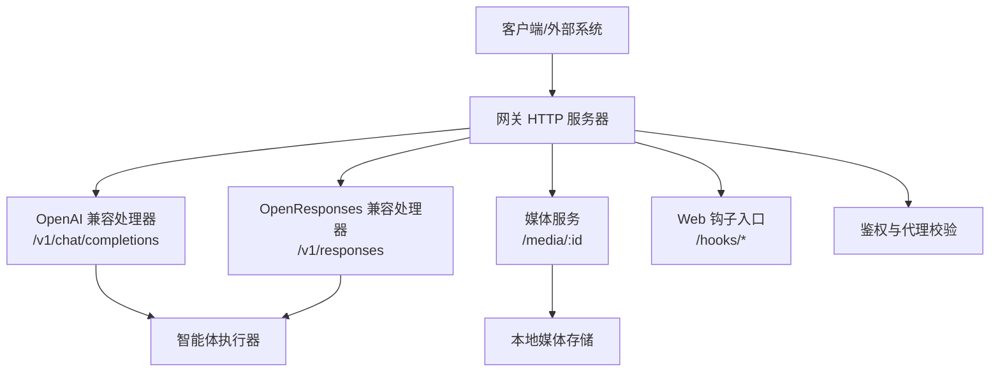
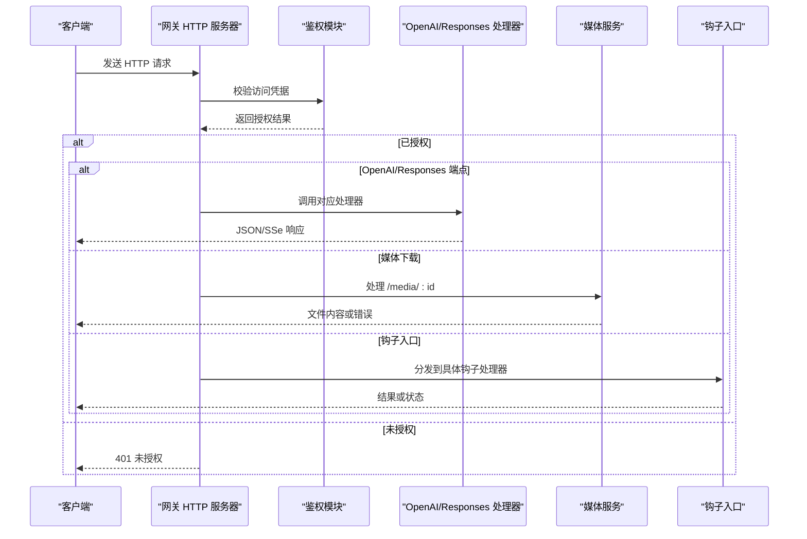
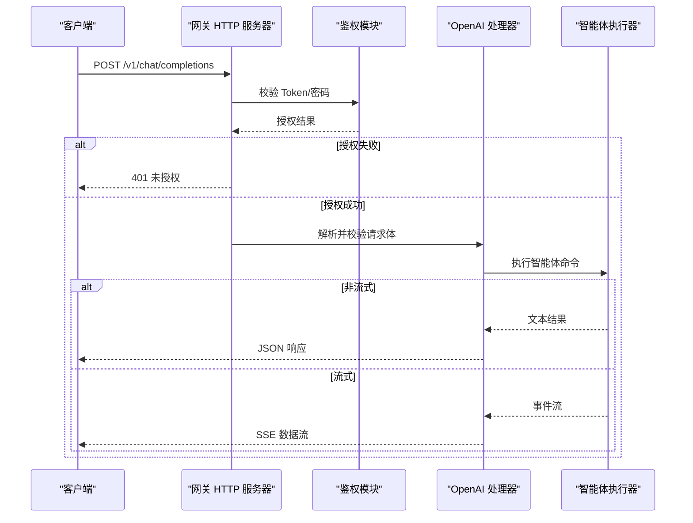
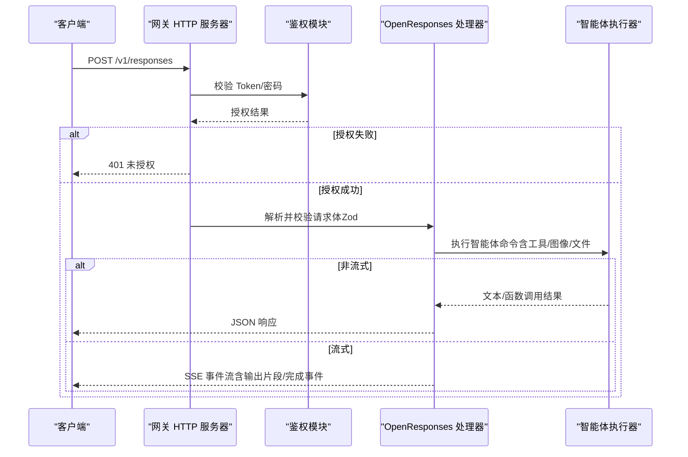
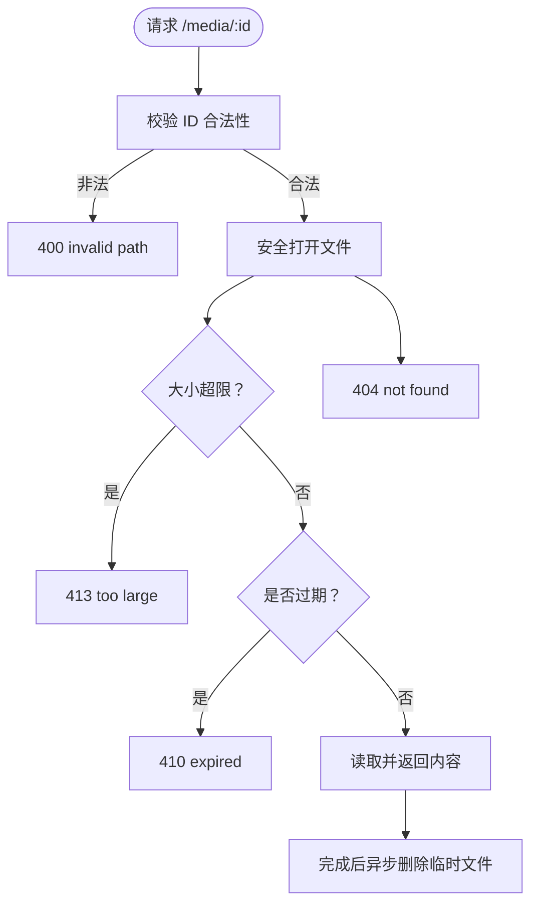
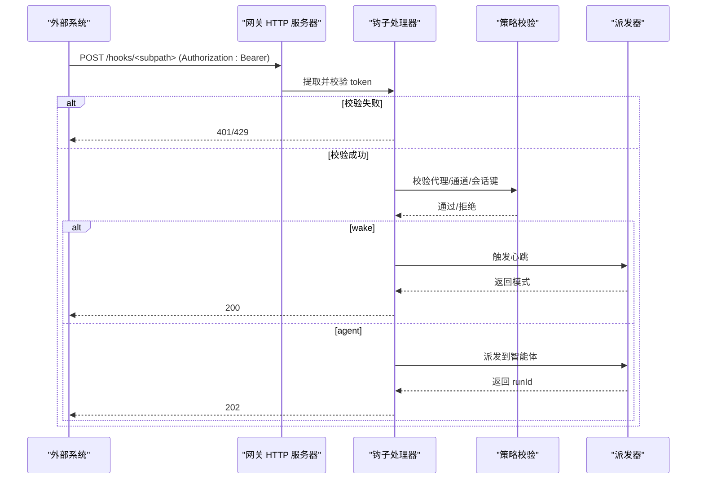
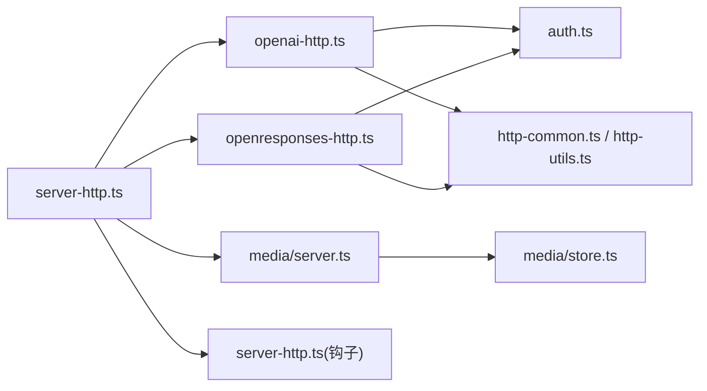

# HTTP API

<cite>
**本文档引用的文件**
- [src/gateway/server-http.ts](file://src/gateway/server-http.ts)
- [src/gateway/openai-http.ts](file://src/gateway/openai-http.ts)
- [src/gateway/openresponses-http.ts](file://src/gateway/openresponses-http.ts)
- [src/gateway/open-responses.schema.ts](file://src/gateway/open-responses.schema.ts)
- [src/gateway/http-common.ts](file://src/gateway/http-common.ts)
- [src/gateway/http-utils.ts](file://src/gateway/http-utils.ts)
- [src/gateway/auth.ts](file://src/gateway/auth.ts)
- [src/media/server.ts](file://src/media/server.ts)
- [src/media/store.ts](file://src/media/store.ts)
- [src/gateway/server.ws-connection/message-handler.ts](file://src/gateway/server/ws-connection/message-handler.ts)
- [extensions/zalo/src/monitor.ts](file://extensions/zalo/src/monitor.ts)
- [extensions/googlechat/src/monitor.ts](file://extensions/googlechat/src/monitor.ts)
- [docs/zh-CN/automation/webhook.md](file://docs/zh-CN/automation/webhook.md)
</cite>

## 目录
1. [简介](#简介)
2. [项目结构](#项目结构)
3. [核心组件](#核心组件)
4. [架构总览](#架构总览)
5. [详细组件分析](#详细组件分析)
6. [依赖关系分析](#依赖关系分析)
7. [性能考量](#性能考量)
8. [故障排查指南](#故障排查指南)
9. [结论](#结论)
10. [附录](#附录)

## 简介
本文件为 OpenClaw 的 HTTP API 文档，面向 Web 界面与外部系统集成，覆盖以下能力：
- OpenAI 兼容 API：/v1/chat/completions
- OpenResponses 兼容 API：/v1/responses
- 媒体文件上传与下载：/media/:id
- Web 钩子接收端点：/hooks/*（由网关统一入口分发）
- 认证机制、请求头规范、响应格式与错误码
- 端点列表、参数说明与示例请求/响应路径

## 项目结构
OpenClaw 的 HTTP 能力主要由网关服务器聚合，按功能模块划分：
- 网关 HTTP 入口与路由：负责鉴权、路由与错误处理
- OpenAI 兼容端点：/v1/chat/completions
- OpenResponses 兼容端点：/v1/responses
- 媒体服务：/media/:id 下载与清理
- Web 钩子：/hooks/* 统一入口，支持多种子路径与映射

图表来源
- [src/gateway/server-http.ts](file://src/gateway/server-http.ts#L398-L515)
- [src/gateway/openai-http.ts](file://src/gateway/openai-http.ts#L171-L427)
- [src/gateway/openresponses-http.ts](file://src/gateway/openresponses-http.ts#L346-L800)
- [src/media/server.ts](file://src/media/server.ts#L28-L89)

章节来源
- [src/gateway/server-http.ts](file://src/gateway/server-http.ts#L398-L515)

## 核心组件
- 网关 HTTP 服务器：统一处理 HTTP 请求，按顺序尝试钩子、工具调用、通道插件、OpenAI/Responses 端点、Canvas/控制 UI 等。
- OpenAI 兼容处理器：解析 /v1/chat/completions 请求，支持流式与非流式响应。
- OpenResponses 兼容处理器：解析 /v1/responses 请求，支持输入文本/图片/文件、工具选择、流式事件。
- 媒体服务：安全下载与一次性访问，带 TTL 清理与大小限制。
- 鉴权模块：支持 Token/密码/Tailscale 设备令牌等多种方式。

章节来源
- [src/gateway/server-http.ts](file://src/gateway/server-http.ts#L363-L515)
- [src/gateway/openai-http.ts](file://src/gateway/openai-http.ts#L171-L427)
- [src/gateway/openresponses-http.ts](file://src/gateway/openresponses-http.ts#L346-L800)
- [src/media/server.ts](file://src/media/server.ts#L28-L89)
- [src/gateway/auth.ts](file://src/gateway/auth.ts#L217-L271)

## 架构总览
网关 HTTP 服务器在收到请求后，先尝试匹配已启用的功能模块；若未命中，则返回 404。所有受保护的 HTTP 接口均通过统一鉴权逻辑进行校验。

图表来源
- [src/gateway/server-http.ts](file://src/gateway/server-http.ts#L398-L515)
- [src/gateway/auth.ts](file://src/gateway/auth.ts#L217-L271)
- [src/gateway/openai-http.ts](file://src/gateway/openai-http.ts#L171-L427)
- [src/gateway/openresponses-http.ts](file://src/gateway/openresponses-http.ts#L346-L800)
- [src/media/server.ts](file://src/media/server.ts#L28-L89)

## 详细组件分析

### OpenAI 兼容 API：/v1/chat/completions
- 方法与路径
  - 方法：POST
  - 路径：/v1/chat/completions
- 认证
  - 支持 Bearer Token 或密码（取决于网关配置）
- 请求体字段
  - model：模型标识（可选）
  - messages：消息数组（必需）
  - user：用户标识（可选）
  - stream：是否流式（可选）
- 响应
  - 非流式：标准 OpenAI 格式 JSON
  - 流式：SSE，事件类型为 chat.completion.chunk，最后以 [DONE] 结束
- 会话键
  - 优先使用请求头 x-openclaw-session-key；否则根据 user 或随机生成
- 错误
  - 400：缺少用户消息等无效请求
  - 401：未授权
  - 405：方法不被允许
  - 500：内部错误

图表来源
- [src/gateway/openai-http.ts](file://src/gateway/openai-http.ts#L171-L427)
- [src/gateway/http-common.ts](file://src/gateway/http-common.ts#L16-L56)
- [src/gateway/http-utils.ts](file://src/gateway/http-utils.ts#L52-L79)
- [src/gateway/auth.ts](file://src/gateway/auth.ts#L217-L271)

章节来源
- [src/gateway/openai-http.ts](file://src/gateway/openai-http.ts#L171-L427)
- [src/gateway/http-common.ts](file://src/gateway/http-common.ts#L16-L56)
- [src/gateway/http-utils.ts](file://src/gateway/http-utils.ts#L52-L79)
- [src/gateway/auth.ts](file://src/gateway/auth.ts#L217-L271)

### OpenResponses 兼容 API：/v1/responses
- 方法与路径
  - 方法：POST
  - 路径：/v1/responses
- 认证
  - 支持 Bearer Token 或密码（取决于网关配置）
- 请求体字段（节选）
  - model：模型标识（必需）
  - input：字符串或 ItemParam 数组（必需）
  - instructions：附加指令（可选）
  - tools/tool_choice：工具定义与选择策略（可选）
  - stream/max_output_tokens/max_tool_calls/user：控制参数（可选）
  - temperature/top_p/metadata/store/previous_response_id/reasoning/truncation：兼容字段（可选）
- 输入项（ItemParam）支持：
  - message（含 system/developer/user/assistant 角色与文本/多模态内容）
  - function_call/function_call_output
  - reasoning/item_reference
- 响应
  - 非流式：ResponseResource（包含 id/object/status/model/output/usage/error）
  - 流式：SSE 事件序列（response.created/response.in_progress/response.completed/response.failed 等）
- 会话键
  - 优先使用请求头 x-openclaw-session-key；否则根据 user 或随机生成
- 错误
  - 400：请求体校验失败或缺少必要字段
  - 401：未授权
  - 405：方法不被允许
  - 500：内部错误

图表来源
- [src/gateway/openresponses-http.ts](file://src/gateway/openresponses-http.ts#L346-L800)
- [src/gateway/open-responses.schema.ts](file://src/gateway/open-responses.schema.ts#L174-L199)
- [src/gateway/http-common.ts](file://src/gateway/http-common.ts#L16-L56)
- [src/gateway/http-utils.ts](file://src/gateway/http-utils.ts#L52-L79)
- [src/gateway/auth.ts](file://src/gateway/auth.ts#L217-L271)

章节来源
- [src/gateway/openresponses-http.ts](file://src/gateway/openresponses-http.ts#L346-L800)
- [src/gateway/open-responses.schema.ts](file://src/gateway/open-responses.schema.ts#L174-L199)
- [src/gateway/http-common.ts](file://src/gateway/http-common.ts#L16-L56)
- [src/gateway/http-utils.ts](file://src/gateway/http-utils.ts#L52-L79)
- [src/gateway/auth.ts](file://src/gateway/auth.ts#L217-L271)

### 媒体文件上传与下载
- 下载接口
  - 方法：GET
  - 路径：/media/:id
  - 安全性：仅允许在媒体根目录内解析，拒绝路径穿越与符号链接逃逸
  - TTL：超过配置 TTL 将删除文件并返回 410
  - 大小限制：超过 5MB 返回 413
- 上传接口
  - 当前仓库未提供直接上传端点；媒体可通过内部流程写入本地目录后由 /media/:id 下载
- 响应
  - 成功：二进制文件内容（自动设置 Content-Type）
  - 错误：400/404/410/413

图表来源
- [src/media/server.ts](file://src/media/server.ts#L28-L89)
- [src/media/store.ts](file://src/media/store.ts#L170-L209)

章节来源
- [src/media/server.ts](file://src/media/server.ts#L28-L89)
- [src/media/store.ts](file://src/media/store.ts#L170-L209)

### Web 钩子接收端点：/hooks/*
- 基础路径
  - 由配置决定（如 /hooks），支持子路径如 /hooks/wake、/hooks/agent 或映射规则
- 认证
  - 必须通过 Authorization: Bearer <token> 或 X-OpenClaw-Token（禁止使用查询参数 token）
  - 多次失败将触发限流
- 请求体
  - JSON；支持最大负载大小配置
- 功能
  - /hooks/wake：立即或下次心跳触发
  - /hooks/agent：派发到指定智能体并返回 runId
  - 映射：基于规则将外部请求映射为唤醒或派发动作
- 响应
  - 200/202/400/401/404/413/429

图表来源
- [src/gateway/server-http.ts](file://src/gateway/server-http.ts#L141-L361)
- [docs/zh-CN/automation/webhook.md](file://docs/zh-CN/automation/webhook.md#L82-L97)

章节来源
- [src/gateway/server-http.ts](file://src/gateway/server-http.ts#L141-L361)
- [docs/zh-CN/automation/webhook.md](file://docs/zh-CN/automation/webhook.md#L82-L97)

### Web 钩子平台示例：Zalo/Google Chat
- Zalo
  - 注册 Webhook 目标时需提供路径与密钥
  - 请求必须携带 X-Bot-API-Secret-Token
  - 匹配路径后执行业务处理
- Google Chat
  - 注册 Webhook 目标时需规范化 audience 类型
  - 匹配路径后执行业务处理

章节来源
- [extensions/zalo/src/monitor.ts](file://extensions/zalo/src/monitor.ts#L138-L178)
- [extensions/googlechat/src/monitor.ts](file://extensions/googlechat/src/monitor.ts#L158-L174)

## 依赖关系分析
- 网关 HTTP 服务器按优先级路由到各处理器
- OpenAI/Responses 处理器共享鉴权与通用 HTTP 工具
- 媒体服务与安全文件打开工具配合，确保路径安全与大小限制
- 钩子入口集中处理认证与限流

图表来源
- [src/gateway/server-http.ts](file://src/gateway/server-http.ts#L398-L515)
- [src/gateway/openai-http.ts](file://src/gateway/openai-http.ts#L1-L40)
- [src/gateway/openresponses-http.ts](file://src/gateway/openresponses-http.ts#L1-L60)
- [src/gateway/http-common.ts](file://src/gateway/http-common.ts#L1-L57)
- [src/gateway/http-utils.ts](file://src/gateway/http-utils.ts#L1-L80)
- [src/gateway/auth.ts](file://src/gateway/auth.ts#L1-L60)
- [src/media/server.ts](file://src/media/server.ts#L1-L20)
- [src/media/store.ts](file://src/media/store.ts#L1-L20)

章节来源
- [src/gateway/server-http.ts](file://src/gateway/server-http.ts#L398-L515)
- [src/gateway/openai-http.ts](file://src/gateway/openai-http.ts#L1-L40)
- [src/gateway/openresponses-http.ts](file://src/gateway/openresponses-http.ts#L1-L60)
- [src/gateway/http-common.ts](file://src/gateway/http-common.ts#L1-L57)
- [src/gateway/http-utils.ts](file://src/gateway/http-utils.ts#L1-L80)
- [src/gateway/auth.ts](file://src/gateway/auth.ts#L1-L60)
- [src/media/server.ts](file://src/media/server.ts#L1-L20)
- [src/media/store.ts](file://src/media/store.ts#L1-L20)

## 性能考量
- 流式响应：OpenAI/Responses 均采用 SSE，避免大响应阻塞连接
- 媒体 TTL：过期自动清理，降低磁盘占用
- 代理与限流：钩子入口对多次失败进行限流，防止滥用
- 身份验证：鉴权模块支持快速比较与 Tailscale 校验，减少不必要的开销

## 故障排查指南
- 401 未授权
  - 检查 Authorization: Bearer <token> 是否正确传递
  - 确认网关配置的 token/password 是否与请求一致
- 405 方法不被允许
  - 确保使用 POST 方法访问 /v1/chat/completions 或 /v1/responses
- 400 请求体无效
  - OpenAI：确保 messages 中包含有效用户消息
  - OpenResponses：确保 input/model 字段存在且符合 Zod 校验
- 413 媒体过大
  - 文件超过 5MB 限制；请压缩或拆分
- 410 媒体过期
  - TTL 到期自动删除；重新上传或缩短 TTL
- 429 钩子限流
  - 短时间内多次认证失败；稍后再试或检查 token

章节来源
- [src/gateway/http-common.ts](file://src/gateway/http-common.ts#L16-L56)
- [src/gateway/openai-http.ts](file://src/gateway/openai-http.ts#L211-L219)
- [src/gateway/openresponses-http.ts](file://src/gateway/openresponses-http.ts#L384-L393)
- [src/media/server.ts](file://src/media/server.ts#L46-L56)
- [src/gateway/server-http.ts](file://src/gateway/server-http.ts#L156-L177)

## 结论
OpenClaw 的 HTTP API 通过统一网关实现多协议兼容与安全控制，覆盖对话、响应、媒体与钩子等核心场景。建议在生产环境启用鉴权与 TLS，并合理配置媒体 TTL 与钩子限流策略。

## 附录

### 认证机制与请求头规范
- 认证方式
  - Bearer Token：Authorization: Bearer <token>
  - 密码：依据网关配置（密码模式）
  - Tailscale：在受信任代理环境下校验
- 请求头
  - Authorization: Bearer <token>
  - x-openclaw-session-key：显式会话键
  - x-openclaw-agent-id/x-openclaw-agent：代理标识
  - X-OpenClaw-Token：钩子 token（仅头部，禁止查询参数）

章节来源
- [src/gateway/auth.ts](file://src/gateway/auth.ts#L217-L271)
- [src/gateway/http-utils.ts](file://src/gateway/http-utils.ts#L16-L79)
- [src/gateway/server-http.ts](file://src/gateway/server-http.ts#L194-L221)

### 响应格式与错误码
- 成功
  - 200：JSON 响应（非流式）
  - 202：异步派发成功（钩子 agent）
  - 204：无内容（钩子映射 action=null）
- 错误
  - 400：无效请求体/参数
  - 401：未授权
  - 404：未找到
  - 405：方法不被允许
  - 413：媒体过大
  - 410：媒体过期
  - 429：钩子限流
  - 500：内部错误

章节来源
- [src/gateway/http-common.ts](file://src/gateway/http-common.ts#L16-L56)
- [src/gateway/server-http.ts](file://src/gateway/server-http.ts#L156-L177)
- [src/media/server.ts](file://src/media/server.ts#L46-L82)

### 端点清单与参数速览
- /v1/chat/completions
  - 方法：POST
  - 参数：model/messages/user/stream
  - 响应：JSON 或 SSE
- /v1/responses
  - 方法：POST
  - 参数：model,input,instructions,tools,tool_choice,stream,max_output_tokens,user 等
  - 响应：JSON 或 SSE
- /media/:id
  - 方法：GET
  - 参数：无（路径参数）
  - 响应：二进制文件或错误
- /hooks/*
  - 方法：POST
  - 参数：JSON 载荷（见钩子文档）
  - 响应：JSON 状态或 runId

章节来源
- [src/gateway/openai-http.ts](file://src/gateway/openai-http.ts#L171-L427)
- [src/gateway/openresponses-http.ts](file://src/gateway/openresponses-http.ts#L346-L800)
- [src/media/server.ts](file://src/media/server.ts#L28-L89)
- [src/gateway/server-http.ts](file://src/gateway/server-http.ts#L141-L361)
- [docs/zh-CN/automation/webhook.md](file://docs/zh-CN/automation/webhook.md#L82-L97)