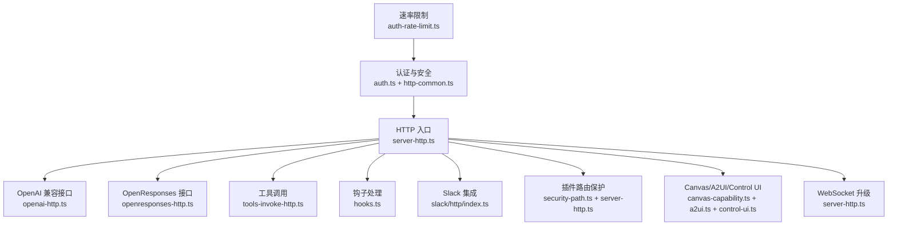
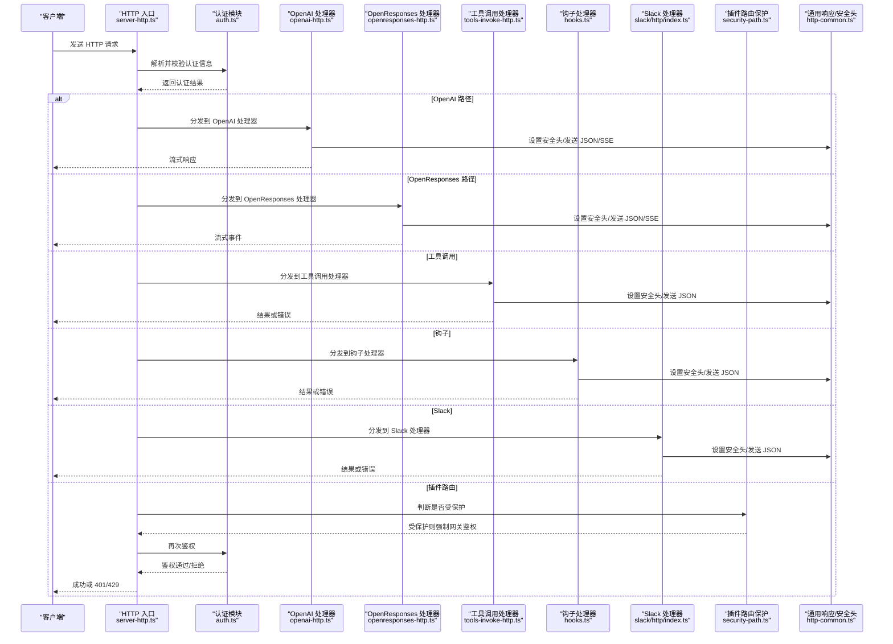
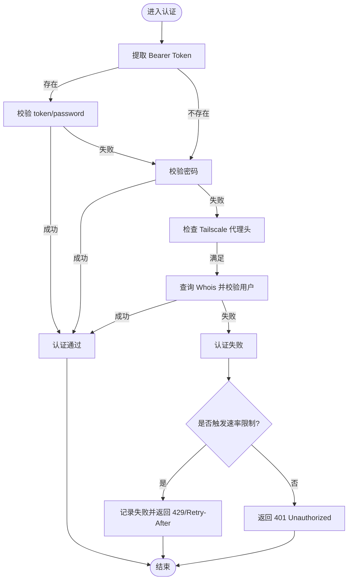
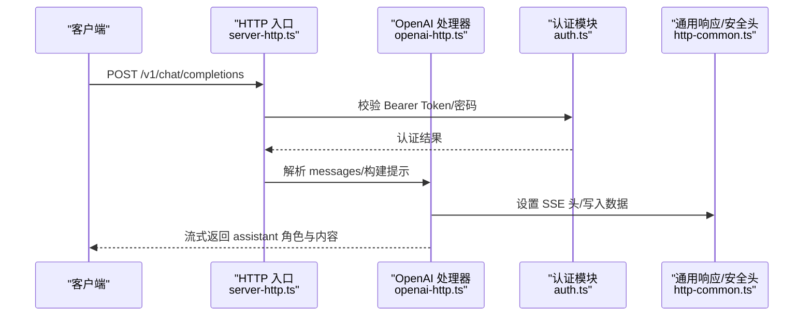
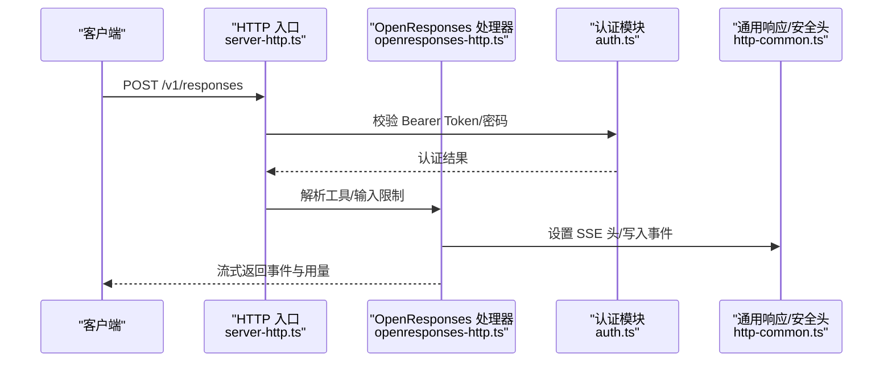
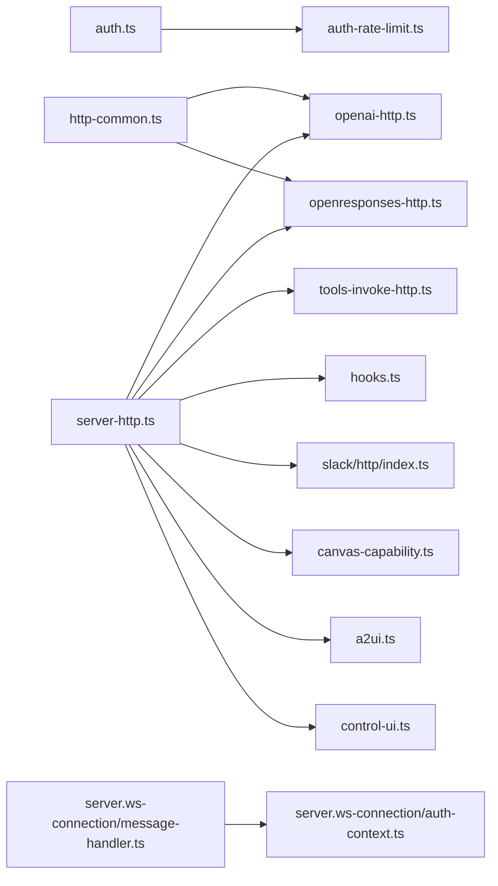

# HTTP API

<cite>
**本文引用的文件**
- [src/gateway/server-http.ts](file://src/gateway/server-http.ts)
- [src/gateway/server.impl.ts](file://src/gateway/server.impl.ts)
- [src/gateway/http-common.ts](file://src/gateway/http-common.ts)
- [src/gateway/auth.ts](file://src/gateway/auth.ts)
- [src/gateway/http-auth-helpers.ts](file://src/gateway/http-auth-helpers.ts)
- [src/gateway/openai-http.ts](file://src/gateway/openai-http.ts)
- [src/gateway/openresponses-http.ts](file://src/gateway/openresponses-http.ts)
- [src/gateway/server.ws-connection/message-handler.ts](file://src/gateway/server.ws-connection/message-handler.ts)
- [src/gateway/server.ws-connection/auth-context.ts](file://src/gateway/server.ws-connection/auth-context.ts)
- [src/gateway/http-utils.ts](file://src/gateway/http-utils.ts)
- [src/gateway/hooks.ts](file://src/gateway/hooks.ts)
- [src/gateway/tools-invoke-http.ts](file://src/gateway/tools-invoke-http.ts)
- [src/gateway/slack/http/index.ts](file://src/gateway/slack/http/index.ts)
- [src/gateway/canvas-capability.ts](file://src/gateway/canvas-capability.ts)
- [src/gateway/control-ui.ts](file://src/gateway/control-ui.ts)
- [src/gateway/a2ui.ts](file://src/gateway/a2ui.ts)
- [src/gateway/server-channels.ts](file://src/gateway/server-channels.ts)
- [src/gateway/server-plugins.ts](file://src/gateway/server-plugins.ts)
- [src/gateway/security-path.ts](file://src/gateway/security-path.ts)
- [src/gateway/auth-rate-limit.ts](file://src/gateway/auth-rate-limit.ts)
- [src/gateway/server-methods-list.ts](file://src/gateway/server-methods-list.ts)
- [src/gateway/server-methods.ts](file://src/gateway/server-methods.ts)
- [src/gateway/server-methods/chat.ts](file://src/gateway/server-methods/chat.ts)
- [src/gateway/server-methods/exec-approval.ts](file://src/gateway/server-methods/exec-approval.ts)
- [src/gateway/server-methods/secrets.ts](file://src/gateway/server-methods/secrets.ts)
- [src/gateway/server-methods/nodes.helpers.ts](file://src/gateway/server-methods/nodes.helpers.ts)
- [src/gateway/server-session-key.ts](file://src/gateway/server-session-key.ts)
- [src/gateway/protocol/client-info.ts](file://src/gateway/protocol/client-info.ts)
- [src/gateway/net.ts](file://src/gateway/net.ts)
- [src/gateway/server/tls.js](file://src/gateway/server/tls.js)
- [src/gateway/server/startup-auth.js](file://src/gateway/server/startup-auth.js)
- [src/gateway/server/health-state.js](file://src/gateway/server/health-state.js)
- [src/gateway/server-discovery-runtime.js](file://src/gateway/server-discovery-runtime.js)
- [src/gateway/server-startup.js](file://src/gateway/server-startup.js)
- [src/gateway/server-tailscale.js](file://src/gateway/server-tailscale.js)
- [src/gateway/server-wizard-sessions.js](file://src/gateway/server-wizard-sessions.js)
- [src/gateway/server-ws-runtime.js](file://src/gateway/server-ws-runtime.js)
- [src/gateway/server-lanes.js](file://src/gateway/server-lanes.js)
- [src/gateway/server-maintenance.js](file://src/gateway/server-maintenance.js)
- [src/gateway/server-plugins.js](file://src/gateway/server-plugins.js)
- [src/gateway/server-reload-handlers.js](file://src/gateway/server-reload-handlers.js)
- [src/gateway/server-runtime-config.js](file://src/gateway/server-runtime-config.js)
- [src/gateway/server-runtime-state.js](file://src/gateway/server-runtime-state.js)
- [src/gateway/server-model-catalog.js](file://src/gateway/server-model-catalog.js)
- [src/gateway/server-close.js](file://src/gateway/server-close.js)
- [src/gateway/server-startup-log.js](file://src/gateway/server-startup-log.js)
- [src/gateway/server-channels.js](file://src/gateway/server-channels.js)
- [src/gateway/server-mobile-nodes.js](file://src/gateway/server-mobile-nodes.js)
- [src/gateway/server-node-subscriptions.js](file://src/gateway/server-node-subscriptions.js)
- [src/gateway/server-cron.js](file://src/gateway/server-cron.js)
- [src/gateway/server-methods-list.js](file://src/gateway/server-methods-list.js)
- [src/gateway/server-methods.js](file://src/gateway/server-methods.js)
- [src/gateway/server-methods/chat.js](file://src/gateway/server-methods/chat.js)
- [src/gateway/server-methods/exec-approval.js](file://src/gateway/server-methods/exec-approval.js)
- [src/gateway/server-methods/secrets.js](file://src/gateway/server-methods/secrets.js)
- [src/gateway/server-methods/nodes.helpers.js](file://src/gateway/server-methods/nodes.helpers.js)
- [src/gateway/server-session-key.js](file://src/gateway/server-session-key.js)
- [src/gateway/protocol/client-info.js](file://src/gateway/protocol/client-info.js)
- [src/gateway/net.js](file://src/gateway/net.js)
- [src/gateway/server/tls.js](file://src/gateway/server/tls.js)
- [src/gateway/server/startup-auth.js](file://src/gateway/server/startup-auth.js)
- [src/gateway/server/health-state.js](file://src/gateway/server/health-state.js)
- [src/gateway/server-discovery-runtime.js](file://src/gateway/server-discovery-runtime.js)
- [src/gateway/server-startup.js](file://src/gateway/server-startup.js)
- [src/gateway/server-tailscale.js](file://src/gateway/server-tailscale.js)
- [src/gateway/server-wizard-sessions.js](file://src/gateway/server-wizard-sessions.js)
- [src/gateway/server-ws-runtime.js](file://src/gateway/server-ws-runtime.js)
- [src/gateway/server-lanes.js](file://src/gateway/server-lanes.js)
- [src/gateway/server-maintenance.js](file://src/gateway/server-maintenance.js)
- [src/gateway/server-plugins.js](file://src/gateway/server-plugins.js)
- [src/gateway/server-reload-handlers.js](file://src/gateway/server-reload-handlers.js)
- [src/gateway/server-runtime-config.js](file://src/gateway/server-runtime-config.js)
- [src/gateway/server-runtime-state.js](file://src/gateway/server-runtime-state.js)
- [src/gateway/server-model-catalog.js](file://src/gateway/server-model-catalog.js)
- [src/gateway/server-close.js](file://src/gateway/server-close.js)
- [src/gateway/server-startup-log.js](file://src/gateway/server-startup-log.js)
- [src/gateway/server-channels.js](file://src/gateway/server-channels.js)
- [src/gateway/server-mobile-nodes.js](file://src/gateway/server-mobile-nodes.js)
- [src/gateway/server-node-subscriptions.js](file://src/gateway/server-node-subscriptions.js)
- [src/gateway/server-cron.js](file://src/gateway/server-cron.js)
</cite>

## 目录

1. [简介](#简介)
2. [项目结构](#项目结构)
3. [核心组件](#核心组件)
4. [架构总览](#架构总览)
5. [详细组件分析](#详细组件分析)
6. [依赖关系分析](#依赖关系分析)
7. [性能考量](#性能考量)
8. [故障排查指南](#故障排查指南)
9. [结论](#结论)
10. [附录](#附录)

## 简介

本文件为 OpenClaw Gateway 的 HTTP API 完整文档，覆盖以下内容：

- RESTful API 的 HTTP 方法、URL 模式与请求/响应模式
- 认证与授权机制（Bearer Token、共享密钥、密码、Tailscale、受信代理）
- 路由定义、中间件处理与请求处理流程
- 端点详情、参数规范与返回值格式
- 使用示例、错误码与状态码处理
- 版本控制策略、速率限制与安全考虑
- 客户端实现指南与最佳实践

## 项目结构

OpenClaw Gateway 的 HTTP 层由多模块协作构成：

- HTTP 入口与路由：server-http.ts 统一接收 HTTP 请求，按路径分派到各子处理器
- 认证与安全：auth.ts 提供多种认证方式；http-common.ts 提供通用响应与安全头
- OpenAI 兼容接口：openai-http.ts 实现 /v1/chat/completions
- OpenResponses 接口：openresponses-http.ts 实现 /v1/responses
- 插件路由保护：security-path.ts 识别受保护插件前缀，配合 enforcePluginRouteGatewayAuth 进行网关级鉴权
- 工具调用：tools-invoke-http.ts 处理工具调用请求
- 钩子与 Slack：hooks.ts、slack/http/index.ts 提供外部集成入口
- Canvas/A2UI/Control UI：canvas-capability.ts、a2ui.ts、control-ui.ts 提供可视化能力
- WebSocket 升级：server-http.ts 在 upgrade 事件中进行 Canvas/WebSocket 认证
- 健康检查与运行时：server/health-state.js、server-startup.js 等

图表来源

- [src/gateway/server-http.ts](file://src/gateway/server-http.ts#L500-L630)
- [src/gateway/openai-http.ts](file://src/gateway/openai-http.ts#L1-L200)
- [src/gateway/openresponses-http.ts](file://src/gateway/openresponses-http.ts#L1-L200)
- [src/gateway/tools-invoke-http.ts](file://src/gateway/tools-invoke-http.ts)
- [src/gateway/hooks.ts](file://src/gateway/hooks.ts)
- [src/gateway/slack/http/index.ts](file://src/gateway/slack/http/index.ts)
- [src/gateway/security-path.ts](file://src/gateway/security-path.ts)
- [src/gateway/canvas-capability.ts](file://src/gateway/canvas-capability.ts)
- [src/gateway/a2ui.ts](file://src/gateway/a2ui.ts)
- [src/gateway/control-ui.ts](file://src/gateway/control-ui.ts)
- [src/gateway/auth.ts](file://src/gateway/auth.ts#L1-L200)
- [src/gateway/http-common.ts](file://src/gateway/http-common.ts#L1-L108)
- [src/gateway/auth-rate-limit.ts](file://src/gateway/auth-rate-limit.ts)

章节来源

- [src/gateway/server-http.ts](file://src/gateway/server-http.ts#L500-L630)
- [src/gateway/auth.ts](file://src/gateway/auth.ts#L1-L200)
- [src/gateway/http-common.ts](file://src/gateway/http-common.ts#L1-L108)

## 核心组件

- HTTP 入口与路由分发：统一在 server-http.ts 中完成，支持 OpenAI 兼容、OpenResponses、工具调用、钩子、Slack、Canvas/A2UI/Control UI、插件路由等
- 认证与授权：auth.ts 支持 token/password/Tailscale/受信代理等多种模式；http-common.ts 提供统一响应与安全头
- OpenAI 兼容接口：openai-http.ts 实现流式 SSE 响应，支持消息数组解析与会话键管理
- OpenResponses 接口：openresponses-http.ts 实现流式事件推送，支持工具选择、输入文件/图片限制
- 速率限制：auth-rate-limit.ts 提供基于 IP 的失败次数统计与重试等待时间
- WebSocket 升级：server-http.ts 在 upgrade 事件中对 Canvas/WebSocket 进行认证

章节来源

- [src/gateway/server-http.ts](file://src/gateway/server-http.ts#L500-L630)
- [src/gateway/openai-http.ts](file://src/gateway/openai-http.ts#L1-L200)
- [src/gateway/openresponses-http.ts](file://src/gateway/openresponses-http.ts#L1-L200)
- [src/gateway/auth.ts](file://src/gateway/auth.ts#L1-L200)
- [src/gateway/http-common.ts](file://src/gateway/http-common.ts#L1-L108)
- [src/gateway/auth-rate-limit.ts](file://src/gateway/auth-rate-limit.ts)

## 架构总览

下图展示 HTTP 请求从入口到具体处理器的调用链路，以及认证与速率限制的参与位置。

图表来源

- [src/gateway/server-http.ts](file://src/gateway/server-http.ts#L500-L630)
- [src/gateway/auth.ts](file://src/gateway/auth.ts#L471-L487)
- [src/gateway/openai-http.ts](file://src/gateway/openai-http.ts#L1-L200)
- [src/gateway/openresponses-http.ts](file://src/gateway/openresponses-http.ts#L1-L200)
- [src/gateway/tools-invoke-http.ts](file://src/gateway/tools-invoke-http.ts)
- [src/gateway/hooks.ts](file://src/gateway/hooks.ts)
- [src/gateway/slack/http/index.ts](file://src/gateway/slack/http/index.ts)
- [src/gateway/security-path.ts](file://src/gateway/security-path.ts)
- [src/gateway/http-common.ts](file://src/gateway/http-common.ts#L1-L108)

## 详细组件分析

### 认证与授权

- 支持模式
  - Bearer Token：从 Authorization 头提取，匹配配置中的 token 或 password 字段
  - 密码：明文密码校验
  - Tailscale：通过代理转发头与 Whois 校验用户身份
  - 受信代理：允许通过受信代理链解析真实客户端 IP
- 认证流程
  - 优先尝试 Bearer Token；若未提供或失败，则尝试密码；若仍失败且允许 Tailscale，则尝试 Tailscale 用户校验
  - 失败时可触发速率限制，返回 Retry-After 与 429
- 速率限制
  - 基于 IP 的失败计数与冷却窗口，超过阈值后返回 429 并设置 Retry-After
- 安全头
  - 默认设置 X-Content-Type-Options、Referrer-Policy，可选 Strict-Transport-Security

图表来源

- [src/gateway/auth.ts](file://src/gateway/auth.ts#L471-L487)
- [src/gateway/auth.ts](file://src/gateway/auth.ts#L434-L469)
- [src/gateway/auth-rate-limit.ts](file://src/gateway/auth-rate-limit.ts)
- [src/gateway/http-common.ts](file://src/gateway/http-common.ts#L40-L70)

章节来源

- [src/gateway/auth.ts](file://src/gateway/auth.ts#L1-L200)
- [src/gateway/auth.ts](file://src/gateway/auth.ts#L434-L487)
- [src/gateway/http-auth-helpers.ts](file://src/gateway/http-auth-helpers.ts#L1-L29)
- [src/gateway/http-common.ts](file://src/gateway/http-common.ts#L1-L108)
- [src/gateway/auth-rate-limit.ts](file://src/gateway/auth-rate-limit.ts)

### OpenAI 兼容接口 /v1/chat/completions

- 方法与路径
  - POST /v1/chat/completions
- 请求体
  - 支持字段：model、stream、messages、user 等
  - messages 支持字符串或数组形式的内容，系统/开发者消息会被拼接为额外系统提示
- 认证
  - Bearer Token 或共享密钥/密码
- 响应
  - 非流式：JSON 对象
  - 流式：SSE，逐条发送 chat.completion.chunk，最后以 [DONE] 结束
- 会话键
  - 基于 agentId、user、前缀生成会话键，用于关联上下文与用量统计

图表来源

- [src/gateway/server-http.ts](file://src/gateway/server-http.ts#L563-L574)
- [src/gateway/openai-http.ts](file://src/gateway/openai-http.ts#L1-L200)
- [src/gateway/auth.ts](file://src/gateway/auth.ts#L471-L487)
- [src/gateway/http-common.ts](file://src/gateway/http-common.ts#L101-L108)

章节来源

- [src/gateway/openai-http.ts](file://src/gateway/openai-http.ts#L1-L200)
- [src/gateway/server-http.ts](file://src/gateway/server-http.ts#L563-L574)

### OpenResponses 接口 /v1/responses

- 方法与路径
  - POST /v1/responses
- 请求体
  - 支持 tools、tool_choice、文件/图片输入等
  - 支持工具选择策略：none、required、指定函数名
- 认证
  - Bearer Token 或共享密钥/密码
- 响应
  - 非流式：JSON 对象
  - 流式：SSE，事件类型包括数据项与用量统计
- 输入限制
  - 文件/图片大小、MIME 类型、URL 白名单、最大路径层级等

图表来源

- [src/gateway/server-http.ts](file://src/gateway/server-http.ts#L550-L562)
- [src/gateway/openresponses-http.ts](file://src/gateway/openresponses-http.ts#L1-L200)
- [src/gateway/auth.ts](file://src/gateway/auth.ts#L471-L487)
- [src/gateway/http-common.ts](file://src/gateway/http-common.ts#L101-L108)

章节来源

- [src/gateway/openresponses-http.ts](file://src/gateway/openresponses-http.ts#L1-L200)
- [src/gateway/server-http.ts](file://src/gateway/server-http.ts#L550-L562)

### 工具调用 /tools/invoke/\*

- 方法与路径
  - POST /tools/invoke/{toolName}
- 认证
  - Bearer Token 或共享密钥/密码
- 响应
  - JSON 对象，包含工具执行结果或错误

章节来源

- [src/gateway/tools-invoke-http.ts](file://src/gateway/tools-invoke-http.ts)

### 钩子接口 /hooks/\*

- 方法与路径
  - POST /hooks/{agentId}
- 认证
  - Bearer Token 或受保护插件路由默认强制网关鉴权
- 响应
  - JSON 对象，包含钩子调度结果或错误

章节来源

- [src/gateway/hooks.ts](file://src/gateway/hooks.ts)
- [src/gateway/server-http.ts](file://src/gateway/server-http.ts#L514-L516)

### Slack 集成

- 方法与路径
  - 由 slack/http/index.ts 提供，通常为特定事件回调路径
- 认证
  - 依据 server-http.ts 的钩子/插件路由策略进行鉴权
- 响应
  - JSON 对象，包含处理结果或错误

章节来源

- [src/gateway/slack/http/index.ts](file://src/gateway/slack/http/index.ts)
- [src/gateway/server-http.ts](file://src/gateway/server-http.ts#L527-L529)

### 插件路由保护

- 受保护插件前缀默认强制网关鉴权
- enforcePluginRouteGatewayAuth 会在受保护路径上进行 Bearer Token 校验
- 非受保护插件路由由插件自身负责鉴权

章节来源

- [src/gateway/server-http.ts](file://src/gateway/server-http.ts#L530-L549)
- [src/gateway/security-path.ts](file://src/gateway/security-path.ts)

### Canvas/A2UI/Control UI

- Canvas 能力通过 scoped URL 与节点侧能力令牌进行授权
- A2UI 与 Control UI 提供可视化界面与头像服务
- Canvas WebSocket 升级需通过 Canvas 授权

章节来源

- [src/gateway/server-http.ts](file://src/gateway/server-http.ts#L575-L617)
- [src/gateway/server-http.ts](file://src/gateway/server-http.ts#L632-L687)
- [src/gateway/canvas-capability.ts](file://src/gateway/canvas-capability.ts)
- [src/gateway/a2ui.ts](file://src/gateway/a2ui.ts)
- [src/gateway/control-ui.ts](file://src/gateway/control-ui.ts)

### WebSocket 升级与 Canvas 授权

- upgrade 事件中对 Canvas WebSocket 进行授权
- 若 Canvas 授权失败，写入升级失败并关闭连接
- 成功后交由 WebSocket 服务器处理

章节来源

- [src/gateway/server-http.ts](file://src/gateway/server-http.ts#L632-L687)
- [src/gateway/server.ws-connection/message-handler.ts](file://src/gateway/server.ws-connection/message-handler.ts#L1123-L1171)

## 依赖关系分析

- 认证与安全
  - auth.ts 依赖 auth-rate-limit.ts 进行速率限制
  - http-common.ts 提供统一响应与安全头
- HTTP 入口
  - server-http.ts 依赖各处理器模块（OpenAI、OpenResponses、工具调用、钩子、Slack、Canvas/A2UI/Control UI）
  - server-http.ts 在 upgrade 事件中调用 Canvas 授权
- WebSocket
  - server.ws-connection/message-handler.ts 与 server.ws-connection/auth-context.ts 协同处理 WS 连接与重复未授权请求

图表来源

- [src/gateway/auth.ts](file://src/gateway/auth.ts#L1-L200)
- [src/gateway/auth-rate-limit.ts](file://src/gateway/auth-rate-limit.ts)
- [src/gateway/http-common.ts](file://src/gateway/http-common.ts#L1-L108)
- [src/gateway/server-http.ts](file://src/gateway/server-http.ts#L500-L630)
- [src/gateway/server.ws-connection/message-handler.ts](file://src/gateway/server.ws-connection/message-handler.ts#L1123-L1171)
- [src/gateway/server.ws-connection/auth-context.ts](file://src/gateway/server.ws-connection/auth-context.ts#L1-L122)

章节来源

- [src/gateway/server-http.ts](file://src/gateway/server-http.ts#L500-L630)
- [src/gateway/auth.ts](file://src/gateway/auth.ts#L1-L200)
- [src/gateway/http-common.ts](file://src/gateway/http-common.ts#L1-L108)

## 性能考量

- 流式响应
  - OpenAI 与 OpenResponses 均采用 SSE 流式输出，降低单次响应延迟
- 速率限制
  - 基于 IP 的失败次数与冷却窗口，防止暴力破解
- 超时与负载
  - 请求体超时与负载上限在读取 JSON 时进行校验，避免过大请求导致资源耗尽
- 并发与队列
  - 通过 server-lanes.js 与 server-cron.js 等模块协调并发与定时任务

[本节为通用指导，不直接分析具体文件]

## 故障排查指南

- 400 错误
  - 请求体过大或请求体超时：检查 maxBodyBytes 与网络状况
  - 参数无效：检查请求体字段类型与必填项
- 401 未授权
  - Bearer Token 缺失或不匹配；确认 Authorization 头与配置一致
- 429 速率限制
  - 多次失败触发限流，等待 Retry-After 指示的时间后重试
- 404 未找到
  - 请求路径不存在或未启用对应端点
- 500 内部错误
  - 处理器内部异常，查看日志定位具体模块

章节来源

- [src/gateway/http-common.ts](file://src/gateway/http-common.ts#L66-L95)
- [src/gateway/http-common.ts](file://src/gateway/http-common.ts#L40-L70)
- [src/gateway/server-http.ts](file://src/gateway/server-http.ts#L619-L626)

## 结论

OpenClaw Gateway 的 HTTP API 通过统一入口与模块化处理器，提供了 OpenAI 兼容与 OpenResponses 两大主流接口，并辅以灵活的认证与速率限制机制。插件路由保护与 Canvas/A2UI/Control UI 扩展了可视化与集成能力。建议客户端遵循 Bearer Token 认证、合理设置请求体大小与流式消费策略，并在出现 429 时遵守 Retry-After 重试。

[本节为总结性内容，不直接分析具体文件]

## 附录

### 版本控制与兼容性

- OpenAI 兼容接口遵循 /v1/\* 命名空间
- OpenResponses 接口遵循 /v1/responses
- Canvas/A2UI/Control UI 路径独立于上述命名空间

章节来源

- [src/gateway/server-http.ts](file://src/gateway/server-http.ts#L563-L574)
- [src/gateway/server-http.ts](file://src/gateway/server-http.ts#L550-L562)
- [src/gateway/a2ui.ts](file://src/gateway/a2ui.ts)
- [src/gateway/control-ui.ts](file://src/gateway/control-ui.ts)

### 安全与合规

- 默认安全头：X-Content-Type-Options、Referrer-Policy，可选 HSTS
- 速率限制：防暴力破解与滥用
- 受信代理与 Tailscale：支持代理链与基于网络的身份校验

章节来源

- [src/gateway/http-common.ts](file://src/gateway/http-common.ts#L11-L21)
- [src/gateway/auth.ts](file://src/gateway/auth.ts#L124-L145)
- [src/gateway/auth.ts](file://src/gateway/auth.ts#L176-L200)

### 客户端实现指南与最佳实践

- 认证
  - 使用 Bearer Token，确保 Authorization 头正确传递
  - 对于受保护插件路由，务必携带有效 Token
- 请求体
  - 控制请求体大小，避免超过 maxBodyBytes
  - 对流式接口采用逐条消费，及时释放内存
- 错误处理
  - 400：修正请求体字段与类型
  - 401：检查 Token 有效性与配置
  - 429：等待 Retry-After 后重试
  - 404：确认端点路径与功能开关
  - 500：重试并上报日志
- 速率限制
  - 为每个 IP 维护重试时间窗口，避免频繁重试
- WebSocket 升级
  - Canvas WebSocket 需要 Canvas 授权，失败即关闭连接

章节来源

- [src/gateway/http-common.ts](file://src/gateway/http-common.ts#L40-L70)
- [src/gateway/server-http.ts](file://src/gateway/server-http.ts#L632-L687)
- [src/gateway/auth-rate-limit.ts](file://src/gateway/auth-rate-limit.ts)
