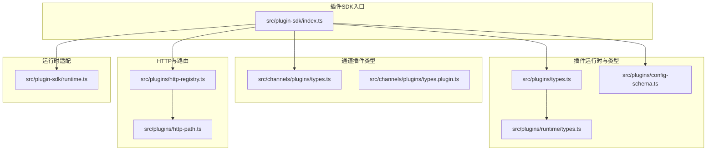
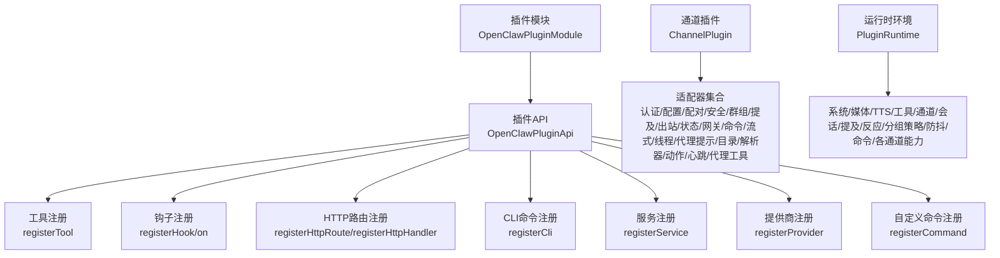
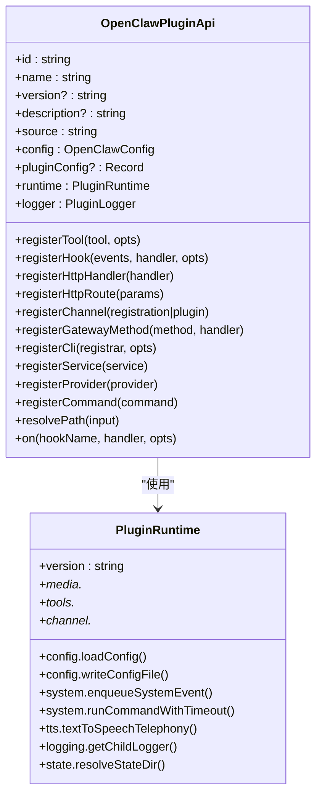
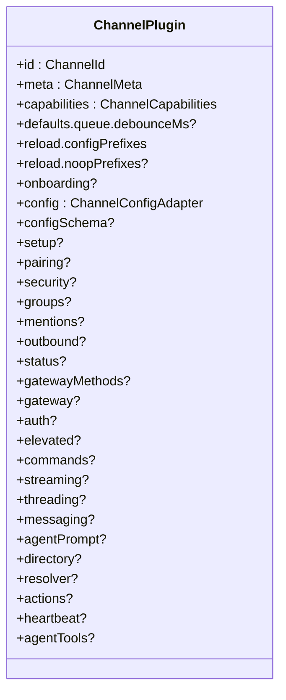
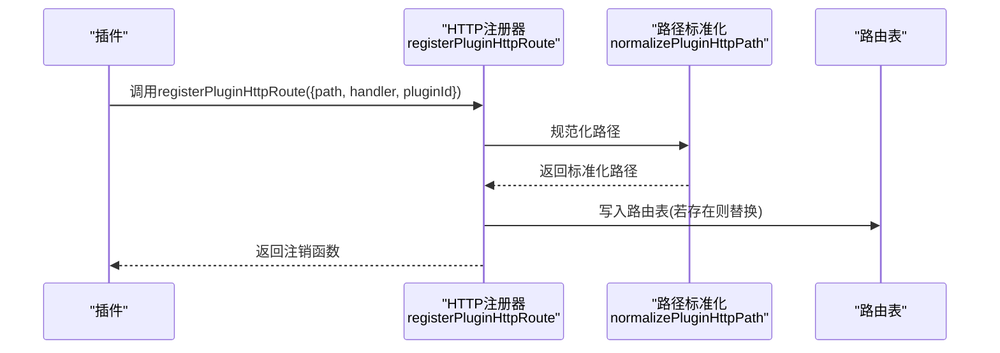
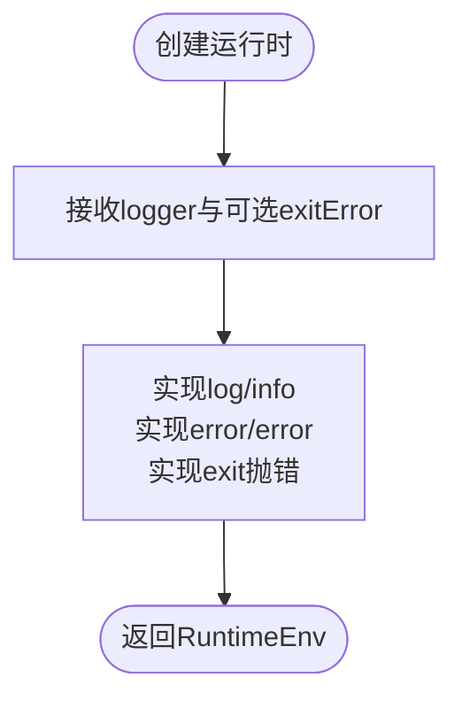
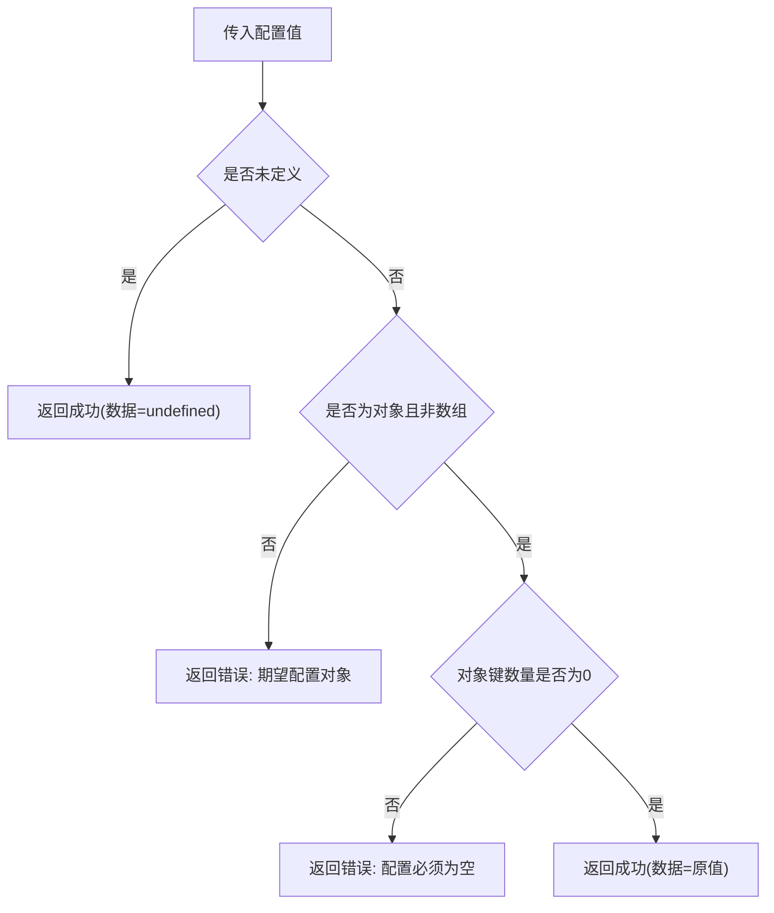
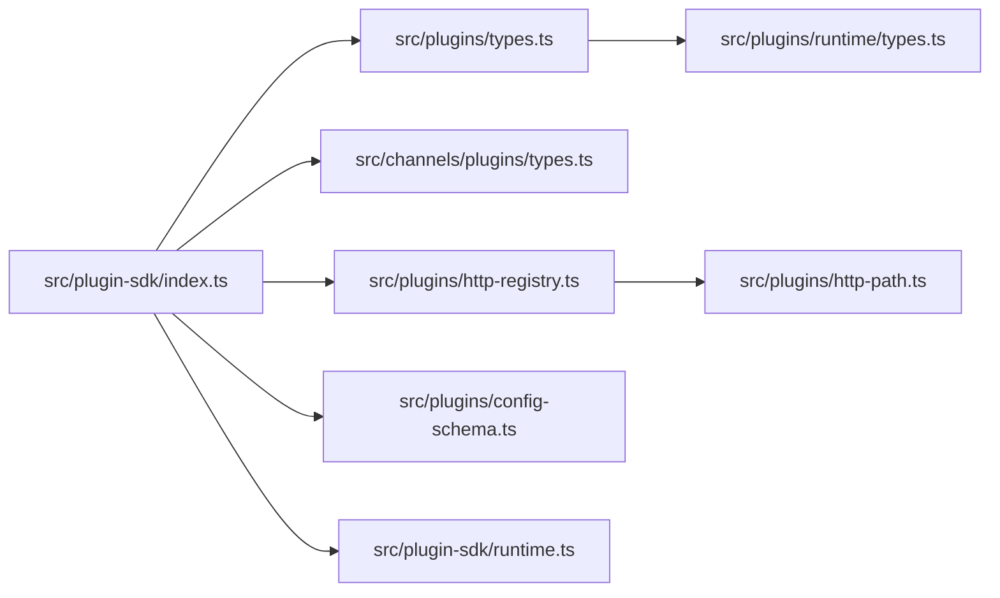

# 插件SDK

<cite>
**本文引用的文件**
- [src/plugin-sdk/index.ts](file://src/plugin-sdk/index.ts)
- [src/plugins/types.ts](file://src/plugins/types.ts)
- [src/channels/plugins/types.ts](file://src/channels/plugins/types.ts)
- [src/channels/plugins/types.plugin.ts](file://src/channels/plugins/types.plugin.ts)
- [src/plugin-sdk/runtime.ts](file://src/plugin-sdk/runtime.ts)
- [src/plugins/runtime/types.ts](file://src/plugins/runtime/types.ts)
- [src/plugins/config-schema.ts](file://src/plugins/config-schema.ts)
- [src/plugins/http-registry.ts](file://src/plugins/http-registry.ts)
- [src/plugins/http-path.ts](file://src/plugins/http-path.ts)
- [scripts/write-plugin-sdk-entry-dts.ts](file://scripts/write-plugin-sdk-entry-dts.ts)
</cite>

## 目录

1. [简介](#简介)
2. [项目结构](#项目结构)
3. [核心组件](#核心组件)
4. [架构总览](#架构总览)
5. [详细组件分析](#详细组件分析)
6. [依赖关系分析](#依赖关系分析)
7. [性能考量](#性能考量)
8. [故障排查指南](#故障排查指南)
9. [结论](#结论)
10. [附录](#附录)

## 简介

本文件面向OpenClaw插件开发者，系统化阐述插件SDK的架构设计、开发接口与扩展机制，覆盖插件注册、生命周期管理、依赖注入、安全模型与权限控制、发布与版本兼容等主题，并提供可操作的开发模板、工具与调试方法。

## 项目结构

OpenClaw的插件SDK位于src/plugin-sdk目录，通过统一入口导出能力，同时在src/plugins下提供插件运行时、配置模式、HTTP路由注册等基础设施；通道插件（ChannelPlugin）的类型定义位于src/channels/plugins目录，用于对接具体消息通道。

**图示来源**

- [src/plugin-sdk/index.ts](file://src/plugin-sdk/index.ts#L1-L597)
- [src/plugins/types.ts](file://src/plugins/types.ts#L1-L764)
- [src/plugins/runtime/types.ts](file://src/plugins/runtime/types.ts#L1-L375)
- [src/channels/plugins/types.ts](file://src/channels/plugins/types.ts#L1-L66)
- [src/channels/plugins/types.plugin.ts](file://src/channels/plugins/types.plugin.ts#L1-L86)
- [src/plugins/http-path.ts](file://src/plugins/http-path.ts#L1-L15)
- [src/plugins/http-registry.ts](file://src/plugins/http-registry.ts#L1-L54)
- [src/plugin-sdk/runtime.ts](file://src/plugin-sdk/runtime.ts#L1-L25)

**章节来源**

- [src/plugin-sdk/index.ts](file://src/plugin-sdk/index.ts#L1-L597)

## 核心组件

- 插件API与生命周期：OpenClawPluginApi提供注册工具、钩子、HTTP路由、CLI命令、服务、提供商与命令等能力，并支持生命周期钩子注册。
- 插件类型与运行时：OpenClawPluginDefinition/OpenClawPluginModule定义插件声明与模块形式；PluginRuntime封装系统、媒体、TTS、工具、通道、会话、提及、反应、分组策略、防抖、命令、各通道能力等。
- 通道插件：ChannelPlugin抽象消息通道能力，包含认证、配置、配对、安全、群组、提及、出站、状态、网关方法、提升权限、命令、流式、线程、代理提示、目录、解析器、动作、心跳、代理工具等。
- 配置模式：emptyPluginConfigSchema提供空配置校验与JSON Schema骨架，便于插件快速声明配置。
- HTTP路由：normalizePluginHttpPath标准化路径，registerPluginHttpRoute注册并支持替换与注销。
- 运行时适配：createLoggerBackedRuntime将外部日志桥接到运行时环境。

**章节来源**

- [src/plugins/types.ts](file://src/plugins/types.ts#L230-L284)
- [src/plugins/runtime/types.ts](file://src/plugins/runtime/types.ts#L188-L375)
- [src/channels/plugins/types.plugin.ts](file://src/channels/plugins/types.plugin.ts#L49-L85)
- [src/plugins/config-schema.ts](file://src/plugins/config-schema.ts#L13-L33)
- [src/plugins/http-path.ts](file://src/plugins/http-path.ts#L1-L15)
- [src/plugins/http-registry.ts](file://src/plugins/http-registry.ts#L11-L53)
- [src/plugin-sdk/runtime.ts](file://src/plugin-sdk/runtime.ts#L9-L24)

## 架构总览

OpenClaw插件SDK采用“统一入口导出 + 分层能力模块”的设计：

- 入口层：src/plugin-sdk/index.ts集中导出插件SDK能力，包括通道类型、运行时、HTTP工具、状态辅助、鉴权结果构建、分组策略、配置Schema、SSRF策略、抓取认证、临时路径、持久化去重、文本切分、回复载荷、Webhook目标解析、设备配对、诊断事件、媒体工具、安全脱敏等。
- 插件层：插件通过OpenClawPluginApi注册工具、钩子、HTTP路由、CLI命令、服务、提供商与命令；生命周期钩子贯穿会话、消息、工具调用、网关启停等阶段。
- 通道层：ChannelPlugin以适配器模式对接不同消息通道，统一暴露认证、配置、配对、安全、群组、提及、出站、状态、网关方法、命令、流式、线程、代理提示、目录、解析器、动作、心跳、代理工具等能力。
- 基础设施层：HTTP路由注册、路径标准化、运行时适配、配置Schema、SSRF策略、抓取认证、临时路径、持久化去重、文本切分、回复载荷、Webhook目标解析等。

**图示来源**

- [src/plugins/types.ts](file://src/plugins/types.ts#L245-L284)
- [src/channels/plugins/types.plugin.ts](file://src/channels/plugins/types.plugin.ts#L49-L85)
- [src/plugins/runtime/types.ts](file://src/plugins/runtime/types.ts#L188-L375)

## 详细组件分析

### 组件A：插件API与生命周期

- 能力清单
  - 工具注册：registerTool支持直接工具或工厂函数，支持多工具返回。
  - 钩子注册：registerHook与on分别注册内部事件与生命周期钩子，支持优先级。
  - HTTP：registerHttpHandler与registerHttpRoute注册处理器与路径。
  - CLI：registerCli注册命令行子命令。
  - 服务：registerService注册长驻服务，含start/stop。
  - 提供商：registerProvider注册第三方提供商（OAuth/API Key等），支持凭据刷新与默认模型。
  - 自定义命令：registerCommand注册绕过LLM的简单命令。
  - 路径解析：resolvePath。
- 生命周期钩子
  - 模型解析前、提示构建前、代理开始前、LLM输入/输出、代理结束、压缩前后、重置前、消息收发送/已发送、工具调用前后、工具结果持久化、消息写入前、会话开始/结束、子代理生成/投递/已生成/结束、网关启动/停止等。
- 上下文
  - OpenClawPluginToolContext、OpenClawPluginServiceContext、OpenClawPluginCliContext等上下文对象承载运行期信息。

**图示来源**

- [src/plugins/types.ts](file://src/plugins/types.ts#L245-L284)
- [src/plugins/runtime/types.ts](file://src/plugins/runtime/types.ts#L188-L375)

**章节来源**

- [src/plugins/types.ts](file://src/plugins/types.ts#L230-L284)
- [src/plugins/runtime/types.ts](file://src/plugins/runtime/types.ts#L188-L375)

### 组件B：通道插件（ChannelPlugin）

- 设计要点
  - ChannelPlugin以适配器模式组织能力，如认证、配置、配对、安全、群组、提及、出站、状态、网关方法、提升权限、命令、流式、线程、代理提示、目录、解析器、动作、心跳、代理工具等。
  - 支持默认队列去抖参数、配置热加载前缀、UI提示等。
- 典型能力
  - 认证与授权：ChannelAuthAdapter、ProviderAuthMethod。
  - 出站消息：ChannelOutboundAdapter、ChannelOutboundContext、ChannelOutboundTargetMode。
  - 群组与提及：ChannelGroupAdapter、ChannelMentionAdapter。
  - 线程与代理提示：ChannelThreadingAdapter、ChannelAgentPromptAdapter。
  - 目录与解析：ChannelDirectoryAdapter、ChannelResolverAdapter。
  - 心跳与动作：ChannelHeartbeatAdapter、ChannelMessageActionAdapter。
  - 代理工具：ChannelAgentTool/ChannelAgentToolFactory。

**图示来源**

- [src/channels/plugins/types.plugin.ts](file://src/channels/plugins/types.plugin.ts#L49-L85)

**章节来源**

- [src/channels/plugins/types.plugin.ts](file://src/channels/plugins/types.plugin.ts#L1-L86)
- [src/channels/plugins/types.ts](file://src/channels/plugins/types.ts#L1-L66)

### 组件C：HTTP路由注册与路径标准化

- normalizePluginHttpPath：标准化路径，自动补全前缀斜杠。
- registerPluginHttpRoute：注册HTTP路由，支持重复路径替换、账户维度区分、返回注销函数。

**图示来源**

- [src/plugins/http-registry.ts](file://src/plugins/http-registry.ts#L11-L53)
- [src/plugins/http-path.ts](file://src/plugins/http-path.ts#L1-L15)

**章节来源**

- [src/plugins/http-registry.ts](file://src/plugins/http-registry.ts#L1-L54)
- [src/plugins/http-path.ts](file://src/plugins/http-path.ts#L1-L15)

### 组件D：运行时适配与日志桥接

- createLoggerBackedRuntime：将外部Logger桥接为运行时RuntimeEnv，统一log/error/exit语义，便于插件在不同宿主中复用运行时能力。

**图示来源**

- [src/plugin-sdk/runtime.ts](file://src/plugin-sdk/runtime.ts#L9-L24)

**章节来源**

- [src/plugin-sdk/runtime.ts](file://src/plugin-sdk/runtime.ts#L1-L25)

### 组件E：配置Schema与校验

- emptyPluginConfigSchema：提供空配置的safeParse与JSON Schema，确保插件配置对象类型正确且无多余字段。

**图示来源**

- [src/plugins/config-schema.ts](file://src/plugins/config-schema.ts#L13-L33)

**章节来源**

- [src/plugins/config-schema.ts](file://src/plugins/config-schema.ts#L1-L34)

## 依赖关系分析

- 入口导出依赖
  - src/plugin-sdk/index.ts导出大量类型与工具，涵盖通道类型、运行时、HTTP工具、状态辅助、鉴权结果构建、分组策略、配置Schema、SSRF策略、抓取认证、临时路径、持久化去重、文本切分、回复载荷、Webhook目标解析、设备配对、诊断事件、媒体工具、安全脱敏等。
- 插件API依赖
  - OpenClawPluginApi依赖PluginRuntime与OpenClawConfig，通过register系列方法连接工具、钩子、HTTP、CLI、服务、提供商与命令。
- 通道插件依赖
  - ChannelPlugin依赖各适配器类型，形成松耦合的通道能力组合。
- 基础设施依赖
  - HTTP路由注册依赖路径标准化；运行时适配依赖日志桥接；配置Schema依赖类型系统。

**图示来源**

- [src/plugin-sdk/index.ts](file://src/plugin-sdk/index.ts#L1-L597)
- [src/plugins/types.ts](file://src/plugins/types.ts#L1-L764)
- [src/channels/plugins/types.ts](file://src/channels/plugins/types.ts#L1-L66)
- [src/plugins/http-registry.ts](file://src/plugins/http-registry.ts#L1-L54)
- [src/plugins/http-path.ts](file://src/plugins/http-path.ts#L1-L15)
- [src/plugin-sdk/runtime.ts](file://src/plugin-sdk/runtime.ts#L1-L25)
- [src/plugins/runtime/types.ts](file://src/plugins/runtime/types.ts#L1-L375)
- [src/plugins/config-schema.ts](file://src/plugins/config-schema.ts#L1-L34)

**章节来源**

- [src/plugin-sdk/index.ts](file://src/plugin-sdk/index.ts#L1-L597)

## 性能考量

- 路由注册与替换
  - registerPluginHttpRoute在重复路径时进行替换，避免路由表膨胀，建议插件在动态路径场景中合理规划路径命名与生命周期。
- 文本切分与分组策略
  - 使用chunkTextForOutbound与resolveRuntimeGroupPolicy等工具时，注意批量处理与缓存策略，减少重复计算。
- 会话与历史
  - 利用会话存储路径与更新策略，避免频繁磁盘IO；在压缩与清理阶段异步处理历史文件，降低阻塞。
- 日志与诊断
  - 使用getChildLogger按域隔离日志，结合诊断事件系统定位性能瓶颈。

[本节为通用指导，无需列出具体文件来源]

## 故障排查指南

- HTTP路由问题
  - 若路由未生效，检查路径是否被标准化、是否存在重复注册导致的替换、是否传入了账户维度参数。
- 配置Schema校验失败
  - 使用emptyPluginConfigSchema作为基座，逐步添加字段并验证JSON Schema，关注错误路径与提示信息。
- 钩子未触发
  - 确认钩子名称拼写正确、优先级设置合理、事件上下文与会话状态满足触发条件。
- 运行时日志缺失
  - 使用createLoggerBackedRuntime桥接日志，确认logger实现与级别配置。

**章节来源**

- [src/plugins/http-registry.ts](file://src/plugins/http-registry.ts#L20-L53)
- [src/plugins/config-schema.ts](file://src/plugins/config-schema.ts#L13-L33)
- [src/plugin-sdk/runtime.ts](file://src/plugin-sdk/runtime.ts#L9-L24)

## 结论

OpenClaw Plugin SDK通过统一入口导出、清晰的插件API与运行时、灵活的通道适配器以及完善的基础设施，为开发者提供了高扩展性与强一致性的插件开发框架。遵循本文档的接口定义、生命周期管理与最佳实践，可高效构建稳定、可维护的插件生态。

## 附录

### A. 插件开发模板与步骤

- 创建插件模块
  - 定义OpenClawPluginDefinition或函数式模块，实现register/activate回调。
- 注册能力
  - 在activate中通过OpenClawPluginApi注册工具、钩子、HTTP路由、CLI命令、服务、提供商与命令。
- 配置Schema
  - 使用emptyPluginConfigSchema作为起点，逐步完善JSON Schema与UI提示。
- 通道集成
  - 如需接入消息通道，实现ChannelPlugin并填充所需适配器。
- 发布与版本
  - 参考打包脚本生成稳定的类型入口，确保导出映射与声明文件一致。

**章节来源**

- [src/plugins/types.ts](file://src/plugins/types.ts#L230-L284)
- [src/plugins/config-schema.ts](file://src/plugins/config-schema.ts#L13-L33)
- [src/channels/plugins/types.plugin.ts](file://src/channels/plugins/types.plugin.ts#L49-L85)
- [scripts/write-plugin-sdk-entry-dts.ts](file://scripts/write-plugin-sdk-entry-dts.ts#L9-L15)

### B. 开发工具与调试方法

- 类型入口生成
  - 使用scripts/write-plugin-sdk-entry-dts.ts生成稳定类型入口，确保NodeNext解析到.js声明。
- 日志与诊断
  - 使用getChildLogger按域隔离日志；结合诊断事件系统记录关键流程。
- 运行时适配
  - 使用createLoggerBackedRuntime桥接外部日志，统一运行时行为。

**章节来源**

- [scripts/write-plugin-sdk-entry-dts.ts](file://scripts/write-plugin-sdk-entry-dts.ts#L1-L16)
- [src/plugins/runtime/types.ts](file://src/plugins/runtime/types.ts#L364-L370)
- [src/plugin-sdk/runtime.ts](file://src/plugin-sdk/runtime.ts#L9-L24)

### C. 安全模型、权限控制与沙箱机制

- SSRF防护
  - 使用SSRF策略工具与fetchWithSsrFGuard限制私有地址与主机名后缀白名单。
- 访问控制
  - 使用allow-from与分组策略解析工具，结合sender授权与命令授权门禁。
- Webhook安全
  - 使用Webhook目标解析与请求体限制工具，防止过大或非法请求。
- 临时文件与持久化去重
  - 使用临时路径工具与持久化去重，避免重复处理与资源泄露。

**章节来源**

- [src/plugin-sdk/index.ts](file://src/plugin-sdk/index.ts#L279-L301)
- [src/plugin-sdk/index.ts](file://src/plugin-sdk/index.ts#L289-L301)
- [src/plugin-sdk/index.ts](file://src/plugin-sdk/index.ts#L212-L218)
- [src/plugin-sdk/index.ts](file://src/plugin-sdk/index.ts#L266-L271)

### D. 发布、版本管理与兼容性

- 类型入口
  - 通过write-plugin-sdk-entry-dts.ts生成稳定导出，保证dist与src目录结构一致性。
- 版本与兼容
  - 在插件定义中声明version，结合生命周期钩子与配置Schema演进，确保向后兼容。

**章节来源**

- [scripts/write-plugin-sdk-entry-dts.ts](file://scripts/write-plugin-sdk-entry-dts.ts#L9-L15)
- [src/plugins/types.ts](file://src/plugins/types.ts#L234-L239)
