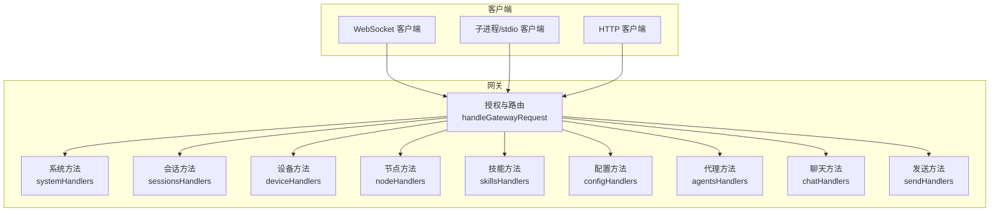
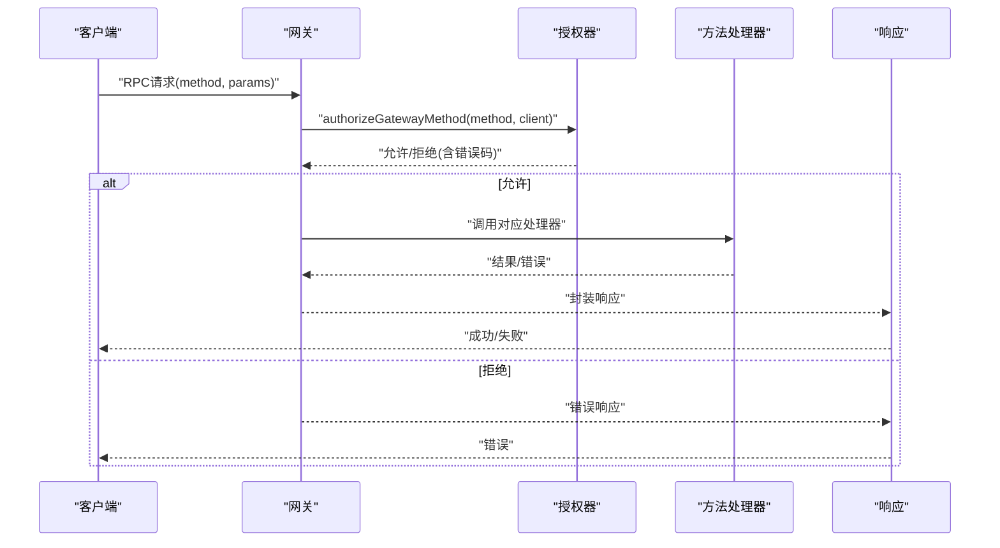
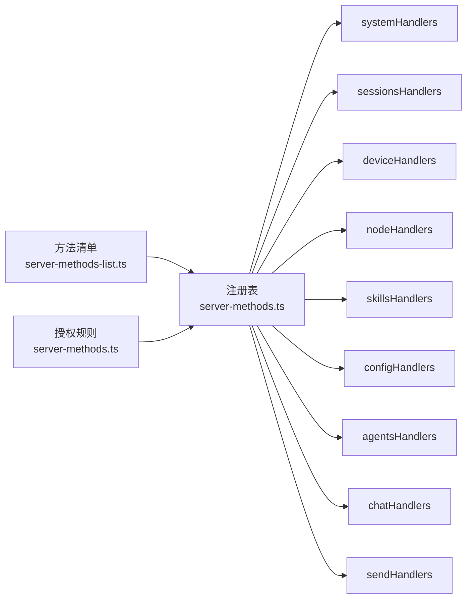

# RPC方法参考

<cite>
**本文档引用的文件**
- [docs/reference/rpc.md](file://docs/reference/rpc.md)
- [src/gateway/server-methods-list.ts](file://src/gateway/server-methods-list.ts)
- [src/gateway/server-methods.ts](file://src/gateway/server-methods.ts)
- [src/gateway/server-methods/system.ts](file://src/gateway/server-methods/system.ts)
- [src/gateway/server-methods/sessions.ts](file://src/gateway/server-methods/sessions.ts)
- [src/gateway/server-methods/devices.ts](file://src/gateway/server-methods/devices.ts)
- [src/gateway/server-methods/skills.ts](file://src/gateway/server-methods/skills.ts)
- [src/gateway/server-methods/agents.ts](file://src/gateway/server-methods/agents.ts)
- [src/gateway/server-methods/config.ts](file://src/gateway/server-methods/config.ts)
- [src/gateway/server-methods/nodes.ts](file://src/gateway/server-methods/nodes.ts)
- [src/gateway/server-methods/chat.ts](file://src/gateway/server-methods/chat.ts)
- [src/gateway/server-methods/send.ts](file://src/gateway/server-methods/send.ts)
- [src/gateway/protocol/schema.ts](file://src/gateway/protocol/schema.ts)
- [apps/shared/OpenClawKit/Sources/OpenClawKit/GatewayChannel.swift](file://apps/shared/OpenClawKit/Sources/OpenClawKit/GatewayChannel.swift)
- [apps/shared/OpenClawKit/Sources/OpenClawKit/BridgeFrames.swift](file://apps/shared/OpenClawKit/Sources/OpenClawKit/BridgeFrames.swift)
- [src/gateway/client.ts](file://src/gateway/client.ts)
</cite>

## 目录

1. [简介](#简介)
2. [项目结构](#项目结构)
3. [核心组件](#核心组件)
4. [架构总览](#架构总览)
5. [详细组件分析](#详细组件分析)
6. [依赖关系分析](#依赖关系分析)
7. [性能考量](#性能考量)
8. [故障排查指南](#故障排查指南)
9. [结论](#结论)
10. [附录](#附录)

## 简介

本参考文档面向OpenClaw网关（Gateway）暴露的所有RPC方法，覆盖系统管理、会话控制、设备与节点配对、插件与技能、配置管理、消息发送与聊天、代理与代理组等主要功能域。文档提供方法分类清单、参数与返回结构、错误码、调用权限与作用域、异步处理与状态更新机制，并给出最佳实践与性能建议。

## 项目结构

OpenClaw的RPC方法由服务端统一注册与授权，客户端通过WebSocket或子进程/HTTP桥接与网关交互。核心结构如下：

- 方法清单与事件：集中于方法列表与事件常量
- 授权与路由：统一在请求处理器中进行角色与作用域校验
- 功能分层：系统、会话、设备/节点、技能、配置、聊天、发送等模块化实现
- 协议与模型：通过协议层导出的模式与类型保障一致性

图表来源

- [src/gateway/server-methods-list.ts](file://src/gateway/server-methods-list.ts#L1-L118)
- [src/gateway/server-methods.ts](file://src/gateway/server-methods.ts#L165-L219)

章节来源

- [src/gateway/server-methods-list.ts](file://src/gateway/server-methods-list.ts#L1-L118)
- [src/gateway/server-methods.ts](file://src/gateway/server-methods.ts#L165-L219)

## 核心组件

- 方法注册与事件
  - 基础方法集合与通道插件扩展方法合并去重
  - 事件类型集中定义
- 授权与作用域
  - 角色：operator（默认）、node
  - 作用域：operator.admin、operator.read、operator.write、operator.approvals、operator.pairing
  - 部分方法前缀或特定方法需要特定作用域
- 请求处理流程
  - 授权检查
  - 路由到具体处理器
  - 参数校验与业务执行
  - 统一响应封装

章节来源

- [src/gateway/server-methods-list.ts](file://src/gateway/server-methods-list.ts#L1-L118)
- [src/gateway/server-methods.ts](file://src/gateway/server-methods.ts#L29-L163)

## 架构总览

下图展示从客户端到方法处理器的整体调用链路与关键错误路径。

图表来源

- [src/gateway/server-methods.ts](file://src/gateway/server-methods.ts#L193-L219)

章节来源

- [src/gateway/server-methods.ts](file://src/gateway/server-methods.ts#L193-L219)

## 详细组件分析

### 系统管理

- 方法清单
  - system-presence：查询系统存在性信息
  - system-event：上报系统事件并广播存在性变更
  - set-heartbeats：启用/禁用心跳
  - last-heartbeat：获取最近心跳事件
- 权限与作用域
  - 默认仅operator角色可调用；部分方法需operator.admin
- 参数与返回
  - system-presence：无参数，返回系统存在性列表
  - system-event：必填text；可选deviceId、instanceId、host、ip、mode、version、platform、deviceFamily、modelIdentifier、lastInputSeconds、reason、roles、scopes、tags；返回ok
  - set-heartbeats：必填enabled（布尔）；返回ok与enabled
  - last-heartbeat：返回最近心跳事件
- 错误码
  - INVALID_REQUEST：参数无效
- 异步与状态
  - system-event会根据上下文变化触发系统事件与存在性版本广播

章节来源

- [src/gateway/server-methods/system.ts](file://src/gateway/server-methods/system.ts#L9-L140)

### 会话控制

- 方法清单
  - sessions.list：列出会话（支持过滤与分页）
  - sessions.preview：预览会话摘要（限制数量与字符数）
  - sessions.resolve：解析会话键
  - sessions.patch：原子性更新会话条目
  - sessions.reset：重置会话（生成新sessionId）
  - sessions.delete：删除会话（保留至少一个）
  - sessions.compact：压缩会话转录（保留尾部行数）
- 权限与作用域
  - 读取：operator.read
  - 写入：operator.write
  - 部分操作需operator.admin
- 参数与返回
  - sessions.list：支持limit、offset、agentId、channel、status等；返回列表与总数
  - sessions.preview：必填keys数组；返回时间戳与预览项数组
  - sessions.resolve：必填键；返回解析后的标准键
  - sessions.patch：必填key与补丁；返回存储路径、标准键、条目与模型解析结果
  - sessions.reset：必填key；返回标准键与新条目
  - sessions.delete：必填key；可选deleteTranscript；返回删除状态与归档文件列表
  - sessions.compact：必填key与maxLines；返回是否压缩、保留行数与归档路径
- 错误码
  - INVALID_REQUEST：参数无效或最后会话不可删除
  - UNAVAILABLE：会话仍活跃导致无法删除
- 异步与状态
  - 删除会话时清理队列、停止子代理、等待嵌入式运行结束

章节来源

- [src/gateway/server-methods/sessions.ts](file://src/gateway/server-methods/sessions.ts#L44-L489)

### 设备管理

- 方法清单
  - device.pair.list：列出待审批/已配对设备
  - device.pair.approve：批准设备配对请求
  - device.pair.reject：拒绝设备配对请求
  - device.token.rotate：轮换设备令牌
  - device.token.revoke：吊销设备令牌
- 权限与作用域
  - operator.pairing
- 参数与返回
  - device.pair.list：返回pending与paired列表（令牌摘要）
  - device.pair.approve：必填requestId；返回决策与设备摘要
  - device.pair.reject：必填requestId；返回拒绝信息
  - device.token.rotate：必填deviceId、role；可选scopes；返回新令牌与元数据
  - device.token.revoke：必填deviceId、role；返回吊销时间
- 错误码
  - INVALID_REQUEST：未知requestId或未知deviceId/role
- 异步与状态
  - 批准/拒绝后广播device.pair.resolved事件

章节来源

- [src/gateway/server-methods/devices.ts](file://src/gateway/server-methods/devices.ts#L32-L190)

### 节点管理

- 方法清单
  - node.pair.request：发起节点配对请求
  - node.pair.list：列出节点配对状态
  - node.pair.approve：批准节点配对
  - node.pair.reject：拒绝节点配对
  - node.pair.verify：校验节点令牌
  - node.rename：重命名已配对节点
  - node.list：列出节点（结合配对与连接状态）
  - node.describe：描述单个节点
  - node.invoke：向节点发起命令调用（带幂等键）
  - node.invoke.result：上报节点调用结果
  - node.event：上报节点事件
- 权限与作用域
  - operator.pairing
  - node.invoke：仅node角色可调用其结果上报
- 参数与返回
  - node.pair.request：必填nodeId等；返回请求状态与创建时间
  - node.list/describe：返回节点能力、命令、权限、连接状态等
  - node.invoke：必填nodeId、command、idempotencyKey；可选params、timeoutMs；返回payload或payloadJSON
  - node.invoke.result：必填id、nodeId、ok；可选payload/payloadJSON/error；返回ok或忽略标记
  - node.event：必填event；可选payload/payloadJSON；返回ok
- 错误码
  - INVALID_REQUEST：参数无效、nodeId缺失、命令未允许、nodeId不匹配、未连接
  - UNAVAILABLE：节点未连接或调用失败
- 异步与状态
  - invoke使用幂等键避免重复；结果晚到按预期忽略

章节来源

- [src/gateway/server-methods/nodes.ts](file://src/gateway/server-methods/nodes.ts#L65-L537)

### 技能管理

- 方法清单
  - skills.status：查询工作区技能状态
  - skills.bins：收集所有技能声明的二进制依赖
  - skills.install：安装技能（支持超时）
  - skills.update：更新技能配置（启用/禁用、密钥、环境变量）
  - skills.file.get/set：读写工作区/受管技能文件（受目录限制）
- 权限与作用域
  - 读取：operator.read
  - 写入：operator.write
- 参数与返回
  - skills.status：可选agentId；返回技能报告
  - skills.bins：返回去重后的二进制清单
  - skills.install：必填name、installId；可选timeoutMs；返回安装结果
  - skills.update：必填skillKey；可选enabled、apiKey、env；返回更新后的配置
  - skills.file.get/set：必填skillKey；get返回内容与可编辑性；set返回写入路径
- 错误码
  - INVALID_REQUEST：未知agentId、不支持的文件名、路径越权
  - NOT_FOUND：技能或文件不存在
  - PERMISSION_DENIED：禁止编辑捆绑技能或路径越权
  - UNAVAILABLE：读写失败
- 异步与状态
  - 更新配置后写回配置文件

章节来源

- [src/gateway/server-methods/skills.ts](file://src/gateway/server-methods/skills.ts#L74-L340)

### 配置管理

- 方法清单
  - config.get：获取当前配置快照（脱敏）
  - config.schema：构建含插件与通道的配置模式
  - config.set：设置原始JSON（需baseHash）
  - config.patch：合并补丁（需baseHash）
  - config.apply：应用原始JSON（需baseHash）
- 权限与作用域
  - operator.admin
- 参数与返回
  - config.get：返回脱敏快照与哈希
  - config.schema：返回插件与通道的JSON Schema
  - config.set/patch/apply：返回写入路径、脱敏配置与重启计划（可选）
- 错误码
  - INVALID_REQUEST：缺少baseHash、快照不可用、JSON无效、配置非法
- 异步与状态
  - 写入后调度重启并写入重启哨兵

章节来源

- [src/gateway/server-methods/config.ts](file://src/gateway/server-methods/config.ts#L94-L460)

### 代理管理

- 方法清单
  - agents.list：列出代理
  - agents.create：创建代理（含名称、头像、模型等）
  - agents.update：更新代理（名称、工作区、模型、头像）
  - agents.delete：删除代理（可选删除文件）
  - agents.files.list/get/set：代理工作区文件管理
- 权限与作用域
  - 读取：operator.read
  - 写入：operator.write
- 参数与返回
  - agents.create：必填name；可选workspace、emoji、avatar；返回agentId等
  - agents.update：必填agentId；可选name、workspace、model、avatar；返回ok
  - agents.delete：必填agentId；可选deleteFiles；返回移除绑定
  - agents.files.\*：返回文件元信息与内容
- 错误码
  - INVALID_REQUEST：保留ID、已存在、未知ID、不支持文件名
  - UNAVAILABLE：文件操作失败
- 异步与状态
  - 创建/更新写回配置文件；删除可移动至回收站

章节来源

- [src/gateway/server-methods/agents.ts](file://src/gateway/server-methods/agents.ts#L167-L507)

### 聊天与消息

- 方法清单
  - chat.history：获取会话历史（限制字节）
  - chat.abort：中止会话内运行（按runId或整体会话）
  - chat.send：发送消息（支持附件、幂等键、思考注入）
  - chat.inject：向会话注入助手消息（用于调试/引导）
- 权限与作用域
  - 读取：operator.read
  - 写入：operator.write
- 参数与返回
  - chat.history：必填sessionKey；可选limit；返回消息列表与思维/详细级别
  - chat.abort：可选sessionKey与runId；返回aborted与runIds
  - chat.send：必填sessionKey、message；可选thinking、deliver、attachments、timeoutMs、idempotencyKey；返回runId状态或最终消息
  - chat.inject：必填sessionKey、message；可选label；返回消息ID
- 错误码
  - INVALID_REQUEST：消息/附件为空、会话策略拒绝、runId不匹配
  - UNAVAILABLE：派发失败
- 异步与状态
  - send使用去重缓存与飞行中并发控制；广播chat事件（final/error）

章节来源

- [src/gateway/server-methods/chat.ts](file://src/gateway/server-methods/chat.ts#L259-L784)

### 发送与轮询

- 方法清单
  - send：发送文本/媒体消息（支持镜像到会话）
  - poll：发送投票消息（各通道支持度不同）
- 权限与作用域
  - 写入：operator.write
- 参数与返回
  - send：必填to、message/media；可选channel/accountId/sessionKey/gifPlayback/idempotencyKey；返回runId、messageId、channel等
  - poll：必填to、question、options；可选maxSelections、durationHours、channel/accountId/idempotencyKey；返回runId、messageId、channel等
- 错误码
  - INVALID_REQUEST：文本/媒体缺失、通道不支持、目标解析失败
  - UNAVAILABLE：投递失败
- 异步与状态
  - send使用去重与飞行中并发控制；poll同理

章节来源

- [src/gateway/server-methods/send.ts](file://src/gateway/server-methods/send.ts#L45-L380)

### 客户端适配与桥接

- WebSocket客户端选项与关闭码语义
  - 支持url、token、密码、实例ID、客户端信息、平台、模式、角色、作用域、能力、命令、权限、设备身份、协议范围、TLS指纹等
  - 关闭码含义：正常关闭、异常关闭、策略违规、服务重启
- 网关桥接帧
  - RPC响应包含type、id、ok、payloadJSON、error字段
- Swift网关通道
  - request：编码请求、超时、挂起等待、失败重连
  - send：单向发送、异常断开与重连
  - 编码：ProtoAnyCodable包装参数，避免桥接陷阱

章节来源

- [src/gateway/client.ts](file://src/gateway/client.ts#L35-L77)
- [apps/shared/OpenClawKit/Sources/OpenClawKit/BridgeFrames.swift](file://apps/shared/OpenClawKit/Sources/OpenClawKit/BridgeFrames.swift#L241-L261)
- [apps/shared/OpenClawKit/Sources/OpenClawKit/GatewayChannel.swift](file://apps/shared/OpenClawKit/Sources/OpenClawKit/GatewayChannel.swift#L595-L736)

## 依赖关系分析

- 方法注册依赖
  - 基础方法集合与通道插件方法合并，去重后统一注册
- 授权依赖
  - 角色与作用域映射到方法白名单与前缀规则
- 处理器依赖
  - 各模块处理器独立实现，共享协议层错误与校验工具
- 协议与模式
  - 通过协议层导出的模式与类型保障参数与响应一致性

图表来源

- [src/gateway/server-methods-list.ts](file://src/gateway/server-methods-list.ts#L93-L96)
- [src/gateway/server-methods.ts](file://src/gateway/server-methods.ts#L165-L191)

章节来源

- [src/gateway/server-methods-list.ts](file://src/gateway/server-methods-list.ts#L93-L96)
- [src/gateway/server-methods.ts](file://src/gateway/server-methods.ts#L165-L191)

## 性能考量

- 幂等与去重
  - send/chat使用幂等键去重，避免重复投递与重复处理
- 飞行中并发
  - send维护飞行中请求映射，相同幂等键并发请求共享同一结果
- 会话压缩
  - sessions.compact按行数裁剪转录，减少I/O与内存占用
- 广播优化
  - 存在性广播携带版本号，支持丢弃过慢消息以降低拥塞
- 超时与重试
  - 网关通道支持超时与断线重连，提升鲁棒性

[本节为通用指导，无需代码来源]

## 故障排查指南

- 常见错误码
  - INVALID_REQUEST：参数校验失败、作用域不足、最后会话不可删除、通道不支持、目标解析失败
  - UNAVAILABLE：节点未连接、投递失败、会话仍活跃、文件读写失败
  - NOT_FOUND：技能或文件不存在
  - PERMISSION_DENIED：禁止编辑捆绑技能或路径越权
- 授权问题
  - 确认客户端角色与作用域；admin相关方法需operator.admin
- 会话问题
  - 删除会话前确保非最后会话；若提示仍活跃，稍后再试
- 节点调用
  - 确保节点已连接且命令在允许列表；核对幂等键与nodeId一致性
- 配置变更
  - 使用config.get获取baseHash后进行config.set/patch/apply；修复非法配置后再patch

章节来源

- [src/gateway/server-methods.ts](file://src/gateway/server-methods.ts#L93-L163)
- [src/gateway/server-methods/sessions.ts](file://src/gateway/server-methods/sessions.ts#L273-L370)
- [src/gateway/server-methods/nodes.ts](file://src/gateway/server-methods/nodes.ts#L451-L490)
- [src/gateway/server-methods/config.ts](file://src/gateway/server-methods/config.ts#L48-L92)

## 结论

OpenClaw网关通过清晰的角色与作用域授权、模块化的处理器设计、完善的参数校验与错误码体系，提供了稳定可靠的RPC方法集。配合去重、飞行中并发控制、会话压缩与广播版本机制，整体具备良好的性能与可维护性。建议在生产环境中严格遵循权限与作用域约束，并利用幂等键与超时机制提升可靠性。

[本节为总结，无需代码来源]

## 附录

- 方法分类速览（基于server-methods-list.ts）
  - 健康与日志、通道状态、状态查询、用量统计、TTS、配置、执行审批、向导、说话模式、模型、代理、技能、更新、语音唤醒、会话、心跳、节点配对、设备配对、节点重命名、节点列表/描述、节点调用、节点事件、定时任务、系统事件、聊天历史/中止/发送/注入
- 协议与模式
  - 通过协议层导出的模式与类型保障参数与响应一致性

章节来源

- [src/gateway/server-methods-list.ts](file://src/gateway/server-methods-list.ts#L3-L96)
- [src/gateway/protocol/schema.ts](file://src/gateway/protocol/schema.ts#L1-L17)
