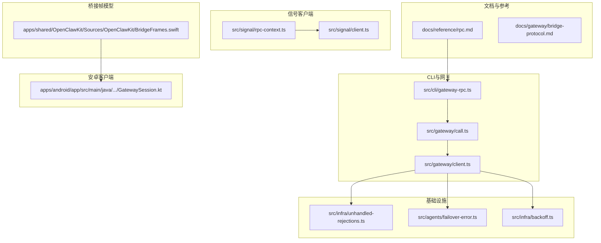
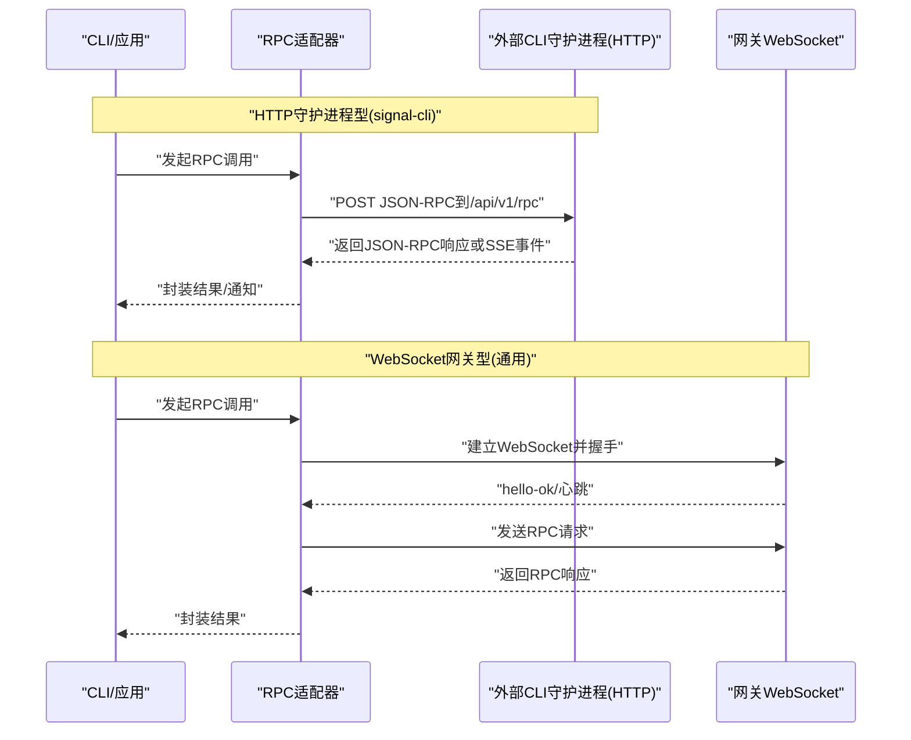
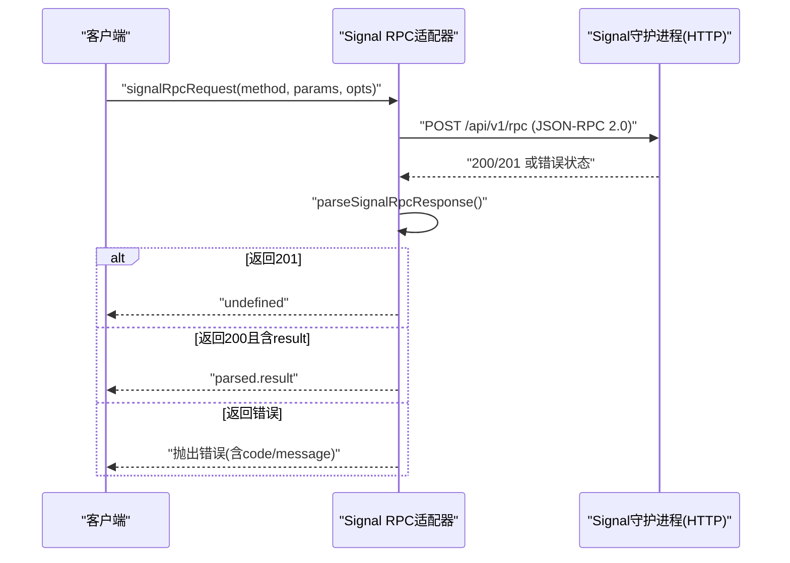
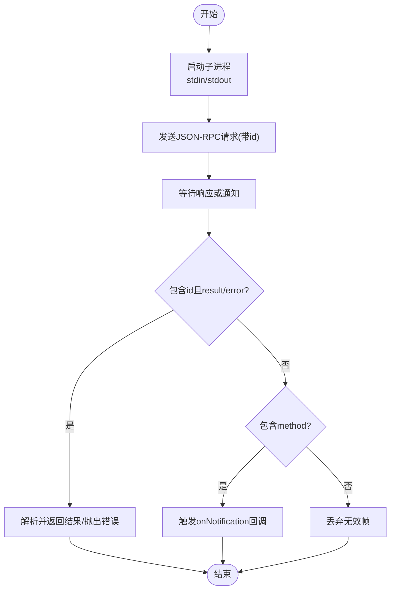
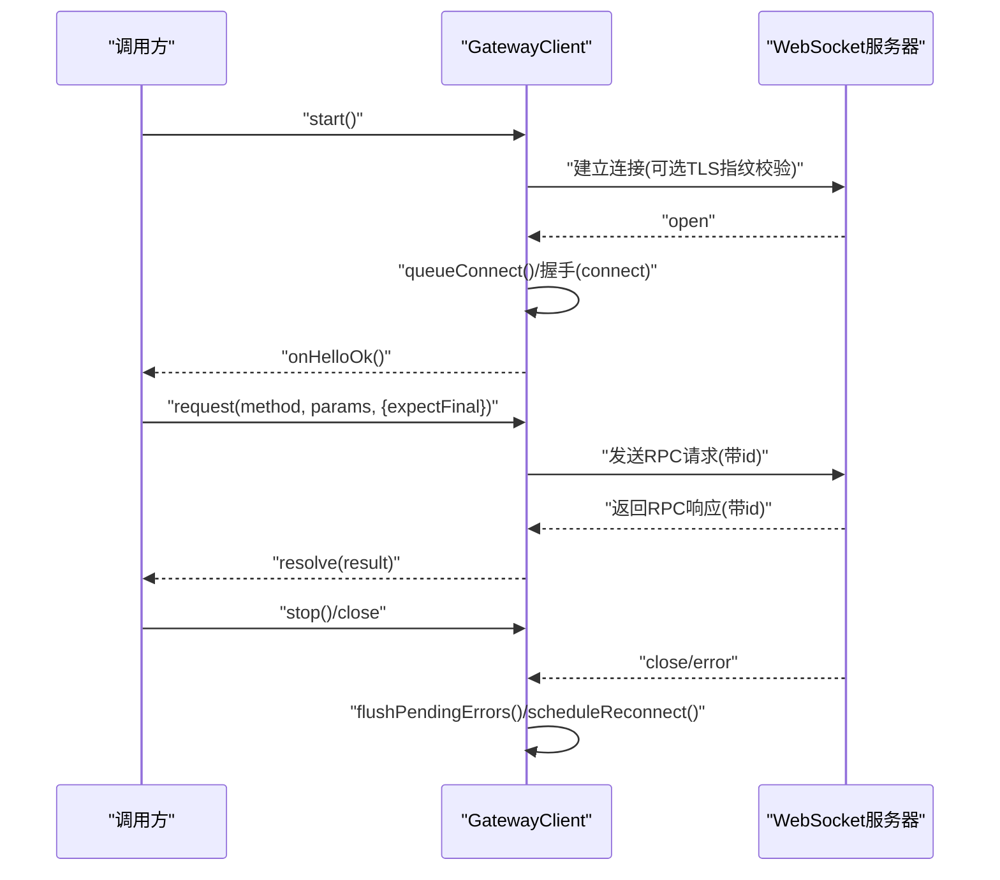
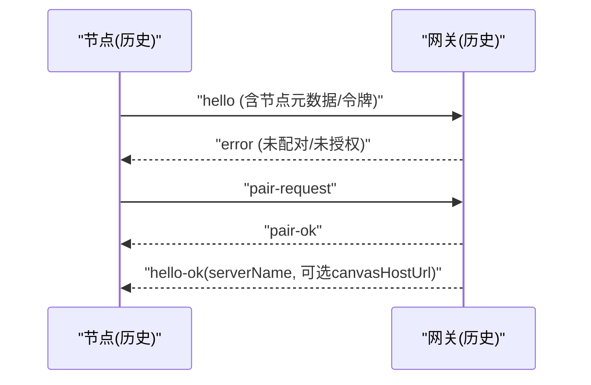
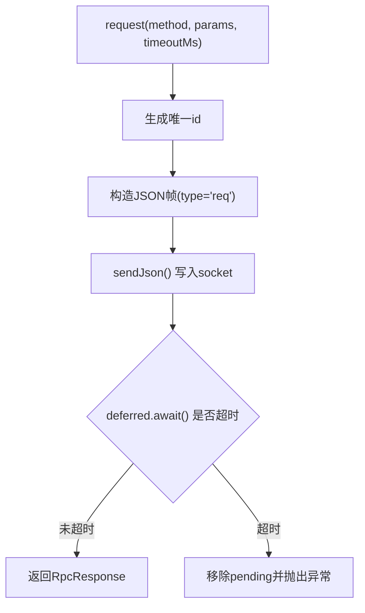
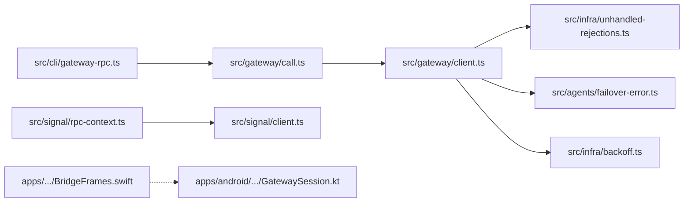

# RPC适配器

<cite>
**本文引用的文件**
- [docs/reference/rpc.md](file://docs/reference/rpc.md)
- [src/cli/gateway-rpc.ts](file://src/cli/gateway-rpc.ts)
- [dist/rpc-DDG7cpDs.js](file://dist/rpc-DDG7cpDs.js)
- [src/signal/rpc-context.ts](file://src/signal/rpc-context.ts)
- [src/signal/client.ts](file://src/signal/client.ts)
- [apps/shared/OpenClawKit/Sources/OpenClawKit/BridgeFrames.swift](file://apps/shared/OpenClawKit/Sources/OpenClawKit/BridgeFrames.swift)
- [src/gateway/client.ts](file://src/gateway/client.ts)
- [src/gateway/call.ts](file://src/gateway/call.ts)
- [docs/gateway/bridge-protocol.md](file://docs/gateway/bridge-protocol.md)
- [src/infra/unhandled-rejections.ts](file://src/infra/unhandled-rejections.ts)
- [src/agents/failover-error.ts](file://src/agents/failover-error.ts)
- [src/infra/backoff.ts](file://src/infra/backoff.ts)
- [apps/android/app/src/main/java/ai/openclaw/android/gateway/GatewaySession.kt](file://apps/android/app/src/main/java/ai/openclaw/android/gateway/GatewaySession.kt)
</cite>

## 目录

1. [简介](#简介)
2. [项目结构](#项目结构)
3. [核心组件](#核心组件)
4. [架构总览](#架构总览)
5. [组件详解](#组件详解)
6. [依赖关系分析](#依赖关系分析)
7. [性能考量](#性能考量)
8. [故障排查指南](#故障排查指南)
9. [结论](#结论)
10. [附录](#附录)

## 简介

本文件面向OpenClaw RPC适配器的技术文档，系统阐述两类外部CLI集成模式（HTTP守护进程型：signal-cli；stdio子进程型：legacy imsg）的协议规范、消息格式与远程过程调用机制，覆盖适配器实现细节、数据帧格式、状态管理、调用流程、错误处理与异常管理、配置选项、性能优化与监控方法、版本控制与向后兼容策略，以及客户端实现指南与调试技巧。

## 项目结构

围绕RPC适配器的关键代码分布在以下模块：

- 文档与参考：rpc参考文档、桥接协议文档
- CLI与网关调用：命令行RPC封装、网关调用与连接管理
- 信号客户端：Signal JSON-RPC请求与响应解析
- 桥接帧模型：跨平台桥接协议的数据帧定义（Swift）
- 安卓客户端：Android侧网关会话与RPC请求
- 基础设施：未处理拒绝、失败回退分类、指数退避等

**图表来源**

- [docs/reference/rpc.md](file://docs/reference/rpc.md#L1-L44)
- [src/cli/gateway-rpc.ts](file://src/cli/gateway-rpc.ts#L1-L48)
- [src/gateway/call.ts](file://src/gateway/call.ts#L1-L456)
- [src/gateway/client.ts](file://src/gateway/client.ts#L150-L349)
- [src/signal/rpc-context.ts](file://src/signal/rpc-context.ts#L1-L25)
- [src/signal/client.ts](file://src/signal/client.ts#L58-L107)
- [apps/shared/OpenClawKit/Sources/OpenClawKit/BridgeFrames.swift](file://apps/shared/OpenClawKit/Sources/OpenClawKit/BridgeFrames.swift#L1-L262)
- [apps/android/app/src/main/java/ai/openclaw/android/gateway/GatewaySession.kt](file://apps/android/app/src/main/java/ai/openclaw/android/gateway/GatewaySession.kt#L253-L288)
- [src/infra/unhandled-rejections.ts](file://src/infra/unhandled-rejections.ts#L156-L187)
- [src/agents/failover-error.ts](file://src/agents/failover-error.ts#L102-L196)
- [src/infra/backoff.ts](file://src/infra/backoff.ts#L1-L28)

**章节来源**

- [docs/reference/rpc.md](file://docs/reference/rpc.md#L1-L44)
- [docs/gateway/bridge-protocol.md](file://docs/gateway/bridge-protocol.md#L1-L92)

## 核心组件

- HTTP守护进程型适配器（signal-cli）
  - 通过HTTP JSON-RPC与Signal守护进程交互，事件流采用SSE端点。
  - 生命周期由OpenClaw托管（当启用自动启动时）。
- stdio子进程型适配器（legacy imsg）
  - OpenClaw作为父进程启动子进程，JSON-RPC以行分隔的JSON对象在stdin/stdout间传递。
  - 无TCP端口，无需守护进程。
- 网关WebSocket适配器（通用）
  - 统一的网关客户端，负责握手、鉴权、心跳、请求/响应、重连与超时处理。
  - 支持最小/最大协议版本协商与TLS指纹校验。

**章节来源**

- [docs/reference/rpc.md](file://docs/reference/rpc.md#L11-L38)
- [src/cli/gateway-rpc.ts](file://src/cli/gateway-rpc.ts#L6-L48)
- [src/gateway/client.ts](file://src/gateway/client.ts#L85-L115)
- [src/gateway/call.ts](file://src/gateway/call.ts#L27-L70)

## 架构总览

下图展示了两类外部CLI适配器与内部网关之间的交互关系，以及关键消息流与错误处理路径。

**图表来源**

- [docs/reference/rpc.md](file://docs/reference/rpc.md#L13-L28)
- [src/signal/client.ts](file://src/signal/client.ts#L70-L107)
- [src/gateway/call.ts](file://src/gateway/call.ts#L302-L379)

## 组件详解

### 1) HTTP守护进程型适配器（signal-cli）

- 协议与端点
  - JSON-RPC over HTTP，端点/api/v1/rpc。
  - 事件流使用SSE，端点/api/v1/events。
  - 健康检查端点/api/v1/check。
- 生命周期
  - 当配置开启自动启动时，由OpenClaw负责守护进程的启停。
- 请求与响应
  - 请求体遵循JSON-RPC 2.0规范，包含方法名、参数与唯一ID。
  - 成功响应包含result字段；错误响应包含error字段。
  - 特殊状态码：201表示无正文响应（空结果）。
- 错误处理
  - 非法响应体、缺少result或error字段时抛出错误。
  - 解析错误携带原始状态码以便诊断。

**图表来源**

- [src/signal/client.ts](file://src/signal/client.ts#L70-L107)

**章节来源**

- [docs/reference/rpc.md](file://docs/reference/rpc.md#L13-L20)
- [src/signal/client.ts](file://src/signal/client.ts#L58-L107)
- [src/signal/rpc-context.ts](file://src/signal/rpc-context.ts#L4-L24)

### 2) stdio子进程型适配器（legacy imsg）

- 传输方式
  - 子进程通过stdin/stdout进行行分隔的JSON对象通信。
- 方法集
  - 订阅/取消订阅：watch.subscribe/watch.unsubscribe
  - 发送消息：send
  - 探针/诊断：chats.list
- 响应与通知
  - 响应包含id与result或error。
  - 通知通过method字段标识（如message）。

**图表来源**

- [docs/reference/rpc.md](file://docs/reference/rpc.md#L22-L37)
- [src/imessage/client.ts](file://src/imessage/client.ts#L196-L247)

**章节来源**

- [docs/reference/rpc.md](file://docs/reference/rpc.md#L22-L37)
- [src/imessage/client.ts](file://src/imessage/client.ts#L196-L247)

### 3) 网关WebSocket适配器（通用）

- 连接与握手
  - 支持本地回环与远程wss，强制安全URL（非回环地址必须使用wss）。
  - 握手阶段携带客户端元信息、角色、作用域、设备签名等。
  - 可配置最小/最大协议版本，支持TLS指纹校验。
- 心跳与保活
  - 周期性心跳检测静默停滞，异常时主动关闭并重连。
- 请求/响应与超时
  - 使用唯一ID关联请求与响应，支持期望最终响应（agent场景）。
  - 超时与连接关闭均提供详细上下文信息。
- 重连与退避
  - 指数退避+抖动，上限保护，避免风暴。
- 错误分类与恢复
  - 将网络类临时错误与永久错误区分，指导是否终止或重试。
  - 对认证失败、速率限制、计费问题等进行分类，便于降级与提示。

**图表来源**

- [src/gateway/call.ts](file://src/gateway/call.ts#L302-L379)
- [src/gateway/client.ts](file://src/gateway/client.ts#L168-L217)
- [src/gateway/client.ts](file://src/gateway/client.ts#L230-L349)

**章节来源**

- [src/gateway/call.ts](file://src/gateway/call.ts#L109-L180)
- [src/gateway/call.ts](file://src/gateway/call.ts#L295-L379)
- [src/gateway/client.ts](file://src/gateway/client.ts#L85-L115)
- [src/gateway/client.ts](file://src/gateway/client.ts#L150-L217)
- [src/gateway/client.ts](file://src/gateway/client.ts#L219-L228)
- [src/gateway/client.ts](file://src/gateway/client.ts#L230-L349)

### 4) 桥接协议（Bridge，历史遗留）

- 传输与发现
  - TCP JSONL（每行一个JSON对象），可选TLS。
  - 旧版默认监听端口18790（当前构建不再启动TCP桥）。
- 握手与配对
  - hello → error（未配对/未授权）→ pair-request → pair-ok → hello-ok。
- 帧类型
  - 客户端→网关：req/res（受限RPC）、event（节点信号）。
  - 网关→客户端：invoke/invoke-res（节点命令）、event、ping/pong。
- 版本控制
  - 当前为隐式v1，无最小/最大协商；后续变更需增加版本字段以保持向后兼容。

**图表来源**

- [docs/gateway/bridge-protocol.md](file://docs/gateway/bridge-protocol.md#L42-L63)

**章节来源**

- [docs/gateway/bridge-protocol.md](file://docs/gateway/bridge-protocol.md#L10-L92)
- [apps/shared/OpenClawKit/Sources/OpenClawKit/BridgeFrames.swift](file://apps/shared/OpenClawKit/Sources/OpenClawKit/BridgeFrames.swift#L1-L262)

### 5) Android网关会话与RPC请求

- 数据帧
  - 请求帧包含type="req"、id、method与可选params。
  - 通过WebSocket发送JSON字符串，使用写锁保证线程安全。
- 超时与清理
  - 使用withTimeout在指定毫秒内等待响应，超时则移除挂起项并抛出异常。
  - 关闭时清理资源并等待关闭完成。

**图表来源**

- [apps/android/app/src/main/java/ai/openclaw/android/gateway/GatewaySession.kt](file://apps/android/app/src/main/java/ai/openclaw/android/gateway/GatewaySession.kt#L253-L288)

**章节来源**

- [apps/android/app/src/main/java/ai/openclaw/android/gateway/GatewaySession.kt](file://apps/android/app/src/main/java/ai/openclaw/android/gateway/GatewaySession.kt#L253-L288)

## 依赖关系分析

- CLI层依赖网关调用封装，统一处理URL解析、凭据注入、超时与错误格式化。
- 网关客户端依赖TLS运行时、设备身份、错误分类与退避策略。
- 信号客户端依赖配置解析与HTTP请求封装，严格校验响应格式。
- 桥接协议与Android会话分别服务于历史遗留与移动端场景，彼此独立但共享“RPC请求/响应”范式。

**图表来源**

- [src/cli/gateway-rpc.ts](file://src/cli/gateway-rpc.ts#L22-L47)
- [src/gateway/call.ts](file://src/gateway/call.ts#L415-L451)
- [src/gateway/client.ts](file://src/gateway/client.ts#L150-L217)
- [src/signal/rpc-context.ts](file://src/signal/rpc-context.ts#L4-L24)
- [src/signal/client.ts](file://src/signal/client.ts#L70-L107)
- [apps/shared/OpenClawKit/Sources/OpenClawKit/BridgeFrames.swift](file://apps/shared/OpenClawKit/Sources/OpenClawKit/BridgeFrames.swift#L1-L262)
- [apps/android/app/src/main/java/ai/openclaw/android/gateway/GatewaySession.kt](file://apps/android/app/src/main/java/ai/openclaw/android/gateway/GatewaySession.kt#L253-L288)

**章节来源**

- [src/cli/gateway-rpc.ts](file://src/cli/gateway-rpc.ts#L1-L48)
- [src/gateway/call.ts](file://src/gateway/call.ts#L1-L456)
- [src/gateway/client.ts](file://src/gateway/client.ts#L150-L349)
- [src/signal/rpc-context.ts](file://src/signal/rpc-context.ts#L1-L25)
- [src/signal/client.ts](file://src/signal/client.ts#L58-L107)
- [apps/shared/OpenClawKit/Sources/OpenClawKit/BridgeFrames.swift](file://apps/shared/OpenClawKit/Sources/OpenClawKit/BridgeFrames.swift#L1-L262)
- [apps/android/app/src/main/java/ai/openclaw/android/gateway/GatewaySession.kt](file://apps/android/app/src/main/java/ai/openclaw/android/gateway/GatewaySession.kt#L253-L288)

## 性能考量

- 超时与背压
  - 合理设置超时时间，避免长时间阻塞；对长耗时操作使用expectFinal等待最终响应。
- 重连与退避
  - 使用指数退避+抖动，避免雪崩效应；根据环境调整最大退避时间。
- 传输选择
  - 远程访问优先使用wss并配合TLS指纹校验，确保安全性与稳定性。
- 并发与队列
  - 对同一连接的并发请求进行有序处理，避免竞态；对挂起请求建立超时清理机制。

[本节为通用建议，不直接分析具体文件]

## 故障排查指南

- 常见错误分类
  - 认证失败（401/403）：检查令牌/密码/设备令牌有效性与权限范围。
  - 速率限制（429）：降低请求频率或使用退避策略。
  - 超时（408/502/503/504）：检查网络连通性与服务端负载。
  - 格式错误（400）：核对JSON-RPC请求格式与参数类型。
- 未处理拒绝与瞬态网络
  - 区分致命错误与瞬态网络错误，避免不必要的崩溃。
- 信号RPC响应校验
  - 若响应既无result也无error，或JSON解析失败，抛出明确错误并附带状态码。
- 网关关闭与心跳
  - 关闭码与原因用于定位问题；心跳缺失可能指示连接静默停滞，触发重连。

**章节来源**

- [src/agents/failover-error.ts](file://src/agents/failover-error.ts#L154-L196)
- [src/infra/unhandled-rejections.ts](file://src/infra/unhandled-rejections.ts#L156-L187)
- [src/signal/client.ts](file://src/signal/client.ts#L58-L107)
- [src/gateway/client.ts](file://src/gateway/client.ts#L180-L217)
- [src/gateway/client.ts](file://src/gateway/client.ts#L219-L228)

## 结论

OpenClaw RPC适配器通过标准化的JSON-RPC与多样的传输方式（HTTP/WS/stdio/TCP JSONL），为外部CLI与内部网关提供了统一的远程调用能力。在安全（wss/TLS指纹）、可靠性（心跳/重连/超时）、可观测性（错误分类/上下文信息）方面形成闭环。建议在新场景中优先采用网关WebSocket协议，并在需要时结合桥接协议或信号客户端适配器。

[本节为总结性内容，不直接分析具体文件]

## 附录

### A. 配置选项与最佳实践

- CLI网关调用
  - URL/令牌/超时/期望最终响应/JSON输出开关。
- 网关连接
  - URL来源（CLI覆盖/配置/本地回环）、TLS指纹、角色与作用域、设备身份、协议版本范围。
- 信号RPC上下文
  - 基础URL与账户解析，支持从配置或显式参数解析。

**章节来源**

- [src/cli/gateway-rpc.ts](file://src/cli/gateway-rpc.ts#L6-L20)
- [src/gateway/call.ts](file://src/gateway/call.ts#L27-L70)
- [src/gateway/call.ts](file://src/gateway/call.ts#L109-L180)
- [src/signal/rpc-context.ts](file://src/signal/rpc-context.ts#L4-L24)

### B. 版本控制与向后兼容

- 网关协议
  - 通过最小/最大协议版本协商，确保升级时的兼容性。
- 桥接协议
  - 当前为隐式v1，后续变更需引入显式版本字段，以保障向后兼容。

**章节来源**

- [src/gateway/call.ts](file://src/gateway/call.ts#L345-L346)
- [docs/gateway/bridge-protocol.md](file://docs/gateway/bridge-protocol.md#L88-L92)

### C. 客户端实现要点与调试技巧

- 实现要点
  - 明确请求ID与响应匹配，处理通知与错误分支。
  - 在移动端/桌面端确保线程安全与资源释放。
  - 对HTTP与WebSocket分别进行严格的错误与超时处理。
- 调试技巧
  - 打印连接详情（URL来源、配置路径、绑定模式）。
  - 利用错误分类快速定位问题类型（认证/速率限制/超时/格式）。
  - 观察心跳与重连行为，识别静默断开与网络波动。

**章节来源**

- [src/gateway/call.ts](file://src/gateway/call.ts#L109-L180)
- [src/agents/failover-error.ts](file://src/agents/failover-error.ts#L154-L196)
- [src/infra/backoff.ts](file://src/infra/backoff.ts#L1-L28)
- [apps/android/app/src/main/java/ai/openclaw/android/gateway/GatewaySession.kt](file://apps/android/app/src/main/java/ai/openclaw/android/gateway/GatewaySession.kt#L253-L288)
