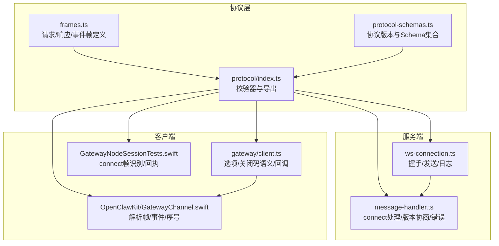
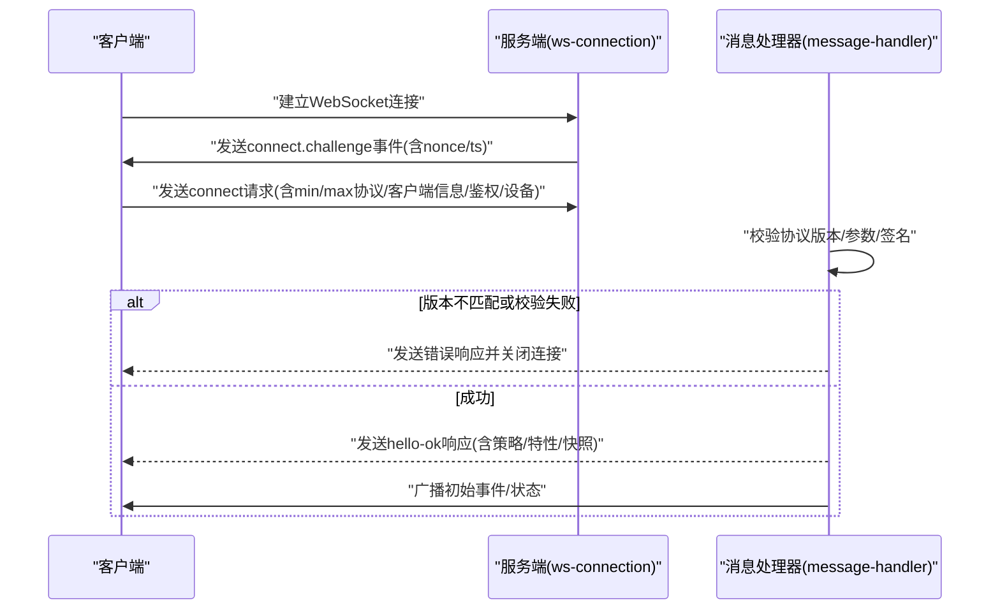
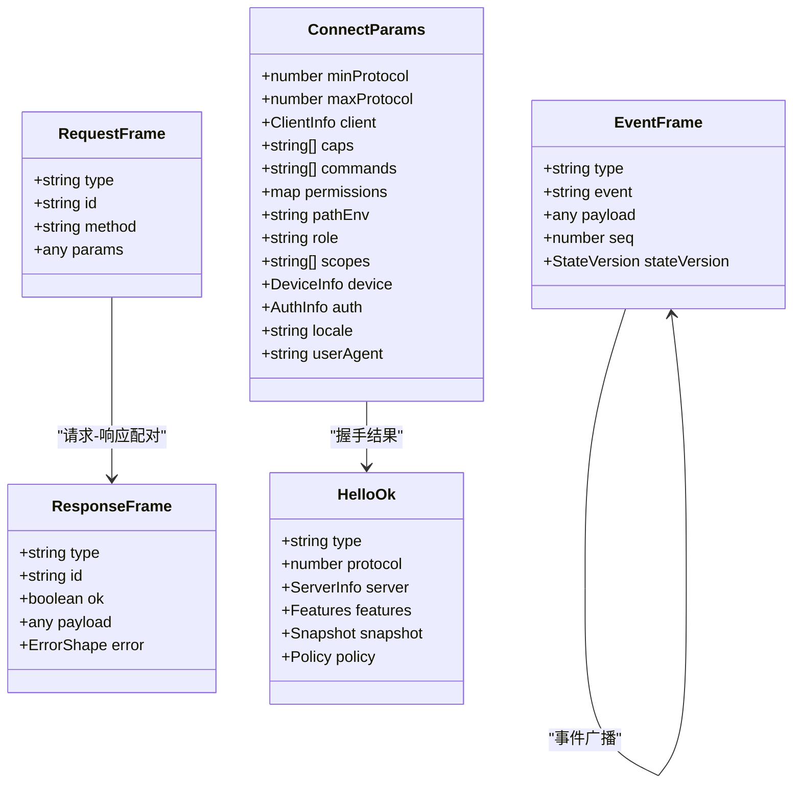
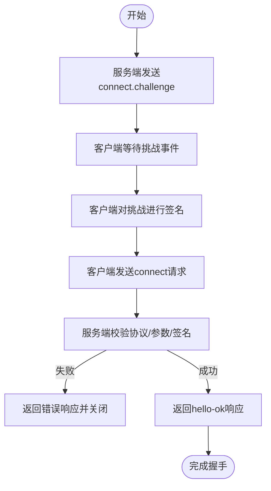
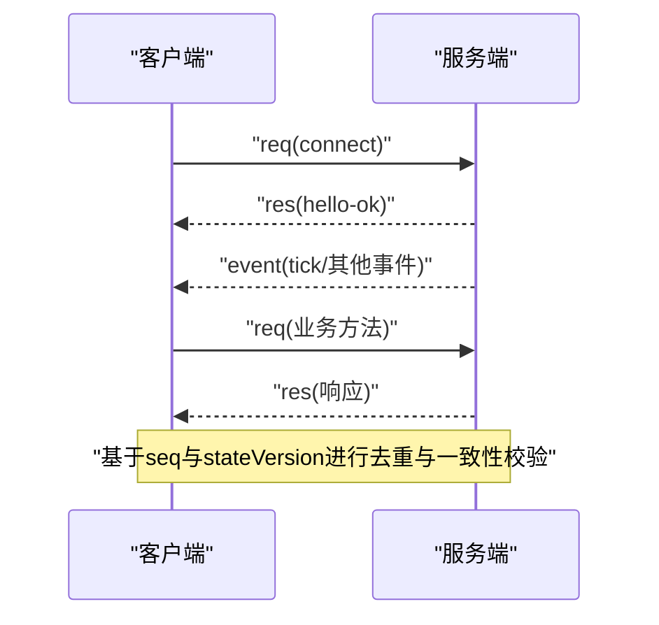
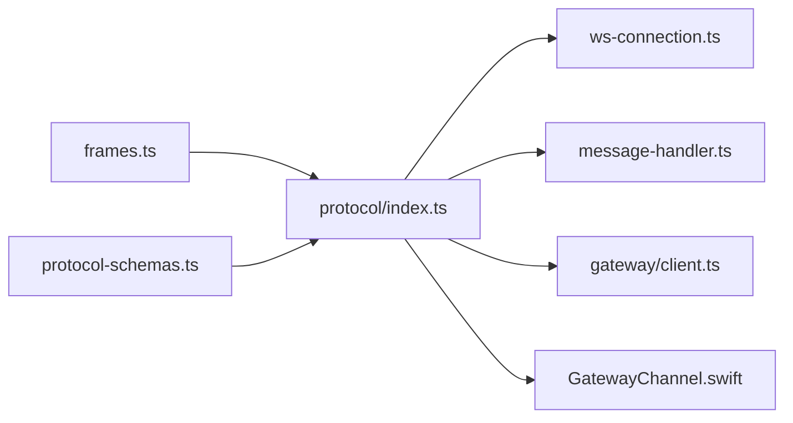

# WebSocket API

<cite>
**本文引用的文件**
- [docs/gateway/protocol.md](file://docs/gateway/protocol.md)
- [src/gateway/protocol/schema/frames.ts](file://src/gateway/protocol/schema/frames.ts)
- [src/gateway/protocol/schema/protocol-schemas.ts](file://src/gateway/protocol/schema/protocol-schemas.ts)
- [src/gateway/protocol/index.ts](file://src/gateway/protocol/index.ts)
- [src/gateway/server/ws-connection.ts](file://src/gateway/server/ws-connection.ts)
- [src/gateway/server/ws-connection/message-handler.ts](file://src/gateway/server/ws-connection/message-handler.ts)
- [src/gateway/client.ts](file://src/gateway/client.ts)
- [apps/shared/OpenClawKit/Sources/OpenClawKit/GatewayChannel.swift](file://apps/shared/OpenClawKit/Sources/OpenClawKit/GatewayChannel.swift)
- [apps/shared/OpenClawKit/Tests/OpenClawKitTests/GatewayNodeSessionTests.swift](file://apps/shared/OpenClawKit/Tests/OpenClawKitTests/GatewayNodeSessionTests.swift)
- [extensions/mattermost/src/mattermost/monitor-websocket.ts](file://extensions/mattermost/src/mattermost/monitor-websocket.ts)
- [dist/plugin-sdk/gateway/server/ws-types.d.ts](file://dist/plugin-sdk/gateway/server/ws-types.d.ts)
- [dist/plugin-sdk/gateway/ws-logging.d.ts](file://dist/plugin-sdk/gateway/ws-logging.d.ts)
- [dist/plugin-sdk/infra/ws.d.ts](file://dist/plugin-sdk/infra/ws.d.ts)
</cite>

## 目录

1. [简介](#简介)
2. [项目结构](#项目结构)
3. [核心组件](#核心组件)
4. [架构总览](#架构总览)
5. [详细组件分析](#详细组件分析)
6. [依赖关系分析](#依赖关系分析)
7. [性能考量](#性能考量)
8. [故障排查指南](#故障排查指南)
9. [结论](#结论)
10. [附录](#附录)

## 简介

本文件面向OpenClaw的WebSocket API，系统化阐述连接建立流程、帧格式、事件类型、实时交互模式与协议规范；并覆盖连接处理、数据帧格式、二进制与文本承载、状态管理机制；同时提供客户端实现指南、错误处理策略、安全考虑、性能优化建议与调试工具使用方法。

## 项目结构

OpenClaw的WebSocket API由“协议定义”“服务端握手与消息处理”“客户端实现”三部分构成：

- 协议定义：以TypeBox Schema定义帧结构、参数与校验器，统一生成TS/JS与Swift模型。
- 服务端：负责WebSocket握手、鉴权、版本协商、消息分发与状态广播。
- 客户端：负责连接、重连、帧编解码、事件序列号与心跳、错误处理与关闭码语义。

图表来源

- [src/gateway/protocol/schema/frames.ts](file://src/gateway/protocol/schema/frames.ts#L125-L163)
- [src/gateway/protocol/schema/protocol-schemas.ts](file://src/gateway/protocol/schema/protocol-schemas.ts#L153-L283)
- [src/gateway/protocol/index.ts](file://src/gateway/protocol/index.ts#L1-L640)
- [src/gateway/server/ws-connection.ts](file://src/gateway/server/ws-connection.ts#L132-L170)
- [src/gateway/server/ws-connection/message-handler.ts](file://src/gateway/server/ws-connection/message-handler.ts#L408-L450)
- [src/gateway/client.ts](file://src/gateway/client.ts#L37-L83)
- [apps/shared/OpenClawKit/Sources/OpenClawKit/GatewayChannel.swift](file://apps/shared/OpenClawKit/Sources/OpenClawKit/GatewayChannel.swift#L518-L548)
- [apps/shared/OpenClawKit/Tests/OpenClawKitTests/GatewayNodeSessionTests.swift](file://apps/shared/OpenClawKit/Tests/OpenClawKitTests/GatewayNodeSessionTests.swift#L62-L76)

章节来源

- [docs/gateway/protocol.md](file://docs/gateway/protocol.md#L10-L256)
- [src/gateway/protocol/schema/frames.ts](file://src/gateway/protocol/schema/frames.ts#L1-L164)
- [src/gateway/protocol/schema/protocol-schemas.ts](file://src/gateway/protocol/schema/protocol-schemas.ts#L1-L286)
- [src/gateway/protocol/index.ts](file://src/gateway/protocol/index.ts#L1-L640)

## 核心组件

- 帧类型与结构
  - 请求帧：携带唯一id、方法名与可选参数。
  - 响应帧：携带对应请求id、布尔结果、可选负载或错误对象。
  - 事件帧：携带事件名、可选载荷、可选序列号与状态版本。
- 连接握手
  - 首帧必须是connect请求；服务端先下发connect.challenge事件（含随机nonce与时间戳），客户端需按协议签名挑战并回传connect请求。
  - 成功后返回hello-ok响应，包含协议版本、服务器信息、特性列表、快照、策略等。
- 版本与校验
  - PROTOCOL_VERSION在协议Schema中定义；客户端声明min/max协议版本，服务端进行协商并拒绝不兼容版本。
  - 所有帧与参数均通过AJV校验器进行Schema校验。
- 安全与鉴权
  - 支持设备身份与签名挑战；支持网关令牌、设备令牌；支持TLS与证书指纹固定。
- 实时事件
  - 包括心跳tick、节点/代理/会话/执行审批等事件；事件帧可带有序列号与状态版本，用于去重与一致性。

章节来源

- [docs/gateway/protocol.md](file://docs/gateway/protocol.md#L17-L256)
- [src/gateway/protocol/schema/frames.ts](file://src/gateway/protocol/schema/frames.ts#L125-L163)
- [src/gateway/protocol/schema/protocol-schemas.ts](file://src/gateway/protocol/schema/protocol-schemas.ts#L285-L286)
- [src/gateway/protocol/index.ts](file://src/gateway/protocol/index.ts#L243-L432)

## 架构总览

下图展示从客户端发起连接到服务端完成握手与事件分发的关键步骤。

图表来源

- [src/gateway/server/ws-connection.ts](file://src/gateway/server/ws-connection.ts#L132-L170)
- [src/gateway/server/ws-connection/message-handler.ts](file://src/gateway/server/ws-connection/message-handler.ts#L408-L450)
- [docs/gateway/protocol.md](file://docs/gateway/protocol.md#L22-L90)

章节来源

- [src/gateway/server/ws-connection.ts](file://src/gateway/server/ws-connection.ts#L132-L170)
- [src/gateway/server/ws-connection/message-handler.ts](file://src/gateway/server/ws-connection/message-handler.ts#L408-L450)
- [docs/gateway/protocol.md](file://docs/gateway/protocol.md#L22-L90)

## 详细组件分析

### 帧格式与协议规范

- 帧类型
  - req：请求帧，包含type、id、method、params。
  - res：响应帧，包含type、id、ok、payload或error。
  - event：事件帧，包含type、event、payload、可选seq与stateVersion。
- 参数与校验
  - ConnectParams、HelloOk、ErrorShape等Schema定义了握手与运行期参数的结构与约束。
  - 所有方法参数均有对应的Schema与AJV校验器，确保消息合法性。
- 协议版本
  - PROTOCOL_VERSION为3；客户端需在connect.params中声明min/max协议版本，服务端进行协商。

图表来源

- [src/gateway/protocol/schema/frames.ts](file://src/gateway/protocol/schema/frames.ts#L125-L163)
- [src/gateway/protocol/schema/protocol-schemas.ts](file://src/gateway/protocol/schema/protocol-schemas.ts#L153-L283)

章节来源

- [src/gateway/protocol/schema/frames.ts](file://src/gateway/protocol/schema/frames.ts#L125-L163)
- [src/gateway/protocol/schema/protocol-schemas.ts](file://src/gateway/protocol/schema/protocol-schemas.ts#L153-L283)
- [src/gateway/protocol/index.ts](file://src/gateway/protocol/index.ts#L243-L432)

### 连接处理与握手流程

- 握手阶段
  - 服务端在连接建立后立即发送connect.challenge事件，包含nonce与时间戳。
  - 客户端需等待该挑战事件，按协议对挑战进行签名，并在connect请求中附带设备信息与鉴权凭据。
- 版本协商
  - 服务端根据客户端声明的min/max协议版本进行协商，若不兼容则返回错误并关闭连接。
- 成功握手
  - 返回hello-ok响应，包含协议版本、服务器信息、特性列表、快照与策略（如最大负载、缓冲字节、心跳间隔）。

图表来源

- [src/gateway/server/ws-connection.ts](file://src/gateway/server/ws-connection.ts#L132-L170)
- [src/gateway/server/ws-connection/message-handler.ts](file://src/gateway/server/ws-connection/message-handler.ts#L408-L450)
- [docs/gateway/protocol.md](file://docs/gateway/protocol.md#L22-L90)

章节来源

- [src/gateway/server/ws-connection.ts](file://src/gateway/server/ws-connection.ts#L132-L170)
- [src/gateway/server/ws-connection/message-handler.ts](file://src/gateway/server/ws-connection/message-handler.ts#L408-L450)
- [docs/gateway/protocol.md](file://docs/gateway/protocol.md#L22-L90)

### 数据帧格式与实时交互

- 文本帧与JSON
  - WebSocket传输采用文本帧，JSON作为载体；二进制帧在OpenClaw的通用WebSocket协议中未作为主要承载方式。
- 事件序列与去重
  - 事件帧可带有序列号seq与stateVersion，客户端可据此检测丢包与重复，保持顺序一致性。
- 心跳与保活
  - hello-ok中包含心跳间隔策略；客户端应维持心跳周期，避免空闲超时。

图表来源

- [src/gateway/protocol/schema/frames.ts](file://src/gateway/protocol/schema/frames.ts#L146-L155)
- [src/gateway/protocol/schema/protocol-schemas.ts](file://src/gateway/protocol/schema/protocol-schemas.ts#L153-L283)
- [apps/shared/OpenClawKit/Sources/OpenClawKit/GatewayChannel.swift](file://apps/shared/OpenClawKit/Sources/OpenClawKit/GatewayChannel.swift#L535-L544)

章节来源

- [src/gateway/protocol/schema/frames.ts](file://src/gateway/protocol/schema/frames.ts#L146-L155)
- [apps/shared/OpenClawKit/Sources/OpenClawKit/GatewayChannel.swift](file://apps/shared/OpenClawKit/Sources/OpenClawKit/GatewayChannel.swift#L518-L548)

### 客户端实现指南

- 连接与选项
  - 支持指定网关URL、令牌、设备令牌、密码、实例ID、客户端名称/显示名/版本、平台、设备家族、模式、角色、作用域、能力、命令、权限、路径环境变量、设备身份、最小/最大协议版本、TLS指纹等。
- 回调与状态
  - 提供onEvent、onHelloOk、onConnectError、onClose、onGap等回调；GATEWAY_CLOSE_CODE_HINTS提供常见关闭码语义。
- Swift客户端参考
  - OpenClawKit的GatewayChannel对URLSessionWebSocketTask的消息进行解析，区分res/event等帧类型，维护事件序列号lastSeq与最近tick时间lastTick，并对seqGap进行告警。

章节来源

- [src/gateway/client.ts](file://src/gateway/client.ts#L37-L83)
- [apps/shared/OpenClawKit/Sources/OpenClawKit/GatewayChannel.swift](file://apps/shared/OpenClawKit/Sources/OpenClawKit/GatewayChannel.swift#L518-L548)

### 错误处理策略

- 关闭码语义
  - 常见关闭码含义：正常关闭、异常关闭、策略违规、服务重启等；客户端可根据语义采取重连或提示。
- 握手失败
  - 当协议不匹配或参数/签名校验失败时，服务端返回错误响应并关闭连接；客户端应记录原因并按策略重试或提示用户。
- 事件序列异常
  - 当事件seq出现跳跃时，客户端应触发gap回调并进行重同步。

章节来源

- [src/gateway/client.ts](file://src/gateway/client.ts#L74-L83)
- [src/gateway/server/ws-connection/message-handler.ts](file://src/gateway/server/ws-connection/message-handler.ts#L408-L450)
- [apps/shared/OpenClawKit/Sources/OpenClawKit/GatewayChannel.swift](file://apps/shared/OpenClawKit/Sources/OpenClawKit/GatewayChannel.swift#L535-L544)

### 安全考虑

- 设备身份与挑战签名
  - 客户端必须等待connect.challenge并在connect请求中附带设备身份与签名；服务端严格校验nonce、签名有效性与时效。
- 认证与授权
  - 支持网关令牌与设备令牌；设备令牌随hello-ok下发，客户端应持久化以便后续连接复用。
- 传输安全
  - 支持TLS；客户端可配置证书指纹固定，防止中间人攻击。
- 跨源与明文
  - 对非本地主机的ws://连接进行限制，要求使用安全WebSocket传输。

章节来源

- [docs/gateway/protocol.md](file://docs/gateway/protocol.md#L195-L256)
- [src/gateway/server/ws-connection.ts](file://src/gateway/server/ws-connection.ts#L132-L170)

### 使用示例与最佳实践

- 建议流程
  - 建立连接 → 等待connect.challenge → 签名挑战 → 发送connect → 处理hello-ok → 订阅事件 → 按需调用方法 → 维护心跳与序列号。
- 性能优化
  - 合理设置策略参数（最大负载、缓冲字节、心跳间隔）；避免频繁发送大负载事件；利用stateVersion进行增量更新。
- 安全最佳实践
  - 始终使用wss；启用设备身份与签名；妥善保管设备令牌；定期轮换设备令牌。

章节来源

- [docs/gateway/protocol.md](file://docs/gateway/protocol.md#L17-L256)
- [src/gateway/protocol/schema/frames.ts](file://src/gateway/protocol/schema/frames.ts#L102-L112)

### 协议特定调试工具与监控

- 日志样式控制
  - 提供GatewayWsLogStyle枚举与set/get函数，支持自动/完整/紧凑三种日志风格，便于在不同场景下调整输出粒度。
- RawData转字符串
  - 提供rawDataToString工具，便于在Node.js侧将RawData转换为字符串进行日志与调试。
- Mattermost插件示例
  - 展示了如何封装WebSocket工厂、处理open/message/close/error事件、解析事件负载与错误处理，可作为第三方集成参考。

章节来源

- [dist/plugin-sdk/gateway/ws-logging.d.ts](file://dist/plugin-sdk/gateway/ws-logging.d.ts#L1-L5)
- [dist/plugin-sdk/infra/ws.d.ts](file://dist/plugin-sdk/infra/ws.d.ts#L1-L3)
- [extensions/mattermost/src/mattermost/monitor-websocket.ts](file://extensions/mattermost/src/mattermost/monitor-websocket.ts#L1-L222)

## 依赖关系分析

- 协议层
  - frames.ts定义帧Schema；protocol-schemas.ts汇总所有Schema并导出PROTOCOL_VERSION；protocol/index.ts生成校验器并导出类型。
- 服务端
  - ws-connection.ts负责连接生命周期与发送；message-handler.ts负责connect处理、版本协商与错误返回。
- 客户端
  - gateway/client.ts提供连接选项与回调；OpenClawKit的GatewayChannel.swift负责消息解析与事件处理。

图表来源

- [src/gateway/protocol/schema/frames.ts](file://src/gateway/protocol/schema/frames.ts#L1-L164)
- [src/gateway/protocol/schema/protocol-schemas.ts](file://src/gateway/protocol/schema/protocol-schemas.ts#L1-L286)
- [src/gateway/protocol/index.ts](file://src/gateway/protocol/index.ts#L1-L640)
- [src/gateway/server/ws-connection.ts](file://src/gateway/server/ws-connection.ts#L132-L170)
- [src/gateway/server/ws-connection/message-handler.ts](file://src/gateway/server/ws-connection/message-handler.ts#L408-L450)
- [src/gateway/client.ts](file://src/gateway/client.ts#L37-L83)
- [apps/shared/OpenClawKit/Sources/OpenClawKit/GatewayChannel.swift](file://apps/shared/OpenClawKit/Sources/OpenClawKit/GatewayChannel.swift#L518-L548)

章节来源

- [src/gateway/protocol/schema/frames.ts](file://src/gateway/protocol/schema/frames.ts#L1-L164)
- [src/gateway/protocol/schema/protocol-schemas.ts](file://src/gateway/protocol/schema/protocol-schemas.ts#L1-L286)
- [src/gateway/protocol/index.ts](file://src/gateway/protocol/index.ts#L1-L640)

## 性能考量

- 心跳与保活
  - 依据hello-ok中的tickIntervalMs维持心跳，避免因空闲导致连接被中间设备断开。
- 负载与缓冲
  - 利用策略中的maxPayload与maxBufferedBytes限制单帧大小与缓冲上限，防止内存压力。
- 序列化与解析
  - 采用JSON文本帧，解析成本低；事件帧带seq与stateVersion，便于增量更新与去重。

[本节为通用指导，无需列出具体文件来源]

## 故障排查指南

- 常见问题定位
  - 协议不匹配：检查客户端min/max协议版本与服务端PROTOCOL_VERSION是否一致。
  - 设备签名失败：确认已等待connect.challenge并正确签名，且nonce一致。
  - 关闭码异常：参考GATEWAY_CLOSE_CODE_HINTS，结合服务端日志定位原因。
- 事件序列异常
  - 当收到seqGap事件时，优先进行重同步，必要时重建连接。
- 第三方集成
  - 参考Mattermost示例，确保正确处理open/message/close/error事件与错误日志。

章节来源

- [src/gateway/client.ts](file://src/gateway/client.ts#L74-L83)
- [src/gateway/server/ws-connection/message-handler.ts](file://src/gateway/server/ws-connection/message-handler.ts#L408-L450)
- [apps/shared/OpenClawKit/Sources/OpenClawKit/GatewayChannel.swift](file://apps/shared/OpenClawKit/Sources/OpenClawKit/GatewayChannel.swift#L535-L544)
- [extensions/mattermost/src/mattermost/monitor-websocket.ts](file://extensions/mattermost/src/mattermost/monitor-websocket.ts#L101-L211)

## 结论

OpenClaw的WebSocket API以清晰的帧模型与严格的协议校验为核心，配合设备身份挑战、令牌与TLS保障安全；通过事件序列号与状态版本实现可靠实时交互。遵循本文档的实现与调试建议，可在多端稳定接入并高效运维。

[本节为总结性内容，无需列出具体文件来源]

## 附录

- 相关类型与工具
  - GatewayWsClient：服务端对客户端连接的抽象，包含socket、连接参数、连接ID、设备信息与Canvas能力等。
  - GatewayWsLogStyle：日志风格枚举，支持自动/完整/紧凑。
  - rawDataToString：将RawData转换为字符串的工具函数。

章节来源

- [dist/plugin-sdk/gateway/server/ws-types.d.ts](file://dist/plugin-sdk/gateway/server/ws-types.d.ts#L1-L13)
- [dist/plugin-sdk/gateway/ws-logging.d.ts](file://dist/plugin-sdk/gateway/ws-logging.d.ts#L1-L5)
- [dist/plugin-sdk/infra/ws.d.ts](file://dist/plugin-sdk/infra/ws.d.ts#L1-L3)
