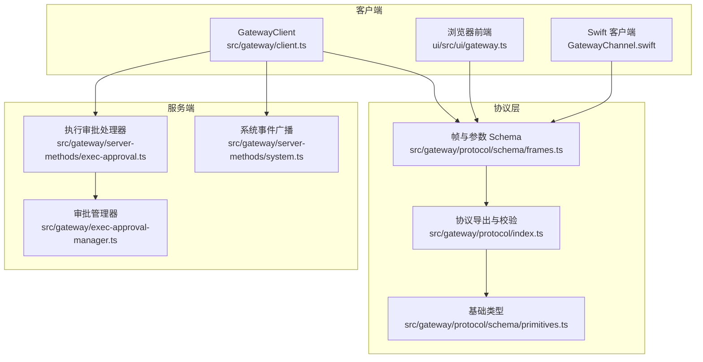
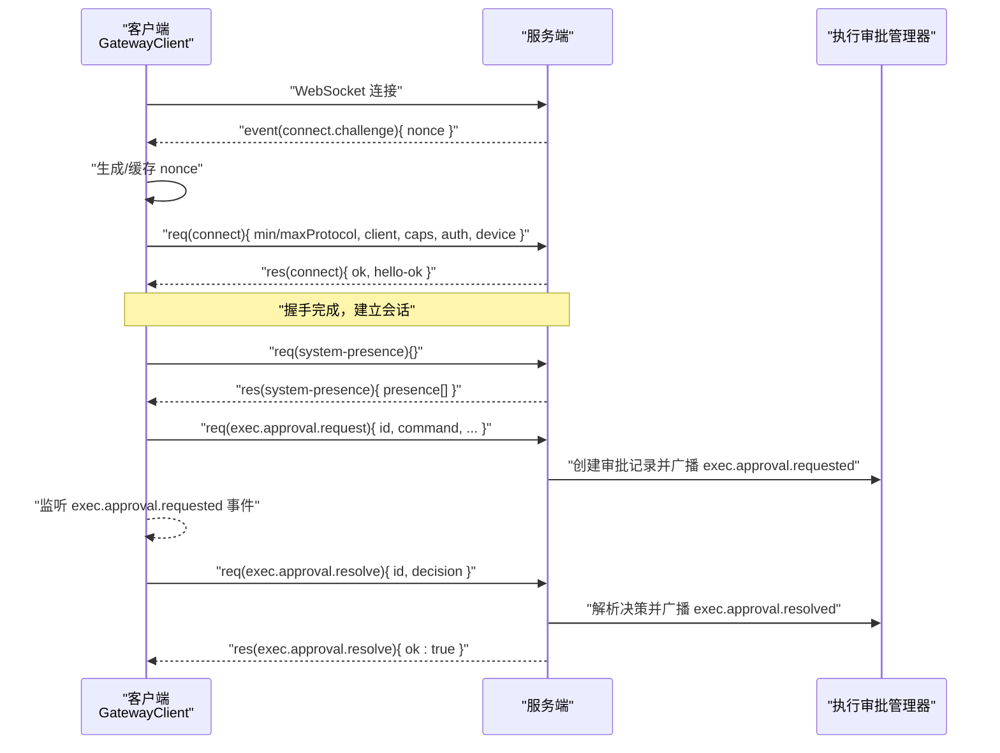
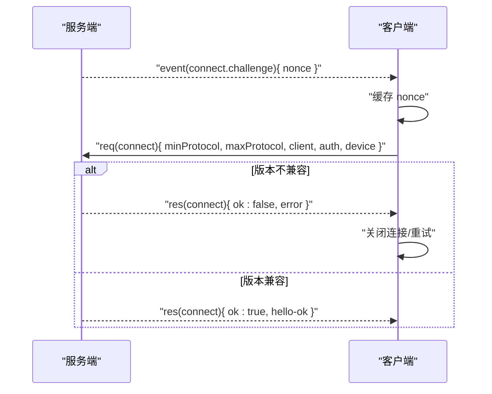
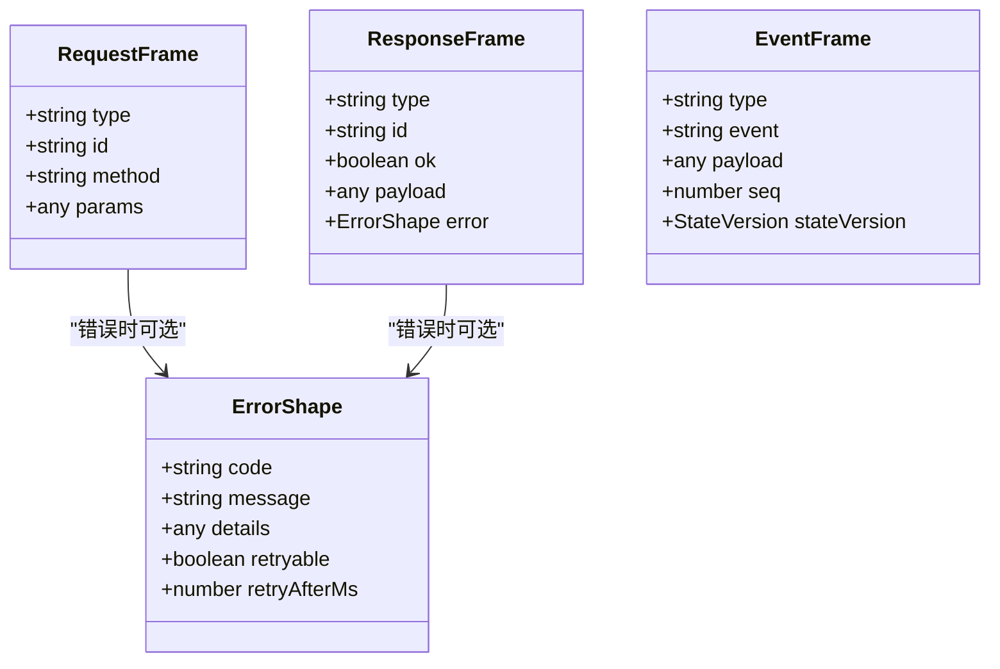
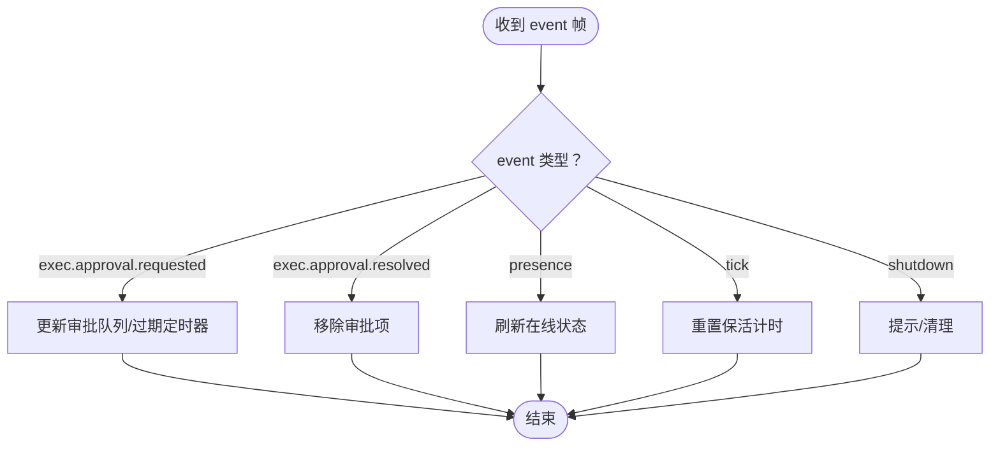
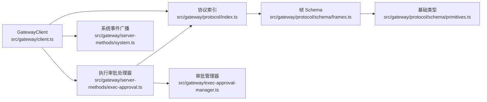

# WebSocket API

<cite>
**本文引用的文件**
- [src/gateway/client.ts](file://src/gateway/client.ts)
- [src/gateway/protocol/index.ts](file://src/gateway/protocol/index.ts)
- [src/gateway/protocol/schema/frames.ts](file://src/gateway/protocol/schema/frames.ts)
- [src/gateway/protocol/schema/primitives.ts](file://src/gateway/protocol/schema/primitives.ts)
- [src/gateway/server.auth.e2e.test.ts](file://src/gateway/server.auth.e2e.test.ts)
- [src/gateway/server-methods/exec-approval.ts](file://src/gateway/server-methods/exec-approval.ts)
- [src/gateway/server-methods/system.ts](file://src/gateway/server-methods/system.ts)
- [src/gateway/exec-approval-manager.ts](file://src/gateway/exec-approval-manager.ts)
- [src/gateway/test-helpers.server.ts](file://src/gateway/test-helpers.server.ts)
- [scripts/dev/gateway-smoke.ts](file://scripts/dev/gateway-smoke.ts)
- [ui/src/ui/gateway.ts](file://ui/src/ui/gateway.ts)
- [ui/src/ui/app-gateway.ts](file://ui/src/ui/app-gateway.ts)
- [apps/shared/OpenClawKit/Sources/OpenClawProtocol/GatewayModels.swift](file://apps/shared/OpenClawKit/Sources/OpenClawProtocol/GatewayModels.swift)
- [apps/macos/Sources/OpenClawProtocol/GatewayModels.swift](file://apps/macos/Sources/OpenClawProtocol/GatewayModels.swift)
- [apps/shared/OpenClawKit/Sources/OpenClawKit/GatewayChannel.swift](file://apps/shared/OpenClawKit/Sources/OpenClawKit/GatewayChannel.swift)
- [apps/macos/Sources/OpenClawMacCLI/WizardCommand.swift](file://apps/macos/Sources/OpenClawMacCLI/WizardCommand.swift)
</cite>

## 目录
1. [简介](#简介)
2. [项目结构](#项目结构)
3. [核心组件](#核心组件)
4. [架构总览](#架构总览)
5. [详细组件分析](#详细组件分析)
6. [依赖关系分析](#依赖关系分析)
7. [性能考量](#性能考量)
8. [故障排查指南](#故障排查指南)
9. [结论](#结论)
10. [附录](#附录)

## 简介
本文件为 OpenClaw WebSocket API 的权威技术文档，覆盖连接协议、握手与认证、消息帧格式、事件系统、RPC 方法、错误处理与协议版本管理。目标读者既包括需要快速集成的开发者，也包括希望深入理解实现细节的工程师。

## 项目结构
OpenClaw 的 WebSocket API 主要由以下模块构成：
- 客户端实现：负责连接建立、握手、挑战响应、认证、消息收发与事件订阅
- 协议定义：统一的帧格式（req/res/event）、参数校验与协议版本
- 服务端方法：如执行审批、系统状态等 RPC 实现
- 事件系统：广播事件（如 exec.approval.requested、presence 等）
- 平台适配：Swift/TypeScript 客户端对帧模型的解码与使用

图表来源
- [src/gateway/client.ts](file://src/gateway/client.ts#L1-L442)
- [src/gateway/protocol/schema/frames.ts](file://src/gateway/protocol/schema/frames.ts#L1-L165)
- [src/gateway/protocol/index.ts](file://src/gateway/protocol/index.ts#L1-L603)
- [src/gateway/protocol/schema/primitives.ts](file://src/gateway/protocol/schema/primitives.ts#L1-L18)
- [src/gateway/server-methods/exec-approval.ts](file://src/gateway/server-methods/exec-approval.ts#L1-L138)
- [src/gateway/server-methods/system.ts](file://src/gateway/server-methods/system.ts#L102-L140)
- [src/gateway/exec-approval-manager.ts](file://src/gateway/exec-approval-manager.ts#L51-L82)

章节来源
- [src/gateway/client.ts](file://src/gateway/client.ts#L1-L442)
- [src/gateway/protocol/schema/frames.ts](file://src/gateway/protocol/schema/frames.ts#L1-L165)
- [src/gateway/protocol/index.ts](file://src/gateway/protocol/index.ts#L1-L603)

## 核心组件
- 连接与握手
  - 服务端在连接建立后发送“connect.challenge”事件，携带一次性随机数（nonce），客户端需在后续“connect”请求中回传该 nonce 以完成挑战响应
  - “connect”请求包含协议版本范围、客户端信息、能力、权限、设备签名、认证凭据等
  - 服务端返回“hello-ok”，包含协议版本、服务器信息、特性列表、快照、策略参数等
- 消息帧
  - req：请求帧，包含 type、id、method、params
  - res：响应帧，包含 type、id、ok、payload 或 error
  - event：事件帧，包含 type、event、payload、可选 seq、stateVersion
- 事件系统
  - 系统事件：如 system-presence、exec.approval.requested、exec.approval.resolved、presence、tick、shutdown 等
  - 事件可带有序号 seq 与状态版本 stateVersion，用于顺序与一致性控制
- RPC 方法
  - 常用方法：connect、exec.approval.request、exec.approval.resolve、system-presence 等
  - 参数与返回值均受 Schema 校验，错误通过 res.error 返回

章节来源
- [src/gateway/client.ts](file://src/gateway/client.ts#L178-L286)
- [src/gateway/protocol/schema/frames.ts](file://src/gateway/protocol/schema/frames.ts#L126-L165)
- [src/gateway/server.auth.e2e.test.ts](file://src/gateway/server.auth.e2e.test.ts#L249-L285)
- [src/gateway/server-methods/exec-approval.ts](file://src/gateway/server-methods/exec-approval.ts#L18-L97)
- [src/gateway/server-methods/system.ts](file://src/gateway/server-methods/system.ts#L102-L140)

## 架构总览
下图展示从客户端到服务端的关键交互路径，包括握手、挑战响应、认证、RPC 调用与事件订阅。

图表来源
- [src/gateway/client.ts](file://src/gateway/client.ts#L178-L286)
- [src/gateway/server.auth.e2e.test.ts](file://src/gateway/server.auth.e2e.test.ts#L249-L285)
- [src/gateway/server-methods/exec-approval.ts](file://src/gateway/server-methods/exec-approval.ts#L18-L97)
- [src/gateway/server-methods/system.ts](file://src/gateway/server-methods/system.ts#L102-L140)

## 详细组件分析

### 连接与握手流程
- 握手阶段
  - 服务端在连接建立后立即发送“connect.challenge”事件，携带 nonce
  - 客户端收到后缓存 nonce，并在“connect”请求中回传
  - “connect”请求包含 minProtocol、maxProtocol、client、caps、permissions、auth、device 等字段
  - 服务端校验协议版本范围，若不兼容则拒绝；成功后返回“hello-ok”
- 认证与角色声明
  - 支持 token/password 两种认证方式；也可使用设备签名（device）进行硬件级认证
  - 服务端返回 hello-ok 中的 auth 字段可包含 deviceToken、role、scopes 等
- 挑战响应机制
  - 客户端在收到“connect.challenge”事件后，必须在后续“connect”请求中带上 nonce 才能继续
  - 若未按要求回传 nonce，服务端可能关闭连接或拒绝后续请求

图表来源
- [src/gateway/server.auth.e2e.test.ts](file://src/gateway/server.auth.e2e.test.ts#L249-L285)
- [src/gateway/client.ts](file://src/gateway/client.ts#L178-L286)

章节来源
- [src/gateway/server.auth.e2e.test.ts](file://src/gateway/server.auth.e2e.test.ts#L249-L285)
- [src/gateway/client.ts](file://src/gateway/client.ts#L178-L286)

### 消息帧格式规范
- req 帧
  - 必填：type="req"、id、method
  - 可选：params
- res 帧
  - 必填：type="res"、id、ok
  - 可选：payload 或 error
  - error 包含 code、message、details、retryable、retryAfterMs
- event 帧
  - 必填：type="event"、event
  - 可选：payload、seq、stateVersion
- 校验与序列化
  - 使用 TypeBox Schema 与 AJV 校验，确保字段完整性与类型正确
  - Swift 客户端支持对帧进行解码与编码，自动识别 req/res/event 类型

图表来源
- [src/gateway/protocol/schema/frames.ts](file://src/gateway/protocol/schema/frames.ts#L126-L165)

章节来源
- [src/gateway/protocol/schema/frames.ts](file://src/gateway/protocol/schema/frames.ts#L126-L165)
- [src/gateway/protocol/index.ts](file://src/gateway/protocol/index.ts#L233-L237)
- [apps/shared/OpenClawKit/Sources/OpenClawProtocol/GatewayModels.swift](file://apps/shared/OpenClawKit/Sources/OpenClawProtocol/GatewayModels.swift#L2763-L2795)
- [apps/macos/Sources/OpenClawProtocol/GatewayModels.swift](file://apps/macos/Sources/OpenClawProtocol/GatewayModels.swift#L2763-L2795)

### 事件系统
- 事件类型
  - exec.approval.requested：发起执行审批请求，携带 id、request、createdAtMs、expiresAtMs
  - exec.approval.resolved：审批已解决，携带 id、decision、resolvedBy、ts
  - presence：系统实例在线状态列表
  - tick：心跳事件，用于保活检测
  - shutdown：服务端计划重启或关闭通知
- 事件帧
  - event 帧可带 seq（事件序号）与 stateVersion（状态版本），便于顺序与一致性控制
- 客户端处理
  - 浏览器前端监听并更新 UI 队列（如执行审批队列）
  - Swift 客户端等待“connect.challenge”事件并提取 nonce

图表来源
- [src/gateway/server-methods/exec-approval.ts](file://src/gateway/server-methods/exec-approval.ts#L66-L75)
- [src/gateway/server-methods/system.ts](file://src/gateway/server-methods/system.ts#L127-L137)
- [ui/src/ui/app-gateway.ts](file://ui/src/ui/app-gateway.ts#L292-L329)

章节来源
- [src/gateway/server-methods/exec-approval.ts](file://src/gateway/server-methods/exec-approval.ts#L66-L75)
- [src/gateway/server-methods/system.ts](file://src/gateway/server-methods/system.ts#L127-L137)
- [ui/src/ui/app-gateway.ts](file://ui/src/ui/app-gateway.ts#L292-L329)

### RPC 方法：connect
- 请求
  - method: "connect"
  - params: ConnectParams
    - minProtocol、maxProtocol：协议版本范围
    - client：客户端标识（id、displayName、version、platform、mode、instanceId）
    - caps、commands、permissions、pathEnv、role、scopes、device、auth、locale、userAgent
- 响应
  - ok=true：返回 HelloOk
    - protocol：实际使用的协议版本
    - server：版本、提交、主机、连接 ID
    - features：支持的方法与事件列表
    - snapshot：初始状态快照
    - canvasHostUrl、auth、policy
  - ok=false：返回 error

章节来源
- [src/gateway/protocol/schema/frames.ts](file://src/gateway/protocol/schema/frames.ts#L20-L68)
- [src/gateway/protocol/schema/frames.ts](file://src/gateway/protocol/schema/frames.ts#L70-L113)
- [src/gateway/client.ts](file://src/gateway/client.ts#L178-L286)

### RPC 方法：exec.approval.request
- 请求
  - method: "exec.approval.request"
  - params:
    - id（可选，显式指定审批 ID；若重复将被拒绝）
    - command、cwd、host、security、ask、agentId、resolvedPath、sessionKey、timeoutMs
- 响应
  - 成功：返回 { id, decision, createdAtMs, expiresAtMs }
  - 失败：返回 error（如 INVALID_REQUEST）

章节来源
- [src/gateway/server-methods/exec-approval.ts](file://src/gateway/server-methods/exec-approval.ts#L18-L97)

### RPC 方法：exec.approval.resolve
- 请求
  - method: "exec.approval.resolve"
  - params: { id, decision }，其中 decision ∈ {"allow-once","allow-always","deny"}
- 响应
  - 成功：返回 { ok:true }
  - 失败：返回 error（如 INVALID_REQUEST）

章节来源
- [src/gateway/server-methods/exec-approval.ts](file://src/gateway/server-methods/exec-approval.ts#L98-L135)

### RPC 方法：system-presence
- 请求
  - method: "system-presence"
  - params: {}
- 响应
  - 返回 presence 列表（PresenceEntry[]）

章节来源
- [ui/src/ui/controllers/presence.ts](file://ui/src/ui/controllers/presence.ts#L13-L37)
- [src/gateway/server-methods/system.ts](file://src/gateway/server-methods/system.ts#L127-L137)

### 错误处理策略
- 帧级别
  - req/res/event 三类帧均受 Schema 校验；校验失败返回 res.error
  - error 形态包含 code、message、details、retryable、retryAfterMs
- 连接与握手
  - 协议版本不匹配：拒绝连接
  - 非“connect”首请求：拒绝并关闭
  - TLS 指纹不匹配：拒绝连接
- 业务错误
  - exec.approval.request：重复 ID、超时、未知 ID 等
  - exec.approval.resolve：无效决策、未知 ID
- 客户端行为
  - 对 res.ok=false 的请求抛出异常或透传错误
  - 对 accept 状态的长耗时请求，客户端可选择等待最终结果

章节来源
- [src/gateway/protocol/schema/frames.ts](file://src/gateway/protocol/schema/frames.ts#L115-L124)
- [src/gateway/server.auth.e2e.test.ts](file://src/gateway/server.auth.e2e.test.ts#L262-L285)
- [src/gateway/server-methods/exec-approval.ts](file://src/gateway/server-methods/exec-approval.ts#L46-L52)
- [src/gateway/client.ts](file://src/gateway/client.ts#L315-L332)

### 协议版本管理与向后兼容
- 协议版本
  - 通过 connect.params.minProtocol 与 maxProtocol 指定版本范围
  - 服务端返回 hello-ok.protocol 表示实际采用的版本
- 兼容策略
  - 服务端拒绝不在 min/max 范围内的版本
  - 客户端在握手失败时可调整版本范围或降级
- 现有实现
  - 协议版本常量与导出位于协议索引文件中，供客户端和服务端共享

章节来源
- [src/gateway/protocol/schema/frames.ts](file://src/gateway/protocol/schema/frames.ts#L22-L23)
- [src/gateway/protocol/index.ts](file://src/gateway/protocol/index.ts#L499-L499)

## 依赖关系分析
- 客户端依赖协议层的 Schema 与校验函数，确保发送帧合法
- 服务端方法依赖协议层的参数校验与错误构造工具
- 事件系统通过上下文广播事件，客户端订阅并更新本地状态
- 平台 SDK（Swift/TypeScript）依赖通用帧模型进行解码与编码

图表来源
- [src/gateway/client.ts](file://src/gateway/client.ts#L1-L442)
- [src/gateway/protocol/index.ts](file://src/gateway/protocol/index.ts#L1-L603)
- [src/gateway/protocol/schema/frames.ts](file://src/gateway/protocol/schema/frames.ts#L1-L165)
- [src/gateway/protocol/schema/primitives.ts](file://src/gateway/protocol/schema/primitives.ts#L1-L18)
- [src/gateway/server-methods/exec-approval.ts](file://src/gateway/server-methods/exec-approval.ts#L1-L138)
- [src/gateway/exec-approval-manager.ts](file://src/gateway/exec-approval-manager.ts#L51-L82)
- [src/gateway/server-methods/system.ts](file://src/gateway/server-methods/system.ts#L102-L140)

章节来源
- [src/gateway/client.ts](file://src/gateway/client.ts#L1-L442)
- [src/gateway/protocol/index.ts](file://src/gateway/protocol/index.ts#L1-L603)

## 性能考量
- 心跳与保活
  - 服务端发送“tick”事件，客户端需在超过两倍 tickIntervalMs 未收到心跳时主动断开
- 大负载
  - 客户端 WebSocket 初始化时设置较大 maxPayload，以支持屏幕截图等大响应
- 事件顺序
  - 事件帧可带 seq，客户端可检测丢包并上报 gap 回调
- 广播策略
  - 部分事件（如 presence）支持 dropIfSlow，避免阻塞关键路径

章节来源
- [src/gateway/client.ts](file://src/gateway/client.ts#L309-L311)
- [src/gateway/client.ts](file://src/gateway/client.ts#L369-L386)
- [src/gateway/protocol/schema/frames.ts](file://src/gateway/protocol/schema/frames.ts#L147-L156)

## 故障排查指南
- 握手失败
  - 检查是否先收到“connect.challenge”且已回传 nonce
  - 核对 minProtocol/maxProtocol 是否在服务端允许范围内
  - TLS 场景检查指纹是否匹配
- 请求无响应
  - 确认 id 是否唯一且未被服务端拒绝
  - 对 accept 状态的长请求，确认是否在等待最终结果
- 事件缺失
  - 检查是否订阅了对应事件
  - 关注 seq 与 stateVersion，确认事件顺序与版本一致
- 常见错误码
  - INVALID_REQUEST：参数校验失败或业务状态非法
  - 其他错误形态包含 retryable/retryAfterMs，便于客户端自适应重试

章节来源
- [src/gateway/server.auth.e2e.test.ts](file://src/gateway/server.auth.e2e.test.ts#L249-L285)
- [src/gateway/server-methods/exec-approval.ts](file://src/gateway/server-methods/exec-approval.ts#L46-L52)
- [src/gateway/protocol/schema/frames.ts](file://src/gateway/protocol/schema/frames.ts#L115-L124)

## 结论
OpenClaw WebSocket API 以清晰的帧模型、严格的参数校验与完善的事件系统为基础，提供了稳健的连接、认证与 RPC 能力。通过挑战响应与可插拔的认证方式，兼顾易用性与安全性；通过版本协商与错误形态，保障向前兼容与可维护性。建议在生产环境中严格遵循帧格式与事件语义，合理利用心跳与保活策略，并对错误进行分级处理与重试。

## 附录

### 示例：连接与鉴权（文本描述）
- 步骤
  - 建立 WebSocket 连接
  - 接收“connect.challenge”并缓存 nonce
  - 发送“connect”请求，包含 min/maxProtocol、client、auth/device、caps/scopes 等
  - 接收“hello-ok”，记录协议版本与策略
- 注意
  - 若 min/max 不兼容，需调整版本范围
  - 若未回传 nonce，服务端可能拒绝后续请求

章节来源
- [src/gateway/server.auth.e2e.test.ts](file://src/gateway/server.auth.e2e.test.ts#L249-L285)
- [src/gateway/client.ts](file://src/gateway/client.ts#L178-L286)

### 示例：执行审批流程（文本描述）
- 发起审批
  - 客户端发送“exec.approval.request”，服务端广播“exec.approval.requested”
- 决策
  - 客户端发送“exec.approval.resolve”，服务端广播“exec.approval.resolved”
- 结果
  - 客户端收到最终响应，UI 更新审批队列

章节来源
- [src/gateway/server-methods/exec-approval.ts](file://src/gateway/server-methods/exec-approval.ts#L18-L97)
- [src/gateway/server-methods/exec-approval.ts](file://src/gateway/server-methods/exec-approval.ts#L98-L135)
- [ui/src/ui/app-gateway.ts](file://ui/src/ui/app-gateway.ts#L310-L321)

### 示例：系统在线状态（文本描述）
- 客户端发送“system-presence”
- 服务端广播“presence”事件
- 客户端更新 UI 展示在线实例列表

章节来源
- [ui/src/ui/controllers/presence.ts](file://ui/src/ui/controllers/presence.ts#L13-L37)
- [src/gateway/server-methods/system.ts](file://src/gateway/server-methods/system.ts#L127-L137)

### 平台适配要点
- TypeScript 客户端
  - 浏览器前端通过 ui/src/ui/gateway.ts 发送请求，内部使用 UUID 作为 id
- Swift 客户端
  - 通过 GatewayChannel.swift 解码帧，等待“connect.challenge”事件并提取 nonce
  - Swift 协议模型支持对 req/res/event 的多态解码

章节来源
- [ui/src/ui/gateway.ts](file://ui/src/ui/gateway.ts#L290-L301)
- [apps/shared/OpenClawKit/Sources/OpenClawKit/GatewayChannel.swift](file://apps/shared/OpenClawKit/Sources/OpenClawKit/GatewayChannel.swift#L498-L525)
- [apps/macos/Sources/OpenClawMacCLI/WizardCommand.swift](file://apps/macos/Sources/OpenClawMacCLI/WizardCommand.swift#L336-L360)
- [apps/shared/OpenClawKit/Sources/OpenClawProtocol/GatewayModels.swift](file://apps/shared/OpenClawKit/Sources/OpenClawProtocol/GatewayModels.swift#L2763-L2795)
- [apps/macos/Sources/OpenClawProtocol/GatewayModels.swift](file://apps/macos/Sources/OpenClawProtocol/GatewayModels.swift#L2763-L2795)