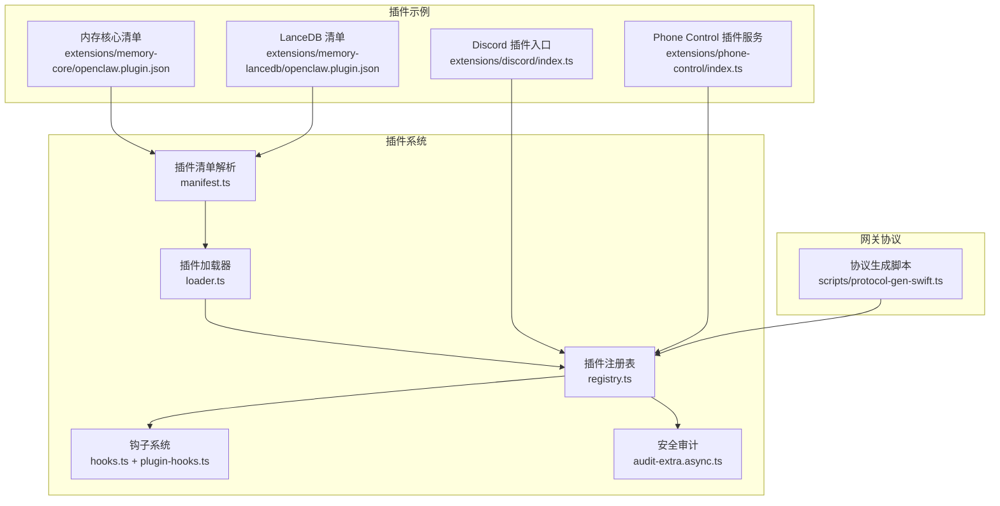
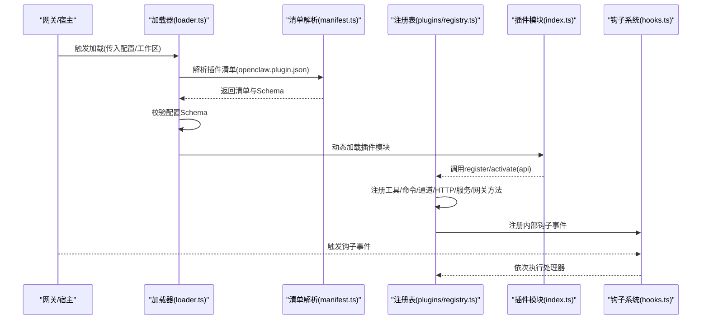
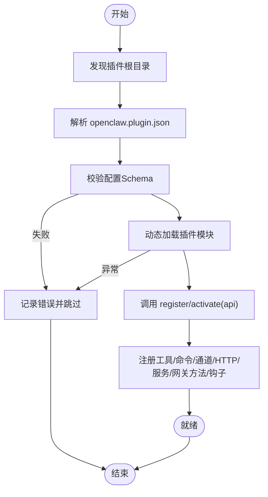
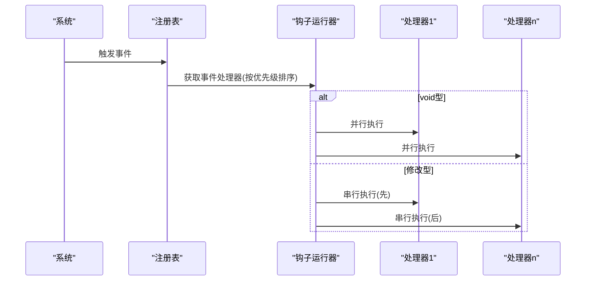
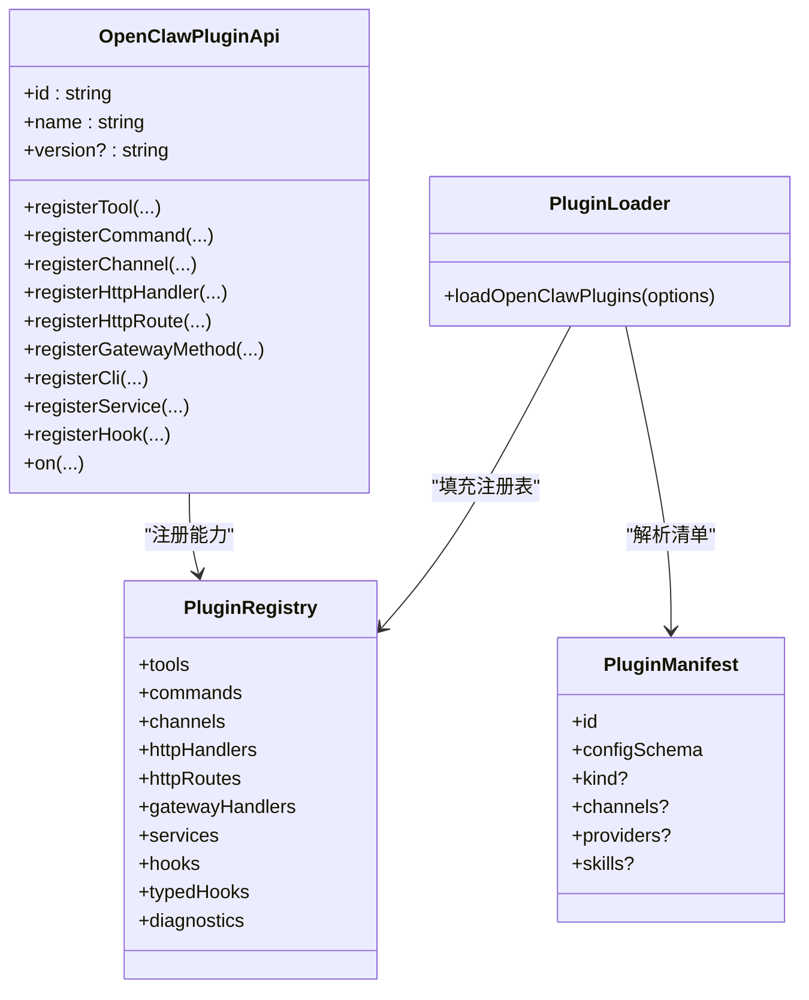

# 插件API

<cite>
**本文引用的文件**
- [docs/plugins/manifest.md](file://docs/plugins/manifest.md)
- [src/plugins/types.ts](file://src/plugins/types.ts)
- [src/plugins/loader.ts](file://src/plugins/loader.ts)
- [src/plugins/registry.ts](file://src/plugins/registry.ts)
- [src/plugins/manifest.ts](file://src/plugins/manifest.ts)
- [src/hooks/plugin-hooks.ts](file://src/hooks/plugin-hooks.ts)
- [src/hooks/hooks.ts](file://src/hooks/hooks.ts)
- [src/security/audit-extra.async.ts](file://src/security/audit-extra.async.ts)
- [extensions/memory-core/openclaw.plugin.json](file://extensions/memory-core/openclaw.plugin.json)
- [extensions/memory-lancedb/openclaw.plugin.json](file://extensions/memory-lancedb/openclaw.plugin.json)
- [extensions/discord/index.ts](file://extensions/discord/index.ts)
- [extensions/phone-control/index.ts](file://extensions/phone-control/index.ts)
- [scripts/protocol-gen-swift.ts](file://scripts/protocol-gen-swift.ts)
- [docs/refactor/plugin-sdk.md](file://docs/refactor/plugin-sdk.md)
- [docs/zh-CN/refactor/plugin-sdk.md](file://docs/zh-CN/refactor/plugin-sdk.md)
</cite>

## 目录

1. [简介](#简介)
2. [项目结构](#项目结构)
3. [核心组件](#核心组件)
4. [架构总览](#架构总览)
5. [详细组件分析](#详细组件分析)
6. [依赖关系分析](#依赖关系分析)
7. [性能考量](#性能考量)
8. [故障排查指南](#故障排查指南)
9. [结论](#结论)
10. [附录](#附录)

## 简介

本文件面向OpenClaw插件开发者，系统性阐述插件API的设计与扩展机制，覆盖插件清单(openclaw.plugin.json)结构、生命周期管理、与网关通信协议、钩子与事件监听、安全模型与权限控制，以及打包、发布与版本管理最佳实践。内容基于仓库中的插件系统源码与文档，帮助开发者快速构建稳定、可维护且安全的插件。

## 项目结构

OpenClaw的插件系统由“清单解析”“加载器”“注册表”“钩子系统”“安全审计”等模块组成，并通过统一的插件API暴露给插件作者。插件清单位于插件根目录，用于声明元信息、能力与配置Schema；加载器负责发现、校验与实例化插件；注册表聚合各类插件能力；钩子系统提供事件驱动的扩展点；安全审计在运行前识别潜在风险。

图示来源

- [src/plugins/manifest.ts](file://src/plugins/manifest.ts#L1-L77)
- [src/plugins/loader.ts](file://src/plugins/loader.ts#L170-L457)
- [src/plugins/registry.ts](file://src/plugins/registry.ts#L146-L516)
- [src/hooks/hooks.ts](file://src/hooks/hooks.ts#L93-L152)
- [src/hooks/plugin-hooks.ts](file://src/hooks/plugin-hooks.ts#L60-L117)
- [src/security/audit-extra.async.ts](file://src/security/audit-extra.async.ts#L287-L321)
- [extensions/discord/index.ts](file://extensions/discord/index.ts#L1-L17)
- [extensions/phone-control/index.ts](file://extensions/phone-control/index.ts#L286-L337)
- [extensions/memory-core/openclaw.plugin.json](file://extensions/memory-core/openclaw.plugin.json#L1-L10)
- [extensions/memory-lancedb/openclaw.plugin.json](file://extensions/memory-lancedb/openclaw.plugin.json#L1-L61)
- [scripts/protocol-gen-swift.ts](file://scripts/protocol-gen-swift.ts#L200-L244)

章节来源

- [src/plugins/manifest.ts](file://src/plugins/manifest.ts#L1-L77)
- [src/plugins/loader.ts](file://src/plugins/loader.ts#L170-L457)
- [src/plugins/registry.ts](file://src/plugins/registry.ts#L146-L516)
- [src/hooks/plugin-hooks.ts](file://src/hooks/plugin-hooks.ts#L60-L117)
- [src/hooks/hooks.ts](file://src/hooks/hooks.ts#L93-L152)
- [src/security/audit-extra.async.ts](file://src/security/audit-extra.async.ts#L287-L321)
- [extensions/discord/index.ts](file://extensions/discord/index.ts#L1-L17)
- [extensions/phone-control/index.ts](file://extensions/phone-control/index.ts#L286-L337)
- [extensions/memory-core/openclaw.plugin.json](file://extensions/memory-core/openclaw.plugin.json#L1-L10)
- [extensions/memory-lancedb/openclaw.plugin.json](file://extensions/memory-lancedb/openclaw.plugin.json#L1-L61)
- [scripts/protocol-gen-swift.ts](file://scripts/protocol-gen-swift.ts#L200-L244)

## 核心组件

- 插件清单(openclaw.plugin.json)：声明插件id、名称、描述、版本、能力列表与配置Schema，是严格校验的基础。
- 插件API：插件注册时注入的运行时接口，提供工具、命令、通道、HTTP路由、网关方法、服务、钩子等注册能力。
- 加载器：发现插件、加载清单、校验配置Schema、实例化插件模块并调用register/activate。
- 注册表：集中管理插件能力注册结果，维护诊断信息与状态。
- 钩子系统：支持事件驱动的扩展点，按优先级顺序串行或并行执行处理器。
- 安全审计：扫描插件扩展路径、检查未允许的扩展、验证配置与权限设置。

章节来源

- [docs/plugins/manifest.md](file://docs/plugins/manifest.md#L9-L72)
- [src/plugins/types.ts](file://src/plugins/types.ts#L244-L283)
- [src/plugins/loader.ts](file://src/plugins/loader.ts#L170-L457)
- [src/plugins/registry.ts](file://src/plugins/registry.ts#L146-L516)
- [src/hooks/hooks.ts](file://src/hooks/hooks.ts#L93-L152)
- [src/security/audit-extra.async.ts](file://src/security/audit-extra.async.ts#L287-L321)

## 架构总览

下图展示从发现到注册、再到钩子触发的整体流程。

图示来源

- [src/plugins/loader.ts](file://src/plugins/loader.ts#L170-L457)
- [src/plugins/manifest.ts](file://src/plugins/manifest.ts#L44-L77)
- [src/plugins/registry.ts](file://src/plugins/registry.ts#L468-L516)
- [src/hooks/hooks.ts](file://src/hooks/hooks.ts#L93-L152)

章节来源

- [src/plugins/loader.ts](file://src/plugins/loader.ts#L170-L457)
- [src/plugins/registry.ts](file://src/plugins/registry.ts#L468-L516)
- [src/hooks/hooks.ts](file://src/hooks/hooks.ts#L93-L152)

## 详细组件分析

### 插件清单与配置Schema

- 必填字段：id、configSchema。
- 可选字段：kind、channels、providers、skills、name、description、version、uiHints。
- 清单用于严格配置校验，缺失或非法将导致插件错误并阻断配置生效。
- uiHints用于UI渲染提示、敏感字段标记与占位符。

章节来源

- [docs/plugins/manifest.md](file://docs/plugins/manifest.md#L18-L72)
- [src/plugins/manifest.ts](file://src/plugins/manifest.ts#L10-L21)
- [extensions/memory-core/openclaw.plugin.json](file://extensions/memory-core/openclaw.plugin.json#L1-L10)
- [extensions/memory-lancedb/openclaw.plugin.json](file://extensions/memory-lancedb/openclaw.plugin.json#L1-L61)

### 插件生命周期管理

- 发现：遍历候选路径与工作区，收集插件根目录。
- 加载：解析清单、校验配置Schema、动态加载模块。
- 初始化：调用插件导出的register/activate，注入OpenClawPluginApi。
- 运行：注册工具、命令、通道、HTTP、服务、网关方法、钩子。
- 卸载：清理命令、服务、HTTP路由等资源（卸载流程见卸载相关逻辑）。

图示来源

- [src/plugins/loader.ts](file://src/plugins/loader.ts#L200-L441)
- [src/plugins/manifest.ts](file://src/plugins/manifest.ts#L44-L77)
- [src/plugins/registry.ts](file://src/plugins/registry.ts#L468-L516)

章节来源

- [src/plugins/loader.ts](file://src/plugins/loader.ts#L170-L457)
- [src/plugins/registry.ts](file://src/plugins/registry.ts#L468-L516)

### 插件API与能力注册

- 工具：registerTool(factory|tool, opts)
- 命令：registerCommand(def)
- 通道：registerChannel(registration|plugin)
- HTTP：registerHttpHandler(handler)、registerHttpRoute({path, handler})
- 网关方法：registerGatewayMethod(method, handler)
- CLI：registerCli(registrar, opts)
- 服务：registerService(service)
- 钩子：registerHook(events, handler, opts)、on(hookName, handler, opts)

章节来源

- [src/plugins/types.ts](file://src/plugins/types.ts#L244-L283)
- [src/plugins/registry.ts](file://src/plugins/registry.ts#L168-L443)

### 钩子函数与事件监听机制

- 支持的钩子名：before_agent_start、agent_end、before_compaction、after_compaction、message_received、message_sending、message_sent、before_tool_call、after_tool_call、tool_result_persist、session_start、session_end、gateway_start、gateway_stop。
- 事件驱动：插件可通过registerHook(events, handler, opts)注册事件处理器；也可使用on(hookName, handler, {priority})进行类型化注册。
- 执行策略：
  - void型钩子：并行执行所有处理器，适合副作用类事件。
  - 修改型钩子：按优先级顺序串行执行，合并返回结果，适合上下文修改场景。

图示来源

- [src/hooks/hooks.ts](file://src/hooks/hooks.ts#L93-L152)
- [src/plugins/types.ts](file://src/plugins/types.ts#L298-L538)

章节来源

- [src/hooks/plugin-hooks.ts](file://src/hooks/plugin-hooks.ts#L60-L117)
- [src/hooks/hooks.ts](file://src/hooks/hooks.ts#L93-L152)
- [src/plugins/types.ts](file://src/plugins/types.ts#L298-L538)

### 与网关的通信协议与数据交换

- 网关方法：插件可通过registerGatewayMethod(method, handler)向网关注册自定义RPC方法，供客户端或内部调用。
- 协议生成：协议值结构与帧枚举由脚本生成，确保跨语言一致性（如Swift端）。
- 数据交换：通过OpenClawPluginApi.runtime提供的通道能力进行消息分发、媒体处理、路由与配对等。

章节来源

- [src/plugins/registry.ts](file://src/plugins/registry.ts#L265-L285)
- [scripts/protocol-gen-swift.ts](file://scripts/protocol-gen-swift.ts#L200-L244)
- [docs/refactor/plugin-sdk.md](file://docs/refactor/plugin-sdk.md#L45-L145)
- [docs/zh-CN/refactor/plugin-sdk.md](file://docs/zh-CN/refactor/plugin-sdk.md#L52-L152)

### 安全模型与权限控制

- 插件扩展白名单：若存在扩展目录而未设置plugins.allow，将发出高风险警告，建议显式列出受信任插件id。
- 插件清单与Schema：强制要求清单与Schema，避免未知能力与不可控配置。
- 配置校验：在配置读写阶段即进行Schema校验，而非运行时，降低运行期风险。
- 权限与执行模式：安全审计包含对路径权限、包含文件、原生技能启用等检查，辅助识别潜在风险面。

章节来源

- [src/security/audit-extra.async.ts](file://src/security/audit-extra.async.ts#L287-L321)
- [docs/plugins/manifest.md](file://docs/plugins/manifest.md#L47-L72)

### 插件开发示例

#### 基础插件模板

- 入口导出一个对象或函数，包含id、name、description、configSchema与register/activate回调。
- 在register中使用api.register\*系列方法注册所需能力。
- 示例参考：Discord插件入口与Phone Control服务。

章节来源

- [extensions/discord/index.ts](file://extensions/discord/index.ts#L6-L17)
- [extensions/phone-control/index.ts](file://extensions/phone-control/index.ts#L286-L337)

#### 高级功能实现

- 服务：通过registerService注册周期性任务或后台守护，包含start/stop生命周期。
- 命令：通过registerCommand注册简单命令，绕过LLM直接处理状态切换或查询。
- 钩子：通过registerHook或on注册事件处理器，参与消息收发、工具调用、会话生命周期等。

章节来源

- [src/plugins/types.ts](file://src/plugins/types.ts#L218-L222)
- [src/plugins/types.ts](file://src/plugins/types.ts#L179-L190)
- [src/hooks/plugin-hooks.ts](file://src/hooks/plugin-hooks.ts#L60-L117)

### 插件打包、发布与版本管理

- 版本解析：通过包内版本或构建信息解析插件SDK版本，便于调试与兼容性判断。
- 更新策略：仅支持npm来源的插件更新，校验已安装版本并回填记录。
- 包装与校验：安装归档包时禁止路径穿越等危险模式，确保安全性。

章节来源

- [src/version.test.ts](file://src/version.test.ts#L76-L86)
- [src/plugins/update.ts](file://src/plugins/update.ts#L154-L287)
- [src/plugins/install.test.ts](file://src/plugins/install.test.ts#L275-L309)

## 依赖关系分析

图示来源

- [src/plugins/types.ts](file://src/plugins/types.ts#L244-L283)
- [src/plugins/registry.ts](file://src/plugins/registry.ts#L124-L138)
- [src/plugins/loader.ts](file://src/plugins/loader.ts#L170-L457)
- [src/plugins/manifest.ts](file://src/plugins/manifest.ts#L10-L21)

章节来源

- [src/plugins/types.ts](file://src/plugins/types.ts#L244-L283)
- [src/plugins/registry.ts](file://src/plugins/registry.ts#L124-L138)
- [src/plugins/loader.ts](file://src/plugins/loader.ts#L170-L457)
- [src/plugins/manifest.ts](file://src/plugins/manifest.ts#L10-L21)

## 性能考量

- 并行执行：void型钩子并行触发，提升吞吐；修改型钩子串行以保证一致性。
- 缓存键：加载器使用缓存键避免重复加载，加速测试与重载。
- 路由与HTTP：HTTP路由去重与规范化，减少冲突与匹配开销。
- 日志与诊断：通过诊断数组集中记录问题，便于定位瓶颈与错误。

章节来源

- [src/hooks/hooks.ts](file://src/hooks/hooks.ts#L93-L152)
- [src/plugins/loader.ts](file://src/plugins/loader.ts#L77-L83)
- [src/plugins/registry.ts](file://src/plugins/registry.ts#L296-L326)

## 故障排查指南

- 清单缺失或非法：检查openclaw.plugin.json是否存在、id与configSchema是否满足要求。
- 配置Schema不匹配：根据诊断信息修正配置，确保与清单Schema一致。
- 重复注册：HTTP路由、命令、提供者等重复注册会触发错误诊断。
- 钩子无事件：注册钩子时需提供至少一个事件，否则会被跳过并记录警告。
- 安全告警：若存在扩展但未设置plugins.allow，应立即配置白名单。

章节来源

- [src/plugins/loader.ts](file://src/plugins/loader.ts#L283-L295)
- [src/plugins/registry.ts](file://src/plugins/registry.ts#L296-L326)
- [src/hooks/plugin-hooks.ts](file://src/hooks/plugin-hooks.ts#L81-L88)
- [src/security/audit-extra.async.ts](file://src/security/audit-extra.async.ts#L287-L298)

## 结论

OpenClaw插件系统通过严格的清单与Schema、清晰的生命周期与API、灵活的钩子机制与安全审计，为开发者提供了可扩展、可维护且安全的插件生态。遵循本文档的结构与最佳实践，可高效构建高质量插件并保障整体系统稳定运行。

## 附录

### 插件清单字段说明

- id：插件唯一标识
- configSchema：插件配置的JSON Schema
- kind：插件类型（如memory）
- channels/providers/skills：声明的能力与资源
- name/description/version：元信息
- uiHints：UI渲染提示与敏感字段标记

章节来源

- [docs/plugins/manifest.md](file://docs/plugins/manifest.md#L18-L46)
- [src/plugins/manifest.ts](file://src/plugins/manifest.ts#L10-L21)

### 钩子事件一览

- before_agent_start、agent_end
- before_compaction、after_compaction
- message_received、message_sending、message_sent
- before_tool_call、after_tool_call、tool_result_persist
- session_start、session_end
- gateway_start、gateway_stop

章节来源

- [src/plugins/types.ts](file://src/plugins/types.ts#L298-L312)
